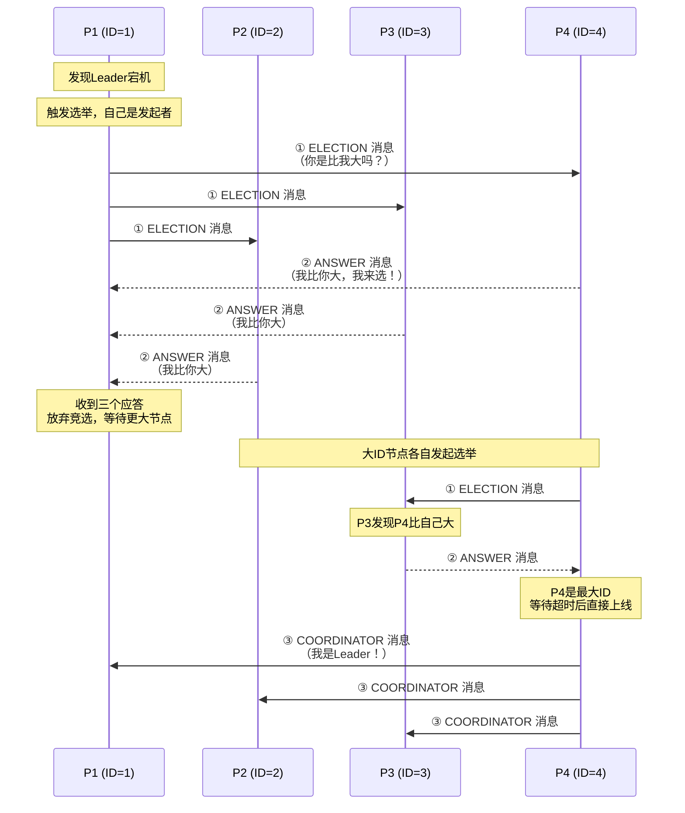

# Bully选举算法
> 创建日期：2026-06-08
> 难度：⭐⭐
> 前置知识：Leader选举、分布式节点通信
> 关联模块：分布式一致性、Leader选举、P2P通信

## ⭐ 面试重点速览
| 考察点 | 重要程度 | 考察频率 | 掌握目标 |
|--------|----------|----------|----------|
| Bully算法核心思想 | ⭐⭐⭐⭐⭐ | ⭐⭐⭐⭐ | 理解ID最大胜出的原理 |
| 选举触发条件 | ⭐⭐⭐⭐⭐ | ⭐⭐⭐⭐ | 掌握三种触发场景 |
| 三次握手消息流程 | ⭐⭐⭐⭐ | ⭐⭐⭐ | 理解消息交互过程 |
| 网络分区问题 | ⭐⭐⭐⭐ | ⭐⭐⭐ | 理解脑裂产生原因 |
| Bully与其他选举算法对比 | ⭐⭐⭐ | ⭐⭐ | 了解适用场景差异 |

## 一、应用场景 🎯

Bully选举算法是一种经典的分布式Leader选举算法，广泛应用于以下场景：

1. **分布式协调器选举**
   - 在分布式系统中选举Master节点
   - Zookeeper早期版本采用了类似思路（后改为ZAB）

2. **集群主节点故障接管**
   - 当集群Master宕机时，自动选举新的Master
   - 保证集群服务的持续可用

3. **Elasticsearch集群选举**
   - ES集群中的Master Node选举借鉴了Bully思想
   - 基于节点ID和优先级进行竞选

4. **数据库主从切换**
   - 传统数据库的主从拓扑中，自动选出主节点
   - 主节点宕机后，从节点之间竞选新主

5. **教学与研究场景**
   - 作为分布式Leader选举的入门算法
   - 帮助理解选举的本质问题和设计挑战

## 二、核心原理 🔬

### 2.1 核心思想

Bully算法的名称来源于其核心行为：**"欺软怕硬"**。就像校园霸凌中，"校霸"欺负比他弱的，但当遇到更强者时自己就怂了。

- 每个节点分配一个唯一单调递增的ID
- **ID最大者是天生的Leader候选**
- 小ID的节点没资格挑战大ID的节点
- 大ID节点"欺负"小ID节点，直接宣告自己成为Leader

### 2.2 三种选举触发条件

1. **被动发现**：向Leader发请求，Leader无响应，判定Leader宕机
2. **主动询问**：新节点加入集群，主动询问谁是Leader
3. **Leader宣告**：节点认为自己应该是Leader（如刚加入且ID最大），广播宣告

### 2.3 选举过程（三次握手）



### 2.4 三种消息类型

| 消息类型 | 方向 | 含义 |
|---------|------|------|
| ELECTION | 小ID → 大ID | "嗨，你比我大吗？" |
| ANSWER | 大ID → 小ID | "是的，我比你大，我来选！" |
| COORDINATOR | 新Leader → 所有节点 | "你们都听好，我是新Leader！" |

### 2.5 算法流程详解

**步骤一：节点P发现Leader宕机，发起选举**
- 节点P向所有ID比自己大的节点发送ELECTION消息

**步骤二：等待其他节点回复**
- 如果收到了ANSWER消息，说明有节点的ID比自己大
- 此时节点P放弃竞选，等待大节点选举结束
- 如果超时没人应答，说明自己就是最大ID节点
- 此时节点P直接发送COORDINATOR消息，宣告自己成为Leader

**步骤三：大节点接力选举**
- 收到ELECTION消息的大节点，继续向比自己更大的节点发ELECTION消息
- 这个过程不断延续，直到最大的闂节点无人应答

**步骤四：最大节点宣告胜利**
- 最终，ID最大的节点发现无人回应自己的ELECTION消息
- 广播COORDINATOR消息，正式当选为Leader

## 三、趣味解说 🎭

想象一下，班级要选**班长**：

规则很简单——**谁学号最大谁就能当班长**！听起来很霸道（Bully）对吧？

一天，原班长突然转学了（Leader宕机）...

同学P1（学号1）发现自己发的消息没有得到班长的回复，于是大喊：
> "喂！班里谁的学号比我大？我要选新班长！"

P2、P3、P4纷纷回应："我比你大！"

P1立刻就怂了："好吧，你们大，你们来选。"然后闭嘴等待。

但P2（学号2）也觉得不够资格，继续喊："还有没有比我学号更大的？"

P3、P4又回应了。P3接着喊，结果被P4回应。

到了P4（学号4），他喊了半天没人回应——因为他就是学号最大的！

于是P4站在讲台上宣布："**我就是新班长了！大家听我指挥！**" 📢

为什么叫Bully（霸凌）？因为选举过程中，大ID"欺负"小ID，小ID完全没有还手之力。当一个更强的对手出现，原来的强者也会低头认命。这就是典型的"**以大欺小**"逻辑！

不过要注意，如果教室突然被墙隔成两半（网络分区），两边都会各选出一个"最大的"，导致两个"班长"同时存在——这就是著名的**脑裂**问题！😱

## 四、代码实现 💻

以下是用Java实现Bully选举算法的示例代码：

```java
import java.util.*;
import java.util.concurrent.*;
import java.util.concurrent.atomic.AtomicBoolean;

/**
 * Bully选举算法 - 消息类型枚举
 */
enum BullyMessageType {
    ELECTION,     // 发起选举：问有没有比我更大的?
    ANSWER,       // 回复：我比你大!
    COORDINATOR   // 宣告：我是Leader!
}

/**
 * 消息对象
 */
class BullyMessage {
    final BullyMessageType type;
    final int fromId;      // 发送者ID
    final int toId;        // 接收者ID（-1表示广播）

    public BullyMessage(BullyMessageType type, int fromId, int toId) {
        this.type = type;
        this.fromId = fromId;
        this.toId = toId;
    }

    @Override
    public String toString() {
        return String.format("[%s] %d -> %d", type, fromId, 
                           toId == -1 ? "ALL" : toId);
    }
}

/**
 * 单个节点实现
 */
class BullyNode {
    private final int id;                              // 节点唯一ID
    private final List<BullyNode> cluster;              // 集群节点列表
    private final BlockingQueue<BullyMessage> inbox;    // 消息队列

    private volatile int leaderId = -1;                 // 当前Leader ID
    private final AtomicBoolean electionInProgress;     // 是否正在选举中
    private final ScheduledExecutorService scheduler;   // 定时任务

    // 配置参数
    private static final long ELECTION_TIMEOUT_MS = 2000;    // 选举超时
    private static final long HEARTBEAT_INTERVAL_MS = 3000;  // 心跳间隔

    public BullyNode(int id, List<BullyNode> cluster) {
        this.id = id;
        this.cluster = cluster;
        this.inbox = new LinkedBlockingQueue<>();
        this.electionInProgress = new AtomicBoolean(false);
        this.scheduler = Executors.newSingleThreadScheduledExecutor();
    }

    public int getId() { return id; }
    public int getLeaderId() { return leaderId; }

    /**
     * 启动节点
     */
    public void start() {
        System.out.println("Node " + id + " started.");

        // 新节点加入，检查是否需要发起选举
        checkAndStartElection();

        // 启动消息处理线程
        new Thread(this::processMessages, "node-" + id + "-msg-handler").start();

        // 启动心跳检测，定期检查Master是否存活
        scheduler.scheduleAtFixedRate(
            this::checkLeaderHealth,
            HEARTBEAT_INTERVAL_MS,
            HEARTBEAT_INTERVAL_MS,
            TimeUnit.MILLISECONDS
        );
    }

    /**
     * 接收消息（由其他节点调用）
     */
    public void receiveMessage(BullyMessage msg) {
        if (msg.toId == -1 || msg.toId == this.id) {
            inbox.offer(msg);
        }
    }

    /**
     * 主消息处理循环
     */
    private void processMessages() {
        while (!Thread.currentThread().isInterrupted()) {
            try {
                BullyMessage msg = inbox.poll(1, TimeUnit.SECONDS);
                if (msg == null) continue;

                switch (msg.type) {
                    case ELECTION:
                        handleElection(msg);
                        break;
                    case ANSWER:
                        handleAnswer(msg);
                        break;
                    case COORDINATOR:
                        handleCoordinator(msg);
                        break;
                }
            } catch (InterruptedException e) {
                Thread.currentThread().interrupt();
                break;
            }
        }
    }

    /**
     * 处理ELECTION消息
     */
    private void handleElection(BullyMessage msg) {
        System.out.println("Node " + id + " received ELECTION from " + msg.fromId);

        // 如果发送者ID比我大，不应该出现（应该是小ID发给大ID）
        if (msg.fromId > this.id) {
            System.out.println("Node " + id + " ignoring ELECTION from " + msg.fromId +
                             " (sender has larger ID, abnormal)");
            return;
        }

        // 回复ANSWER：告诉对方我比你大
        BullyNode sender = getNodeById(msg.fromId);
        if (sender != null) {
            BullyMessage answer = new BullyMessage(BullyMessageType.ANSWER, this.id, msg.fromId);
            sender.receiveMessage(answer);
            System.out.println("Node " + id + " sent ANSWER to " + msg.fromId);
        }

        // 我也要发起选举，向比我更大的节点发ELECTION
        startElection();
    }

    /**
     * 处理ANSWER消息
     */
    private void handleAnswer(BullyMessage msg) {
        System.out.println("Node " + id + " received ANSWER from " + msg.fromId +
                         " (has larger ID, give up)");

        // 收到ANSWER说明有比我大的节点，放弃竞选
        electionInProgress.set(false);
        // 等待更大的节点最终宣告成为Leader
    }

    /**
     * 处理COORDINATOR消息
     */
    private void handleCoordinator(BullyMessage msg) {
        int newLeader = msg.fromId;
        System.out.println("Node " + id + " received COORDINATOR from " + newLeader +
                         ", accepting as new Leader");

        this.leaderId = newLeader;
        electionInProgress.set(false);
    }

    /**
     * 检查并开始选举
     */
    private void checkAndStartElection() {
        // 检查当前是否有公认的Leader
        if (leaderId != -1) {
            BullyNode leader = getNodeById(leaderId);
            if (leader != null) {
                System.out.println("Node " + id + " found existing Leader: " + leaderId);
                return;
            }
        }
        // 检查是否有比我大的节点是Leader
        startElection();
    }

    /**
     * 开始选举流程
     */
    private void startElection() {
        // 防止重复发起选举
        if (!electionInProgress.compareAndSet(false, true)) {
            return; // 已在选举中
        }

        System.out.println("Node " + id + " initiating election...");

        // 向所有ID比我大的节点发送ELECTION
        boolean hasLargerNodes = false;
        for (BullyNode node : cluster) {
            if (node.getId() > this.id) {
                BullyMessage electionMsg = new BullyMessage(
                    BullyMessageType.ELECTION, this.id, node.getId()
                );
                node.receiveMessage(electionMsg);
                hasLargerNodes = true;
                System.out.println("Node " + id + " sent ELECTION to " + node.getId());
            }
        }

        if (!hasLargerNodes) {
            // 没有比我更大的节点，直接宣告成为Leader
            declareVictory();
            return;
        }

        // 等待ANSWER，设置超时
        // 简单实现：使用延迟检查
        scheduler.schedule(() -> {
            // 如果超时后仍在选举中，说明没人回应，自己最大
            if (electionInProgress.get()) {
                System.out.println("Node " + id + " election timeout, no larger node responded.");
                // 注意：这里简化了判断——实际需要确认没有更大的存活节点
                declareVictory();
            }
        }, ELECTION_TIMEOUT_MS, TimeUnit.MILLISECONDS);
    }

    /**
     * 宣告胜利，广播COORDINATOR
     */
    private void declareVictory() {
        leaderId = this.id;
        electionInProgress.set(false);
        System.out.println("=== Node " + id + " is the new LEADER! Broadcasting COORDINATOR ===");

        // 向所有节点广播COORDINATOR消息
        for (BullyNode node : cluster) {
            if (node.getId() != this.id) {
                BullyMessage coordMsg = new BullyMessage(
                    BullyMessageType.COORDINATOR, this.id, -1
                );
                node.receiveMessage(coordMsg);
            }
        }
    }

    /**
     * 检查Leader是否存活（心跳检测）
     */
    private void checkLeaderHealth() {
        if (leaderId == -1 || leaderId == this.id) return;

        // 简单模拟：如果当前Leader ID存在且可达，则正常
        BullyNode leader = getNodeById(leaderId);
        if (leader == null) {
            System.out.println("Node " + id + " detects Leader " + leaderId +
                             " is dead, triggering election!");
            leaderId = -1;
            startElection();
        }
    }

    /**
     * 根据ID查找节点
     */
    private BullyNode getNodeById(int targetId) {
        return cluster.stream()
            .filter(n -> n.getId() == targetId)
            .findFirst()
            .orElse(null);
    }

    /**
     * 关闭节点
     */
    public void shutdown() {
        scheduler.shutdown();
    }
}

/**
 * Bully选举算法演示
 */
public class BullyElectionDemo {
    public static void main(String[] args) throws Exception {
        // 创建集群节点列表
        List<BullyNode> cluster = new ArrayList<>();
        ExecutorService executor = Executors.newCachedThreadPool();

        // 创建5个节点，ID分别为1,2,3,4,5
        for (int i = 1; i <= 5; i++) {
            cluster.add(new BullyNode(i, cluster));
        }

        // 启动节点（ID最大的节点5将自动成为Leader）
        System.out.println("=== Starting all nodes ===");
        for (BullyNode node : cluster) {
            node.start();
        }

        Thread.sleep(5000);

        // 模拟Leader（节点5）宕机
        System.out.println("\n=== Simulating Leader (Node 5) failure ===");
        cluster.get(4).shutdown(); // 节点5离线

        // 从集群中移除
        cluster.remove(4);

        Thread.sleep(8000);

        System.out.println("\n=== Election Results ===");
        for (BullyNode node : cluster) {
            System.out.println("Node " + node.getId() + " sees Leader as " + node.getLeaderId());
        }

        executor.shutdown();
    }
}
```

## 五、优缺点 ⚖️

### 优点 ✅

1. **思路简单直观**
   - "ID最大者当Leader"的规则非常简单
   - 容易理解和实现，适合教学

2. **收敛速度快**
   - 在最理想情况下，最大ID的节点直接当选
   - 不需要多轮投票或协调

3. **无中心化依赖**
   - 所有节点地位平等
   - 不需要专门的选举协调器

4. **天然稳定**
   - ID天生有序，不会产生"平局"问题
   - 只要ID是全局唯一的，一定能有胜负

### 缺点 ❌

1. **网络分区导致脑裂**
   - 如果网络被分割为两个分区，两边都会选出一个"最大ID"
   - 网络恢复后会有两个Leader同时存在
   - 这是Bully算法最严重的缺陷

2. **消息复杂度较高**
   - 在最坏情况下（最小ID节点发起选举），消息复杂度为O(N²)
   - 每次选举都可能产生大量消息

3. **大ID有先天优势**
   - 意味着"永久的强者"，小ID节点永远没有当Leader的机会
   - 负载不均，大ID节点压力更大

4. **节点假死问题**
   - 节点假死（短暂不可达后又恢复）会导致不必要的选举
   - 频繁选举影响系统稳定性

5. **缺乏Quorum机制**
   - 没有法定人数概念
   - 只要最大的节点认为自己是Leader，就可以单方面宣告

## 六、面试高频题 📝

### Q1: Bully选举算法的核心思想是什么？

**A**:
Bully算法的核心思想是：在每个节点有唯一ID的前提下，最大的ID天然就是Leader。选举时，节点向比自己大的节点发送ELECTION消息，如果收到ANSWER就放弃竞选，只有等到超时没人应答才宣布当选Leader，最后广播COORDINATOR消息通知所有节点。

### Q2: Bully算法中三种消息类型分别是什么？

**A**:
1. **ELECTION**：小ID节点发给大ID节点，发起选举
2. **ANSWER**：大ID节点回复给小ID节点，表示"我比你大，我来选举"
3. **COORDINATOR**：最终当选的Leader发给所有节点，宣告"我是老大"

### Q3: Bully算法的最大缺陷是什么？

**A**:
最大的缺陷是**网络分区导致的脑裂问题**。因为Bully没有Quorum机制，当网络被切分成两个或多个分区时，每个分区内的最大节点都会认为自己是全局最大并宣告成为Leader，导致多个Leader同时存在。网络恢复后，会出现数据冲突和不一致。

### Q4: Bully选举中最小ID节点触发选举会发生什么？

**A**:
最坏情况—产生大量的选举消息。最小ID节点向所有N-1个比自己大的节点发ELECTION；每个大节点收到后，也分别向比自己更大的节点发ELECTION。最终消息总数约为O(N²)级别。

### Q5: 如何改进Bully算法避免脑裂？

**A**:
可以引入以下机制改进：
- 引入**Quorum机制**：只有获得超过半数节点认可才能成为Leader
- 引入**epoch/term机制**：类似Raft，给每轮选举加上版本号
- 引入**第三方仲裁**：如ZooKeeper做选举仲裁

## 七、常见误区 ❌

### 误区1：Bully算法是分布式系统的推荐方案 ❌

**正确理解**：Bully算法虽然简单易懂，但由于脑裂问题和O(N²)的消息开销，生产环境几乎不会直接使用。现代分布式系统更倾向于Raft、ZAB等更完善的共识算法。Bully主要用于教学。

### 误区2：Bully选举中的ID必须是连续的 ❌

**正确理解**：Bully只需要ID可以排序比较（全序关系），不要求是连续的。可以使用任何可排序的标识，如IP地址的整型表示、时间戳、哈希值等。

### 误区3：收到ANSWER消息后节点永远放弃选举 ❌

**正确理解**：节点在等待一段时间后如果没收到COORDINATOR（即更大的节点宣告成为Leader），应该重新发起选举。因为那个更大的节点可能发生了意外。

### 误区4：Bully选举一定能快速选出Leader ❌

**正确理解**：在最坏情况下，所有存活节点都需要参与消息交互，可能导致选举时间较长。如果网络状况不佳，超时重传会进一步增加选举时间。

### 误区5：Bully算法只适用于小型集群 ❌

**正确理解**：理论上，Bully算法对集群规模没有严格限制。但节点数越多，消息开销越大（O(N²)），选举效率越低。此外，节点数多时网络分区风险也更高。

### 误区6：节点可以随时加入选举 ❌

**正确理解**：在Bully实现中，通常一个节点在收到COORDINATOR之前不会响应新的ELECTION。这是为了避免选举状态混乱。新节点加入时应该先检查已有Leader，而不是直接发起选举。