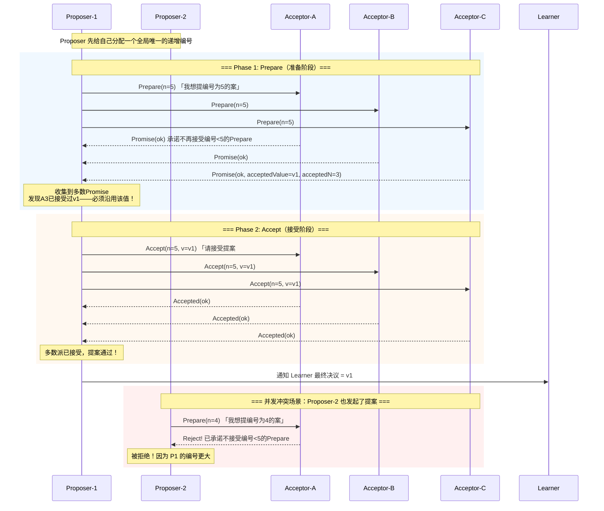

# Paxos 算法
> 创建日期：2026-06-08
> 难度：⭐⭐⭐
> 前置知识：分布式系统基础、Quorum 机制、状态机复制
> 关联模块：Chubby / ZooKeeper (ZAB) / Google Spanner

## ⭐ 面试重点速览
| 考察点 | 重要程度 | 考察频率 | 掌握目标 |
|--------|---------|---------|---------|
| Basic Paxos 两阶段流程（Prepare/Accept） | ★★★★★ | 极高 | 能画出时序图，解释为什么需要两阶段 |
| 提案编号规则与冲突仲裁 | ★★★★ | 高 | 理解「编号更大者优先」保证安全性 |
| Multi-Paxos 与 Leader 优化 | ★★★★ | 高 | 知道如何从 Basic Paxos 演进到生产可用 |
| 活锁问题及解决方案 | ★★★ | 中 | 能描述活锁场景，说出随机退避 / Leader 两种解法 |
| 与 Raft 的对比 | ★★★★ | 高 | 从可理解性、工程性、Leader 机制角度对比 |
| 与 ZAB（ZooKeeper）的关系 | ★★★ | 中 | 理解 ZAB 是类 Paxos 协议，简化了恢复阶段 |

---

## 一、应用场景 🎯

Paxos 是 Leslie Lamport 于 1990 年提出的分布式共识算法，被认为是分布式系统理论中最重要的算法之一。尽管因其复杂性和难以理解著称，Paxos 及其变体在生产系统中有着广泛的应用。

**典型落地场景：**

| 场景 | 代表项目 | Paxos 的角色 |
|------|---------|------------|
| 分布式锁服务 | Google Chubby | 保证锁状态的强一致性 |
| 分布式协调服务 | ZooKeeper (ZAB) | ZAB 是类 Paxos 协议，保证事务日志一致 |
| 全球分布式数据库 | Google Spanner | TrueTime + Paxos 实现全球级强一致 |
| 分布式 KV 存储 | Apache Ratis | Multi-Paxos 实现的共识库 |
| 消息队列元数据 | Apache Pulsar | 使用 BookKeeper + Paxos 管理元数据 |

---

## 二、核心原理 🔬

### 2.1 Basic Paxos：两阶段提交

Paxos 中有三种角色（一个节点可身兼多角）：
- **Proposer（提案者）**：发起提案（即写入请求）
- **Acceptor（接收者）**：对提案进行投票
- **Learner（学习者）**：接收最终决议，不参与投票

共识的前提：N 个 Acceptors，只需要超过半数（Quorum = N/2+1）接受，提案即通过。

### 2.2 两阶段时序图



### 2.3 提案编号规则

每个 Proposer 分配唯一的提案编号，必须是全局单调递增的。常见的做法是：
- `n = (round << 16) | serverId`（高 16 位轮次 + 低 16 位节点 ID）
- 或者直接用 Lamport 逻辑时钟 + 节点 ID

**编号更大的提案优先**。当 Acceptor 收到 Prepare(n) 时：
1. 如果 n > 之前承诺过的最大编号，回复 Promise，并带上之前已接受的最大编号提案值
2. 如果 n <= 之前承诺过的最大编号，直接拒绝

**第二阶段的关键约束**：Proposer 在收到大多数 Promise 后，如果发现某个 Acceptor 已经接受过某个值，就必须用那个值作为自己的提案值（而不是用自己的值）。这保证了一旦有值被多数派接受，后续所有通过的值都必须是同一个——这正是 Paxos 安全性的核心。

### 2.4 Multi-Paxos：从理论到工程

Basic Paxos 每决定一个值需要两次 RPC 往返，且所有 Proposer 都可能竞争。Multi-Paxos 是生产中的标准工程优化：

1. **选出一个 Leader Proposer**：先通过一轮 Basic Paxos 选出稳定的 Leader，此后只有 Leader 可以发起提案
2. **跳过 Prepare 阶段**：Leader 已经占有了最大的编号，后续提案直接进入 Accept 阶段（仅需一次 RPC 往返）
3. **连续日志**：将多个 Paxos 实例串联为日志流，类似 Raft 的日志复制

这样 Multi-Paxos 在稳态下的性能与 Raft 基本一致。

---

## 三、趣味解说 🎭

> **议会提案——Paxos 现实版**

**场景**：古罗马元老院有 300 名议员，但很多人在午睡、上厕所、或者去打仗了。只要超过 150 人在场，就能通过法案。

**提案规则**：每个议员可以提出法案，法案上写着编号（越大越优先）。议员们遵循两条铁律：

> **第一，我承诺只看编号越来越大的提案**——如果有人拿小编号来找我，我直接拒。
> **第二，我每次回答时，都会告诉你「我之前见过的最大的提案是什么」**——这样后来的提案者就能知道，哦，原来已经有人提过这个事了，我得继承它的内容。

**第一幕：正常提案**
元老 A 站起来：「我提议编号 #5，加税 10%！」（Prepare）
过半议员回应：「同意，我们都没见过更大的提案。」（Promise）
元老 A 再喊：「那我正式提案 #5，加税 10%！」（Accept）
过半议员说：「收到，照此执行。」（Accepted）
法案通过！

**第二幕：冲突——有人同时提案**
就在元老 A 正准备喊 Accept 时，元老 B 站起来：「我提议编号 #6，减税 5%！」（Prepare，编号更大）

议员们一看：#6 > #5，于是对 B 说：「同意！顺便说一句，刚才有人提过 #5，内容是加税 10%。」

B 虽然想减税，但规则要求他**必须沿用已被多数派知道的提案值**。于是 B 在 Accept 阶段只能说：「我正式提案 #6，内容也是加税 10%！」

**元老 B 帮对手通过了对手提的法案！这就是 Paxos 最神奇的地方——即使提案者不同，最终决议完全一致。**

**第三幕：活锁——两人无限竞争**
A 提 #5，B 抢在 A 的 Accept 之前提 #7 的 Prepare；
A 不甘心，又提 #9 的 Prepare 抢在 B 的 Accept 之前；
B 又提 #11……

两人无限循环，永远无法进入 Accept 阶段——这就是**活锁**。解决方案：随机退避（谁先退谁赢），或者干脆只让一个人当「主席」——这就是 Multi-Paxos 的 Leader 优化。

---

## 四、代码实现 💻

```java
// ============ BasicPaxos.java — Basic Paxos 核心实现 ============
public class BasicPaxos {
    // Proposer 状态
    private int proposalNumber;           // 当前提案编号
    private Object proposedValue;         // 要提议的值

    // Acceptor 状态（需持久化）
    private int promisedNumber = -1;      // 承诺过的最大 Prepare 编号
    private int acceptedNumber = -1;      // 已接受的最大 Accept 编号
    private Object acceptedValue = null;  // 已接受的值

    // ---------- Phase 1: Prepare ----------
    /**
     * Proposer 发起 Prepare 阶段
     * 选择一个唯一且大于所有已知编号的提案编号 n
     */
    public boolean phase1Prepare(int n) {
        proposalNumber = n;               // 记录提案编号
        int promiseCount = 0;             // 收到的 Promise 计数
        Object highestValue = null;       // 已接受提案中编号最大的值
        int highestAcceptedN = -1;        // 对应编号

        for (Acceptor acceptor : getAcceptors()) {
            PromiseResponse resp = acceptor.receivePrepare(n);
            if (resp.isPromised()) {
                promiseCount++;
                // 如果 Acceptor 之前接受过某个值，记录下来
                if (resp.getAcceptedNumber() > highestAcceptedN) {
                    highestAcceptedN = resp.getAcceptedNumber();
                    highestValue = resp.getAcceptedValue();
                }
            }
        }

        // 多数派 Promise 才进入 Phase 2
        if (promiseCount < majority()) {
            return false;                 // Prepare 失败，增大编号重试
        }

        // 关键逻辑：如果发现有已接受的值，必须沿用！
        if (highestValue != null) {
            proposedValue = highestValue; // 继承已有的提案值
        }
        // 否则 proposedValue 是 Proposer 自己的值
        return true;
    }

    /**
     * Acceptor 处理 Prepare 请求
     * 「我承诺不再接受编号小于 n 的 Prepare」
     */
    public PromiseResponse receivePrepare(int n) {
        if (n > promisedNumber) {
            promisedNumber = n;           // 更新承诺的最大编号
            // 回复：我承诺了，顺便告诉你我目前接受过什么值
            return new PromiseResponse(true, acceptedNumber, acceptedValue);
        } else {
            return new PromiseResponse(false, -1, null); // 编号太小，拒绝
        }
    }

    // ---------- Phase 2: Accept ----------
    /**
     * Proposer 发起 Accept 阶段
     * 向所有 Acceptor 广播「请接受这个提案」
     */
    public boolean phase2Accept() {
        int acceptCount = 0;              // 接受的 Acceptor 计数

        for (Acceptor acceptor : getAcceptors()) {
            AcceptResponse resp = acceptor.receiveAccept(proposalNumber, proposedValue);
            if (resp.isAccepted()) {
                acceptCount++;
            }
        }

        // 多数派接受，提案通过！
        if (acceptCount >= majority()) {
            notifyLearners(proposedValue); // 通知 Learner 最终决议
            return true;
        }
        return false;                     // Accept 失败，可能被更大编号抢占
    }

    /**
     * Acceptor 处理 Accept 请求
     * 「只要编号 n 不小于我承诺过的编号，我就接受」
     */
    public AcceptResponse receiveAccept(int n, Object value) {
        if (n >= promisedNumber) {
            // 接受这个提案（需持久化）
            acceptedNumber = n;
            acceptedValue = value;
            promisedNumber = n;           // 顺便更新承诺编号
            return new AcceptResponse(true);
        } else {
            return new AcceptResponse(false); // 编号不符合承诺，拒绝
        }
    }

    // ---- Multi-Paxos 优化：跳过 Prepare ----
    /**
     * 一旦 Leader 确立，后续提案直接进入 Accept 阶段
     * 只需要一次 RPC 往返，性能与 Raft 一致
     */
    public boolean leaderAccept(Object value) {
        proposalNumber = getNextProposalNumber(); // Leader 已有最大编号
        proposedValue = value;
        return phase2Accept();            // 跳过 Prepare，直接 Accept
    }

    // ---- 活锁处理：随机退避 ----
    /**
     * 如果 Prepare 或 Accept 阶段失败（被更大编号抢占），
     * 随机等待一段时间后重新尝试
     */
    public void handleConflict() {
        try {
            // 随机退避 50ms~200ms，打破对称性避免活锁
            long backoff = 50 + (long)(Math.random() * 150);
            Thread.sleep(backoff);
        } catch (InterruptedException e) {
            Thread.currentThread().interrupt();
        }
        // 重新发起提案，编号需要比冲突的那个更大
        retry();
    }

    private int majority() {
        return (getAcceptors().size() / 2) + 1;
    }
    // ... 省略 getAcceptors / notifyLearners / getNextProposalNumber 等实现
}

// ============ 辅助数据结构 ============
class PromiseResponse {
    private final boolean promised;
    private final int acceptedNumber;
    private final Object acceptedValue;
    // 构造函数和 getter 省略
}

class AcceptResponse {
    private final boolean accepted;
    // 构造函数和 getter 省略
}
```

---

## 五、优缺点 ⚖️

| 维度 | 优点 | 缺点 |
|------|-----|------|
| **理论完备性** | 经过严格数学证明的安全性，被图灵奖认可 | 原始论文非常抽象难懂，实现者容易遗漏边界条件 |
| **容错性** | 2N+1 个节点容忍 N 个故障，无需 Leader 也能达成共识 | Basic Paxos 每决定一个值需要两次 RPC，效率较低 |
| **灵活性** | 允许多个 Proposer 同时提案，无单点瓶颈 | 多个 Proposer 导致活锁风险，需要额外机制解决 |
| **Multi-Paxos 优化** | Leader 跳过 Prepare 后性能与 Raft 持平 | Multi-Paxos 的 Leader 选举本身又需要 Paxos，循环依赖 |
| **可理解性** | 理论上优雅简洁（[The Part-Time Parliament](https://lamport.azurewebsites.net/pubs/lamport-paxos.pdf)） | 工程实现极其复杂，Google Chubby 团队表示「Paxos 远看简单，近看细节无穷」 |
| **工业实践** | Chubby、Spanner 等顶级系统验证了可行性 | 工业界大量使用类 Paxos 协议（ZAB、Raft）而非原版 Paxos |

---

## 六、面试高频题 📝

### Q1：为什么 Paxos 需要两阶段？
**答**：单阶段提交无法同时满足安全性和可用性。第一阶段（Prepare）的作用是「探测」已有提案的状态——如果发现已经有值被多数派接受过，后来的 Proposer 必须继承它。这保证了一旦值被决定，永不改变。第二阶段（Accept）才是真正让多数派接受提案。

### Q2：Basic Paxos 中的「活锁」是什么，如何解决？
**答**：多个 Proposer 同时竞争时，彼此的 Prepare 不断抢占对方的编号，导致永远无法进入 Accept 阶段。解决方案：(1) **随机退避**：冲突后随机等待，打破对称性；(2) **选出 Leader**：Multi-Paxos 限定只有一个 Proposer 可以提案，等价于 Raft 的 Leader 机制。

### Q3：Paxos 为什么需要多数派（Quorum）？
**答**：因为任意两个多数派必然有交集。如果第一个多数派接受了值 v，那么任何后续的多数派中至少有一个 Acceptor 知道 v 的存在，Prepare 阶段就能发现并继承它——这就是 Paxos 安全性（Safety）的数学基础。

### Q4：Multi-Paxos 和 Raft 的核心区别是什么？
**答**：
- **日志结构**：Paxos 允许日志有空洞，Raft 强制连续
- **Leader 本质**：Paxos 中 Leader 是性能优化，Raft 中 Leader 是架构核心
- **可理解性**：Raft 把三个子问题（选举、复制、安全）显式分离，Paxos 将它们交织在一起
- **工程实现**：Raft 有清晰的状态机和边界条件，Paxos 有大量未指定的细节

### Q5：ZAB 和 Paxos 有什么关系？
**答**：ZAB（ZooKeeper Atomic Broadcast）是类 Paxos 的原子广播协议。它借鉴了 Paxos 的 Quorum 投票思想，但做了简化：ZAB 有明确的 Leader 纪元（epoch），恢复阶段更简单；ZAB 要求日志严格按照顺序提交，不像 Paxos 允许乱序。

---

## 七、常见误区 ❌

| 误区 | 正确理解 |
|------|---------|
| 「Paxos 保证所有节点达成一致」 | Paxos 只保证多数派达成一致，少数派可能落后（Learner 可以通过后续学习跟上） |
| 「Paxos 就是两阶段提交」 | Paxos 的两阶段是 Prepare/Accept，2PC 的两阶段是 Vote/Commit——完全不同。Paxos 容忍少数节点故障，2PC 依赖协调者 |
| 「Multi-Paxos 和 Raft 完全不同」 | 稳态下两者性能几乎一样：单 Leader + 单次 RPC 日志复制。核心差异在于 Leader 选举和日志空洞处理 |
| 「Proposer 的编号必须单调递增」 | 是全局递增，不要求严格连续。只要新编号大于所有已出现的编号即可 |
| 「Paxos 一定比 Raft 快」 | Basic Paxos 比 Raft 慢（两次 RPC 往返），Multi-Paxos 性能相当 |
| 「Paxos 只能用于分布式数据库」 | 任何需要多数派决策的场景都可以用：分布式锁、配置管理、成员变更等 |