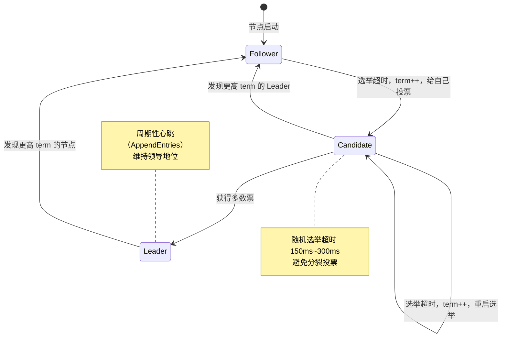
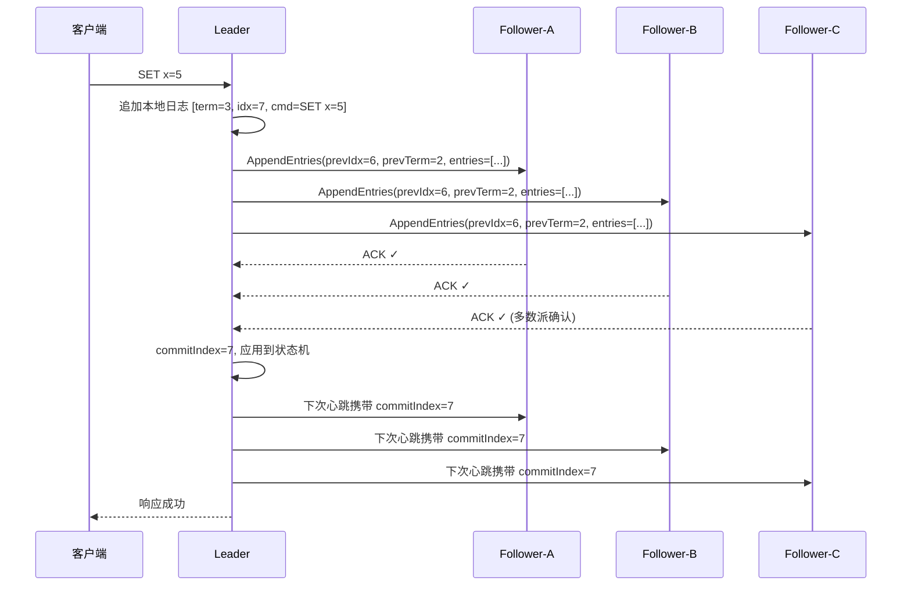

# Raft 共识算法
> 创建日期：2026-06-08
> 难度：⭐⭐⭐
> 前置知识：分布式系统基础、状态机复制、网络分区
> 关联模块：etcd / TiKV / Consul

## ⭐ 面试重点速览
| 考察点 | 重要程度 | 考察频率 | 掌握目标 |
|--------|---------|---------|---------|
| Leader 选举机制（Term + Vote） | ★★★★★ | 极高 | 能画出状态机流转图，解释分裂投票场景 |
| 日志复制与 Log Matching | ★★★★★ | 极高 | 能说明 append-only 写入流程，推导 Safety 性质 |
| 与 Paxos 的对比 | ★★★★ | 高 | 能说出可理解性、工程性两大核心差异 |
| 成员变更（Joint Consensus） | ★★★ | 中 | 理解两阶段配置变更为什么能避免脑裂 |
| 线性一致性读 | ★★★ | 中 | 知道 readIndex / lease read 的区别 |

---

## 一、应用场景 🎯

Raft 是现代分布式系统中最广泛使用的共识算法。相比 Paxos，它的核心优势是**可理解性**——Diego Ongaro 在设计 Raft 时，明确以「让研究生也能在一个学期内理解」为设计目标。

**典型落地场景：**

| 场景 | 代表项目 | Raft 的角色 |
|------|---------|------------|
| 分布式 KV 存储 | etcd、TiKV | 元数据管理、Leader 选主 |
| 服务发现与配置中心 | Consul | 集群状态同步、健康检查结果一致 |
| 分布式消息队列 | Kafka (KRaft) | 替代 ZooKeeper 做元数据协调 |
| 分布式数据库 | CockroachDB、TiDB | 多副本数据强一致性 |
| 分布式文件系统 | Ceph (MON) | 集群地图（cluster map）一致性 |

---

## 二、核心原理 🔬

### 2.1 三大子问题拆解

Raft 将共识问题分解为三个相对独立的子问题：

1. **Leader 选举** — 集群中必须有一个 Leader 接收所有写请求
2. **日志复制** — Leader 将日志同步到所有 Follower，保证多数派持久化
3. **安全性** — 保证已提交的日志不会被覆盖，状态机执行顺序一致

### 2.2 核心概念

- **Term（任期）**：单调递增的整数，逻辑时钟。每轮选举 term + 1
- **CommitIndex**：已提交（多数派确认）的最大日志索引
- **AppliedIndex**：已应用到状态机的最大日志索引
- **心跳**：Leader 周期性向 Follower 发送空的 AppendEntries RPC，防止 Follower 超时发起新选举

### 2.3 状态机流转图



**启动时所有节点都是 Follower**，在选举超时（随机 150~300ms）内没有收到 Leader 的心跳，就转为 Candidate，term 自增，先给自己一票，然后向其他节点发送 RequestVote RPC。

**赢得选举的条件**：在同一 term 内获得超过半数节点的投票。如果出现分裂投票（两个 Candidate 各拿一半），则各自随机等待后重新发起选举，term 再次递增——新的 term 天然打破僵局。

### 2.4 日志复制流程



**Log Matching 安全性规则**：
- 两条日志如果 term 和 index 相同，则它们之前的日志完全相同
- Leader 在 AppendEntries 中携带 prevLogIndex / prevLogTerm，Follower 据此做一致性检查
- 不一致时 Leader 递减 nextIndex 逐条回溯，直到找到匹配点后覆盖

---

## 三、趣味解说 🎭

> **班级选班长——Raft 现实版**

**第一幕：起始态（大家都是 Follower）**
新学期开学，老师宣布：「每个学期是一个 Term。如果在 300ms（比喻）内没有人组织大家早读，你们就可以竞选班长。」

**第二幕：选举（Follower → Candidate）**
小明觉得等太久了，大喊：「我是班长候选人，Term = 1，同意的举手！」
小明首先举手（投自己一票），另外 3 个同学中有 2 个举手（获得多数票）。
小明当选班长（Leader）。

**第三幕：执政（日志复制）**
班长小明说：「今天的早读内容是《出师表》第一段。」
他在自己的记录本（日志）上写下这条记录，然后大声宣布（AppendEntries RPC）。
每个同学在自己的记录本上也写下同样内容，超过半数写完后，小明宣布：「这条记录正式生效（commit）！」

**第四幕：换届（新选举）**
某天小明生病请假（Leader 宕机），同学们在规定时间内没收到作业通知（心跳超时）。
小红站出来：「我是候选人，Term = 2（比上届大），同意的举手！」
新一届政府上台。小明回来后发现自己 Term 已经过期，自动降级为 Follower——「一朝天子一朝臣」。

**为什么要有随机超时？**
如果没有随机性，小明和小红可能同时举手，各拿一半票，永远选不出班长（分裂投票）。随机超时让谁先举手有天然的不确定性，一个人先举手，另一个还在等——这就是 Raft 的巧妙之处。

---

## 四、代码实现 💻

```java
// ============ RaftNode.java — 核心节点逻辑（简化版）============
public class RaftNode {
    // 节点角色枚举
    enum Role { FOLLOWER, CANDIDATE, LEADER }

    // ===== 持久化状态（所有节点必须持久化）=====
    private int currentTerm = 0;         // 当前任期号，启动时为 0
    private int votedFor = -1;          // 本任期投给了哪个节点（-1 表示未投票）
    private List<LogEntry> log = new ArrayList<>(); // 日志条目列表

    // ===== 易失状态（所有节点）=====
    private int commitIndex = 0;        // 已知已提交的最大日志索引
    private int lastApplied = 0;        // 已应用到状态机的最大索引
    private Role role = Role.FOLLOWER;  // 当前角色

    // ===== 易失状态（仅 Leader）=====
    private int[] nextIndex;            // 对每个 Follower，下一条要发送的日志索引
    private int[] matchIndex;           // 对每个 Follower，已知已复制的最大日志索引

    private long electionTimeout;       // 选举超时（随机 150ms~300ms）
    private long lastHeartbeat;         // 最后一次收到 Leader 心跳的时间

    // ----- Leader 选举核心逻辑 -----
    public void becomeCandidate() {
        role = Role.CANDIDATE;
        currentTerm++;                  // 任期递增——这是打破僵局的关键
        votedFor = selfId();            // 先投票给自己
        resetElectionTimer();           // 重置随机超时

        // 向所有其他节点发送 RequestVote RPC
        for (int peerId : getAllPeers()) {
            sendRequestVote(peerId, currentTerm, lastLogIndex(), lastLogTerm());
        }
    }

    /**
     * 处理投票请求
     * 投票条件（同时满足）：
     * 1. candidateTerm >= currentTerm（候选人的任期至少和我一样新）
     * 2. votedFor 为 -1 或等于 candidateId（本任期还没投给别人）
     * 3. 候选人的日志至少和我一样新（lastLogTerm 更大，或 term 相同 index 更大）
     */
    public VoteResponse handleRequestVote(int candidateTerm, int candidateId,
                                           int candidateLastLogIndex, int candidateLastLogTerm) {
        if (candidateTerm < currentTerm) {
            return new VoteResponse(currentTerm, false); // 任期太旧，拒绝
        }
        if (candidateTerm > currentTerm) {
            currentTerm = candidateTerm; // 发现更高任期，转为 Follower
            role = Role.FOLLOWER;
            votedFor = -1;
        }
        // 检查是否已经投过票，以及日志是不是至少和我一样新
        boolean logOk = (candidateLastLogTerm > lastLogTerm())
                || (candidateLastLogTerm == lastLogTerm()
                    && candidateLastLogIndex >= lastLogIndex());
        if ((votedFor == -1 || votedFor == candidateId) && logOk) {
            votedFor = candidateId;
            resetElectionTimer();       // 投票成功，重置超时（延长自己竞选的时间）
            return new VoteResponse(currentTerm, true);
        }
        return new VoteResponse(currentTerm, false);
    }

    // ----- 日志复制核心逻辑 -----
    /**
     * Leader 处理客户端写请求
     * 1. 追加到本地日志
     * 2. 并行发送 AppendEntries 给所有 Follower
     * 3. 多数派确认后 commit 并返回客户端成功
     */
    public void handleClientWrite(String command) {
        if (role != Role.LEADER) {
            redirectToLeader();         // 非 Leader 节点重定向客户端
            return;
        }
        // 追加本地日志
        LogEntry entry = new LogEntry(currentTerm, lastLogIndex() + 1, command);
        log.add(entry);
        int newIndex = entry.index;

        int ackCount = 1;               // Leader 自己已经确认
        for (int peerId : getAllPeers()) {
            sendAppendEntries(peerId, currentTerm, newIndex - 1, lastLogTerm(peerId));
        }

        // 多数派确认后推进 commitIndex
        // 实际实现中这是异步回调驱动的，这里简化为同步等待示意
        while (ackCount < majority()) {
            // 等待 RPC 响应，checkQuorum() 判断 matchIndex >= newIndex 的数量
            Thread.yield();
        }
        commitIndex = Math.max(commitIndex, newIndex);
        applyToStateMachine();          // 将已提交日志应用到状态机
    }

    /**
     * Follower 处理 Leader 发来的日志追加
     * 一致性检查：prevLogIndex 和 prevLogTerm 必须匹配本地日志
     */
    public AppendResponse handleAppendEntries(int leaderTerm, int leaderId,
                                               int prevLogIndex, int prevLogTerm,
                                               List<LogEntry> entries, int leaderCommit) {
        // 任期检查：如果 Leader 任期更小，拒绝
        if (leaderTerm < currentTerm) {
            return new AppendResponse(currentTerm, false);
        }
        // Leader 任期 >= 我的任期，认可其领导地位
        currentTerm = leaderTerm;
        role = Role.FOLLOWER;
        resetElectionTimer();           // 收到心跳，重置超时

        // prevLogIndex / prevLogTerm 一致性检查——Log Matching 的关键
        if (prevLogIndex > 0) {
            LogEntry prevLocal = log.get(prevLogIndex - 1);
            if (prevLocal == null || prevLocal.term != prevLogTerm) {
                return new AppendResponse(currentTerm, false); // 日志不一致
            }
        }

        // 截断冲突日志，追加新条目
        for (int i = 0; i < entries.size(); i++) {
            int idx = prevLogIndex + 1 + i;
            if (idx <= log.size()) {
                LogEntry existing = log.get(idx - 1);
                if (existing.term != entries.get(i).term) {
                    // term 冲突，从此处截断
                    log = log.subList(0, idx - 1);
                    log.add(entries.get(i));
                }
            } else {
                log.add(entries.get(i));
            }
        }

        // 更新 commitIndex
        if (leaderCommit > commitIndex) {
            commitIndex = Math.min(leaderCommit, prevLogIndex + entries.size());
            applyToStateMachine();
        }
        return new AppendResponse(currentTerm, true);
    }

    // ----- 辅助方法 -----
    private int majority() { return (getAllPeers().size() + 1) / 2 + 1; }
    private int lastLogIndex() { return log.size(); }
    private int lastLogTerm() { return log.isEmpty() ? 0 : log.get(lastLogIndex() - 1).term; }
    private void resetElectionTimer() {
        electionTimeout = System.currentTimeMillis() + 150 + (long)(Math.random() * 150);
    }
    private void applyToStateMachine() {
        while (lastApplied < commitIndex) {
            lastApplied++;
            LogEntry entry = log.get(lastApplied - 1);
            stateMachine.apply(entry.command); // 应用到业务状态机
        }
    }
    // ... 省略 sendRequestVote / sendAppendEntries 等网络层实现
}

// ============ 数据结构定义 ============
class LogEntry {
    int term;       // 创建该条目的任期号
    int index;      // 日志索引（从 1 开始）
    String command; // 状态机命令

    LogEntry(int term, int index, String command) {
        this.term = term;
        this.index = index;
        this.command = command;
    }
}
```

---

## 五、优缺点 ⚖️

| 维度 | 优点 | 缺点 |
|------|-----|------|
| **可理解性** | 问题分解为三个子模块（选主/复制/安全），每个都有清晰的状态机 | 强 Leader 模型意味着读也必须走 Leader（或需 readIndex 机制） |
| **工程性** | 边界条件处理明确（随机超时、日志回溯、任期比较） | 跨地域部署时选举延迟较高 |
| **正确性** | 有 TLA+ 形式化验证，共识安全性经严格证明 | 分区容忍时写入不可用（强一致性代价） |
| **性能** | 日志复制简单高效，单 Leader 串行写入避免冲突 | 写吞吐受 Leader 单点瓶颈限制（可通过 Multi-Raft 缓解） |
| **成员变更** | Joint Consensus 两阶段变更安全可靠 | 单步成员变更在学术界已证明正确但工程实现复杂 |
| **生态** | etcd/Consul/TiKV 生产验证，社区成熟度高 | 相比 Paxos 理论层面创新有限（更偏向工程改进） |

---

## 六、面试高频题 📝

### Q1：Raft 如何保证同一个 Term 内只有一个 Leader？
**答**：每个节点在同一个 Term 内只能投一次票（votedFor 字段）。要成为 Leader 必须获得多数票；由于多数派是唯一的交集，同一 Term 内不可能有两个 Leader 都获得多数票。

### Q2：Raft 的选举超时为什么是随机的？
**答**：避免分裂投票。如果所有 Candidate 同时超时，它们会同时发起选举，每个都投自己，导致没有任何一方获得多数票。随机超时使其中一个先变为 Candidate，其他节点收到 RequestVote 后重置计时器，减少同时竞争。

### Q3：如果 Leader 在提交前宕机，日志会被覆盖吗？
**答**：不会。Raft 规定 Leader 只能提交当前 Term 的日志（通过提交当前 Term 的日志，「间接提交」之前 Term 的日志）。这保证了被多数派复制但未提交的日志，在后续 Leader 选出后不会被覆盖。新 Leader 的日志一定包含所有已提交的条目（Leader Completeness 性质）。

### Q4：Raft 和 Paxos 的核心区别是什么？
**答**：
- **可理解性**：Raft 把问题分解为 Leader 选举、日志复制、安全性三个子问题，Paxos 是一个整体协议
- **Leader 机制**：Raft 强 Leader（所有操作经 Leader），Multi-Paxos 的 Leader 是优化而非必需
- **日志结构**：Raft 日志连续且不允许空洞，Paxos 允许日志有空洞（需要额外协议填补）
- **成员变更**：Raft 有标准的 Joint Consensus，Paxos 依赖外部机制

### Q5：线性一致性读怎么实现？
**答**：不能简单从 Leader 直接读（可能已被分区隔离）。三种方式：
1. **readIndex**：Leader 先发心跳确认自己仍是 Leader，记录 commitIndex，等到 appliedIndex >= commitIndex 后读取
2. **Lease Read**：Leader 在心跳租约有效期内直接读
3. **Log Read**：把一个 no-op 日志提交到多数派后再读

---

## 七、常见误区 ❌

| 误区 | 正确理解 |
|------|---------|
| 「Raft 的 Leader 永远不会丢失数据」 | 已 **commit** 的数据不会丢，但未提交的数据在 Leader 崩溃后可能被新 Leader 截断覆盖 |
| 「心跳间隔越短，系统越可靠」 | 心跳太频繁浪费网络带宽；心跳太少则选举延迟高。通常 100ms~500ms |
| 「选举超时设为固定值就可以」 | 必须随机化，否则所有节点同时超时导致分裂投票，系统长时间无 Leader |
| 「Follower 收到写请求可以直接处理」 | Follower 不能处理写请求，必须转发给 Leader |
| 「Raft 可以容忍任何数量的节点故障」 | 2N+1 个节点最多容忍 N 个故障。3 节点容忍 1 个，5 节点容忍 2 个 |
| 「成员变更可以一步完成」 | 直接切换可能产生两个不相交的多数派（脑裂），必须用 Joint Consensus 或单步变更 |