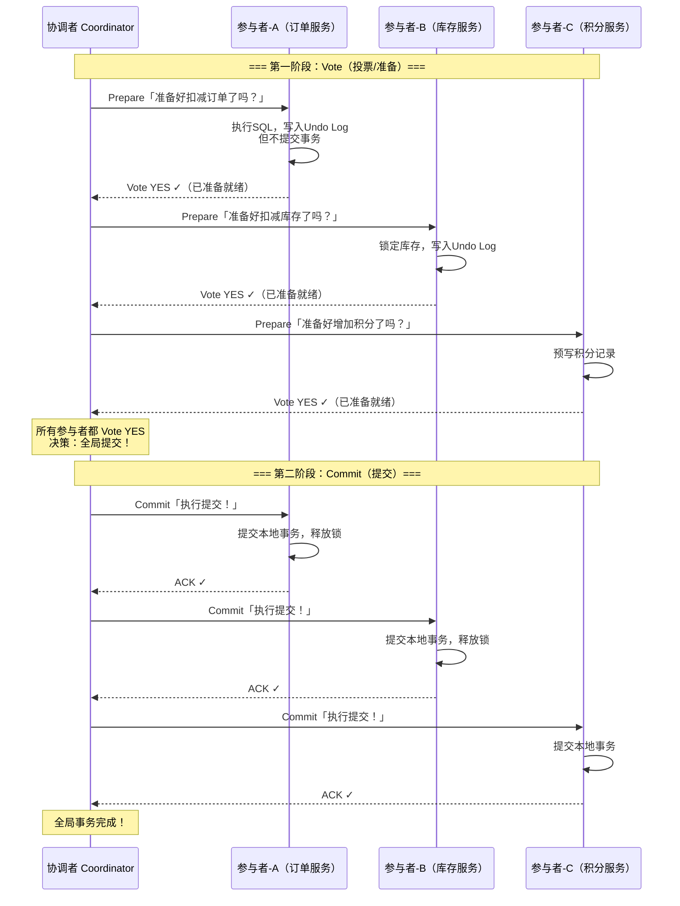
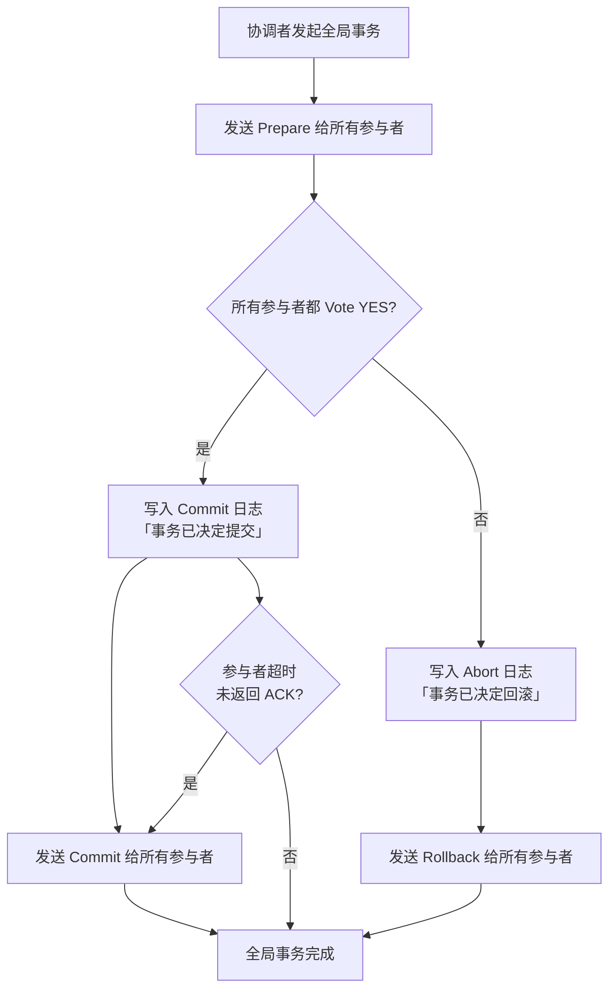
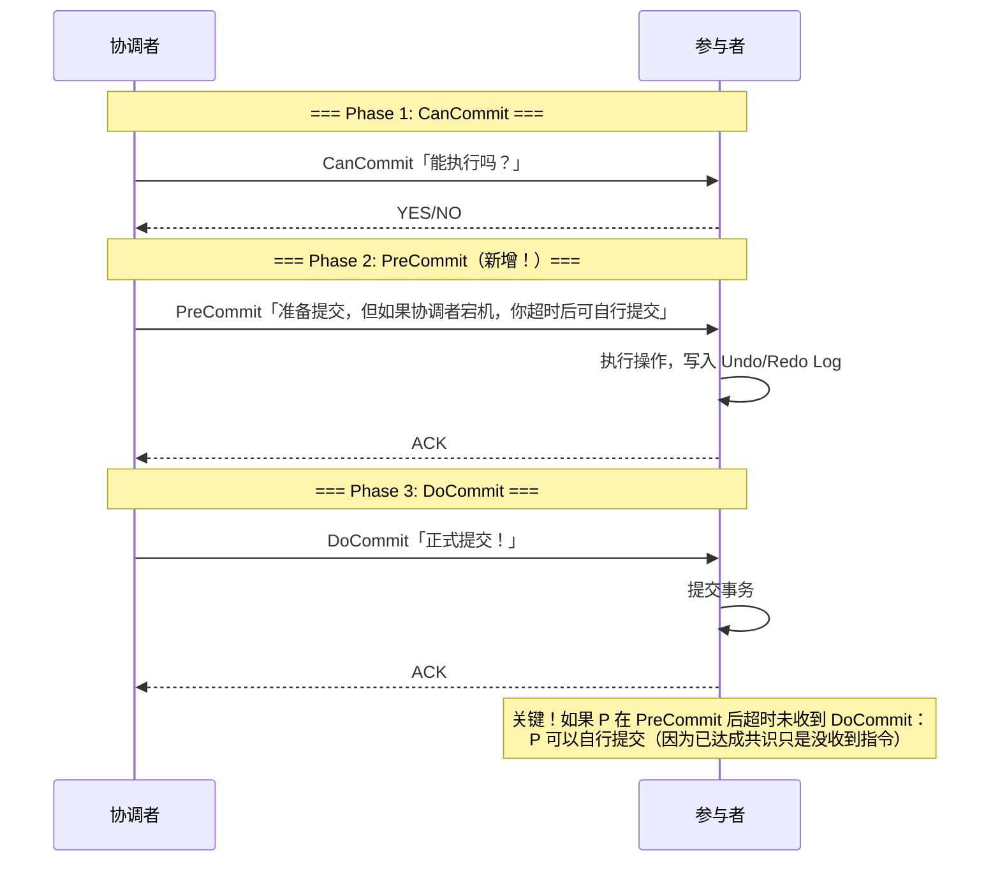

# 两阶段提交（2PC / 3PC）
> 创建日期：2026-06-08
> 难度：⭐⭐
> 前置知识：事务 ACID、分布式系统基础、网络通信
> 关联模块：XA 事务 / Seata AT / TCC / Saga

## ⭐ 面试重点速览
| 考察点 | 重要程度 | 考察频率 | 掌握目标 |
|--------|---------|---------|---------|
| 2PC 两阶段流程（Vote/Commit） | ★★★★★ | 极高 | 能画出时序图，说出每个阶段的职责 |
| 协调者宕机的各种场景处理 | ★★★★★ | 极高 | 能分析「参与者锁定」问题及后果 |
| 3PC 相比 2PC 的改进 | ★★★★ | 高 | 能说出 PreCommit 阶段的作用和超时机制 |
| 与 TCC / Saga 的对比 | ★★★★ | 高 | 能从一致性、隔离性、性能三个维度对比 |
| XA 协议与 2PC 的关系 | ★★★ | 中 | 知道 XA 是 2PC 的接口标准 |

---

## 一、应用场景 🎯

两阶段提交（2PC）是最经典的分布式事务协议，解决的是「多个参与者要么全部成功，要么全部失败」的原子性问题。它既是分布式事务的基石，也是理解更高级方案（TCC、Saga、Seata）的起点。

**典型落地场景：**

| 场景 | 代表方案 | 2PC 的角色 |
|------|---------|------------|
| 跨库事务 | XA 事务（MySQL、PostgreSQL） | 协调多个数据库实例的提交 |
| 分布式事务框架 | Seata AT 模式 | 默认使用 2PC，利用 undo log 实现回滚 |
| 消息队列 + 数据库 | RocketMQ 事务消息 | 半消息 + 本地事务检查，类似 2PC 思路 |
| 微服务跨服务事务 | Atomikos、Narayana | JTA 规范下的 XA 2PC 实现 |
| 银行转账 | 传统金融系统 | 借/贷双方账户的双向一致性保证 |

---

## 二、核心原理 🔬

### 2.1 两阶段提交（2PC）时序图



### 2.2 2PC 的两种结果



### 2.3 协调者故障场景分析

2PC 最大的弱点在于**协调者单点故障**：

| 故障时机 | 参与者状态 | 后果 |
|---------|-----------|------|
| 协调者在 Prepare 前宕机 | 参与者事务尚未开始 | 无影响，参与者超时后自动回滚 |
| 协调者在 Prepare 后、Commit 前宕机 | 参与者处于「锁定」状态，本地事务未提交 | **最严重场景**：参与者被阻塞，无法自行决定提交还是回滚，锁资源无法释放 |
| 协调者在 Commit 后宕机 | 部分参与者已提交 | 新协调者重放日志，继续向未提交的参与者发送 Commit |

### 2.4 三阶段提交（3PC）的改进

3PC 在 2PC 的 Prepare 和 Commit 之间插入了一个 **PreCommit** 阶段，核心改进是**引入超时机制**：



**3PC 相比 2PC 的核心改进**：
1. **参与者超时后可自行提交**：如果参与者在 PreCommit 阶段后超时，说明协调者已经决定提交（否则不会进入 PreCommit）。参与者可以自行提交，避免阻塞
2. **降低了单点阻塞风险**：即使协调者宕机，参与者也不会无限期等待

**3PC 的代价**：多了一次网络往返，且在网络分区场景下仍可能出现数据不一致（一部分参与者提交、一部分回滚）。

---

## 三、趣味解说 🎭

> **婚礼筹备——2PC 现实版**

**婚礼策划师（协调者）** 负责确保婚礼当天三个关键环节万无一失：
- 酒店（参与者 A）：准备好宴会厅
- 花店（参与者 B）：准备好鲜花布置
- 婚车（参与者 C）：准备好接亲车队

**第一幕：理想情况**
策划师打电话：「各方请注意，请确认你们能按时到位！」（Phase 1: Prepare）
酒店：「没问题，宴会厅已预留！」（Vote YES）
花店：「没问题，鲜花已备好！」（Vote YES）
婚车：「没问题，车队已整装待发！」（Vote YES）

策划师：「好，全员确认！我宣布：婚礼正式开始准备！」（Phase 2: Commit）
——所有资源锁定，各方开始执行。婚礼顺利举行。

**第二幕：有人掉链子**
策划师打电话确认，酒店和花店都说 YES，但婚车公司说：「抱歉，今天所有车都出去了。」

策划师：「有参与者无法就绪，我宣布：婚礼计划取消！」（Phase 2: Rollback）
酒店和花店释放预留的资源。
——这就是 2PC 的原子性：要么全成功，要么全失败。

**第三幕：策划师失踪（协调者宕机）**
策划师打完确认电话，酒店说 YES，花店说 YES，婚车说 YES。策划师在笔记本上写下「决定：按计划执行」，然后……晕倒了。

酒店经理打电话：「策划师？策划师？我们准备好了，下一步干嘛？」
花店老板打电话：「喂？我们的花已经开始蔫了！」
——所有参与者处于「锁定」状态，资源被占用但不知道该怎么办。这就是 2PC 最致命的**协调者单点故障**问题。

**3PC 的改进：引入「预备执行」指令**
如果策划师在决定执行前，先发一个「预备执行」的通知（PreCommit），告诉各方：「如果 5 分钟内我没再联系你们，你们就自己执行！」——即使策划师晕倒，婚礼也能继续。这就是 3PC 的超时自提交机制。

---

## 四、代码实现 💻

```java
// ============ TwoPhaseCommit.java — 2PC 协调者实现 ============
public class TwoPhaseCommit {
    // 协调者状态
    enum GlobalStatus { INIT, PREPARING, COMMITTING, ABORTING, DONE }

    private GlobalStatus status = GlobalStatus.INIT;
    private final List<Participant> participants;  // 所有参与者
    private final List<Participant> preparedList;   // 已 Vote YES 的参与者
    private final String globalTxId;                // 全局事务 ID

    public TwoPhaseCommit(String globalTxId, List<Participant> participants) {
        this.globalTxId = globalTxId;
        this.participants = participants;
        this.preparedList = new ArrayList<>();
    }

    /**
     * 执行全局事务的核心流程
     * @return true 表示全局提交成功，false 表示回滚
     */
    public boolean executeGlobalTransaction() {
        // ---- Phase 1: Prepare（投票阶段）----
        status = GlobalStatus.PREPARING;

        boolean allAgreed = true;
        for (Participant p : participants) {
            try {
                // 向参与者发送 Prepare 请求
                VoteResult result = p.prepare(globalTxId);
                if (result == VoteResult.YES) {
                    preparedList.add(p); // 记录已同意的参与者
                } else {
                    allAgreed = false;
                    break;               // 任何一个 NO 就停止收集
                }
            } catch (Exception e) {
                // 网络异常或超时，视为 NO
                allAgreed = false;
                break;
            }
        }

        // ---- Phase 2: Commit 或 Rollback（根据投票结果）----
        if (allAgreed) {
            return doCommit();           // 全部同意 → 全局提交
        } else {
            return doRollback();         // 有反对或超时 → 全局回滚
        }
    }

    /**
     * 全局提交：向所有已同意的参与者发送 Commit 指令
     */
    private boolean doCommit() {
        status = GlobalStatus.COMMITTING;
        // 先写本地日志，记录「决定提交」——这是崩溃恢复的关键
        writeCommitLog(globalTxId, "COMMIT");

        boolean allSuccess = true;
        for (Participant p : preparedList) {
            try {
                p.commit(globalTxId);    // 通知参与者提交
            } catch (Exception e) {
                allSuccess = false;
                // 提交失败时不断重试，直到成功（因为已经决定提交，不可回滚）
                retryUntilSuccess(p);
            }
        }

        status = GlobalStatus.DONE;
        return allSuccess;
    }

    /**
     * 全局回滚：向所有已同意的参与者发送 Rollback 指令
     */
    private boolean doRollback() {
        status = GlobalStatus.ABORTING;
        writeCommitLog(globalTxId, "ROLLBACK");

        for (Participant p : preparedList) {
            try {
                p.rollback(globalTxId);  // 通知参与者回滚
            } catch (Exception e) {
                retryUntilSuccess(p);    // 回滚也必须成功
            }
        }

        status = GlobalStatus.DONE;
        return false;
    }

    // 持续重试直到成功，保证最终一致性
    private void retryUntilSuccess(Participant p) {
        int maxRetries = 10;
        int retry = 0;
        while (retry < maxRetries) {
            try {
                if (status == GlobalStatus.COMMITTING) {
                    p.commit(globalTxId);
                } else {
                    p.rollback(globalTxId);
                }
                return;                  // 成功，退出
            } catch (Exception e) {
                retry++;
                try {
                    Thread.sleep(1000L * retry); // 指数退避
                } catch (InterruptedException ie) {
                    Thread.currentThread().interrupt();
                    break;
                }
            }
        }
        // 超过最大重试次数，需要人工介入
        logError("参与者 " + p.getId() + " 最终一致性失败，需人工处理");
    }

    // 写入本地事务日志（崩溃恢复依据）
    private void writeCommitLog(String txId, String decision) {
        // 实际实现中写入持久化存储（如本地文件或数据库）
        TransactionLog log = new TransactionLog(txId, decision, System.currentTimeMillis());
        logStore.append(log);
    }
}

// ============ Participant.java — 参与者接口 ============
interface Participant {
    String getId();

    /**
     * Phase 1: 准备阶段
     * 执行本地事务的预操作，但不提交，写入 Undo Log
     * @return YES 表示准备好提交，NO 表示无法完成
     */
    VoteResult prepare(String txId);

    /** Phase 2: 提交本地事务 */
    void commit(String txId);

    /** Phase 2: 回滚本地事务（利用 Undo Log 恢复） */
    void rollback(String txId);
}

// ============ 3PC 改进：带超时的参与者 ============
class ThreePhaseParticipant implements Participant {
    private boolean preCommitted = false; // 是否已进入 PreCommit 阶段
    private long preCommitTime;           // 进入 PreCommit 的时间

    @Override
    public VoteResult prepare(String txId) {
        // Phase 1: CanCommit — 检查是否具备执行条件
        if (!canExecute()) {
            return VoteResult.NO;
        }

        // Phase 2: PreCommit — 执行操作但不提交
        executeLocalOperation();
        preCommitted = true;
        preCommitTime = System.currentTimeMillis();

        // 启动超时线程：如果超时未收到 DoCommit，自行提交
        startTimeoutMonitor(txId);

        return VoteResult.YES;
    }

    /**
     * 超时监控线程：3PC 相比 2PC 的核心改进
     * 如果参与者在 PreCommit 后超时未收到协调者指令，可以自行提交
     */
    private void startTimeoutMonitor(String txId) {
        new Thread(() -> {
            try {
                Thread.sleep(5000); // 等待 5 秒
                if (preCommitted) {
                    // 超时了！协调者可能宕机，但既然已经 PreCommit，
                    // 说明协调者已经决定提交，我可以自行提交
                    commit(txId);
                    logWarn("协调者超时，参与者 " + getId() + " 自行提交事务 " + txId);
                }
            } catch (InterruptedException e) {
                Thread.currentThread().interrupt();
            }
        }).start();
    }

    @Override
    public void commit(String txId) {
        preCommitted = false;
        doCommit(); // 提交本地事务
    }

    @Override
    public void rollback(String txId) {
        preCommitted = false;
        doRollback(); // 利用 Undo Log 回滚
    }

    private boolean canExecute() { /* 检查资源是否可用 */ return true; }
    private void executeLocalOperation() { /* 执行本地操作 */ }
    private void doCommit() { /* 提交 */ }
    private void doRollback() { /* 回滚 */ }
}

// 辅助类型
enum VoteResult { YES, NO }
class TransactionLog {
    String txId; String decision; long timestamp;
    TransactionLog(String txId, String decision, long timestamp) {
        this.txId = txId; this.decision = decision; this.timestamp = timestamp;
    }
}
```

---

## 五、优缺点 ⚖️

### 2PC

| 维度 | 优点 | 缺点 |
|------|-----|------|
| **原子性** | 严格保证跨节点事务的原子性（全成功或全失败） | 协调者单点故障导致参与者无限阻塞 |
| **一致性** | 强一致性，所有参与者最终状态一致 | 同步阻塞，Prepare 期间参与者锁定资源 |
| **实现复杂度** | 协议简单，容易理解和实现 | 故障恢复复杂（协调者崩溃后的日志重放） |
| **性能** | 适合短事务场景 | 多轮网络交互，事务期间资源锁定，不适合高并发 |

### 3PC

| 维度 | 优点 | 缺点 |
|------|-----|------|
| **可用性** | 引入超时机制，降低协调者单点阻塞风险 | 多一次网络往返，延迟更高 |
| **一致性** | 在无网络分区时保证一致性 | 网络分区时可能出现数据不一致 |
| **适用场景** | 比 2PC 更适合不可靠网络环境 | 实现更复杂，生产中使用较少 |

### 与 TCC / Saga 对比

| 方案 | 一致性 | 隔离性 | 性能 | 业务侵入性 |
|------|-------|-------|------|-----------|
| **2PC** | 强一致 | 强（锁定资源） | 低（同步阻塞） | 低（标准接口） |
| **TCC** | 最终一致 | 弱（需业务层实现隔离） | 高（异步） | 高（需实现 Try/Confirm/Cancel） |
| **Saga** | 最终一致 | 弱（无隔离） | 高（异步编排） | 中（需实现补偿接口） |

---

## 六、面试高频题 📝

### Q1：2PC 的协调者宕机后，参与者怎么办？
**答**：这是 2PC 最核心的问题。如果协调者在 Prepare 阶段后、Commit 阶段前宕机，参与者处于「不确定」状态：本地事务已准备但未提交，也不知道该提交还是回滚。参与者只能阻塞等待协调者恢复，期间锁定的资源无法释放。这就是 2PC 的「协调者单点故障」问题。3PC 通过引入 PreCommit 阶段和超时机制来缓解。

### Q2：3PC 真的解决了 2PC 的阻塞问题吗？
**答**：部分解决。3PC 在协调者宕机时，参与者可以超时后自行提交，避免无限期阻塞。但在网络分区场景下，3PC 仍可能出现不一致：一部分参与者与协调者连通并提交，另一部分被分区后超时自行提交——如果协调者实际决定回滚，就会出现不一致。

### Q3：为什么 2PC 在 Prepare 阶段需要写入 Undo Log？
**答**：Prepare 阶段参与者执行了实际的数据操作但未提交，如果最终决定回滚，需要 Undo Log 来恢复数据到操作前的状态。Undo Log 是原子回滚的保证。

### Q4：2PC 和 Paxos 有什么本质区别？
**答**：2PC 是**分布式事务协议**，假设有一个可靠的协调者，目标是保证多个参与者的原子性。Paxos 是**分布式共识算法**，不假设任何节点可靠，目标是让多数派就一个值达成一致。Paxos 可以容忍少数节点故障，2PC 依赖协调者可用。

### Q5：Seata AT 模式如何改进 2PC？
**答**：Seata AT 模式基于 2PC，但做了关键改进：(1) 自动生成 Undo Log（反向 SQL），业务无侵入；(2) 第一阶段直接提交本地事务并释放锁，第二阶段异步删除 Undo Log；(3) 通过全局锁 + 本地锁提供读写隔离。相比传统 2PC，Seata AT 大幅减少了资源锁定时间。

---

## 七、常见误区 ❌

| 误区 | 正确理解 |
|------|---------|
| 「2PC 和 Paxos 的两阶段是同一回事」 | 完全不同。2PC 是 Vote/Commit，Paxos 是 Prepare/Accept。2PC 依赖协调者，Paxos 不依赖 |
| 「2PC 在任何情况下都能保证一致性」 | 协调者宕机且参与者无法通信时，2PC 无法保证一致性，参与者会阻塞 |
| 「3PC 彻底解决了 2PC 的所有问题」 | 3PC 只缓解了阻塞问题，但在网络分区场景下仍可能出现不一致 |
| 「2PC 是分布式事务的唯一方案」 | TCC、Saga、本地消息表、事务消息等都是替代方案，各有适用场景 |
| 「Prepare 阶段不执行任何操作」 | Prepare 阶段会执行实际操作并写入 Undo Log，只是不提交而已 |
| 「2PC 性能差只是因为两次网络往返」 | 更大的问题是 Prepare 阶段的资源锁定，阻塞其他并发事务 |