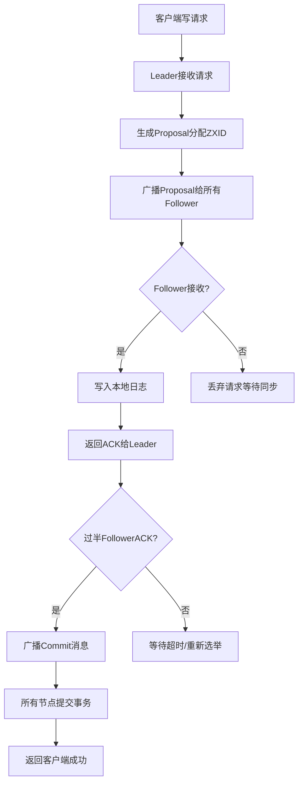
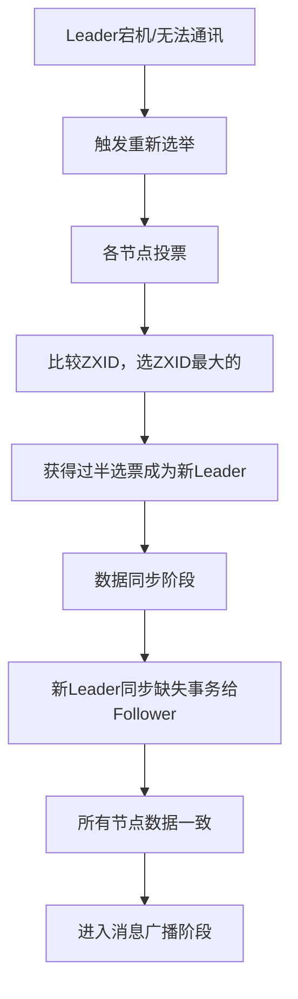

# ZAB协议
> 创建日期：2026-06-08
> 难度：⭐⭐⭐
> 前置知识：分布式一致性、Paxos算法、ZooKeeper
> 关联模块：分布式一致性、leader选举、原子广播

## ⭐ 面试重点速览
| 考察点 | 重要程度 | 考察频率 | 掌握目标 |
|--------|----------|----------|----------|
| ZAB与Paxos的区别 | ⭐⭐⭐⭐⭐ | ⭐⭐⭐⭐ | 理解设计差异 |
| 消息广播阶段流程 | ⭐⭐⭐⭐⭐ | ⭐⭐⭐⭐ | 掌握工作原理 |
| 崩溃恢复阶段流程 | ⭐⭐⭐⭐⭐ | ⭐⭐⭐⭐ | 掌握选举恢复 |
| ZXID设计原理 | ⭐⭐⭐⭐ | ⭐⭐⭐ | 理解排序机制 |
| 与Raft协议对比 | ⭐⭐⭐ | ⭐⭐ | 了解异同点 |

## 一、应用场景 🎯

ZAB（ZooKeeper Atomic Broadcast）协议是专门为ZooKeeper设计的原子广播协议，主要应用于以下场景：

1. **ZooKeeper集群数据一致性同步**
   - 保证集群中所有节点数据变更的顺序一致性
   - 确保事务在所有节点上按相同顺序执行

2. **Leader节点崩溃恢复**
   - 当Leader节点宕机后，快速选举新的Leader
   - 恢复丢失的事务，保证数据一致性

3. **分布式配置中心**
   - 配置变更需要在所有集群节点同步
   - 保证配置更新的原子性

4. **分布式锁服务**
   - 锁信息需要在所有节点保持一致
   - 防止脑裂导致锁冲突

5. **注册中心场景**
   - 服务上下线通知需要广播到所有节点
   - 保证所有节点看到一致的服务列表

ZAB协议是ZooKeeper的核心，它使得ZooKeeper能够实现：
- 顺序一致性（Linearizability）
- 原子广播（Atomic Broadcast）
- 崩溃恢复（Failure Recovery）

## 二、核心原理 🔬

ZAB协议核心设计是基于**主从模式**的原子广播，分为两个主要阶段：**消息广播阶段**和**崩溃恢复阶段**。

### 2.1 整体架构

- **Leader节点**：处理所有客户端写请求，生成事务Proposal，广播给所有Follower
- **Follower节点**：接收Leader的Proposal，执行事务后返回ACK
- **Observer节点**：只同步数据，不参与投票，提高读吞吐量

### 2.2 ZXID设计

每个事务都分配一个全局唯一的ZXID（ZooKeeper Transaction ID）：
- 格式：`高32位(epoch) + 低32位(counter)`
- epoch：Leader周期，每次选举新Leader递增
- counter：当前Leader周期内的事务计数器

ZXID设计保证了：
- 事务的全局有序性
- 可以识别过期Leader（旧epoch的请求会被拒绝）
- 快速发现数据缺失

### 2.3 两阶段流程



### 2.4 消息广播阶段（正常运行时）

1. **接收请求**：Leader接收客户端写事务请求
2. **生成提案**：为事务生成ZXID，创建Proposal
3. **广播提案**：Leader将Proposal发送给所有Follower

4. **接收ACK**：等待超过半数Follower返回ACK
5. **提交事务**：Leader广播Commit，所有节点提交事务
6. **返回结果**：Leader响应客户端写入成功

### 2.5 崩溃恢复阶段（Leader宕机）

当Leader宕机或无法得到过半ACK时，进入崩溃恢复：



崩溃恢复需要保证：
- **已经提交的事务必须被所有节点提交**
- **只被Leader提出但未提交的事务必须被丢弃**

### 2.6 与Raft协议对比

| 对比维度 | ZAB | Raft |
|---------|-----|------|
| 设计目标 | 为ZooKeeper定制，支持原子广播 | 通用一致性算法，易理解易实现 |
| Leader选举 | 基于ZXID，ZXID越大优先级越高 | 基于任期，随机超时触发选举 |
| 日志复制 | 两阶段提交（Proposal + Commit） | 领导者复制，心跳维护地位 |
| 成员变更 | 不支持在线变成员，需要重启 | 支持联合一致，在线变更 |
| 应用场景 | 专一性强，只用于ZooKeeper | 应用广泛（etcd、Consul等） |

## 三、趣味解说 🎭

想象一下，ZooKeeper就像一个**动物园**🐘：

- 整个动物园由多个园区组成（多个节点）
- 需要选举一个**动物园园长**（Leader）来管理所有园区
- 园长的职责就是**统一发布通知**（广播事务），所有园区管理员（Follower）都要听从园长指挥

一天，园长（Leader）突然离职了（宕机了）🏃‍♂️💨...

这时候怎么办？当然是重新选一个园长啦！📍

根据ZAB选举规则：谁手里最新的通知最全（ZXID最大），谁就当园长！这很合理吧？因为最新最全的人当园长，才不会漏掉重要通知！

新园长上任后第一件事是什么？就是把自己手里所有通知（已提交事务）同步给所有园区管理员，确保大家手里的信息都是完整一致的。同步完成后，园长就可以开始正常发布新通知了！📢

整个过程非常简单清晰：园长在的时候听园长指挥，园长走了就选个新园长，同步完信息继续干活～这就是ZAB协议！

## 四、代码实现 💻

以下是用Java简化实现ZAB协议核心流程的示例代码：

```java
import java.util.*;
import java.util.concurrent.ConcurrentHashMap;
import java.util.concurrent.atomic.AtomicLong;

/**
 * ZXID实现：高32位epoch + 低32位counter
 */
public class ZXID implements Comparable<ZXID> {
    private final long zxid;

    public ZXID(int epoch, int counter) {
        // epoch放在高32位，counter放在低32位
        this.zxid = ((long) epoch << 32) | (counter & 0xFFFFFFFFL);
    }

    public int getEpoch() {
        return (int) (zxid >> 32);
    }

    public int getCounter() {
        return (int) zxid;
    }

    public long getRawZXID() {
        return zxid;
    }

    @Override
    public int compareTo(ZXID other) {
        // ZXID越大，优先级越高
        return Long.compare(this.zxid, other.zxid);
    }

    @Override
    public boolean equals(Object o) {
        if (this == o) return true;
        if (o == null || getClass() != o.getClass()) return false;
        ZXID other = (ZXID) o;
        return zxid == other.zxid;
    }

    @Override
    public int hashCode() {
        return Long.hashCode(zxid);
    }
}

/**
 * 事务提案
 */
class Proposal {
    private final ZXID zxid;
    private final String transaction; // 事务内容
    private volatile boolean committed = false;

    public Proposal(ZXID zxid, String transaction) {
        this.zxid = zxid;
        this.transaction = transaction;
    }

    public ZXID getZxid() { return zxid; }
    public String getTransaction() { return transaction; }
    public boolean isCommitted() { return committed; }
    public void setCommitted(boolean committed) { this.committed = committed; }
}

/**
 * 抽象节点：Leader或Follower
 */
abstract class Node {
    protected final String nodeId;
    protected final List<Node> cluster;
    protected int epoch;
    protected ZXID lastZXID;
    protected final Map<ZXID, Proposal> log = new ConcurrentHashMap<>();
    protected volatile boolean isLeader = false;

    public Node(String nodeId, List<Node> cluster) {
        this.nodeId = nodeId;
        this.cluster = cluster;
        this.epoch = 0;
        this.lastZXID = new ZXID(0, 0);
    }

    public String getNodeId() { return nodeId; }
    public boolean isLeader() { return isLeader; }
    public ZXID getLastZXID() { return lastZXID; }
    public int getEpoch() { return epoch; }

    // 接收Proposal
    public abstract void onReceiveProposal(Proposal proposal, String leaderId);

    // 接收ACK
    public abstract void onReceiveACK(ZXID zxid, String followerId);

    // 接收Commit
    public abstract void onReceiveCommit(ZXID zxid, String leaderId);

    // 投票
    public abstract void vote(Node candidate);

    // 追加日志
    protected void appendLog(Proposal proposal) {
        log.put(proposal.getZxid(), proposal);
        lastZXID = proposal.getZxid();
    }
}

/**
 * Leader节点实现
 */
class LeaderNode extends Node {
    private final int quorumSize; // 法定大小（过半）
    private final Map<ZXID, Set<String>> ackMap = new ConcurrentHashMap<>();

    public LeaderNode(String nodeId, List<Node> cluster, int epoch) {
        super(nodeId, cluster);
        this.quorumSize = cluster.size() / 2 + 1;
        this.epoch = epoch;
        this.isLeader = true;
        System.out.println("Node " + nodeId + " became LEADER, epoch = " + epoch);
    }

    /**
     * 处理客户端写请求，发起广播
     */
    public void handleWriteRequest(String transaction) {
        // 生成新ZXID：epoch不变，counter递增
        int nextCounter = lastZXID.getCounter() + 1;
        ZXID newZXID = new ZXID(epoch, nextCounter);
        Proposal proposal = new Proposal(newZXID, transaction);
        
        // 先写入自己日志
        appendLog(proposal);
        ackMap.put(newZXID, ConcurrentHashMap.newKeySet());
        
        // 广播Proposal给所有Follower
        System.out.println("Leader " + nodeId + " broadcasting proposal " + 
                          newZXID.getEpoch() + "-" + newZXID.getCounter());
        for (Node follower : cluster) {
            if (!follower.equals(this)) {
                follower.onReceiveProposal(proposal, this.nodeId);
            }
        }
    }

    @Override
    public void onReceiveACK(ZXID zxid, String followerId) {
        Set<String> acks = ackMap.get(zxid);
        if (acks == null) return;
        
        acks.add(followerId);
        System.out.println("Leader received ACK from " + followerId + 
                          ", total=" + acks.size() + "/" + quorumSize);
        
        // 过半ACK，广播Commit
        if (acks.size() >= quorumSize - 1) { // 减去自己，已经ACK
            System.out.println("Quorum achieved, broadcasting commit for " + 
                              zxid.getEpoch() + "-" + zxid.getCounter());
            for (Node follower : cluster) {
                if (!follower.equals(this)) {
                    follower.onReceiveCommit(zxid, this.nodeId);
                }
            }
            // 标记自己已提交
            log.get(zxid).setCommitted(true);
            ackMap.remove(zxid);
        }
    }

    @Override
    public void onReceiveProposal(Proposal proposal, String leaderId) {
        // Leader不会接收其他Leader的Proposal（除非过期，会拒绝）
        if (proposal.getZxid().getEpoch() < this.epoch) {
            System.out.println("Reject old epoch proposal from " + leaderId);
        }
    }

    @Override
    public void onReceiveCommit(ZXID zxid, String leaderId) {
        // Leader不需要接收Commit
    }

    @Override
    public void vote(Node candidate) {
        // Leader投给自己
        candidate.vote(this);
    }
}

/**
 * Follower节点实现
 */
class FollowerNode extends Node {
    private volatile String currentLeader;

    public FollowerNode(String nodeId, List<Node> cluster) {
        super(nodeId, cluster);
        this.isLeader = false;
    }

    public void setCurrentLeader(String leaderId) {
        this.currentLeader = leaderId;
    }

    @Override
    public void onReceiveProposal(Proposal proposal, String leaderId) {
        // 验证epoch，过期Leader拒绝
        if (proposal.getZxid().getEpoch() < this.epoch) {
            System.out.println("Follower " + nodeId + " rejects old epoch proposal");
            return;
        }

        // 写入本地日志
        appendLog(proposal);
        System.out.println("Follower " + nodeId + " appended proposal " + 
                          proposal.getZxid().getRawZXID());
        
        // 返回ACK给Leader
        for (Node node : cluster) {
            if (node.getNodeId().equals(leaderId) && node.isLeader()) {
                node.onReceiveACK(proposal.getZxid(), this.nodeId);
                break;
            }
        }
    }

    @Override
    public void onReceiveACK(ZXID zxid, String followerId) {
        // Follower不处理ACK
    }

    @Override
    public void onReceiveCommit(ZXID zxid, String leaderId) {
        // 提交事务到本地存储
        Proposal proposal = log.get(zxid);
        if (proposal != null) {
            proposal.setCommitted(true);
            System.out.println("Follower " + nodeId + " committed " + 
                              zxid.getEpoch() + "-" + zxid.getCounter() + 
                              ": " + proposal.getTransaction());
        }
    }

    @Override
    public void vote(Node candidate) {
        // 比较ZXID，ZXID大的优先级高
        if (candidate.getLastZXID().compareTo(this.lastZXID) > 0) {
            // 投给ZXID更大的候选者
            System.out.println("Follower " + nodeId + " votes for " + candidate.getNodeId());
            candidate.vote(this);
        } else {
            // 投给自己
            this.vote(this);
        }
    }
}

/**
 * ZAB协议简化演示
 */
public class ZABDemo {
    public static void main(String[] args) {
        // 创建集群（3个节点）
        List<Node> cluster = new ArrayList<>();
        
        // 模拟选举过程
        FollowerNode f1 = new FollowerNode("f1", cluster);
        FollowerNode f2 = new FollowerNode("f2", cluster);
        cluster.add(f1);
        cluster.add(f2);
        cluster.add(null); // 占位Leader
        
        // 选举产生Leader，初始epoch=1
        LeaderNode leader = new LeaderNode("leader1", cluster, 1);
        cluster.set(2, leader);
        f1.setCurrentLeader("leader1");
        f2.setCurrentLeader("leader1");

        // 模拟处理写请求
        System.out.println("\n=== Processing write requests ===");
        leader.handleWriteRequest("create /node1 data1");
        try {
            Thread.sleep(100);
            leader.handleWriteRequest("create /node2 data2");
        } catch (InterruptedException e) {
            Thread.currentThread().interrupt();
        }
    }
}
```

## 五、优缺点 ⚖️

### 优点 ✅

1. **专一性设计，性能优秀**
   - 为ZooKeeper量身定制，去掉了Paxos的复杂部分
   - 消息广播阶段类似两阶段提交，性能很好

2. **ZXID设计精妙**
   - 自然携带epoch和counter信息
   - 通过比较ZXID就能确定优先级，选举快速

3. **崩溃恢复保证一致性**
   - 保证已经提交的事务不丢失
   - 保证未提交的事务被丢弃
   - 只同步缺失的数据，效率高

4. **支持Observer节点**
   - Observer不参与投票，只同步数据
   - 可以线性扩展读吞吐量，不影响写性能

5. **实现相对简单**
   - 相比Paxos更容易理解和实现
   - 经过大规模生产验证，稳定可靠

### 缺点 ❌

1. **Leader单点瓶颈**
   - 所有写请求都经过Leader
   - 高并发场景下Leader可能成为瓶颈

2. **不支持动态成员变更**
   - 增减节点需要重启集群
   - 不支持在线滚动升级

3. **灵活性不足**
   - 专为ZooKeeper设计，通用性不如Raft
   - 很难直接应用到其他分布式系统

4. **可用性依赖Leader**
   - Leader宕机期间集群不可用
   - 选举过程需要一定时间

## 六、面试高频题 📝

### Q1: ZAB协议和Paxos算法有什么区别？

**A**:
- Paxos是通用的一致性算法，ZAB是专为ZooKeeper设计的原子广播协议
- Paxos允许通过多轮投票逐步达成一致，ZAB是主从模式，只有Leader能发起提案
- Paxos强调安全性，ZAB强调顺序一致性和高性能
- ZAB在崩溃恢复时保证已经提交的事务不丢失，这是Paxos没有明确说明的

### Q2: ZXID的设计原理是什么？

**A**:
- ZXID是64位，高32位表示epoch（Leader周期），低32位表示事务计数器
- epoch每次选举新Leader递增，用于区分不同的Leader周期
- 通过ZXID的比较可以自然判断出谁拥有最新的数据，ZXID越大数据越新
- 保证了事务的全局有序性，方便崩溃恢复时进行数据对比

### Q3: ZAB的崩溃恢复阶段需要保证什么？

**A**:
崩溃恢复需要保证两个核心原则：
1. **已经被Leader提交的事务，必须被所有Follower提交**
2. **只被Leader提出但未提交的事务，必须被丢弃**

这样可以保证数据一致性，不会出现部分节点提交部分节点没提交的情况。

### Q4: ZAB为什么需要两个阶段？（消息广播+崩溃恢复）

**A**:
- 正常运行时用消息广播阶段，Leader处理写请求并广播给所有节点，保证高效
- 当Leader宕机时进入崩溃恢复，重新选举Leader并同步数据，保证可用性
- 两阶段分工清晰，正常情况下性能好，异常情况下能快速恢复

### Q5: ZAB和Raft的主要区别是什么？

**A**:
| 方面 | ZAB | Raft |
|------|-----|------|
| 设计目标 | 专为ZooKeeper定制 | 通用一致性算法 |
| Leader选举 | 基于ZXID，ZXID越大优先级越高 | 基于任期，随机超时触发 |
| 成员变更 | 不支持在线变更 | 支持联合一致在线变更 |
| 应用范围 | 仅ZooKeeper | etcd、Consul等广泛使用 |

## 七、常见误区 ❌

### 误区1：ZAB就是Paxos的实现 ❌

**正确理解**：ZAB确实受到Paxos影响，但它是一个完全不同的协议。ZAB是**原子广播协议**，而Paxos是**一致性算法**。ZAB强调主从模式和顺序一致性，Paxos允许多个提议者竞争。

### 误区2：ZAB能保证任何情况下都一致 ❌

**正确理解**：ZAB只能在节点宕机不超过半数的情况下保证一致性。如果超过半数节点宕机，集群无法选举出Leader，也就无法提供服务。这是所有一致性算法都需要遵守的CAP理论限制。

### 误区3：Observer节点会影响一致性 ❌

**正确理解**：Observer不参与投票，也不影响法定人数。即使所有Observer都宕机，只要过半Follower正常，集群就能正常工作。Observer只用于扩展读性能，不影响一致性。

### 误区4：ZAB会出现脑裂 ❌

**正确理解**：ZAB通过epoch和ZXID设计避免了脑裂。每个节点只接受当前epoch的请求，旧epoch的Leader会被识别出来并拒绝其请求。因此同一时间只会有一个合法Leader。

### 误区5：消息广播阶段是三阶段提交 ❌

**正确理解**：ZAB消息广播阶段是**两阶段提交**：第一阶段Leader发Proposal，Follower返回ACK；第二阶段Leader发Commit。不是三阶段。

### 误区6：ZAB选举只看ZXID不看投票 ❌

**正确理解**：ZAB选举确实优先选择ZXID大的节点，但最终还是需要过半投票才能成为Leader。ZXID大只是优先级更高，不代表直接当选。
