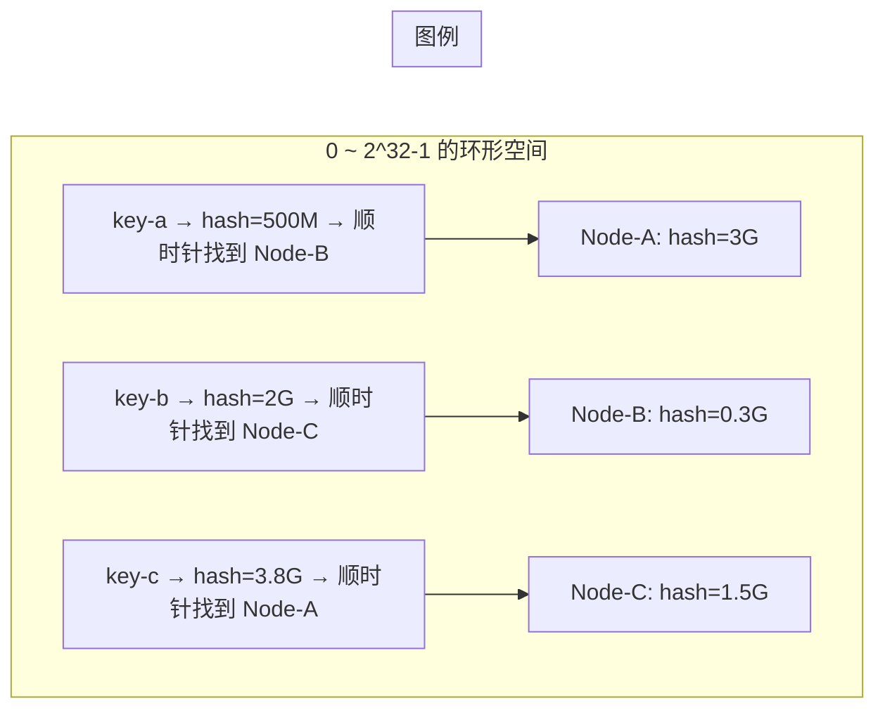
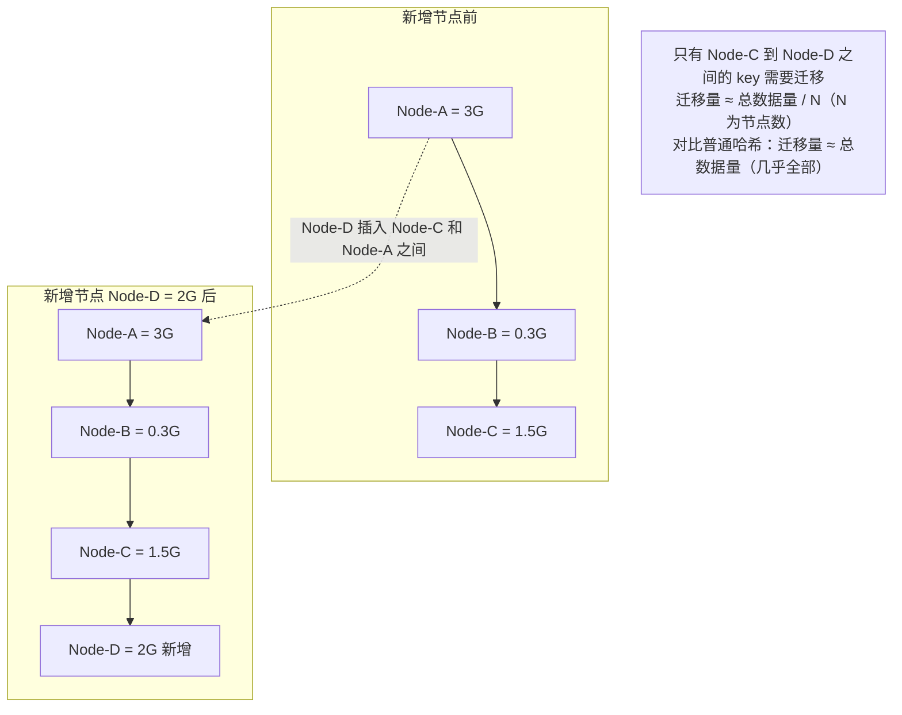

# 一致性哈希
> 创建日期：2026-06-08
> 难度：⭐⭐
> 前置知识：哈希函数、数据结构基础、分布式缓存概念
> 关联模块：Redis Cluster / Memcached / Dubbo 负载均衡

## ⭐ 面试重点速览
| 考察点 | 重要程度 | 考察频率 | 掌握目标 |
|--------|---------|---------|---------|
| 哈希环结构与节点定位 | ★★★★★ | 极高 | 能画出哈希环，说明顺时针查找规则 |
| 虚拟节点的作用与数量选择 | ★★★★★ | 极高 | 能解释为什么需要虚拟节点（负载均衡） |
| 新增/删除节点时的数据迁移量 | ★★★★ | 高 | 能推导迁移量 ≈ 1/N，与普通哈希 N 对比 |
| 与普通哈希取模的对比 | ★★★★ | 高 | 能从迁移量、单调性、扩展性三个维度对比 |
| Guava ConsistentHash 实现 | ★★★ | 中 | 知道 Guava 的实现原理和 API |

---

## 一、应用场景 🎯

一致性哈希是分布式系统中解决**数据分片与负载均衡**的核心算法。它最初由 MIT 的 Karger 等人于 1997 年提出，用于解决分布式缓存中节点动态增减时的数据迁移问题。

**典型落地场景：**

| 场景 | 代表项目 | 一致性哈希的角色 |
|------|---------|----------------|
| 分布式缓存 | Memcached、Redis Cluster | 决定 key 存储在哪个缓存节点 |
| 负载均衡 | Nginx (ip_hash)、Dubbo | 基于客户端 IP 的一致性哈希路由 |
| 分布式存储 | Amazon Dynamo、Cassandra | 数据分片，决定数据落在哪个节点 |
| CDN 调度 | CDN 边缘节点分配 | 根据请求特征将流量分配到最近的边缘节点 |
| 消息队列分区 | Kafka 分区分配 | 决定消息路由到哪个分区 |

---

## 二、核心原理 🔬

### 2.1 普通哈希取模的问题

传统的分布式缓存做法：`nodeIndex = hash(key) % N`（N 为节点数）。

当 N 变化时（新增或下线节点），几乎所有 key 的映射关系都会改变，导致**大量缓存失效**，引发缓存雪崩。

### 2.2 哈希环结构



**核心思想**：将哈希空间组织成一个首尾相接的环（通常 0 ~ 2^32-1），节点和 key 都映射到环上的一个点。每个 key 顺时针找到的第一个节点就是它的归属节点。

### 2.3 数据迁移量推导



**数学推导**：
- 假设 N 个节点均匀分布在哈希环上，新增一个节点
- 新节点只影响其「逆时针方向」到上一个节点之间的 key 区间
- 该区间长度约为 `1/N`（均匀分布假设下）
- **迁移量约为 `1/N`**，而非普通哈希的「几乎全部」

### 2.4 虚拟节点

真实节点分布不均匀时，哈希环上可能会出现「倾斜」——某些节点负责的区间远大于其他节点（数据热点）。

**虚拟节点**：为每个物理节点计算多个哈希值，在环上放置多个虚拟节点。物理节点 A 对应 VNode-A1、VNode-A2、...、VNode-Ak。

虚拟节点数量越多，分布越均匀，但管理成本也越高。通常 100~200 个虚拟节点即可达到较好的均衡效果。

---

## 三、趣味解说 🎭

> **旋转餐桌——一致性哈希现实版**

**场景**：一个巨大的圆形旋转餐桌，坐了 4 个人吃饭。每个人只能吃自己面前顺时针方向的那道菜。

**普通哈希取模（固定座位）**：
李大厨说：「座位号 = 菜名笔画数 % 4」。红烧肉是 3 号桌，清蒸鱼是 1 号桌……每道菜按公式分配。

突然王五加入，桌子变成 5 个人。李大厨重新计算：「所有菜重新分配！座位号 = 菜名笔画数 % 5」。于是——红烧肉去了 1 号桌，清蒸鱼去了 3 号桌……**几乎每道菜都换了主人，场面一片混乱**（缓存雪崩）。

**一致性哈希（旋转餐桌）**：
李大厨换了思路：在圆形桌面上标上刻度（0 ~ 2^32-1），每个人固定坐在某个刻度上。每道菜也标一个刻度，然后**顺时针旋转餐桌，菜停在谁面前就是谁的**。

王五加入时，只需要在桌面上给王五找个位置坐下。王五坐下后，只有他「逆时针方向」到上一个人之间的菜会归他——其他菜不受影响。**只有 1/5 的菜需要换主人，井井有条。**

**虚拟节点——为什么需要分身？**
如果 4 个人都挤在桌子的一侧，那另一侧的人要管半桌子的菜，累死。解决方案：每个人找 100 个替身，分散坐在桌子的不同位置。这样无论怎么坐，每个人分到的菜量都差不多——**负载均衡**。

---

## 四、代码实现 💻

```java
// ============ ConsistentHash.java — 带虚拟节点的一致性哈希实现 ============
import java.security.MessageDigest;
import java.security.NoSuchAlgorithmException;
import java.util.*;

public class ConsistentHash<T> {
    // 哈希环：TreeMap 天然支持顺时针查找（ceilingEntry / firstEntry）
    private final TreeMap<Long, T> hashRing = new TreeMap<>();
    private final int virtualNodeCount;      // 每个物理节点的虚拟节点数量
    private final MessageDigest md5;         // 用于生成哈希值

    public ConsistentHash(int virtualNodeCount, Collection<T> physicalNodes) {
        this.virtualNodeCount = virtualNodeCount;
        try {
            this.md5 = MessageDigest.getInstance("MD5");
        } catch (NoSuchAlgorithmException e) {
            throw new RuntimeException("MD5 算法不可用", e);
        }
        for (T node : physicalNodes) {
            addNode(node);
        }
    }

    /**
     * 向哈希环添加一个物理节点（及其虚拟节点）
     */
    public void addNode(T node) {
        for (int i = 0; i < virtualNodeCount; i++) {
            // 虚拟节点标识：物理节点名 + 序号
            String virtualNodeName = node.toString() + "#VN" + i;
            long hash = hash(virtualNodeName);
            hashRing.put(hash, node);        // 所有虚拟节点指向同一个物理节点
        }
    }

    /**
     * 从哈希环移除一个物理节点（及其所有虚拟节点）
     */
    public void removeNode(T node) {
        for (int i = 0; i < virtualNodeCount; i++) {
            String virtualNodeName = node.toString() + "#VN" + i;
            long hash = hash(virtualNodeName);
            hashRing.remove(hash);
        }
    }

    /**
     * 根据 key 查找对应的节点（顺时针第一个）
     * 这是核心查询方法，时间复杂度 O(log N)
     */
    public T getNode(String key) {
        if (hashRing.isEmpty()) {
            return null;
        }
        long hash = hash(key);

        // 顺时针查找：找到 >= hash 的第一个节点
        Map.Entry<Long, T> entry = hashRing.ceilingEntry(hash);
        if (entry == null) {
            // 没找到更大的，说明 key 的哈希值超过了环上所有节点
            // 回到环的起点（0 刻度处），取第一个节点
            entry = hashRing.firstEntry();
        }
        return entry.getValue();
    }

    /**
     * 使用 MD5 生成 64 位哈希值
     * 取 MD5 的前 8 字节组成 long
     */
    private long hash(String key) {
        md5.reset();
        md5.update(key.getBytes());
        byte[] digest = md5.digest();
        // 取 MD5 前 8 字节，组成 long（确保非负）
        long hash = ((long) (digest[7] & 0xFF) << 56)
                  | ((long) (digest[6] & 0xFF) << 48)
                  | ((long) (digest[5] & 0xFF) << 40)
                  | ((long) (digest[4] & 0xFF) << 32)
                  | ((long) (digest[3] & 0xFF) << 24)
                  | ((long) (digest[2] & 0xFF) << 16)
                  | ((long) (digest[1] & 0xFF) << 8)
                  | ((long) (digest[0] & 0xFF));
        return hash & 0x7FFFFFFFFFFFFFFFL;   // 确保非负值
    }

    // ============ 使用示例 ============
    public static void main(String[] args) {
        // 创建 3 个缓存节点，每个节点 150 个虚拟节点
        List<String> nodes = Arrays.asList("Cache-1", "Cache-2", "Cache-3");
        ConsistentHash<String> ch = new ConsistentHash<>(150, nodes);

        // 路由 100 个 key，统计每个节点的命中数
        Map<String, Integer> distribution = new HashMap<>();
        for (String node : nodes) {
            distribution.put(node, 0);
        }
        for (int i = 0; i < 10000; i++) {
            String node = ch.getNode("user:" + i);
            distribution.merge(node, 1, Integer::sum);
        }
        System.out.println("初始分布: " + distribution);

        // 新增节点 Cache-4，看看迁移量
        ch.addNode("Cache-4");
        distribution.put("Cache-4", 0);
        int migrated = 0;
        for (int i = 0; i < 10000; i++) {
            String oldNode = ch.getNode("user:" + i); // 注意：这里实际应该对比前后
            distribution.merge(oldNode, 1, Integer::sum);
            // 此处简化：实际迁移量 = 归属发生变化的 key 数量
        }
        System.out.println("新增节点后分布: " + distribution);
        // 预期：Cache-4 拿到约 1/4 = 2500 个 key，迁移量约 2500
    }
}
```

```java
// ============ Guava ConsistentHash 使用示例 ============
// 如果项目中使用 Guava，可以直接使用内置实现
import com.google.common.hash.HashFunction;
import com.google.common.hash.Hashing;

public class GuavaConsistentHashExample {
    public static void main(String[] args) {
        // Guava 的一致性哈希（基于 murmur3_32）
        HashFunction hf = Hashing.murmur3_32_fixed();

        // 创建 4 个 bucket（相当于 4 个物理节点）
        int bucket = Hashing.consistentHash(hf.hashString("user:12345", UTF_8), 4);
        System.out.println("user:12345 → bucket " + bucket);

        // 扩到 5 个 bucket，只有部分 key 迁移
        int newBucket = Hashing.consistentHash(hf.hashString("user:12345", UTF_8), 5);
        System.out.println("扩到 5 个 bucket 后: user:12345 → bucket " + newBucket);
        // 约 4/5 的 key 不会改变 bucket
    }
}
```

---

## 五、优缺点 ⚖️

| 维度 | 优点 | 缺点 |
|------|-----|------|
| **扩展性** | 新增/删除节点只需迁移约 1/N 的数据，非常适合动态扩缩容 | 无虚拟节点时负载均衡效果差，容易产生热点 |
| **单调性** | 新增节点后，只有新增节点覆盖区间的 key 需要迁移，其余 key 归属不变 | 删除节点时，该节点覆盖区间的 key 需要迁移到顺时针下一个节点 |
| **实现复杂度** | 核心逻辑简单（TreeMap + ceilingEntry），容易理解和维护 | 虚拟节点管理、哈希函数选择、一致性检查需要额外关注 |
| **容错性** | 单节点故障不影响其他节点，只影响其覆盖区间的 key | 需要配合副本机制（Replica）才能实现数据不丢失 |
| **性能** | 节点定位 O(log N)，通过选择合适的数据结构可达 O(1) | 大量虚拟节点时内存占用增加（每个虚拟节点约 8~16 字节） |

---

## 六、面试高频题 📝

### Q1：一致性哈希和普通哈希取模的核心区别是什么？
**答**：普通哈希取模（`hash(key) % N`）在 N 变化时，几乎所有 key 的映射都会改变，导致大量缓存失效。一致性哈希将节点和 key 都映射到哈希环上，key 顺时针找最近的节点。新增/删除节点只影响相邻区间，迁移量约为 1/N。

### Q2：为什么需要虚拟节点？
**答**：物理节点在哈希环上的分布可能不均匀（哈希碰撞、节点数量少），导致负载倾斜。虚拟节点通过为每个物理节点创建多个「分身」均匀散布在环上，保证负载均衡。虚拟节点数量越多，分布越均匀，但内存开销也越大（通常 100~200 个即可）。

### Q3：新增一个节点后，数据迁移量是多少？
**答**：假设原本有 N 个节点均匀分布，新增一个节点后，只有新节点逆时针方向到上一个节点之间的 key 需要迁移。该区间长度约为 1/N（均匀分布下），因此迁移量约为总数据量的 1/N。相比之下，普通哈希取模的迁移量接近 100%。

### Q4：如何选择哈希函数？
**答**：需要满足：(1) **均匀性**：哈希值在环上均匀分布；(2) **低碰撞率**：不同 key 的哈希值尽量不重复；(3) **性能**：计算速度快。常用选择：MurmurHash（高性能，Guava 默认）、MD5（安全性好但较慢）、FNV（简单快速）。

### Q5：Redis Cluster 如何使用一致性哈希？
**答**：Redis Cluster 使用的不是一致性哈希，而是**哈希槽（Hash Slot）**。它将 16384 个槽位分配给不同节点，`slot = CRC16(key) % 16384`。这与一致性哈希的目标一致（减少迁移），但实现方式不同：槽位是固定的，节点与槽的映射可以动态调整。

---

## 七、常见误区 ❌

| 误区 | 正确理解 |
|------|---------|
| 「一致性哈希保证数据完全均匀分布」 | 无虚拟节点时分布是不均匀的；有虚拟节点后也只是「近似均匀」，不是绝对均匀 |
| 「Redis Cluster 用了一致性哈希」 | Redis Cluster 用的是哈希槽（16384 个固定槽），不是一致性哈希环 |
| 「一致性哈希新增节点不需要迁移数据」 | 需要迁移，但迁移量约 1/N（远小于普通哈希的接近全部） |
| 「虚拟节点数量越多越好」 | 虚拟节点过多会增加内存开销和查找时间，通常 100~200 个即可达到良好均衡 |
| 「一致性哈希只用于缓存」 | 它也用于分布式存储（Dynamo/Cassandra）、负载均衡（Nginx ip_hash）、CDN 调度等 |
| 「哈希函数选 MD5 就行」 | MD5 安全性好但计算慢，生产环境通常用 MurmurHash 或 CityHash 等高性能哈希函数 |