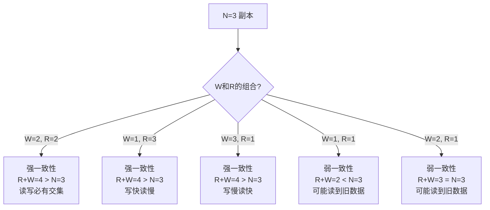
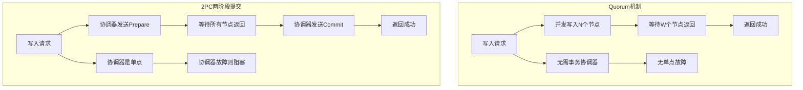

# Quorum机制
> 创建日期：2026-06-08
> 难度：⭐⭐
> 前置知识：CAP理论、一致性、分布式存储
> 关联模块：NRW读写模型、最终一致性、Cassandra一致性级别

## ⭐ 面试重点速览
| 考察点 | 重要程度 | 考察频率 | 掌握目标 |
|--------|----------|----------|----------|
| NRW模型推导 | ⭐⭐⭐⭐⭐ | ⭐⭐⭐⭐ | 理解R+W>N的含义 |
| 不同N/W/R组合效果 | ⭐⭐⭐⭐⭐ | ⭐⭐⭐⭐ | 掌握一致性级别 |
| 与2PC/3PC区别 | ⭐⭐⭐⭐ | ⭐⭐⭐ | 理解Quorum优势 |
| Cassandra一致性级别 | ⭐⭐⭐⭐ | ⭐⭐⭐ | 掌握实际应用 |
| 读写Quorum计算 | ⭐⭐⭐ | ⭐⭐ | 掌握公式推导 |

## 一、应用场景 🎯

Quorum机制（法定人数机制）是分布式系统中保证数据一致性的核心机制，广泛应用于：

1. **分布式数据库的读写一致性**
   - Cassandra、DynamoDB等存储系统
   - 通过控制读写参与节点数来调节一致性级别

2. **分布式锁服务**
   - ZooKeeper的ZAB协议中要求过半节点ACK
   - Redis Sentinel的故障转移投票

3. **分布式选举**
   - Raft协议中要求过半节点投票
   - Leader选举的法定人数确认

4. **分布式文件系统**
   - HDFS的NameNode高可用
   - 存储节点写入确认策略

5. **微服务配置中心**
   - 配置变更需要过半节点确认
   - 防止网络分区导致配置不一致

## 二、核心原理 🔬

### 2.1 NRW读写模型

Quorum机制的核心是**NRW模型**：

- **N**：数据副本总数（复制因子）
- **R**：一次成功读操作需要的最少节点数
- **W**：一次成功写操作需要的最少节点数

### 2.2 核心公式推导

**保证强一致性：R + W > N**

推导过程：
- 写操作：成功写入W个节点（W <= N）
- 读操作：从R个节点读取（R <= N）
- 因为R + W > N，所以读操作的R个节点中**至少有一个节点**包含最新写入的数据
- 因此读操作一定能读到最新数据

**直觉理解**：
- 写操作只在W个节点上成功，但读操作会从R个节点中读取
- 如果W + R > N，那么写集合和读集合必然有交集
- 这意味着读操作一定能读到至少一个写了最新数据的节点

### 2.3 不同组合的效果

以N=3为例，不同组合产生不同的一致性级别：



**N=3的典型组合：**

| 组合 | W | R | 一致性 | 写性能 | 读性能 | 可用性 |
|------|---|---|--------|--------|--------|--------|
| ONE | 1 | 1 | 弱 | 最快 | 最快 | 最高 |
| QUORUM | 2 | 2 | 强 | 中等 | 中等 | 中等 |
| ALL | 3 | 3 | 强 | 最慢 | 最慢 | 最低 |
| ONE写+QUORUM读 | 1 | 2 | 强 | 快 | 中等 | 高 |
| QUORUM写+ONE读 | 2 | 1 | 弱 | 中等 | 快 | 中等 |

### 2.4 Cassandra一致性级别

Cassandra在主流的分布式数据库中，一致性级别支持最灵活：

| 级别 | 含义 | 说明 |
|------|------|------|
| ONE | 1个节点响应 | 快速但可能不一致 |
| TWO | 2个节点响应 | 中等 |
| THREE | 3个节点响应 | 高一致性 |
| QUORUM | 过半节点响应 | 平衡一致性和性能 |
| ALL | 所有节点响应 | 最强一致性，最低可用性 |
| LOCAL_QUORUM | 本地DC过半 | 跨数据中心场景 |
| EACH_QUORUM | 每个DC都过半 | 跨数据中心强一致 |
| ANY | 任意节点（含Hinted Handoff） | 写入可用性最高 |

### 2.5 Quorum vs 分布式事务



### 2.6 写冲突处理

当W=1时，不同节点可能同时写入：

1. **最后写入胜出（LWW）**：基于时间戳，保留最新的
2. **向量时钟检测**：检测冲突，交给应用层解决
3. **读修复（Read Repair）**：读时发现不一致，自动修复

## 三、趣味解说 🎭

想象一下，班级要**选班长投票**：

规则是：全班有**N个同学**，每个同学手里有一票。

- 想当班长必须获得至少**W个同意票**
- 如果有人想检查投票结果，至少要问**R个同学**

问题来了：怎么保证检查结果的人看到的都是最终结果呢？

**答案：R + W > N**

为什么呢？因为：
- 如果当选需要W个人同意
- 检查时问了R个人
- 当R + W > N时，问的R个人里**至少有一个是投了同意票的**
- 所以检查者一定能发现谁当选了！

举个例子：全班10个人（N=10），选班长需要6张同意票（W=6），你检查时问了5个同学（R=5）。6+5=11 > 10，所以你问的5个人里至少有1个投了同意票，你一定能知道谁是班长。

但如果选班长只需要3张同意票（W=3），你只问了2个同学（R=2），3+2=5 < 10，那你问的2个人可能都没投过票，你就不知道谁当选了。

这就是Quorum的奥秘：**只要读写集合足够大，就一定会有交集，就能保证一致性！** 🎯

## 四、代码实现 💻

以下是用Java实现Quorum机制的示例代码：

```java
import java.util.*;
import java.util.concurrent.*;
import java.util.concurrent.atomic.AtomicInteger;

/**
 * Quorum节点：存储数据副本
 */
class QuorumNode {
    private final int nodeId;
    private final Map<String, VersionedValue> store;
    private volatile boolean isAlive;

    public QuorumNode(int nodeId) {
        this.nodeId = nodeId;
        this.store = new ConcurrentHashMap<>();
        this.isAlive = true;
    }

    public int getNodeId() { return nodeId; }
    public boolean isAlive() { return isAlive; }
    public void setAlive(boolean alive) { this.isAlive = alive; }

    /**
     * 写入数据
     */
    public void write(String key, String value, int version) {
        if (!isAlive) throw new RuntimeException("Node " + nodeId + " is down");
        store.put(key, new VersionedValue(value, version, System.currentTimeMillis()));
        System.out.println("Node " + nodeId + " wrote: " + key + "=" + value + " v" + version);
    }

    /**
     * 读取数据
     */
    public VersionedValue read(String key) {
        if (!isAlive) throw new RuntimeException("Node " + nodeId + " is down");
        return store.get(key);
    }
}

/**
 * 带版本号的数据值
 */
class VersionedValue {
    private final String value;
    private final int version;
    private final long timestamp;

    public VersionedValue(String value, int version, long timestamp) {
        this.value = value;
        this.version = version;
        this.timestamp = timestamp;
    }

    public String getValue() { return value; }
    public int getVersion() { return version; }
    public long getTimestamp() { return timestamp; }

    @Override
    public String toString() {
        return String.format("{%s v%d}", value, version);
    }
}

/**
 * Quorum协调器：管理多节点的读写操作
 */
class QuorumCoordinator {
    private final List<QuorumNode> nodes;  // N个副本节点
    private final int N;                   // 副本总数
    private final int W;                   // 写法定数
    private final int R;                   // 读法定数
    private final AtomicInteger globalVersion = new AtomicInteger(0);
    private final ExecutorService executor;

    public QuorumCoordinator(int N, int W, int R) {
        this.N = N;
        this.W = W;
        this.R = R;
        this.nodes = new ArrayList<>();
        this.executor = Executors.newFixedThreadPool(N);

        // 校验：R + W > N 以保证强一致性
        if (R + W <= N) {
            System.out.println("WARNING: R+W=" + (R + W) + " <= N=" + N +
                             ", may read stale data!");
        }

        // 创建节点
        for (int i = 0; i < N; i++) {
            nodes.add(new QuorumNode(i));
        }
    }

    /**
     * 写入数据：需要W个节点成功才返回
     */
    public boolean write(String key, String value) {
        // 生成新的全局版本号
        int version = globalVersion.incrementAndGet();
        CountDownLatch latch = new CountDownLatch(W);
        AtomicInteger successCount = new AtomicInteger(0);

        System.out.println("\n--- Write: " + key + "=" + value + " v" + version +
                         " (need W=" + W + ") ---");

        // 并发向所有节点写入
        for (QuorumNode node : nodes) {
            executor.submit(() -> {
                try {
                    if (node.isAlive()) {
                        node.write(key, value, version);
                        int count = successCount.incrementAndGet();
                        latch.countDown();
                        System.out.println("  Write success: node " + node.getNodeId() +
                                         ", committed=" + count + "/" + W);
                    }
                } catch (Exception e) {
                    System.out.println("  Write failed: node " + node.getNodeId() +
                                     " is down, skipping");
                }
            });
        }

        try {
            // 等待W个节点写入成功
            boolean quorumReached = latch.await(5, TimeUnit.SECONDS);
            if (quorumReached && successCount.get() >= W) {
                System.out.println("Write SUCCESS: " + successCount.get() +
                                 " nodes committed (>= W=" + W + ")");
                return true;
            } else {
                System.out.println("Write FAILED: only " + successCount.get() +
                                 " nodes committed (need W=" + W + ")");
                return false;
            }
        } catch (InterruptedException e) {
            Thread.currentThread().interrupt();
            return false;
        }
    }

    /**
     * 读取数据：从R个节点读取，返回最新的版本
     */
    public String read(String key) {
        CountDownLatch latch = new CountDownLatch(R);
        List<VersionedValue> results = new CopyOnWriteArrayList<>();

        System.out.println("\n--- Read: " + key + " (need R=" + R + ") ---");

        // 并发从所有节点读取
        for (QuorumNode node : nodes) {
            executor.submit(() -> {
                try {
                    if (node.isAlive()) {
                        VersionedValue vv = node.read(key);
                        if (vv != null) {
                            results.add(vv);
                            System.out.println("  Read from node " + node.getNodeId() +
                                             ": " + vv);
                        }
                    }
                } catch (Exception e) {
                    System.out.println("  Read failed: node " + node.getNodeId() +
                                     " is down");
                } finally {
                    latch.countDown();
                }
            });
        }

        try {
            latch.await(5, TimeUnit.SECONDS);
        } catch (InterruptedException e) {
            Thread.currentThread().interrupt();
        }

        if (results.isEmpty()) {
            System.out.println("Read FAILED: no data found");
            return null;
        }

        // 取版本号最大的值
        VersionedValue latest = results.stream()
            .max(Comparator.comparingInt(VersionedValue::getVersion)
                .thenComparingLong(VersionedValue::getTimestamp))
            .orElse(null);

        if (latest != null) {
            System.out.println("Read SUCCESS: latest value = " + latest.getValue() +
                             " (v" + latest.getVersion() + ")");
            // 读修复：将最新值同步到旧节点
            repairInconsistentNodes(key, latest);
            return latest.getValue();
        }
        return null;
    }

    /**
     * 读修复：将最新版本写入不一致的节点
     */
    private void repairInconsistentNodes(String key, VersionedValue latest) {
        for (QuorumNode node : nodes) {
            if (!node.isAlive()) continue;
            VersionedValue nodeValue = node.read(key);
            if (nodeValue == null || nodeValue.getVersion() < latest.getVersion()) {
                System.out.println("  Read Repair: updating node " + node.getNodeId() +
                                 " to v" + latest.getVersion());
                node.write(key, latest.getValue(), latest.getVersion());
            }
        }
    }

    /**
     * 模拟节点宕机
     */
    public void setNodeDown(int nodeId) {
        if (nodeId >= 0 && nodeId < N) {
            nodes.get(nodeId).setAlive(false);
            System.out.println("Node " + nodeId + " is now DOWN");
        }
    }

    /**
     * 模拟节点恢复
     */
    public void setNodeUp(int nodeId) {
        if (nodeId >= 0 && nodeId < N) {
            nodes.get(nodeId).setAlive(true);
            System.out.println("Node " + nodeId + " is now UP");
        }
    }

    public void shutdown() {
        executor.shutdown();
    }
}

/**
 * Quorum机制演示
 */
public class QuorumDemo {
    public static void main(String[] args) throws Exception {
        System.out.println("========== Quorum机制演示 ==========\n");

        // 测试1: N=3, W=2, R=2 (强一致性 R+W=4 > N=3)
        System.out.println(">>> 测试1: N=3, W=2, R=2 (强一致性)");
        testQuorum(3, 2, 2, "强一致性");

        Thread.sleep(1000);

        // 测试2: N=3, W=1, R=1 (弱一致性 R+W=2 < N=3)
        System.out.println("\n\n>>> 测试2: N=3, W=1, R=1 (弱一致性)");
        testQuorum(3, 1, 1, "弱一致性");

        Thread.sleep(1000);

        // 测试3: Cassandra风格 QUORUM (N=3, W=2, R=2)
        System.out.println("\n\n>>> 测试3: Cassandra QUORUM (N=3, W=2, R=2)");
        testQuorum(3, 2, 2, "Cassandra QUORUM");

        Thread.sleep(1000);

        // 测试4: Cassandra风格 ONE (N=3, W=1, R=1)
        System.out.println("\n\n>>> 测试4: Cassandra ONE (N=3, W=1, R=1)");
        testQuorum(3, 1, 1, "Cassandra ONE");

        Thread.sleep(1000);

        // 测试5: ALL (N=3, W=3, R=3)
        System.out.println("\n\n>>> 测试5: ALL (N=3, W=3, R=3)");
        testQuorum(3, 3, 3, "ALL");

        System.out.println("\n========== 演示结束 ==========");
    }

    private static void testQuorum(int N, int W, int R, String label) {
        QuorumCoordinator coordinator = new QuorumCoordinator(N, W, R);

        try {
            // 写入数据
            boolean writeOk = coordinator.write("user:1001", "Alice");
            System.out.println("Write result: " + (writeOk ? "OK" : "FAIL"));

            // 读取数据
            String value = coordinator.read("user:1001");
            System.out.println("Read result: " + value);

            // 检查一致性保证
            String rPlusW = "R+W=" + (R + W) + " vs N=" + N;
            String guarantee = (R + W > N) ? "强一致性保证" : "弱一致性（可能读到旧数据）";
            System.out.println("[" + label + "] " + rPlusW + " -> " + guarantee);
        } finally {
            coordinator.shutdown();
        }
    }
}
```

## 五、优缺点 ⚖️

### 优点 ✅

1. **灵活性高**
   - 可以自由调节R和W的值
   - 根据业务需求在一致性和性能之间权衡
   - 支持不同级别的一致性配置

2. **无单点故障**
   - 不需要协调器，操作直接并发到多个节点
   - 没有2PC的阻塞问题
   - 部分节点宕机不影响服务

3. **性能可调优**
   - 降低W可以提高写入性能
   - 降低R可以提高读取性能
   - 根据场景灵活配置

4. **实现简单**
   - 核心逻辑简单清晰
   - 不需要复杂的分布式事务协议
   - 调试和运维相对容易

5. **天然支持最终一致性**
   - 读修复机制自动修复不一致
   - 版本号机制解决冲突
   - 适合AP型系统

### 缺点 ❌

1. **不能完全保证强一致性**
   - 当R+W<=N时，可能读到脏数据
   - 即使R+W>N，也需要正确处理并发冲突
   - 没有事务隔离级别概念

2. **写冲突问题**
   - 多个客户端同时写入相同数据会产生冲突
   - 需要冲突解决策略（LWW、向量时钟等）
   - 某些场景会丢失写入

3. **网络分区问题**
   - 网络分区导致节点数不足，可能无法达到法定人数
   - 必须权衡可用性和一致性

4. **节点恢复复杂**
   - 宕机节点恢复后数据可能落后
   - 需要全量同步或增量同步
   - 读修复只能修复读到的数据

## 六、面试高频题 📝

### Q1: 什么是Quorum机制？R+W>N的含义是什么？

**A**:
Quorum机制是分布式系统中通过控制读写参与节点数来保证一致性的机制。N是副本总数，R是读操作需要的最少节点数，W是写操作需要的最少节点数。

R+W>N保证强一致性的原因：因为读写集合之和大于总节点数，所以读写集合必然有交集，读操作读到的R个节点中至少有一个包含最新写入的数据，因此能读到最新值。

### Q2: N=3时，W=2,R=2和W=1,R=2的区别？

**A**:
- W=2,R=2：写操作需要2个节点确认，读操作需要2个节点，R+W=4>3，保证强一致性，写性能中等
- W=1,R=2：写操作只需1个节点确认，写入快，读操作需要2个节点，R+W=3=N，不能保证强一致性（可能读到旧数据），写性能高

### Q3: Cassandra中QUORUM和ONE的区别？

**A**:
- QUORUM：需要过半节点响应（N=3时W=2或R=2），保证强一致性，性能中等
- ONE：只需1个节点响应，不保证强一致性，但性能最高
- 选择：对一致性要求高选QUORUM，对性能要求高选ONE

### Q4: Quorum机制和2PC的区别？

**A**:
| 对比 | Quorum | 2PC |
|------|--------|-----|
| 协调器 | 无需协调器 | 需要协调器 |
| 阻塞 | 不阻塞 | 协调器故障会阻塞 |
| 一致性 | 依赖配置 | 保证强一致性 |
| 性能 | 较好 | 较差 |
| 复杂度 | 简单 | 复杂 |

### Q5: N=5时，W=3,R=3，还能保证一致性吗？

**A**:
能。R+W=3+3=6>5，满足R+W>N，保证强一致性。读写集合一定有交集，读操作一定能读到最新数据。

## 七、常见误区 ❌

### 误区1：Quorum机制一定能保证强一致性 ❌

**正确理解**：Quorum机制只有在R+W>N时才能保证强一致性。如果R+W<=N，读写集合可能没有交集，读操作可能读到旧数据。此外，并发写入时还需要冲突解决策略。

### 误区2：Quorum是Paxos/Raft的替代品 ❌

**正确理解**：Quorum是读写一致性保证机制，Paxos/Raft是共识算法。两者的层次不同：
- Quorum用于控制读写操作的一致性级别
- Paxos/Raft用于达成分布式共识（如选举、日志复制等）
- 两者经常配合使用（如Raft使用Quorum确认日志复制）

### 误区3：Quorum的R和W必须相等 ❌

**正确理解**：R和W不需要相等。可以配置为W=1,R=2（写快读慢），或W=2,R=1（写慢读快），只要满足R+W>N就能保证强一致性。

### 误区4：Quorum机制可以替代事务 ❌

**正确理解**：Quorum只保证单次读写的最终一致性，不提供事务的ACID特性。不能替代事务。不能保证隔离性、原子性等事务特性。

### 误区5：N必须是奇数 ❌

**正确理解**：N可以是任意正整数。但为了选举方便和避免平票，通常选奇数。Quorum计算公式：QUORUM = N/2 + 1。N=4时，QUORUM=3；N=5时，QUORUM=3。

### 误区6：写操作需要等所有N个节点成功 ❌

**正确理解**：Quorum写操作只需要W个节点成功即可返回，不需要等N个。W可以小于N，这是性能和一致性的权衡。异步地，系统会慢慢把数据同步到其余节点。