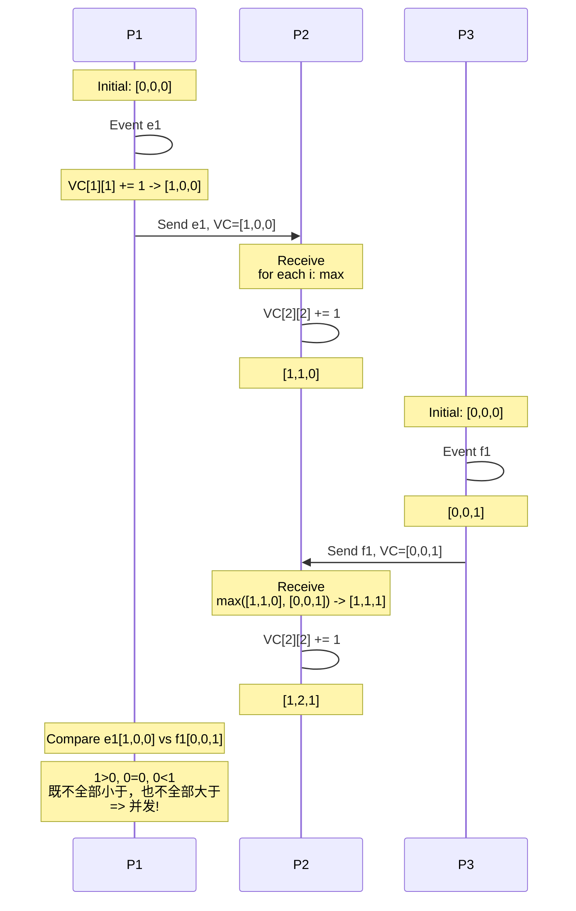

# 向量时钟
> 创建日期：2026-06-08
> 难度：⭐⭐⭐
> 前置知识：分布式一致性、因果关系、Lamport时钟
> 关联模块：因果顺序、并发冲突检测、版本控制

## ⭐ 面试重点速览
| 考察点 | 重要程度 | 考察频率 | 掌握目标 |
|--------|----------|----------|----------|
| 向量时钟核心原理 | ⭐⭐⭐⭐⭐ | ⭐⭐⭐⭐ | 理解时钟向量作用 |
| 因果顺序判定规则 | ⭐⭐⭐⭐⭐ | ⭐⭐⭐⭐ | 掌握三种比较规则 |
| 并发冲突检测 | ⭐⭐⭐⭐⭐ | ⭐⭐⭐⭐ | 掌握并发判断条件 |
| 与Lamport时钟对比 | ⭐⭐⭐⭐ | ⭐⭐⭐ | 理解优缺点差异 |
| Git分布式版本控制 | ⭐⭐⭐ | ⭐⭐ | 了解实际应用 |

## 一、应用场景 🎯

向量时钟是分布式系统中跟踪事件因果关系的技术，主要应用场景：

1. **分布式版本控制**
   - Git分布式版本管理
   - 检测多个分支并发修改
   - 识别需要合并的冲突

2. **分布式存储冲突检测**
   - Cassandra/Dynamo中检测写冲突
   - 帮助解决"最后写入胜出"无法解决的并发问题
   - 提示用户手动解决冲突

3. **因果一致性维护**
   - 在分布式系统中维护因果一致性
   - 保证因果依赖事件按顺序执行
   - 给应用层提供因果信息

4. **分布式消息排序**
   - 确定消息之间的因果关系
   - 保证消费者按因果顺序处理消息
   - 避免因果倒置问题

5. **社交网络消息流**
   - 检测好友之间的点赞和评论因果关系
   - 保证评论顺序正确

6. **调试分布式系统**
   - 通过向量时钟追踪事件因果链
   - 定位分布式bug发生的顺序

## 二、核心原理 🔬

### 2.1 基本定义

向量时钟是每个节点维护一个**向量（数组）**：
- 向量长度 = 系统中节点总数
- 向量的第i个元素表示节点i的逻辑时钟值
- 每个节点每次更新自己的时钟，递增自己对应的位置

符号表示：VC[P]表示节点P的向量时钟，VC[P][i]表示节点P记录的节点i的时钟值。

### 2.2 更新规则

1. **节点P发送事件前**：
   - VC[P][P] = VC[P][P] + 1
   - 将当前向量随消息发送出去

2. **节点Q接收消息后**：
   - 对所有节点i：VC[Q][i] = max(VC[Q][i], VC[P][i])
   - VC[Q][Q] = VC[Q][Q] + 1

### 2.3 比较规则（判断因果关系）

给定向量时钟A和向量时钟B，三种情况：

```mermaid
flowchart TD
    A[开始比较A和B] --> B{对于所有i: A[i] <= B[i]}
    B -->|是| C[所以A happened-before B<br/>A因果先于B]
    B -->|否| D{对于所有i: B[i] <= A[i]}
    D -->|是| E[所以B happened-before A<br/>B因果先于A]
    D -->|否| F[A和B并发<br/>存在冲突]
    F --> G[两个事件并发，没有因果关系]
    C --> H[结束]
    E --> H
    G --> H
```

总结三种规则：

1. **A happened-before B**（A因果先于B）：对所有i，A[i] <= B[i]，且至少有一个i，A[i] < B[i]
2. **B happened-before A**（B因果先于A）：对所有i，B[i] <= A[i]，且至少有一个i，B[i] < A[i]
3. **并发（concurrent）**：既不满足1也不满足2，说明两个事件并发，存在因果冲突

### 2.4 示例演示（3个节点）



**比较结果**：
- e1: [1, 0, 0]（P1上第一个事件）
- f1: [0, 0, 1]（P3上第一个事件）
- 比较：e1[0] = 1 > 0 = f1[0]，但 e1[2] = 0 < 1 = f1[2]
- 结论：e1 和 f1 **并发**，存在因果冲突

### 2.5 向量时钟 vs Lamport逻辑时钟

| 对比维度 | 向量时钟 | Lamport时钟 |
|---------|----------|------------|
| 表示方式 | 向量数组 | 单个整数 |
| 存储空间 | O(N) | O(1) |
| 能判断因果顺序吗 | 能，还能检测并发 | 只能排序，不能检测并发 |
| 如果a→b，一定有a < b | 一定满足 | 一定满足 |
| 如果a < b，一定有a→b | 不成立才是并发，成立才是因果 | 成立，但不一定有因果 |
| 适用场景 | 冲突检测、因果一致性 | 全序排序事件 |
| 空间开销 | 随节点数增长 | 恒定 |

### 2.6 空间优化：版本向量

实际应用中，不是每个节点都更新，通常使用**版本向量**优化：
- 只记录每个副本分区的版本
- 每个副本递增自己的计数器
- 比较规则和向量时钟一样
- 空间：O(R)，R是副本数，远小于节点数N

## 三、趣味解说 🎭

想象一下，每个人（节点）都随身带一个**小记事本**📒：

- 记事本每一页对应一个同事（其他节点）
- 每次你自己做一件事，就在自己那一页加一笔 ✍️
- 你把消息发给别人时，也要把整个记事本一起发给对方
- 别人收到你的消息后：
  1. 把记事本上每个数，和自己本子上对应页比，每个人都保留大的那个数
  2. 最后给自己那页加一笔

这样一来，每个人记事本里都记录了：**我知道的每个人做了多少件事**。

现在想知道：谁先谁后？

- 如果A记事本上所有人的数，都**小于等于**B记事本上对应页数，那就说明A一定在B之前发生，B肯定知道A做的事。
- 如果反过来，B所有人都小于等于A，那B一定在A之前。
- 如果**一部分A大，一部分B大**，说明这两件事是并发的——两个人都不知道对方做了这件事，这就是冲突！

举个例子：
- 小明（节点1）：我做了1件事，不知道其他人做了什么 → [1, 0]
- 小红（节点2）：我不知道小明做了什么，我做了1件事 → [0, 1]
- 比较发现：小明的1 > 小红的0（第一页），但小明的0 < 小红的1（第二页）
- 这就说明：小明和小红是**并发写**，需要手动解决冲突 ✨

这就像Git的分支！你在master分支改了，同事在feature分支也改了，你们都不知道对方改了什么，这就是并发，需要合并解决冲突。向量时钟就帮你检测出这种情况！🎯

## 四、代码实现 💻

以下是Java实现向量时钟的示例代码：

```java
import java.util.*;
import java.util.concurrent.ConcurrentHashMap;
import java.util.stream.Collectors;

/**
 * 向量时钟：使用Map实现（支持动态节点加入）
 * key: 节点ID
 * value: 该节点的逻辑时钟值
 */
public class VectorClock {
    private final Map<String, Integer> clock;

    public VectorClock() {
        this.clock = new ConcurrentHashMap<>();
    }

    public VectorClock(Map<String, Integer> other) {
        this.clock = new ConcurrentHashMap<>(other);
    }

    /**
     * 本地事件发生：递增当前节点的时钟
     */
    public void increment(String nodeId) {
        clock.put(nodeId, get(nodeId) + 1);
    }

    /**
     * 获取某个节点的时钟值
     */
    public int get(String nodeId) {
        return clock.getOrDefault(nodeId, 0);
    }

    /**
     * 合并对方时钟（接收消息时）：对每个节点取max
     */
    public void merge(VectorClock other) {
        for (Map.Entry<String, Integer> entry : other.clock.entrySet()) {
            String nodeId = entry.getKey();
            int otherVal = entry.getValue();
            clock.put(nodeId, Math.max(get(nodeId), otherVal));
        }
    }

    /**
     * 接收消息后的标准处理：merge然后increment当前节点
     */
    public void receive(VectorClock senderClock, String receiverId) {
        merge(senderClock);
        increment(receiverId);
    }

    /**
     * 比较关系：判断当前时钟和另一个时钟的因果关系
     */
    public CausalRelation compare(VectorClock other) {
        boolean thisLessOther = true;
        boolean otherLessThis = true;

        // 检查所有出现在任意一方的节点
        Set<String> allNodes = new HashSet<>(clock.keySet());
        allNodes.addAll(other.clock.keySet());

        for (String nodeId : allNodes) {
            int thisVal = this.get(nodeId);
            int otherVal = other.get(nodeId);

            if (thisVal > otherVal) {
                thisLessOther = false;
            }
            if (otherVal > thisVal) {
                otherLessThis = false;
            }
        }

        if (thisLessOther && !otherLessThis) {
            return CausalRelation.HAPPENS_BEFORE;
        }
        if (otherLessThis && !thisLessOther) {
            return CausalRelation.HAPPENS_AFTER;
        }
        if (thisLessOther && otherLessThis) {
            // 完全相等
            return CausalRelation.EQUAL;
        }
        // 都不是，说明并发
        return CausalRelation.CONCURRENT;
    }

    /**
     * 判断是否this happened-before other
     */
    public boolean happensBefore(VectorClock other) {
        CausalRelation relation = compare(other);
        return relation == CausalRelation.HAPPENS_BEFORE ||
               relation == CausalRelation.EQUAL;
    }

    /**
     * 判断两个版本是否并发冲突
     */
    public boolean isConcurrentWith(VectorClock other) {
        CausalRelation relation = compare(other);
        return relation == CausalRelation.CONCURRENT;
    }

    /**
     * 创建副本
     */
    public VectorClock copy() {
        return new VectorClock(clock);
    }

    /**
     * 获取内部时钟快照
     */
    public Map<String, Integer> snapshot() {
        return Collections.unmodifiableMap(new HashMap<>(clock));
    }

    @Override
    public String toString() {
        List<String> entries = clock.entrySet().stream()
            .sorted(Map.Entry.comparingByKey())
            .map(e -> e.getKey() + ":" + e.getValue())
            .collect(Collectors.toList());
        return "[" + String.join(", ", entries) + "]";
    }

    @Override
    public boolean equals(Object o) {
        if (this == o) return true;
        if (o == null || getClass() != o.getClass()) return false;
        VectorClock that = (VectorClock) o;
        return Objects.equals(clock, that.clock);
    }

    @Override
    public int hashCode() {
        return Objects.hash(clock);
    }
}

/**
 * 因果关系枚举
 */
enum CausalRelation {
    HAPPENS_BEFORE,  // 当前先于对方
    HAPPENS_AFTER,   // 当前后于对方
    CONCURRENT,      // 并发
    EQUAL            // 相同
}

/**
 * 分布式存储中的版本对象（带向量时钟）
 */
class VersionedData {
    private final String key;
    private final String value;
    private final VectorClock version;

    public VersionedData(String key, String value, VectorClock version) {
        this.key = key;
        this.value = value;
        this.version = version;
    }

    public String getValue() { return value; }
    public VectorClock getVersion() { return version; }
}

/**
 * 分布式节点：每个节点维护自己的向量时钟和数据
 */
class DistributedNode {
    private final String nodeId;
    private final VectorClock localClock;
    private final Map<String, VersionedData> dataStore;
    private final List<DistributedNode> peers; // 所有节点列表

    public DistributedNode(String nodeId, List<DistributedNode> peers) {
        this.nodeId = nodeId;
        this.localClock = new VectorClock();
        this.dataStore = new ConcurrentHashMap<>();
        this.peers = peers;
    }

    public String getNodeId() { return nodeId; }
    public VectorClock getLocalClock() { return localClock.copy(); }

    /**
     * 本地写入数据
     */
    public void write(String key, String value) {
        // 本地事件：递增自己时钟
        localClock.increment(nodeId);
        VectorClock newVersion = localClock.copy();
        dataStore.put(key, new VersionedData(key, value, newVersion));
        System.out.println("Node " + nodeId + " wrote " + key + "=" + value +
                         ", version: " + newVersion);
    }

    /**
     * 接收其他节点发送的数据和版本
     */
    public void receiveWrite(String key, String value, VectorClock senderVersion) {
        // 接收后合并版本，然后递增自己
        localClock.receive(senderVersion, nodeId);
        VectorClock newVersion = localClock.copy();
        dataStore.put(key, new VersionedData(key, value, newVersion));
        System.out.println("Node " + nodeId + " received " + key + "=" + value +
                         ", merged to version: " + newVersion);
    }

    /**
     * 读取数据，返回所有版本（可能多个并发版本）
     */
    public List<VersionedData> readAllVersions(String key) {
        VersionedData v = dataStore.get(key);
        if (v == null) {
            return Collections.emptyList();
        }
        // 简化：这里假设单版本，实际可能存储多个并发版本
        return Collections.singletonList(v);
    }

    /**
     * 检测两个版本是否冲突
     */
    public static boolean detectConflict(VectorClock v1, VectorClock v2) {
        return v1.isConcurrentWith(v2);
    }

    /**
     * 合并两个版本（如果冲突，需要应用层解决）
     */
    public static Optional<VectorClock> mergeIfPossible(VectorClock v1, VectorClock v2) {
        CausalRelation relation = v1.compare(v2);
        switch (relation) {
            case HAPPENS_BEFORE:
                // v1先于v2，返回v2即可
                return Optional.of(v2.copy());
            case HAPPENS_AFTER:
                // v2先于v1，返回v1即可
                return Optional.of(v1.copy());
            case EQUAL:
                return Optional.of(v1.copy());
            case CONCURRENT:
            default:
                // 并发冲突，需要应用层解决
                return Optional.empty();
        }
    }
}

/**
 * Git风格分布式版本控制模拟
 */
class GitLikeVersionControl {
    /**
     * 模拟Git分支提交：每个分支有自己的向量时钟
     * 两个分支同时修改同一文件，向量时钟能检测出冲突
     */
    public void demonstrateConflictDetection() {
        System.out.println("=== Git风格分支冲突检测 ===");

        // 主分支master初始版本
        VectorClock master = new VectorClock();
        master.increment("master");
        System.out.println("Master initial commit: " + master);

        // 从master分出feature1分支
        VectorClock feature1 = new VectorClock(master.snapshot());
        feature1.increment("feature1");
        System.out.println("Feature1 commit: " + feature1);

        // 同时从master分出feature2分支
        VectorClock feature2 = new VectorClock(master.snapshot());
        feature2.increment("feature2");
        System.out.println("Feature2 commit: " + feature2);

        // 检测是否冲突
        boolean conflict = DistributedNode.detectConflict(feature1, feature2);
        System.out.println("Feature1 vs Feature2 conflict? " + conflict);
        // 输出应该是true，因为并发

        // feature1合并回master
        VectorClock merged = new VectorClock(feature1.snapshot());
        merged.merge(master);
        merged.increment("master");
        System.out.println("After merge feature1 to master: " + merged);
    }
}

/**
 * 向量时钟演示
 */
public class VectorClockDemo {
    public static void main(String[] args) {
        System.out.println("========== 向量时钟演示 ==========\n");

        // 创建三个节点
        List<DistributedNode> cluster = new ArrayList<>();
        DistributedNode p1 = new DistributedNode("p1", cluster);
        DistributedNode p2 = new DistributedNode("p2", cluster);
        DistributedNode p3 = new DistributedNode("p3", cluster);
        cluster.add(p1);
        cluster.add(p2);
        cluster.add(p3);

        // 示例1：p1本地事件e1
        System.out.println(">>> 示例1：p1本地事件e1");
        p1.write("key1", "value1");
        System.out.println();

        // 示例2：p1发送给p2
        System.out.println(">>> 示例2：p1发送e1给p2");
        VersionedData e1 = p1.readAllVersions("key1").get(0);
        p2.receiveWrite("key1", e1.getValue(), e1.getVersion());
        System.out.println();

        // 示例3：p3同时写
        System.out.println(">>> 示例3：p3同时写key1");
        p3.write("key1", "value3");
        System.out.println();

        // 比较p1.e1 vs p3.f1
        VectorClock v1 = p1.getLocalClock();
        VectorClock v3 = p3.getLocalClock();
        System.out.println(">>> 比较p1(" + v1 + ") vs p3(" + v3 + ")");
        CausalRelation relation = v1.compare(v3);
        System.out.println("关系：" + relation);
        System.out.println("并发冲突？" + v1.isConcurrentWith(v3));
        System.out.println();

        // 示例4：Git风格冲突检测
        GitLikeVersionControl gitDemo = new GitLikeVersionControl();
        gitDemo.demonstrateConflictDetection();

        System.out.println("\n========== 演示结束 ==========");
    }
}
```

## 五、优缺点 ⚖️

### 优点 ✅

1. **能准确检测因果关系和并发**
   - 不仅能确定顺序，还能准确识别出并发冲突
   - 这是Lamport时钟做不到的
   - 是因果一致性的基础

2. **完全分布式**
   - 不需要中心时钟服务器
   - 每个节点自己维护向量
   - 节点之间只在通信时交换信息

3. **不需要物理时钟同步**
   - 不依赖NTP时间同步
   - 完全基于事件计数
   - 不会因为时钟漂移出错

4. **应用广泛**
   - 能用于冲突检测、分布式版本控制、因果一致性
   - 很多分布式数据库都在用（Dynamo、Cassandra等）

5. **比较逻辑简单**
   - 比较规则清晰易懂
   - 实现简单，代码量小

### 缺点 ❌

1. **空间开销大**
   - 每个节点需要存储N个整数（N是节点总数）
   - 节点数越多，空间开销越大
   - 大规模集群不适合全向量时钟

2. **通信开销大**
   - 每次消息都要携带整个向量
   - 消息大小随节点数线性增长
   - 高频率通信场景带宽占用高

3. **不能解决冲突，只能检测冲突**
   - 向量时钟告诉你有没有冲突
   - 但不会告诉你怎么解决冲突
   - 解决冲突需要应用层处理（合并或用户解决）

4. **不适合全序排序**
   - 只能确定偏序关系
   - 如果要得到全序，需要额外增加机制
   - 比如额外加上节点ID比较

5. **动态加入节点需要扩展**
   - 原始向量时钟要求预先知道节点总数
   - 动态加入节点时，向量长度需要扩展
   - 使用Map实现可以缓解，但增加复杂度

## 六、面试高频题 📝

### Q1: 向量时钟如何判断两个事件因果关系？

**A**:
给定向量时钟A和B：

1. 如果对**所有节点i**，都满足 A[i] ≤ B[i]，且至少有一个节点满足A[i] < B[i]，则A发生在B之前（A → B）。

2. 如果对**所有节点i**，都满足 B[i] ≤ A[i]，且至少有一个节点满足B[i] < A[i]，则B发生在A之前（B → A）。

3. 否则，两个事件是**并发**的，没有因果关系，可能存在冲突。

### Q2: 向量时钟和Lamport逻辑时钟的区别？

**A**:
| 特性 | 向量时钟 | Lamport时钟 |
|------|----------|------------|
| 存储 | O(N)向量 | O(1)单个整数 |
| 检测并发 | 能检测并发冲突 | 不能检测 |
| 判断因果 | a→b ⇨ a < b，但a < b不一定a→b（向量）不对，向量能准确判断 | a→b ⇨ a < b，但a < b不一定a→b |
| 应用场景 | 冲突检测、因果一致性 | 事件全排序 |

核心区别：Lamport时钟只能给出全序，不能判断是否真的存在因果关系；向量时钟能给出偏序，准确检测并发。

### Q3: 为什么向量时钟能检测并发？

**A**:
因为向量时钟每个节点维护所有节点的计数器。如果两个事件并发，意味着两个事件之间没有因果通路，所以它们各自对自己计数器递增，但对方没看到，结果就是一个位置上A比B大，另一个位置上B比A大，不满足全部小于关系，因此判断为并发。

### Q4: Git为什么不用向量时钟？Git是怎么处理冲突的？

**A**:
Git本质上是分布式版本控制，它确实使用类似向量时钟的思想。但Git用**提交图（commit graph）**来记录祖先关系，比向量时钟更节省空间。当两个分支有不同提交时，Git通过祖先图判断是否需要合并，如果有多个父提交就说明有并发修改，需要用户解决冲突。这和向量时钟检测并发的原理是一样的，只是表示方式不同。

### Q5: 向量时钟空间问题怎么优化？

**A**:
常用优化方式：
1. **版本向量**：只记录副本/分片的版本，不记录每个节点，减少维度
2. **区间压缩**：某些节点长时间不更新可以压缩
3. **减量向量**：只传送增量变化，不传送整个向量
4. **哈希空间划分**：每个向量只负责自己分片，不需要全局N维

## 七、常见误区 ❌

### 误区1：向量时钟能解决冲突 ❌

**正确理解**：向量时钟只能**检测**出冲突（识别哪些版本是并发的），但不能解决冲突。解决冲突需要应用层介入，比如自动合并、最后写入胜出、提示用户手动解决。向量时钟只是告诉你"这里有冲突"。

### 误区2：向量时钟要求节点数固定，不能动态加入 ❌

**正确理解**：原始论文中向量长度等于节点数，要求固定。但实际上使用Map（字典）实现向量时钟，就可以动态加入新节点。新节点加入只需要在Map中增加一个新key，不影响已有的。空间也不会浪费，因为只有更新过的节点才会出现在Map中。

### 误区3：向量时钟只能用于因果一致性，没用其他用处 ❌

**正确理解**：向量时钟最主要应用是检测并发冲突，这在分布式存储、分布式版本控制中非常有用。不仅仅用于因果一致性，还用于写冲突检测、数据同步等场景。

### 误区4：只要有一个位置A[i] < B[i]，A就一定在B之前发生 ❌

**正确理解**：必须**所有位置**A[i] ≤ B[i]，且至少有一个严格小于，才能判定A在B之前。只有一个位置小不代表什么，其他位置可能A更大。这是最常见的错误理解。

### 误区5：向量时钟和版本向量是同一个东西 ❌

**正确理解**：版本向量是向量时钟的优化版本。向量时钟对每个节点都维护一个计数器；版本向量只对每个数据副本维护计数器。比较规则完全一样，只是维度更小，空间更省。所以版本向量是向量时钟的特例和优化。

### 误区6：向量时钟需要所有节点定期交换信息 ❌

**正确理解**：向量时钟只在发生通信（发送消息）的时候才交换时钟信息。没有消息发送时，不需要交换。只有当需要比较因果关系时，才用到向量时钟信息。所以不会产生额外的周期性开销。

### 误区7：向量时钟保证最终一致性 ❌

**正确理解**：向量时钟本身只是一个时钟跟踪技术，不保证一致性。它帮助检测冲突，但最终一致性需要配合读修复、反熵同步等机制才能实现。向量时钟是工具，不是一致性协议本身。