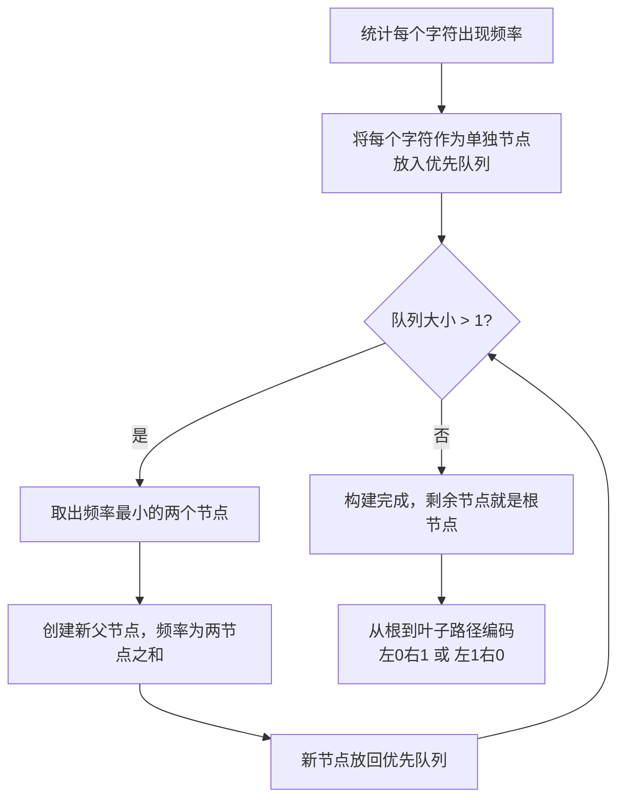
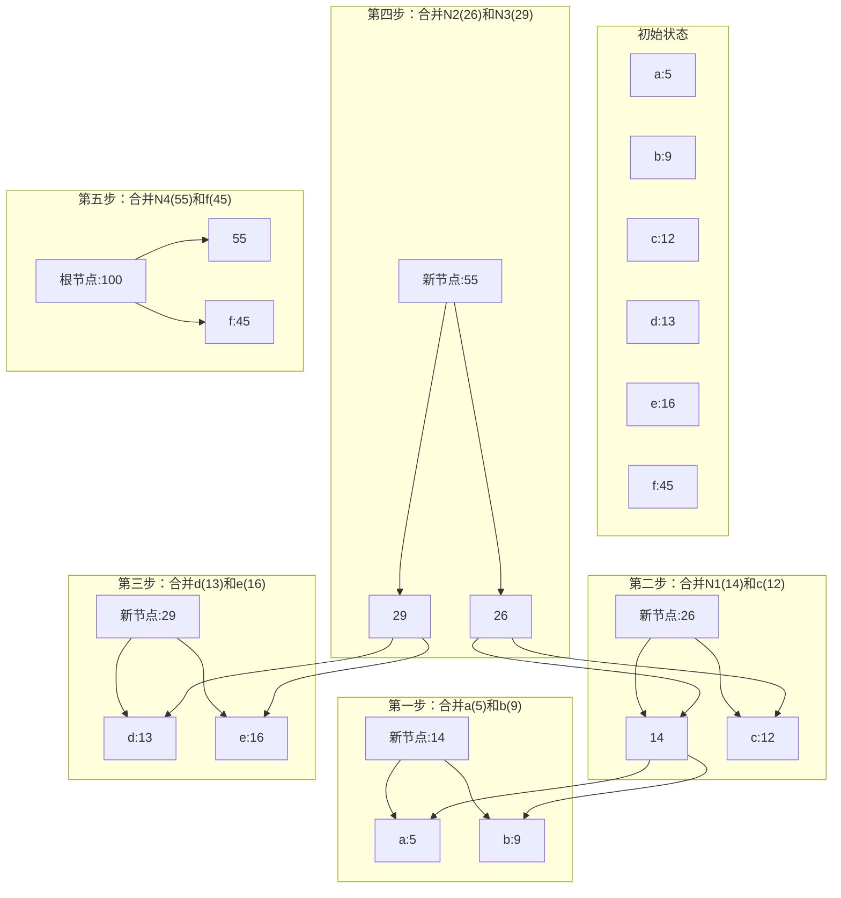

# Huffman哈夫曼编码
> 创建日期：2026-06-08
> 难度：⭐⭐
> 前置知识：贪心算法、二叉树
> 关联模块：数据压缩、熵编码

## ⭐ 面试重点速览
| 考察点 | 重要程度 | 考察频率 | 掌握目标 |
|--------|----------|----------|----------|
| 哈夫曼编码基本思想 | ⭐⭐⭐⭐⭐ | 高频 | 理解"频次高码长短"的核心思想 |
| 哈夫曼树构建过程 | ⭐⭐⭐⭐⭐ | 高频 | 掌握贪心算法构建最优前缀树 |
| 编码/解码过程 | ⭐⭐⭐⭐ | 中频 | 能手动模拟编码解码过程 |
| 最优前缀码性质 | ⭐⭐⭐ | 中频 | 理解为什么哈夫曼编码是最优的 |
| 哈夫曼编码与熵的关系 | ⭐⭐⭐ | 低频 | 了解编码长度与信息熵的关系 |

## 一、应用场景 🎯

哈夫曼编码是一种经典的熵编码算法，广泛应用于：

1. **ZIP/RAR压缩**：作为DEFLATE算法的一部分用于文件压缩
2. **JPEG图像压缩**：对DCT系数进行熵编码
3. **MP3/AAC音频压缩**：用于音频数据的压缩编码
4. **网络传输**：对频繁出现的字符用短码，减少传输数据量
5. **文本压缩**：英文、中文文本的无损压缩

**核心问题**：如何根据字符出现频率，给每个字符分配不同长度的二进制编码，使得总编码长度最短，同时无歧义解码？

## 二、核心原理 🔬

### 核心思想

- **频率越高，编码越短**：出现次数多的字符用短二进制编码，出现次数少的用长编码
- **前缀码性质**：任何一个字符的编码都不是另一个字符编码的前缀，保证解码时不会有歧义
- **贪心策略**：每次选择权重最小的两个节点合并，逐步构建出最优二叉树

### 哈夫曼树构建过程



### 构建过程示例（可视化）



### 编码生成规则

从根节点出发到叶子节点：
- 走左分支，编码加一个"0"
- 走右分支，编码加一个"1"
- 叶子节点对应的二进制串就是该字符的哈夫曼编码

由于所有字符都在叶子节点，所以不可能出现一个编码是另一个编码前缀的情况，天然满足前缀码性质，解码无歧义。

### 熵与编码长度

**信息熵**衡量了平均每个字符的最小期望编码长度：

H = -Σ p(x) log2 p(x)

哈夫曼编码的平均编码长度非常接近信息熵，因此是一种接近最优的前缀编码。

### 最优前缀码性质证明要点

1. 哈夫曼编码满足前缀码性质
2. 贪心选择性质：频率最低的两个字符一定在最深层，且是兄弟节点
3. 最优子结构：合并后的最优编码包含原问题的最优编码
4. 因此，贪心构建出来的就是最优前缀码

## 三、趣味解说 🎭

这就像摩斯密码发电报：

- 你每天发电报，"你好"、"谢谢"这些词天天说，那就给它们编个短点的摩斯码，发的时候快，省时间省电报纸
- "貔貅"、"貔貅"这种词一年用不了几次，那就编个长点的码也没关系，反正不常用
- 哈夫曼编码干的就是这件事：统计每个词出现多少次，出现多的用短码，出现少的用长码，总长度就最小了。

比如你发中文电报：
- "的"出现最多，那就给它编"0"，一个比特就搞定
- "啊"出现少点，编"10"，两个比特
- "帮"更少，编"110"，三个比特
- 这样拼起来，总的比特数肯定比每个字都用同样长度少很多。

就这么简单！是不是很像生活中的道理：常用的东西放口袋随手就能拿，不常用的东西放衣柜最里面，总的来说最省时间。

## 四、代码实现 💻

以下是Python实现的哈夫曼编码：

```python
import heapq
from collections import Counter

class HuffmanNode:
    """哈夫曼树节点"""
    def __init__(self, char=None, freq=0):
        self.char = char      # 叶子节点存储字符
        self.freq = freq      # 频率（权重）
        self.left = None      # 左子树
        self.right = None    # 右子树
    
    # 为了堆排序，定义比较运算符
    def __lt__(self, other):
        return self.freq < other.freq

def build_huffman_tree(text):
    """
    根据文本统计频率，构建哈夫曼树
    返回根节点
    """
    # 1. 统计每个字符出现频率
    frequency = Counter(text)
    
    # 2. 所有字符节点放入优先队列（最小堆）
    heap = []
    for char, freq in frequency.items():
        heapq.heappush(heap, HuffmanNode(char, freq))
    
    # 处理边界：如果只有一个字符
    if len(heap) == 1:
        root = HuffmanNode()
        root.left = heapq.heappop(heap)
        return root
    
    # 3. 贪心构建哈夫曼树
    while len(heap) > 1:
        # 取出频率最小的两个节点
        left = heapq.heappop(heap)
        right = heapq.heappop(heap)
        
        # 合并成新节点
        merged = HuffmanNode(freq=left.freq + right.freq)
        merged.left = left
        merged.right = right
        
        # 新节点放回堆
        heapq.heappush(heap, merged)
    
    # 最后剩下的节点就是根节点
    return heapq.heappop(heap)

def generate_huffman_codes(root):
    """
    根据哈夫曼树生成编码表
    返回字典：{字符: 二进制编码字符串}
    """
    codes = {}
    
    def traverse(node, current_code):
        if node is None:
            return
        
        # 叶子节点：保存编码
        if node.char is not None:
            codes[node.char] = current_code if current_code else "0"
            return
        
        # 左走加0，右走加1
        traverse(node.left, current_code + "0")
        traverse(node.right, current_code + "1")
    
    traverse(root, "")
    return codes

def huffman_encode(text):
    """
    哈夫曼编码压缩
    返回：(编码后的比特串, 哈夫曼树根节点)
    """
    if not text:
        return "", None
    
    # 1. 构建哈夫曼树
    root = build_huffman_tree(text)
    
    # 2. 生成编码表
    codes = generate_huffman_codes(root)
    
    # 3. 逐个字符编码
    encoded_bits = "".join([codes[char] for char in text])
    
    return encoded_bits, root

def huffman_decode(encoded_bits, root):
    """
    哈夫曼解码
    返回：解码后的原文
    """
    if not encoded_bits or root is None:
        return ""
    
    result = []
    current_node = root
    
    for bit in encoded_bits:
        # 按比特遍历，0走左，1走右
        if bit == "0":
            current_node = current_node.left
        else:
            current_node = current_node.right
        
        # 到达叶子节点，输出字符，回到根
        if current_node.char is not None:
            result.append(current_node.char)
            current_node = root
    
    return "".join(result)

def print_huffman_tree(node, prefix="", is_left=True):
    """打印哈夫曼树结构（调试用）"""
    if node is not None:
        print(f"{prefix}{'├─0─ ' if is_left else '└─1─ '}{node.freq if node.char is None else node.char}:{node.freq}")
        print_huffman_tree(node.left, prefix + ("│   " if is_left else "    "), True)
        print_huffman_tree(node.right, prefix + ("│   " if is_left else "    "), False)

# 测试示例
if __name__ == "__main__":
    # 测试文本
    text = "this is an example for huffman encoding"
    print(f"原始文本: {text}")
    print(f"原始长度: {len(text) * 8} bits (每个字符8位ASCII)\n")
    
    # 编码
    encoded_bits, root = huffman_encode(text)
    codes = generate_huffman_codes(root)
    
    print("生成的哈夫曼编码:")
    for char, code in sorted(codes.items(), key=lambda x: len(x[1])):
        print(f"  '{char}': {code} (长度: {len(code)})")
    print()
    
    print(f"压缩后长度: {len(encoded_bits)} bits")
    compression_ratio = (1 - len(encoded_bits) / (len(text) * 8)) * 100
    print(f"压缩率: {compression_ratio:.2f}%\n")
    
    # 解码
    decoded_text = huffman_decode(encoded_bits, root)
    print(f"解码后文本: {decoded_text}")
    print(f"解码是否正确: {decoded_text == text}\n")
    
    # 输出树结构
    print("哈夫曼树结构:")
    print_huffman_tree(root)
```

**代码说明**：
1. 使用`heapq`最小堆高效获取频率最小的两个节点
2. `HuffmanNode`表示树节点，叶子节点存储字符，内部节点只存储频率
3. 递归遍历生成每个字符的编码
4. 解码时从根出发按比特遍历，遇到叶子就输出并回到根
5. 处理了单字符边界情况

## 五、优缺点 ⚖️

### 优点

1. **最优前缀码**：对于给定的字符频率，哈夫曼编码能得到最短的平均编码长度，是最优的前缀编码
2. **压缩效率高**：平均编码长度非常接近信息熵，压缩效果好
3. **实现简单**：贪心算法思路清晰，代码容易实现
4. **无损压缩**：可以完整解压缩，无信息丢失
5. **自适应哈夫曼编码**：支持动态更新编码，适合流式数据压缩

### 缺点

1. **需要存储编码表**：压缩结果必须附带哈夫曼树结构，否则无法解码，小文件压缩可能反而变大
2. **不适应频率变化**：静态哈夫曼编码需要两次扫描（一次统计频率，一次编码），不适合实时流式数据
3. **对符号频率敏感**如果频率估计不准确，压缩效果会下降
4. **只能处理字节粒度**：不适合直接处理更高阶的上下文模型
5 **串行编码**：每个比特依赖前面的路径，硬件并行化困难

## 六、面试高频题 📝

### 1. 什么是哈夫曼编码？核心思想是什么？

**回答要点**：
- 哈夫曼编码是一种基于字符频率的可变长度熵编码算法
- 核心思想：频率高的字符用短编码，频率低的用长编码，使总平均编码长度最小
- 满足前缀码性质，保证解码无歧义

### 2. 简述哈夫曼树的构建过程。

**回答要点**：
1. 统计每个字符出现频率
2. 把每个字符作为单独节点，放入最小优先队列
3. 循环取出两个频率最小的节点，合并成新节点（频率为两者之和），新节点放回队列
4. 重复直到队列只剩一个节点，就是根节点
5. 遍历树生成编码，左0右1

### 3. 为什么哈夫曼编码是最优前缀码？证明思路是什么？

**回答要点**：
- 贪心选择性质：频率最低的两个字符一定深度最深，并且互为兄弟，可以证明存在这样的最优编码
- 最优子结构：把两个最低频节点合并后，新问题的最优解可以导出原问题的最优解
- 由数学归纳法，贪心构建得到的就是最优前缀码

### 4. 什么是前缀码？为什么哈夫曼编码一定满足前缀码性质？

**回答要点**：
- 前缀码：任何一个字符的编码都不是另一个字符编码的前缀
- 哈夫曼编码中所有字符都在叶子节点，从根到叶子才有完整编码，不可能出现一个编码是另一个的前缀
- 前缀码保证了解码时不会有歧义，可以唯一正确解码

### 5. 哈夫曼编码和信息熵的关系是什么？

**回答要点**：
- 信息熵是无损压缩的理论下限，表示平均每个符号最少需要多少比特
- 哈夫曼编码的平均编码长度非常接近信息熵，差距不超过1比特
- 当符号频率都是2的负整数次幂时，哈夫曼编码达到熵的最优值

### 6. 哈夫曼编码的时间复杂度是多少？

**回答要点**：
- 如果使用优先队列（最小堆），每次取出两个节点合并，总共n-1次合并，每次堆操作O(log n)
- 总的时间复杂度是O(n log n)，n是不同字符的个数

## 七、常见误区 ❌

### ❌ 误区一："哈夫曼编码是所有压缩算法中最优的"

**纠正**：哈夫曼编码只是最优前缀码，不是说它压缩率一定最高。基于上下文的算术编码压缩率通常比哈夫曼更高，更接近熵极限。哈夫曼按字符编码，算术编码可以按序列编码，能达到更好的压缩效果。

### ❌ 误区二："哈夫曼编码必须用优先队列实现"

**纠正**：不一定。如果频率已经排序，可以用两个队列实现O(n)时间复杂度的构建算法。优先队列只是最通用好写的实现方式。

### ❌ 误区三："哈夫曼编码压缩后一定比原来小"

**纠正**：不一定。哈夫曼树本身需要存储在压缩结果中，如果你压缩一个非常小的文件，哈夫曼树本身的开销可能比压缩节省的空间还大，结果反而变大。实际压缩算法（如DEFLATE）都会处理这个问题。

### ❌ 误区四："哈夫曼编码只能处理二进制，不能处理多叉树"

**纠正**：哈夫曼算法可以推广到任意k叉树，用于k进制编码。只是实际应用中二进制最常用。构建时如果节点数目不满足要求，需要补充一些零频率节点。

### ❌ 误区五："左0右1和左1右0会影响压缩效果"

**纠正**：不会，只是编码的01翻转一下，平均长度一样，不影响压缩率。只要编码表一致，解码都能正确得到原文。

### ❌ 误区六："哈夫曼编码只能用于文本压缩"

**纠正**：不对，哈夫曼编码可以用于任何可以统计频率的数据：图像、音频、视频都在用。JPEG中对DCT系数就用哈夫曼编码。
