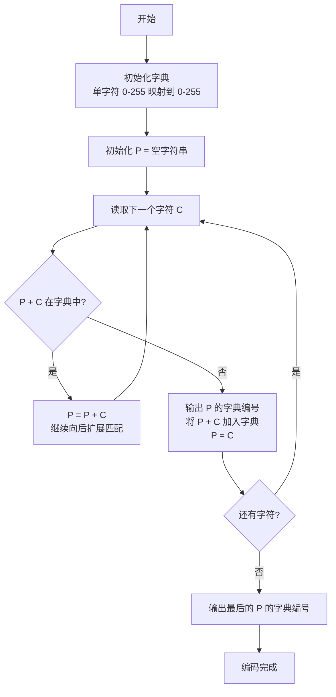
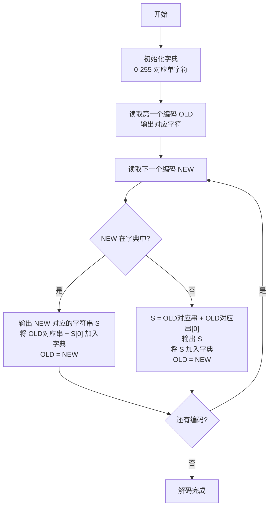

# LZW字典编码
> 创建日期：2026-06-08
> 难度：⭐⭐
> 前置知识：字典、哈希表
> 关联模块：数据压缩、无损压缩

## ⭐ 面试重点速览
| 考察点 | 重要程度 | 考察频率 | 掌握目标 |
|--------|----------|----------|----------|
| LZW编码基本思想 | ⭐⭐⭐⭐⭐ | 高频 | 理解字典压缩的核心思路 |
| 编码过程 | ⭐⭐⭐⭐⭐ | 高频 | 能手动模拟编码过程 |
| 解码过程 | ⭐⭐⭐⭐ | 中频 | 能手动模拟解码过程 |
| 与哈夫曼编码的区别 | ⭐⭐⭐⭐ | 中频 | 理解字典编码和熵编码的差异 |
| GIF/ZIP中的应用 | ⭐⭐⭐ | 中频 | 了解实际应用场景 |

## 一、应用场景 🎯

LZW（Lempel-Ziv-Welch）是一种经典的字典编码压缩算法，广泛应用于：

1. **GIF图像格式**：GIF格式使用LZW压缩图像数据，是其核心压缩算法
2. **TIFF图像格式**：TIFF格式支持LZW作为可选压缩方式
3. **ZIP压缩**：ZIP中的DEFLATE算法结合了LZ77和哈夫曼编码，LZW是LZ77的变种
4. **Unix compress命令**：早期Unix系统用的compress命令就是基于LZW
5. **调制解调器传输**：V.42bis协议中采用LZW压缩数据

**核心问题**：LZW不是像哈夫曼那样先统计频率再编码，而是边编码边构建字典，利用重复出现的字符串模式来压缩。它不需要预先知道数据分布，一次扫描即可完成压缩。

## 二、核心原理 🔬

### 核心思想

LZW属于**字典编码**（Dictionary Encoding）：
- 初始化一个字典，包含所有可能的单个字符（0-255）
- 在编码过程中，不断寻找当前字典中可匹配的最长字符串
- 每当发现一个新字符串（当前匹配串+下一个字符），就把它加入字典
- 输出的是字典中匹配串的索引，而不是原始字符串
- 解码端用同样的规则重建字典，无需额外传输字典

### 编码过程



### 编码过程示例

假设要编码字符串："ABABABA"

```
初始字典: A=0, B=1, C=2, ... (ASCII单字符)

步骤1: 读取 A, P="", C=A
       P+C = "A" 在字典中 → P="A"
       
步骤2: 读取 B, P="A", C=B
       P+C = "AB" 不在字典中 → 输出 A的编号(0), 添加"AB"=256, P="B"
       
步骤3: 读取 A, P="B", C=A
       P+C = "BA" 不在字典中 → 输出 B的编号(1), 添加"BA"=257, P="A"
       
步骤4: 读取 B, P="A", C=B
       P+C = "AB" 在字典中(256) → P="AB"
       
步骤5: 读取 A, P="AB", C=A
       P+C = "ABA" 不在字典中 → 输出"AB"的编号(256), 添加"ABA"=258, P="A"
       
步骤6: 读取 B, P="A", C=B
       P+C = "AB" 在字典中(256) → P="AB"
       
步骤7: 读取 A, P="AB", C=A
       P+C = "ABA" 在字典中(258) → P="ABA"
       
步骤8: 没有更多字符 → 输出"ABA"的编号(258)

编码输出: 0, 1, 256, 258
原字符串: "ABABABA" = 7个字符 × 8位 = 56位
压缩后: 4个编号 × 9位 = 36位
压缩率: 35.7%
```

### 解码过程



**解码的关键洞察**：解码端不需要从编码端接收字典，因为解码端按照完全相同的规则，和编码端同步构建字典。这是LZW最巧妙的地方。

### LZW vs 哈夫曼编码

| 对比维度 | LZW | 哈夫曼编码 |
|----------|-----|-----------|
| 编码类型 | 字典编码 | 熵编码 |
| 是否需要扫描两次 | 否（一次扫描即可） | 是（先统计频率，再编码） |
| 是否需要传输字典 | 否（解码端自建） | 是（需要传输哈夫曼树） |
| 压缩效率 | 对重复模式敏感 | 对频率分布敏感 |
| 适用场景 | 文本、图像（有重复模式） | 通用数据（统计频率分布） |

### GIF中的LZW

GIF格式使用LZW的变体：
- 字典初始大小根据颜色深度确定（通常是2^8=256）
- 编码索引位数从初始位数逐步增加（如从9位逐步增加到12位）
- 字典满时（4096个条目），不再添加新条目
- 有一个特殊的"清除码"（Clear Code），当字典满时发出，重置字典

## 三、趣味解说 🎭

LZW就像是**聪明的抄书匠**：

你需要抄一本有很多重复内容的书：
- 第一次遇到"社会主义"这个词，你抄下来，然后给它一个编号1
- 后面再遇到"社会主义"，你直接写编号1，而不是再抄一遍
- 第一次遇到"社会主义市场经济"，给它编号2
- 后面再遇到这个长短语，直接写2
- 这样，越抄到后面，能用的编号越多，抄得越来越快

解码的人拿到你的编号列表，也用同样的方法：
- 看到编号1，知道是"社会主义"，他也记下来：编号1="社会主义"
- 下次再看到编号1，不用你再解释，他直接翻译成"社会主义"
- 看到新编号2，他根据规则自己推导出2="社会主义市场经济"

最妙的是：编解码两端的字典是**同步自动构建**的，不需要额外通信！

## 四、代码实现 💻

以下是Python实现的LZW编码解码：

```python
def lzw_encode(data):
    """
    LZW编码
    输入：字符串
    输出：编码后的整数列表
    """
    if not data:
        return []
    
    # 1. 初始化字典：所有单字符映射到其ASCII值
    dict_size = 256
    dictionary = {chr(i): i for i in range(dict_size)}
    
    result = []
    p = ""  # 当前已匹配的最长前缀
    
    # 2. 遍历每个字符
    for c in data:
        pc = p + c  # 尝试扩展匹配
        
        # 如果 P+C 在字典中，延长匹配
        if pc in dictionary:
            p = pc
        else:
            # 输出 P 的编码
            result.append(dictionary[p])
            # 将 P+C 加入字典
            dictionary[pc] = dict_size
            dict_size += 1
            # 重置 P 为当前字符
            p = c
    
    # 3. 输出最后一个匹配串
    if p:
        result.append(dictionary[p])
    
    return result


def lzw_decode(encoded):
    """
    LZW解码
    输入：编码后的整数列表
    输出：解码后的字符串
    """
    if not encoded:
        return ""
    
    # 1. 初始化字典：0-255 对应单字符
    dict_size = 256
    dictionary = {i: chr(i) for i in range(dict_size)}
    
    # 2. 处理第一个编码
    old = encoded[0]
    result = [dictionary[old]]
    s = ""  # 当前输出的字符串
    
    # 3. 逐个处理后续编码
    for code in encoded[1:]:
        if code in dictionary:
            # 编码在字典中：直接获取字符串
            s = dictionary[code]
        else:
            # 编码不在字典中：特殊处理
            # 这种情况发生在编码刚加入字典就立即被使用
            # 此时 s = old字符串 + old字符串的第一个字符
            s = dictionary[old] + dictionary[old][0]
        
        result.append(s)
        
        # 关键：将 (old字符串 + s的第一个字符) 加入字典
        # 这就是解码端同步构建字典的规则
        dictionary[dict_size] = dictionary[old] + s[0]
        dict_size += 1
        
        old = code
    
    return "".join(result)


# 测试示例
if __name__ == "__main__":
    # 测试字符串
    test_strings = [
        "ABABABA",
        "TOBEORNOTTOBEORTOBEORNOT",
        "the quick brown fox jumps over the lazy dog the quick brown fox",
        "AAAAAAAAAAAAA",
    ]
    
    for text in test_strings:
        print("=" * 60)
        print(f"原始文本: {text}")
        original_bits = len(text) * 8
        
        # 编码
        encoded = lzw_encode(text)
        print(f"编码输出: {encoded}")
        
        # 解码
        decoded = lzw_decode(encoded)
        print(f"解码结果: {decoded}")
        print(f"是否正确: {decoded == text}")
        
        # 压缩率统计
        # 计算需要的比特数：编码的最大值决定了每个编码需要的位数
        if encoded:
            max_code = max(encoded)
            bits_per_code = max(9, max_code.bit_length())  # 至少9位（因为从256开始）
            compressed_bits = len(encoded) * bits_per_code
            compression_ratio = (1 - compressed_bits / original_bits) * 100
            print(f"原始比特数: {original_bits}")
            print(f"压缩后比特数: {compressed_bits} (每个编码{bits_per_code}位)")
            print(f"压缩率: {compression_ratio:.2f}%")
        print()
```

**代码说明**：
1. 编码时字典从256个单字符开始，新字符串从256开始编号
2. 编码过程不断尝试延长匹配，直到无法匹配时输出当前匹配的编码并加入新串到字典
3. 解码时按相同规则同步构建字典，最巧妙的是处理"编码不在字典中"的特殊情况
4. 处理了空字符串边界情况

## 五、优缺点 ⚖️

### 优点

1. **不需要预扫描**：编码只需一次扫描，适合流式数据压缩
2. **不需要传输字典**：解码端与编码端同步构建字典，节省带宽
3. **对重复模式高效**：文本、图像等有大量重复模式的数据压缩效果好
4. **实现简单**：算法逻辑清晰，代码量少
5. **自适应**：字典根据输入数据动态构建，自动适应数据特征

### 缺点

1. **字典大小有限**：实际应用中字典需要设置上限，满后需要重置（如GIF的Clear Code机制）
2. **压缩率不如混合算法**：纯LZW压缩率不如LZ77+哈夫曼的混合方案（如DEFLATE）
3. **对随机数据无效**：如果数据没有重复模式，LZW几乎不压缩甚至会膨胀
4. **专利问题**：历史上LZW曾被Unisys申请专利，导致GIF格式一度面临专利纠纷
5. **编码速度受限**：字典查找需要哈希表操作，编码速度不如某些LZ77变种

## 六、面试高频题 📝

### 1. 什么是LZW编码？核心思想是什么？

**回答要点**：
- LZW是字典编码压缩算法，由Lempel-Ziv-Welch提出
- 核心思想：边编码边构建字典，将重复出现的字符串映射为字典编号
- 不需要预先统计频率，也不需要传输字典
- 解码端按相同规则同步构建字典

### 2. 简述LZW的编码过程。

**回答要点**：
1. 初始化字典，包含所有单个字符（0-255）
2. 维护当前匹配前缀P，每次读取一个字符C
3. 如果P+C在字典中，P = P+C，继续扩展
4. 如果P+C不在字典中，输出P的编码，将P+C加入字典，P = C
5. 重复直到所有字符处理完毕

### 3. LZW解码端如何重建字典，而不需要编码端传输？

**回答要点**：
- 解码端用与编码端完全相同的规则构建字典
- 关键：每读取一个编码，解码端就把"上一个解码字符串 + 当前解码字符串的第一个字符"加入字典
- 特殊处理：如果编码不在字典中（刚加入就使用），则字符串为"上一个解码字符串 + 上一个解码字符串的第一个字符"
- 解码端拿到的第一个编码一定在初始字典中，之后就能逐步构建

### 4. LZW和哈夫曼编码有什么区别？

**回答要点**：
- LZW是字典编码（利用重复模式），哈夫曼是熵编码（利用频率分布）
- LZW只需一次扫描，哈夫曼需要两次（先统计频率）
- LZW不需要传输字典，哈夫曼需要传输哈夫曼树
- LZW适合有重复模式的数据，哈夫曼适合频率分布不均的数据
- 实际压缩算法常将两者结合使用（如DEFLATE = LZ77 + 哈夫曼）

### 5. GIF格式中LZW是怎么用的？

**回答要点**：
- GIF使用LZW变体压缩图像数据
- 初始字典大小根据颜色深度（2到256色）
- 编码位数从初始位数+1开始，逐步增加（如9位→10位→11位→12位）
- 编码位数达到12位后不再增加
- 设置Clear Code和End of Information Code两个特殊码
- 字典满时发出Clear Code重置字典

### 6. 为什么LZW解码时可能出现编码不在字典中的情况？

**回答要点**：
- 这种情况发生在编码端刚加入字典的字符串，紧接着就被使用了
- 例如编码"ABABABA"时，编码端刚加入"AB"到字典(256)，接下来就遇到了"AB"并输出256
- 解码端收到256时，确实还没在字典中加入这个条目
- 处理：此时字符串 = 上一个解码字符串 + 它的第一个字符

## 七、常见误区 ❌

### ❌ 误区一："LZW是哈夫曼编码的改进版"

**纠正**：两者是完全不同的编码思路。LZW属于字典编码（基于字符串重复），哈夫曼属于熵编码（基于频率统计）。它们不是前后改进关系，而是可以互补使用。DEFLATE（ZIP的核心）就是LZ77（字典编码）和哈夫曼（熵编码）的组合。

### ❌ 误区二："LZW压缩后一定比原数据小"

**纠正**：对于随机数据或没有重复模式的数据，LZW不仅不会压缩，反而会膨胀。因为每个编码可能比原始字节还大，加上字典一直在增长，编码位数也在增加。实际应用需要设置字典上限和Reset机制。

### ❌ 误区三："LZW编码需要把字典一起传输"

**纠正**：这是LZW最巧妙的地方——字典不需要传输。解码端通过完全相同的规则，从编码序列中同步重建字典。这是LZW区别于其他字典编码的关键特性。

### ❌ 误区四："LZW只适用于文本压缩"

**纠正**：LZW适用于任何有重复模式的数据。GIF格式用它压缩图像，效果很好，因为图像中经常有重复的颜色序列。TIFF格式也支持LZW压缩。

### ❌ 误区五："LZW的字典可以无限增长"

**纠正**：实际应用必须给字典设置上限。GIF中字典上限是4096（12位编码），达到上限后不再添加新条目，或者发出Clear Code重置字典。无限增长会导致编码位数越来越大，反而降低压缩效率。

### ❌ 误区六："LZW编码时，匹配串越长越好"

**纠正**：不一定。虽然匹配越长一次压缩越多，但太长会导致字典增长过快，字典满后必须重置，长期来看不一定最优。工程上需要在匹配长度和字典管理之间权衡。