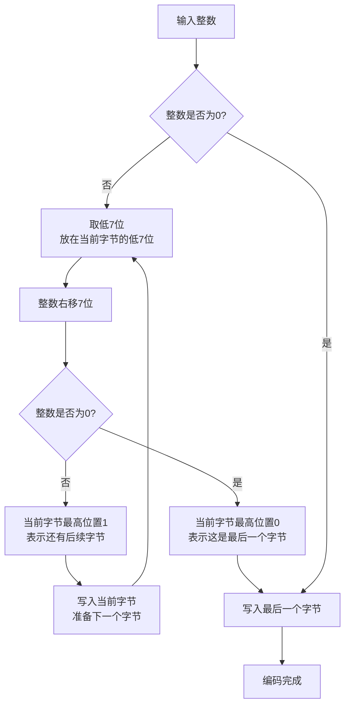
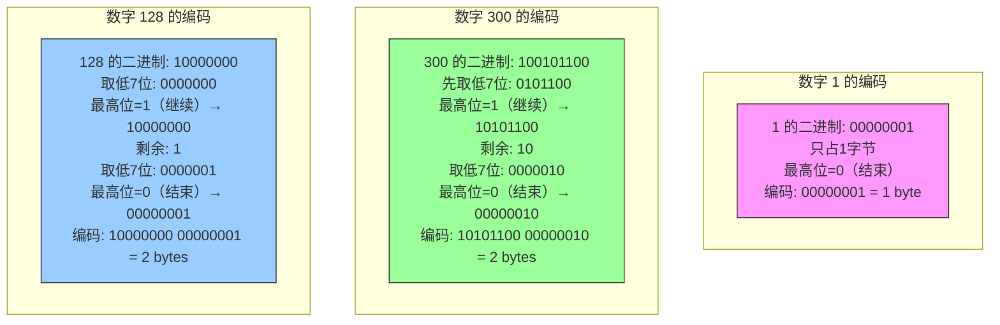
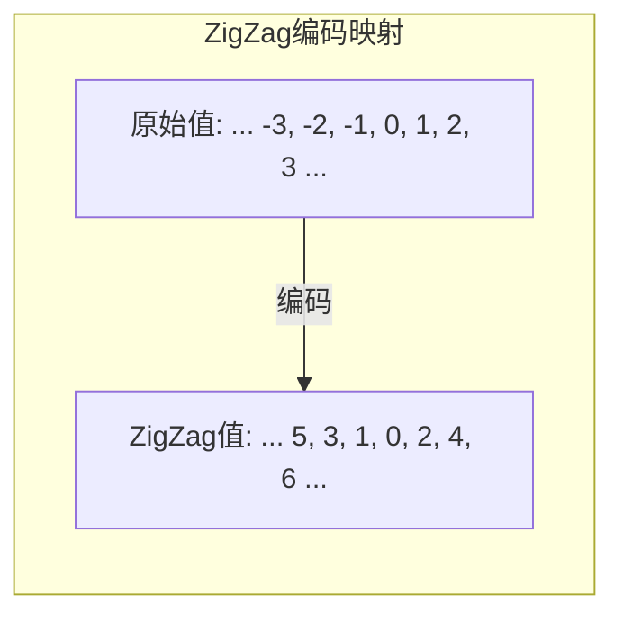

# Varint变长编码
> 创建日期：2026-06-08
> 难度：⭐⭐
> 前置知识：二进制、位运算
> 关联模块：序列化框架、网络传输协议

## ⭐ 面试重点速览
| 考察点 | 重要程度 | 考察频率 | 掌握目标 |
|--------|----------|----------|----------|
| Varint编码原理 | ⭐⭐⭐⭐⭐ | 高频 | 理解"高位置1表示继续"的编码方式 |
| ZigZag编码 | ⭐⭐⭐⭐ | 中频 | 理解ZigZag处理负数的机制 |
| Protocol Buffers底层 | ⭐⭐⭐⭐ | 中频 | 了解Protobuf的Varint使用方式 |
| 与传统定长整数的对比 | ⭐⭐⭐ | 中频 | 掌握Varint的适用场景和优势 |

## 一、应用场景 🎯

Varint（Variable-length Integer，变长整数编码）是一种用小空间存储小整数的编码方式，广泛应用于：

1. **Protocol Buffers（Protobuf）**：Google的序列化框架，底层使用Varint编码整数，极大地减少了传输数据量
2. **gRPC通信**：基于Protobuf的RPC框架，继承了Varint编码
3. **LevelDB/RocksDB**：LSM-Tree存储引擎中，使用Varint编码存储长度和偏移量
4. **SQLite**：数据库引擎内部使用Varint编码存储变长整数
5. **Apache Avro**：大数据序列化框架也采用Varint编码
6. **WebSocket协议**：使用Varint编码帧长度

**核心问题**：在序列化场景中，很多整数（如消息长度、字段编号、时间戳差值）通常很小，如果用固定的4字节或8字节存储，大量高位都是0，浪费空间。Varint的思想是：小整数用少字节，大整数用多字节，节省空间。

## 二、核心原理 🔬

### 基本编码规则

Varint编码的核心规则非常简单：

- 每个字节的最高位（MSB，Most Significant Bit）作为**继续位（Continuation Bit）**
- 如果最高位为1，表示后面还有字节
- 如果最高位为0，表示这是最后一个字节
- 剩余7位存储实际数据（低位在前，小端序）



### 编码示例



### 解码过程

解码是编码的逆过程：

```
result = 0
shift = 0
while True:
    读取下一个字节 byte
    取低7位 data = byte & 0x7F
    拼接到结果: result = result | (data << shift)
    shift += 7
    如果最高位为0，即 (byte & 0x80) == 0:
        结束
```

### 字节范围说明

| 整数范围 | Varint字节数 | 定长int32字节数 | 节省 |
|----------|-------------|----------------|------|
| 0 ~ 127 | 1字节 | 4字节 | 75% |
| 128 ~ 16383 | 2字节 | 4字节 | 50% |
| 16384 ~ 2097151 | 3字节 | 4字节 | 25% |
| 2097152 ~ 268435455 | 4字节 | 4字节 | 0% |
| 268435456 ~ 最大 | 5字节 | 4字节 | -25% |

可以看到，对于小整数效果显著，但大整数反而会多占1字节。

### ZigZag编码：处理负数

标准Varint不能直接处理负数。因为负数在计算机中用补码表示，-1是0xFFFFFFFF，用Varint需要5个字节。ZigZag编码解决了这个问题：



**ZigZag公式**：
- 对于sint32：`(n << 1) ^ (n >> 31)`
- 对于sint64：`(n << 1) ^ (n >> 63)`

**原理**：将正负交替映射到正整数的自然序列上：
- 0 → 0
- -1 → 1
- 1 → 2
- -2 → 3
- 2 → 4
- ...

这样负数就变成了小正数，再用Varint编码就省空间了。

### Protocol Buffers中的使用

Protocol Buffers是Varint的经典应用场景：

1. **字段编号和类型**（Field Tag）：每个字段的Tag = (field_number << 3) | wire_type，用Varint编码
2. **变长整数字段**：int32/int64/int64/uint32/uint64都使用Varint
3. **sint32/sint64**：有符号整数，先ZigZag再Varint
4. **消息长度前缀**：Length-delimited类型字段的长度用Varint编码

**Protobuf消息格式示例**：

```
[TAG(Varint)] [VALUE(Varint)]
```

例如 field_number=1, wire_type=0（Varint），值为150：
- TAG = (1 << 3) | 0 = 8 = 0x08
- 编码为：08 96 01（TAG占1字节，值150占2字节）

## 三、趣味解说 🎭

Varint就像是**压缩行李箱**：

- 你去旅行，如果只带一双袜子，就带一个小箱子，拎着轻便
- 如果你要搬家，带很多很多东西，那就拖一个大箱子
- 但不管带多少东西，箱子不会比衣柜还大，就刚好装下

同样，Varint：
- 数字1很小，用1个字节的小箱子装
- 数字300大一点，用2个字节的中箱子装
- 数字100000超大，用3个字节的大箱子装
- 不会再无脑用4个字节的衣柜装所有东西

ZigZag就像是**压缩负数**：负数本来是个"负"的行李箱，不方便直接装。ZigZag把它翻折一下，变成正数，就可以用Varint这个压缩行李箱装了。像把-1折成1，-2折成3，-3折成5，这样绝对值小的负数也能享受Varint的压缩福利。

## 四、代码实现 💻

以下是Python实现的Varint和ZigZag编码：

```python
def encode_varint(value):
    """
    Varint编码：将整数编码为变长字节序列
    返回值：字节列表
    """
    if value < 0:
        raise ValueError("Varint only supports unsigned integers. "
                         "Use ZigZag encoding for signed integers.")
    
    result = []
    
    while value > 0x7F:  # 大于127，需要多字节
        # 取低7位，最高位置1（表示还有后续字节）
        result.append((value & 0x7F) | 0x80)
        value >>= 7  # 右移7位
    
    # 最后一个字节，最高位为0
    result.append(value & 0x7F)
    
    return bytes(result)


def decode_varint(data):
    """
    Varint解码：将变长字节序列解码为整数
    返回：(解码后的整数, 消耗的字节数)
    """
    result = 0
    shift = 0
    
    for i, byte in enumerate(data):
        # 取低7位，拼接到结果
        result |= (byte & 0x7F) << shift
        shift += 7
        
        # 最高位为0，表示结束
        if (byte & 0x80) == 0:
            return result, i + 1
    
    # 如果循环结束还没返回，说明数据不完整
    raise ValueError("Truncated varint data")


def encode_varint_hex(value):
    """Varint编码并用十六进制展示"""
    encoded = encode_varint(value)
    hex_str = " ".join(f"{b:02X}" for b in encoded)
    return hex_str, len(encoded)


# ========== ZigZag 编码（处理有符号整数）==========

def zigzag_encode_32(n):
    """
    ZigZag编码（32位）：将有符号整数映射为无符号整数
    公式：n << 1 ^ n >> 31
    """
    # Python整数没有固定位宽，需要手动截断到32位
    n = n & 0xFFFFFFFF  # 转为32位无符号
    # 对于负数，n >> 31 会得到0xFFFFFFFF（Python中）
    # 注意：Python右移是算术右移
    return (n << 1) ^ (n >> 31)


def zigzag_decode_32(n):
    """
    ZigZag解码（32位）：将无符号整数还原为有符号整数
    公式：n >> 1 ^ -(n & 1)
    """
    return (n >> 1) ^ (-(n & 1))


def zigzag_encode_64(n):
    """ZigZag编码（64位）"""
    n = n & 0xFFFFFFFFFFFFFFFF
    return (n << 1) ^ (n >> 63)


def zigzag_decode_64(n):
    """ZigZag解码（64位）"""
    return (n >> 1) ^ (-(n & 1))


def encode_signed_varint(value):
    """
    编码有符号整数（先ZigZag，再Varint）
    返回值：字节序列
    """
    # 先ZigZag编码，将负数映射为正数
    zigzag_value = zigzag_encode_32(value)
    # 再Varint编码
    return encode_varint(zigzag_value)


def decode_signed_varint(data):
    """
    解码有符号整数（先Varint解码，再ZigZag解码）
    返回：(解码后的有符号整数, 消耗的字节数)
    """
    # 先Varint解码
    zigzag_value, consumed = decode_varint(data)
    # 再ZigZag解码
    return zigzag_decode_32(zigzag_value), consumed


# 测试示例
if __name__ == "__main__":
    print("=" * 60)
    print("Varint 编码示例")
    print("=" * 60)
    
    test_values = [0, 1, 127, 128, 300, 16384, 1000000]
    
    print(f"{'原始值':>10} | {'Varint编码':>20} | {'字节数':>6} | {'定长4字节':>10} | {'节省':>6}")
    print("-" * 70)
    for val in test_values:
        hex_str, byte_count = encode_varint_hex(val)
        saving = (1 - byte_count / 4) * 100
        print(f"{val:>10} | {hex_str:>20} | {byte_count:>6} | {'4 bytes':>10} | {saving:>5.0f}%")
    
    print()
    print("=" * 60)
    print("ZigZag + Varint 编码示例（带符号整数）")
    print("=" * 60)
    
    signed_values = [0, -1, 1, -2, 2, -64, 64, -8192, 8192]
    
    print(f"{'原始值':>10} | {'ZigZag值':>10} | {'Varint编码':>20} | {'字节数':>6}")
    print("-" * 70)
    for val in signed_values:
        zigzag = zigzag_encode_32(val)
        hex_str, byte_count = encode_varint_hex(zigzag)
        print(f"{val:>10} | {zigzag:>10} | {hex_str:>20} | {byte_count:>6}")
    
    print()
    print("=" * 60)
    print("Varint 解码验证")
    print("=" * 60)
    
    for val in test_values:
        encoded = encode_varint(val)
        decoded, consumed = decode_varint(encoded)
        print(f"编码 {val} -> {encoded.hex(' ')} -> 解码 {decoded} -> {'正确' if val == decoded else '错误'}")
    
    print()
    print("=" * 60)
    print("ZigZag + Varint 解码验证")
    print("=" * 60)
    
    for val in signed_values:
        encoded = encode_signed_varint(val)
        decoded, consumed = decode_signed_varint(encoded)
        print(f"编码 {val:>4} -> {encoded.hex(' '):>8} -> 解码 {decoded:>4} -> {'正确' if val == decoded else '错误'}")
```

**代码说明**：
1. `encode_varint`：核心编码函数，循环取低7位并设置继续位，直到值小于128
2. `decode_varint`：解码时逐字节拼接，判断最高位是否为0来决定是否结束
3. `zigzag_encode_32`：将负数映射为正数，公式为 `(n << 1) ^ (n >> 31)`
4. `encode_signed_varint`：先ZigZag再Varint，完整处理有符号整数
5. 返回消耗的字节数，方便流式解析

## 五、优缺点 ⚖️

### 优点

1. **空间高效**：小整数（<128）只用1字节，比定长4字节节省75%空间
2. **编码简单**：算法逻辑清晰，位运算实现，编码解码速度快
3. **自限定**：每个字节的MSB表示是否结束，不需要额外存储长度信息
4. **流式解析**：可以逐字节解析，不需要预知数据长度，适合网络传输
5. **兼容性好**：与架构无关，大端/小端系统都能正确处理

### 缺点

1. **大整数膨胀**：大于2^28的数需要5字节，比定长4字节多1字节，反而更差
2. **不能直接处理负数**：需要配合ZigZag编码，增加了一步转换
3. **随机访问困难**：因为每个数长度不定，不能直接跳到第N个数，必须从头解析
4. **解码开销**：每次解码需要循环判断MSB，比读定长整数多几次位运算
5. **不适合大范围均匀分布的整数**：如果数据集中整数都很均匀大，Varint就没有优势了

## 六、面试高频题 📝

### 1. 什么是Varint编码？为什么需要它？

**回答要点**：
- Varint是变长整数编码，每个字节的最高位作为继续位，低7位存储数据
- 需要它是因为序列化场景中很多整数很小（字段编号、长度等），定长存储浪费空间
- 小整数用少字节，大整数用多字节，平均空间占用更小

### 2. Varint的编码规则是什么？举例说明。

**回答要点**：
- 每个字节最高位（MSB）为1表示后面还有字节，为0表示结束
- 低7位存储实际数据，小端序（低位在前）
- 例：数字1编码为 00000001（1字节）
- 例：数字300的二进制为 100101100，编码为 10101100 00000010（2字节）
- 例：数字128编码为 10000000 00000001（2字节）

### 3. 什么是ZigZag编码？为什么需要它？

**回答要点**：
- ZigZag是将有符号整数映射为无符号整数的编码方式
- 公式：sint32的ZigZag = (n << 1) ^ (n >> 31)
- 映射关系：0→0, -1→1, 1→2, -2→3, 2→4, ...
- 需要它是因为负数在计算机中用补码表示，-1是0xFFFFFFFF，直接Varint需要5字节
- ZigZag把绝对值小的负数也映射为小正数，使Varint对小负数也能高效压缩

### 4. Protocol Buffers中如何使用Varint？

**回答要点**：
- Protobuf中每个字段的Tag（字段编号+类型）用Varint编码
- int32/int64/uint32/uint64/boolean等都用Varint
- 有符号整数推荐用sint32/sint64，底层先ZigZag再Varint
- Length-delimited类型（string/bytes/嵌套消息）的长度也用Varint编码
- 消息格式：TAG(Varint) + VALUE

### 5. Varint的理论最大长度是多少？

**回答要点**：
- 32位整数：最多5字节（因为5×7=35>32）
- 64位整数：最多10字节（因为10×7=70>64）
- 实际中32位整数超过4字节需要5字节，比定长还多，但这种情况很少

### 6. Varint和UTF-8编码有什么相似之处？

**回答要点**：
- 两者都用字节的最高位作为"继续"标志
- Varint：最高位为1表示继续，为0表示结束
- UTF-8：首字节的高位1的个数表示总共几个字节，后续字节以10开头
- 都是变长编码思想的经典应用
- 区别：Varint编码整数，UTF-8编码Unicode字符

## 七、常见误区 ❌

### ❌ 误区一："Varint用的就是大端序"

**纠正**：Varint用的是**小端序**（低位在前，Least Significant Byte first）。即先出来的字节是整数的最低7位，后出来的字节是高位。解码时低位先到，逐步左移拼接。这是为了让解码器可以边读边拼。

### ❌ 误区二："Varint压缩后一定比定长4字节小"

**纠正**：只有数值小于2^28（约2.68亿）时才比4字节小。如果数值很大（如文件偏移量、时间戳等），Varint可能反而需要5字节，比定长4字节还大。需要根据实际数据分布来选择。

### ❌ 误区三："有符号整数直接用Varint就行"

**纠正**：不行。负数（如-1）在计算机中补码表示为0xFFFFFFFF，用Varint需要5字节。应该用ZigZag先把负数映射成正数，然后再Varint。Protobuf中sint32/sint64类型就是先ZigZag再Varint的。

### ❌ 误区四："Varint编码后可以随机访问"

**纠正**：不能。因为每个Varint编码的长度不固定，你不知道第N个整数从哪开始。必须从头顺序解析。如果需要随机访问，应该使用定长编码或者额外的索引结构。

### ❌ 误区五："Protobuf只用Varint编码"

**纠正**：Protobuf除了Varint，还有多种Wire Type编码方式：Varint（0）、64-bit（1）、Length-delimited（2）、Start group（3，已废弃）、End group（4，已废弃）、32-bit（5）。string、bytes、嵌套消息用的是Length-delimited类型。

### ❌ 误区六："ZigZag编码可以处理所有负数"

**纠正**：ZigZag可以将任何有符号整数映射为正数，但注意：ZigZag本质上是把符号位翻到最低位。对于32位整数，ZigZag后的最大值是2^32-2（约42亿），Varint需要5字节。所以非常小的负数（如-1）压缩效果很好，但绝对值极大的负数和大正数一样，也需要5字节。