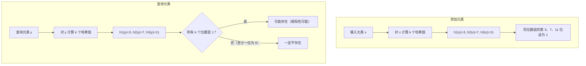

# 布隆过滤器（Bloom Filter）
> 创建日期：2026-06-08
> 难度：⭐
> 前置知识：哈希函数、位运算、概率论基础
> 关联模块：Redis 缓存穿透防护、LSM-Tree 读加速、垃圾邮件过滤、爬虫 URL 去重

## ⭐ 面试重点速览

| 考察点 | 重要程度 | 考察频率 | 掌握目标 |
|--------|----------|----------|----------|
| 布隆过滤器的核心原理 | ★★★★★ | 极高 | 能画出位数组 + 多哈希函数的结构图 |
| 假阳性率公式推导 | ★★★★☆ | 高 | 理解 p = (1 - e^(-kn/m))^k 的含义 |
| 最优哈希函数个数 k = m/n * ln2 | ★★★★☆ | 高 | 能推导并记住结论 |
| 缓存穿透解决方案 | ★★★★★ | 极高 | 能完整描述布隆过滤器在缓存穿透中的作用 |
| 为什么不能删除元素 | ★★★★☆ | 高 | 能解释位冲突导致删除不安全的原理 |
| Guava BloomFilter 使用 | ★★★☆☆ | 中 | 了解 API 和参数配置 |

---

## 一、应用场景 🎯

布隆过滤器是一种空间效率极高的概率型数据结构，用于判断"一定不存在"或"可能存在"：

| 场景 | 具体案例 | 说明 |
|------|----------|------|
| 缓存穿透防护 | Redis 缓存穿透解决方案 | 过滤不存在的 key，避免无效请求打到数据库 |
| 数据库查询优化 | LSM-Tree（LevelDB/RocksDB） | 查询 SSTable 前先用 Bloom Filter 判断 key 是否存在 |
| 垃圾邮件过滤 | Gmail 邮件过滤 | 快速判断发件人是否在黑名单中 |
| URL 去重 | 网络爬虫（Google Crawler） | 判断 URL 是否已被爬取过 |
| 恶意网址检测 | Chrome 安全浏览 | 快速判断 URL 是否为恶意网站 |
| 用户名检测 | 注册系统 | 快速判断用户名是否已被占用 |
| 大数据去重 | HBase、Cassandra | 减少不必要的磁盘查找 |

**核心价值**：在允许少量误判（假阳性）的前提下，用极小的内存空间（通常不到哈希表的 1/10）实现接近 O(1) 的查找性能。

---

## 二、核心原理 🔬

### 2.1 数据结构

布隆过滤器由两个核心组件构成：
- **位数组**：长度为 m 的比特数组，初始全为 0
- **k 个哈希函数**：每个函数将输入映射到 [0, m-1] 范围内的一个位置

### 2.2 Mermaid 流程图：添加与查询过程



### 2.3 假阳性率推导

假设位数组长度为 m，插入 n 个元素，使用 k 个哈希函数。

**步骤 1**：插入一个元素后，某一位仍为 0 的概率：
```
某一位在一次哈希中被设为 1 的概率 = 1/m
某一位在一次哈希中未被设为 1 的概率 = 1 - 1/m
插入一个元素（k 次哈希）后，某一位仍为 0 的概率 = (1 - 1/m)^k
```

**步骤 2**：插入 n 个元素后，某一位仍为 0 的概率：
```
P(某位为 0) = (1 - 1/m)^(kn) ≈ e^(-kn/m)
```

**步骤 3**：某一位为 1 的概率：
```
P(某位为 1) = 1 - e^(-kn/m)
```

**步骤 4**：查询一个不存在的元素，k 个位置都为 1（假阳性）的概率：
```
p = (1 - e^(-kn/m))^k
```

### 2.4 最优哈希函数个数

对假阳性率公式求导，令导数为 0，得到最优 k：

```
k = (m/n) * ln(2) ≈ 0.693 * (m/n)
```

此时假阳性率最小值为：

```
p_min = (1/2)^k ≈ 0.6185^(m/n)
```

**实际应用中的参数选择**：
- 若期望假阳性率为 1%，则 m/n 约需 9.6 位（约 1.2 字节/元素）
- 若期望假阳性率为 0.1%，则 m/n 约需 14.4 位（约 1.8 字节/元素）
- 对比：哈希表通常需要 32+ 字节/元素

### 2.5 为什么不能删除元素？

假设元素 A 和 B 都映射到了位数组的第 5 位，将其设为 1。如果删除 A 时将第 5 位清零，那么查询 B 时会误判为"不存在"。

**解决方案**：Counting Bloom Filter（计数布隆过滤器），将每个位扩展为一个计数器，插入时 +1，删除时 -1。代价是内存开销变为原来的 4~8 倍。

---

## 三、趣味解说 🎭

想象你是一家大型夜总会的门卫，有一个"黑名单"本子，记录了所有被拉黑的客人。

**传统方法（哈希表）**：
每个客人进门时，你翻本子看有没有他的名字。本子很厚（100 万个名字），但翻起来很慢。你决定把本子数字化——但 100 万个名字存在内存里要好几 MB。

**布隆过滤器（快速筛查法）**：
你不再记录完整名字，而是准备一张巨大的方格纸（位数组）和 3 支不同颜色的荧光笔（3 个哈希函数）。

**添加黑名单客人"张三"**：
1. 对"张三"这个名字用红笔算出一个数字：35
2. 用蓝笔算出一个数字：72
3. 用绿笔算出一个数字：108
4. 把方格纸的第 35、72、108 格涂黑

**检查客人"李四"是否在黑名单**：
1. 同样算出 3 个数字：35、72、108
2. 检查这 3 格——全是黑的！说明"李四很可能在黑名单中"
3. 但因为方格纸的格子是共享的，可能"张三"和"王五"恰好把这几格涂黑了
4. 所以只能说"很可能"，不能说"一定"——这就是假阳性

**但如果是"赵六"，算出 35、72、200**：
1. 第 200 格是白的——"赵六绝对不在黑名单中"
2. 因为只要有一格是白的，就说明这个名字从未被加入过

**核心智慧**：
- 布隆过滤器从不说"一定在"，但一定说"不在"（零假阴性）
- 用极小的空间（一张方格纸）代替巨大的本子
- 关键在于接受少量误判，换取极大的空间和时间节省

---

## 四、代码实现 💻

```java
import java.util.BitSet;
import java.util.Objects;

/**
 * 布隆过滤器实现 —— 基于位数组 + 多哈希函数
 * 空间效率极高，但存在假阳性（False Positive），不存在假阴性（False Negative）
 *
 * 典型参数配置：
 *   假阳性率 1%  → 位数组约 10n 位，哈希函数约 7 个
 *   假阳性率 0.1% → 位数组约 15n 位，哈希函数约 10 个
 */
public class BloomFilter<T> {

    /** 位数组 */
    private final BitSet bits;

    /** 位数组长度 */
    private final int bitSize;

    /** 哈希函数个数 */
    private final int numHashFunctions;

    /** 已插入元素数量 */
    private int count;

    /**
     * 构造布隆过滤器
     * 
     * @param expectedInsertions 预期插入元素数量
     * @param falsePositiveRate  期望假阳性率（如 0.01 表示 1%）
     */
    public BloomFilter(int expectedInsertions, double falsePositiveRate) {
        if (expectedInsertions <= 0) {
            throw new IllegalArgumentException("expectedInsertions 必须大于 0");
        }
        if (falsePositiveRate <= 0 || falsePositiveRate >= 1) {
            throw new IllegalArgumentException("falsePositiveRate 必须在 (0, 1) 之间");
        }

        // 计算最优位数组大小：m = -n * ln(p) / (ln(2)^2)
        this.bitSize = (int) (-expectedInsertions * Math.log(falsePositiveRate)
            / (Math.log(2) * Math.log(2)));

        // 计算最优哈希函数个数：k = m/n * ln(2)
        this.numHashFunctions = Math.max(1,
            (int) Math.round((double) bitSize / expectedInsertions * Math.log(2)));

        this.bits = new BitSet(bitSize);
        this.count = 0;
    }

    /**
     * 添加元素到布隆过滤器
     * 将 k 个哈希函数对应的位都设为 1
     */
    public void add(T element) {
        // 使用双重哈希技术模拟 k 个哈希函数
        // 原理：h_i(x) = h1(x) + i * h2(x)
        long hash64 = hash64(element);
        int hash1 = (int) hash64;
        int hash2 = (int) (hash64 >>> 32);

        for (int i = 0; i < numHashFunctions; i++) {
            // 组合哈希：通过调整 hash1 和 hash2 的权重模拟多个独立哈希函数
            int combinedHash = Math.abs(hash1 + i * hash2);
            int index = combinedHash % bitSize;
            bits.set(index);
        }
        count++;
    }

    /**
     * 判断元素是否可能存在
     * 
     * @return true  可能存在（有假阳性风险）
     *         false 一定不存在
     */
    public boolean mightContain(T element) {
        long hash64 = hash64(element);
        int hash1 = (int) hash64;
        int hash2 = (int) (hash64 >>> 32);

        for (int i = 0; i < numHashFunctions; i++) {
            int combinedHash = Math.abs(hash1 + i * hash2);
            int index = combinedHash % bitSize;
            // 只要有一个位为 0，则一定不存在
            if (!bits.get(index)) {
                return false;
            }
        }
        // 所有位都为 1，可能存在
        return true;
    }

    /**
     * 64 位哈希函数
     * 使用 MurmurHash 变体（简化版），产生良好的分布
     */
    private long hash64(T element) {
        // 使用 Java 内置的 hashCode 作为基础，再通过位运算混合
        int h = element.hashCode();
        long hash = h;
        // 混合函数：使 hash 分布更均匀
        hash ^= (hash >>> 33);
        hash *= 0xff51afd7ed558ccdL;
        hash ^= (hash >>> 33);
        hash *= 0xc4ceb9fe1a85ec53L;
        hash ^= (hash >>> 33);
        return hash;
    }

    // ==================== 统计信息 ====================

    /** 已插入元素数量 */
    public int size() {
        return count;
    }

    /** 位数组大小 */
    public int bitSize() {
        return bitSize;
    }

    /** 哈希函数个数 */
    public int numHashFunctions() {
        return numHashFunctions;
    }

    /**
     * 估算当前假阳性率
     * p = (1 - e^(-k*n/m))^k
     * 其中 k = numHashFunctions, n = count, m = bitSize
     */
    public double estimatedFalsePositiveRate() {
        double exponent = -(double) numHashFunctions * count / bitSize;
        return Math.pow(1 - Math.exp(exponent), numHashFunctions);
    }
}
```

### 使用 Guava 的 BloomFilter（推荐生产环境使用）

```java
import com.google.common.hash.BloomFilter;
import com.google.common.hash.Funnels;

import java.nio.charset.StandardCharsets;

/**
 * Guava BloomFilter 使用示例 —— 工业生产环境推荐方案
 * Guava 的实现经过充分优化，包括：
 *   - 使用 MurmurHash3 提供高质量哈希
 *   - 优化的双重哈希策略
 *   - 支持序列化
 */
public class GuavaBloomFilterExample {

    public static void main(String[] args) {
        // 创建布隆过滤器：预期插入 100 万条数据，假阳性率 1%
        BloomFilter<String> filter = BloomFilter.create(
            Funnels.stringFunnel(StandardCharsets.UTF_8),
            1_000_000,   // 预期插入数量
            0.01         // 假阳性率
        );

        // 添加元素
        filter.put("user:10086");
        filter.put("user:10087");

        // 查询
        System.out.println(filter.mightContain("user:10086")); // true
        System.out.println(filter.mightContain("user:99999")); // false（可能误判为 true）

        // 统计信息
        System.out.println("假阳性率: " + filter.expectedFpp()); // 约 0.01
    }
}
```

### 缓存穿透解决方案

```java
import java.util.Map;
import java.util.concurrent.ConcurrentHashMap;

/**
 * 缓存穿透防护 —— 使用布隆过滤器过滤不存在的 key
 * 
 * 场景：攻击者用大量不存在的 key 请求，绕过缓存直接打到数据库
 * 方案：布隆过滤器记录所有存在的 key，请求先过布隆过滤器
 */
public class CachePenetrationGuard {

    private final Map<String, Object> cache;       // 缓存层（如 Redis）
    private final BloomFilter<String> bloomFilter; // 布隆过滤器

    public CachePenetrationGuard(int expectedKeys, double falsePositiveRate) {
        this.cache = new ConcurrentHashMap<>();
        this.bloomFilter = new BloomFilter<>(expectedKeys, falsePositiveRate);
    }

    /** 初始化时加载所有已存在的 key 到布隆过滤器 */
    public void init(String... keys) {
        for (String key : keys) {
            bloomFilter.add(key);
        }
    }

    /**
     * 查询数据（带缓存穿透防护）
     * 流程：布隆过滤器 → 缓存 → 数据库
     */
    public Object get(String key) {
        // 1. 布隆过滤器快速判断：key 一定不存在则直接返回 null
        if (!bloomFilter.mightContain(key)) {
            return null; // 避免无效请求穿透到数据库
        }

        // 2. 查缓存
        Object value = cache.get(key);
        if (value != null) {
            return value;
        }

        // 3. 查数据库（布隆过滤器说"可能存在"，但可能是假阳性）
        // 这里简化处理，实际应查询数据库
        value = queryDatabase(key);
        if (value != null) {
            cache.put(key, value);
        }
        return value;
    }

    /** 模拟数据库查询 */
    private Object queryDatabase(String key) {
        return null; // 简化
    }
}
```

---

## 五、优缺点 ⚖️

### 优点

| 优点 | 详细说明 |
|------|----------|
| **空间效率极高** | 假阳性率 1% 时仅需约 1.2 字节/元素，远小于哈希表的 32+ 字节 |
| **查询速度极快** | O(k) 时间，k 为哈希函数个数（通常 5~10），与数据量无关 |
| **零假阴性** | 不存在的一定返回"不存在"，不会漏掉 |
| **插入速度快** | 与查询同样的 O(k) 时间复杂度 |
| **支持动态扩展** | 可以随时添加新元素，无需重建结构 |

### 缺点

| 缺点 | 详细说明 |
|------|----------|
| **存在假阳性** | 会误判"可能存在"，需要业务层容忍或二次确认 |
| **不能删除** | 标准布隆过滤器不支持删除（Counting Bloom Filter 支持但空间更大） |
| **不能扩容** | 位数组大小固定，数据量超出预期后假阳性率会上升 |
| **不能遍历** | 无法枚举所有已插入的元素 |
| **哈希函数质量敏感** | 差的哈希函数会导致假阳性率远超预期 |

---

## 六、面试高频题 📝

### Q1：布隆过滤器的原理是什么？为什么会有假阳性？

**回答要点**：
1. 使用位数组（m 位）+ k 个哈希函数
2. 插入：将元素经过 k 个哈希函数映射到的 k 个位置设为 1
3. 查询：检查 k 个位置是否都为 1
4. 假阳性原因：不同元素可能映射到相同的位置，导致位被"共享"
5. 假阳性率公式：p = (1 - e^(-kn/m))^k

### Q2：如何解决缓存穿透问题？

**回答要点**：
1. 缓存穿透：攻击者使用大量不存在的 key 请求，绕过缓存打到数据库
2. 布隆过滤器方案：将所有存在的 key 预先加载到布隆过滤器
3. 请求到达时，先过布隆过滤器：不存在的 key 直接返回，不查数据库
4. 假阳性处理：极少数误判的请求会穿透，但可以接受或配合缓存空值
5. 其他方案：缓存空值（短期）、接口限流、参数校验

### Q3：布隆过滤器为什么不能删除元素？

**回答要点**：
1. 多个元素可能共享同一个位（哈希冲突）
2. 删除元素 A 时将位清零，会导致元素 B 的查询结果变为"不存在"
3. 解决方案：Counting Bloom Filter，将每个位改为计数器，插入 +1，删除 -1
4. 代价：内存占用变为原来的 4~8 倍（计数器需要 4~8 位）

### Q4：如何确定布隆过滤器的最优参数？

**回答要点**：
1. 给定 n（预期元素数）和 p（期望假阳性率）
2. 位数组大小：m = -n * ln(p) / (ln(2)^2)
3. 哈希函数个数：k = m/n * ln(2) ≈ 0.693 * (m/n)
4. 示例：n=100 万，p=0.01，则 m≈960 万位（约 1.2MB），k≈7

### Q5：Google Guava 的 BloomFilter 是如何优化哈希计算的？

**回答要点**：
1. 使用 MurmurHash3 生成 128 位哈希值
2. 将 128 位拆分为两个 64 位作为基础哈希
3. 通过双重哈希技术：h_i(x) = h1(x) + i * h2(x) 模拟 k 个独立哈希函数
4. 这样只需要一次哈希计算，大幅减少计算开销
5. 理论证明这种策略与 k 个独立哈希函数的效果等价

---

## 七、常见误区 ❌

### 误区 1：布隆过滤器可以精确判断元素是否存在

**纠正**：布隆过滤器的判断结果是概率性的。"可能存在"不代表一定存在，"一定不存在"才是一定不存在。这是布隆过滤器最核心的特点，也是其空间高效性的代价。业务使用时必须考虑假阳性的处理。

### 误区 2：布隆过滤器满了会导致假阳性率 100%

**纠正**：布隆过滤器不会"满"。随着插入元素增多，位数组中 1 的比例增加，假阳性率逐渐上升，但永远不会达到 100%。当插入元素数远超预期时，假阳性率会显著升高，但仍有部分位为 0。

### 误区 3：哈希函数越多越好

**纠正**：哈希函数个数有最优值 k = m/n * ln(2)。过少会导致假阳性率升高（位没有得到充分利用），过多也会导致假阳性率升高（每个元素设置太多位，位数组很快被填满）。最优 k 值平衡了位的利用率和填充速度。

### 误区 4：布隆过滤器可以替代缓存

**纠正**：布隆过滤器只能判断"是否存在"，不能存储实际数据。它通常作为缓存的**前置过滤器**，用于过滤掉一定不存在的请求，减少无效的缓存和数据库查询。它不能替代缓存或数据库。

### 误区 5：布隆过滤器需要高质量的哈希函数

**纠正**：布隆过滤器对哈希函数质量的要求**相对较低**。只要哈希函数分布大致均匀，即使不是密码学安全的哈希函数也能正常工作。实际中常用 MurmurHash、FNV 等快速哈希函数。但哈希函数不能太差——如果所有哈希值集中在少数几个位置，假阳性率会飙升。