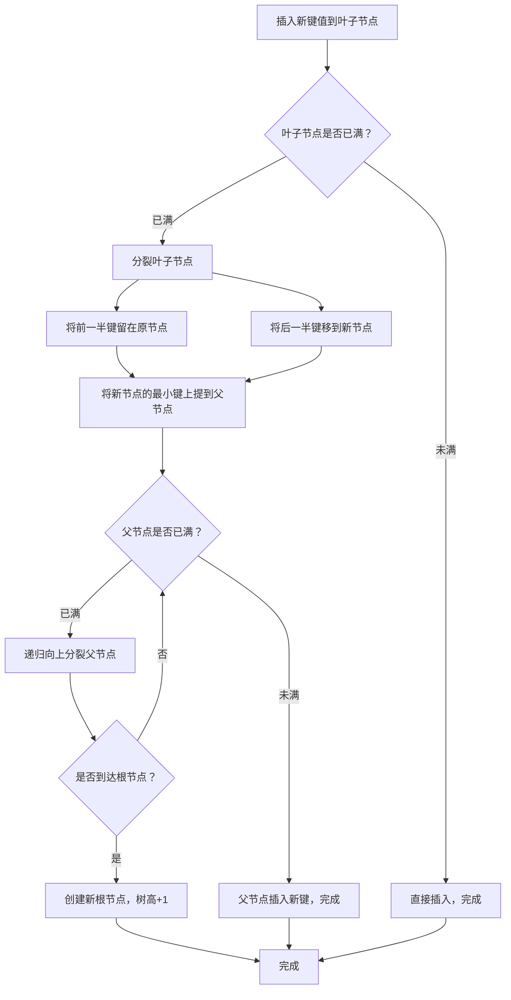

# B+Tree 索引算法
> 创建日期：2026-06-08
> 难度：⭐⭐⭐
> 前置知识：二叉搜索树（BST）、磁盘IO原理、分页机制
> 关联模块：MySQL InnoDB 存储引擎、文件系统索引、数据库索引

## ⭐ 面试重点速览

| 考察点 | 重要程度 | 考察频率 | 掌握目标 |
|--------|----------|----------|----------|
| B+Tree 与 B-Tree 的区别 | ★★★★★ | 极高 | 能画出结构图并解释核心差异 |
| 为什么用 B+Tree 而不用二叉树 | ★★★★★ | 极高 | 能从磁盘IO角度解释原因 |
| 节点分裂与合并过程 | ★★★★☆ | 高 | 能手动画出分裂过程 |
| 聚簇索引 vs 二级索引 | ★★★★☆ | 高 | 能解释 InnoDB 中两种索引的存储差异 |
| MySQL InnoDB 页结构（16KB） | ★★★☆☆ | 中 | 了解页的组成与 B+Tree 节点对应关系 |
| 范围查询为何高效 | ★★★★☆ | 高 | 理解叶子节点链表的作用 |

---

## 一、应用场景 🎯

B+Tree 是现代关系型数据库索引的基石，几乎所有主流数据库的默认索引结构都基于 B+Tree：

| 场景 | 具体案例 | 说明 |
|------|----------|------|
| 数据库主键索引 | MySQL InnoDB 聚簇索引 | 数据行的物理存储按主键 B+Tree 组织 |
| 数据库二级索引 | MySQL 普通索引、唯一索引 | 叶子节点存储主键值，需回表查询 |
| 文件系统 | NTFS、ext4 的目录索引 | 加速文件查找，减少磁盘寻道 |
| 键值存储 | MongoDB 的 WiredTiger 引擎 | 底层默认使用 B+Tree 存储引擎 |
| 范围查询 | `SELECT * FROM t WHERE id BETWEEN 100 AND 200` | 叶子节点链表让范围扫描只需 O(log n + k) |

**核心价值**：在磁盘存储场景下，B+Tree 能将树的高度控制在 3~4 层以内，让一次查询只需 3~4 次磁盘 IO，这是二叉树无法做到的。

---

## 二、核心原理 🔬

### 2.1 为什么是"多路"平衡搜索树？

磁盘 IO 的基本单位是页（通常 4KB~16KB），每次随机读写耗时约 10ms。二叉树的高度通常是 log2(n)，对于百万级数据，高度约 20，意味着 20 次磁盘 IO。

B+Tree 将每个节点的大小设计为与磁盘页对齐（MySQL InnoDB 为 16KB），一个节点可存储数百个键（称为"度"或"阶"），高度 log_m(n) 通常只有 3~4。

**关键概念**：
- **度（degree）**：一个节点最多拥有的子节点数，记为 m
- **内部节点**：只存储索引键和子节点指针，不存储实际数据
- **叶子节点**：存储所有实际数据（或数据指针），节点间用双向链表连接

### 2.2 Mermaid 流程图：节点分裂过程



### 2.3 B-Tree vs B+Tree 对比

| 特性 | B-Tree | B+Tree |
|------|--------|--------|
| 数据存储位置 | 所有节点都存数据 | 仅叶子节点存数据 |
| 内部节点内容 | 键 + 数据 + 子节点指针 | 仅键 + 子节点指针（更省空间） |
| 叶子节点连接 | 无链表 | 双向链表连接（范围查询友好） |
| 范围查询效率 | 需要中序遍历，可能回溯 | 找到起点后沿链表扫描即可 |
| 树的高度 | 较高（内部节点存数据占空间） | 更低（内部节点只存索引，扇出更大） |
| 查询稳定性 | 可能在内部节点命中，不稳定 | 任何查询都必须走到叶子节点，稳定 |

### 2.4 MySQL InnoDB 页结构（16KB）

```
┌──────────────────────────────────────┐
│  File Header（38字节）                │  页类型、页号、校验和
├──────────────────────────────────────┤
│  Page Header（56字节）                │  槽数量、记录数、层级
├──────────────────────────────────────┤
│  Infimum + Supremum（26字节）         │  最小/最大虚拟记录
├──────────────────────────────────────┤
│  User Records（用户记录区）            │  实际的行数据或索引项
├──────────────────────────────────────┤
│  Free Space（空闲空间）               │  可用于新插入
├──────────────────────────────────────┤
│  Page Directory（页目录）             │  槽（Slot）数组，二分查找用
├──────────────────────────────────────┤
│  File Trailer（8字节）                │  校验和、LSN
└──────────────────────────────────────┘
```

### 2.5 聚簇索引 vs 二级索引

**聚簇索引（Clustered Index）**：
- 叶子节点直接存储完整的数据行
- 一张表只能有一个聚簇索引（通常是主键）
- InnoDB 中数据即索引，索引即数据

**二级索引（Secondary Index）**：
- 叶子节点存储的是索引列 + 主键值
- 通过二级索引查询需要"回表"——先查到主键，再到聚簇索引中查完整行
- 覆盖索引（索引包含查询所需全部列）可以避免回表

---

## 三、趣味解说 🎭

想象你走进一座巨大的图书馆，要找编号为 `M-2024-A8` 的书。

**如果用二叉树（逐个问管理员）**：
你每走一步就问一个管理员，管理员告诉你往左还是往右。图书馆有 100 万本书，二叉树有 20 层，你需要问 20 个管理员才能找到书——每个管理员在不同的楼层，你得上上下下 20 次。

**如果用 B+Tree（楼层索引牌）**：
一楼大厅有一个大牌子（根节点），上面写着：
- "A 类在 2 楼，M 类在 3 楼，Z 类在 4 楼"
你直接上 3 楼。3 楼的牌子（内部节点）写着：
- "M-1000 在 301 室，M-2000 在 302 室，M-3000 在 303 室"
你走到 302 室。这间屋子（叶子节点）的书架上，所有书按编号排好，而且书架之间有通道（双向链表），你可以顺着通道一本本翻看。

**核心智慧**：
- 楼层索引牌（内部节点）只写分类号，不写书的详细内容，所以一个牌子能容纳更多分类
- 所有书都在各房间（叶子层），房间之间有走廊（链表），想找"M-2000 到 M-2999 之间所有的书"，找到第一本后顺着走廊走就行
- 如果某个房间书太多装不下了（节点满），就把书分成两间（分裂），然后把新房间的编号加到楼层的牌子上

---

## 四、代码实现 💻

```java
import java.util.ArrayList;
import java.util.List;

/**
 * B+Tree 简化实现 —— 仅演示核心结构，不包含完整的删除和页管理
 * 实际生产环境中，MySQL InnoDB 的 B+Tree 远比这个复杂
 *
 * @param <K> 键类型（需实现 Comparable）
 * @param <V> 值类型
 */
public class BPlusTree<K extends Comparable<K>, V> {

    /** 最大阶数（一个节点最多有多少个子节点） */
    private final int maxDegree;

    /** 内部节点或叶子节点能容纳的最大键数 = maxDegree - 1 */
    private final int maxKeys;

    /** 根节点 */
    private Node root;

    /** 第一个叶子节点，用于范围扫描 */
    private LeafNode head;

    // ==================== 构造 ====================

    public BPlusTree(int maxDegree) {
        if (maxDegree < 3) throw new IllegalArgumentException("阶数至少为 3");
        this.maxDegree = maxDegree;
        this.maxKeys = maxDegree - 1;
        this.root = new LeafNode(); // 初始时根节点就是叶子节点
        this.head = (LeafNode) this.root;
    }

    // ==================== 节点抽象类 ====================

    /** 节点基类 */
    abstract class Node {
        List<K> keys = new ArrayList<>(); // 键列表，保持有序

        /** 判断节点是否已满（键数达到 maxKeys） */
        boolean isFull() { return keys.size() == maxKeys; }
    }

    /** 内部节点：只存储键和子节点指针，不存储实际数据 */
    class InternalNode extends Node {
        List<Node> children = new ArrayList<>(); // 子节点列表，children[i] 指向键 < keys[i] 的子树

        InternalNode() { }

        /**
         * 在内部节点中插入子节点（分裂时使用）
         *
         * @param key   上提的键
         * @param child 新的子节点
         */
        void insertChild(K key, Node child) {
            int pos = 0;
            while (pos < keys.size() && keys.get(pos).compareTo(key) < 0) {
                pos++;
            }
            keys.add(pos, key);
            children.add(pos + 1, child); // 子节点在对应键的右侧
        }
    }

    /** 叶子节点：存储键和实际数据，并通过双向链表连接 */
    class LeafNode extends Node {
        List<V> values = new ArrayList<>(); // 与 keys 一一对应的值
        LeafNode next;                      // 指向下一个叶子节点的指针（范围查询的关键）
        LeafNode prev;                      // 指向上一个叶子节点

        /**
         * 在叶子节点中插入键值对（保持有序）
         *
         * @param key   键
         * @param value 值
         */
        void insert(K key, V value) {
            int pos = 0;
            while (pos < keys.size() && keys.get(pos).compareTo(key) < 0) {
                pos++;
            }
            // 键已存在则更新值，否则在 pos 位置插入
            if (pos < keys.size() && keys.get(pos).compareTo(key) == 0) {
                values.set(pos, value);
            } else {
                keys.add(pos, key);
                values.add(pos, value);
            }
        }

        /** 从给定位置开始分裂：保留前一半，返回新节点（后一半） */
        LeafNode split() {
            LeafNode newLeaf = new LeafNode();
            int mid = keys.size() / 2;
            // 将后半部分键值对移到新节点
            newLeaf.keys.addAll(keys.subList(mid, keys.size()));
            newLeaf.values.addAll(values.subList(mid, values.size()));
            // 原节点保留前半部分（subList 视图需要新建 ArrayList 才能真正删除）
            keys = new ArrayList<>(keys.subList(0, mid));
            values = new ArrayList<>(values.subList(0, mid));
            // 维护链表：newLeaf 接在原节点后面
            newLeaf.next = this.next;
            newLeaf.prev = this;
            if (this.next != null) this.next.prev = newLeaf;
            this.next = newLeaf;
            return newLeaf;
        }
    }

    // ==================== 查找 ====================

    /**
     * 查找指定键对应的值
     * 时间复杂度：O(log n)，实际由树高决定（通常 3~4 次节点访问）
     */
    public V search(K key) {
        LeafNode leaf = findLeafNode(key);
        for (int i = 0; i < leaf.keys.size(); i++) {
            if (leaf.keys.get(i).compareTo(key) == 0) {
                return leaf.values.get(i);
            }
        }
        return null;
    }

    /** 从根开始找到可能包含目标键的叶子节点 */
    private LeafNode findLeafNode(K key) {
        Node node = root;
        while (!(node instanceof LeafNode)) {
            InternalNode internal = (InternalNode) node;
            // 二分查找确定走哪个子节点
            int i = 0;
            while (i < internal.keys.size() && key.compareTo(internal.keys.get(i)) >= 0) {
                i++;
            }
            node = internal.children.get(i);
        }
        return (LeafNode) node;
    }

    // ==================== 插入 ====================

    /**
     * 插入键值对。如果根节点满则创建新根，树高 +1
     */
    public void insert(K key, V value) {
        // 找到目标叶子节点并插入
        LeafNode leaf = findLeafNode(key);
        leaf.insert(key, value);

        // 叶子节点满了需要分裂
        if (leaf.isFull()) {
            handleSplit(leaf);
        }
    }

    /**
     * 处理节点分裂的递归过程
     * 核心逻辑：分裂 → 上提键到父节点 → 父节点满了则递归
     */
    private void handleSplit(Node node) {
        if (node == root) {
            // 根节点分裂：创建新根，树高 +1
            LeafNode leafRoot = (LeafNode) root;
            LeafNode newLeaf = leafRoot.split();
            InternalNode newRoot = new InternalNode();
            newRoot.keys.add(newLeaf.keys.get(0));     // 将新叶子节点的最小键上提
            newRoot.children.add(leafRoot);              // 左子节点
            newRoot.children.add(newLeaf);               // 右子节点
            root = newRoot;
            return;
        }

        // 非根节点：找到父节点，将分裂后的新键上提
        LeafNode leaf = (LeafNode) node;
        LeafNode newLeaf = leaf.split();
        InternalNode parent = findParent(root, node, null);
        if (parent == null) throw new IllegalStateException("找不到父节点");

        parent.insertChild(newLeaf.keys.get(0), newLeaf);

        // 父节点也满了，递归分裂
        if (parent.isFull()) {
            handleSplitInternal(parent);
        }
    }

    /** 处理内部节点分裂 */
    private void handleSplitInternal(InternalNode node) {
        if (node == root) {
            // 根内部节点分裂
            int mid = node.keys.size() / 2;
            K midKey = node.keys.get(mid);

            InternalNode newInternal = new InternalNode();
            newInternal.keys.addAll(node.keys.subList(mid + 1, node.keys.size()));
            newInternal.children.addAll(node.children.subList(mid + 1, node.children.size()));
            node.keys = new ArrayList<>(node.keys.subList(0, mid));
            node.children = new ArrayList<>(node.children.subList(0, mid + 1));

            InternalNode newRoot = new InternalNode();
            newRoot.keys.add(midKey);
            newRoot.children.add(node);
            newRoot.children.add(newInternal);
            root = newRoot;
        }
        // 非根内部节点分裂（此处省略完整实现，原理与叶子节点类似）
    }

    /** 在树中查找给定节点的父节点 */
    private InternalNode findParent(Node current, Node target, InternalNode parent) {
        if (current == target) return parent;
        if (current instanceof LeafNode) return null;
        InternalNode internal = (InternalNode) current;
        for (Node child : internal.children) {
            InternalNode result = findParent(child, target, internal);
            if (result != null) return result;
        }
        return null;
    }

    // ==================== 范围查询 ====================

    /**
     * 范围查询 —— B+Tree 的核心优势之一
     * 找到起点叶子节点后，沿链表扫描即可，无需回溯
     */
    public List<V> rangeSearch(K startKey, K endKey) {
        List<V> result = new ArrayList<>();
        LeafNode leaf = findLeafNode(startKey);
        while (leaf != null) {
            for (int i = 0; i < leaf.keys.size(); i++) {
                K key = leaf.keys.get(i);
                if (key.compareTo(startKey) >= 0 && key.compareTo(endKey) <= 0) {
                    result.add(leaf.values.get(i));
                }
                if (key.compareTo(endKey) > 0) return result; // 超出范围，结束
            }
            leaf = leaf.next; // 沿链表走到下一个叶子节点
        }
        return result;
    }
}
```

---

## 五、优缺点 ⚖️

### 优点

| 优点 | 详细说明 |
|------|----------|
| **磁盘IO次数少** | 树高 log_m(n)，百万级数据只需 3~4 层，即 3~4 次磁盘 IO |
| **范围查询高效** | 叶子节点用双向链表连接，找到起点后顺序扫描即可 |
| **查询性能稳定** | 每次查询都走到叶子节点，不存在内部节点命中，稳定 O(log n) |
| **空间利用率高** | 内部节点只存键，一个节点可以容纳更多索引项，扇出更大 |
| **适合磁盘存储** | 节点大小与磁盘页对齐（16KB），一次 IO 读取整个节点 |

### 缺点

| 缺点 | 详细说明 |
|------|----------|
| **写操作开销较大** | 插入/删除可能触发节点分裂与合并，涉及多次磁盘 IO |
| **空间浪费** | 节点可能不满 50%（分裂时各一半），空间利用率约 50%~69% |
| **不擅长点查** | 每次查询都走到叶子节点，不像 B-Tree 可能在内部节点命中 |
| **实现复杂度高** | 分裂、合并、重平衡逻辑复杂，正确实现难度大 |
| **并发控制困难** | 写操作可能导致树结构调整，锁粒度难以控制 |

---

## 六、面试高频题 📝

### Q1：B+Tree 和 B-Tree 的区别是什么？

**回答要点**：
1. B+Tree 所有数据存储在叶子节点，内部节点只存键和指针；B-Tree 所有节点都存数据
2. B+Tree 叶子节点通过双向链表连接，支持高效范围查询；B-Tree 没有链表
3. B+Tree 内部节点不存数据，扇出更大，树更矮；B-Tree 内部节点存数据，扇出较小
4. B+Tree 查询稳定（都到叶子）；B-Tree 可能在内部节点命中，不稳定

### Q2：为什么 MySQL InnoDB 使用 B+Tree 而不是红黑树或 AVL 树？

**回答要点**：
1. 红黑树/AVL 是二叉树，百万数据树高约 20，需要 20 次磁盘 IO
2. B+Tree 是多路搜索树，高度仅 3~4，只需 3~4 次磁盘 IO
3. B+Tree 节点大小与磁盘页对齐，一次 IO 加载整个节点
4. B+Tree 叶子链表适合范围查询（`BETWEEN`、`ORDER BY`、`GROUP BY`）

### Q3：聚簇索引和二级索引有什么区别？什么叫回表？

**回答要点**：
1. 聚簇索引叶子节点存完整行数据，一张表只有一个；二级索引叶子节点存索引列 + 主键
2. 通过二级索引查询时，先查到主键值，再到聚簇索引中查完整行，这个过程叫回表
3. 覆盖索引：当二级索引包含查询所需全部列时，无需回表

### Q4：B+Tree 插入时节点分裂的过程是怎样的？

**回答要点**：
1. 找到目标叶子节点，插入键值对
2. 若节点满了（键数 = maxKeys），将节点一分为二
3. 将新节点的最小键上提到父节点
4. 若父节点也满了，递归向上分裂
5. 若根节点也满了，创建新根，树高 +1

### Q5：为什么 B+Tree 不适合作为写密集场景的索引？

**回答要点**：
1. 插入可能触发节点分裂，涉及多次随机写
2. 删除可能触发节点合并
3. 每次写入都需要维护叶子链表
4. 写放大效应明显（一次逻辑写可能触发多次物理写）
5. 相比之下，LSM-Tree 更适合写密集场景

---

## 七、常见误区 ❌

### 误区 1：B+Tree 内部节点也存储数据

**纠正**：B+Tree 的内部节点**只存键和子节点指针**，不存储实际数据。这是与 B-Tree 的核心区别。正因为内部节点不存数据，每个节点可以容纳更多的键（扇出更大），树的高度更低。

### 误区 2：B+Tree 的叶子节点是单向链表

**纠正**：MySQL InnoDB 的 B+Tree 叶子节点是**双向链表**（有 prev 和 next 指针）。双向链表支持向前和向后扫描，对于 `ORDER BY DESC` 和反向范围查询非常重要。

### 误区 3：B+Tree 的搜索和二叉树搜索过程完全一样

**纠正**：B+Tree 的内部节点包含**多个键**，在每个节点内也需要查找（通常使用二分查找确定走哪个子节点）。这是一个"节点内二分查找 + 节点间树选择"的复合过程。

### 误区 4：所有数据库都用 B+Tree

**纠正**：B+Tree 是主流，但不是唯一选择。LSM-Tree（LevelDB/RocksDB）、Hash 索引（Memory 引擎）、倒排索引（ES）等都是不同场景下的替代方案。写密集场景下 LSM-Tree 通常更优。

### 误区 5：B+Tree 的阶数越大越好

**纠正**：阶数越大意味着每个节点存储更多键，树更矮，但单次节点内二分查找的计算量也相应增大。更重要的是，节点大小必须与磁盘页对齐（如 16KB），所以阶数由磁盘页大小和键的大小共同决定，并非越大越好。