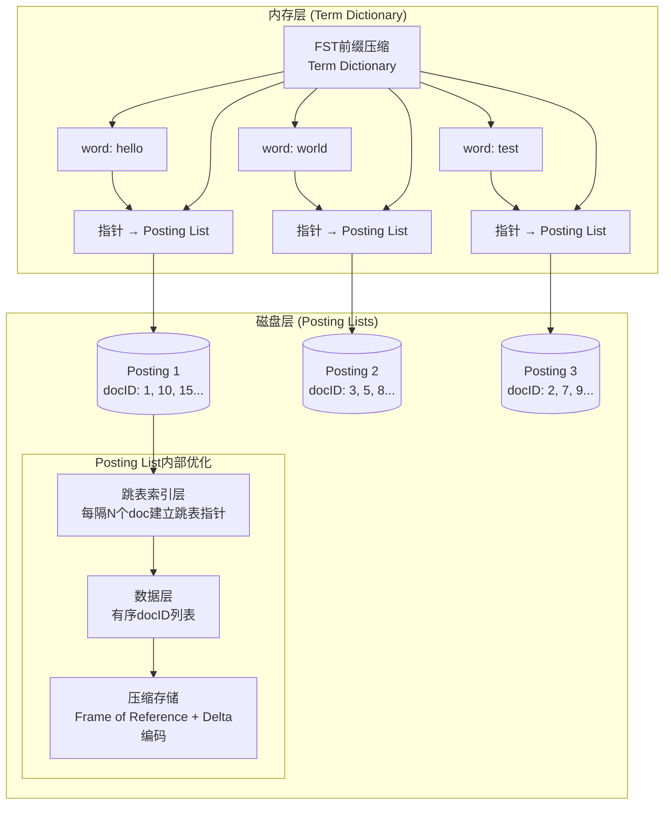
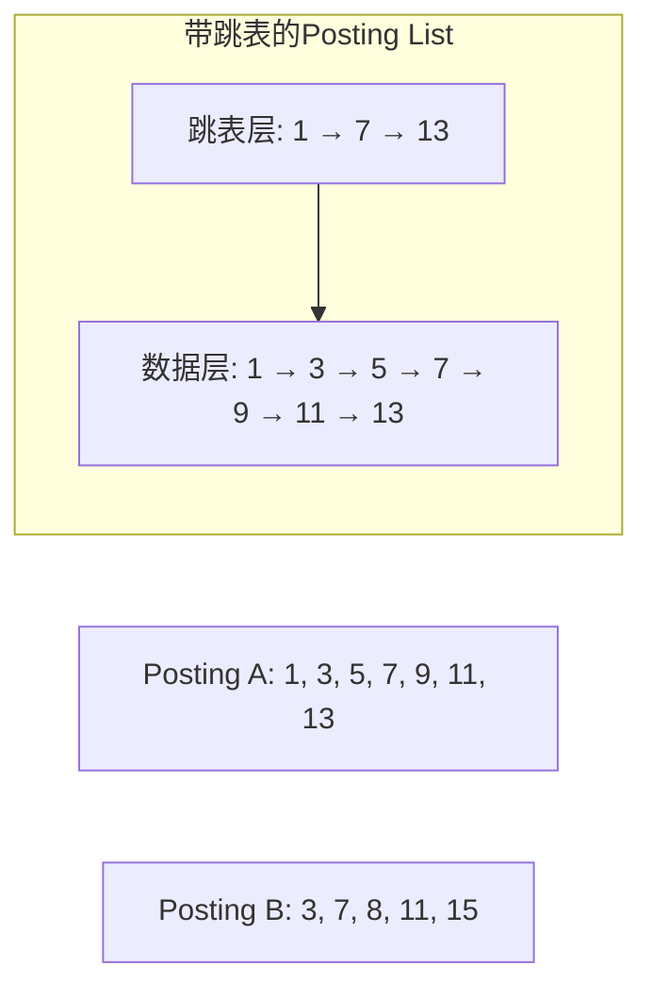

# 倒排索引
> 创建日期：2026-06-08
> 难度：⭐⭐
> 前置知识：二分查找、跳表
> 关联模块：搜索引擎、全文检索

## ⭐ 面试重点速览
| 考察点 | 重要程度 | 考察频率 | 掌握目标 |
|--------|----------|----------|----------|
| 倒排索引基本结构 | ⭐⭐⭐⭐⭐ | 高频 | 掌握Term Dictionary和Posting List的作用 |
| 压缩优化技术 | ⭐⭐⭐⭐ | 中频 | 理解FST前缀压缩原理和优点 |
| 查询加速策略 | ⭐⭐⭐⭐ | 中频 | 掌握跳表加速AND合并的原理 |
| Elasticsearch实现 | ⭐⭐⭐ | 中频 | 了解实际工程中的优化方式 |

## 一、应用场景 🎯

倒排索引是现代搜索引擎的核心数据结构，广泛应用于以下场景：

1. **全文搜索引擎**：Google、百度、Elasticsearch、Solr等都基于倒排索引实现快速关键词检索
2. **文档检索系统**：根据关键词快速找到包含该关键词的所有文档
3. **日志分析**：在海量日志中快速筛选包含特定错误码或关键词的日志条目
4. **代码搜索**：GitHub等代码托管平台通过倒排索引加速代码符号搜索
5. **社交媒体搜索**：微博、Twitter等平台快速搜索包含特定话题的帖子

**核心问题**：给定一个关键词，如何在百万/亿级文档中快速找到所有包含该关键词的文档？正排索引是遍历所有文档检查是否包含关键词，时间复杂度O(N)，无法满足实时查询需求；而倒排索引可以直接定位到目标文档列表，时间复杂度接近O(1)。

## 二、核心原理 🔬

### 基本结构

倒排索引由两部分组成：
- **Term Dictionary（词项词典）**：存储所有出现过的单词，并建立索引指向对应的Posting List
- **Posting List（倒排列表）**：存储每个单词对应的文档ID列表，以及其他统计信息（词频、位置等）

```mermaid
graph TD
    A[文档集合] --> B[分词处理]
    B --> C[Term Dictionary<br/>词项词典]
    C --> D[Term 1: "搜索引擎"] --> E[Posting List<br/>(1, 3, 7, 9, 15)]
    C --> F[Term 2: "倒排索引"] --> G[Posting List<br/>(3, 5, 7, 12)]
    C --> H[Term 3: "算法"] --> I[Posting List<br/>(2, 3, 5, 7, 8, 10)]
    
    style C fill:#f9f,stroke:#333,stroke-width:2px
    style E fill:#9f9,stroke:#333
    style G fill:#9f9,stroke:#333
    style I fill:#9f9,stroke:#333
```

### 整体结构图



### FST前缀压缩

**问题**：如果词典包含几百万个单词，直接存储会占用大量内存，怎么办？

**解决方案**：使用FST（Finite State Transducer，有限状态转换器）进行前缀压缩：
- 共享相同前缀，减少存储空间
- 比如："hello"、"helloworld"、"help"共享前缀"hel"
- 内存占用通常可以减少到原来的1/10甚至更少
- 支持快速前缀查询，非常适合自动补全功能

### 跳表加速合并

当查询多个关键词的AND（交集）时，需要对多个有序的Posting List进行合并：



**跳表加速原理**：
- 在有序Posting List上建立多层跳表索引
- 合并时通过跳表快速跳过不可能匹配的区间
- 避免逐个比较，将合并时间复杂度从O(n)优化到O(n/log n)

### Elasticsearch中的实现

Elasticsearch在Lucene基础上对倒排索引做了进一步优化：

1. **分块存储**：将索引按段（Segment）分开存储，段不变性提高读写效率
2. **列式存储**：DocID、词频、位置分别存储，提高缓存命中率
3. **迭代器合并**：利用跳表多路归并高效计算多个Posting List的交集/并集
4. **DocValues**：正排索引用于聚合排序，倒排索引用于检索，各司其职

## 三、趣味解说 🎭

想象一下你有一本厚厚的英文字典：

- **正排索引**就像是字典从第一页翻到最后一页，你知道每一页印了什么单词，但要找某个单词出现在哪些页，就得一页一页翻过去，累死！
- **倒排索引**就像是字典前面的词表：你先在词表里找到单词，词表直接告诉你这个单词出现在字典的哪几页！
- **Term Dictionary**就是那个词表，帮你快速定位
- **Posting List**就是单词对应的页码列表，直接告诉你在哪

就这么简单！比如你要找"倒排索引"四个字，不用把整本百科全书从头翻到尾，去目录一查，哦，在第76页，直接翻过去就好了。

FST前缀压缩就像是：字典里很多单词开头都是一样的，比如"telephone"、"television"、"telegraph"，它们都有"tele"这个前缀，我们不用把"tele"存三遍，只存一遍就好了，省空间！

跳表加速就像是：你翻书的时候，每隔10页折一个角，找的时候先跳着看这些折角，快速缩小范围，不用一页一页慢慢找。

## 四、代码实现 💻

以下是Java语言实现的简单倒排索引：

```java
import java.util.*;

/**
 * 简单倒排索引实现
 * 包含Term Dictionary和Posting List基本结构
 */
public class InvertedIndex {
    
    // Term Dictionary: 词项 → 倒排列表
    private final Map<String, PostingList> index;
    
    public InvertedIndex() {
        this.index = new TreeMap<>();
    }
    
    /**
     * 倒排列表
     * 存储有序文档ID列表，支持跳表优化
     */
    public static class PostingList {
        private final List<Integer> docIds;          // 文档ID列表（保持有序）
        private final List<Integer> skipPointers;    // 跳表指针（每隔K个元素存储一个跳转点）
        private final int termFrequency;             // 词频：出现在多少篇文档中
        
        public PostingList() {
            this.docIds = new ArrayList<>();
            this.skipPointers = new ArrayList<>();
            this.termFrequency = 0;
        }
        
        // 添加文档ID，保持有序
        public void addDocId(int docId) {
            if (docIds.isEmpty() || docId > docIds.get(docIds.size() - 1)) {
                docIds.add(docId);
            }
        }
        
        // 构建跳表索引：每隔skipInterval个元素建立一个跳表指针
        public void buildSkipIndex(int skipInterval) {
            skipPointers.clear();
            for (int i = 0; i < docIds.size(); i += skipInterval) {
                skipPointers.add(docIds.get(i));
            }
        }
        
        public List<Integer> getDocIds() {
            return docIds;
        }
        
        public int size() {
            return docIds.size();
        }
    }
    
    /**
     * 添加文档到倒排索引
     * @param docId 文档ID
     * @param content 文档内容
     */
    public void addDocument(int docId, String content) {
        // 简单分词：按空格分割
        String[] terms = content.toLowerCase().split("\\s+");
        
        for (String term : terms) {
            // 去除标点符号
            term = term.replaceAll("[^a-z]", "");
            if (term.isEmpty()) continue;
            
            // 添加到倒排索引
            index.computeIfAbsent(term, k -> new PostingList())
                 .addDocId(docId);
        }
    }
    
    /**
     * 查询单个词，返回包含该词的文档列表
     */
    public List<Integer> search(String term) {
        PostingList posting = index.get(term.toLowerCase());
        return posting != null ? posting.getDocIds() : Collections.emptyList();
    }
    
    /**
     * AND查询：查找同时包含所有词的文档
     * 使用跳表加速合并
     */
    public List<Integer> searchAnd(List<String> terms) {
        if (terms.isEmpty()) return Collections.emptyList();
        
        // 按Posting List大小排序，从小大大，减少合并次数
        List<PostingList> postingLists = new ArrayList<>();
        for (String term : terms) {
            PostingList pl = index.get(term.toLowerCase());
            if (pl == null) return Collections.emptyList();
            postingLists.add(pl);
        }
        postingLists.sort(Comparator.comparingInt(PostingList::size));
        
        // 多路归并计算交集
        return mergeIntersection(postingLists);
    }
    
    /**
     * 多路归并计算有序列表的交集
     */
    private List<Integer> mergeIntersection(List<PostingList> lists) {
        List<Integer> result = new ArrayList<>(lists.get(0).getDocIds());
        
        for (int i = 1; i < lists.size(); i++) {
            result = intersectTwoLists(result, lists.get(i).getDocIds());
            if (result.isEmpty()) break;
        }
        
        return result;
    }
    
    /**
     * 两个有序列表求交集（双指针法）
     */
    private List<Integer> intersectTwoLists(List<Integer> a, List<Integer> b) {
        List<Integer> result = new ArrayList<>();
        int i = 0, j = 0;
        
        while (i < a.size() && j < b.size()) {
            if (a.get(i).equals(b.get(j))) {
                result.add(a.get(i));
                i++;
                j++;
            } else if (a.get(i) < b.get(j)) {
                i++;
            } else {
                j++;
            }
        }
        
        return result;
    }
    
    /**
     * 对所有Posting List构建跳表索引
     */
    public void buildAllSkipIndexes(int skipInterval) {
        for (PostingList posting : index.values()) {
            posting.buildSkipIndex(skipInterval);
        }
    }
    
    /**
     * 获取索引统计信息
     */
    public Map<String, Object> getStats() {
        Map<String, Object> stats = new HashMap<>();
        stats.put("totalTerms", index.size());
        int totalDocs = 0;
        for (PostingList pl : index.values()) {
            totalDocs += pl.size();
        }
        stats.put("totalPostings", totalDocs);
        return stats;
    }
    
    // 测试示例
    public static void main(String[] args) {
        InvertedIndex index = new InvertedIndex();
        
        // 添加测试文档
        index.addDocument(1, "Hello world this is a test");
        index.addDocument(2, "Another test document with different words");
        index.addDocument(3, "Hello again this is another test");
        index.addDocument(4, "World of programming algorithms");
        
        // 构建跳表索引
        index.buildAllSkipIndexes(4);
        
        // 查询测试
        System.out.println("查询 'test': " + index.search("test"));
        System.out.println("查询 'hello': " + index.search("hello"));
        
        // AND查询测试
        List<Integer> result = index.searchAnd(Arrays.asList("hello", "test"));
        System.out.println("AND查询 'hello' AND 'test': " + result);
        
        // 输出统计信息
        System.out.println("统计信息: " + index.getStats());
    }
}
```

**代码说明**：
1. 实现了基本的倒排索引结构，包含Term Dictionary和Posting List
2. 支持简单分词和文档插入
3. 支持单个词查询和多个词AND查询
4. 提供了跳表索引构建接口，可用于优化合并速度
5. 使用有序列表+双指针法计算交集，时间复杂度O(m + n)

## 五、优缺点 ⚖️

### 优点

1. **查询高效**：给定关键词直接定位到文档列表，不需要遍历整个文档集合，查询速度比正排索引快几个数量级
2. **空间优化**：通过FST前缀压缩、Delta编码、Frame of Reference等技术，可以在有限内存中存储大规模词典
3. **支持复杂查询**：天然支持布尔查询（AND/OR/NOT），通过跳表优化可以高效计算交集和并集
4. **可扩展性好**：支持增量更新，分布式索引构建方便

### 缺点

1. **构建耗时**：需要对所有文档分词并建立映射，构建过程比正排索引复杂耗时
2. **空间占用**：虽然经过压缩，仍然需要额外存储索引结构，空间成本大约是原始文本的30%-50%
3. **更新维护复杂**：倒排索引的动态更新需要复杂的合并策略，Lucene/ES采用分段合并策略解决这个问题
4. **不擅长模糊查询**：前缀查询还好，中缀/后缀查询需要额外的反转索引支持

## 六、面试高频题 📝

### 1. 什么是倒排索引？和正排索引的区别是什么？

**回答要点**：
- 正排索引：文档ID → 文档中的单词列表，适合查询文档内容，不适合根据单词找文档
- 倒排索引：单词 → 包含该单词的文档ID列表，适合根据关键词检索文档
- 搜索引擎主要使用倒排索引

### 2. 倒排索引由哪两个主要部分组成？各自作用是什么？

**回答要点**：
- Term Dictionary（词项词典）：存储所有词项，提供从词项到Posting List的映射
- Posting List（倒排列表）：存储词项对应的所有文档ID列表，以及词频、位置等信息

### 3. 如何对多个Posting List求交集？有什么优化方法？

**回答要点**：
- 基础方法：双指针法，时间复杂度O(m + n)
- 优化：
  1. 先对Posting List按长度排序，从最小的开始合并，尽早缩小结果集
  2. 使用跳表索引，快速跳过不可能匹配的区间，减少比较次数
  3. 使用二分查找加速定位

### 4. 什么是FST前缀压缩？为什么要用它？

**回答要点**：
- FST（Finite State Transducer）利用单词之间的前缀共享来压缩词典存储空间
- 多个单词共享相同前缀只存储一次，大大减少内存占用
- 比如"test"、"testing"、"tester"共享前缀"test"
- 优点：压缩比高，查询速度快，支持前缀匹配

### 5. Elasticsearch中倒排索引是如何实现的？

**回答要点**：
- Elasticsearch基于Lucene的倒排索引实现
- 采用分段存储，段是不可变的，写入时新文档写到新段，定期合并段
- 使用DocValues实现正排索引，用于聚合和排序
- 倒排索引用于检索，DocValues用于聚合，分工明确
- 支持分布式索引，将索引分片到多个节点

## 七、常见误区 ❌

### ❌ 误区一：认为"倒排索引就是反向的正排索引"，仅此而已

**纠正**：倒排索引不仅仅是反过来存，工程上有大量优化：FST压缩词典、跳表加速合并、Delta压缩Posting List、分段存储等，这些才是倒排索引的精髓。

### ❌ 误区二：觉得"Posting List存的就是文档ID数组，不需要压缩"

**纠正**：实际上Posting List会做非常紧凑的压缩：
- 因为docID是有序的，存储差值（Delta）比存储原始值小很多
- 再用Frame of Reference或可变长度编码进一步压缩
- 压缩后的Posting List可以整体加载到内存，速度快很多

### ❌ 误区三："跳表只能用在索引层，不能用在Posting List上"

**纠正**：跳表非常适合用在有序Posting List上加速AND查询合并。多个有序Posting List求交集时，通过跳表可以快速跳过不匹配的区间，减少比较次数。

### ❌ 误区四："Elasticsearch只有倒排索引"

**纠正**：Elasticsearch（实际是Lucene）为了支持聚合和排序，还引入了DocValues（正排索引）。倒排索引擅长"单词找文档"，DocValues擅长"按文档ID取词"做聚合，二者配合使用。

### ❌ 误区五："FST压缩会牺牲查询速度"

**纠正**：FST不仅压缩了空间，由于更好的缓存命中率，实际上查询速度往往更快。因为整个FST可以放进CPU缓存，比频繁访问内存快很多。
