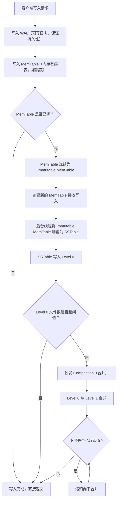

# LSM-Tree（Log-Structured Merge-Tree）
> 创建日期：2026-06-08
> 难度：⭐⭐⭐
> 前置知识：B+Tree 基本原理、磁盘顺序写 vs 随机写、内存与磁盘的速度差异
> 关联模块：LevelDB、RocksDB、Cassandra、HBase、TiKV

## ⭐ 面试重点速览

| 考察点 | 重要程度 | 考察频率 | 掌握目标 |
|--------|----------|----------|----------|
| LSM-Tree 核心架构（MemTable + SSTable） | ★★★★★ | 极高 | 能画出架构图，解释各组件作用 |
| 写放大与读放大的概念 | ★★★★★ | 极高 | 能解释为什么 LSM-Tree 写快读慢 |
| Compaction 策略（Leveled vs Tiered） | ★★★★☆ | 高 | 能对比两种策略的优缺点 |
| Bloom Filter 在 LSM-Tree 中的作用 | ★★★★☆ | 高 | 理解如何用 Bloom Filter 加速查询 |
| LSM-Tree 与 B+Tree 的对比 | ★★★★★ | 极高 | 能从读写场景、IO 模式等维度对比 |
| WAL（Write-Ahead Log）的作用 | ★★★☆☆ | 中 | 理解 WAL 如何保证持久性 |

---

## 一、应用场景 🎯

LSM-Tree 是写密集型存储场景的首选数据结构，它将随机写转化为顺序写，大幅提升写入吞吐量：

| 场景 | 具体案例 | 说明 |
|------|----------|------|
| 嵌入式 KV 存储 | LevelDB、RocksDB | Google/Facebook 开源的经典 LSM 实现 |
| 分布式数据库 | HBase、Cassandra、TiKV | 底层存储引擎均基于 LSM-Tree |
| 时序数据库 | InfluxDB（早期版本） | 写多读少的场景非常适合 LSM |
| 消息队列存储 | Apache Pulsar（BookKeeper） | 日志型存储天然匹配 LSM |
| 搜索引擎 | Elasticsearch（Lucene） | 段合并类似于 Compaction |
| 对象存储元数据 | Ceph BlueStore | 元数据管理使用 RocksDB |

**核心价值**：在 SSD 时代，顺序写与随机写的性能差距仍然显著（约 10 倍），LSM-Tree 通过将随机写转化为顺序写，实现极高的写入吞吐。

---

## 二、核心原理 🔬

### 2.1 架构总览

LSM-Tree 的核心思想是"延迟排序，批量归并"：写入先进入内存缓冲，攒够一批后刷到磁盘，后台异步合并多个文件。

```
写入流程：WAL(预写日志) → MemTable(内存) → Immutable MemTable(冻结) → SSTable(磁盘)
读取流程：MemTable → Immutable MemTable → SSTable(Level 0 → Level 1 → ... → Level N)
```

### 2.2 Mermaid 流程图：写入与 Compaction 全流程



### 2.3 核心组件详解

**MemTable（内存表）**：
- 驻留在内存中的有序数据结构，通常使用跳表（Skip List）或红黑树实现
- 所有写入首先进入 MemTable，因此写入非常快（纯内存操作）
- 数据按 key 有序排列

**WAL（Write-Ahead Log，预写日志）**：
- 写入 MemTable 之前先写 WAL，保证崩溃后数据不丢失
- WAL 是追加写入的磁盘文件，顺序写性能极高
- 当 MemTable 成功刷盘后，对应的 WAL 可以删除

**Immutable MemTable（不可变内存表）**：
- 当 MemTable 写满后，将其标记为 Immutable（只读），不再接受新写入
- 后台线程负责将其刷盘为 SSTable
- 读取时需要同时查询 MemTable 和 Immutable MemTable

**SSTable（Sorted String Table）**：
- 磁盘上的有序不可变文件，按 key 排序
- 包含数据块（Data Block）和索引块（Index Block）
- 每个 SSTable 通常附带一个 Bloom Filter 加速查找

### 2.4 Compaction 策略对比

| 策略 | Leveled Compaction | Tiered Compaction |
|------|-------------------|-------------------|
| **代表系统** | LevelDB、RocksDB | Cassandra、HBase |
| **合并方式** | 每层固定大小，Level N 与 Level N+1 合并 | 多个小文件合并为一个大文件 |
| **写放大** | 较高（一个 key 可能被合并多次） | 较低（每个 key 写入次数少） |
| **读放大** | 较低（每层文件数有限） | 较高（需要查找更多文件） |
| **空间放大** | 较低（约 10%） | 较高（旧版本文件可能暂存） |
| **适用场景** | 读多写少 | 写多读少 |

### 2.5 写放大与读放大

**写放大**：一次逻辑写入实际触发的物理写入量。LSM-Tree 的 Compaction 过程中，同一个 key 可能被反复读取和重写。例如，一个 key 从 Level 0 逐层合并到 Level 6，可能被写 10 次以上。

**读放大**：一次查询需要查找多个文件。最坏情况下需要查找 MemTable + Immutable MemTable + Level 0 的多个文件 + 每层一个文件。Bloom Filter 是降低读放大的关键手段。

### 2.6 Bloom Filter 加速查找

每次查询 SSTable 之前，先通过 Bloom Filter 快速判断 key 是否**可能**存在：
- 返回"不存在"：一定不存在，跳过该 SSTable，节省一次磁盘 IO
- 返回"可能存在"：需要实际查找 SSTable（可能有假阳性，但概率很低，通常 < 1%）

---

## 三、趣味解说 🎭

想象你是一个忙碌的图书管理员，每天都有大量新书到货。

**B+Tree 的做法（精确分类法）**：
每来一本新书，你就得走到相应的书架，找到正确的位置，把旁边的书挪开，把新书插进去。如果书架满了，还得把一半书搬到新书架（分裂），然后更新楼层索引牌。每一本书都是一次随机访问，累死个人。

**LSM-Tree 的做法（日记本法）**：
1. **先写日记本（MemTable）**：新书来了，先在桌上的日记本里记一笔："《三体》到了，放这里"。日记本就在手边，写得飞快。
2. **日记本写满了（Immutable MemTable）**：合上这本日记，拿一本新的接着记。被合上的日记本暂时不能改动，但可以翻阅。
3. **整理到档案柜（Flush to SSTable）**：下班后，把合上的日记本按书名排序，抄到档案柜里的正式档案纸上。因为是一次性抄写，写得整整齐齐，而且是顺序写。
4. **大扫除（Compaction）**：档案柜里纸越来越多，抽空把分散在多张纸上的同一条记录合并，去掉旧的，保留最新的。这样档案柜保持整洁，找起来也快。
5. **快速查找的秘诀（Bloom Filter）**：每张档案纸前面贴一张便利贴，上面写着"这张纸里有没有《三体》"。虽然便利贴偶尔会说"可能有"而实际没有，但它永远不会说"没有"而实际有。大多数时候，便利贴准确告诉你"没有"，你就直接跳过这张纸。

**核心智慧**：
- 把慢的随机操作（插入书架）变成快的顺序操作（写日记 + 批量抄写）
- 用空间换时间：存多个版本，稍后合并
- 读的时候多查几个地方，但通过 Bloom Filter 大幅减少无效查询

---

## 四、代码实现 💻

```java
import java.util.*;
import java.util.concurrent.ConcurrentSkipListMap;

/**
 * LSM-Tree 简化实现 —— 演示核心读写流程
 * 实际生产系统（LevelDB/RocksDB）远比这个复杂，包含完整的 Compaction 和 SSTable 格式
 */
public class LSMTree {

    // ==================== 核心组件 ====================

    /** 活跃内存表，使用跳表（ConcurrentSkipListMap）实现有序存储 */
    private ConcurrentSkipListMap<String, String> memTable;

    /** 不可变内存表，正在等待刷盘（只读） */
    private volatile ConcurrentSkipListMap<String, String> immutableMemTable;

    /** 磁盘上的 SSTable 列表，按层级组织（简化：Level 0 即可） */
    private final List<SSTable> ssTables;

    /** 内存表容量阈值（简化：按条目数） */
    private static final int MEMTABLE_SIZE_THRESHOLD = 1000;

    /** 是否正在刷盘 */
    private volatile boolean flushing = false;

    public LSMTree() {
        this.memTable = new ConcurrentSkipListMap<>();
        this.ssTables = new ArrayList<>();
    }

    // ==================== 写入 ====================

    /**
     * 写入键值对
     * 流程：写入 memTable → 如果满了则触发切换
     */
    public void put(String key, String value) {
        // 1. 写入活跃 MemTable（纯内存操作，极快）
        memTable.put(key, value);

        // 2. 检查是否需要切换 MemTable
        if (memTable.size() >= MEMTABLE_SIZE_THRESHOLD && !flushing) {
            switchMemTable();
        }
    }

    /** 切换 MemTable：当前表冻结为不可变，创建新表，触发后台刷盘 */
    private synchronized void switchMemTable() {
        if (flushing) return; // 防止并发切换
        flushing = true;

        // 将当前 MemTable 变为不可变
        immutableMemTable = memTable;
        // 创建新的 MemTable 继续接收写入
        memTable = new ConcurrentSkipListMap<>();

        // 后台刷盘（简化：同步执行，实际应异步）
        flushToSSTable();
        flushing = false;
    }

    // ==================== 读取 ====================

    /**
     * 读取键对应的值
     * 查找顺序：MemTable → Immutable MemTable → SSTable（从新到旧）
     */
    public String get(String key) {
        // 1. 先查活跃 MemTable（最新数据）
        String value = memTable.get(key);
        if (value != null) return value;

        // 2. 再查不可变 MemTable
        if (immutableMemTable != null) {
            value = immutableMemTable.get(key);
            if (value != null) return value;
        }

        // 3. 最后查磁盘上的 SSTable（从最新到最旧）
        for (int i = ssTables.size() - 1; i >= 0; i--) {
            SSTable sst = ssTables.get(i);
            // 先用 Bloom Filter 快速过滤（假阳性率约 1%）
            if (!sst.bloomFilter.mightContain(key)) {
                continue; // 确定不存在，跳过
            }
            value = sst.get(key);
            if (value != null) return value;
        }

        return null; // 未找到
    }

    // ==================== 刷盘与 Compaction ====================

    /** 将 Immutable MemTable 刷盘为 SSTable */
    private void flushToSSTable() {
        if (immutableMemTable == null || immutableMemTable.isEmpty()) return;

        SSTable sst = new SSTable(immutableMemTable);
        ssTables.add(sst);
        immutableMemTable = null; // 释放内存

        // 触发 Compaction（简化：仅当 SSTable 数量超过阈值时）
        if (ssTables.size() > 10) {
            compact();
        }
    }

    /**
     * 简化 Compaction：将多个 SSTable 合并为一个
     * 使用多路归并（类似归并排序），保留每个 key 的最新值
     */
    private void compact() {
        // 取前几个 SSTable 进行合并
        int mergeCount = Math.min(ssTables.size(), 5);
        List<SSTable> toMerge = new ArrayList<>(ssTables.subList(0, mergeCount));

        // 多路归并：使用优先队列
        PriorityQueue<Entry> minHeap = new PriorityQueue<>(
            Comparator.comparing(e -> e.key)
        );
        // 每个 SSTable 的迭代器入堆
        List<Iterator<Map.Entry<String, String>>> iterators = new ArrayList<>();
        for (SSTable sst : toMerge) {
            Iterator<Map.Entry<String, String>> it = sst.data.entrySet().iterator();
            if (it.hasNext()) {
                iterators.add(it);
                Map.Entry<String, String> entry = it.next();
                minHeap.add(new Entry(entry.getKey(), entry.getValue(), iterators.size() - 1));
            }
        }

        // 归并结果
        Map<String, String> merged = new LinkedHashMap<>();
        while (!minHeap.isEmpty()) {
            Entry smallest = minHeap.poll();
            // 同一个 key 只保留最新的（由于按加入顺序，最后加入的最旧，会被覆盖）
            merged.put(smallest.key, smallest.value);

            // 从对应迭代器取下一个
            Iterator<Map.Entry<String, String>> it = iterators.get(smallest.iteratorIndex);
            if (it.hasNext()) {
                Map.Entry<String, String> next = it.next();
                minHeap.add(new Entry(next.getKey(), next.getValue(), smallest.iteratorIndex));
            }
        }

        // 替换旧 SSTable
        ssTables.subList(0, mergeCount).clear();
        ssTables.add(0, new SSTable(merged));
    }

    // ==================== 内部类 ====================

    /** SSTable：磁盘上的有序不可变文件（简化版存储在内存的 Map 中） */
    static class SSTable {
        final Map<String, String> data;       // 有序数据（实际应存储在磁盘文件）
        final BloomFilter bloomFilter;         // 用于加速查找的布隆过滤器

        SSTable(Map<String, String> data) {
            this.data = new TreeMap<>(data);  // 保证有序
            this.bloomFilter = new BloomFilter(data.size(), 0.01);
            for (String key : data.keySet()) {
                bloomFilter.add(key);
            }
        }

        String get(String key) {
            return data.get(key);
        }
    }

    /** 归并用的条目 */
    static class Entry {
        String key;
        String value;
        int iteratorIndex;

        Entry(String key, String value, int iteratorIndex) {
            this.key = key;
            this.value = value;
            this.iteratorIndex = iteratorIndex;
        }
    }

    /**
     * 简化布隆过滤器 —— 用于演示加速查找的原理
     * 实际应使用 Guava 的 BloomFilter 或 Redis 的 BF 模块
     */
    static class BloomFilter {
        private final BitSet bits;
        private final int numHashFunctions;
        private final int size;

        /**
         * @param expectedInsertions 预期插入数量
         * @param falsePositiveRate  期望假阳性率
         */
        BloomFilter(int expectedInsertions, double falsePositiveRate) {
            // 位数组大小：m = -n * ln(p) / (ln(2)^2)
            this.size = (int) (-expectedInsertions * Math.log(falsePositiveRate)
                / (Math.log(2) * Math.log(2)));
            // 最优哈希函数个数：k = m/n * ln(2)
            this.numHashFunctions = Math.max(1,
                (int) Math.round((double) size / expectedInsertions * Math.log(2)));
            this.bits = new BitSet(size);
        }

        void add(String key) {
            for (int i = 0; i < numHashFunctions; i++) {
                int hash = hash(key, i);
                bits.set(Math.abs(hash % size));
            }
        }

        boolean mightContain(String key) {
            for (int i = 0; i < numHashFunctions; i++) {
                int hash = hash(key, i);
                if (!bits.get(Math.abs(hash % size))) {
                    return false; // 任何一个位为 0，则一定不存在
                }
            }
            return true; // 所有位都为 1，可能存在
        }

        /** 通过组合 hash 种子模拟多个哈希函数 */
        private int hash(String key, int seed) {
            return Objects.hash(key, seed);
        }
    }
}
```

---

## 五、优缺点 ⚖️

### 优点

| 优点 | 详细说明 |
|------|----------|
| **写入性能极高** | 写入先到内存，再将随机写转化为顺序写，吞吐量远超 B+Tree |
| **顺序写友好** | SSTable 刷盘和 Compaction 都是顺序写，充分利用磁盘/SSD 带宽 |
| **空间利用率高** | 无需预留分裂空间，SSTable 紧凑排列 |
| **压缩友好** | 不可变文件可以充分压缩，节省存储空间 |
| **无碎片问题** | 不原地更新，没有页分裂和碎片问题 |

### 缺点

| 缺点 | 详细说明 |
|------|----------|
| **读放大** | 需要查询 MemTable + Immutable MemTable + 多层 SSTable |
| **写放大** | Compaction 过程中同一数据可能被多次重写 |
| **Compaction 开销** | 后台合并操作消耗 CPU 和 IO，可能影响前台性能 |
| **延迟不稳定** | Compaction 可能导致写入停顿（Write Stall） |
| **不适合频繁更新** | 更新即删除旧值+写入新值，Compaction 压力大 |

---

## 六、面试高频题 📝

### Q1：LSM-Tree 和 B+Tree 的核心区别是什么？分别适合什么场景？

**回答要点**：
1. LSM-Tree 将随机写转化为顺序写，写入性能远高于 B+Tree
2. B+Tree 原地更新，读取只需一次磁盘 IO；LSM-Tree 需要查多层，读放大严重
3. LSM-Tree 适合写多读少（时序数据、日志、消息队列）
4. B+Tree 适合读多写少（OLTP 业务、交易系统）
5. LSM-Tree 通过 Compaction + Bloom Filter 弥补读性能

### Q2：什么是写放大和读放大？LSM-Tree 如何应对？

**回答要点**：
1. 写放大：一次逻辑写入导致的物理写入量。Compaction 中数据被反复重写
2. 读放大：一次查询需要访问多个文件/层
3. 应对写放大：选择 Tiered Compaction 策略，减少重写次数
4. 应对读放大：使用 Bloom Filter 快速过滤不存在的 key，减少无效 SSTable 访问

### Q3：Leveled Compaction 和 Tiered Compaction 的区别？

**回答要点**：
1. Leveled：每层一个固定大小，Level N 与 Level N+1 合并，读放大低但写放大高
2. Tiered：多个小文件合并为一个大文件，写放大低但读放大高
3. Leveled 代表：LevelDB/RocksDB；Tiered 代表：Cassandra
4. 选择依据：读多选 Leveled，写多选 Tiered

### Q4：为什么 LSM-Tree 需要 WAL？

**回答要点**：
1. MemTable 在内存中，进程崩溃数据会丢失
2. WAL 在写入 MemTable 前先写磁盘，保证持久性
3. 崩溃恢复时，重放 WAL 重建 MemTable
4. WAL 是顺序追加写，性能开销很小

### Q5：Bloom Filter 在 LSM-Tree 中起什么作用？

**回答要点**：
1. 每次查询 SSTable 前，先用 Bloom Filter 判断 key 是否可能存在
2. 返回"不存在"则直接跳过该 SSTable，节省一次磁盘 IO
3. 假阳性率通常设为 1%，空间开销很小
4. 大幅降低读放大，是 LSM-Tree 读性能的关键优化

---

## 七、常见误区 ❌

### 误区 1：LSM-Tree 读取速度一定比 B+Tree 慢

**纠正**：在理想情况下（数据在 MemTable 中，或 Bloom Filter 有效过滤），LSM-Tree 的读性能可以接近甚至超过 B+Tree。只有当数据在深层 SSTable 且需要多次 IO 时，读性能才明显下降。实际系统中通过 Bloom Filter、缓存、Compaction 策略优化，读性能通常可以接受。

### 误区 2：LSM-Tree 只适合 SSD

**纠正**：LSM-Tree 在 HDD 上同样有优势，因为顺序写 vs 随机写的性能差距在 HDD 上更大（约 100 倍）。虽然 Compaction 在 HDD 上的开销也更大，但整体写入吞吐仍然优于 B+Tree。

### 误区 3：Compaction 越频繁越好

**纠正**：Compaction 频率需要权衡。过于频繁会增加写放大和 CPU 开销；过于稀疏会导致 SSTable 堆积，读放大严重。实际系统通常根据 SSTable 数量和层级阈值动态触发。

### 误区 4：SSTable 文件可以修改

**纠正**：SSTable 是**不可变**（immutable）文件，一旦写入就不再修改。删除和更新操作通过在后续 SSTable 中写入墓碑标记（tombstone）或新值来实现。这是 LSM-Tree 顺序写特性得以保证的关键。

### 误区 5：LSM-Tree 的 MemTable 不需要排序

**纠正**：MemTable 必须保持有序，因为后续刷盘为 SSTable 时需要按 key 排序写入。这也是为什么 MemTable 通常用跳表或红黑树——它们在插入时就能保持有序，刷盘时直接遍历即可。