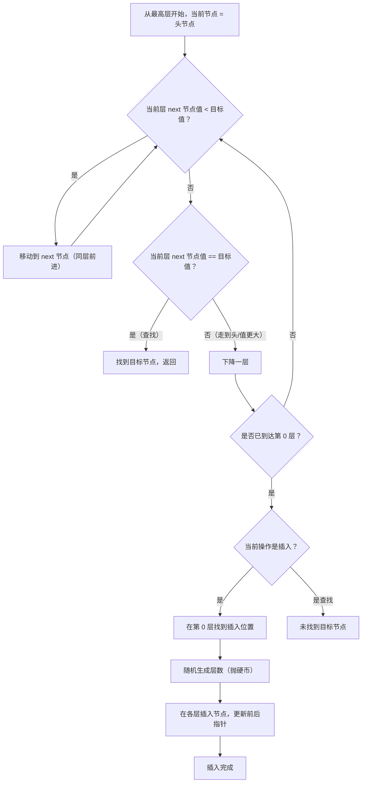

# 跳表（Skip List）
> 创建日期：2026-06-08
> 难度：⭐⭐
> 前置知识：链表、二分查找、概率论基础
> 关联模块：Redis ZSet（有序集合）、Java ConcurrentSkipListMap、LevelDB MemTable

## ⭐ 面试重点速览

| 考察点 | 重要程度 | 考察频率 | 掌握目标 |
|--------|----------|----------|----------|
| 跳表的数据结构（多层索引） | ★★★★★ | 极高 | 能画出多层链表结构并解释查找过程 |
| 插入时的随机层数机制 | ★★★★☆ | 高 | 理解概率平衡原理，能与平衡树对比 |
| 查找/插入/删除的时间复杂度 O(log n) | ★★★★★ | 极高 | 能推导期望时间复杂度 |
| Redis ZSet 为什么用跳表 | ★★★★★ | 极高 | 能从范围查询、实现复杂度、内存等角度分析 |
| 跳表 vs 红黑树的对比 | ★★★★☆ | 高 | 能从实现难度、并发友好度、范围查询等维度对比 |
| Java ConcurrentSkipListMap 原理 | ★★★☆☆ | 中 | 了解无锁并发跳表的实现思路 |

---

## 一、应用场景 🎯

跳表是一种概率平衡的数据结构，以简洁的实现提供了与平衡树同等的性能，在工业界有广泛应用：

| 场景 | 具体案例 | 说明 |
|------|----------|------|
| 有序集合 | Redis ZSet（Sorted Set） | 底层使用跳表 + 哈希表，支持按分数范围查询 |
| 并发有序映射 | Java ConcurrentSkipListMap | 基于无锁跳表实现的高并发有序 Map |
| LSM-Tree MemTable | LevelDB、RocksDB | MemTable 使用跳表实现有序存储 |
| 内存数据库 | H2 Database 的 MVStore | 使用跳表管理内存中的索引 |
| 搜索引擎 | Lucene 的 Term Dictionary | 早期版本使用跳表加速词典查找 |
| 排行榜系统 | 游戏排行榜、热搜榜单 | 天然支持按分数排序和范围查询 |

**核心价值**：在需要"有序 + 范围查询 + 高并发"的场景下，跳表用比红黑树简单得多的代码实现了同等性能，且天然支持并发操作。

---

## 二、核心原理 🔬

### 2.1 从链表到跳表：加层加速

普通链表查找需要 O(n)，因为每次只能走一步。跳表的核心思想是"给链表加索引层"：

```
普通链表：
1 → 3 → 5 → 7 → 9 → 11 → 13 → 15  （查找 13 需要 7 步）

加一层索引（跳表）：
Level 2: 1 ───────→ 7 ───────→ 13 ───────→ 15
Level 1: 1 → 3 → 5 → 7 → 9 → 11 → 13 → 15
（查找 13：Level 2 走两步到 7，再到 13，只需 3 步）
```

### 2.2 Mermaid 流程图：查找与插入过程



### 2.3 随机层数：概率平衡的智慧

跳表不强制旋转或重平衡，而是通过**随机层数**实现概率平衡：

```java
// 随机生成层数：每次抛硬币，正面则加一层，反面则停止
// 层数分布：50% 的节点只有 1 层，25% 有 2 层，12.5% 有 3 层...
int randomLevel() {
    int level = 1;
    // 常数 P = 0.5（或 0.25），每层以概率 P 上升
    while (Math.random() < 0.5 && level < MAX_LEVEL) {
        level++;
    }
    return level;
}
```

**为什么这样设计？**
- 第 1 层包含所有节点（100%）
- 第 2 层约包含 50% 的节点
- 第 3 层约包含 25% 的节点
- ...
- 第 k 层约包含 (1/2)^(k-1) 的节点

这样，高层稀疏（快速跳跃），低层密集（精确定位），总体期望时间复杂度 O(log n)。

### 2.4 跳表 vs 红黑树

| 维度 | 跳表 | 红黑树 |
|------|------|--------|
| 实现复杂度 | 简单（约 200 行） | 复杂（约 500+ 行，旋转/染色逻辑） |
| 范围查询 | 天然支持，找到起点后沿第 0 层扫描 | 需要中序遍历，实现复杂 |
| 并发友好度 | 高（局部修改，CAS 友好） | 低（旋转影响大范围节点，需要全局锁） |
| 内存占用 | 较高（每节点多指针，平均 ~1.33 倍） | 较低（每节点固定 3 个指针） |
| 性能稳定性 | 概率性（最坏情况退化） | 确定性（严格 O(log n)） |
| 插入性能 | 随机层数后直接插入，无需旋转 | 需要旋转和染色维护平衡 |

### 2.5 Redis ZSet 为什么用跳表？

Redis 作者 antirez 的解释：
1. **范围查询**：ZSet 需要支持 `ZRANGE`、`ZRANGEBYSCORE` 等操作，跳表天然支持
2. **实现简单**：跳表代码量远小于红黑树，更容易维护和调试
3. **性能足够**：跳表的期望性能与红黑树持平，且概率退化在实际中极少发生
4. **并发潜力**：虽然 Redis 是单线程，但跳表的设计为未来并发优化留下了空间

Redis ZSet 实际使用**跳表（zskiplist）+ 哈希表（dict）**的组合：
- 跳表负责按分数排序和范围查询
- 哈希表负责按成员名 O(1) 查找分数

---

## 三、趣味解说 🎭

想象你开车从北京到上海，高速公路上有各种出口。

**普通链表（乡间小路）**：
只有一条路，每个出口都要经过。从 1 号出口到 100 号出口，你必须经过 2、3、4...99 号出口，一个都不能少。

**跳表（高速公路系统）**：
- **第 0 层（地面道路）**：每个出口都停，最慢但最全
- **第 1 层（城市快速路）**：隔几个出口才停一次，比如 10 号、20 号、30 号...
- **第 2 层（高速公路）**：只停主要城市，比如 50 号、100 号...
- **第 3 层（航线）**：只停超大城市，比如直接到上海

**查找过程（开车去 85 号出口）**：
1. 从最高层（航线层）出发，看到下一个出口是 100 号——超过了！下降到高速公路层
2. 高速公路上，下一个出口是 50 号——没到，开过去。再下一个是 100 号——又超过了！下降到快速路
3. 快速路上，从 50 号出发，下一个是 60 号，再下一个 70 号，再下一个 80 号——继续。再下一个是 90 号——超过了！下降到地面道路
4. 地面道路上，从 80 号一步步走到 85 号——到了！

**插入一个新出口（84 号）**：
1. 同样按上述过程找到 84 号应该在地面道路的哪个位置
2. 然后**抛硬币**决定这个出口要建几层：正面就建一层，再抛正面就再建一层...
3. 比如抛了 3 次正面（建 3 层），那就把 84 号出口加到地面道路、快速路和高速公路上，各自更新"上一个出口"和"下一个出口"的指路牌

**核心智慧**：
- 高层是"快速通道"，让你跳过大部分不相关的出口
- 每个出口建几层靠运气（概率），但整体上会形成完美的金字塔结构
- 不用像红黑树那样左旋右旋，改个指路牌就行

---

## 四、代码实现 💻

```java
import java.util.Random;

/**
 * 跳表实现 —— 支持插入、查找、删除和范围查询
 * 时间复杂度期望 O(log n)，最坏情况 O(n)（概率极低）
 *
 * @param <K> 键类型（需实现 Comparable）
 * @param <V> 值类型
 */
public class SkipList<K extends Comparable<K>, V> {

    /** 最大层数限制 */
    private static final int MAX_LEVEL = 32;

    /** 每层上升概率（常用 0.5 或 0.25） */
    private static final double P = 0.5;

    /** 头节点（哨兵节点，不存实际数据） */
    private final Node<K, V> head;

    /** 当前跳表的最大层数 */
    private int currentLevel;

    /** 随机数生成器 */
    private final Random random;

    public SkipList() {
        this.head = new Node<>(null, null, MAX_LEVEL);
        this.currentLevel = 1;
        this.random = new Random();
    }

    // ==================== 节点定义 ====================

    /** 跳表节点 */
    static class Node<K extends Comparable<K>, V> {
        final K key;                  // 键（头节点 key 为 null）
        V value;                      // 值
        final Node<K, V>[] forward;   // 各层的前向指针数组

        @SuppressWarnings("unchecked")
        Node(K key, V value, int level) {
            this.key = key;
            this.value = value;
            this.forward = new Node[level];
        }
    }

    // ==================== 查找 ====================

    /**
     * 查找指定键的值
     * 核心逻辑：从高层开始，能跳则跳，否则下降一层
     */
    public V get(K key) {
        Node<K, V> node = findNode(key);
        return (node != null && node.key != null && node.key.compareTo(key) == 0)
            ? node.value : null;
    }

    /**
     * 跳表查找的核心方法
     * 返回第 0 层中键 <= key 的最大节点（即目标节点的前驱，或目标节点本身）
     */
    private Node<K, V> findNode(K key) {
        Node<K, V> current = head;
        // 从最高层开始逐层向下搜索
        for (int level = currentLevel - 1; level >= 0; level--) {
            // 在当前层尽可能向右移动
            while (current.forward[level] != null
                && current.forward[level].key.compareTo(key) < 0) {
                current = current.forward[level];
            }
            // 当前层无法继续前进，下降到下一层
        }
        // 此时 current 是第 0 层中小于 key 的最大节点
        // forward[0] 可能是目标节点
        return current;
    }

    // ==================== 插入 ====================

    /**
     * 插入键值对，若键已存在则更新值
     */
    public void put(K key, V value) {
        // 记录每层需要更新的前驱节点（插入时需要修改这些节点的 forward 指针）
        @SuppressWarnings("unchecked")
        Node<K, V>[] update = new Node[MAX_LEVEL];
        Node<K, V> current = head;

        // 1. 查找插入位置，同时记录每层的前驱节点
        for (int level = currentLevel - 1; level >= 0; level--) {
            while (current.forward[level] != null
                && current.forward[level].key.compareTo(key) < 0) {
                current = current.forward[level];
            }
            update[level] = current; // 记录该层的前驱
        }

        // 2. 检查键是否已存在
        Node<K, V> target = current.forward[0];
        if (target != null && target.key.compareTo(key) == 0) {
            target.value = value; // 更新值
            return;
        }

        // 3. 随机生成新节点的层数
        int newNodeLevel = randomLevel();

        // 4. 如果新节点层数超过当前最大层数，更新头节点的高层指针
        if (newNodeLevel > currentLevel) {
            for (int level = currentLevel; level < newNodeLevel; level++) {
                update[level] = head; // 高层的前驱都是头节点
            }
            currentLevel = newNodeLevel;
        }

        // 5. 创建新节点
        Node<K, V> newNode = new Node<>(key, value, newNodeLevel);

        // 6. 在各层插入新节点（更新前后指针，类似链表的插入）
        for (int level = 0; level < newNodeLevel; level++) {
            newNode.forward[level] = update[level].forward[level]; // 新节点指向后驱
            update[level].forward[level] = newNode;                 // 前驱指向新节点
        }
    }

    // ==================== 删除 ====================

    /**
     * 删除指定键的节点
     * 返回被删除的值，若键不存在则返回 null
     */
    public V remove(K key) {
        @SuppressWarnings("unchecked")
        Node<K, V>[] update = new Node[MAX_LEVEL];
        Node<K, V> current = head;

        // 找到每层的前驱节点
        for (int level = currentLevel - 1; level >= 0; level--) {
            while (current.forward[level] != null
                && current.forward[level].key.compareTo(key) < 0) {
                current = current.forward[level];
            }
            update[level] = current;
        }

        Node<K, V> target = current.forward[0];
        if (target == null || target.key.compareTo(key) != 0) {
            return null; // 键不存在
        }

        // 从各层删除节点
        for (int level = 0; level < currentLevel; level++) {
            if (update[level].forward[level] == target) {
                update[level].forward[level] = target.forward[level]; // 跳过目标节点
            }
        }

        // 更新当前最大层数（如果高层已经没有节点了）
        while (currentLevel > 1 && head.forward[currentLevel - 1] == null) {
            currentLevel--;
        }

        return target.value;
    }

    // ==================== 范围查询 ====================

    /**
     * 范围查询：返回键在 [startKey, endKey] 之间的所有值
     * 跳表的核心优势：找到起点后，沿第 0 层链表顺序扫描即可
     */
    public java.util.List<V> rangeQuery(K startKey, K endKey) {
        java.util.List<V> result = new java.util.ArrayList<>();
        // 找到起点前驱，从 forward[0] 开始扫描
        Node<K, V> current = findNode(startKey).forward[0];
        while (current != null && current.key.compareTo(endKey) <= 0) {
            if (current.key.compareTo(startKey) >= 0) {
                result.add(current.value);
            }
            current = current.forward[0]; // 沿第 0 层链表前进
        }
        return result;
    }

    // ==================== 随机层数 ====================

    /**
     * 随机生成节点层数
     * 概率分布：P(level=1)=0.5, P(level=2)=0.25, P(level=3)=0.125...
     * 期望层数：1/(1-P) = 2（当 P=0.5 时）
     */
    private int randomLevel() {
        int level = 1;
        // 每次以概率 P 上升一层，但不超过 MAX_LEVEL
        while (random.nextDouble() < P && level < MAX_LEVEL) {
            level++;
        }
        return level;
    }

    // ==================== 调试输出 ====================

    /** 打印跳表结构（用于调试） */
    public void print() {
        for (int level = currentLevel - 1; level >= 0; level--) {
            System.out.print("Level " + level + ": ");
            Node<K, V> node = head.forward[level];
            while (node != null) {
                System.out.print(node.key + " -> ");
                node = node.forward[level];
            }
            System.out.println("null");
        }
    }
}
```

---

## 五、优缺点 ⚖️

### 优点

| 优点 | 详细说明 |
|------|----------|
| **实现简单** | 代码量远小于红黑树，无需旋转和染色，易于理解和维护 |
| **范围查询高效** | 找到起点后沿第 0 层链表扫描，天然支持范围操作 |
| **并发友好** | 局部修改只影响少量节点，容易实现无锁（CAS）并发跳表 |
| **概率平衡** | 不需要复杂的旋转操作，通过随机层数实现期望 O(log n) |
| **灵活性高** | 可以通过调整概率 P 轻松改变层数分布，平衡空间与时间 |

### 缺点

| 缺点 | 详细说明 |
|------|----------|
| **内存占用高** | 每节点需要额外的 forward 指针数组，平均 ~2 倍指针开销 |
| **性能不稳定** | 概率算法，极端情况下可能退化到 O(n)（实际概率极低） |
| **缓存不友好** | 节点在内存中不连续，跳跃访问导致缓存命中率低 |
| **范围删除复杂** | 批量删除需要逐层更新指针，实现较复杂 |
| **不适合磁盘存储** | 节点分散，随机读取多，不适合磁盘 IO 模式 |

---

## 六、面试高频题 📝

### Q1：跳表的查找、插入、删除时间复杂度是多少？为什么？

**回答要点**：
1. 期望时间复杂度 O(log n)，空间复杂度 O(n)
2. 查找：每层最多前进常数步，总层数约 log n，所以 O(log n)
3. 插入：查找位置 O(log n) + 随机层数 O(1) + 更新指针 O(log n) = O(log n)
4. 删除：同查找 O(log n)
5. 最坏情况 O(n)（所有节点只有 1 层），但概率极低

### Q2：Redis ZSet 为什么用跳表而不用红黑树？

**回答要点**：
1. 范围查询：跳表天然支持，找到起点后沿第 0 层扫描即可；红黑树需要中序遍历
2. 实现简单：跳表代码量少，bug 更少，维护成本低
3. 性能足够：跳表期望性能与红黑树持平
4. 作者解释：antirez 认为跳表比红黑树更容易理解和调试
5. ZSet 实际是跳表 + 哈希表的组合，兼顾排序和点查

### Q3：跳表的随机层数机制是如何保证平衡的？

**回答要点**：
1. 每个节点插入时随机生成层数，概率 P=0.5
2. 期望层数 = 1/(1-P) = 2，期望节点数逐层减半
3. 这种"金字塔"结构保证了期望查找 O(log n)
4. 虽然不保证严格平衡，但大数定律下几乎不会退化

### Q4：跳表与平衡树（AVL/红黑树）的对比？

**回答要点**：
1. 实现难度：跳表远简单于平衡树
2. 并发支持：跳表易于实现无锁并发，平衡树需要复杂的锁机制
3. 范围查询：跳表天然支持，平衡树需要额外操作
4. 内存占用：跳表更高（每节点多指针）
5. 性能保证：平衡树是确定性的，跳表是概率性的

### Q5：Java ConcurrentSkipListMap 是如何实现线程安全的？

**回答要点**：
1. 基于无锁（Lock-Free）跳表，使用 CAS 操作更新指针
2. 删除节点时使用"标记删除"（逻辑删除 + 物理删除两步）
3. 插入前先检查节点是否被标记删除，保证一致性
4. 不需要全局锁，写操作只影响局部区域，并发度高

---

## 七、常见误区 ❌

### 误区 1：跳表的层数越多，查找越快

**纠正**：层数增加确实能减少查找步数，但每增加一层都需要额外的指针存储（内存开销）和更新开销。且层数超过一定值后，边际收益递减。通常 MAX_LEVEL 设为 32（足以支持 2^32 个元素），P=0.5 时期望最大层数为 32。

### 误区 2：跳表是严格平衡的

**纠正**：跳表是**概率平衡**的，不是严格平衡。在极端情况下（虽然概率极低），所有节点可能只有 1 层，退化为普通链表。但通过合理的随机数生成和概率设计，实际应用中几乎不会退化。

### 误区 3：跳表只能用于内存数据结构

**纠正**：跳表确实主要用于内存场景（因为随机访问模式不适合磁盘），但也可以用于磁盘存储。Google 的 LevelDB 的 SSTable 内部索引就使用了类似跳表的结构来加速块内查找。

### 误区 4：Redis 的 ZSet 只用了跳表

**纠正**：Redis ZSet 同时使用了**跳表（zskiplist）和哈希表（dict）**。哈希表用于 O(1) 按成员名查找分数，跳表用于按分数排序和范围查询。两者互补，各自的优势结合起来。

### 误区 5：跳表的随机层数可以用简单的随机数生成

**纠正**：虽然理论上可以，但实际需要谨慎。如果随机数生成器质量差（如简单的线性同余），可能导致层数分布不均匀，影响性能。Java 的 `Random` 和 `ThreadLocalRandom` 在大多数情况下足够，但极端场景下可考虑使用 `XorShift` 等高质随机数生成器。