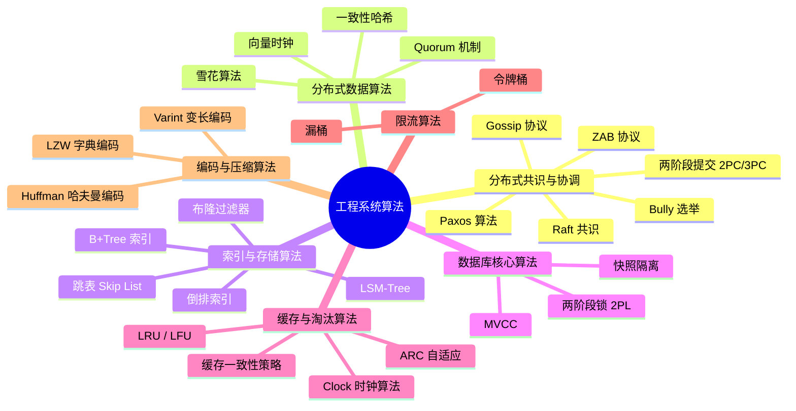
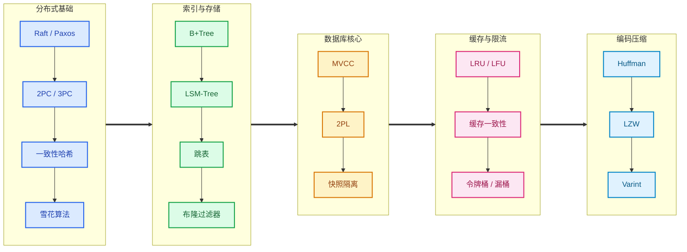

# 工程系统算法

> **创建日期：** 2026-06-08
> **面向岗位：** 高级工程师 / 架构师
> **前置知识：** 分布式系统基础、数据库基础、缓存基础

---

## 模块概述

工程系统算法是算法专题的"工程纵深"模块，聚焦于**分布式系统、数据库、缓存、限流、编码压缩**等实际工程中使用的核心算法。与经典算法（排序、搜索、DP）不同，这些算法解决的是**系统设计问题**而非纯计算问题。

::: tip 与中间件/数据库模块的关系
[中间件 → 分布式理论](/middleware/distributed-system/) 告诉你**怎么用** ZK 实现分布式锁；本模块告诉你 Raft 算法**为什么能保证一致性**。两者互补，建议先看工程模块了解场景，再回来看算法原理。
:::

## 知识图谱

## 学习路径

## 核心模块导航

### 🔗 分布式共识与协调

| 模块 | 核心内容 | 面试权重 |
|------|----------|----------|
| [Raft 共识算法](./distributed-consensus/raft) | Leader 选举 + 日志复制 + 安全性 | ⭐⭐⭐ |
| [Paxos 算法](./distributed-consensus/paxos) | Basic Paxos 两阶段流程，Multi-Paxos | ⭐⭐⭐ |
| [ZAB 协议](./distributed-consensus/zab) | ZooKeeper 崩溃恢复 + 消息广播 | ⭐⭐ |
| [Bully 选举算法](./distributed-consensus/bully-election) | 节点 ID 最大的胜出 | ⭐⭐ |
| [两阶段提交 2PC/3PC](./distributed-consensus/two-phase-commit) | 分布式事务核心，协调者/参与者 | ⭐⭐⭐ |
| [Gossip 协议](./distributed-consensus/gossip) | 流行病传播，最终一致性 | ⭐⭐ |

### 📡 分布式数据算法

| 模块 | 核心内容 | 面试权重 |
|------|----------|----------|
| [一致性哈希](./distributed-data/consistent-hashing) | 哈希环 + 虚拟节点，动态扩缩容 | ⭐⭐⭐ |
| [雪花算法](./distributed-data/snowflake) | 64 位 ID 结构，时钟回拨处理 | ⭐⭐⭐ |
| [Quorum 机制](./distributed-data/quorum) | NRW 读写模型，`R+W > N` 推导 | ⭐⭐ |
| [向量时钟](./distributed-data/vector-clock) | 因果顺序判定，并发冲突检测 | ⭐⭐ |

### 🗄️ 索引与存储算法

| 模块 | 核心内容 | 面试权重 |
|------|----------|----------|
| [B+Tree 索引](./index-storage/bplus-tree) | 多路平衡搜索树，磁盘 IO 优化 | ⭐⭐⭐ |
| [LSM-Tree](./index-storage/lsm-tree) | 日志结构合并树，写放大 vs 读放大 | ⭐⭐⭐ |
| [跳表 Skip List](./index-storage/skip-list) | 多层索引链表，概率平衡 | ⭐⭐⭐ |
| [倒排索引](./index-storage/inverted-index) | Term Dictionary + Posting List | ⭐⭐ |
| [布隆过滤器](./index-storage/bloom-filter) | 位数组 + 多哈希函数，假阳性分析 | ⭐⭐⭐ |

### 🗃️ 数据库核心算法

| 模块 | 核心内容 | 面试权重 |
|------|----------|----------|
| [MVCC 多版本并发控制](./database-core/mvcc) | Read View + Undo Log + 版本链 | ⭐⭐⭐ |
| [两阶段锁 2PL](./database-core/two-phase-locking) | 加锁/解锁阶段，死锁检测 | ⭐⭐ |
| [快照隔离](./database-core/snapshot-isolation) | Write Skew 问题，SSI | ⭐⭐ |

### 🚀 缓存与淘汰算法

| 模块 | 核心内容 | 面试权重 |
|------|----------|----------|
| [LRU 最近最少使用](./cache-eviction/lru) | 哈希表 + 双向链表 O(1) 实现 | ⭐⭐⭐ |
| [LFU 最不经常使用](./cache-eviction/lfu) | 频率计数 + 分层淘汰 | ⭐⭐⭐ |
| [ARC 自适应替换](./cache-eviction/arc) | 四个 LRU 链表，自适应平衡 | ⭐⭐ |
| [Clock 时钟算法](./cache-eviction/clock) | 引用位 + 循环指针 | ⭐⭐ |
| [缓存一致性策略](./cache-eviction/cache-consistency) | Cache Aside / Read Through / Write Back | ⭐⭐⭐ |

### ⚡ 限流算法

| 模块 | 核心内容 | 面试权重 |
|------|----------|----------|
| [令牌桶 Token Bucket](./rate-limit/token-bucket) | 固定速率生成令牌，允许突发 | ⭐⭐⭐ |
| [漏桶 Leaky Bucket](./rate-limit/leaky-bucket) | 固定速率流出，强制平滑 | ⭐⭐⭐ |

### 📦 编码与压缩算法

| 模块 | 核心内容 | 面试权重 |
|------|----------|----------|
| [Huffman 哈夫曼编码](./encoding-compression/huffman) | 贪心构建最优前缀树 | ⭐⭐⭐ |
| [LZW 字典编码](./encoding-compression/lzw) | 动态字典构建 | ⭐⭐ |
| [Varint 变长编码](./encoding-compression/varint) | ZigZag 编码，Protocol Buffers | ⭐⭐ |

## 面试重点速查

| 算法 | 大厂考察频率 | 典型面试题 | 建议掌握程度 |
|------|-------------|-----------|-------------|
| Raft | 高 | Leader 选举过程、日志复制、脑裂 | 能画出状态机 + 讲清选举流程 |
| B+Tree | 高 | 为什么用 B+Tree 不用二叉树？分裂过程 | 能对比 B/B+Tree 差异 |
| MVCC | 高 | Read View 如何生成？RC vs RR 区别 | 能画出版本链 + 回滚段 |
| LRU | 高 | 手写 O(1) 实现 | 能秒出代码 |
| 一致性哈希 | 高 | 为什么用虚拟节点？数据迁移量 | 能画出哈希环 |
| 令牌桶 | 高 | 和漏桶的区别？如何实现？ | 能讲清原理 + 伪代码 |
| 布隆过滤器 | 高 | 假阳性率计算？能不能删除？ | 能推导公式 |
| 跳表 | 中高 | Redis 为什么用跳表？查找复杂度 | 能画出多层索引结构 |
| LSM-Tree | 中高 | 写放大 vs 读放大？Compaction 策略 | 能对比 B+Tree |
| 2PC | 中 | 协调者宕机怎么办？ | 能画出两阶段时序图 |

::: danger 面试中容易翻车的点
- 能说出 Raft 选主但说不清**任期（Term）的作用**
- 知道 B+Tree 但不知道**为什么非叶子节点不存数据**
- 用过 Redisson 分布式锁但不知道**Redlock 算法的问题**
- 知道 MVCC 但不理解**快照读和当前读的区别**
- 能说出 LRU 但写不出**O(1) 的双向链表实现**
- 知道布隆过滤器但说不清**假阳性率的计算公式**
:::

## 学习建议

### 分布式算法（建议 2 周）
1. 先看 Raft 可视化动画（[raft.github.io](https://raft.github.io)），建立直观感受
2. Paxos 理解核心思想即可，重点是 Raft
3. 一致性哈希 + 雪花算法是面试必问，必须吃透

### 索引与存储算法（建议 1-2 周）
1. B+Tree 从二分查找 → 二叉搜索树 → B-Tree → B+Tree 递进理解
2. LSM-Tree 结合 LevelDB/RocksDB 源码理解 Compaction
3. 跳表手写一遍，理解概率平衡的精妙

### 数据库核心算法（建议 1 周）
1. MVCC 是重点中的重点，结合 MySQL 源码理解 Read View
2. 2PL 和快照隔离可与 MVCC 对比学习

### 缓存与限流（建议 1 周）
1. LRU/LFU 必须能手写
2. 令牌桶和漏桶结合 Guava RateLimiter 源码理解

::: details 推荐资源
- **Raft**：[raft.github.io](https://raft.github.io) 可视化动画、《In Search of an Understandable Consensus Algorithm》论文
- **B+Tree/LSM**：《数据库系统实现》、《Designing Data-Intensive Applications》
- **MVCC**：MySQL 官方文档 InnoDB Multi-Versioning
- **布隆过滤器**：Guava BloomFilter 源码
- **令牌桶**：Guava RateLimiter 源码（SmoothBursty / SmoothWarmingUp）
- **编码压缩**：Protocol Buffers 官方 Encoding 文档
:::