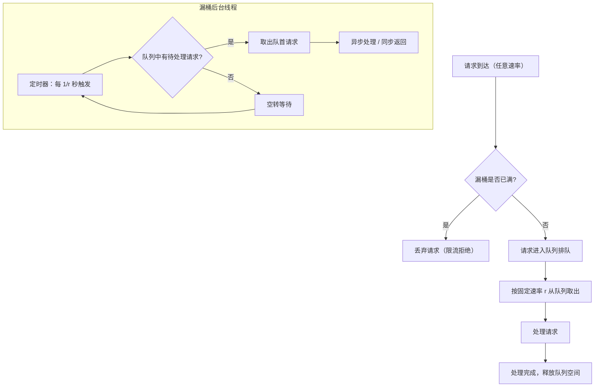

# 漏桶 (Leaky Bucket) 限流算法
> 创建日期：2026-06-08
> 难度：⭐⭐
> 前置知识：限流基本概念、队列、QPS/TPS
> 关联模块：Sentinel 限流、流量整形 (Traffic Shaping)、网络 QoS

## ⭐ 面试重点速览

| 考察点 | 重要程度 | 考察频率 | 掌握目标 |
|--------|---------|---------|---------|
| 漏桶核心原理 | 极高 | 极高 | 能画出漏桶模型图，解释固定速率流出 |
| 与令牌桶的对比 | 极高 | 极高 | 能至少说出3点差异并给出选型建议 |
| 队列实现方式 | 高 | 中 | 能写出基于队列的漏桶代码 |
| 流量整形概念 | 中 | 中 | 能解释漏桶在流量整形中的作用 |
| Sentinel 中的漏桶实现 | 中 | 中 | 能说出 Sentinel 如何用漏桶实现匀速排队 |
| 突发流量处理 | 高 | 中 | 能解释为什么漏桶不支持突发 |

---

## 一、应用场景 🎯

| 场景 | 说明 |
|------|------|
| **流量整形 (Traffic Shaping)** | 将突发流量转换为平滑稳定的输出流，保护下游系统 |
| **Sentinel 匀速排队** | `FlowRule.setControlBehavior(RuleConstant.CONTROL_BEHAVIOR_RATE_LIMITER)` |
| **网络流量控制** | 路由器使用漏桶算法控制数据包发送速率 |
| **消息队列消费限速** | 消费者从 MQ 拉取消息时通过漏桶控制处理速率 |
| **API 网关统一限速** | 对某些下游服务强制平滑输出，避免脉冲式流量 |
| **视频流传输** | 编码器输出码率控制，保证网络传输平稳 |

---

## 二、核心原理 🔬

### 2.1 设计思路

漏桶算法模拟一个底部有孔的水桶：

```
        请求 → 请求 → 请求 → 请求
          │      │      │      │
          ▼      ▼      ▼      ▼
    ┌─────────────────────────────┐
    │                             │
    │        漏  桶 (Bucket)      │  ← 请求以任意速率倒入桶中
    │       （容量 capacity）      │
    │                             │
    └──────────────┬──────────────┘
                   │
                   ▼ 请求以固定速率 r 流出（处理）
              ┌─────────┐
              │ 处理器   │
              └─────────┘
```

**核心逻辑**：
- 请求以**任意速率**进入漏桶（倒水）
- 桶底以**固定速率 r** 漏出（处理请求）
- 如果桶满了（请求堆积超过 capacity），新请求被**直接拒绝**
- 如果桶不满，请求进入队列等待处理

### 2.2 流量整形效果

漏桶的核心价值在于**流量整形（Traffic Shaping）**：

```
输入流量（突发）:   ████████████░░░░░░░░░░░░░░░░░
                     漏桶整形
输出流量（平滑）:   ░░█░█░█░█░█░█░█░█░█░░░░░░░░░

输入流量可能瞬间到达 1000 个请求，但输出始终以固定速率（如 100/s）平滑释放。
```

### 2.3 Mermaid 流程图



### 2.4 漏桶 vs 令牌桶对比

| 对比维度 | 令牌桶 (Token Bucket) | 漏桶 (Leaky Bucket) |
|----------|----------------------|---------------------|
| **核心机制** | 匀速放令牌，请求消费令牌 | 请求进队列，匀速流出 |
| **突发流量** | **支持**：积累的令牌可一次性消耗 | **不支持**：始终以固定速率输出 |
| **输出特征** | 长期平滑，短期允许突发 | 完全平滑，严格恒定速率 |
| **实现方式** | 计数器 + 时间差补偿 | 队列 + 定时器 |
| **资源消耗** | 低（只需计数器） | 较高（需维护队列） |
| **适用场景** | 允许弹性处理短时高峰 | 要求强制整流、保护下游 |
| **典型实现** | Guava RateLimiter (SmoothBursty) | Sentinel (匀速排队模式) |

### 2.5 Sentinel 中的漏桶实现

Sentinel 提供了 `RateLimiterController`，基于漏桶思想实现匀速排队：

```java
// Sentinel RateLimiterController 核心逻辑（简化）
public boolean canPass(Node node, int acquireCount, boolean prioritized) {
    // 计算当前时间应已处理的请求数（理想情况）
    long currentTime = TimeUtil.currentTimeMillis();
    // 计算这段时间内理论上应通过的请求数
    long costTime = Math.round(1.0 * (acquireCount) / count * 1000);
    // 预计本次请求的通过时间
    long expectedTime = costTime + latestPassedTime.get();
    
    if (expectedTime <= currentTime) {
        // 可以立即通过
        latestPassedTime.set(currentTime);
        return true;
    } else {
        // 需要等待：计算等待时间
        long waitTime = costTime + latestPassedTime.get() - currentTime;
        if (waitTime > maxQueueingTimeMs) {
            // 等待超时 → 拒绝
            return false;
        }
        // 排队等待
        latestPassedTime.addAndGet(costTime);
        sleep(waitTime);
        return true;
    }
}
```

**关键点**：
- `latestPassedTime`：上一次请求通过的时间戳，用于计算间隔
- `maxQueueingTimeMs`：最大排队等待时间，超时则拒绝
- 所有请求排队依次通过，严格按固定间隔处理

---

## 三、趣味解说 🎭

> **漏斗——无论倒多快，都从底部匀速流出**

你去加油站给车加油，加油枪不管你怎么按（请求频率多高），油都是以固定速度从油枪流入油箱的。如果你猛按，油不会流得更快——这就是漏桶。

更形象的比喻是一个真正的漏斗：

- 你往漏斗里可以**任意速度倒水**（请求以任意速率到达）
- 水从漏斗底部**细细的水管匀速流出**（固定速率处理）
- 如果你倒得太猛，水在漏斗里积起来了（请求排队）
- 如果漏斗满了还继续倒，水就溢出来了（请求被拒绝）

漏桶的设计哲学是**完全不给突发流量好脸色**。你平时省着点用，它不会给你攒额度；你突然猛灌一波，它也不会加速帮你处理。它的唯一信条就是：**从我这里出去的，永远是这个速度，雷打不动。**

这个特性让它特别适合保护那些**对流量脉冲敏感的下游系统**。比如有些老系统或者第三方 API，突然给它扔 1000 个请求它就崩了，必须一个一个慢慢来。漏桶就是这种场景的守护神。

---

## 四、代码实现 💻

### 4.1 基础漏桶实现 (Java)

```java
import java.util.concurrent.*;
import java.util.concurrent.atomic.AtomicInteger;

/**
 * 漏桶限流器 —— 基于队列 + 定时器的实现
 * 请求以任意速率进入，以固定速率漏出处理
 */
public class LeakyBucket {
    private final int capacity;                // 桶容量（队列最大长度）
    private final long intervalNanos;          // 每个请求的处理间隔（纳秒）
    private final BlockingQueue<Runnable> queue;
    private final ScheduledExecutorService scheduler;
    private final AtomicInteger rejectedCount = new AtomicInteger(0);
    private volatile boolean running = true;

    /**
     * @param capacity  桶容量（最大排队请求数）
     * @param rate      处理速率（每秒处理多少个请求）
     */
    public LeakyBucket(int capacity, double rate) {
        this.capacity = capacity;
        this.intervalNanos = (long) (1_000_000_000L / rate);
        this.queue = new LinkedBlockingQueue<>(capacity);
        this.scheduler = Executors.newSingleThreadScheduledExecutor();
        startDraining();
    }

    /**
     * 启动排水线程：以固定速率从队列取出请求并处理
     */
    private void startDraining() {
        scheduler.scheduleAtFixedRate(() -> {
            try {
                Runnable task = queue.poll(); // 非阻塞取出
                if (task != null) {
                    task.run(); // 执行任务
                }
            } catch (Exception e) {
                // 记录异常，继续处理
            }
        }, 0, intervalNanos, TimeUnit.NANOSECONDS);
    }

    /**
     * 提交请求（非阻塞），桶满则拒绝
     * @return true=入队成功, false=桶满被拒绝
     */
    public boolean submit(Runnable task) {
        boolean offered = queue.offer(task); // 非阻塞入队
        if (!offered) {
            rejectedCount.incrementAndGet();
        }
        return offered;
    }

    /**
     * 提交请求（阻塞），等待直到入队成功或线程中断
     */
    public void submitBlocking(Runnable task) throws InterruptedException {
        queue.put(task); // 阻塞入队
    }

    /** 获取被拒绝的请求总数 */
    public int getRejectedCount() {
        return rejectedCount.get();
    }

    /** 获取当前队列大小 */
    public int getQueueSize() {
        return queue.size();
    }

    /** 关闭漏桶 */
    public void shutdown() {
        running = false;
        scheduler.shutdown();
    }

    // ========== 测试 ==========
    public static void main(String[] args) throws InterruptedException {
        // 容量=5, 处理速率=2个/秒
        LeakyBucket bucket = new LeakyBucket(5, 2.0);

        // 瞬间提交 10 个任务（测试桶满拒绝）
        for (int i = 0; i < 10; i++) {
            final int taskId = i;
            boolean accepted = bucket.submit(() -> {
                System.out.printf("[任务%d] 被处理, 时间=%dms\n",
                    taskId, System.currentTimeMillis() % 100000);
            });
            System.out.printf("提交任务%d: %s\n", taskId,
                accepted ? "入队成功" : "桶满被拒绝");
        }

        // 等待所有任务处理完毕
        Thread.sleep(5000);
        System.out.println("排队中: " + bucket.getQueueSize() +
            ", 拒绝总数: " + bucket.getRejectedCount());
        bucket.shutdown();
    }
}
```

### 4.2 Sentinel 风格漏桶实现（匀速排队）

```java
import java.util.concurrent.TimeUnit;
import java.util.concurrent.atomic.AtomicLong;

/**
 * Sentinel 风格的漏桶实现 —— 匀速排队模式
 * 
 * 核心变量 latestPassedTime：预占式时间戳，记录"下一个请求可被放行的时间点"
 * 通过让每个请求"排队"来保证匀速通过
 */
public class SentinelStyleLeakyBucket {
    private final double count;               // QPS 阈值
    private final long intervalMillis;        // 每个请求的处理间隔（毫秒）
    private final long maxQueueingTimeMs;     // 最大排队等待时间（超时则拒绝）
    private final AtomicLong latestPassedTime = new AtomicLong(-1);

    /**
     * @param count              QPS 阈值
     * @param maxQueueingTimeMs  最大排队等待毫秒数（0 表示不等待，直接拒绝）
     */
    public SentinelStyleLeakyBucket(double count, long maxQueueingTimeMs) {
        this.count = count;
        this.intervalMillis = (long) (1000.0 / count);
        this.maxQueueingTimeMs = maxQueueingTimeMs;
    }

    /**
     * 判断请求是否可以通过
     * @param acquireCount 本次请求消耗的"配额"（通常为1）
     * @return true=通过, false=被限流
     */
    public boolean canPass(int acquireCount) {
        long currentTime = TimeUnit.NANOSECONDS.toMillis(System.nanoTime());

        // 计算本次请求理论上需要的处理时间
        long costTime = Math.round(1.0 * acquireCount / count * 1000);

        // 使用 CAS 抢占时间槽位
        long expectedTime;
        long oldValue;
        do {
            oldValue = latestPassedTime.get();
            // 预计本次请求通过的时间 = 上一个请求的通过时间 + 本次处理耗时
            expectedTime = costTime + Math.max(oldValue, currentTime);
        } while (!latestPassedTime.compareAndSet(oldValue, expectedTime));

        if (expectedTime <= currentTime) {
            // 可以立即通过（队列空闲或计算后发现无需等待）
            return true;
        }

        // 需要等待
        long waitTime = expectedTime - currentTime;
        if (waitTime > maxQueueingTimeMs) {
            // 等待时间超过最大排队时长 → 回滚时间戳并拒绝
            // 注意：简化实现，生产环境需要正确处理回滚
            return false;
        }

        // 排队等待
        try {
            Thread.sleep(waitTime);
        } catch (InterruptedException e) {
            Thread.currentThread().interrupt();
            return false;
        }
        return true;
    }

    // ========== 测试 ==========
    public static void main(String[] args) throws InterruptedException {
        // QPS=2，最大排队500ms
        SentinelStyleLeakyBucket bucket = new SentinelStyleLeakyBucket(2.0, 500);

        long start = System.currentTimeMillis();
        for (int i = 0; i < 10; i++) {
            long now = System.currentTimeMillis();
            boolean passed = bucket.canPass(1);
            System.out.printf("请求%d [%4dms] %s\n",
                i + 1, now - start, passed ? "通过" : "被限流");
            // 模拟请求发送不等待结果
        }
    }
}
```

### 4.3 漏桶 vs 令牌桶对比测试

```java
/**
 * 漏桶 vs 令牌桶 对比演示
 * 模拟相同的突发输入，观察输出行为差异
 */
public class LeakyVsTokenBucketDemo {

    public static void main(String[] args) throws InterruptedException {
        int burstSize = 10;         // 模拟10个请求瞬间到达
        double rate = 2.0;          // 限流速率 2 QPS
        int capacity = 5;           // 桶容量

        System.out.println("===== 漏桶（Leaky Bucket）=====");
        testLeakyBucket(burstSize, rate, capacity);

        System.out.println("\n===== 令牌桶（Token Bucket）=====");
        testTokenBucket(burstSize, rate, capacity);
    }

    private static void testLeakyBucket(int burstSize, double rate, int capacity)
            throws InterruptedException {
        LeakyBucket bucket = new LeakyBucket(capacity, rate);
        long start = System.nanoTime();

        for (int i = 0; i < burstSize; i++) {
            final int idx = i;
            boolean accepted = bucket.submit(() -> {
                double elapsed = (System.nanoTime() - start) / 1_000_000_000.0;
                System.out.printf("  [任务%2d] 处理于 %.3fs\n", idx, elapsed);
            });
            if (!accepted) {
                System.out.printf("  [任务%2d] 被拒绝（桶满）\n", idx);
            }
        }

        Thread.sleep(6000);
        bucket.shutdown();
    }

    private static void testTokenBucket(int burstSize, double rate, int capacity)
            throws InterruptedException {
        TokenBucket bucket = new TokenBucket(capacity, rate);
        long start = System.nanoTime();

        for (int i = 0; i < burstSize; i++) {
            boolean passed = bucket.tryAcquire(1);
            double elapsed = (System.nanoTime() - start) / 1_000_000_000.0;
            if (passed) {
                System.out.printf("  [请求%2d] 通过于 %.3fs\n", i, elapsed);
            } else {
                System.out.printf("  [请求%2d] 被限流于 %.3fs\n", i, elapsed);
            }
        }

        Thread.sleep(5000);
    }
}

/**
 * 输出示例（漏桶）：
 *   [任务 0] 处理于 0.001s
 *   [任务 1] 处理于 0.501s    ← 严格遵守 0.5s 间隔
 *   [任务 2] 处理于 1.001s
 *   ...
 *
 * 输出示例（令牌桶）：
 *   [请求 0] 通过于 0.001s
 *   [请求 1] 通过于 0.001s    ← 连续5个无等待（消耗积累令牌）
 *   [请求 2] 通过于 0.001s
 *   [请求 3] 通过于 0.001s
 *   [请求 4] 通过于 0.001s
 *   [请求 5] 被限流于 0.001s   ← 令牌用完
 */
```

---

## 五、优缺点 ⚖️

### 优点

| 优点 | 说明 |
|------|------|
| **强制平滑输出** | 无论输入流量多猛烈，输出始终是恒定的匀速率，完美保护下游 |
| **简单直观** | 物理模型（漏水桶）与算法逻辑完全对应，便于理解和沟通 |
| **流量整形效果完美** | 将任意形状的输入流量整形为严格匀速的输出流 |
| **适合保护敏感下游** | 对流量脉冲敏感的老系统、第三方 API 等是理想选择 |
| **队列可观测** | 可实时监控队列长度，作为系统压力的指示器 |

### 缺点

| 缺点 | 说明 |
|------|------|
| **不支持突发** | 即使系统有余量，也无法加速处理，可能导致资源利用率不足 |
| **引入延迟** | 请求必须排队，即使当下系统空闲也要等间隔放行 |
| **内存开销** | 需维护阻塞队列，高并发下队列可能积压大量请求 |
| **定时器精度** | 依赖 ScheduledExecutorService 的调度精度，间隙过小时可能不准 |
| **参数敏感** | 容量太大可能导致队列积压大量请求后超时，太小则误杀正常请求 |

---

## 六、面试高频题 📝

**Q1：漏桶和令牌桶的本质区别是什么？**

答：本质区别在于**对流量的态度**——漏桶**不允许突发**，令牌桶**允许突发**。漏桶：无论输入多快，输出始终匀速（严格平滑）；令牌桶：只要桶里有令牌，请求可以不等待直接通过（短期允许突发，长期平滑）。选择漏桶时你关心的是"下游能不能承受脉冲"，选择令牌桶时你关心的是"长期平均速率是否在可控范围内"。

**Q2：漏桶的"漏出速率"怎么确定？**

答：漏出速率 = 下游系统的最大稳定处理能力。需要通过压测确定下游的极限 QPS，然后取一定比例（如 80%）作为漏出速率，留出安全余量。

**Q3：漏桶的桶容量（capacity）设多大合适？**

答：capacity = 漏出速率 * 最大可接受的排队时间。例如 QPS=100，最大排队 2 秒 → capacity=200。如果下游响应很快但要求低延迟，可以把 capacity 设小一些；如果允许一定的排队等待，可以设大一些。

**Q4：Sentinel 的匀速排队模式和漏桶有什么关系？**

答：Sentinel 的 `RuleConstant.CONTROL_BEHAVIOR_RATE_LIMITER` 就是基于漏桶思想实现的。它使用 `latestPassedTime` 记录上一次通过时间，确保请求严格按固定间隔通过。超出 `maxQueueingTimeMs` 的请求会被拒绝。

**Q5：什么场景应该用漏桶而非令牌桶？**

答：1) 下游系统对流量脉冲非常敏感（如老旧计费系统）；2) 需要严格平滑输出的场景（如视频流码率控制）；3) 第三方 API 有严格的调用频率限制且不支持突发；4) 需要将流量整形为绝对恒定速率的场景。

---

## 七、常见误区 ❌

| 误区 | 纠正 |
|------|------|
| "漏桶和令牌桶可以互换使用" | 两者处理突发的策略完全不同。漏桶强制平滑，令牌桶允许突发。选错算法可能导致下游被打垮或资源浪费。 |
| "漏桶一定比令牌桶慢" | 漏桶的请求处理速率和令牌桶一样，都是匀速的。区别在于突发场景：令牌桶可以提前消费积累的额度，漏桶必须排队。稳定流量下两者吞吐量相同。 |
| "漏桶只能用队列实现" | 也可以用时间戳 + 等待时间的方式实现（如 Sentinel 的 CAS 方式），无需真正维护队列数据结构。 |
| "队列满了就应该扩容" | 队列满了说明下游处理能力跟不上，应该增加下游处理能力或降低限流阈值，而不是单纯扩容队列（扩容只会增加延迟）。 |
| "Sentinel 默认就支持漏桶" | Sentinel 默认是**快速失败**模式。需要显式设置 `controlBehavior = RATE_LIMITER` 并配置 `maxQueueingTimeMs` 才能启用匀速排队（漏桶）模式。 |