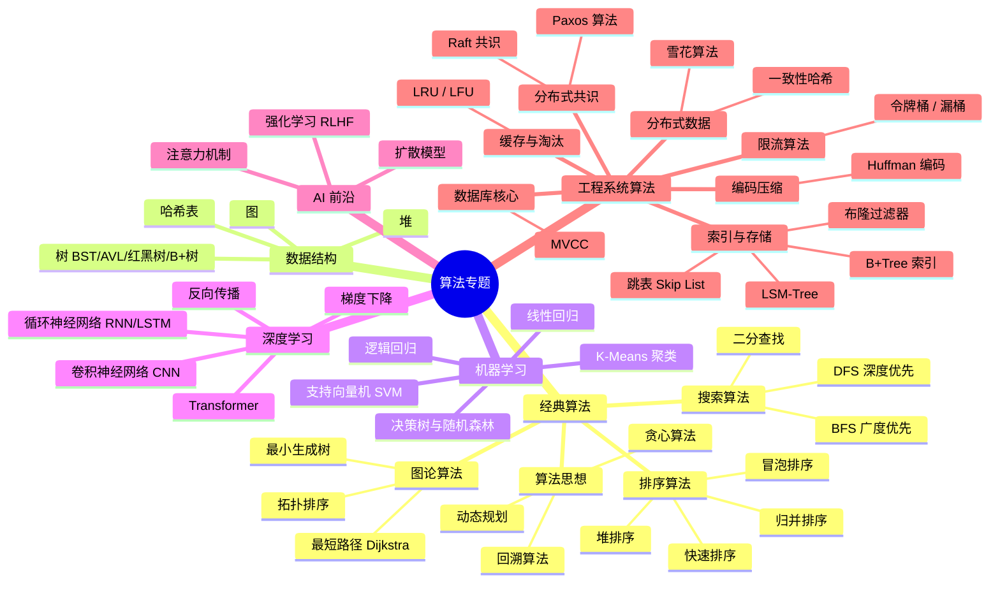
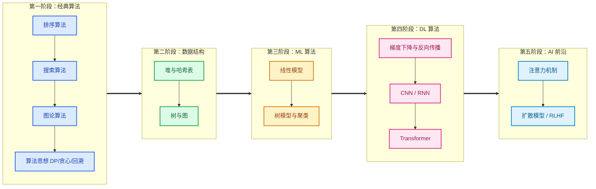

# 算法专题

> **创建日期：** 2026-06-06
> **面向岗位：** 高级工程师 / AI 应用工程师

---

## 模块概述

算法专题是面试 Wiki 的"理论纵深"模块，从**经典算法 → 数据结构 → 机器学习 → 深度学习 → AI 前沿**形成完整知识梯度。每个算法都遵循统一模板：**应用场景 → 核心原理 → 趣味解说 → 优缺点**，让你不仅"会做题"，更能"讲清楚为什么"。

::: tip 与刷题模块的关系
[面试冲刺 → 算法刷题](/interview/algorithm/) 告诉你**怎么刷题**；本模块告诉你**算法为什么这样设计**。两者互补，建议先看专题理解原理，再刷题巩固。
:::

## 知识图谱



## 学习路径



## 核心模块导航

### 🧱 经典算法

| 模块 | 核心内容 | 面试权重 |
|------|----------|----------|
| [排序算法](./classic-algorithms/sorting/) | 冒泡/快排/归并/堆排 — 原理、场景、复杂度对比 | ⭐⭐⭐ |
| [搜索算法](./classic-algorithms/searching/) | 二分查找、BFS、DFS — 应用场景与模板 | ⭐⭐⭐ |
| [图论算法](./classic-algorithms/graph/) | 最短路径、拓扑排序、最小生成树 | ⭐⭐ |
| [动态规划](./classic-algorithms/dynamic-programming/) | DP 四步法、背包问题、LIS/LCS | ⭐⭐⭐ |
| [贪心算法](./classic-algorithms/greedy/) | 贪心选择性质、与 DP 的对比 | ⭐⭐ |
| [回溯算法](./classic-algorithms/backtracking/) | 回溯模板、排列组合、剪枝优化 | ⭐⭐ |

### 🗂️ 数据结构

| 模块 | 核心内容 | 面试权重 |
|------|----------|----------|
| [数据结构全景](./data-structures/) | 所有数据结构复杂度速查 + 场景对比 | ⭐⭐⭐ |
| [堆](./data-structures/heap) | 二叉堆/斐波那契堆 + Top K 问题 | ⭐⭐ |
| [哈希表](./data-structures/hash-table) | 哈希函数、冲突解决、扩容机制 | ⭐⭐⭐ |
| [树](./data-structures/tree) | BST/AVL/红黑树/B+树 对比 | ⭐⭐⭐ |
| [图](./data-structures/graph-structure) | 邻接矩阵/邻接表 + 遍历方式 | ⭐⭐ |

### 🤖 机器学习算法

| 模块 | 核心内容 | 面试权重 |
|------|----------|----------|
| [ML 算法全景](./ml-algorithms/) | 分类/回归/聚类全景 + 算法选型指南 | ⭐⭐ |
| [线性回归](./ml-algorithms/linear-regression) | 最小二乘法、梯度下降求解 | ⭐⭐ |
| [逻辑回归](./ml-algorithms/logistic-regression) | Sigmoid、交叉熵损失、二分类 | ⭐⭐ |
| [决策树](./ml-algorithms/decision-tree) | 信息增益、剪枝、随机森林 | ⭐⭐ |
| [SVM](./ml-algorithms/svm) | 最大间隔、核技巧、软间隔 | ⭐ |
| [K-Means](./ml-algorithms/kmeans) | 聚类迭代、肘部法则、K 值选择 | ⭐ |

### 🧠 深度学习算法

| 模块 | 核心内容 | 面试权重 |
|------|----------|----------|
| [DL 算法全景](./dl-algorithms/) | 神经网络基础、激活函数、损失函数 | ⭐⭐⭐ |
| [梯度下降](./dl-algorithms/gradient-descent) | SGD/Momentum/Adam 优化器对比 | ⭐⭐⭐ |
| [反向传播](./dl-algorithms/backpropagation) | 链式法则、计算图、梯度消失/爆炸 | ⭐⭐⭐ |
| [CNN](./dl-algorithms/cnn) | 卷积/池化/全连接 + 经典架构 | ⭐⭐ |
| [RNN/LSTM](./dl-algorithms/rnn-lstm) | 序列建模、记忆单元、门控机制 | ⭐⭐ |
| [Transformer](./dl-algorithms/transformer) | 自注意力、多头注意力、位置编码 | ⭐⭐⭐ |

### 🚀 AI 前沿算法

| 模块 | 核心内容 | 面试权重 |
|------|----------|----------|
| [前沿算法概览](./ai-frontier/) | AI 前沿算法概览 + 面试趋势 | ⭐⭐ |
| [注意力机制](./ai-frontier/attention-mechanism) | 注意力机制深度拆解（从 Seq2Seq 到 Transformer） | ⭐⭐⭐ |
| [扩散模型](./ai-frontier/diffusion-model) | Stable Diffusion 背后的算法原理 | ⭐ |
| [强化学习](./ai-frontier/reinforcement-learning) | RL 基础 + RLHF 与 LLM 对齐 | ⭐⭐ |

### 🏗️ 工程系统算法

| 模块 | 核心内容 | 面试权重 |
|------|----------|----------|
| [工程算法概览](./engineering-algorithms/) | 工程系统算法全景 + 学习路径 | ⭐⭐⭐ |
| **分布式共识与协调** | | |
| [Raft 共识](./engineering-algorithms/distributed-consensus/raft) | Leader 选举 + 日志复制 + 安全性 | ⭐⭐⭐ |
| [Paxos 算法](./engineering-algorithms/distributed-consensus/paxos) | Basic Paxos 两阶段流程，分布式共识理论基石 | ⭐⭐⭐ |
| [一致性哈希](./engineering-algorithms/distributed-data/consistent-hashing) | 哈希环 + 虚拟节点，动态扩缩容 | ⭐⭐⭐ |
| [雪花算法](./engineering-algorithms/distributed-data/snowflake) | 64 位 ID 结构，时钟回拨处理 | ⭐⭐⭐ |
| [B+Tree 索引](./engineering-algorithms/index-storage/bplus-tree) | 多路平衡搜索树，磁盘 IO 优化 | ⭐⭐⭐ |
| [LSM-Tree](./engineering-algorithms/index-storage/lsm-tree) | 日志结构合并树，写放大 vs 读放大 | ⭐⭐⭐ |
| [跳表](./engineering-algorithms/index-storage/skip-list) | 多层索引链表，概率平衡 | ⭐⭐⭐ |
| [布隆过滤器](./engineering-algorithms/index-storage/bloom-filter) | 位数组 + 多哈希函数，假阳性分析 | ⭐⭐⭐ |
| [MVCC](./engineering-algorithms/database-core/mvcc) | Read View + Undo Log + 版本链 | ⭐⭐⭐ |
| [LRU](./engineering-algorithms/cache-eviction/lru) | 哈希表 + 双向链表 O(1) 实现 | ⭐⭐⭐ |
| [LFU](./engineering-algorithms/cache-eviction/lfu) | 频率计数 + 分层淘汰 | ⭐⭐⭐ |
| [令牌桶](./engineering-algorithms/rate-limit/token-bucket) | 固定速率生成令牌，允许突发 | ⭐⭐⭐ |
| [漏桶](./engineering-algorithms/rate-limit/leaky-bucket) | 固定速率流出，强制平滑 | ⭐⭐⭐ |
| [Huffman 编码](./engineering-algorithms/encoding-compression/huffman) | 贪心构建最优前缀树 | ⭐⭐⭐ |
| *完整列表详见概览页* | 13+ 个次优先级算法 | 详见概览 |

## 页面内容模板

每个算法专题都遵循以下统一模板，确保学习体验一致：

```
🎯 应用场景    → 什么情况下用这个算法？真实世界案例
🔬 核心原理    → 图解 + 分步讲解，由浅入深
🎭 趣味解说    → 生活类比 + 故事化场景，让算法变易懂
💻 代码实现    → 核心代码（Java/Python），关键行注释
⚖️ 优缺点     → 清晰的对比表格
📝 面试高频题  → 关联 LeetCode 高频题
❌ 常见误区    → 面试中容易踩的坑
```

## 面试重点速览

| 算法类别 | 大厂考察频率 | 典型面试题 | 建议掌握程度 |
|----------|-------------|-----------|-------------|
| 排序算法 | 高频 | 手写快排、归并排序复杂度分析 | 能默写 + 讲清原理 |
| 搜索算法 | 高频 | BFS/DFS 模板、二分查找变体 | 秒出模板代码 |
| 动态规划 | 高频 | 背包问题、最长子序列 | 四步法推导 |
| 哈希表 | 高频 | 哈希冲突解决、扩容机制 | 源码级理解 |
| 树结构 | 高频 | BST 验证、红黑树 vs B+树 | 对比选型 |
| 梯度下降 | 中高频 | Adam vs SGD、学习率调优 | 讲清原理 |
| 反向传播 | 中高频 | 链式法则、梯度消失 | 画计算图 |
| Transformer | 中高频 | 自注意力公式、QKV 含义 | 逐层拆解 |
| CNN/RNN | 中频 | 卷积计算、LSTM 门控 | 对比适用场景 |
| ML 基础 | 中低频 | 过拟合解决、偏差方差权衡 | 能举例说明 |

::: danger 面试中容易翻车的点
- 能写出快排代码但说不出**为什么平均 O(n log n)**
- 知道 BFS 用队列但不知道**什么时候用 BFS vs DFS**
- 能背出 Transformer 公式但不理解 **Q、K、V 的物理含义**
- 用过 Adam 优化器但不知道它和 SGD 的**本质区别**
- 能说出红黑树但讲不清**为什么 HashMap 用红黑树而不是 AVL 树**
:::

## 学习建议

### 经典算法阶段（建议 2-3 周）
1. 先看排序算法全景对比，建立复杂度认知
2. 每种排序算法看"趣味解说"建立直觉，再看"核心原理"深入理解
3. BFS/DFS 必须做到能默写模板
4. DP 重点理解"状态定义"和"状态转移"，不要死记硬背

### 数据结构阶段（建议 1-2 周）
1. 先看全景对比表，建立选型直觉
2. 哈希表重点理解"哈希冲突"的工业级解决方案
3. 树的重点是对比不同自平衡树的适用场景

### ML/DL 阶段（建议 2-3 周）
1. 从线性回归到逻辑回归，理解"模型"的本质
2. 梯度下降和反向传播是 DL 的两大基石，必须吃透
3. Transformer 是 AI 应用工程师面试的必考题

### AI 前沿阶段（建议 1 周）
1. 注意力机制是理解所有大模型的基础
2. 扩散模型和 RLHF 了解原理即可，面试中能说出核心思想就是加分项

::: details 推荐资源
- **经典算法**：《算法导论》、《算法（第4版）》
- **数据结构**：《数据结构与算法分析——Java语言描述》
- **ML/DL**：吴恩达《机器学习》+《深度学习》课程、李沐《动手学深度学习》
- **Transformer**：The Illustrated Transformer、Attention Is All You Need 论文
- **可视化**：VisuAlgo（算法可视化）、TensorFlow Playground（神经网络可视化）
:::