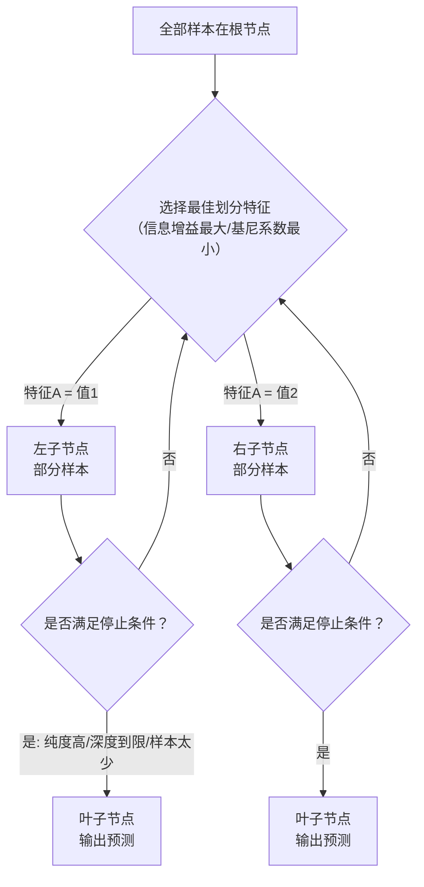
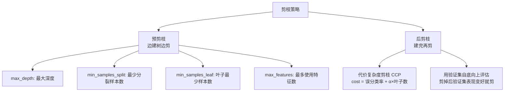
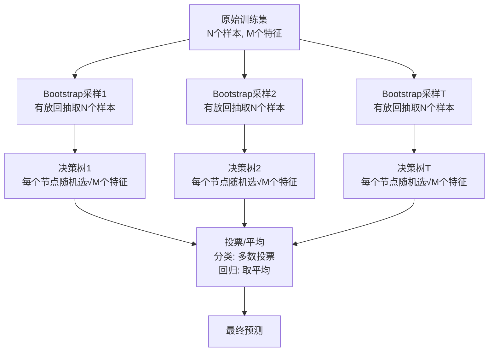
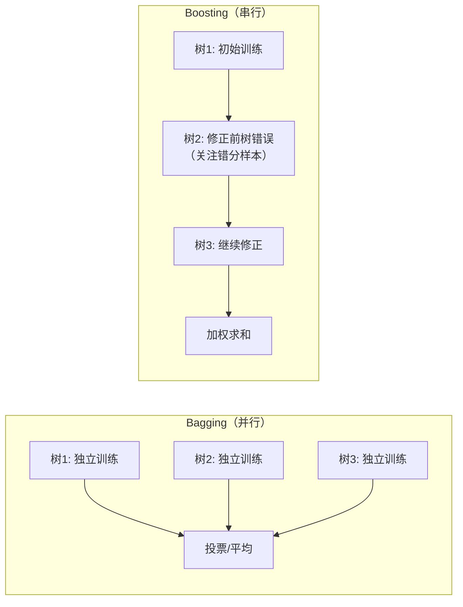

# 决策树与随机森林
> 创建日期：2026-06-06
> 难度：⭐⭐
> 前置知识：信息论基础（熵的概念）、概率、集成学习思想

## ⭐ 面试重点速览

- 能手推信息熵、信息增益、基尼系数的计算公式
- 理解 ID3 / C4.5 / CART 三种决策树算法的区别
- 掌握预剪枝和后剪枝的策略
- 理解随机森林的两个"随机"：样本随机（Bootstrap）和特征随机
- 能解释 Bagging 和 Boosting 的核心区别
- 了解 XGBoost 为什么比 GBDT 快（二阶泰勒展开、并行化、正则化）

---

## 一、应用场景 🎯

| 场景 | 具体案例 | 为什么用树模型 |
|------|---------|----------------|
| **风控审批** | 信用卡审批决策 | 需要解释为什么拒绝（"收入不足 + 负债过高"） |
| **医疗诊断** | 根据症状推断疾病 | 决策流程与医生诊断逻辑一致 |
| **用户分群** | 根据行为特征区分高价值用户 | 树结构天然适合做规则引擎 |
| **推荐排序** | 电商搜索排序 | GBDT/XGBoost 是排序任务的主力模型 |
| **异常检测** | 孤立森林检测异常交易 | 树模型对异常值天然敏感 |
| **Kaggle竞赛** | 表格数据分类/回归 | XGBoost、LightGBM、CatBoost 统治表格数据竞赛 |

**核心优势**：树模型在表格数据上几乎无敌，尤其当你不确定特征间关系时。

---

## 二、核心原理 🔬

### 2.1 决策树的工作流程



### 2.2 三种划分标准

#### 信息熵（Entropy）—— 衡量"不纯度"

$$ H(D) = -\sum_{k=1}^{K} p_k \log_2 p_k $$

- 当所有样本属于同一类：H = 0（最纯）
- 当各类均匀分布：H = log₂(K)（最不纯）

#### 信息增益（Information Gain）—— ID3 使用

$$ IG(D, A) = H(D) - \sum_{v} \frac{|D_v|}{|D|} H(D_v) $$

- 划分前后的熵减量，越大越好
- **缺点**：偏向取值多的特征（如"ID号"每个值只有一个样本，信息增益最大但毫无意义）

#### 信息增益率（Gain Ratio）—— C4.5 使用

$$ GR(D, A) = \frac{IG(D, A)}{H_A(D)} $$

其中 H_A(D) 是特征 A 的"固有值"（split information），取值越多惩罚越大，解决 ID3 的偏向问题。

#### 基尼系数（Gini Index）—— CART 使用

$$ Gini(D) = 1 - \sum_{k=1}^{K} p_k^2 = \sum_{k \neq k'} p_k p_{k'} $$

- 从数据集中随机抽两个样本，它们类别不一致的概率
- 基尼系数越小，纯度越高
- CART 默认使用基尼系数，因为它计算更快（没有对数运算）

### 2.3 三种决策树算法对比

| 算法 | 提出者 | 划分标准 | 树结构 | 支持任务 | 特点 |
|------|--------|---------|--------|---------|------|
| **ID3** | Quinlan 1986 | 信息增益 | 多叉树 | 分类 | 偏好多值特征，不能处理连续值 |
| **C4.5** | Quinlan 1993 | 信息增益率 | 多叉树 | 分类 | 改进ID3，支持连续值和缺失值 |
| **CART** | Breiman 1984 | 基尼系数（分类）/ MSE（回归） | 二叉树 | 分类+回归 | sklearn默认，结构简单 |

### 2.4 剪枝策略



### 2.5 随机森林 = Bagging + 随机特征



**两个"随机"保证了森林的多样性**：
1. **样本随机**：每棵树用 Bootstrap 采样（约63.2%的样本，剩下的36.8%是OOB）
2. **特征随机**：每个节点分裂时只考虑随机选取的 √M 个特征

### 2.6 Bagging vs Boosting



| 对比维度 | Bagging（随机森林） | Boosting（GBDT/XGBoost） |
|---------|-------------------|------------------------|
| **训练方式** | 并行，各树独立 | 串行，后树依赖前树 |
| **关注点** | 降低方差（防止过拟合） | 降低偏差（提高拟合能力） |
| **基学习器** | 强学习器（深度树） | 弱学习器（浅层树） |
| **样本权重** | 等权重 | 错误样本权重增大 |
| **典型代表** | 随机森林 | AdaBoost, GBDT, XGBoost |
| **过拟合风险** | 低 | 中（需要早停和正则化） |

---

## 三、趣味解说 🎭

### 20个问题猜动物

你和朋友玩"20个问题猜动物"游戏：

- 你心里想一个动物，朋友只能问"是/否"问题
- 朋友问："是哺乳动物吗？" → 排除一半动物
- 朋友问："会飞吗？" → 再排除一半
- 朋友问："有羽毛吗？" → 越来越接近答案

**这就是决策树！** 每个问题都是一个"特征分裂节点"，问问题的顺序就是"特征选择"（信息增益最大化）。

好的决策树问**最能区分**的问题：
- "是哺乳动物吗？"（好问题，能排除一半） 
- "是穿山甲吗？"（坏问题，只能排除一种）

**随机森林**就是：找 100 个朋友，每人用不同的动物知识库（Bootstrap），每人只允许问随机挑选的几种问题类型（随机特征），最后投票决定答案。

**XGBoost** 就是：第一个朋友猜错了，第二个朋友专门去研究第一个朋友猜错的那些动物，然后第三个朋友再研究前两个都猜错的……每个朋友都专门纠正前人的错误。

---

## 四、代码实现 💻

### 4.1 从零手写决策树节点

```python
import numpy as np
from collections import Counter

class DecisionTreeNode:
    """决策树节点"""
    def __init__(self, feature=None, threshold=None, left=None, 
                 right=None, value=None):
        self.feature = feature      # 分裂特征索引
        self.threshold = threshold  # 分裂阈值
        self.left = left            # 左子树
        self.right = right          # 右子树
        self.value = value          # 叶子节点的预测值

class DecisionTreeScratch:
    """手写CART决策树（分类）"""
    
    def __init__(self, max_depth=10, min_samples_split=2):
        self.max_depth = max_depth
        self.min_samples_split = min_samples_split
        self.root = None
    
    def _gini(self, y):
        """计算基尼系数"""
        # 统计每个类别的比例
        counts = Counter(y)
        probs = [count / len(y) for count in counts.values()]
        return 1 - sum(p ** 2 for p in probs)
    
    def _best_split(self, X, y):
        """遍历所有特征和阈值，找最佳分裂点"""
        best_gain = -1
        best_feature, best_threshold = None, None
        parent_gini = self._gini(y)
        n_samples = len(y)
        
        for feature in range(X.shape[1]):
            # 候选阈值：该特征所有唯一值的相邻中点
            thresholds = np.unique(X[:, feature])
            for threshold in thresholds:
                left_mask = X[:, feature] <= threshold
                right_mask = ~left_mask
                
                if left_mask.sum() == 0 or right_mask.sum() == 0:
                    continue  # 无效分裂，跳过
                
                # 加权基尼系数
                gini_left = self._gini(y[left_mask])
                gini_right = self._gini(y[right_mask])
                weighted_gini = (left_mask.sum() / n_samples) * gini_left + \
                               (right_mask.sum() / n_samples) * gini_right
                
                # 信息增益 = 父节点基尼 - 加权子节点基尼
                gain = parent_gini - weighted_gini
                
                if gain > best_gain:
                    best_gain = gain
                    best_feature = feature
                    best_threshold = threshold
        
        return best_feature, best_threshold, best_gain
    
    def _build_tree(self, X, y, depth):
        """递归构建决策树"""
        n_samples = len(y)
        
        # 停止条件
        if (depth >= self.max_depth or 
            n_samples < self.min_samples_split or 
            len(np.unique(y)) == 1):  # 纯节点
            # 返回叶子节点，值为多数类
            return DecisionTreeNode(value=Counter(y).most_common(1)[0][0])
        
        # 找最佳分裂点
        feature, threshold, gain = self._best_split(X, y)
        
        if gain <= 0:  # 无法再提升
            return DecisionTreeNode(value=Counter(y).most_common(1)[0][0])
        
        # 分裂数据
        left_mask = X[:, feature] <= threshold
        right_mask = ~left_mask
        
        # 递归构建子树
        left_child = self._build_tree(X[left_mask], y[left_mask], depth + 1)
        right_child = self._build_tree(X[right_mask], y[right_mask], depth + 1)
        
        return DecisionTreeNode(feature, threshold, left_child, right_child)
    
    def fit(self, X, y):
        self.root = self._build_tree(X, y, depth=0)
    
    def _predict_one(self, x, node):
        """递归预测单个样本"""
        if node.value is not None:
            return node.value
        if x[node.feature] <= node.threshold:
            return self._predict_one(x, node.left)
        else:
            return self._predict_one(x, node.right)
    
    def predict(self, X):
        return np.array([self._predict_one(x, self.root) for x in X])
```

### 4.2 sklearn 决策树

```python
from sklearn.tree import DecisionTreeClassifier, plot_tree
import matplotlib.pyplot as plt

# === 决策树 ===
dt = DecisionTreeClassifier(
    max_depth=5,              # 最大深度（预剪枝）
    min_samples_split=10,     # 节点最少样本数才分裂
    min_samples_leaf=5,       # 叶子最少样本数
    criterion='gini',         # 'gini' 或 'entropy'
    random_state=42
)
dt.fit(X_train, y_train)

# 特征重要性
for name, imp in zip(feature_names, dt.feature_importances_):
    print(f"{name}: {imp:.4f}")

# 可视化决策树（需要 graphviz）
# plot_tree(dt, feature_names=feature_names, filled=True)
# plt.show()
```

### 4.3 sklearn 随机森林

```python
from sklearn.ensemble import RandomForestClassifier
from sklearn.model_selection import GridSearchCV

# === 随机森林 ===
rf = RandomForestClassifier(
    n_estimators=100,          # 树的数量
    max_depth=10,              # 每棵树的最大深度
    max_features='sqrt',       # 每次分裂考虑的特征数（√M）
    bootstrap=True,            # 是否用Bootstrap采样
    oob_score=True,            # 计算袋外分数（免费验证集）
    n_jobs=-1,                 # 并行训练
    random_state=42
)
rf.fit(X_train, y_train)
print(f"OOB Score: {rf.oob_score_:.4f}")  # 袋外分数

# === 超参数网格搜索 ===
param_grid = {
    'n_estimators': [50, 100, 200],
    'max_depth': [5, 10, 15, None],
    'min_samples_split': [2, 5, 10],
    'max_features': ['sqrt', 'log2']
}
grid = GridSearchCV(
    RandomForestClassifier(random_state=42),
    param_grid, cv=5, scoring='accuracy', n_jobs=-1
)
grid.fit(X_train, y_train)
print(f"最佳参数: {grid.best_params_}")
print(f"最佳CV分数: {grid.best_score_:.4f}")
```

### 4.4 XGBoost 快速上手

```python
# pip install xgboost
import xgboost as xgb

# === XGBoost 分类 ===
model = xgb.XGBClassifier(
    n_estimators=100,        # 树的数量
    max_depth=6,             # 每棵树深度
    learning_rate=0.1,       # 学习率（收缩步长）
    subsample=0.8,           # 行采样比例
    colsample_bytree=0.8,    # 列采样比例
    reg_alpha=0.1,           # L1正则化
    reg_lambda=1.0,          # L2正则化
    early_stopping_rounds=10, # 早停
    eval_metric='logloss',
    random_state=42
)
model.fit(
    X_train, y_train,
    eval_set=[(X_test, y_test)],  # 验证集
    verbose=False
)

# XGBoost 特征重要性
importance = model.feature_importances_
for i, imp in sorted(enumerate(importance), key=lambda x: -x[1]):
    print(f"特征 {i}: {imp:.4f}")
```

---

## 五、优缺点 ⚖️

### 决策树

| 优点 | 缺点 |
|------|------|
| 完全可解释，决策路径可视化 | 极容易过拟合（一棵树跑到叶子可能只有1个样本） |
| 无需特征缩放（不需要标准化） | 对数据微小变化敏感（不稳定） |
| 自动处理缺失值 | 倾向于选择取值多的特征（ID3） |
| 天然支持特征选择 | 贪心算法，不保证全局最优 |
| 可处理数值和类别特征 | 难以学习 XOR 等复杂关系 |

### 随机森林

| 优点 | 缺点 |
|------|------|
| 抗过拟合能力强（投票机制平滑方差） | 模型不可解释（黑盒） |
| 超参数少，默认值通常表现不错 | 树太多时训练和推理都慢 |
| OOB 免费提供验证评估 | 对高维稀疏数据（如文本）不如线性模型 |
| 可并行训练 | 在噪声极大的数据上可能过拟合 |
| 给出特征重要性排序 | 无法外推（对训练集范围外的值预测不准） |

### XGBoost vs 随机森林 vs 逻辑回归

| 维度 | 逻辑回归 | 随机森林 | XGBoost |
|------|---------|---------|---------|
| **可解释性** | 极好 | 差 | 差 |
| **预测性能** | 中 | 良 | 优 |
| **训练速度** | 极快 | 快（可并行） | 中（串行） |
| **调参难度** | 低 | 低 | 高 |
| **适用场景** | Baseline、需可解释性 | 通用表格数据 | 竞赛、追求极致性能 |

---

## 六、面试高频题 📝

**Q1: 决策树怎么处理连续值和缺失值？**
> - **连续值**：C4.5 将连续值离散化（排序后取相邻中点作为候选分裂点），CART 同理
> - **缺失值**：C4.5 在计算信息增益时用无缺失样本；分裂时，缺失样本按比例分配到各子节点。XGBoost 自动学习缺失值的最优分裂方向

**Q2: 随机森林为什么能防止过拟合？**
> 1. **Bootstrap抽样**：每棵树看到的样本不同，不同的树过拟合不同的噪声，但投票时噪声互相抵消
> 2. **随机特征**：每棵树只能看到部分特征，防止所有树都学到同一个噪声模式
> 3. 本质是**降低方差**：多个高方差模型平均后，方差大幅降低

**Q3: GBDT 和 XGBoost 的主要区别？**
> | 对比 | GBDT | XGBoost |
> |------|------|---------|
> | 优化目标 | 一阶导数（负梯度） | 二阶泰勒展开 |
> | 正则化 | 无 | L1/L2正则化 |
> | 并行化 | 不支持 | 特征粒度并行 |
> | 缺失值 | 需手动处理 | 自动学习 |
> | 列采样 | 无 | 支持（类似随机森林） |

**Q4: 为什么树模型不需要标准化？**
> 决策树的分裂只关心特征的**相对顺序**（大于/小于阈值），不关心具体数值大小。标准化是线性变换，不改变特征的相对顺序，因此对树模型没有影响。

**Q5: 随机森林中为什么要做特征随机？**
> 如果没有特征随机，所有树都会在根节点选择同一个最强特征，导致所有树高度相似，失去了"多样性"，Bootstrap 带来的方差降低效果大打折扣。

**Q6: 树的深度和数量如何影响模型？**
> - **深度增加**：模型复杂度增加，偏差降低，方差增加，过拟合风险增大
> - **数量增加**：随机森林的方差降低（更好），但训练时间线性增长。通常100-500棵树后收益递减

---

## 七、常见误区 ❌

| 误区 | 正确理解 |
|------|---------|
| "决策树很简单，不需要调参" | 不设 max_depth 的决策树几乎必然过拟合，必须剪枝 |
| "随机森林中树越多越好" | 收益递减，通常100-500棵就差不多了，再增加训练成本高但收益微 |
| "XGBoost 一定比随机森林好" | 在噪声大、小样本数据上，随机森林的 Bagging 机制可能更鲁棒 |
| "特征重要性高的特征就是好特征" | 树模型偏好高基数特征，重要性可能被误导。建议用 SHAP 值替代 |
| "树模型不需要特征工程" | 虽然树模型能自动发现交互，但领域知识构造的特征（如比率、差值）仍然有价值 |
| "信息增益和基尼系数差别很大" | 实践中二者差异极小，大部分情况下选择哪个对结果影响不大 |
| "OOB Score 可以替代交叉验证" | OOB 是免费的，但不如 K-Fold CV 严格。正式评估仍建议用 CV |