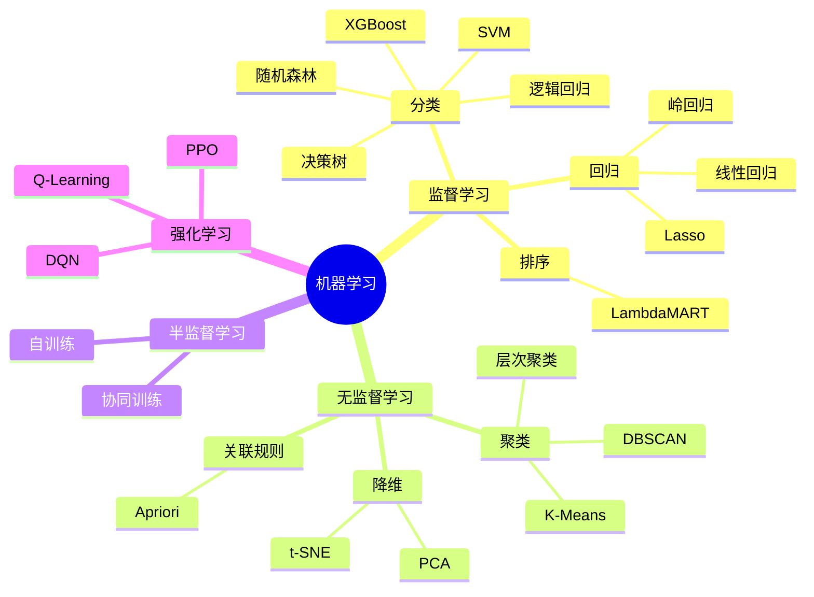
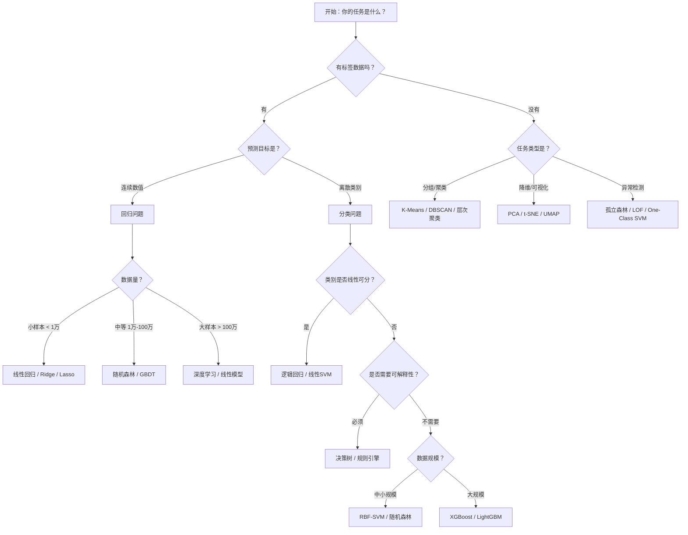

# 机器学习算法全景
> 创建日期：2026-06-06
> 难度：⭐⭐
> 前置知识：Python基础、线性代数入门、概率统计基础

## ⭐ 面试重点速览

- 能清晰区分监督学习、无监督学习、半监督学习、强化学习四大范式
- 能根据业务场景快速选择合适的算法（分类 vs 回归 vs 聚类 vs 降维）
- 理解偏差-方差权衡，并能解释过拟合与欠拟合的本质
- 掌握各类算法的核心思想，能口头推导关键公式（如梯度下降、信息增益）
- 了解 sklearn 中常用 API 的调用模式（fit / predict / transform）

---

## 一、应用场景 🎯

### 1.1 机器学习在AI应用工程师日常工作中的位置

| 领域 | 典型场景 | 常用算法 |
|------|---------|---------|
| **推荐系统** | 用户兴趣预测、物品相似度计算、点击率预估 | 逻辑回归、协同过滤、GBDT |
| **NLP应用** | 文本分类、情感分析、命名实体识别 | 逻辑回归、SVM、CRF |
| **计算机视觉** | 图像分类、目标检测、图像分割 | CNN系列（深度学习为主） |
| **风控系统** | 信用评分、欺诈检测、异常交易识别 | 决策树、XGBoost、孤立森林 |
| **用户增长** | 用户分群、流失预测、LTV预估 | K-Means、逻辑回归、随机森林 |
| **搜索排序** | 相关性排序、Query理解 | LambdaMART、逻辑回归 |

### 1.2 为什么AI应用工程师需要懂传统ML？

- **深度学习不是万能药**：在表格数据、小样本场景，XGBoost/随机森林往往优于神经网络
- **可解释性要求**：金融、医疗等领域，需要能解释模型为什么做出某个决策
- **Baseline建立**：任何项目都先用简单模型跑通全流程，再逐步优化
- **特征工程依赖**：理解算法原理才能做出更好的特征

---

## 二、核心原理 🔬

### 2.1 机器学习四大范式



### 2.2 分类/回归/聚类/降维对比总表

| 维度 | 分类 | 回归 | 聚类 | 降维 |
|------|------|------|------|------|
| **学习方式** | 监督学习 | 监督学习 | 无监督学习 | 无监督学习 |
| **输出类型** | 离散类别 | 连续数值 | 簇标签 | 低维向量 |
| **典型问题** | 这是垃圾邮件吗？ | 房价是多少？ | 用户有哪些群体？ | 如何可视化高维数据？ |
| **评估指标** | 准确率、精确率、召回率、F1、AUC | MSE、MAE、RMSE、R² | 轮廓系数、Davies-Bouldin指数 | 可解释方差比 |
| **典型算法** | 逻辑回归、SVM、随机森林 | 线性回归、Ridge、Lasso | K-Means、DBSCAN | PCA、t-SNE |
| **sklearn模块** | `sklearn.linear_model.LogisticRegression` | `sklearn.linear_model.LinearRegression` | `sklearn.cluster.KMeans` | `sklearn.decomposition.PCA` |

### 2.3 算法选型决策树



### 2.4 监督学习 vs 无监督学习深度对比

| 对比维度 | 监督学习 | 无监督学习 |
|---------|---------|-----------|
| **数据要求** | 需要标注 (X, y) | 只需特征 X |
| **学习目标** | 学习 X → y 的映射 | 发现 X 的内在结构 |
| **标注成本** | 高（人工标注昂贵） | 低（无需标注） |
| **可评估性** | 明确（有真实标签对比） | 模糊（靠业务解释） |
| **典型应用** | 分类、回归、排序 | 聚类、降维、密度估计 |
| **核心挑战** | 过拟合、标注噪声 | 如何定义"好的结构" |
| **数学本质** | 条件概率 P(y\|X) | 联合概率 P(X) 或聚类结构 |

### 2.5 偏差-方差权衡（Bias-Variance Tradeoff）

这是理解所有 ML 算法的元理论：

```
总误差 = 偏差² + 方差 + 不可约误差

偏差(Bias)：模型预测的期望与真实值的偏离程度 → "瞄准是否歪了"
方差(Variance)：模型在不同训练集上的预测波动程度 → "手是否抖"

简单模型（如线性回归）：低方差、高偏差 → 容易欠拟合
复杂模型（如深度决策树）：低偏差、高方差 → 容易过拟合
```


---

## 三、趣味解说 🎭

### 用做菜来理解机器学习

想象你是一个厨师学徒，师傅让你学做"完美蛋炒饭"：

- **监督学习（回归）**：师傅给了你100份蛋炒饭的配方（特征：火候时间、油量、盐量……）和对应的评分（标签：1-10分）。你的任务是找出配方和评分之间的关系，以后看到新配方就能预测评分。——这就是**线性回归**。

- **监督学习（分类）**：师傅把100份蛋炒饭分成两堆："好吃"和"不好吃"。你的任务是找到一条边界，以后看到一份新蛋炒饭，能判断它属于哪边。——这就是**逻辑回归/SVM**。

- **无监督学习（聚类）**：师傅把100份蛋炒饭的配方表给你，但没告诉你评分。你说："我发现这些配方天然地分成三个流派——清淡派、重油派、酱油派。"——这就是**K-Means**。

- **强化学习**：师傅不给你配方，只在你做完后端上来尝一口，然后说"咸了""糊了"或"不错"。你一次次尝试，从反馈中学习。——这就是**Q-Learning**。

---

## 四、代码实现 💻

### sklearn 统一API模式

```python
# === sklearn 三部曲：选模型 → 拟合 → 预测 ===
from sklearn.linear_model import LogisticRegression
from sklearn.model_selection import train_test_split
from sklearn.metrics import accuracy_score, classification_report

# 1. 划分数据集
X_train, X_test, y_train, y_test = train_test_split(
    X, y, test_size=0.2, random_state=42
)

# 2. 选模型 + 拟合
model = LogisticRegression(max_iter=1000)
model.fit(X_train, y_train)

# 3. 预测 + 评估
y_pred = model.predict(X_test)
print(f"准确率: {accuracy_score(y_test, y_pred):.4f}")
print(classification_report(y_test, y_pred))
```

### 各算法的sklearn调用速查

```python
# === 回归 ===
from sklearn.linear_model import LinearRegression, Ridge, Lasso
lr = LinearRegression()
ridge = Ridge(alpha=1.0)      # L2正则化
lasso = Lasso(alpha=0.1)      # L1正则化

# === 分类 ===
from sklearn.linear_model import LogisticRegression
from sklearn.svm import SVC
from sklearn.tree import DecisionTreeClassifier
from sklearn.ensemble import RandomForestClassifier

logreg = LogisticRegression(C=1.0)  # C越大，正则化越弱
svm = SVC(kernel='rbf', C=1.0, gamma='scale')
dt = DecisionTreeClassifier(max_depth=5)
rf = RandomForestClassifier(n_estimators=100, max_depth=5)

# === 聚类 ===
from sklearn.cluster import KMeans, DBSCAN
km = KMeans(n_clusters=3, init='k-means++', random_state=42)
dbscan = DBSCAN(eps=0.5, min_samples=5)

# === 降维 ===
from sklearn.decomposition import PCA
pca = PCA(n_components=2)
```

### 一个完整的ML Pipeline示例

```python
from sklearn.pipeline import Pipeline
from sklearn.preprocessing import StandardScaler
from sklearn.ensemble import RandomForestClassifier
from sklearn.model_selection import cross_val_score

# 构建流水线：标准化 → 分类器
pipeline = Pipeline([
    ('scaler', StandardScaler()),        # 第1步：特征标准化
    ('classifier', RandomForestClassifier(n_estimators=100))  # 第2步：分类器
])

# 5折交叉验证
scores = cross_val_score(pipeline, X, y, cv=5, scoring='accuracy')
print(f"5折交叉验证平均准确率: {scores.mean():.4f} (+/- {scores.std() * 2:.4f})")
```

---

## 五、优缺点 ⚖️

### 各类算法优缺点速查

| 算法 | 优点 | 缺点 | 最佳场景 |
|------|------|------|---------|
| **线性回归** | 可解释性强、训练极快、无需调参 | 只能拟合线性关系、对异常值敏感 | 房价预测等可解释性优先的回归任务 |
| **逻辑回归** | 输出概率、可解释性好、训练快 | 只能处理线性决策边界 | 二分类Baseline、风控评分卡 |
| **决策树** | 完全可解释、无需特征缩放、自动特征选择 | 容易过拟合、不稳定 | 需要解释决策理由的场景 |
| **随机森林** | 抗过拟合、无需太多调参、鲁棒 | 不可解释、较大时训练慢 | 表格数据的通用Baseline |
| **SVM** | 在小样本高维数据上表现好、核技巧强大 | 大数据集慢、难以调参 | 文本分类、图像分类 |
| **K-Means** | 简单快速、易于理解 | 需预设K、对初始值敏感、只能球形簇 | 用户分群、图像压缩 |
| **XGBoost** | 效果极好、支持缺失值、特征重要性 | 参数多、调参耗时 | Kaggle竞赛、工业表格数据 |
| **神经网络** | 端到端学习、表示能力强 | 黑盒、数据需求大、训练慢 | 图像/NLP/语音等非结构化数据 |

---

## 六、面试高频题 📝

### 基础概念题

**Q1: 什么是过拟合？如何解决？**
> 过拟合是指模型在训练集上表现很好但在测试集上表现差。解决方案：
> - 增加训练数据
> - 正则化（L1/L2）
> - 早停（Early Stopping）
> - Dropout（神经网络）
> - 简化模型结构
> - 数据增强
> - 交叉验证

**Q2: L1和L2正则化有什么区别？**
> - L1（Lasso）：权重的绝对值之和，倾向于产生稀疏解，可用于特征选择
> - L2（Ridge）：权重的平方和，倾向于产生小而分散的权重，防止过拟合
> - ElasticNet：L1 + L2的组合

**Q3: 偏差和方差的区别与联系？**
> - 偏差：模型预测期望与真实值之间的差距，反映模型的拟合能力
> - 方差：模型在不同训练集上的输出波动程度，反映模型的稳定性
> - 联系：二者之间存在权衡，通常不能同时降低

### 实战场景题

**Q4: 给你一个用户流失预测任务，你会怎么做？**
> 1. 明确问题定义：定义"流失"（如30天未登录）
> 2. 数据收集：用户行为日志、消费记录、人口属性
> 3. 特征工程：RFM特征、行为序列特征、时间窗口统计
> 4. Baseline：先用逻辑回归跑通全流程
> 5. 进阶模型：XGBoost / LightGBM
> 6. 评估：重点看召回率（找到更多可能流失的用户）
> 7. 上线：模型部署 + AB测试验证

**Q5: 样本不平衡怎么办？**
> - 重采样：过采样（SMOTE）、欠采样
> - 算法层面：class_weight参数、使用AUC/PR曲线而非准确率
> - 评估层面：关注精确率-召回率，而非单纯的准确率
> - 数据增强：合成少数类样本
> - 改用对不平衡不敏感的算法（如树模型）

**Q6: 特征工程中有哪些常用技巧？**
> - 数值特征：分箱/分桶、对数变换、归一化、标准化
> - 类别特征：One-Hot编码、Label Encoding、Target Encoding
> - 时间特征：提取年月日时分、周期编码（sin/cos）、时间差
> - 文本特征：TF-IDF、词嵌入、BERT嵌入
> - 交叉特征：多项式特征、特征组合、除法/减法特征
> - 缺失值处理：删除、填充（均值/中位数/众数/模型预测）

---

## 七、常见误区 ❌

| 误区 | 正确理解 |
|------|---------|
| "深度学习一定比传统ML好" | 在表格数据上，XGBoost/CatBoost 常常优于神经网络。选择模型应从数据出发 |
| "准确率越高模型就越好" | 在不平衡数据中，准确率是误导指标。应看精确率、召回率、F1、AUC |
| "特征越多越好" | 冗余特征会增加噪声、降低训练速度、导致过拟合。特征选择是必需的 |
| "训练集和测试集随便分就行" | 必须有 stratify（分层采样）保持类别比例，时序数据要按时间切分 |
| "直接上复杂模型" | 应该先从简单Baseline开始，逐步加复杂度，并持续验证每一层是否带来提升 |
| "交叉验证就是随便分K份" | 时序数据要用TimeSeriesSplit，分组数据要用GroupKFold，否则会数据泄露 |
| "标准化/归一化可有可无" | 对基于距离的算法（SVM、K-Means、KNN、逻辑回归）至关重要 |
| "调参就是暴力网格搜索" | 先用学习曲线确定大致范围，再用贝叶斯优化或随机搜索，最后用网格搜索精调 |
| "ML模型部署就是导出.pkl文件" | 真正的部署要考虑延迟、吞吐、版本管理、AB测试、监控、回滚 |

---

## 📚 延伸阅读

- [线性回归](./linear-regression.md) —— 回归的基石，理解线性模型的最佳入口
- [逻辑回归](./logistic-regression.md) —— 虽然叫"回归"，却是最重要的分类算法之一
- [决策树与随机森林](./decision-tree.md) —— 从一棵树到一片森林
- [支持向量机SVM](./svm.md) —— 优雅的数学与强大的核技巧
- [K-Means聚类](./kmeans.md) —— 最简单也最实用的聚类算法