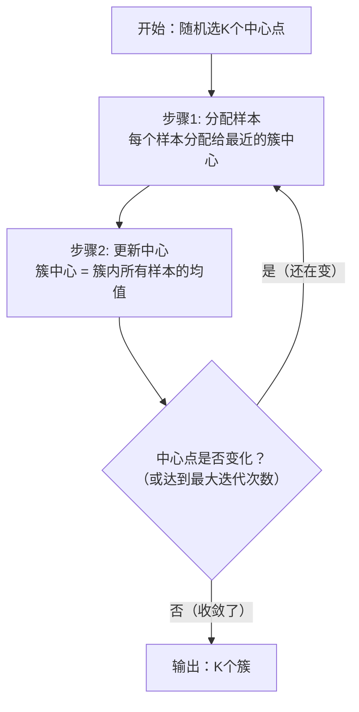
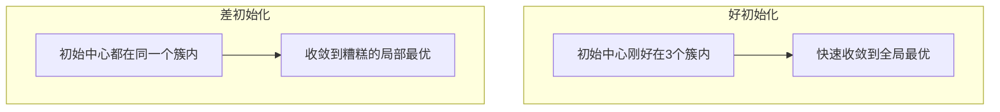
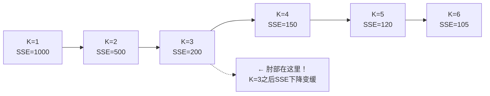
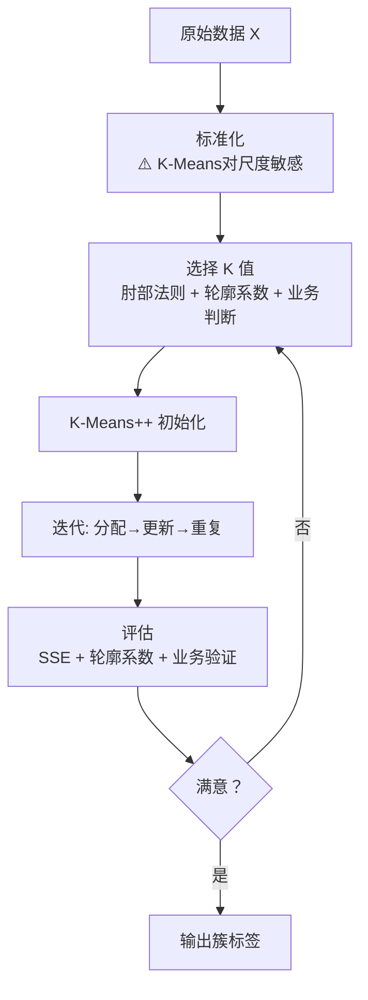

# K-Means 聚类
> 创建日期：2026-06-06
> 难度：⭐
> 前置知识：欧氏距离、均值、迭代优化思想

## ⭐ 面试重点速览

- 能手绘 K-Means 的两步迭代过程：分配样本 → 更新中心
- 理解 K-Means 的损失函数是 SSE（簇内平方误差和）
- 掌握肘部法则（Elbow Method）选择 K 值
- 知道 K-Means++ 如何改善初始化问题
- 能对比 K-Means 与 DBSCAN / 层次聚类的适用场景
- 知道 K-Means 对异常值、初始中心点、特征尺度敏感

---

## 一、应用场景 🎯

| 场景 | 具体案例 | 为什么用 K-Means |
|------|---------|----------------|
| **用户分群** | 根据消费行为将用户分为高/中/低价值群体 | 简单快速，结果直观，业务方容易理解 |
| **图像压缩** | 将图片颜色量化为 K 种颜色 | 用 K 个中心点颜色替代所有像素颜色 |
| **文档聚类** | 将新闻文章自动分组 | 快速发现主题簇 |
| **异常检测** | 距离簇中心太远的点可能是异常 | 不需要标签，无监督异常检测 |
| **市场细分** | 根据人口统计和消费数据划分客群 | 营销策略需要清晰的群体画像 |
| **初始化** | 为更复杂的模型提供初始标签 | 作为半监督学习的第一步 |

**不适合的场景**：簇的形状不是球形（用 DBSCAN）、簇大小差异极大（用层次聚类）、不知道 K 是多少（先用肘部法则+业务判断）。

---

## 二、核心原理 🔬

### 2.1 K-Means 的两步迭代



**这个过程的本质**：在交替优化两个目标 —— 固定中心优化分配，固定分配优化中心。因为每一步都使 SSE 不增，所以算法保证收敛（但不保证全局最优）。

### 2.2 损失函数：SSE（Sum of Squared Errors）

$$ SSE = \sum_{k=1}^{K} \sum_{x \in C_k} ||x - \mu_k||^2 $$

- 其中 C_k 是第 k 个簇，μ_k 是第 k 个簇的中心
- 最小化 SSE 等价于让每个簇的内部尽可能"紧凑"
- 这正是 K-Means 假设簇是**球形**的原因

### 2.3 为什么 K-Means 可能收敛到局部最优？



**解决方案**：
1. **多次运行**：随机初始化多次，选 SSE 最小的结果（`n_init=10`）
2. **K-Means++**：智能选择初始中心点（sklearn 默认）

### 2.4 K-Means++ 初始化算法

```
步骤：
1. 随机选第一个中心点 μ₁
2. 对每个样本 x，计算到最近中心点的距离 D(x)
3. 以 D(x)² 为概率，按比例随机选下一个中心点
   → 距离越远的点越容易被选为新中心
4. 重复 2-3 直到选出 K 个中心点
```

**效果**：初始中心点分散且远离彼此，大大提高了找到全局最优的概率。

### 2.5 肘部法则（Elbow Method）选 K 值



**原理**：K 增大时 SSE 必然下降（极端情况 K=N 时 SSE=0），但应该选 SSE 下降速度**开始变缓**的那个点（"肘部"）。

**注意**：很多时候肘部不明显，需要结合业务判断。实际工程中，K 的选择更多是**试出来的**。

### 2.6 K-Means 完整工作流程



---

## 三、趣味解说 🎭

### 自动分组的游戏

想象一个班级要分成 K 个学习小组。老师想了这样一个办法：

**第0步**：随机选 K 个同学当"组长"，让他们站在教室的不同位置。

**第1步（分配）**：每个同学走到离自己最近的组长那里去。

**第2步（更新）**：每个组长走到自己组员们的**平均位置**（几何中心）。

**重复**：所有同学重新走到离自己最近的新组长位置……不断循环。

最后，组长不再移动了，所有同学都稳定在某个组里 —— **分组完成！**

### 开始时的"组长"位置很重要

如果一开始 K 个组长都站在教室的同一个角落，那分组结果会很糟糕 —— 离得远的同学可能被迫加入一个离自己很远的小组。

**K-Means++** 就是聪明的选组长方法：第一个组长随机选，然后**离现有组长越远的同学，越有可能被选为下一个组长**。这样组长们一开始就分散在教室各处。

### 为什么 K-Means 假设簇是"球形"的？

因为判断标准是"离中心点的欧氏距离"—— 距离相等的点组成一个球面。如果真实的簇是月牙形、环形，K-Means 就无能为力了。

---

## 四、代码实现 💻

### 4.1 从零手写 K-Means

```python
import numpy as np

class KMeansScratch:
    """手写 K-Means 聚类"""
    
    def __init__(self, n_clusters=3, max_iters=100, tol=1e-4):
        self.K = n_clusters          # 簇的数量
        self.max_iters = max_iters   # 最大迭代次数
        self.tol = tol               # 收敛阈值（中心点移动小于此值则停止）
        self.centroids = None        # 簇中心
        self.labels = None           # 每个样本的簇标签
    
    def fit(self, X):
        m, n = X.shape
        
        # 初始化：随机选 K 个样本作为初始中心
        # 实际应用中推荐 K-Means++（见下文 sklearn 版本）
        idx = np.random.choice(m, self.K, replace=False)
        self.centroids = X[idx].copy()  # (K, n)
        
        for iteration in range(self.max_iters):
            # === 步骤1: 分配每个样本到最近的簇 ===
            # 计算每个样本到 K 个中心的距离矩阵: (m, K)
            distances = np.zeros((m, self.K))
            for k in range(self.K):
                # 欧氏距离的平方（比开根号快，且不影响比较结果）
                distances[:, k] = np.sum((X - self.centroids[k]) ** 2, axis=1)
            
            # 找每个样本最近的中心索引
            self.labels = np.argmin(distances, axis=1)  # (m,)
            
            # === 步骤2: 更新簇中心（取均值） ===
            new_centroids = np.zeros_like(self.centroids)
            for k in range(self.K):
                # 属于第 k 个簇的所有样本
                cluster_points = X[self.labels == k]
                if len(cluster_points) > 0:
                    new_centroids[k] = cluster_points.mean(axis=0)
                else:
                    # 空簇：重新随机初始化（实际中很少发生）
                    new_centroids[k] = X[np.random.choice(m)]
            
            # === 检查收敛 ===
            centroid_shift = np.sum((new_centroids - self.centroids) ** 2)
            self.centroids = new_centroids
            
            if centroid_shift < self.tol:
                print(f"收敛于第 {iteration + 1} 次迭代")
                break
        
        # 计算 SSE
        self.sse_ = self._compute_sse(X)
        return self
    
    def _compute_sse(self, X):
        """计算 SSE（簇内平方误差和）"""
        sse = 0
        for k in range(self.K):
            cluster_points = X[self.labels == k]
            if len(cluster_points) > 0:
                sse += np.sum((cluster_points - self.centroids[k]) ** 2)
        return sse
    
    def predict(self, X):
        """预测新样本的簇标签（找最近的中心）"""
        distances = np.zeros((X.shape[0], self.K))
        for k in range(self.K):
            distances[:, k] = np.sum((X - self.centroids[k]) ** 2, axis=1)
        return np.argmin(distances, axis=1)
```

### 4.2 sklearn K-Means（标准写法）

```python
from sklearn.cluster import KMeans
from sklearn.preprocessing import StandardScaler
from sklearn.metrics import silhouette_score

# ⚠️ K-Means 对特征尺度敏感，必须先标准化！
scaler = StandardScaler()
X_scaled = scaler.fit_transform(X)

# === K-Means ===
km = KMeans(
    n_clusters=3,            # K值
    init='k-means++',        # 初始化方法（默认就是k-means++）
    n_init=10,               # 随机初始化次数（选SSE最小的结果）
    max_iter=300,            # 最大迭代次数
    random_state=42
)
km.fit(X_scaled)

# 结果
print(f"簇中心:\n{km.cluster_centers_}")
print(f"每个样本的标签: {km.labels_}")
print(f"SSE (惯性): {km.inertia_:.2f}")

# 轮廓系数（评估聚类质量，-1到1，越大越好）
sil_score = silhouette_score(X_scaled, km.labels_)
print(f"轮廓系数: {sil_score:.4f}")
```

### 4.3 肘部法则找最佳 K

```python
import matplotlib.pyplot as plt

sse_values = []
silhouette_scores = []
K_range = range(1, 11)

for k in K_range:
    km = KMeans(n_clusters=k, init='k-means++', n_init=10, random_state=42)
    km.fit(X_scaled)
    sse_values.append(km.inertia_)
    
    if k >= 2:  # 轮廓系数至少需要2个簇
        sil = silhouette_score(X_scaled, km.labels_)
        silhouette_scores.append(sil)
        print(f"K={k}: SSE={km.inertia_:.2f}, 轮廓系数={sil:.4f}")

# 可视化肘部
fig, (ax1, ax2) = plt.subplots(1, 2, figsize=(12, 4))

# 左图：SSE 肘部图
ax1.plot(K_range, sse_values, 'bo-')
ax1.set_xlabel('K (簇数量)')
ax1.set_ylabel('SSE')
ax1.set_title('肘部法则 - 找SSE下降变缓的点')
ax1.axvline(x=3, color='r', linestyle='--', label='可能的肘部')  # 示例
ax1.legend()

# 右图：轮廓系数
ax2.plot(range(2, 11), silhouette_scores, 'go-')
ax2.set_xlabel('K (簇数量)')
ax2.set_ylabel('轮廓系数')
ax2.set_title('轮廓系数 - 越大越好')

plt.tight_layout()
# plt.show()
```

### 4.4 图像压缩示例

```python
from sklearn.cluster import KMeans
import numpy as np
from PIL import Image

# 读取图片
# img = Image.open('photo.jpg')
# pixels = np.array(img).reshape(-1, 3)  # (H*W, 3) RGB

# 用 K-Means 将颜色聚类为 K 种
# K = 16  # 只保留16种颜色
# km = KMeans(n_clusters=K, random_state=42)
# km.fit(pixels)
# 
# 每个像素用其簇中心颜色替代
# compressed_pixels = km.cluster_centers_[km.labels_].astype(np.uint8)
# compressed_img = compressed_pixels.reshape(np.array(img).shape)
# 
# 压缩比：原始每个像素24bit → 压缩后每个像素4bit（log₂16）
# Image.fromarray(compressed_img).save('compressed.jpg')
```

---

## 五、优缺点 ⚖️

| 维度 | 优点 | 缺点 |
|------|------|------|
| **速度** | 极快，O(t·K·m·n)，线性时间复杂度 | 对初始中心敏感，可能收敛到局部最优 |
| **简单性** | 原理直观，两步迭代，易于理解和实现 | 需要预先指定 K 值 |
| **可扩展** | 可以处理大规模数据，有 MiniBatchKMeans 变体 | 假设簇是球形且大小相近 |
| **结果** | 结果可解释（中心点代表了簇的"典型"） | 对异常值敏感（异常值会拉偏中心） |
| **收敛性** | 保证收敛（SSE 单调不增） | 不保证全局最优 |
| **特征要求** | 数学简单，只需计算距离 | 对特征尺度极度敏感，必须标准化 |

### K-Means vs DBSCAN vs 层次聚类

| 对比维度 | K-Means | DBSCAN | 层次聚类 |
|---------|---------|--------|---------|
| **需要预设K吗** | 是 | 否（需设 eps 和 min_samples） | 否（可选 K 来切割） |
| **簇的形状** | 球形 | 任意形状 | 取决于 linkage |
| **异常值处理** | 敏感（会被拉偏） | 天然识别为噪声点（标签=-1） | 敏感 |
| **大数据** | 极快 | 中等（需建邻域图） | 慢（O(n³) 或 O(n²)） |
| **可解释性** | 中心点可解释 | 核心点、边界点、噪声点 | 树状图可解释 |
| **适用场景** | 已知K且球形簇 | 未知K且任意形状簇 | 需要层次结构时 |
| **sklearn类** | `KMeans` | `DBSCAN` | `AgglomerativeClustering` |

### 何时用 K-Means，何时用 DBSCAN？

```
如果数据是这样的 → 用 K-Means：
  ●●●    ○○○    ▲▲▲
  ●●●    ○○○    ▲▲▲
（三个球形簇，大小相仿，分得开）

如果数据是这样的 → 用 DBSCAN：
  ●    ○○○○○
  ●●   ○○○○○      ▲▲
  ●    ○○○○○      ▲▲▲
（簇大小不一，有噪声点●，有月牙形簇○）
```

---

## 六、面试高频题 📝

**Q1: K-Means 一定会收敛吗？收敛到全局最优吗？**
> 一定收敛（SSE 单调递减且有下界），但不一定收敛到全局最优。初始中心点选得不好，可能收敛到很差的局部最优。解决方案：K-Means++ 初始化 + 多次运行选最佳。

**Q2: 如何选择 K 值？**
> 1. **肘部法则**（Elbow Method）：画 K-SSE 曲线，找"拐点"
> 2. **轮廓系数**（Silhouette Score）：选使轮廓系数最大的 K
> 3. **Gap Statistic**：比较聚类后与随机分布的差异
> 4. **业务判断**：很多时候 K 由业务需求决定（如"我们要把用户分为3类"）
> 5. 实践中：2-3种方法交叉验证 + 业务方确认

**Q3: K-Means 对异常值敏感吗？为什么？**
> 非常敏感。因为 K-Means 用均值更新中心点，一个远处的异常值会把中心"拉向"自己，改变整个簇的形状。解决方案：使用 K-Medoids（用中位数代替均值）、或先用 DBSCAN 去除噪声点。

**Q4: K-Means++ 为什么比随机初始化好？**
> K-Means++ 的核心思想是**让初始中心点尽可能分散**。它按 D(x)²（到最近中心的距离的平方）成比例地选择下一个中心点，使得距离现有中心越远的点越可能被选中。这避免了所有中心点挤在一起的情况，大大提高了找到全局最优的概率，且理论上 K-Means++ 的期望 SSE 在最坏情况下也是最优解的 O(log K) 倍内。

**Q5: 为什么 K-Means 聚类前需要标准化？**
> 如果特征 A 的范围是 0-1，特征 B 的范围是 0-100000，那么在计算欧氏距离时，特征 B 会完全主导聚类结果，特征 A 实际上被忽略了。标准化后所有特征尺度一致，聚类才能公平考虑每个特征。

**Q6: 如何处理 K-Means 中的空簇问题？**
> 空簇是指某次迭代后某个簇没有任何样本。处理方式：
> 1. 重新随机选一个样本作为该簇中心（sklearn 默认做法）
> 2. 选 SSE 最大的簇，将其分裂为两个
> 3. 减小 K 值
> 4. 换一个初始化重新运行

**Q7: 什么是 MiniBatchKMeans？什么时候用？**
> MiniBatchKMeans 在每次迭代中只使用一小批（mini-batch）样本来更新中心点，而不是全部样本。它牺牲少量精度，换来训练速度的大幅提升。当数据量超过 10 万时，建议使用。

---

## 七、常见误区 ❌

| 误区 | 正确理解 |
|------|---------|
| "K-Means 的 K 越大越好" | K 太大了没有业务意义，极端情况 K=N 时 SSE=0 但毫无用处 |
| "轮廓系数最高的 K 就是最佳的" | 轮廓系数只是参考，最佳 K 还要结合业务可解释性 |
| "K-Means 前不需要标准化" | 基于距离的算法都强烈需要标准化，K-Means 尤其如此 |
| "K-Means++ 一定能找到全局最优" | K-Means++ 只是改善了初始化，提高了概率，不保证全局最优 |
| "K-Means 可以处理任何形状的簇" | K-Means 本质上是 Voronoi 划分，只能产生凸的、球形的簇 |
| "聚类结果不好就是 K 选错了" | 也可能是特征选择不当、异常值影响了中心、或数据本身不适合聚类 |
| "K-Means 的标签有实际意义" | 标签（0, 1, 2...）只是序号，不同运行之间标签可能互换，无实际意义 |
| "DBSCAN 一定比 K-Means 好" | DBSCAN 在球形簇、高维数据上表现远不如 K-Means，各有适用场景 |