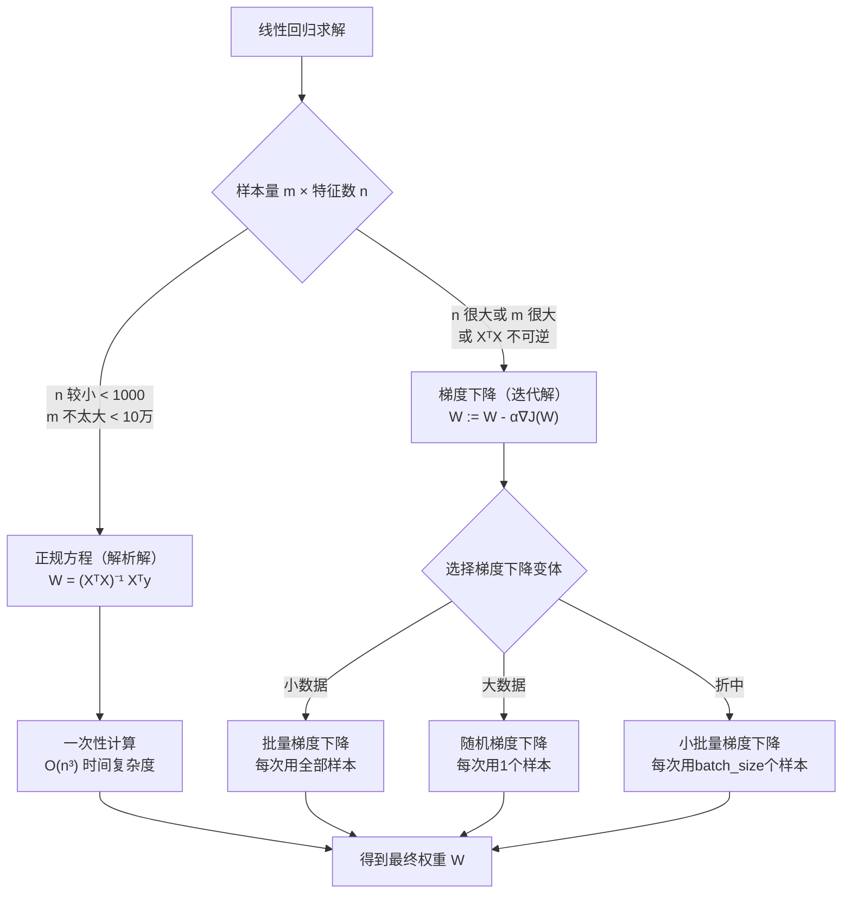

# 线性回归
> 创建日期：2026-06-06
> 难度：⭐
> 前置知识：矩阵运算、偏导数、梯度概念

## ⭐ 面试重点速览

- 能推导最小二乘法的解析解（正规方程）和梯度下降迭代解
- 能解释损失函数 MSE 的数学形式和几何意义
- 理解 R² 的含义和局限性
- 掌握 L1/L2 正则化的区别以及各自产生的效果
- 知道线性回归的五大假设（线性、独立、同方差、正态、无多重共线性）
- 能说出何时该用 Ridge、何时该用 Lasso

---

## 一、应用场景 🎯

| 场景 | 具体案例 | 为什么用线性回归 |
|------|---------|----------------|
| **房价预测** | 根据面积、房间数、地段预测房价 | 需要可解释的系数（每个特征对房价的贡献一目了然） |
| **销售预测** | 根据广告投入（TV、Radio、Newspaper）预测销售额 | 广告预算分配需要看到每个渠道的ROI |
| **风险评分** | 根据收入、负债、信用历史评估贷款额度 | 金融监管要求模型可解释 |
| **AB测试分析** | 评估改版对转化率的影响 | 简单直接，能给出置信区间 |
| **趋势分析** | 股票/天气/电力负荷的线性趋势预测 | 作为Baseline，快速验证特征有效性 |

**不适合的场景**：图像分类（非线性）、文本情感分析（高维稀疏）、时间序列长程依赖（非平稳）。

---

## 二、核心原理 🔬

### 2.1 数学本质

线性回归试图找到一条直线（或超平面）：

$$ \hat{y} = w_0 + w_1 x_1 + w_2 x_2 + ... + w_n x_n = XW $$

使得所有样本的预测误差平方和最小：

$$ J(W) = \frac{1}{2m} \sum_{i=1}^{m}(\hat{y}^{(i)} - y^{(i)})^2 = \frac{1}{2m}(XW - y)^T(XW - y) $$

### 2.2 两种求解方式



### 2.3 最小二乘法推导（正规方程）

```
目标：最小化 J(W) = (1/2m) ||XW - y||²

步骤：
1. 对 W 求梯度：∇J(W) = (1/m) Xᵀ(XW - y)
2. 令梯度为零：XᵀXW = Xᵀy
3. 解得：W = (XᵀX)⁻¹ Xᵀy  ← 这就是正规方程

注意：当 XᵀX 奇异（不可逆）时，说明特征间存在完全共线性，
     需要去掉冗余特征或加正则化
```

### 2.4 梯度下降推导

```python
# 梯度下降更新公式
# W := W - α * (1/m) * Xᵀ(XW - y)
# 其中 α 是学习率
```

学习率的影响：

| 学习率 α | 效果 |
|----------|------|
| 太小（如 1e-6） | 收敛极慢，可能训练到天荒地老 |
| 适中（如 0.01） | 平稳下降，快速收敛 |
| 太大（如 1.0） | 震荡甚至发散，损失反而增大 |
| 自适应（Adam等） | 自动调节，推荐使用 |

### 2.5 R² 评估指标

$$ R² = 1 - \frac{SS_{res}}{SS_{tot}} = 1 - \frac{\sum(y_i - \hat{y}_i)^2}{\sum(y_i - \bar{y})^2} $$

- R² = 1：完美拟合
- R² = 0：模型预测不如直接用均值预测
- R² < 0：模型比瞎猜还差
- **注意**：R² 随特征增加而单调递增，不能用来比较不同特征数量的模型（应使用调整R²）

---

## 三、趣味解说 🎭

### 用尺子画一条"最公平"的线

想象你在桌上撒了一把米粒（这些是数据点），现在你要放一根筷子（这条直线）下去。

**规则**：筷子不一定要穿过每个米粒，但所有米粒到筷子的"垂直距离之和"要尽可能小。

- 你尝试把筷子放在各个位置，每放一次就量一量每个米粒离筷子多远
- 最左边放 → 右边的米粒离得太远，总距离很大
- 最右边放 → 左边的米粒离得太远，总距离也很大
- 放到中间偏上 → 上下都有米粒不太满意
- 不断微调……终于找到一个位置，让所有米粒的"不满意程度"总和最小

**这就是线性回归的核心**：找一条直线（超平面），让所有点到直线的距离（误差）的平方和最小。

### 为什么是"平方"而不是绝对值？

假如你是老师改卷，学生A多扣了1分，学生B少扣了1分——绝对值损失认为"扯平了"。但平方损失认为：1² + 1² = 2（有多扣的也有少扣的，说明不准），比一个人多扣2分（2² = 4）要好。**平方会"惩罚"大误差**。

---

## 四、代码实现 💻

### 4.1 从零手写线性回归（梯度下降）

```python
import numpy as np

class LinearRegressionScratch:
    """手写线性回归 —— 用梯度下降求解"""
    
    def __init__(self, learning_rate=0.01, n_iterations=1000):
        self.lr = learning_rate      # 学习率
        self.n_iter = n_iterations   # 迭代次数
        self.weights = None          # 权重 W
        self.bias = None             # 偏置 w0
        self.loss_history = []       # 记录损失变化
    
    def fit(self, X, y):
        m, n = X.shape               # m = 样本数, n = 特征数
        # 初始化权重为小随机值，打破对称性
        self.weights = np.random.randn(n) * 0.01
        self.bias = 0.0
        
        for i in range(self.n_iter):
            # 前向传播：计算预测值
            y_pred = X @ self.weights + self.bias  # (m,)
            
            # 计算梯度
            error = y_pred - y                      # (m,)
            dw = (1 / m) * (X.T @ error)            # (n,) — 权重梯度
            db = (1 / m) * np.sum(error)            # 标量 — 偏置梯度
            
            # 更新参数
            self.weights -= self.lr * dw
            self.bias -= self.lr * db
            
            # 记录损失（MSE）
            loss = (1 / (2 * m)) * np.sum(error ** 2)
            self.loss_history.append(loss)
            
            # 每200次打印一次
            if i % 200 == 0:
                print(f"迭代 {i:5d}: 损失 = {loss:.6f}")
    
    def predict(self, X):
        return X @ self.weights + self.bias

# === 使用示例 ===
# X = np.array([[1, 2], [2, 3], [3, 4]])
# y = np.array([3, 5, 7])
# model = LinearRegressionScratch(learning_rate=0.01, n_iterations=1000)
# model.fit(X, y)
# print(f"预测值: {model.predict(np.array([[4, 5]]))}")
```

### 4.2 正规方程解法（Numpy一行搞定）

```python
def normal_equation(X, y):
    """正规方程直接求解 W = (XᵀX)⁻¹ Xᵀy"""
    # 添加截距项（bias列）
    X_b = np.c_[np.ones((X.shape[0], 1)), X]  # 第0列全为1
    # np.linalg.inv 求逆矩阵
    W = np.linalg.inv(X_b.T @ X_b) @ X_b.T @ y
    return W[0], W[1:]  # 返回 bias, weights
```

### 4.3 sklearn 标准写法

```python
from sklearn.linear_model import LinearRegression, Ridge, Lasso
from sklearn.model_selection import train_test_split
from sklearn.metrics import mean_squared_error, r2_score
from sklearn.preprocessing import StandardScaler

# === 数据准备 ===
X_train, X_test, y_train, y_test = train_test_split(
    X, y, test_size=0.2, random_state=42
)

# === 标准线性回归 ===
lr = LinearRegression()
lr.fit(X_train, y_train)
y_pred = lr.predict(X_test)
print(f"截距 w0: {lr.intercept_:.4f}")
print(f"权重: {lr.coef_}")
print(f"MSE: {mean_squared_error(y_test, y_pred):.4f}")
print(f"R²:  {r2_score(y_test, y_pred):.4f}")

# === Ridge回归（L2正则化） ===
# alpha 越大 → 正则化越强 → 权重越接近0
scaler = StandardScaler()  # ⚠️ 正则化前必须先标准化！
X_train_scaled = scaler.fit_transform(X_train)
X_test_scaled = scaler.transform(X_test)

ridge = Ridge(alpha=1.0)
ridge.fit(X_train_scaled, y_train)
print(f"Ridge R²: {r2_score(y_test, ridge.predict(X_test_scaled)):.4f}")

# === Lasso回归（L1正则化，自动特征选择） ===
lasso = Lasso(alpha=0.1, max_iter=10000)
lasso.fit(X_train_scaled, y_train)
# 被Lasso置零的权重对应的特征被"淘汰"了
print(f"Lasso R²: {r2_score(y_test, lasso.predict(X_test_scaled)):.4f}")
print(f"非零特征数: {np.sum(lasso.coef_ != 0)}")

# === ElasticNet（L1 + L2 组合） ===
from sklearn.linear_model import ElasticNet
en = ElasticNet(alpha=0.1, l1_ratio=0.5)  # l1_ratio: L1的比例
en.fit(X_train_scaled, y_train)
```

### 4.4 学习率可视化

```python
import matplotlib.pyplot as plt

# 假设已训练 model = LinearRegressionScratch(...)
# plt.plot(model.loss_history)
# plt.xlabel('迭代次数')
# plt.ylabel('损失 (MSE)')
# plt.title('梯度下降收敛曲线')
# plt.show()
```

---

## 五、优缺点 ⚖️

| 维度 | 优点 | 缺点 |
|------|------|------|
| **可解释性** | 每个特征的权重直接对应其重要性 | 当特征高度相关时，权重解释变得不可靠 |
| **训练速度** | 正规方程 O(n³) 或梯度下降 O(mn)，极快 | 特征维度 n 极大时正规方程不可用 |
| **预测性能** | 低方差，不易过拟合 | 高偏差，无法拟合非线性关系 |
| **数据要求** | 对缺失值处理简单 | 对异常值敏感（一个离群点可能大幅改变回归线） |
| **扩展性** | 正则化、多项式特征可弥补线性限制 | 需要人工做特征工程来捕获非线性关系 |
| **数学基础** | 有封闭解，统计推断完善 | 多重共线性会导致 XᵀX 不可逆 |

### 三种正则化对比

| 正则化 | 公式 | 效果 | 适用场景 |
|--------|------|------|---------|
| **无正则化** | J(W) = MSE | 可能过拟合 | 数据量大且信噪比高 |
| **L2 (Ridge)** | J(W) + α∑w² | 所有权重缩小但不为零 | 大多数情况，防止过拟合 |
| **L1 (Lasso)** | J(W) + α∑\|w\| | 产生稀疏解，部分权重为0 | 需要自动特征选择时 |
| **ElasticNet** | J(W) + α(ρ∑\|w\| + (1-ρ)∑w²) | L1和L2的折中 | 特征多且知道只有部分有用 |

---

## 六、面试高频题 📝

**Q1: 正规方程和梯度下降各有什么优缺点？**

| 维度 | 正规方程 | 梯度下降 |
|------|---------|---------|
| 是否需要选 α | 不需要 | 需要 |
| 需要迭代吗 | 一次计算 | 多次迭代 |
| 时间复杂度 | O(n³) | O(kmn) |
| n 很大时 | 不可用（求逆太慢） | 可用 |
| 特征缩放 | 不需要 | **必须** |

**Q2: 线性回归有哪些假设条件？**
> 1. **线性假设**：X 和 y 之间存在线性关系
> 2. **独立性**：残差之间相互独立（无自相关）
> 3. **同方差性**：残差的方差恒定（不随预测值变化）
> 4. **正态性**：残差服从正态分布
> 5. **无多重共线性**：特征之间不存在精确的线性关系
>
> 其中1和5最常见，违反后模型基本失效；2-4违反后点估计仍然无偏，但统计推断失效。

**Q3: MSE 和 MAE 作为损失函数有什么区别？**
> - **MSE**（均方误差）：对大误差的惩罚更重（平方放大），梯度连续可导，是默认选择
> - **MAE**（平均绝对误差）：对异常值更鲁棒，但在0点不可导
> - **Huber Loss**：结合二者，小误差用MSE，大误差用MAE

**Q4: 为什么要对特征做标准化？**
> 1. 梯度下降：不同尺度特征导致椭圆等高线，收敛慢
> 2. 正则化：L1/L2 对尺度敏感，不标准化的话大数值特征被"不公平"惩罚
> 3. 可解释性：标准化后系数的相对大小才有可比性

**Q5: 如果你发现模型 R² 很高但预测效果很差，可能是什么原因？**
> 最可能是**数据泄露**：训练时不小心用了未来信息（如用"下个月销售额"做特征）。也可能是过度拟合、标签错误、或者用 R² 在不平衡数据上评估分类问题。

---

## 七、常见误区 ❌

| 误区 | 正确理解 |
|------|---------|
| "R² = 0.9 就是好模型" | R² 不等于预测准确。残差分析、Q-Q图、业务指标更重要 |
| "特征与目标的相关性高就适合线性回归" | 相关性只能检测线性关系。可能存在 U 形、指数等非线性关系 |
| "标准化后截距为0" | 标准化的是 X 不是 y，截距通常不为0 |
| "加多项式特征就能拟合任何曲线" | 高次多项式极易过拟合，尤其在外推区域出现剧烈震荡 |
| "先做特征选择再做正则化" | Lasso 本身就是特征选择，不必先筛选 |
| "Ridge 能像 Lasso 一样做特征选择" | Ridge 只是把权重缩小，不会置零。需要特征选择用 Lasso |
| "如果 XᵀX 不可逆，加个微小扰动就行" | 这说明特征完全共线，应该去理解数据、删冗余特征，而非数值技巧 |
| "异常值可以用 IQR 法无脑删除" | 异常值可能包含关键业务信息（如欺诈交易），需要理解原因再决定 |