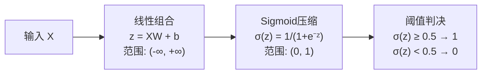
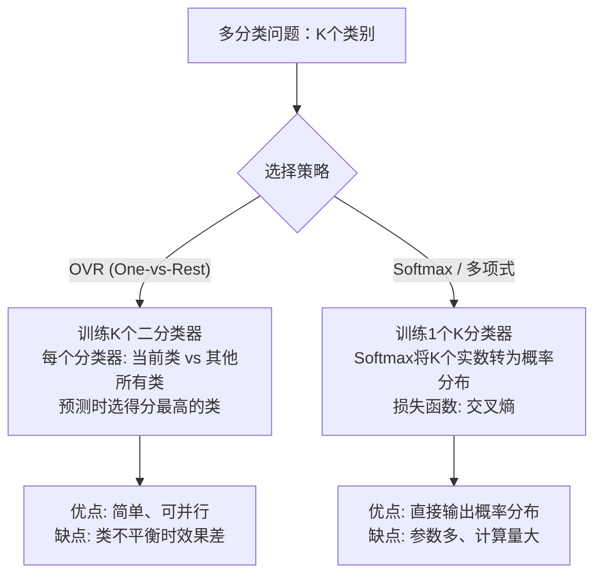

# 逻辑回归
> 创建日期：2026-06-06
> 难度：⭐⭐
> 前置知识：线性回归、Sigmoid函数、似然函数、梯度下降

## ⭐ 面试重点速览

- 能解释"为什么叫回归却是分类算法"（输出概率值，通过阈值转为类别）
- 能推导 Sigmoid 函数形式和交叉熵损失函数
- 理解逻辑回归的决策边界为什么是线性的
- 掌握多分类扩展（OVR vs Softmax）的原理与区别
- 能对比逻辑回归与线性回归的本质差异
- 理解正则化参数 C 的含义（C = 1/λ，C越大正则化越弱）

---

## 一、应用场景 🎯

| 场景 | 具体案例 | 为什么用逻辑回归 |
|------|---------|----------------|
| **点击率预估** | 预测用户是否会点击广告 | 输出概率值，可作为排序分数 |
| **信用评分卡** | 预测贷款人是否会违约 | 系数可解释，符合金融监管要求 |
| **垃圾邮件检测** | 判断邮件是否为垃圾邮件 | 简单高效，配合TF-IDF效果不错 |
| **疾病诊断** | 根据症状预测患病概率 | 输出概率，医生可据此决策 |
| **用户流失预警** | 预测用户下月是否流失 | 可解释每个因素对流失的贡献度 |
| **内容审核** | 判断评论是否违规 | 作为Baseline，快速验证特征有效性 |

**本质定位**：当你的任务需要输出概率 + 需要可解释性 + 数据量不大时，逻辑回归是首选。

---

## 二、核心原理 🔬

### 2.1 从线性回归到逻辑回归

线性回归输出的是任意实数，但分类需要输出 0~1 之间的概率。怎么办？**加一个"压缩"函数**。



### 2.2 Sigmoid 函数

$$ \sigma(z) = \frac{1}{1 + e^{-z}} $$

关键性质：
- 定义域：(-∞, +∞)，值域：(0, 1)
- 中心对称：σ(0) = 0.5
- 导数优雅：σ'(z) = σ(z)(1 - σ(z)) —— 这个性质让梯度计算极简

```python
import numpy as np

def sigmoid(z):
    """Sigmoid函数：将任意实数压缩到 (0, 1) 区间"""
    return 1 / (1 + np.exp(-z))

# 示例
print(sigmoid(-10))  # → 0.000045 ≈ 0
print(sigmoid(0))    # → 0.5
print(sigmoid(10))   # → 0.999955 ≈ 1
```

### 2.3 决策边界

决策边界是 σ(z) = 0.5 即 z = 0 的线：

```
当 XW + b = 0 时 → σ = 0.5 → 这是决策边界
当 XW + b > 0 时 → σ > 0.5 → 预测为1
当 XW + b < 0 时 → σ < 0.5 → 预测为0
```

**决策边界是线性的！** 这是逻辑回归最大的限制，也是它"简单"的来源。


### 2.4 交叉熵损失推导

逻辑回归不能用 MSE 做损失函数，因为 Sigmoid + MSE 的梯度在极端预测时会"消失"。

**交叉熵损失的推导路线**：

```
给定一个样本 (x, y)，其中 y ∈ {0, 1}

模型预测概率：P(y=1|x) = σ(z) = p
那么 P(y=0|x) = 1 - p

合并为一条公式：P(y|x) = p^y · (1-p)^(1-y)

取负对数似然（NLL）：
L = -[y·log(p) + (1-y)·log(1-p)]

这就是交叉熵损失，它衡量两个概率分布的差异。
```

**为什么交叉熵比MSE好？**

```python
# 用一个直观例子说明
# 假设真实标签 y=1，模型预测很差：p=0.0001
# MSE: (1 - 0.0001)² ≈ 0.9998，梯度 ≈ 2*(p-1)*p*(1-p) ≈ 0  ← 梯度消失！
# 交叉熵: -log(0.0001) ≈ 9.21，梯度 = p - y = -0.9999  ← 梯度很大，有效更新
```

### 2.5 多分类扩展



**Softmax 公式**：

$$ P(y=k|x) = \frac{e^{z_k}}{\sum_{j=1}^{K} e^{z_j}} $$

---

## 三、趣味解说 🎭

### 考试打分的故事

想象你是阅卷老师，批改100份试卷，每份试卷满分100分，60分及格。

**问题**：能不能根据学生的平时表现（出勤率、作业完成率、课堂参与度）来预测他会不会及格？

你用逻辑回归的做法：

1. **加权打分**：给每个平时表现指标一个权重，算出"综合分" z：
   $$ z = 出勤率 \times 0.3 + 作业完成率 \times 0.5 + 参与度 \times 0.2 $$

2. **Sigmoid 转换**：把任意分数 z 映射到"及格概率"：
   - z = 100（非常优秀）→ 及格概率 99.99%
   - z = 0（刚好中等）→ 及格概率 50%
   - z = -100（非常差）→ 及格概率 0.01%

3. **关键观察**：在"及格线"附近（z ≈ 0），概率变化最剧烈 —— 这就是 Sigmoid 的 S 形曲线中最陡的部分。**及格线附近最模糊，最容易判断错**。

### 为什么叫"回归"却是分类算法？

因为它沿用了线性回归的"线性加权"思想（z = XW），只是在外层套了一个 Sigmoid 函数。从数学上看，它回归的是**对数几率**（log-odds）：

$$ \log\frac{p}{1-p} = XW $$

所以它本质上是对"对数几率"做线性回归，然后通过 Sigmoid 反解出概率 p。

---

## 四、代码实现 💻

### 4.1 从零手写逻辑回归

```python
import numpy as np

class LogisticRegressionScratch:
    """手写二分类逻辑回归 —— 用梯度下降"""
    
    def __init__(self, learning_rate=0.01, n_iterations=1000, C=1.0):
        self.lr = learning_rate
        self.n_iter = n_iterations
        self.C = C             # 正则化强度的倒数（C越大正则化越弱）
        self.weights = None
        self.bias = None
    
    def _sigmoid(self, z):
        """Sigmoid 激活函数"""
        # 数值稳定版本：clip防止溢出
        z = np.clip(z, -250, 250)
        return 1 / (1 + np.exp(-z))
    
    def fit(self, X, y):
        m, n = X.shape
        # 初始化参数
        self.weights = np.zeros(n)   # 逻辑回归初始化用0即可
        self.bias = 0.0
        
        for i in range(self.n_iter):
            # 前向传播
            z = X @ self.weights + self.bias     # (m,)
            p = self._sigmoid(z)                 # (m,) — 预测概率
            
            # 梯度计算（交叉熵损失对参数的导数）
            error = p - y                        # (m,) — 这就是交叉熵的梯度！极简！
            dw = (1 / m) * (X.T @ error) + (1 / (m * self.C)) * self.weights  # 含L2正则化
            db = (1 / m) * np.sum(error)
            
            # 参数更新
            self.weights -= self.lr * dw
            self.bias -= self.lr * db
            
            if i % 200 == 0:
                # 计算交叉熵损失
                eps = 1e-15  # 防止 log(0)
                loss = -(1/m) * np.sum(y * np.log(p + eps) + (1-y) * np.log(1 - p + eps))
                print(f"迭代 {i:5d}: 交叉熵损失 = {loss:.6f}")
    
    def predict_proba(self, X):
        """返回预测概率"""
        z = X @ self.weights + self.bias
        return self._sigmoid(z)
    
    def predict(self, X, threshold=0.5):
        """返回类别预测（默认阈值0.5）"""
        return (self.predict_proba(X) >= threshold).astype(int)
```

### 4.2 sklearn 标准写法

```python
from sklearn.linear_model import LogisticRegression
from sklearn.preprocessing import StandardScaler
from sklearn.model_selection import train_test_split, cross_val_score
from sklearn.metrics import (
    accuracy_score, precision_score, recall_score, f1_score,
    roc_auc_score, confusion_matrix, classification_report
)

# === 数据准备 ===
X_train, X_test, y_train, y_test = train_test_split(
    X, y, test_size=0.2, random_state=42, stratify=y  # stratify保持类别比例
)

# ⚠️ 逻辑回归是基于距离/梯度的，强烈建议标准化
scaler = StandardScaler()
X_train_scaled = scaler.fit_transform(X_train)
X_test_scaled = scaler.transform(X_test)

# === 模型训练 ===
# C 是正则化强度的倒数：C越大 → 正则化越弱 → 越容易过拟合
# penalty='l2' 默认使用L2正则化
model = LogisticRegression(
    C=1.0,                # 正则化系数
    penalty='l2',         # L2正则化（也可用'l1'做特征选择）
    solver='lbfgs',       # 优化器
    max_iter=1000,        # 最大迭代次数
    random_state=42
)
model.fit(X_train_scaled, y_train)

# === 预测与评估 ===
y_pred = model.predict(X_test_scaled)
y_prob = model.predict_proba(X_test_scaled)[:, 1]  # 取正类概率

print(f"准确率: {accuracy_score(y_test, y_pred):.4f}")
print(f"精确率: {precision_score(y_test, y_pred):.4f}")
print(f"召回率: {recall_score(y_test, y_pred):.4f}")
print(f"F1分数: {f1_score(y_test, y_pred):.4f}")
print(f"AUC:    {roc_auc_score(y_test, y_prob):.4f}")

# 混淆矩阵
print("\n混淆矩阵:")
print(confusion_matrix(y_test, y_pred))

# 特征重要性（系数的绝对值）
feature_importance = np.abs(model.coef_[0])
for i, imp in enumerate(feature_importance):
    print(f"特征 {i}: 重要性 = {imp:.4f}")
```

### 4.3 多分类示例

```python
# === OVR 方式（One-vs-Rest） ===
model_ovr = LogisticRegression(multi_class='ovr', max_iter=1000)
model_ovr.fit(X_train_scaled, y_train_multi)

# === Softmax 方式（多项式逻辑回归） ===
model_softmax = LogisticRegression(
    multi_class='multinomial',  # 使用Softmax
    solver='lbfgs',             # Softmax需要lbfgs或newton-cg
    max_iter=1000
)
model_softmax.fit(X_train_scaled, y_train_multi)

# 获取每个类别的概率
probs = model_softmax.predict_proba(X_test_scaled)  # (n_samples, n_classes)
```

### 4.4 阈值调优

```python
# 不一定要用0.5作为阈值！根据业务需求调整
from sklearn.metrics import precision_recall_curve

precisions, recalls, thresholds = precision_recall_curve(y_test, y_prob)

# 找到满足"召回率 >= 0.9"的最大阈值
target_recall = 0.9
idx = np.where(recalls >= target_recall)[0][-1]
best_threshold = thresholds[idx]
print(f"召回率≥{target_recall}的最佳阈值: {best_threshold:.4f}")
```

---

## 五、优缺点 ⚖️

| 维度 | 优点 | 缺点 |
|------|------|------|
| **可解释性** | 系数直接反映特征对log-odds的贡献，可解释性强 | 特征高度相关时系数不稳定 |
| **输出** | 直接输出概率值，天然支持排序 | 概率校准在某些场景需要额外校准（Platt Scaling） |
| **训练速度** | 凸优化问题，收敛快，有全局最优解 | 无法拟合非线性决策边界（除非人工构建交叉特征） |
| **特征工程** | 配合分箱/交叉特征可提升非线性能力 | 严重依赖特征工程来捕获非线性 |
| **稀疏数据** | 在高维稀疏数据上表现好（如文本分类） | 特征数量远大于样本数时需要正则化 |
| **正则化** | L1正则化可做特征选择，L2防止过拟合 | 正则化超参数需要调优 |

### 逻辑回归 vs 线性回归

| 对比点 | 线性回归 | 逻辑回归 |
|--------|---------|---------|
| **任务** | 回归（预测连续值） | 分类（预测类别） |
| **输出** | 任意实数 (-∞, +∞) | 概率 (0, 1) |
| **激活函数** | 无（恒等映射） | Sigmoid |
| **损失函数** | MSE（均方误差） | 交叉熵 |
| **梯度形式** | y_pred - y | σ(y_pred) - y |
| **评估指标** | R², MSE, MAE | 准确率, AUC, F1 |
| **决策边界** | 无 | 线性（XW = 0） |

---

## 六、面试高频题 📝

**Q1: 逻辑回归的损失函数为什么不用MSE？**
> 将 Sigmoid 代入 MSE 会得到一个**非凸函数**，梯度下降可能陷入局部最优。而且当预测极端（接近0或1）时，Sigmoid的导数 → 0，MSE的梯度也会 → 0，导致"梯度消失"，模型无法学习。交叉熵损失是凸函数，梯度为 p-y，训练稳定高效。

**Q2: 逻辑回归如何处理多分类？**
> 两种方式：
> 1. **OVR（One-vs-Rest）**：训练K个二分类器，每个分类"是A类还是不是A类"。预测时选得分最高的类。
> 2. **Softmax（多项式逻辑回归）**：将K个实数通过Softmax转为概率分布，一次训练，交叉熵损失。OVR更简单可并行，Softmax更优雅但参数多。

**Q3: 朴素贝叶斯和逻辑回归的关系？**
> 两者都是线性分类器，且存在数学联系：在特定假设下（特征条件独立 + 特定分布），朴素贝叶斯的后验概率对数是特征的线性函数，形式和逻辑回归一致。区别在于：朴素贝叶斯是生成模型（P(X,Y)），逻辑回归是判别模型（P(Y|X)）。

**Q4: 为什么特征高度相关时逻辑回归系数不稳定？**
> 当两个特征 X1 和 X2 高度相关时，模型可以"把权重分配给X1多一点、X2少一点"或反过来，两种方式都能达到相似的预测效果。这导致系数方差极大。解决方案：去掉冗余特征、使用L1/L2正则化、PCA降维。

**Q5: 逻辑回归的 C 参数是什么？**
> C 是正则化强度的**倒数**：C = 1/λ。C 越大，正则化越弱；C 越小，正则化越强。这与 sklearn 中 SVM 的 C 参数含义一致。默认值 C=1.0。

**Q6: 逻辑回归如何做特征选择？**
> 三种方式：
> 1. 设置 `penalty='l1'`，L1正则化会自动将不重要特征的系数置零
> 2. 看系数的绝对值大小（需要先标准化）
> 3. 使用 `feature_selection.SelectFromModel` 配合训练好的模型

---

## 七、常见误区 ❌

| 误区 | 正确理解 |
|------|---------|
| "逻辑回归只能做二分类" | 通过 OVR 或 Softmax 可以轻松扩展到多分类 |
| "逻辑回归是回归算法" | 虽然名字有"回归"，但它是分类算法。它回归的是对数几率 |
| "Sigmoid输出0.5以上就是正类" | 0.5只是默认阈值，应根据业务调整（如风控可降低阈值提高召回率） |
| "逻辑回归不需要特征缩放" | 虽然不缩放也能训练，但加了正则化后必须缩放，否则惩罚不公平 |
| "AUC高就说明模型好" | AUC只看排序能力，不看概率校准。AUC高但预测概率全在0.4-0.6之间也不行 |
| "多分类用OVR和Softmax一样" | 当类别不平衡时，OVR可能产生矛盾（多个分类器都说"是"），Softmax更一致 |
| "逻辑回归是线性模型，所以无法处理非线性" | 可以通过特征工程（多项式特征、分箱、交叉特征）引入非线性，但决策边界本身仍是线性的 |