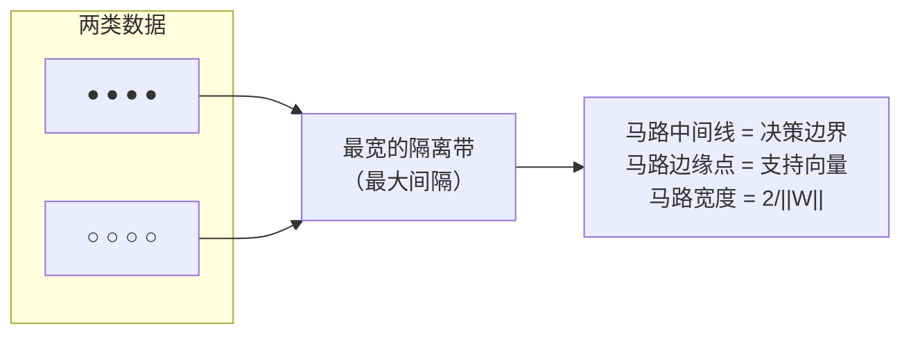
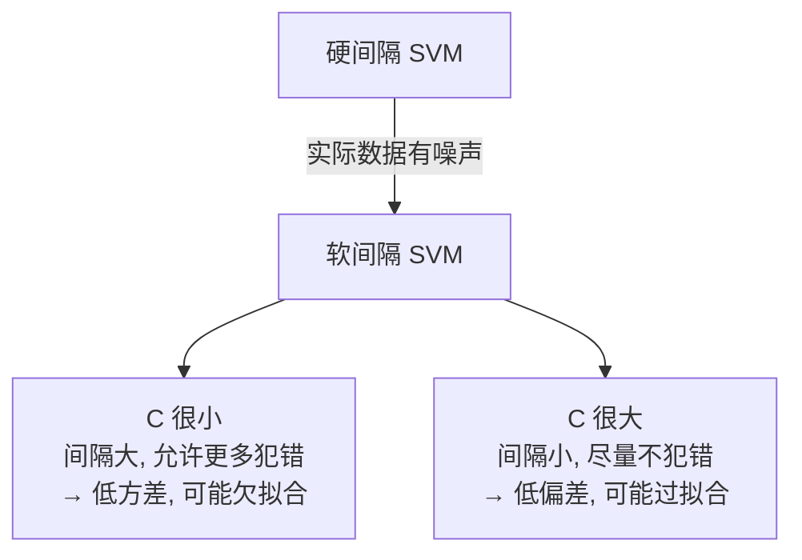
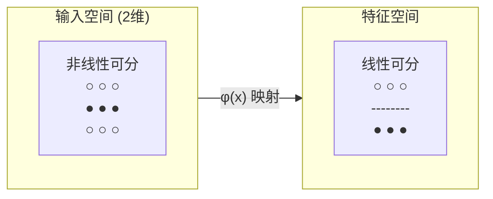
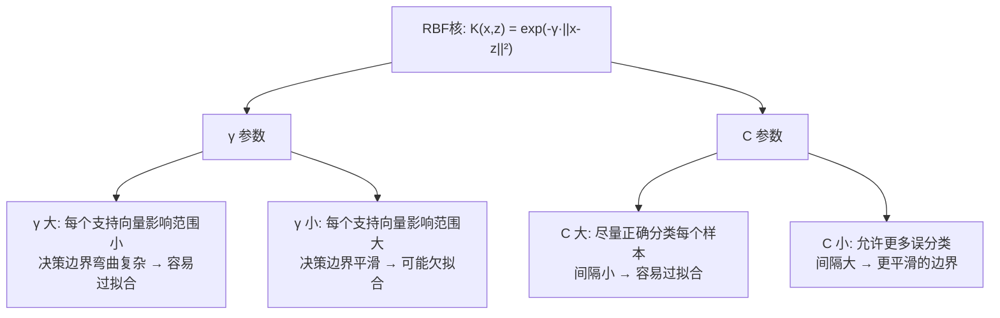
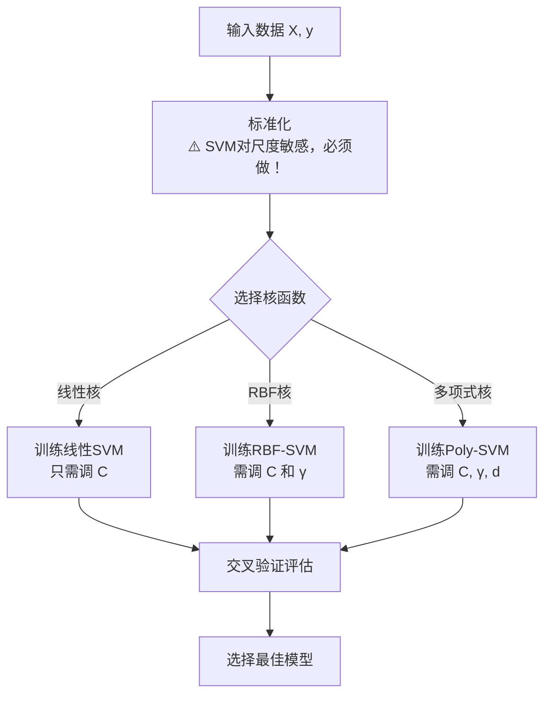

# 支持向量机 SVM
> 创建日期：2026-06-06
> 难度：⭐⭐⭐
> 前置知识：线性代数（超平面、点面距离）、拉格朗日乘子法（对偶问题）、核函数概念

## ⭐ 面试重点速览

- 能解释"最大间隔"的几何意义和数学表达
- 理解支持向量是什么：离决策边界最近的那些点
- 掌握核技巧的本质：低维非线性 → 高维线性
- 能区分线性核、多项式核、RBF核的适用场景
- 理解软间隔（C参数）的作用：允许一些点犯错，防止过拟合
- 知道 SVM 对特征缩放极度敏感，必须先标准化

---

## 一、应用场景 🎯

| 场景 | 具体案例 | 为什么用 SVM |
|------|---------|----------------|
| **文本分类** | 垃圾邮件过滤、新闻分类 | 高维稀疏数据上 SVM 表现极好 |
| **图像识别** | 手写数字识别（MNIST） | 在小样本图像分类上曾是SOTA |
| **生物信息学** | 基因表达数据分类、蛋白质结构预测 | 特征数远多于样本数时 SVM 表现优秀 |
| **异常检测** | One-Class SVM 检测异常行为 | 只需正常样本即可训练 |
| **人脸识别** | 人脸验证（是/不是同一个人） | 核方法能有效建模人脸相似度 |

**注意**：在深度学习时代，SVM 在图像/文本领域逐渐被替代，但在**小样本、高维度**的表格数据中仍是强力武器。

---

## 二、核心原理 🔬

### 2.1 直观理解：寻找最宽的马路



核心思想：不仅能分开两类，还要**分得最开**——让决策边界离最近的样本点尽可能远。

### 2.2 硬间隔 SVM（Hard Margin）

**假设**：数据完全线性可分

**优化目标**：

$$ \min_{W, b} \frac{1}{2} ||W||^2 $$

$$ \text{s.t. } y_i(W^T X_i + b) \geq 1, \forall i $$

- 最小化 ||W||² 等价于最大化间隔（间隔 = 2 / ||W||）
- 约束条件：所有样本都在正确的"马路两侧"之外
- 结果是唯一的全局最优解

### 2.3 软间隔 SVM（Soft Margin）

**假设**：数据不完全线性可分，允许一些点"越过边界"



**优化目标**（引入松弛变量 ξ）：

$$ \min_{W, b, \xi} \frac{1}{2} ||W||^2 + C \sum_{i=1}^{m} \xi_i $$

$$ \text{s.t. } y_i(W^T X_i + b) \geq 1 - \xi_i, \quad \xi_i \geq 0 $$

- **C** 是超参数：C 越大 → 对错误容忍度越低 → 间隔越窄 → 可能过拟合
- **ξ_i** 是松弛变量：衡量第 i 个样本"犯错"的程度
- 这就是 Hinge Loss 的来源

### 2.4 核技巧（Kernel Trick）

**问题**：如果数据在原空间不是线性可分的怎么办？

**方案**：映射到高维空间，在高维空间做线性分割！



**核技巧的本质**：不需要显式计算高维映射 φ(x)，只需计算核函数 K(x_i, x_j) = φ(x_i)·φ(x_j)。

**三种常用核函数**：

| 核函数 | 公式 | 参数 | 适用场景 |
|--------|------|------|---------|
| **线性核** | K(x, z) = x·z | 无 | 数据线性可分、高维稀疏（文本）、特征数>>样本数 |
| **多项式核** | K(x, z) = (γ·x·z + r)^d | d=度数 | 知道数据有d阶多项式关系时 |
| **RBF核** | K(x, z) = exp(-γ·||x-z||²) | γ=影响范围 | 最通用的核，不知道选什么时用它 |
| **Sigmoid核** | K(x, z) = tanh(γ·x·z + r) | γ, r | 与神经网络有关，较少使用 |

### 2.5 RBF核的两个关键参数



### 2.6 完整训练流程



---

## 三、趣味解说 🎭

### 用最宽的马路分隔两类车

想象你是一个城市规划师，需要在一条大街上画一条分界线，把**轿车**和**卡车**分开行驶。

**方案一（逻辑回归）**：随便画一条线，只要能把轿车和卡车分开就行。

**方案二（SVM）**：不仅要分开，还要让这条线**离最近的车尽可能远**——相当于在两类车之间修一条**最宽的隔离带（马路）**。隔离带边缘站着的那些车，就是**支持向量**。

如果轿车和卡车混在一起无法用直线分开怎么办？**核技巧**来了：

- 你在每个位置上立一根柱子，柱子高度 = 该位置离所有车的距离
- 原本在平面上混在一起的车，在三维空间中（加上了柱子高度）可能就分开了
- 在三维空间中画一个平面把它们分开，对应回二维就是一个**弯曲的边界**

这就是 **RBF核** 的直觉：把数据"翘"到高维空间再分开。

### 为什么叫"支持向量机"？

那些"站在隔离带边缘"的点（离决策边界最近的点）决定了整个决策边界的位置。其他远离边界的点，即使移动一点，也不会改变决策边界。

**只有这些"支撑"边界的点对模型有影响** —— 它们就是支持向量（Support Vectors）。

---

## 四、代码实现 💻

### 4.1 sklearn 线性 SVM

```python
from sklearn.svm import LinearSVC, SVC
from sklearn.preprocessing import StandardScaler
from sklearn.model_selection import train_test_split, GridSearchCV
from sklearn.metrics import classification_report

# === 数据准备 ===
X_train, X_test, y_train, y_test = train_test_split(
    X, y, test_size=0.2, random_state=42, stratify=y
)

# ⚠️⚠️⚠️ SVM 对特征尺度极度敏感，必须标准化！
# 不标准化的后果：尺度大的特征主导距离计算，SVM基本失效
scaler = StandardScaler()
X_train_scaled = scaler.fit_transform(X_train)
X_test_scaled = scaler.transform(X_test)

# === 线性 SVM ===
# LinearSVC: 专门优化的线性核，速度快，但只支持线性
linear_svm = LinearSVC(
    C=1.0,                # 正则化参数（越大越严格）
    max_iter=5000,        # 最大迭代次数
    dual=False,           # 样本数>特征数时设为False
    random_state=42
)
linear_svm.fit(X_train_scaled, y_train)
print(f"线性SVM准确率: {linear_svm.score(X_test_scaled, y_test):.4f}")
```

### 4.2 sklearn RBF-SVM（核方法）

```python
# === RBF-SVM（最常用的核SVM） ===
rbf_svm = SVC(
    kernel='rbf',          # 核函数选择
    C=1.0,                 # 正则化参数
    gamma='scale',         # 'scale': γ = 1/(n_features * X.var())
                           # 'auto':  γ = 1/n_features
    probability=True,      # 启用概率输出（需要额外训练Platt Scaling）
    random_state=42
)
rbf_svm.fit(X_train_scaled, y_train)

# 支持向量信息
print(f"支持向量数量: {len(rbf_svm.support_vectors_)}")
print(f"支持向量占总样本: {len(rbf_svm.support_vectors_) / len(X_train_scaled):.2%}")

# 预测
y_pred = rbf_svm.predict(X_test_scaled)
y_prob = rbf_svm.predict_proba(X_test_scaled)  # 需要 probability=True
print(classification_report(y_test, y_pred))
```

### 4.3 网格搜索超参数

```python
# === SVM 的两大核心超参数：C 和 gamma ===
param_grid = {
    'C': [0.01, 0.1, 1, 10, 100],
    'gamma': [0.001, 0.01, 0.1, 1, 10, 'scale', 'auto'],
    'kernel': ['rbf']
}

grid = GridSearchCV(
    SVC(random_state=42),
    param_grid,
    cv=5,
    scoring='accuracy',
    n_jobs=-1,             # 并行搜索
    verbose=1
)
grid.fit(X_train_scaled, y_train)

print(f"最佳参数: {grid.best_params_}")
print(f"最佳CV分数: {grid.best_score_:.4f}")
print(f"测试集分数: {grid.score(X_test_scaled, y_test):.4f}")

# 可视化网格搜索结果
import pandas as pd
results = pd.DataFrame(grid.cv_results_)
# 可以绘制 C-gamma 热力图
```

### 4.4 不同核函数对比

```python
kernels = ['linear', 'poly', 'rbf', 'sigmoid']
results = {}

for kernel in kernels:
    svm = SVC(kernel=kernel, C=1.0, gamma='scale', random_state=42)
    svm.fit(X_train_scaled, y_train)
    results[kernel] = {
        'train_score': svm.score(X_train_scaled, y_train),
        'test_score': svm.score(X_test_scaled, y_test),
        'n_support': len(svm.support_vectors_)
    }
    print(f"{kernel:10s}: 训练={results[kernel]['train_score']:.4f}, "
          f"测试={results[kernel]['test_score']:.4f}, "
          f"支持向量={results[kernel]['n_support']}")
```

### 4.5 One-Class SVM（异常检测）

```python
from sklearn.svm import OneClassSVM

# 只用正常数据训练，检测异常
oc_svm = OneClassSVM(
    kernel='rbf',
    gamma='scale',
    nu=0.05  # 异常比例的上界（约等于预期的异常比例）
)
oc_svm.fit(X_train_normal)  # 只用正常数据！

# 预测：+1 = 正常, -1 = 异常
predictions = oc_svm.predict(X_test)
anomalies = predictions == -1
print(f"检测到异常数: {anomalies.sum()}")
```

---

## 五、优缺点 ⚖️

| 维度 | 优点 | 缺点 |
|------|------|------|
| **泛化能力** | 最大间隔原则 + 结构风险最小化，泛化能力好 | 超参数敏感，C 和 γ 需要仔细调优 |
| **小样本** | 在小样本高维数据上表现极佳 | 样本量太大时训练极慢 O(n²) ~ O(n³) |
| **核技巧** | 通过核函数巧妙处理非线性，无需显式高维映射 | 核函数选择是玄学，需要经验 |
| **全局最优** | 凸优化问题，有全局最优解 | 优化算法（SMO）实现复杂 |
| **可解释性** | 线性SVM可解释（权重即特征重要性） | RBF-SVM 基本不可解释 |
| **概率输出** | 通过 Platt Scaling 可输出概率 | 概率输出需要额外训练，且不是原生的 |

### 对比：何时用 SVM vs 随机森林 vs 逻辑回归

| 场景 | 推荐算法 | 原因 |
|------|---------|------|
| 表格数据，特征数 < 100，样本数 1K-100K | 随机森林 / XGBoost | 最通用，调参少 |
| 表格数据，样本数 < 1000 | SVM (RBF) | 小样本下 SVM 泛化好 |
| 文本分类（高维稀疏） | 线性 SVM / 逻辑回归 | 线性核在高维上表现好，训练快 |
| 需要概率输出 + 可解释 | 逻辑回归 | 原生概率，系数可解释 |
| 追求极致性能，有时间调参 | XGBoost / LightGBM | 竞赛级性能 |
| 需要可解释的规则 | 决策树 | 规则可视化 |

---

## 六、面试高频题 📝

**Q1: SVM 为什么对特征缩放敏感？**
> SVM 的核心是计算点之间的距离（||x - z||）。如果特征 A 的尺度是 0-1，特征 B 的尺度是 0-100000，那么 B 会完全主导距离计算，A 几乎不起作用。标准化后各特征尺度一致，SVM 才能公平对待每个特征。

**Q2: 什么是支持向量？为什么 SVM 只用支持向量？**
> 支持向量是离决策边界最近的那些样本点。SVM 的决策边界完全由支持向量决定，远离边界的点对边界位置没有影响。这是因为 SVM 的目标函数只关心"边界"上的点，Hinge Loss 对正确分类且远离边界的点损失为 0。

**Q3: 核函数有什么要求？为什么必须是正定核？**
> 核函数必须满足 Mercer 定理：对任意有限样本，核矩阵 K_ij = K(x_i, x_j) 必须是半正定的。这保证了核函数对应某个高维空间中的内积，使得优化问题仍是凸的，有全局最优解。

**Q4: C 和 γ 分别控制什么？**
> - **C**：控制"间隔最大化"和"分类正确"之间的权衡。C 大 = 强调分类正确，间隔小，容易过拟合
> - **γ**（RBF核）：控制每个支持向量的影响半径。γ 大 = 影响半径小，决策边界弯曲，容易过拟合。C 和 γ 是相互影响的，需要联合调优

**Q5: 什么时候用线性核，什么时候用 RBF 核？**
> - **线性核**：特征数 >> 样本数（如文本分类的 TF-IDF 特征）、数据近似线性可分、需要快速训练
> - **RBF 核**：样本数 >> 特征数、数据非线性关系未知、不知道选什么时的默认选择
> - 经验法则：先用线性核快速验证，如果训练集准确率很低，再尝试 RBF 核

**Q6: SVM 如何处理多分类？**
> sklearn 的 SVC 默认使用 OVR（One-vs-Rest），训练 K 个二分类 SVM。也可以使用 OVO（One-vs-One），训练 K(K-1)/2 个二分类器，每个分类器只区分两个类，投票决定最终类别。OVO 训练分类器更多但每个分类器更小。

---

## 七、常见误区 ❌

| 误区 | 正确理解 |
|------|---------|
| "SVM 天然支持概率输出" | SVM 是确定性的，没有概率输出。`predict_proba` 是通过 Platt Scaling 后加的，且不保证校准质量 |
| "SVM 一定比神经网络好" | 在大量数据上，深度学习通常优于 SVM。SVM 的优势在小样本 |
| "RBF-SVM 的 γ 越大越好" | γ 越大，模型越复杂，越容易过拟合。需要和 C 联合调优 |
| "SVM 不能用于回归" | SVR（Support Vector Regression）可以，用 ε-不敏感损失函数 |
| "SVM 训练慢是因为数据量大" | 主要瓶颈是支持向量数量，而不是训练数据量。如果支持向量很多，预测也慢 |
| "线性 SVM 和逻辑回归差不多" | 虽然决策边界都是线性的，但 SVM 最大化间隔，对异常值更鲁棒。逻辑回归输出校准概率 |
| "只要数据线性可分，SVM 一定完美" | 硬间隔 SVM 对噪声极其敏感，一个异常点可能大幅改变决策边界。实际中都使用软间隔 |