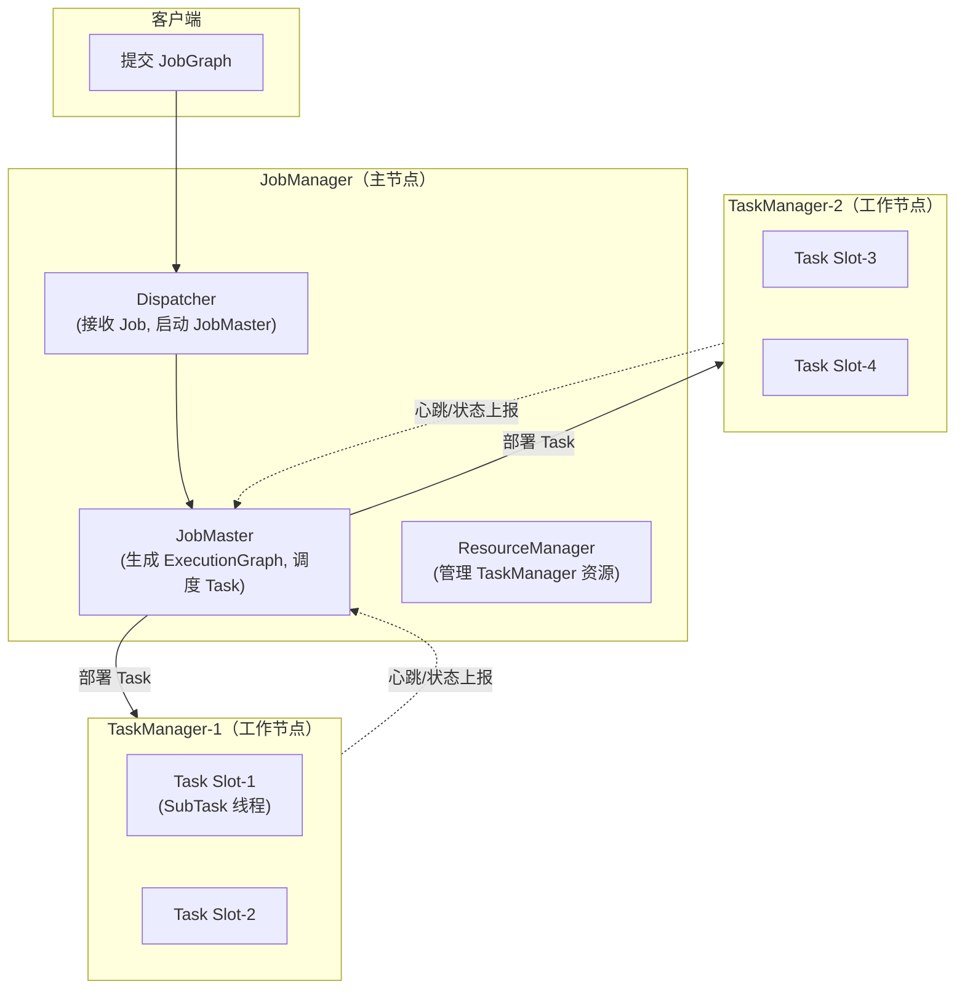
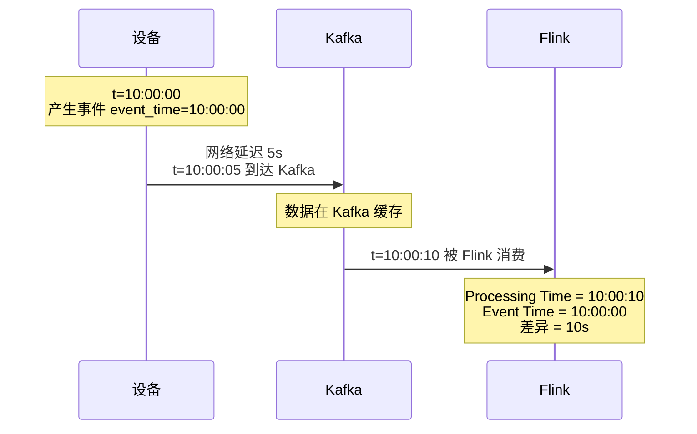
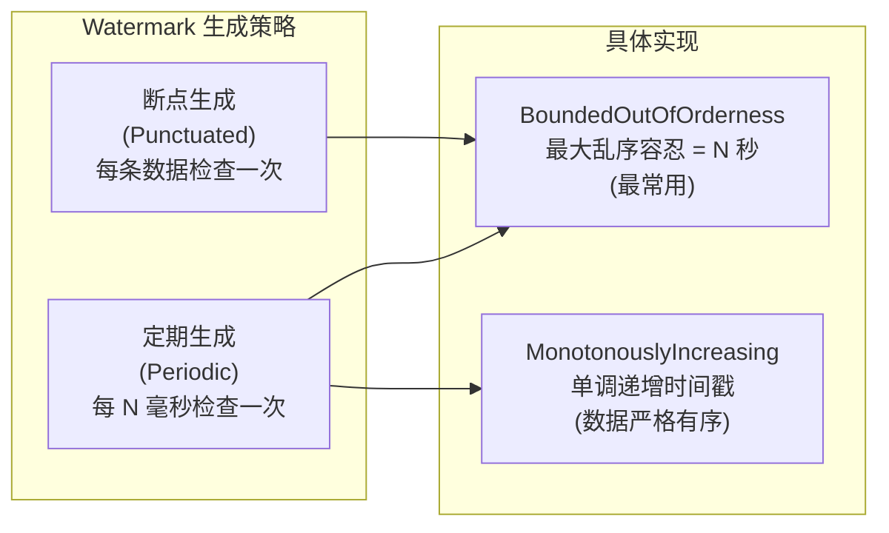
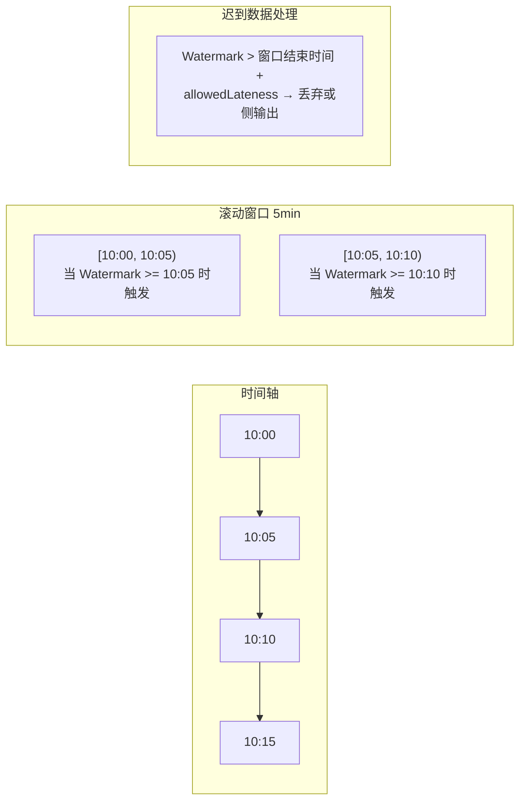
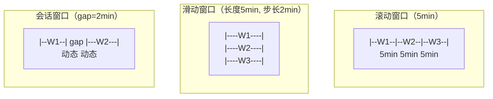
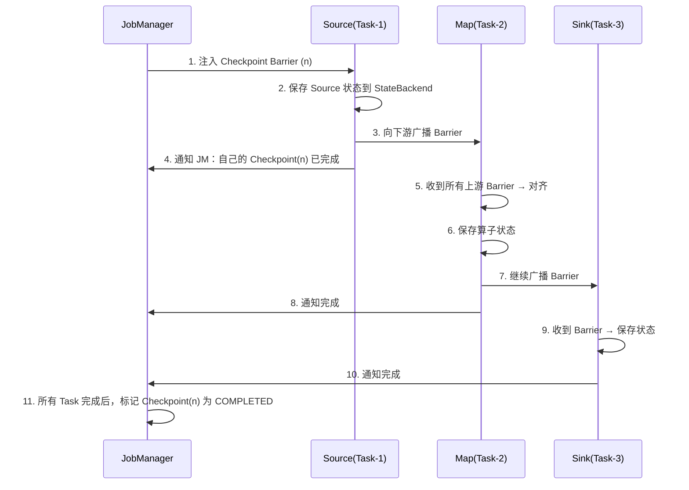
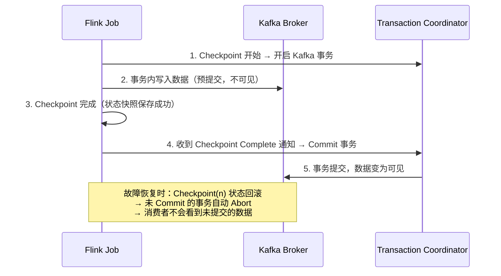

# Flink 流处理核心

> Flink 是实时流计算的事实标准。与 Spark Streaming 的"微批"思路不同，Flink 每条数据逐条处理（真正的流计算），因此在实时风控、实时大屏、实时特征工程等场景中具有压倒性优势。面试重点在时间语义、Watermark 机制和 Checkpoint 容错。

---

## ⭐ 面试重点速览

| 考点 | 频率 | 难度 | 考察方式 |
|------|------|------|----------|
| Event Time vs Processing Time + Watermark | ⭐⭐⭐⭐⭐ | ⭐⭐⭐⭐ | 画出 Watermark 生成和传递的流程图 |
| Checkpoint 原理（Barrier 对齐） | ⭐⭐⭐⭐⭐ | ⭐⭐⭐⭐⭐ | 口述 Chandy-Lamport 算法的实现，端到端精确一次 |
| 窗口类型与触发机制（Tumble/Hop/Session） | ⭐⭐⭐⭐⭐ | ⭐⭐⭐⭐ | 举例说明每种窗口的 Watermark 触发条件 |
| 状态后端（StateBackend）三种选择 | ⭐⭐⭐⭐ | ⭐⭐⭐⭐ | RocksDB vs Heap 的选择策略 |
| Savepoint 与 Checkpoint 的区别 | ⭐⭐⭐⭐ | ⭐⭐⭐ | 从触发方式、生命周期、用途三个维度对比 |
| 两阶段提交（2PC Sink）实现 Exactly-Once | ⭐⭐⭐⭐ | ⭐⭐⭐⭐⭐ | 结合 Kafka 事务消息画图说明 |

---

## 一、Flink 架构



### 1.1 核心概念

| 概念 | 说明 |
|------|------|
| **JobManager** | 协调分布式执行：调度 Task、触发 Checkpoint、协调故障恢复。是一个 JVM 进程 |
| **TaskManager** | 执行数据流的 Task，缓存和交换数据流。一个 TaskManager 包含多个 Task Slot |
| **Task Slot** | TaskManager 的最小资源调度单位，一个 Slot 运行一个 SubTask 线程组 |
| **SubTask** | 算子链（OperatorChain）中的一个算子实例，是 Task 内最小的执行单元 |
| **算子链 (OperatorChain)** | 将多个相邻算子合并到一个 Task 中执行，减少线程切换和序列化开销 |

---

## 二、Event Time vs Processing Time

这是 Flink 流处理**最核心的时间语义问题**。面试中必须能说清三者的区别和使用场景。

| 时间语义 | 定义 | 确定性 | 延迟 | 典型场景 |
|----------|------|--------|------|----------|
| **Processing Time** | 数据进入 Flink 算子的系统时间 | 低（随机器时钟漂移） | 零延迟 | 实时监控告警（容忍误差） |
| **Event Time** | 事件真实发生的时间（数据中携带的时间戳） | 高（确定性重放） | 需要等待 Watermark | 实时风控、对账（需要精确） |
| **Ingestion Time** | 数据进入 Flink Source 的时间 | 中等 | 低 | 较少使用（中间方案） |



### 2.1 为什么需要 Event Time？

::: warning 面试核心问题
**Q: 一个用户 9:59:58 下单，网络延迟导致数据 10:00:03 才到达 Flink。统计 10:00:00 截止的订单数，这笔订单算哪个小时的？**

A: Processing Time 会错误地将其归入 10:00-11:00，Event Time 正确归入 9:00-10:00。涉及对账、资金统计的场景，必须用 Event Time + Watermark 处理乱序数据。这就是 Watermark 机制存在的根本原因。
:::

---

## 三、Watermark 水位线

Watermark 是一种**声明数据完整性**的机制：告诉 Flink "早于时间 T 的数据已经全部到达，可以触发了"。

### 3.1 Watermark 生成策略



### 3.2 Watermark 传播机制

```
多并行度 Source 的 Watermark 合并策略：
  取所有上游 Watermark 的最小值（保守策略）

示例：
  Source-1 Watermark = 10:05:00
  Source-2 Watermark = 10:03:00
  → 下游算子的 Watermark = min(10:05:00, 10:03:00) = 10:03:00

原理：Source-2 还有 10:03:00 之后的数据没到，下游不能贸然触发窗口计算
```

### 3.3 窗口与水印触发



---

## 四、窗口 Window

### 4.1 三种窗口类型

| 窗口类型 | 定义 | 触发条件 | 示例 |
|----------|------|----------|------|
| **Tumbling Window（滚动窗口）** | 固定长度、无重叠 | `Watermark >= 窗口结束时间` | 每 5 分钟统计一次订单数 |
| **Sliding Window（滑动窗口）** | 固定长度、有重叠。两个参数：窗口长度 + 滑动步长 | `Watermark >= 窗口结束时间` | 每 1 分钟统计过去 5 分钟的 UV |
| **Session Window（会话窗口）** | 动态长度、按活动间隔划分 | `Watermark >= 最后元素时间 + gap` | 用户连续操作行为分析 |



### 4.2 窗口函数类型

| 函数 | 特点 | 适用场景 |
|------|------|----------|
| **ReduceFunction** | 增量聚合，来一条算一条，内存占用 O(1) | 求和、计数等可结合操作 |
| **AggregateFunction** | 增量聚合，支持中间类型（比 Reduce 更灵活） | 求平均值（中间类型为 (sum, count)） |
| **ProcessWindowFunction** | 全量聚合，缓存窗口内所有数据再计算 | 需要排序、TopN、中位数等非结合操作 |

::: tip 性能提示
优先使用 Reduce/Aggregate（增量），仅在必要时使用 ProcessWindowFunction（全量）。大数据量下 ProcessWindowFunction 可能导致窗口状态 OOM。也可结合两者：增量聚合做预处理 + ProcessWindowFunction 获取窗口元数据（窗口起止时间）。
:::

---

## 五、Checkpoint 与 Savepoint

### 5.1 Checkpoint：自动容错

Flink 的 Checkpoint 基于 **Chandy-Lamport 分布式快照算法**的变体——**异步 Barrier 快照**。



### 5.2 Barrier 对齐机制

> Flink 1.11+ 支持 **Unaligned Checkpoint**（非对齐 Checkpoint），写入飞行中的数据（in-flight data），避免背压延迟对齐。

- **对齐方式（Aligned）**：等待所有上游 Channel 的 Barrier 到齐后才能做快照。好处是状态精简，坏处是背压下对齐等待时间长。
- **非对齐（Unaligned）**：Barrier 到达直接触发快照，将飞行中数据也写入 Checkpoint。好处是背压下无需等待对齐，坏处是 Checkpoint 体积更大。

### 5.3 StateBackend 三种选择

| StateBackend | 存储位置 | 容量限制 | 适用场景 |
|--------------|----------|----------|----------|
| **HashMapStateBackend**（原 MemoryStateBackend） | JVM Heap | 受 JVM 堆限制 | 开发测试、状态很小的作业 |
| **EmbeddedRocksDBStateBackend** | 本地磁盘 (RocksDB) | 磁盘容量 | **生产环境默认推荐**，状态大、需要增量 Checkpoint |
| ~~FsStateBackend~~ | 已废弃 | - | Flink 1.13+ 已移除，请使用 HashMapStateBackend |

### 5.4 Checkpoint vs Savepoint

| 维度 | Checkpoint | Savepoint |
|------|-----------|-----------|
| **触发方式** | Flink 自动触发（按间隔） | 用户手动触发（CLI/API） |
| **生命周期** | Job 取消后自动删除 | 永久保存（用户显式删除） |
| **用途** | 故障恢复（Flink 自动回滚） | 版本升级、A/B 测试、迁移集群 |
| **格式** | 增量（依赖前序 Checkpoint） | 默认可自包含（canonical 模式） |
| **状态恢复** | 仅同版本恢复 | 可跨版本恢复（需兼容） |

---

## 六、精确一次语义（Exactly-Once）

### 6.1 三种语义

| 语义 | 定义 | 典型实现 |
|------|------|----------|
| **At-Most-Once** | 数据最多处理一次，可能丢失 | 故障时不重试、不恢复 |
| **At-Least-Once** | 数据至少处理一次，可能重复 | 故障恢复后重放未确认的数据 |
| **Exactly-Once** | 数据精确处理一次，不丢不重 | Checkpoint + 幂等写入 / 两阶段提交 |

### 6.2 端到端 Exactly-Once：两阶段提交（2PC Sink）

Flink + Kafka 的端到端精确一次依赖 **Kafka 事务消息 + Flink Checkpoint 的两阶段提交**：



::: warning 面试追问
**Q: 如果 Sink 在 Commit 事务前崩溃了，数据会丢还是会重复？**

A: 不会丢也不会重复。崩溃后 Flink 从上一个成功的 Checkpoint 恢复，状态回滚。未 Commit 的事务被 Kafka Coordinator 自动 Abort（超时机制），已写入但未提交的数据对外不可见。Flink 从 Checkpoint 重新消费源数据，重新开启事务写入，最终精确一次。
:::

### 6.3 Exactly-Once 的前提条件

```
源端要求：  Kafka Source 支持 Reset Offset 到 Checkpoint 记录的位置
Sink 要求： 支持事务写入 / 幂等写入（如 Kafka 事务、HDFS 原子重命名、MySQL UPSERT）
Flink 要求：开启 Checkpoint（`execution.checkpointing.mode: EXACTLY_ONCE`）
```

---

## 七、经典高频面试题

### Q1：Flink 的 Watermark 如何处理乱序数据？

**答案：** 通过 **最大乱序时间（BoundedOutOfOrderness）** 容忍迟到数据。（1）配置 `WatermarkStrategy.forBoundedOutOfOrderness(Duration.ofSeconds(5))`，表示可以容忍最多 5 秒的乱序。（2）Watermark = 当前最大 EventTime - 乱序容忍时间。例如当前看到的最大 EventTime 是 10:05:00，容忍 5 秒，则 Watermark = 10:04:55。（3）窗口在 Watermark >= 窗口结束时间时触发计算。（4）迟到超过 allowedLateness 的数据进入侧输出流（SideOutput），单独处理（如写入死信队列、人工对账）。这种设计在正确性和延迟之间取得了平衡。它与 [Kafka 消息可靠性](../middleware/message-queue/kafka.md) 中讨论的"消息顺序性保证"属于同一类分布式时序问题。

### Q2：Flink 的 Barrier 对齐是什么？非对齐 Checkpoint 解决什么问题？

**答案：** **Barrier 对齐**是 Flink Checkpoint 的核心机制。（1）当一个算子有多个上游输入通道时，需要等待**所有通道**的 Barrier(n) 都到齐，才能对该算子做快照。等待期间，已经到 Barrier 的通道不能继续处理数据（否则状态会变化），造成该通道被阻塞。（2）在高背压场景下，被阻塞的通道数据逐渐积压，对齐时间可能很长（秒级到分钟级），Checkpoint 超时后将导致作业频繁重启。（3）**非对齐 Checkpoint（Unaligned Checkpoint, Flink 1.11+）** 解决此问题：Barrier 到达后立即触发快照，并将通道中已到达但未处理的数据（飞行中数据 / in-flight data）作为 Checkpoint 的一部分写入，不再等待对齐。代价是 Checkpoint 体积更大。

### Q3：RocksDBStateBackend 和 HashMapStateBackend 如何选择？

**答案：** （1）**HashMapStateBackend**（堆内存储）：状态存于 JVM Heap，读写为 Java 对象操作，速度快、延迟低。但受限于 JVM 堆大小（通常不超过几十 GB），且大状态会引发 Full GC 导致作业抖动。适合状态 < 1GB、低延迟要求的场景。（2）**EmbeddedRocksDBStateBackend**（磁盘存储）：状态持久化到本地 RocksDB（LSM-Tree 引擎），内存中维护写缓存和读缓存。最大优势是状态量可以远超 JVM 堆（TB 级），且支持**增量 Checkpoint**（只上传变化的部分，大幅减少 Checkpoint 数据量）。生产环境中绝大多数场景用 RocksDB。注意：RocksDB 需要本地 SSD，HDD 会成为瓶颈。

### Q4：Flink 的 Session Window 是如何确定窗口边界的？实现原理是什么？

**答案：** Session Window 的边界由**活动间隔（gap）**动态决定。（1）为每个 Key 维护一个 SessionWindowAssigner，当新数据到达时检查其 EventTime 与当前 Session 最后时间是否 < gap，若是则合并，否则创建新 Session。（2）内部实现依赖 **MergingWindowAssigner**：Flink 为每个 Key 的每个 Session 维护独立状态；当两个 Session 的间隔 < gap 时，Flink 动态合并它们的窗口状态。（3）触发条件：Watermark >= Session 结束时间（最后元素时间 + gap）时触发窗口计算。（4）Session Window 的计算成本显著高于滚动/滑动窗口，因为需要动态合并和分裂窗口状态。

### Q5：Flink 的反压（Backpressure）机制是怎样的？

**答案：** Flink 的反压机制与 TCP 流量控制类似，是**天然的逐级反压**。（1）Flink Task 之间通过 Netty 网络传输数据，每个 SubTask 有 InputChannel 接收上游数据和 ResultPartition 向下游输出数据。（2）当下游处理慢时，其 LocalBufferPool 被填满，拒绝接收新数据。（3）Netty 的 TCP 连接会自动降低发送窗口，上游无法发送数据，反压传递到上游算子。（4）最终反压传导到 Source，Source 降低消费速度（如降低从 Kafka poll 的速率）。（5）与 Spark Streaming 的"背压通过 PID 控制器动态调整消费速率"不同，Flink 是**基于 TCP 流量控制的被动反压**，天然无需配置，实时性更好。这是 [高并发反压设计](../high-concurrency/design-patterns/index.md) 在流计算中的典型实现。

### Q6：Flink 与 Spark Streaming 在实时处理上的核心差异？

**答案：** 两者代表了两种不同的流处理哲学。（1）**Spark Streaming 是微批处理（Micro-Batch）**：将流数据按时间窗口拆分成小批次，每批次作为一个 Spark Batch Job 执行。优点是复用 Spark 批处理生态，容错简单（RDD 血缘），缺点是延迟至少一个批次间隔（通常秒级）。最新 Structured Streaming 已支持 Continuous Processing 模式（毫秒级），但生态不够成熟。（2）**Flink 是纯流处理（True Streaming）**：每条数据到达即处理，天然支持亚秒级延迟。拥有原生的 Event Time 处理、Watermark、状态管理等流处理核心能力。（3）选择策略：需要秒级以上延迟 + 复用 Spark 生态 + 离线/实时一体化（如 Lambda 架构改造），用 Spark Structured Streaming；需要亚秒级延迟 + 复杂状态管理 + 精确一次语义，用 Flink。

---

::: details 推荐资料
- 《Streaming Systems》—— Tyler Akidau（Flink DataFlow 模型的理论基础）
- 《Flink 内核原理与实现》—— 冯飞、崔星灿
- Apache Flink 官方文档：https://nightlies.apache.org/flink/flink-docs-stable/
:::