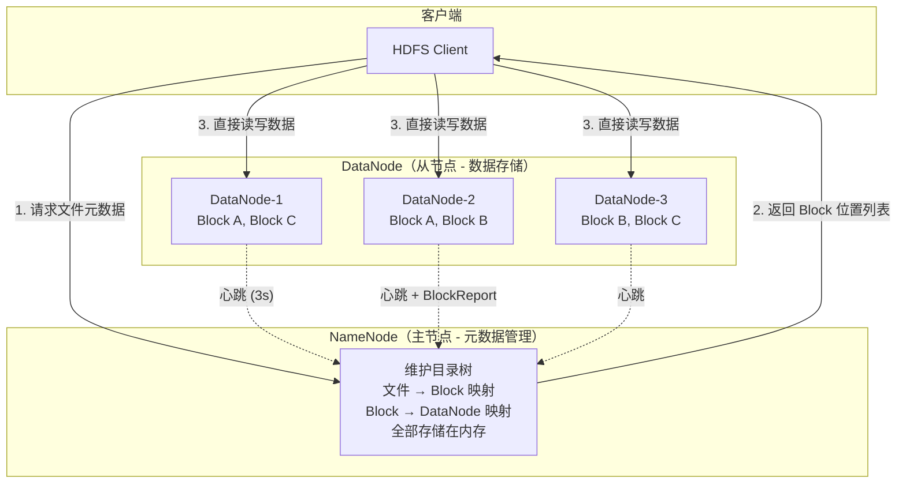
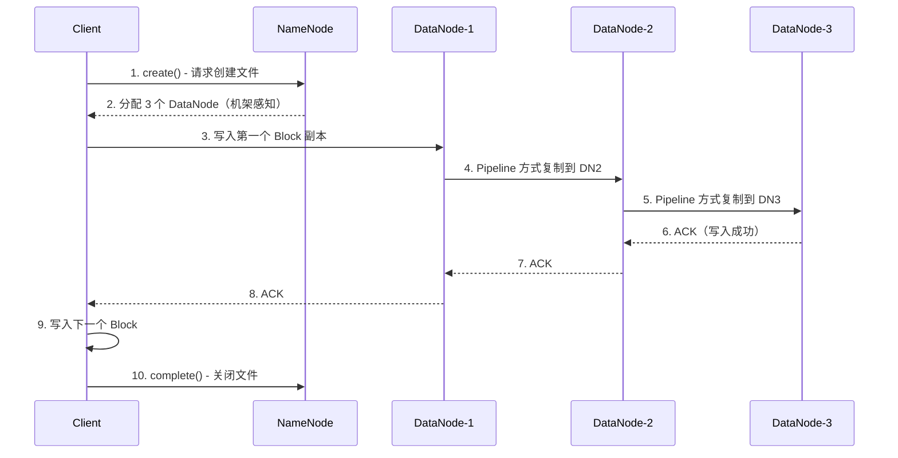
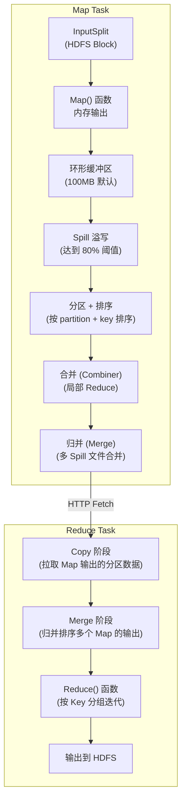
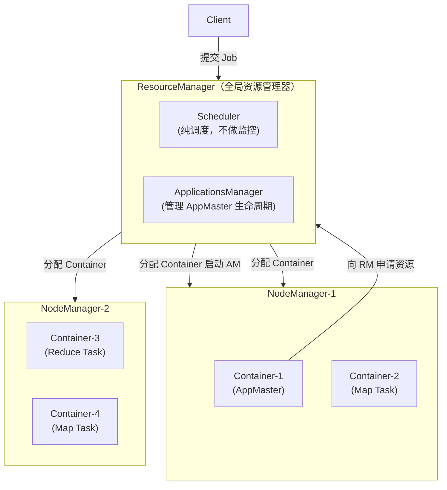

# Hadoop 生态系统

> Hadoop 是大数据技术的基石。虽然直接写 MapReduce 的场景越来越少，但 HDFS 仍然是分布式存储的事实标准，YARN 的资源调度思想影响了后续所有大数据框架。面试重点在 HDFS 架构和 MapReduce Shuffle 过程。

---

## ⭐ 面试重点速览

| 考点 | 频率 | 难度 | 考察方式 |
|------|------|------|----------|
| HDFS 架构（NameNode/DataNode 职责与交互） | ⭐⭐⭐⭐⭐ | ⭐⭐⭐⭐ | 画出架构图，解释读写流程，说出 HA 机制 |
| MapReduce Shuffle 全流程 | ⭐⭐⭐⭐⭐ | ⭐⭐⭐⭐⭐ | 口述 Map 端和 Reduce 端的 Shuffle 步骤，画出数据流向 |
| YARN 资源调度（Container/AppMaster） | ⭐⭐⭐⭐ | ⭐⭐⭐⭐ | 描述一个 Job 从提交到完成的完整调度流程 |
| Hive 与 MapReduce 的关系 | ⭐⭐⭐⭐ | ⭐⭐⭐ | Hive SQL 如何转化为 MapReduce？ORC/Parquet 列式存储优势？ |
| HBase 与 HDFS 的关系（LSM-Tree） | ⭐⭐⭐⭐ | ⭐⭐⭐⭐ | HBase 为什么能实现随机读写？RowKey 设计的核心原则？ |

---

## 一、HDFS 架构

HDFS（Hadoop Distributed File System）是 GFS 论文的开源实现，核心设计理念：**一次写入、多次读取**，适合大文件存储而非大量小文件。



### 1.1 NameNode 核心职责

| 职责 | 说明 | 关键细节 |
|------|------|----------|
| **元数据管理** | 维护文件系统目录树、文件-Block 映射、Block-DataNode 映射 | 全内存存储，因此对内存要求高（1 亿文件约需 30GB+） |
| **数据块管理** | 接收 DataNode 的 BlockReport，维护副本数达标 | 默认 3 副本，机架感知策略放置 |
| **心跳管理** | 每 3 秒接收 DataNode 心跳，超时 10 分钟判定节点失联 | 失联后自动触发副本复制，恢复至目标副本数 |

### 1.2 文件写入流程



::: warning 面试追问
**Q: HDFS 为什么不擅长处理小文件？**

A: （1）每个文件/目录在 NameNode 内存中占用约 150 字节元数据，1 亿个小文件消耗约 15GB NameNode 内存。（2）MapReduce 每个文件至少一个 Map Task，大量小文件导致 Task 调度开销远超计算本身。（3）DataNode 的磁盘随机寻道时间成为瓶颈。解决方案：Hadoop Archive (HAR)、SequenceFile、或定期合并小文件后落 HDFS（如 Flink 的 Checkpoint 文件合并策略）。
:::

### 1.3 NameNode 高可用（HA）

Hadoop 2.x 引入基于 QJM（Quorum Journal Manager）的 HA 方案：

- **JournalNode**：奇数个（至少 3 个），Active NN 的每一条 edit log 写入过半 JournalNode 才算成功
- **Standby NN**：从 JournalNode 拉取并回放 edit log，与 Active NN 保持元数据同步
- **故障切换**：依赖 ZooKeeper 进行主备选举及故障检测（参考 [ZooKeeper 分布式协调](../middleware/distributed-system/zookeeper.md)）
- **脑裂避免**：Fencing 机制 —— 旧 Active 在切换前被强制隔离（kill 进程或撤销共享存储权限）

---

## 二、MapReduce 原理

虽然 Spark 已取代 MapReduce 成为主流计算引擎，但**Shuffle 的本质思想**在 Spark / Flink 中一脉相承。

### 2.1 MapReduce 编程模型

```
Map 阶段：     (K1, V1) → list(K2, V2)
Shuffle 阶段：  按 K2 分组排序，分发到 Reducer
Reduce 阶段：  (K2, list(V2)) → list(K3, V3)
```

### 2.2 Shuffle 全流程（面试必画）



### 2.3 Shuffle 关键优化点

| 阶段 | 瓶颈 | 优化手段 |
|------|------|----------|
| **Map 端 Spill** | 频繁 IO 溢写 | 增大环形缓冲区（`io.sort.mb`），调高溢写阈值 |
| **Map 端 Combiner** | 数据传输量大 | 在 Map 端做局部聚合（如 WordCount 的局部 SUM） |
| **Copy 阶段** | 网络带宽 | 调大 `mapreduce.reduce.shuffle.parallelcopies`（默认 5） |
| **Merge 阶段** | 磁盘归并排序 | Reduce 端内存比例调整（`mapred.job.shuffle.input.buffer.percent`） |
| **数据倾斜** | 某 Key 数据量过大 | 两阶段聚合、加盐打散、自定义 Partitioner |

---

## 三、YARN 资源调度

YARN（Yet Another Resource Negotiator）将资源管理与作业调度分离，Hadoop 2.0 后 Spark/Flink/Tez 都可运行在 YARN 之上。



### 3.1 三种调度器

| 调度器 | 原理 | 适用场景 |
|--------|------|----------|
| **FIFO** | 单队列，先来先服务 | 仅用于测试，生产禁用 |
| **Capacity Scheduler** | 多队列，每个队列有资源上限，队列内 FIFO | 多部门共享集群，资源隔离 |
| **Fair Scheduler** | 多队列，资源按权重公平分配，支持抢占 | 追求公平性，避免任务饥饿 |

---

## 四、Hive / HBase 简介

### 4.1 Hive：SQL on Hadoop

Hive 的本质是**将 SQL 翻译为 MapReduce/Tez/Spark 作业**，数据存储在 HDFS 上，元数据（表结构、分区信息）存储在 MySQL/Derby（Metastore）。

| 特性 | 说明 |
|------|------|
| **分区 (Partition)** | 按字段值（如日期）划分目录，查询时仅扫描相关分区 |
| **分桶 (Bucket)** | 在分区内按 Hash 再分桶，加速 Join 和抽样 |
| **文件格式** | TextFile（原始）、ORC（列式+索引+压缩）、Parquet（列式，Spark 首选） |
| **执行引擎** | MR（默认，慢）、Tez（DAG 优化）、Spark（内存计算） |

::: tip ORC vs Parquet
ORC 为 Hive 深度优化，支持 ACID 事务（Hive 3.0+），内置轻量级索引（BloomFilter + min/max 统计）。Parquet 生态兼容性更好（Spark/Presto/Impala 均原生支持），是跨引擎场景的首选。面试答出"ORC 偏向 Hive 生态，Parquet 偏向跨引擎共享"即可。
:::

### 4.2 HBase：HDFS 上的 NoSQL

HBase 是基于 HDFS 的**列式存储 NoSQL 数据库**，底层采用 **LSM-Tree**（Log-Structured Merge Tree），实现随机实时读写。更多 LSM-Tree 原理参考 [LSM-Tree 存储引擎](../algorithm-topics/engineering-algorithms/index-storage/lsm-tree.md)。

| 概念 | 说明 |
|------|------|
| **RowKey** | 主键，按字典序排序存储，是唯一索引 |
| **Column Family** | 列族，物理上独立存储（不同 Store），建表时确定 |
| **Region** | 表的水平分片，一段 RowKey 范围的数据 |
| **RegionServer** | 管理多个 Region，处理读写请求 |
| **HMaster** | 管理 Region 分配、负载均衡、DDL 操作 |

::: danger RowKey 设计核心原则
1. **长度尽量短**：减少存储开销，每行每列都携带 RowKey
2. **散列性**：避免热点写入（如用 Hash 前缀 + 原始值），参考 [Redis 分片](../database/redis/cluster.md)
3. **查询友好**：将常用查询条件组合进 RowKey，利用字典序实现范围扫描
4. **避免单调递增**：时间戳做 RowKey 会导致所有写入集中在最后一个 Region
:::

---

## 五、经典高频面试题

### Q1：HDFS 写入一个文件，客户端、NameNode、DataNode 各自做了什么？

**答案：** 三者的协作流程是 Hadoop 面试必考题。（1）**客户端**向 NameNode 发起 `create()` 请求，NameNode 验证权限和路径合法性后返回 DataNode 列表（机架感知 + 副本策略）。（2）**客户端**以 Pipeline 方式依次将数据块写入 DataNode：先写 DN1，DN1 转发到 DN2，DN2 转发到 DN3。每个 DataNode 收到完整数据块后逐级返回 ACK。（3）一个 Block 写完后，客户端请求 NameNode 分配下一组 DataNode，重复写入直到文件关闭。（4）**NameNode** 持久化 edit log，并更新内存元数据。客户端在整个过程中与 NameNode 交互极少，数据流不经过 NameNode（避免瓶颈）。

### Q2：MapReduce Shuffle 过程中为什么需要排序？

**答案：** 排序是 Shuffle 的核心机制，目的是让相同 Key 的数据聚集在一起，Reduce 端可以一次迭代完成聚合。（1）Map 端对每个 Spill 文件按 `(partition, key)` 排序，确保同一分区的数据连续，同一 Key 的 KV 对相邻。（2）Reduce 端对多个 Map 的拉取结果进行归并排序（Merge Sort），生成按 Key 有序的输入流。（3）这样 Reduce() 函数收到的 `list(V2)` 只需要一次线性扫描即可完成聚合，无需在内存中维护哈希表，避免 OOM。

### Q3：YARN 上运行一个 MapReduce Job，ResourceManager 和 NodeManager 各自扮演什么角色？

**答案：** （1）**ResourceManager (RM)** 是全局资源管理者，包含 Scheduler（纯资源调度）和 ApplicationsManager（管理 AppMaster 生命周期）。（2）Client 向 RM 提交 Job，RM 在某个 NodeManager 上分配第一个 Container 启动 **AppMaster**。（3）**AppMaster** 向 RM 申请更多 Container 资源，RM 返回可用的 NodeManager 列表。（4）AppMaster 在已分配的 Container 上启动 Map/Reduce Task，监控 Task 进度和失败重试，完成后向 RM 归还资源。（4）**NodeManager** 负责启动/管理本机 Container，监控 CPU/内存资源使用，定期向 RM 心跳。

### Q4：为什么 Spark 比 MapReduce 快那么多？

**答案：** 核心差异在三个方面。（1）**内存计算 vs 磁盘中间结果**：MapReduce 每个 Map/Reduce 阶段的结果必须落 HDFS，下一个阶段再读回来，磁盘 IO 是最大瓶颈。Spark 将中间结果缓存在内存（RDD 的 persist/cache），迭代计算（ML 训练）和交互式查询（Spark SQL）性能有数量级提升。（2）**DAG 调度 vs 固定两阶段**：MapReduce 的计算模型只有 Map 和 Reduce 两个阶段，复杂 ETL 需要多个 MR Job 串联。Spark 基于 DAG 将多个 Transform 合并为一个 Stage，减少不必要的 Shuffle 和落盘。（3）**进程模型 vs 线程模型**：MapReduce 每个 Task 启动独立 JVM 进程（启动开销大），Spark Executor 是多线程的长期运行进程，Task 以线程粒度在 Executor 内执行，调度延迟低。详细对比见 [Spark 核心](./spark-core.md)。

### Q5：HBase 的 LSM-Tree 结构和读写路径是怎样的？

**答案：** HBase 基于 LSM-Tree 实现随机实时读写。（1）**写入路径**：写请求先写入 HLog（WAL，用于崩溃恢复），然后写入 MemStore（内存有序结构，默认 SkipList），返回客户端成功。（2）**Flush**：当一个 Region 的 MemStore 大小超过阈值（默认 128MB），系统触发 Flush，将 MemStore 中的数据排序后写入 HDFS 生成 HFile。（3）**Compaction**：小 HFile 过多影响读性能时，后台触发 Compaction 合并——Minor Compaction 合并少量小文件，Major Compaction 合并所有文件并清理过期数据。（4）**读取路径**：先从 MemStore 查，再从 BlockCache（读缓存）查，最后按 HFile 从新到旧依次查找，配合 BloomFilter 快速判断 Key 是否在 HFile 中。更多原理参考 [LSM-Tree 详解](../algorithm-topics/engineering-algorithms/index-storage/lsm-tree.md)。

### Q6：Hive 的分区和分桶有什么区别？分别用于什么场景？

**答案：** （1）**分区 (Partition)** 是按字段值在 HDFS 上创建子目录（如 `/dt=2024-01-01/`），查询时通过分区裁剪只扫描相关目录。适合**按时间/地域等固定维度**过滤的场景，大数据量下效果极佳，但分区字段值不宜过多（一个 HDFS 目录就是一个分区，目录数过万会影响 NameNode 性能）。（2）**分桶 (Bucket)** 是按字段 Hash 值将数据分到固定数量桶中，物理上在同一分区目录下分文件（如 `part-00000` 到 `part-00031`）。适合**大表 Join**时的 Bucket Map Join（两个表按相同键分桶后 Join 只需同号桶配对）、以及**数据抽样**（`TABLESAMPLE(BUCKET x OUT OF y)`）。

---

::: details 推荐资料
- 《Hadoop 权威指南（第4版）》—— Tom White
- 《HBase 权威指南》—— Lars George
- Apache Hadoop 官方文档：https://hadoop.apache.org/docs/
:::