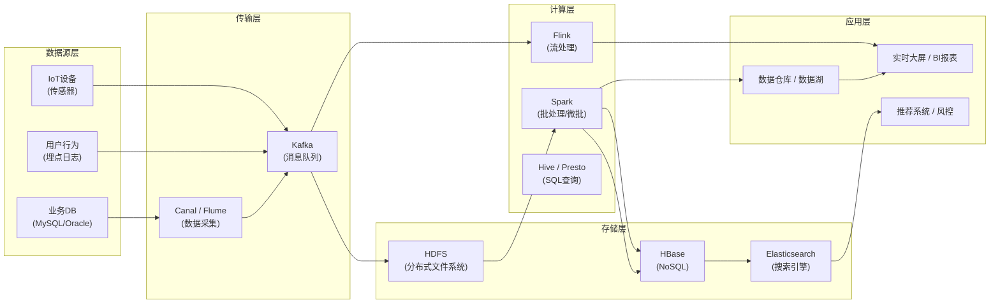
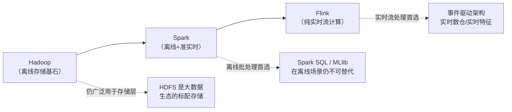
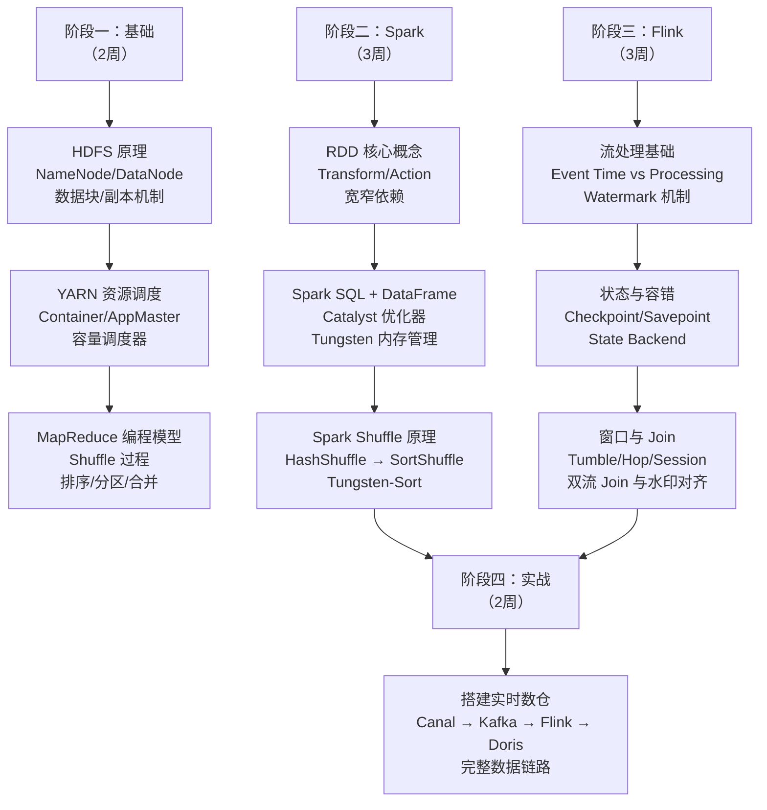

# 大数据基础总览

> 大数据模块面向后端高级工程师面试，聚焦离线计算、流计算、存储引擎三大方向的核心原理。掌握 Hadoop/Spark/Flink 的架构差异，能画出关键流程的 mermaid 图，是面试的基本要求。

---

## ⭐ 面试重点速览

| 考点 | 频率 | 难度 | 考察方式 |
|------|------|------|----------|
| OLTP vs OLAP 的本质区别 | ⭐⭐⭐⭐⭐ | ⭐⭐⭐ | 从数据模型、存储结构、查询模式三个维度对比 |
| Hadoop/Spark/Flink 定位与选型 | ⭐⭐⭐⭐⭐ | ⭐⭐⭐⭐ | 给一个业务场景，选择合适的大数据框架并说明理由 |
| 大数据生态全景 | ⭐⭐⭐⭐ | ⭐⭐⭐ | 画出 Lambda / Kappa 架构图，说明各组件角色 |
| 大数据与数据库/消息队列的协作关系 | ⭐⭐⭐⭐ | ⭐⭐⭐ | 如何与 Kafka 联动？数据如何落地到 MySQL/Redis？ |
| 学习路径规划 | ⭐⭐⭐ | ⭐⭐ | 从离线到实时，从原理到实战的进阶路线 |

---

## 一、大数据生态全景

大数据技术栈并非单一工具，而是围绕**采集 -> 传输 -> 存储 -> 计算 -> 分析 -> 展示**的完整链路。



### 1.1 典型架构演进

```
第一代：传统数仓（Oracle / Teradata）
    ↓ 瓶颈：扩展性差、成本高
第二代：Hadoop 生态（HDFS + MapReduce + Hive）
    ↓ 瓶颈：MapReduce 延迟高、流处理缺失
第三代：Lambda 架构（批处理 Spark + 流处理 Storm + 服务层 HBase）
    ↓ 瓶颈：两套代码维护成本高
第四代：Kappa 架构（统一流处理 Flink + 消息队列 Kafka 作为唯一数据源）
```

### 1.2 与现有知识体系的关联

大数据并非孤立模块。面试中高频考查大数据与下列模块的协作：

- **[数据库模块](../database/index.md)**：MySQL binlog 通过 Canal 实时同步到 Kafka，Flink 消费后写入 HBase / ClickHouse / ES 形成实时数仓
- **[消息队列模块](../middleware/message-queue/kafka.md)**：Kafka 是大数据管道的事实标准，Hadoop/Spark/Flink 均深度集成 Kafka
- **[高并发模块](../high-concurrency/index.md)**：高并发场景下产生的海量数据（日志、埋点、交易流水），正是大数据技术栈要处理的核心
- **[Redis缓存](../database/redis/index.md)**：大数据计算的结果（如排行榜、实时指标）通常落入 Redis 供前端查询

---

## 二、OLTP vs OLAP

这是面试中最容易被追问的基础题。必须从**数据模型、存储结构、查询模式**三个维度说清楚。

| 维度 | OLTP（联机事务处理） | OLAP（联机分析处理） |
|------|---------------------|---------------------|
| **典型场景** | 电商下单、银行转账、社交评论 | 年度报表、用户画像分析、实时风控 |
| **数据模型** | 高度规范化（3NF），ER 模型 | 星型/雪花型模式，宽表 + 维度表 |
| **读写模式** | 大量短事务，读写混合 | 批量写入，大量复杂查询（聚合/Join） |
| **数据量级** | GB ~ TB | TB ~ PB |
| **延迟要求** | 毫秒级 | 秒级 ~ 分钟级（离线）/ 亚秒级（实时 OLAP） |
| **并发量** | 极高（每秒万级事务） | 低（几十到几百个并发查询） |
| **代表产品** | MySQL、Oracle、PostgreSQL | Hive、Spark SQL、ClickHouse、Doris |
| **索引策略** | B+Tree（精确查找 + 范围扫描） | 列式存储 + 位图索引 / 倒排索引 |
| **事务特性** | ACID 严格保证 | 弱事务或无事务，侧重吞吐 |

::: warning 面试追问
**Q: 为什么 OLAP 不适合用行式存储？**

A: 分析查询通常只涉及少数列（如 SELECT SUM(amount) FROM orders WHERE date='2024-01'），行式存储需要读取整行数据，浪费大量 IO。列式存储每列独立存储，只需读取涉及的列，配合列级压缩（如 RLE、Delta Encoding），IO 量可节省 10-100 倍。此外，列式存储天然适合向量化执行，利用 CPU SIMD 指令加速计算。
:::

---

## 三、Hadoop / Spark / Flink 定位

| 框架 | 定位 | 计算模型 | 核心优势 | 典型场景 |
|------|------|---------|---------|---------|
| **Hadoop (HDFS+MR)** | 分布式存储 + 批处理 | MapReduce | 海量数据可靠存储、成本低廉 | 离线 ETL、日志归档、历史数据分析 |
| **Spark** | 通用计算引擎（批+微批） | RDD / DAG 引擎 | 内存计算、生态丰富（ML/Graph/SQL） | 离线数仓 ETL、机器学习训练、交互式查询 |
| **Flink** | 实时流计算引擎 | DataFlow 模型 | 亚秒级延迟、精确一次语义、状态管理 | 实时风控、实时大屏、实时数据清洗 |



### 3.1 选型决策矩阵

```
场景：T+1 离线报表，数据量 100TB
  → Spark + HDFS + Hive（成熟、稳定、生态完善）

场景：实时风控，延迟 < 100ms，数据量 10 万条/秒
  → Flink + Kafka（毫秒级延迟，精确一次语义）

场景：机器学习模型训练，需迭代计算，数据量 50TB
  → Spark MLlib（内存缓存中间结果，避免 MR 的重复落盘）

场景：海量日志存储，查询频率低，追求低成本
  → Hadoop HDFS + Hive on MR（单机成本最低）
```

---

## 四、学习路径



::: tip 推荐学习顺序
先搞懂 HDFS 存储原理（分布式存储是所有大数据技术的基础），再学 Spark（从离线到流处理的过渡），最后攻 Flink（纯实时，难度最高）。不要试图同时学三个，容易混淆。
:::

---

## 五、经典高频面试题

### Q1：Lambda 架构和 Kappa 架构的区别？各有什么优缺点？

**答案：** Lambda 架构包含三层 —— **批处理层**（Spark/Hive 负责全量计算） + **流处理层**（Storm/Flink 负责增量计算） + **服务层**（合并两者的结果对外查询）。好处是兼顾高吞吐和低延迟，缺点是两套代码逻辑需要维护一致。Kappa 架构只有**流处理层**（Flink）+ **消息队列**（Kafka 作为可重放的数据源），统一一套代码，简化运维，但要求所有计算都必须是流式可重放的，不适合需要全量扫描的复杂 SQL 分析。

### Q2：实时 OLAP 引擎（ClickHouse/Doris/StarRocks）和 Spark SQL/Flink SQL 有什么区别？

**答案：** ClickHouse/Doris 本质是**存储计算一体的 MPP 数据库**，数据落盘在本地列式存储 + 分布式查询计划，适合固定格式的报表查询和 ad-hoc 分析。Spark SQL / Flink SQL 是**计算引擎 + 外部存储分离**，数据存储在 HDFS / Kafka，计算资源动态分配，适合 ETL 流水线和复杂数据加工。选择策略：数据已经落盘且查询模式固定，用 ClickHouse/Doris；数据在流中需要实时加工，用 Flink SQL；离线 T+1 大规模 ETL，用 Spark SQL。

### Q3：大数据场景下如何保证数据一致性？

**答案：** 大数据场景通常**放弃强一致性**（ACID），转而追求**最终一致性**或**幂等性**。（1）**写入端**：利用 Kafka 的 `exactly-once` 语义（事务消息 + 幂等 Producer）保证不丢不重。（2）**计算端**：Flink 通过 Checkpoint + 两阶段提交（2PC Sink）实现端到端精确一次。（3）**存储端**：HDFS 的写一致性模型（写入后可见，但可能有部分块未复制完成）配合超时重试。（4）**业务兜底**：Lambda 架构的批处理层每晚重算前一天数据，覆盖流处理层的异常。对于严格需要 ACID 的场景（如对账），应使用传统关系型数据库，而非大数据技术栈。

### Q4：Hadoop 的 NameNode 高可用（HA）如何实现？

**答案：** Hadoop 2.x 引入 NameNode HA，核心依赖 **Quorum Journal Manager (QJM)**。（1）至少 3 个 JournalNode，Active NameNode 将每一条 edit log 写入过半的 JournalNode（类似 Paxos 的多数派写入）。（2）Standby NameNode 从 JournalNode 读取 edit log 并合并到 FSImage，保持元数据同步。（3）ZooKeeper 负责故障检测和主备切换——ZooKeeper 中注册 Active 节点的临时锁，当 Active 失联时触发自动 Failover。细节见 [Hadoop 生态](./hadoop-ecosystem.md) 中 HDFS 架构部分。

### Q5：数据湖（Data Lake）和数据仓库（Data Warehouse）有什么区别？

**答案：** 两者本质是**存储范式**的不同。（1）**数据仓库**要求数据在进入时就进行清洗和结构化（Schema-on-Write），数据质量高但灵活度低；典型产品：Hive（建表时定义 Schema）、Teradata。（2）**数据湖**允许原始数据直接存储（Schema-on-Read），读取时再解析 Schema，灵活但可能成为"数据沼泽"；典型产品：Delta Lake、Apache Hudi、Apache Iceberg。（3）**湖仓一体（Lakehouse）**是折中方案：用 Delta Lake / Iceberg 在数据湖上实现 ACID 事务、时间旅行、Schema 演进，兼具数据湖的灵活性和数仓的管理能力。

### Q6：如何设计一个支持万亿级数据的实时数仓？

**答案：** 分层设计是关键。（1）**ODS 层**：Kafka 作为原始数据管道，Canal 采集 MySQL binlog + 日志采集 Flume/Filebeat。（2）**DWD 层**：Flink 实时清洗 —— 字段解析、去重、补全维度表，写入 Kafka 第二 Topic。（3）**DWS 层**：Flink 窗口聚合计算小时/天级别的汇总指标，写入 Doris/ClickHouse。（4）**ADS 层**：Doris/ClickHouse 直接提供毫秒级查询，配合 Redis 缓存热点数据。（5）**离线兜底**：Spark 每晚重跑当天数据，与实时结果对账，修正偏差。更多细节参考 [高并发系统设计](../high-concurrency/system-design/index.md) 和 [Kafka 核心](../middleware/message-queue/kafka.md)。

---

::: details 推荐资料
- 《大数据之路：阿里巴巴大数据实践》—— 阿里巴巴数据技术及产品部
- 《Spark 快速大数据分析》—— Holden Karau
- 《Streaming Systems》—— Tyler Akidau（Flink 理论基础）
- Apache 官方文档：Hadoop / Spark / Flink
:::