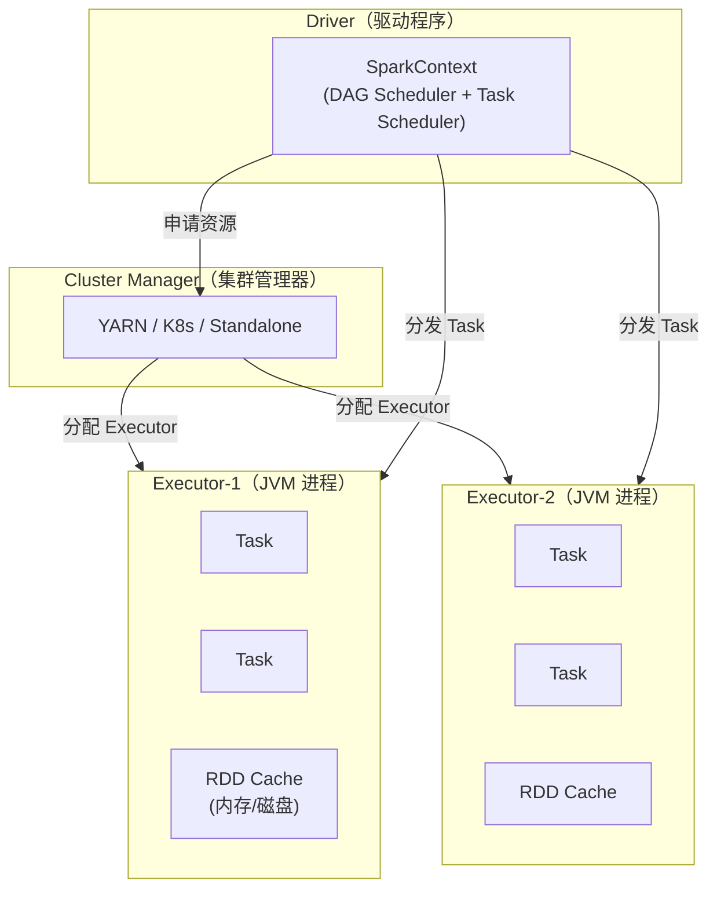
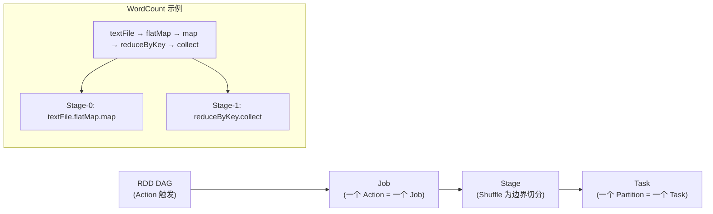
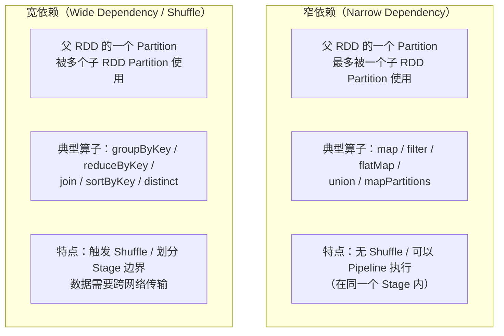
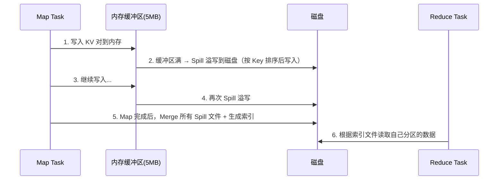
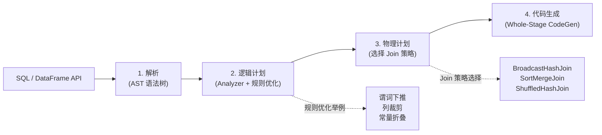

# Spark 核心原理

> Spark 是当前离线计算的事实标准。虽然 Spark Streaming 在实时领域已被 Flink 逐步取代，但 Spark SQL / MLlib / GraphX 在离线场景中仍不可替代。面试重点在 RDD 编程模型、Shuffle 原理，以及与 MapReduce 的本质差异。

---

## ⭐ 面试重点速览

| 考点 | 频率 | 难度 | 考察方式 |
|------|------|------|----------|
| RDD 五大特性 + 宽窄依赖 | ⭐⭐⭐⭐⭐ | ⭐⭐⭐⭐ | 举例说明宽/窄依赖，画出 DAG 血缘图 |
| Spark Shuffle 原理（SortShuffle） | ⭐⭐⭐⭐⭐ | ⭐⭐⭐⭐⭐ | 口述 Tungsten-Sort Shuffle 的步骤 |
| DataFrame / Dataset / RDD 的区别 | ⭐⭐⭐⭐⭐ | ⭐⭐⭐ | 从类型安全、序列化、优化器三个维度对比 |
| Spark 架构（Driver/Executor/ClusterManager） | ⭐⭐⭐⭐ | ⭐⭐⭐⭐ | 画出架构图，说明 Job → Stage → Task 的划分 |
| Spark 与 MapReduce 对比 | ⭐⭐⭐⭐ | ⭐⭐⭐ | 从 IO、调度、容错三个方面展开 |
| Catalyst 优化器原理 | ⭐⭐⭐⭐ | ⭐⭐⭐⭐ | 四阶段的优化过程 |

---

## 一、Spark 架构



### 1.1 核心组件职责

| 组件 | 职责 | 关键细节 |
|------|------|----------|
| **Driver** | 运行 main()，创建 SparkContext；将 RDD DAG 切分为 Job-Stage-Task；调度 Task 到 Executor | **Driver 是单点**，内存需足够大（广播变量、累加器均存于 Driver） |
| **Executor** | JVM 进程，执行 Driver 分配的 Task；缓存 RDD 数据；返回计算结果 | 一个 Application 多个 Executor，每个 Executor 内部以**线程**粒度并发执行 Task |
| **Cluster Manager** | 资源调度（YARN/Kubernetes/Standalone） | 与 Driver 解耦，支持多种资源管理器 |
| **Task** | 最小执行单元，处理一个 RDD Partition | 一个 Partition 对应一个 Task |

### 1.2 Job / Stage / Task 的划分



::: warning 面试追问
**Q: reduceByKey 为什么会产生 Shuffle，而 map 不会？**

A: `map` 操作每个元素独立转换，输入分区与输出分区一一对应，不需要跨节点数据传输。`reduceByKey` 需要将相同 Key 的数据聚合到同一节点，必须跨分区重新分发数据（即 Shuffle）。这正好对应"窄依赖"和"宽依赖"的划分。
:::

---

## 二、RDD / DataFrame / Dataset

### 2.1 三者对比

| 维度 | RDD | DataFrame | Dataset |
|------|-----|-----------|---------|
| **引入版本** | Spark 1.0 | Spark 1.3 | Spark 1.6 |
| **类型安全** | 编译时类型安全 | 运行时检查（无 Schema 编译期校验） | 编译时类型安全 |
| **序列化** | Java/Kryo 序列化 | Tungsten 二进制格式（堆外内存） | Encoder 序列化 |
| **优化器** | 无（手动优化） | Catalyst 优化器 | Catalyst 优化器 |
| **GC 压力** | 大（JVM 对象） | 小（堆外二进制存储） | 小（Encoder 二进制存储） |
| **推荐场景** | 底层 API 开发、非结构化数据 | SQL 分析、ETL 流水线 | 需要类型安全 + 优化的场景 |

### 2.2 RDD 五大特性

```
1. Partition 列表 —— 数据被分成多个分区并行处理
2. compute() 函数 —— 每个分区如何计算
3. 依赖关系列表 —— 记录父 RDD 的依赖（DAG 血缘）
4. Partitioner —— 可选，Key-Value RDD 的分区器
5. 首选位置列表 —— 数据本地性的优化（PreferedLocation）
```

::: tip 面试要点
背出这五条是基本功，但面试官通常会追问"为什么需要血缘"。答案：**容错**。RDD 是不可变的，某分区丢失时可根据血缘重新计算，无需像 MapReduce 那样写磁盘做中间备份。
:::

---

## 三、宽依赖 vs 窄依赖

这是面试中最核心的判断题。需要能看着一段 Spark 代码说出哪些操作产生宽依赖。



### 3.1 依赖类型速查表

| 算子 | 依赖类型 | 备注 |
|------|----------|------|
| `map` / `filter` / `flatMap` | 窄依赖 | 一对一映射 |
| `union` | 窄依赖 | 分区间简单拼接 |
| `coalesce` (减少分区) | 窄依赖 | 合并相邻分区块 |
| `groupByKey` | **宽依赖** | 需要按 Key 重新分区 |
| `reduceByKey` | **宽依赖** | 与 groupByKey 类似，但有 Map 端 Combiner |
| `join` (co-partitioned) | 窄依赖 | 两个 RDD 按相同 Partitioner 分区 |
| `join` (not co-partitioned) | **宽依赖** | 需要先 Shuffle 对齐分区 |
| `sortByKey` | **宽依赖** | 全局排序需要重新分区 |
| `distinct` | **宽依赖** | 需要去重 Shuffle |

---

## 四、Spark Shuffle 原理

### 4.1 从 HashShuffle 到 SortShuffle

```
Spark 0.x：HashShuffle
  → 每个 Map Task 为每个 Reduce Task 创建一个文件
  → M 个 Map × R 个 Reduce = M×R 个文件
  → 文件数爆炸，磁盘 IO 瓶颈

Spark 1.2+：SortShuffle
  → 每个 Map Task 只生成一个数据文件 + 一个索引文件
  → 在内存/磁盘中排序，按 Partition 顺序写入
  → 文件数降为 2M，大幅减少磁盘随机 IO

Spark 2.0+：Tungsten-Sort Shuffle（默认）
  → 使用堆外内存和指针排序，避免 GC
  → 数据以 UnsafeRow 格式存储，序列化/反序列化零拷贝
```

### 4.2 SortShuffle 流程



### 4.3 与 MapReduce Shuffle 的关键差异

| 维度 | MapReduce Shuffle | Spark SortShuffle |
|------|-------------------|-------------------|
| **中间结果** | 必须落磁盘 | 优先内存，不够再溢写 |
| **文件数量** | 每个 Reduce 一个文件 | 每个 Map 一个数据文件 + 索引文件 |
| **排序机制** | 数据+索引混在同一个文件 | 数据文件 + 独立索引文件 |
| **聚合优化** | Combiner（Map 端局部聚合） | `reduceByKey` 自带 Map 端预聚合 |

---

## 五、Catalyst 优化器

Spark SQL 的性能核心是 Catalyst，它将一条 SQL 经过四个阶段优化为物理执行计划：



### 5.1 四大核心优化

| 优化策略 | 原理 | 效果 |
|----------|------|------|
| **谓词下推 (Predicate Pushdown)** | 将 WHERE 过滤条件尽可能推到数据源层（如 Parquet 文件） | 减少扫描数据量，利用 Parquet 的 min/max 统计跳过数据块 |
| **列裁剪 (Column Pruning)** | 只读取 SQL 中实际使用的列，忽略其他列 | 列式存储 Parquet/ORC 场景效果显著 |
| **常量折叠 (Constant Folding)** | 编译期计算常量表达式（`1+2` 直接替换为 `3`） | 减少运行时计算 |
| **Whole-Stage CodeGen** | 将多个算子融合为一个 Java 函数，减少虚函数调用 | CPU 密集型查询可提升 5-10x |

---

## 六、经典高频面试题

### Q1：RDD、DataFrame、Dataset 三者各自使用场景是什么？

**答案：** （1）**RDD**：需要底层控制时使用——如自定义 Partitioner、精细控制数据分区和存储级别（如自定义 Kryo 序列化），或处理非结构化数据（日志文件逐行解析）。缺点是缺乏优化器，手写优化效率低。（2）**DataFrame**：SQL 分析和 ETL 首选。具有 Schema 和 Catalyst 优化器，使用堆外二进制存储（Tungsten），GC 友好且序列化开销小。但编译期不检查列名和类型。（3）**Dataset**：需要类型安全（如 `Dataset<User>` 编译期检查属性访问）同时又需要 Catalyst 优化的场景，但需要 Java/Scala 的 JVM 对象，会有一定 GC 开销。Python 不支持 Dataset（PySpark 只有 DataFrame，底层用 Arrow 优化）。

### Q2：groupByKey 和 reduceByKey 有什么区别？为什么 reduceByKey 更好？

**答案：** 两者都产生宽依赖触发 Shuffle，但关键差异在 **Map 端的处理**。（1）`reduceByKey` 在 Map 端对每个分区的数据先做**局部聚合**（类似 MapReduce 的 Combiner），再 Shuffle 到 Reduce 端做最终的全局聚合。Shuffle 的数据量大幅减少。（2）`groupByKey` 不做 Map 端聚合，将原始数据全部 Shuffle 到 Reduce 端再分组聚合，Shuffle 数据量大，且 Reduce 端需要将某个 Key 的全部数据加载到内存，容易 OOM。（3）用 `reduceByKey` 替代 `groupByKey` 通常能减少 50%-90% 的 Shuffle 数据量。

### Q3：Spark 的 Shuffle 过程中，SortShuffle 和 Tungsten-Sort 的区别？

**答案：** SortShuffle（1.2+）将数据存储为 Java 对象（K,V 对），在 JVM 堆内存中使用 TimSort 排序，面临 GC 压力和对象序列化开销。Tungsten-Sort Shuffle（2.0+ 默认）使用**堆外内存（Unsafe API）**，数据以 `UnsafeRow` 二进制格式存储，通过指针操作和 Radix Sort 排序，实现了：内存占用更低（避免 Java 对象头开销）、无 GC 压力（堆外内存）、序列化零拷贝（二进制格式直接溢写磁盘）。但当数据需要聚合（如 `reduceByKey`）时，仍需回退到 SortShuffle，因为 Tungsten-Sort 不支持聚合操作。

### Q4：Spark 的 Stage 是如何划分的？

**答案：** 从最后一个 RDD（触发 Action 的 RDD）向前回溯 DAG，遇到**宽依赖（Shuffle）就切一刀**，两刀之间为一个 Stage。同 Stage 内的窄依赖算子在同一 Task 中 Pipeline 执行（一个 Record 流经所有算子后才开始下一个 Record）。划分算法：DAGScheduler 从后往前遍历 RDD 依赖链，为每个 ShuffleDependency 创建新的 ShuffleMapStage，窄依赖的算子都归属到同一个 Stage 中。最终 Stage 的 Task 数量由依赖链上最大分区的 RDD 的分区数决定。

### Q5：Spark 的内存管理模型是怎样的？

**答案：** Spark 1.6+ 采用**统一内存管理（UnifiedMemoryManager）**，将 Executor 的 JVM 堆内存分为三块：（1）**Reserved Memory**（300MB 固定，防止 OOM）。（2）**User Memory**（默认占 `(heap - 300MB) * 40%`），存储用户自定义数据结构。（3）**Spark Memory**（默认占 `(heap - 300MB) * 60%`），再分为 Storage Memory（缓存 RDD/DataFrame）和 Execution Memory（Shuffle/Join/Sort/Agg 的临时缓冲区）。两者可**动态借用**：Execution 不够时可挤占 Storage，但 Storage 不能挤占 Execution（保证计算优先）。核心参数：`spark.memory.fraction=0.6`（Spark Memory 占比）、`spark.memory.storageFraction=0.5`（Storage 在 Spark Memory 中的占比）。

### Q6：Broadcast Join 和 SortMerge Join 的区别？Spark 如何选择？

**答案：** （1）**BroadcastHashJoin**：将小表广播到所有 Executor 的内存中，大表每个分区直接在内存 Hash 表中查找。条件是 `spark.sql.autoBroadcastJoinThreshold`（默认 10MB）的表被广播。优势是**无 Shuffle**，性能最好，但要求小表足够小能放入每个 Executor 的内存。（2）**SortMergeJoin**：两个大表时默认策略。两张表各自按 Join Key Shuffle 并排序，然后两个有序流做归并连接。相当于分布式归并排序的归并阶段。（3）选择逻辑：如果一张表 < 阈值，选 BroadcastHashJoin；如果两张表都大，选 SortMergeJoin。这与 [MySQL Join 算法](../database/mysql/sql-optimization.md) 中的 Nested-Loop Join vs Hash Join 思想类似。

---

::: details 推荐资料
- 《Spark 快速大数据分析（第2版）》—— Holden Karau
- 《Spark 内核设计的艺术：架构设计与实现》—— 耿嘉安
- Apache Spark 官方文档：https://spark.apache.org/docs/latest/
:::