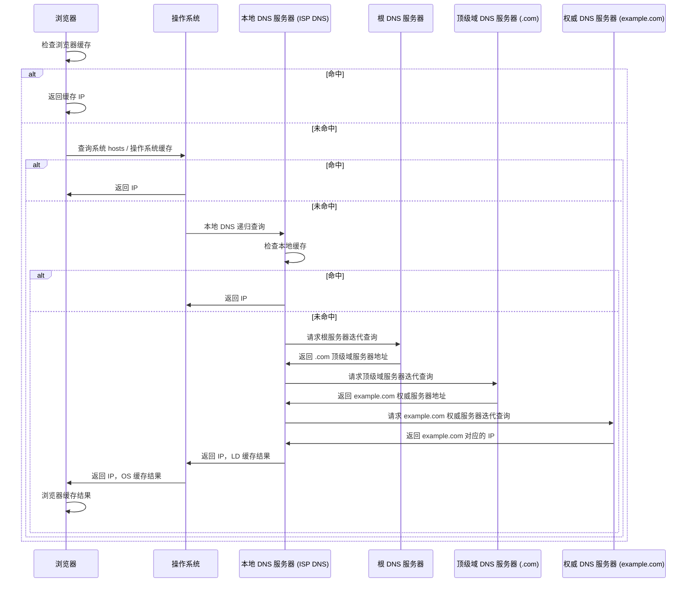

# DNS 解析

## ⭐ 面试重点速览

| 考察点 | 重要程度 | 面试频率 | 掌握目标 |
|--------|----------|----------|----------|
| 完整 DNS 解析流程 | ⭐⭐⭐ | 极高 | 能完整说一遍从浏览器缓存到根服务器 |
| 递归查询 vs 迭代查询 | ⭐⭐⭐ | 极高 | 理解区别，谁对谁用递归 |
| DNS 缓存 | ⭐⭐⭐ | 高 | 缓存层级、TTL 作用 |
| DNS 负载均衡 | ⭐⭐ | 高 | 原理和优缺点 |
| DNS 污染与劫持 | ⭐⭐⭐ | 极高 | 定义、差异、防护方式 |
| HTTPDNS | ⭐⭐⭐ | 高 | 解决了什么问题、原理 |

---

## 一、DNS 是什么

DNS（Domain Name System，域名系统）的作用是**域名 → IP 地址的映射**。人类记住域名比一串 IP 容易多了，但网络传输需要 IP 地址找到服务器。

DNS 可以看作互联网的"电话簿"：你给域名，它返回对应的 IP。

::: tip DNS 默认端口
DNS 使用 UDP 协议，端口 53。DNS 区域传送和大报文使用 TCP 协议，端口也是 53。
:::

---

## 二、完整 DNS 解析流程

从浏览器输入域名到得到 IP，DNS 解析会查询多级缓存和服务器：



完整流程一步步拆解：

### 1. 浏览器缓存

浏览器首先检查自己的缓存：
- 缓存时间由 TTL 控制（Time To Live）
- 过期的 DNS 记录会被清除
- 每个浏览器对缓存大小都有限制

### 2. 操作系统缓存

浏览器缓存找不到，向操作系统查询：
- 操作系统会维护 DNS 缓存
- 检查 `hosts` 文件（Windows 在 `C:\Windows\System32\drivers\etc\hosts`，Linux 在 `/etc/hosts`）
- hosts 文件中配置的域名-IP 映射会优先使用

### 3. 本地 DNS 服务器（LDNS）

操作系统缓存找不到，查询 LDNS。LDNS 一般由运营商提供（电信 DNS、联通 DNS），或者公共 DNS（114.114.114.114、8.8.8.8）。

LDNS 也会检查缓存：
- 如果缓存命中，直接返回 IP
- 如果不命中，开始递归查询

### 4. 根域名服务器查询

根域名服务器是 DNS 体系的最顶层，全球 13 组根服务器。根服务器不知道具体域名对应哪个 IP，只知道顶级域服务器的地址。

根服务器返回对应的顶级域（.com/.cn）服务器地址。

### 5. 顶级域服务器查询

顶级域服务器知道该域名对应的权威 DNS 服务器地址，返回给 LDNS。

### 6. 权威 DNS 服务器查询

权威 DNS 服务器是域名实际管理者维护的 DNS 服务器，存储了该域名的具体记录，直接返回域名对应的 IP。

### 7. 缓存结果

LDNS 收到 IP 后，缓存结果，然后返回给操作系统，操作系统缓存结果，再返回给浏览器，浏览器缓存结果。最终，整个查询完成。

---

## 三、递归查询 vs 迭代查询

这是面试中非常高频的考点，必须分清楚区别。

### 定义对比

| 查询类型 | 定义 | 责任方 |
|----------|------|--------|
| 递归查询 | 如果被查询者不知道答案，就代替请求者向其他服务器查询，最终返回答案给请求者 | 被查询者负责拿答案 |
| 迭代查询 | 如果被查询者不知道答案，只返回下一级服务器地址，请求者自己去问下一级 | 请求者自己负责继续问 |

### 实际查询过程中谁用什么

- **客户端 → LDNS：递归查询** → LDNS 负责拿答案，最后直接给我们返回 IP
- **LDNS → 根、顶级、权威：迭代查询** → LDNS 依次问各级服务器，每级只返回下一级地址，LDNS 自己继续问，直到拿到答案

::: tip 面试口诀
递归：你不知道就帮我问别人，把结果给我。迭代：我不知道，我告诉你谁知道，你自己去问他。
:::

---

## 四、DNS 缓存

DNS 缓存分为多个层级，每一级都缓存，目的是减少 DNS 查询次数，提高解析速度。

| 缓存层级 | 位置 | 作用 |
|----------|------|------|
| 浏览器缓存 | 浏览器进程 | 最快，命中直接返回 |
| 操作系统缓存 | OS 内核 | hosts 文件也在这里 |
| 本地 DNS 缓存 | ISP LDNS | 大部分域名在这里命中 |
| 各级 DNS 服务器缓存 | 根/顶级/权威服务器 | 减少重复查询 |

### TTL（Time To Live）

TTL 就是缓存的过期时间，单位秒：
- TTL 越小，缓存时间越短，更新越快，但查询次数越多
- TTL 越大，缓存命中率越高，但更新慢，切换 IP 时生效慢
- 做域名切换时，一般先调小 TTL，切换完成后再调大

---

## 五、DNS 负载均衡

很多大型网站一台服务器扛不住，有多台服务器。同一个域名对应多个 IP，DNS 可以通过轮询把请求分散到不同服务器上，这就是 DNS 负载均衡。

### 工作原理

```
example.com.  IN  A  1.1.1.1
example.com.  IN  A  2.2.2.2
example.com.  IN  A  3.3.3.3
```

DNS 服务器配置多个 A 记录，每次查询轮询返回不同 IP，不同用户会被分配到不同服务器，实现负载均衡。

### 优缺点

| 优点 | 缺点 |
|------|------|
| 简单，不需要自己做负载均衡 | 不能感知后端节点健康（节点挂了 DNS 还会返回） |
| DNS 就近解析，可以把用户分配到离用户最近的机房 | DNS 缓存会导致负载不均衡 |
| 降低了自建负载均衡的压力 | 粒度粗，只能做轮询，不能根据权重分配 |

### 延伸阅读

DNS 负载均衡通常作为第一层负载均衡，实际应用中一般是：DNS → LVS → Nginx → 应用服务器。参见高并发模块的负载均衡章节。

---

## 六、DNS 污染 vs DNS 劫持

这两个概念面试中经常被混淆，要分清楚区别。

### DNS 污染（DNS Poisoning）

DNS 污染是指攻击者篡改了 DNS 记录，把正确域名映射到错误 IP。通常发生在递归查询过程中，攻击者伪造 DNS 响应，让解析结果错误。

### DNS 劫持

DNS 劫持是运营商或第三方把 DNS 查询结果劫持，重定向到自己的服务器。常见场景：运营商劫持，把不存在的域名解析到广告页面。

### 区别

| DNS 污染 | DNS 劫持 |
|----------|----------|
| 篡改 DNS 响应内容 | 拦截 DNS 查询请求 |
| 攻击者不知道你的请求，提前把错误记录发过来 | 拦截请求，返回错误 IP |
| 一般用于阻止访问特定域名 | 一般用于插入广告、流量劫持 |

### 防护方式

- 使用 HTTPS 加密站点，会被浏览器提示证书错误，用户就能发现问题
- 使用加密 DNS：DNS over TLS (DoT)、DNS over HTTPS (DoH)
- 使用 HTTPDNS（移动端常用），走 HTTP 请求获取解析结果

---

## 七、HTTPDNS

HTTPDNS 是通过 HTTP 请求获取 DNS 解析结果，绕过传统 LDNS。现在各大互联网公司移动端都在使用。

### 传统 DNS 有什么问题？

1. **DNS 劫持**：运营商篡改解析结果，跳转到广告页面
2. **DNS 污染**：返回错误 IP
3. **解析不准确**：LDNS 缓存导致分配不到就近的 IP，影响用户访问速度
4. **更新慢**：TTL 过期才能更新，域名切换慢
5. **UDP 传输**：可能丢包，重试会增加延迟

### HTTPDNS 原理

客户端不向 LDNS 发起 DNS 查询，而是向 HTTPDNS 服务端（通常是云厂商或公司自建）发起 HTTP 请求，请求域名解析，HTTPDNS 直接返回 IP 给客户端。

### HTTPDNS 优缺点

| 优点 | 缺点 |
|------|------|
| 绕过 LDNS，有效防止劫持和污染 | 每次查询都要走 HTTP 请求，有一定开销 |
| 可以根据客户端 IP 精确调度就近节点，提高速度 | 需要客户端配合实现 |
| 解析结果可控，更新快 | 占用 HTTP 连接 |

HTTPDNS 现在是移动端解决 DNS 问题的主流方案。

::: tip 相关链接
HTTPDNS 在移动互联网广泛使用，解决了运营商 DNS 劫持和解析不准的问题，相关技术参见 [CDN 加速](../optimization/cdn.md) 中的动态调度。
:::

---

## 八、DNS 常见记录类型

| 记录类型 | 作用 |
|----------|------|
| A | 域名 → IPv4 地址 |
| AAAA | 域名 → IPv6 地址 |
| CNAME | 域名 → 另一个域名（别名） |
| MX | 邮件交换，指定邮件服务器 |
| NS | 权威域名服务器，指定由哪个 DNS 服务器负责该域名 |
| TXT | 任意文本记录，常用于域名验证（如 SPF、DKIM） |
| PTR | IP 反向解析 → 域名 |

---

## 九、交叉关联到其他模块

- **UDP 协议**：参见 [UDP 协议](../fundamentals/udp.md)，DNS 默认使用 UDP
- **CDN 加速**：参见 [CDN 加速](../optimization/cdn.md)，CDN 依赖 DNS 就近解析
- **负载均衡**：DNS 是第一层负载均衡，参见高并发架构负载均衡章节
- **HTTPS 证书**：参见 [HTTPS 与 TLS](./https-tls.md)，域名验证需要 DNS 配置 TXT 记录

---

## 十、经典高频面试题

### Q1：从输入 URL 到得到 IP，完整的 DNS 解析过程是怎样的？

**参考答案：**
1. 浏览器检查自身缓存，命中则直接返回 IP
2. 浏览器缓存未命中，查询操作系统缓存和 hosts 文件，命中返回 IP
3. 操作系统缓存未命中，向本地 DNS 服务器（LDNS）发起递归查询
4. LDNS 检查自身缓存，命中返回 IP
5. LDNS 缓存未命中，从根域名服务器开始迭代查询：
   - 根服务器返回顶级域服务器地址
   - LDNS 查询顶级域服务器，得到权威服务器地址
   - LDNS 查询权威服务器，得到域名对应的 IP
6. LDNS 缓存结果，返回给操作系统，操作系统缓存
7. 操作系统返回给浏览器，浏览器缓存结果

整个过程一次递归查询（客户端 → LDNS），多级迭代查询（LDNS → 根 → 顶级 → 权威）。

### Q2：递归查询和迭代查询的区别是什么？

**参考答案：**

| 区别 | 递归查询 | 迭代查询 |
|------|----------|----------|
| 定义 | 被查询者不知道答案就帮查询者去问，最后直接返回结果 | 被查询者不知道答案只返回下一级地址，查询者自己去问 |
| 谁辛苦 | 被查询者辛苦，请求者轻松 | 请求者辛苦，被查询者轻松 |
| 实际使用 | 客户端 → LDNS 一般用递归 | LDNS 查询各级 DNS 服务器用迭代 |

口诀：递归：你帮我拿到答案给我。迭代：我不知道，我告诉你谁知道，你自己找他要。

### Q3：什么是 DNS 缓存？TTL 有什么作用？

**参考答案：**
DNS 缓存是各级 DNS 服务器（浏览器缓存、操作系统缓存、LDNS、各级权威服务器）都会缓存 DNS 解析结果，减少重复查询，提高解析速度。

TTL（Time To Live）是缓存的过期时间，单位秒：
- TTL 越小：缓存更新快，但缓存命中率低，查询次数多
- TTL 越大：缓存命中率高，但更新慢，域名切换时生效慢

做域名切换时，一般会先把 TTL 调小，等待旧缓存过期后切换，切换完成再调大 TTL 提高命中率。

### Q4：DNS 污染和 DNS 劫持有什么区别？

**参考答案：**
- **DNS 污染**：攻击者伪造 DNS 响应，把正确域名解析成错误 IP。一般发生在查询过程中，攻击者抢先发送伪造响应。通常用于阻止访问特定域名。
- **DNS 劫持**：运营商或第三方拦截 DNS 查询请求，不按照 DNS 协议返回正确结果，而是把请求重定向到广告页面，或者返回错误 IP。通常用于插入广告、收集用户流量。

防护方式：使用加密 DNS（DoT/DoH）、HTTPDNS 绕过传统 LDNS。

### Q5：什么是 HTTPDNS？解决了什么问题？

**参考答案：**
HTTPDNS 是通过 HTTP 请求向 HTTPDNS 服务端查询域名解析结果，绕过传统本地 DNS 服务器。

解决了传统 DNS 的问题：
1. **DNS 劫持**：运营商劫持返回错误 IP，插入广告
2. **DNS 污染**：返回错误解析结果

3. **调度不准确**：传统 DNS 基于 LDNS 所在位置，不能按真实客户端 IP 就近调度
4. **更新慢**：TTL 导致域名切换生效慢，HTTPDNS 缓存可以实时更新

原理：客户端直接向 HTTPDNS 服务端发起 HTTP 请求，获取域名对应的 IP，不需要走传统 DNS 查询。

### Q6：DNS 负载均衡是什么？优缺点是什么？

**参考答案：**
DNS 负载均衡：同一个域名配置多个 A 记录，对应多个服务器 IP，DNS 查询时轮询返回不同 IP，把请求分散到不同服务器。

优点：
1. 实现简单，不需要额外改造
2. 可以基于地理位置就近调度
3. 降低上游负载均衡的压力

缺点：
1. 不能感知后端节点健康状态，节点下线后 DNS 还会返回 IP
2. DNS 缓存导致负载不均衡，某些节点可能接收更多流量
3. 调度粒度粗，不支持根据后端负载动态调整

实际大型架构中，DNS 负载均衡通常作为第一层，后面再接 LVS/HaProxy/Nginx 做多层负载均衡。
