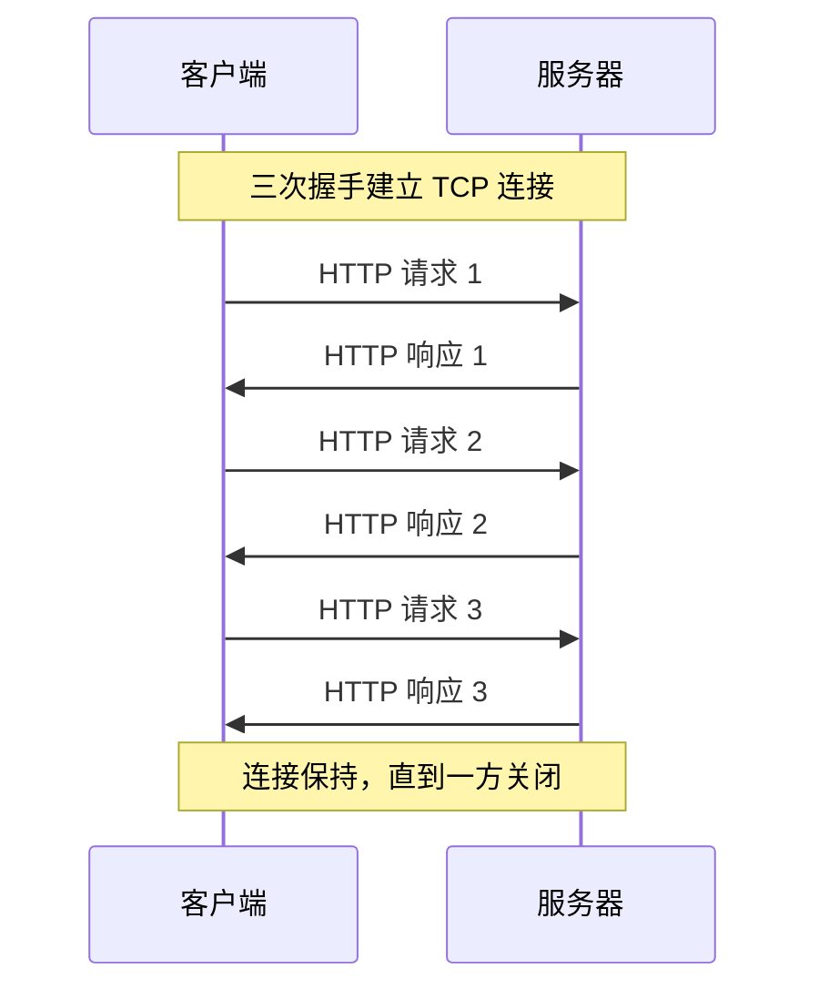
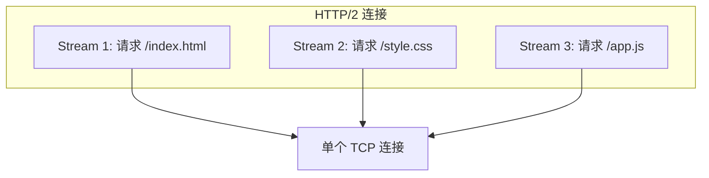
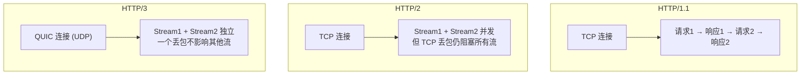

# HTTP 协议演进

## ⭐ 面试重点速览

| 考察点 | 重要程度 | 面试频率 | 掌握目标 |
|--------|----------|----------|----------|
| HTTP/1.0 → 1.1 变化 | ⭐⭐⭐ | 极高 | 长连接、管线化、Host 头 |
| HTTP/1.1 队头阻塞 | ⭐⭐⭐ | 极高 | 理解原因和影响 |
| HTTP/2 多路复用 | ⭐⭐⭐ | 极高 | 二进制分帧、stream、优先级 |
| HTTP/2 头部压缩 | ⭐⭐⭐ | 高 | 理解 HPACK 原理 |
| HTTP/3 与 QUIC | ⭐⭐⭐ | 极高 | 底层改用 UDP、解决队头阻塞 |
| HTTP 无状态 | ⭐⭐ | 高 | Cookie/Session/Token |

---

## 一、HTTP 协议是什么

HTTP（HyperText Transfer Protocol，超文本传输协议）是应用层无状态协议，建立在 TCP 之上，遵循请求-响应模型。

核心特性：

| 特性 | 说明 |
|------|------|
| 无状态 | 服务器不保存客户端状态，每个请求都是独立的 |
| 请求-响应 | 客户端发送请求，服务器返回响应 |
| 基于 TCP | 可靠传输，但存在队头阻塞问题 |
| 可扩展 | 通过首部字段扩展功能 |

---

## 二、HTTP/0.9 (1991) -- 最简原型

HTTP 的第一个版本，非常简陋：

- 只支持 GET 方法
- 没有请求头和响应头
- 服务器只能返回 HTML 字符串
- 响应完成后立即关闭 TCP 连接

请求示例：`GET /index.html`

这就是 HTTP 的雏形，但现在已经见不到了。

---

## 三、HTTP/1.0 (1996) -- 架构建立

HTTP/1.0 引入了现代 HTTP 的核心概念：

| 新增特性 | 说明 |
|----------|------|
| 请求头和响应头 | 可以传递元信息（Content-Type、User-Agent 等） |
| 状态码 | 即 200、404、500 等 |
| POST/HEAD 方法 | 不只是 GET 了 |
| 多内容类型 | 不仅是 HTML，可以传输图片、视频、JSON 等 |

**核心问题：短连接**

HTTP/1.0 默认每个请求建立一次 TCP 连接，响应完成后立即关闭。如果页面需要加载多个资源（CSS、JS、图片），每个资源都要重新三次握手，性能很差。

---

## 四、HTTP/1.1 (1997) -- 经典版本

HTTP/1.1 是目前使用最广泛的 HTTP 版本，核心改进：

### 4.1 长连接（Keep-Alive）

HTTP/1.1 默认开启长连接（`Connection: keep-alive`），一个 TCP 连接可以发送多个 HTTP 请求和响应，连接不会立即关闭，可以被复用。



### 4.2 管线化（Pipelining）

HTTP/1.1 支持管线化，客户端可以一口气发出多个请求，不用等上一个响应回来再发下一个。但服务器必须按照请求顺序返回响应。

::: warning 管线化的问题
管线化有一个关键缺陷：**队头阻塞（Head-of-Line Blocking）**。如果第一个请求处理很慢，后面的请求即使已经处理完也不能返回，必须等第一个返回才能继续。因此管线化在实际中很少被使用，大部分浏览器默认关闭。
:::

### 4.3 Host 头

HTTP/1.1 要求必须包含 Host 头，指定域名。一台服务器可以托管多个域名（虚拟主机），服务器根据 Host 头区分请求是发给哪个站点的。

### 4.4 其他改进

- 新增方法：PUT、DELETE、OPTIONS、TRACE、CONNECT
- 分块传输编码（Chunked Transfer Encoding）
- 断点续传（Range 请求）
- 缓存控制更精细（Cache-Control、ETag）

---

## 五、HTTP/2 (2015) -- 性能革命

HTTP/2 基于 Google 的 SPDY 协议，不以 HTTP/1.1 的文本格式为基础，而是全新的二进制协议。

### 5.1 二进制分帧

HTTP/2 不再使用文本协议，在应用层和传输层之间增加了一个**二进制分帧层**：

| 概念 | 说明 |
|------|------|
| 帧（Frame） | 最小通信单位，每个帧有类型（HEADERS、DATA、SETTINGS 等） |
| 消息（Message） | 一个完整的 HTTP 请求或响应，由多个帧组成 |
| 流（Stream） | 一个双向字节流，承载一个或多个消息，在一条 TCP 连接上可以并发多个流 |



### 5.2 多路复用（Multiplexing）

HTTP/2 的核心特性：一个 TCP 连接上可以同时发送多个请求，多个流之间互不阻塞。

**解决了 HTTP/1.1 的什么问题？**

HTTP/1.1 中，即使开了长连接，请求也是串行的（一个接一个）。管线化理论可以并发，但因为队头阻塞，实际使用效果很差。

HTTP/2 的多路复用真正做到：多个请求同时在一个 TCP 连接上传输，不需要排队。

::: danger 注意
HTTP/2 解决了 HTTP/1.1 的**应用层队头阻塞**，但**TCP 层面的队头阻塞**仍然存在：TCP 是字节流，如果一个 TCP 包丢了，整个 TCP 连接的所有流都会阻塞，等重传完才能继续。这是 HTTP/3 要解决的问题。
:::

### 5.3 头部压缩（HPACK）

HTTP/1.1 中，每次请求都要带上完整的首部（Cookie、User-Agent 等），这些字段在连续请求中可能有大量重复。

HTTP/2 使用 HPACK 算法压缩头部：
- 客户端和服务端各维护一份**头部表**（索引表）
- 已经发送过的头部字段，后续只需发送索引号
- 使用 Huffman 编码进一步压缩

头部压缩可以节省大量带宽，尤其是 Cookie 很大的场景。

### 5.4 服务器推送（Server Push）

服务器可以主动向客户端推送资源。例如，客户端请求 index.html 后，服务器知道这个页面还需要 style.css 和 app.js，可以不等客户端请求就直接推送：

```
客户端请求 GET /index.html →
服务器响应 index.html +
  推送 /style.css +
  推送 /app.js
```

::: tip 服务器推送的实际效果
服务器推送可以减少一次 RTT（客户端不需要先收到 HTML 再请求 CSS/JS），但在实际使用中，推送的资源可能已经被浏览器缓存，造成浪费。HTTP/3 中，服务器推送被移除了，改用 103 Early Hints 替代。
:::

### 5.5 流优先级

HTTP/2 允许客户端设置流的优先级，服务器可以根据优先级决定先响应哪个流。例如，CSS 和 JS 的优先级高于图片。

---

## 六、HTTP/3 (2022) -- 基于 QUIC

HTTP/3 是 HTTP 协议的最新版本，核心变化：**底层传输协议从 TCP 换成了 QUIC（基于 UDP）**。

### 6.1 为什么需要 HTTP/3？

HTTP/2 解决了应用层队头阻塞，但 TCP 层面的队头阻塞仍然存在：

```
TCP 连接上多个 Stream 并发传输
    ↓ 某个 TCP 包丢失
TCP 重传该包 → 所有 Stream 都阻塞等待
    ↓
HTTP/2 的多路复用优势被 TCP 队头阻塞抵消
```

### 6.2 HTTP/3 的核心改进

| 特性 | 说明 |
|------|------|
| 基于 QUIC | 底层使用 UDP，不再用 TCP |
| 0-RTT 握手 | 曾经连接过的客户端可以立即发送数据 |
| 彻底解决队头阻塞 | 每个流独立，一个流丢包不影响其他流 |
| 连接迁移 | 连接不依赖 IP 地址，WiFi 切 4G 不断开 |
| 内置加密 | TLS 1.3 是 QUIC 的一部分，不是可选的 |
| QPACK 头部压缩 | 改进的头部压缩方案，解决 HPACK 的队头阻塞 |



### 6.3 HTTP/3 的现状

- 主流浏览器（Chrome、Firefox、Edge）均已支持 HTTP/3
- 主流 CDN（Cloudflare、Akamai）和云服务商均已支持
- 服务端：Nginx、Caddy、IIS 均已支持 HTTP/3
- 目前 HTTP/3 的普及率正在快速增长

---

## 七、HTTP 版本演进总结

| 版本 | 年份 | 核心改进 | 传输层 |
|------|------|----------|--------|
| 0.9 | 1991 | 仅 GET，只返回 HTML | TCP |
| 1.0 | 1996 | 请求头/响应头、状态码、POST | TCP（短连接） |
| 1.1 | 1997 | 长连接、管线化、Host 头 | TCP（长连接） |
| 2 | 2015 | 二进制分帧、多路复用、HPACK、Server Push | TCP |
| 3 | 2022 | 基于 QUIC、0-RTT、彻底解决队头阻塞 | QUIC（UDP） |

---

## 八、交叉关联到其他模块

- **TCP 协议**：参见 [TCP 协议](../fundamentals/tcp.md)，HTTP/1.1 和 HTTP/2 都是基于 TCP 的
- **UDP 与 QUIC**：参见 [UDP 协议](../fundamentals/udp.md)，HTTP/3 底层使用 QUIC（基于 UDP）
- **HTTPS 与 TLS**：参见 [HTTPS 与 TLS](./https-tls.md)，HTTPS 是 HTTP + TLS 加密
- **DNS 解析**：参见 [DNS 解析](./dns.md)，浏览器发出 HTTP 请求前的 DNS 解析过程
- **WebSocket**：参见 [WebSocket 协议](./websocket.md)，WebSocket 通过 HTTP 升级建立全双工连接

---

## 九、经典高频面试题

### Q1：HTTP/1.0 和 HTTP/1.1 的主要区别是什么？

**参考答案：**
1. **长连接**：HTTP/1.0 默认短连接，每次请求建立新连接；HTTP/1.1 默认长连接（Keep-Alive），一个连接可以复用多次请求
2. **Host 头**：HTTP/1.1 必须包含 Host 头，支持虚拟主机
3. **管线化**：HTTP/1.1 支持管线化，可以连续发送多个请求
4. **缓存控制**：HTTP/1.1 引入了更精细的缓存控制（Cache-Control、ETag）
5. **新增方法**：PUT、DELETE、OPTIONS、CONNECT、TRACE
6. **分块传输**：HTTP/1.1 支持 Chunked Transfer Encoding
7. **断点续传**：HTTP/1.1 支持 Range 请求

### Q2：HTTP/2 相比 HTTP/1.1 有哪些改进？

**参考答案：**
1. **二进制分帧**：不再使用文本协议，基于二进制帧，解析更高效
2. **多路复用**：一个 TCP 连接可以并发多个请求/响应，解决 HTTP/1.1 的应用层队头阻塞
3. **头部压缩**：HPACK 算法压缩请求/响应头，用索引表避免重复发送相同头部
4. **服务器推送**：服务器可以主动推送资源给客户端
5. **流优先级**：客户端可以设置请求优先级，服务器按优先级响应
6. **流量控制**：基于流的流量控制，更精细

### Q3：HTTP/2 的多路复用和 HTTP/1.1 的管线化有什么区别？

**参考答案：**
HTTP/1.1 管线化：
- 可以连续发送多个请求，但响应必须按请求顺序返回
- 如果第一个请求处理慢，后面的响应被阻塞（队头阻塞）
- 实际中很少使用

HTTP/2 多路复用：
- 基于二进制帧和流，多个请求/响应可以交错传输
- 响应不需要按顺序返回，服务器处理完哪个先返回哪个
- 但 TCP 层面仍然存在队头阻塞（HTTP/3 解决）

简单说：管线化是"先进先出"的队列，多路复用是"谁先好谁先走"的并行通道。

### Q4：HTTP/2 既然能多路复用，为什么还需要 HTTP/3？

**参考答案：**
HTTP/2 的多路复用解决了应用层的队头阻塞，但 TCP 层面的队头阻塞仍然存在：

TCP 是字节流，保证数据有序到达。如果 TCP 连接中有一个包丢失，后续所有包都不能被应用层处理，必须等重传完成。这意味着 HTTP/2 的所有流（Stream）都会被阻塞。

HTTP/3 底层使用 QUIC（基于 UDP），每个流独立传输，一个流丢包只影响该流，其他流不受影响。彻底解决了队头阻塞问题。

另外 HTTP/3 还提供了 0-RTT 握手、连接迁移等 TCP 无法实现的特性。

### Q5：HTTP/2 的头部压缩 HPACK 是怎么工作的？

**参考答案：**
HPACK 的核心原理：

1. **静态表**：预定义 61 个常用头部字段的索引（如 :method、:path、:status 等）
2. **动态表**：客户端和服务端各自维护一个动态表，存储已发送的头部字段，后续发送时只需发送索引号
3. **Huffman 编码**：对于不在表中的字段，使用 Huffman 编码进一步压缩

例如，第一次请求发送 `:method: GET`，下次再请求时只需发送对应的索引号（2），而不是完整的字符串。

HPACK 的问题是：动态表依赖有序性，表更新必须按顺序处理，在 HTTP/3 中改用 QPACK，解决了这个问题。

### Q6：HTTP/3 为什么基于 UDP 而不是 TCP？

**参考答案：**
1. **彻底解决队头阻塞**：QUIC 在 UDP 之上实现了多流独立传输，一个流丢包不影响其他流
2. **协议僵化**：TCP 在内核中实现，升级困难，QUIC 在用户态可快速迭代
3. **握手优化**：QUIC 合并传输和加密握手，支持 0-RTT
4. **连接迁移**：QUIC 通过 Connection ID 标识连接，切换网络不中断
5. **中间设备兼容**：很多中间设备对 TCP 选项处理不一致，UDP 报文不受影响