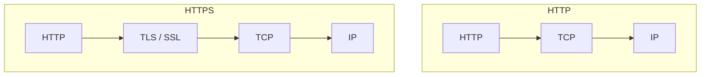
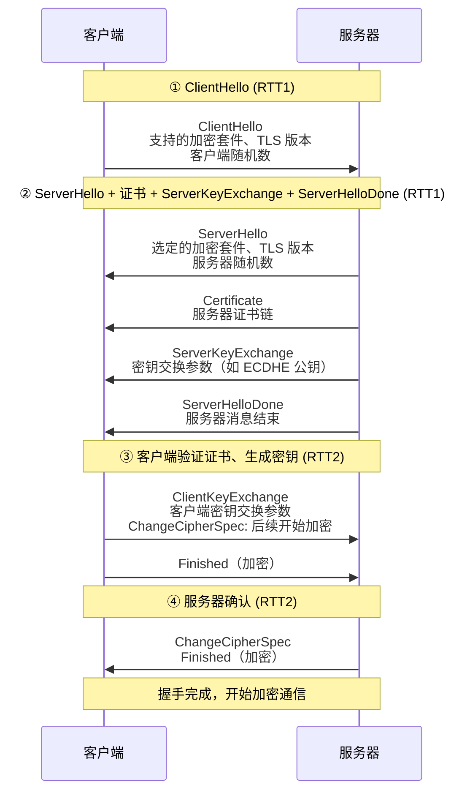
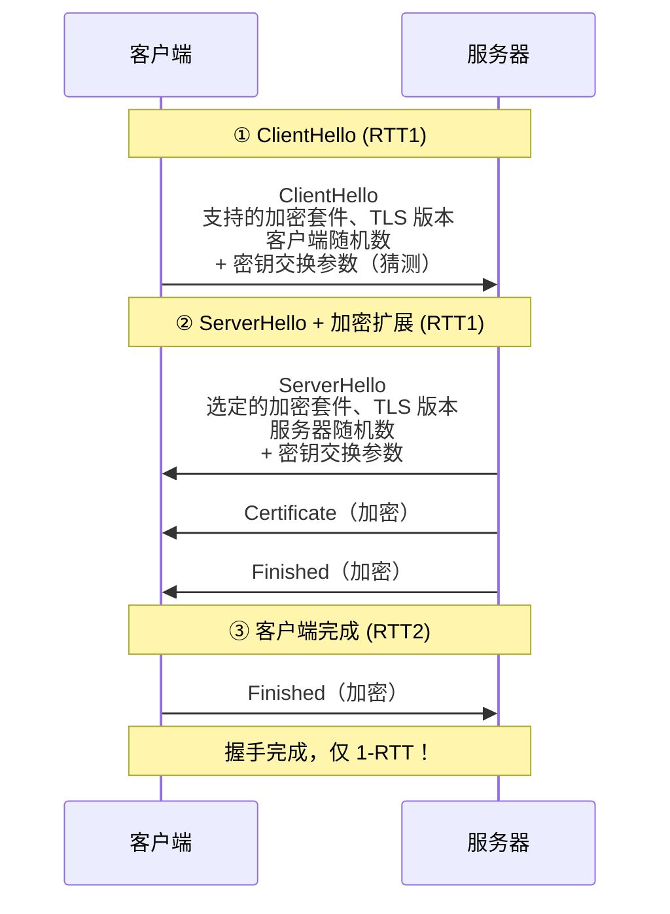

# HTTPS 与 TLS

## ⭐ 面试重点速览

| 考察点 | 重要程度 | 面试频率 | 掌握目标 |
|--------|----------|----------|----------|
| HTTPS 为什么安全 | ⭐⭐⭐ | 极高 | 能说出机密性、完整性、身份认证三个层面 |
| TLS 握手流程 | ⭐⭐⭐ | 极高 | 能画时序图，说明每个步骤的作用 |
| 对称加密 vs 非对称加密 | ⭐⭐⭐ | 极高 | 理解各自用途和性能差异 |
| 证书链与 CA 体系 | ⭐⭐⭐ | 极高 | 理解信任链、中间证书、根证书 |
| TLS 1.2 vs 1.3 | ⭐⭐⭐ | 极高 | 握手简化、前向安全、加密套件 |
| 中间人攻击 | ⭐⭐⭐ | 高 | 理解攻击原理和防护（证书验证） |

---

## 一、HTTPS 是什么

HTTPS = HTTP over TLS（Transport Layer Security），在 HTTP 和 TCP 之间插入 TLS 加密层，提供三大安全保障：

| 保障 | 含义 | 实现方式 |
|------|------|----------|
| 机密性 | 数据被加密，第三方无法窃听 | 对称加密（AES 等） |
| 完整性 | 数据未被篡改 | 消息认证码（MAC/HMAC） |
| 身份认证 | 确认通信对象是真实的服务器 | 数字证书（CA 体系） |



---

## 二、密码学基础概念

### 2.1 对称加密

加密和解密使用**同一个密钥**。

**优点：** 速度快，适合大量数据加密。
**缺点：** 密钥管理困难，密钥需要安全地传递给通信双方。

常见算法：AES（最常用）、ChaCha20、DES（已淘汰）。

### 2.2 非对称加密

使用**一对密钥**：公钥加密，私钥解密；私钥签名，公钥验签。

**优点：** 不需要安全传递密钥，公钥可以公开。
**缺点：** 速度慢，不适合大量数据加密。

常见算法：RSA、ECDSA（椭圆曲线）、Ed25519。

### 2.3 混合加密

HTTPS 实际使用的是**混合加密**：用非对称加密传递对称密钥，用对称加密传输数据。

```
非对称加密（RSA/ECDSA）
    → 安全传递对称密钥（会话密钥）
        → 对称加密（AES）
            → 快速加密大量数据
```

---

## 三、TLS 1.2 握手流程

TLS 1.2 是最广泛使用的版本，完整握手通常需要 2 个 RTT：



### 握手关键步骤

1. **ClientHello**：客户端发起连接，发送支持的加密套件列表、TLS 版本、客户端随机数
2. **ServerHello**：服务器选择加密套件，返回服务器随机数
3. **Certificate**：服务器发送证书链（公钥 + 身份信息 + CA 签名）
4. **ServerKeyExchange**：密钥交换参数（ECDHE 公钥）
5. **ClientKeyExchange**：客户端密钥交换参数
6. **生成会话密钥**：双方各自用客户端随机数 + 服务器随机数 + 密钥交换参数，通过 PRF 函数生成会话密钥
7. **Finished**：双方发送 Finished 消息，确认握手成功

::: tip 会话密钥
会话密钥由客户端随机数 + 服务器随机数 + 预主密钥（Pre-Master Secret）通过 PRF 函数生成。双方各自计算，不需要传输会话密钥本身。
:::

---

## 四、证书链与 CA 体系

### 4.1 为什么需要证书？

服务器把自己的公钥发给客户端，客户端怎么知道这个公钥真的是服务器的，而不是中间人伪造的？答案就是**数字证书**。

### 4.2 证书链结构

```
根 CA 证书（自签名，预装在操作系统/浏览器中）
  ↓ 签名
中间 CA 证书
  ↓ 签名
服务器证书（终端实体证书）
```

验证流程：
1. 客户端收到服务器证书
2. 用中间 CA 的公钥验证服务器证书的签名
3. 用根 CA 的公钥验证中间 CA 证书的签名
4. 根 CA 证书预装在系统中，天然信任

::: danger 证书链断裂
如果中间证书缺失（服务器只发了终端证书），浏览器会报证书错误。这就是为什么服务器配置 HTTPS 时需要配置完整的证书链。
:::

### 4.3 CA 体系

CA（Certificate Authority）是证书颁发机构，负责：
- 验证申请者身份（域名所有权、企业身份等）
- 签发数字证书
- 维护 CRL（证书吊销列表）和 OCSP（在线证书状态协议）

常见 CA：DigiCert、Let's Encrypt（免费）、Sectigo、GlobalSign。

---

## 五、TLS 1.2 vs TLS 1.3

TLS 1.3 是 2018 年发布的重大更新，大幅简化握手流程：



### 核心差异

| 对比维度 | TLS 1.2 | TLS 1.3 |
|----------|---------|---------|
| 握手 RTT | 2-RTT | 1-RTT（0-RTT 可选） |
| 加密套件 | 30+ 种，很多不安全 | 5 种，都是安全的 |
| 密钥交换 | 支持 RSA（无前向安全） | 仅支持 ECDHE（前向安全） |
| 加密范围 | 握手后开始加密 | 握手消息也加密 |
| 0-RTT | 不支持 | 重连时 0-RTT 发送数据 |

### 前向安全（Forward Secrecy）

**前向安全**：即使服务器的私钥在未来被泄露，过去的通信内容也无法被解密。

- TLS 1.2 中 RSA 密钥交换没有前向安全（私钥泄露后所有历史会话可解密）
- TLS 1.3 强制使用 ECDHE 密钥交换，每次会话生成一个临时密钥对，会话结束后销毁，私钥泄露不影响历史会话

::: warning 重要
面试中经常问"TLS 1.2 和 TLS 1.3 的区别"，前向安全是核心考点，一定要能解释清楚。
:::

---

## 六、中间人攻击（MITM）

### 6.1 攻击原理

中间人攻击：攻击者插入到客户端和服务器之间的通信中，对客户端伪装成服务器，对服务器伪装成客户端，从而窃取或篡改数据。

### 6.2 HTTPS 如何防御

HTTPS 通过证书体系防止中间人攻击：
- 中间人无法伪造由可信 CA 签名的正确证书
- 客户端验证证书时，会检查证书链是否合法、证书是否被吊销
- 如果证书不合法，浏览器会显示安全警告

::: danger 注意
HTTPS 不能防御所有中间人攻击。如果用户忽略了浏览器安全警告，或者系统中的根证书被篡改（如安装恶意根证书），HTTPS 也会被绕过。
:::

---

## 七、交叉关联到其他模块

- **HTTP 协议**：参见 [HTTP 协议演进](./http.md)，HTTPS 是 HTTP + TLS 加密
- **TCP 协议**：参见 [TCP 协议](../fundamentals/tcp.md)，HTTPS 在 TCP 三次握手后进行 TLS 握手
- **DNS 解析**：参见 [DNS 解析](./dns.md)，HTTPS 证书中的域名验证依赖 DNS
- **高并发安全**：参见高并发模块中的网络安全章节，TLS 配置和证书管理

---

## 八、经典高频面试题

### Q1：HTTPS 为什么安全？它解决了什么问题？

**参考答案：**
HTTPS 通过 TLS 协议提供了三大安全保障：

1. **机密性**：使用对称加密（AES 等）加密通信内容，第三方即使截获数据也无法解密。密钥通过非对称加密安全传递。
2. **完整性**：使用 MAC（消息认证码）校验数据是否被篡改，任何篡改都会被检测到。
3. **身份认证**：通过 CA 签发的数字证书，客户端可以验证服务器的真实身份，防止中间人攻击。

### Q2：描述一下 TLS 1.2 的完整握手流程？

**参考答案：**
TLS 1.2 握手需要 2 个 RTT：

1. **ClientHello**：客户端发送支持的 TLS 版本、加密套件列表、客户端随机数
2. **ServerHello + Certificate + ServerKeyExchange + ServerHelloDone**：服务器选择加密套件，返回服务器随机数、证书链、密钥交换参数
3. **ClientKeyExchange + ChangeCipherSpec + Finished**：客户端验证证书，发送密钥交换参数，生成会话密钥，发送加密的 Finished
4. **ChangeCipherSpec + Finished**：服务器也生成会话密钥，发送加密的 Finished

之后双方使用对称加密的会话密钥进行通信。

### Q3：TLS 1.2 和 TLS 1.3 的主要区别是什么？

**参考答案：**
1. **握手 RTT**：TLS 1.2 需要 2-RTT，TLS 1.3 只需 1-RTT（支持 0-RTT）
2. **加密套件**：TLS 1.2 支持 30+ 种，TLS 1.3 精简到 5 种安全套件
3. **前向安全**：TLS 1.2 支持 RSA 密钥交换（无前向安全），TLS 1.3 强制 ECDHE（前向安全）
4. **加密范围**：TLS 1.3 握手消息也加密，TLS 1.2 握手消息明文
5. **废弃算法**：TLS 1.3 移除了 RSA 密钥交换、SHA-1、RC4、CBC 模式等不安全算法
6. **0-RTT**：TLS 1.3 支持 0-RTT 重连，曾经连接过的客户端可以立即发送数据

### Q4：什么是证书链？浏览器如何验证证书的合法性？

**参考答案：**
证书链是由 CA 体系构建的信任链：根 CA 证书 → 中间 CA 证书 → 服务器证书。

浏览器验证流程：
1. 检查证书是否在有效期内
2. 检查证书的域名是否与访问的域名一致
3. 用中间 CA 的公钥验证服务器证书的签名
4. 用根 CA 的公钥验证中间 CA 证书的签名
5. 根 CA 证书预装在操作系统/浏览器中，是信任锚点
6. 检查证书是否被吊销（CRL 或 OCSP）

如果任何一步验证失败，浏览器会显示安全警告。

### Q5：什么是前向安全（Forward Secrecy）？为什么重要？

**参考答案：**
前向安全：即使服务器的私钥在未来被泄露，过去的通信内容也无法被解密。

实现原理：使用临时密钥对（ECDHE）进行密钥交换，每次会话生成一个临时的公私钥对，会话结束后立即销毁私钥。会话密钥由临时私钥参与生成，即使服务器长期私钥泄露，也无法解密历史会话。

为什么重要：
- 防止"先存后解"攻击：攻击者可能先存储加密流量，等未来私钥泄露后再解密
- TLS 1.3 强制使用 ECDHE，确保所有连接都有前向安全
- TLS 1.2 中如果使用 RSA 密钥交换，没有前向安全

### Q6：什么是中间人攻击？HTTPS 如何防止？

**参考答案：**
中间人攻击：攻击者插入到客户端和服务器之间，分别与双方建立连接，窃取或篡改通信内容。

HTTPS 通过证书体系防止：
1. 服务器必须提供由可信 CA 签名的证书
2. 客户端验证证书的合法性（证书链、有效期、域名匹配）
3. 中间人无法伪造由可信 CA 签名的证书，即使伪造了也会被客户端检测到

但 HTTPS 不能防御所有情况：如果用户忽略安全警告、系统根证书被篡改、CA 被攻破，HTTPS 仍然可能被绕过。HSTS 和 Certificate Transparency 可以进一步增强安全性。