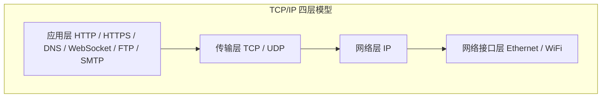

# 应用层协议总览

## ⭐ 面试重点速览

| 考察点 | 重要程度 | 面试频率 | 掌握目标 |
|--------|----------|----------|----------|
| HTTP 协议演进 | ⭐⭐⭐ | 极高 | 能说出 1.0→1.1→2→3 核心变化 |
| HTTPS 与 TLS 握手 | ⭐⭐⭐ | 极高 | 能画时序图，理解证书链 |
| DNS 解析流程 | ⭐⭐⭐ | 极高 | 从浏览器缓存到根服务器完整链路 |
| WebSocket vs HTTP | ⭐⭐ | 高 | 理解全双工通信、握手协议升级 |
| HTTP 状态码 | ⭐⭐⭐ | 极高 | 1xx~5xx 分类，常见状态码含义 |

---

## 一、应用层在 TCP/IP 中的地位

应用层是 TCP/IP 模型的最上层，直接为用户或应用程序提供网络服务。应用层协议定义了应用进程之间通信的规则。



应用层协议**不关心底层是 TCP 还是 UDP**，只需要知道传输层提供的接口（面向连接还是无连接、可靠还是不可靠），然后在上层设计自己的通信规则。

---

## 二、常见应用层协议一览

| 协议 | 端口 | 传输层 | 核心特点 | 面试重点 |
|------|------|--------|----------|----------|
| HTTP | 80 | TCP | 无状态、请求-响应 | 版本演进、缓存、状态码 |
| HTTPS | 443 | TCP + TLS | HTTP + 加密 + 认证 | TLS 握手、证书、HTTPS 原理 |
| DNS | 53 | UDP/TCP | 域名到 IP 的映射 | 解析流程、缓存、负载均衡 |
| WebSocket | 80/443 | TCP | 全双工、长连接 | 握手升级、帧结构、心跳 |
| FTP | 20/21 | TCP | 文件传输协议 | 主动/被动模式 |
| SMTP | 25 | TCP | 邮件发送 | 协议流程 |
| DHCP | 67/68 | UDP | 动态 IP 分配 | 四个步骤 |
| NTP | 123 | UDP | 时间同步 | 同步原理 |

---

## 三、应用层协议设计中的常见模式

### 3.1 请求-响应模式

HTTP 的典型模式：客户端发送请求，服务器返回响应，一问一答。

**特点：**
- 简单直接，容易理解
- 客户端主动、服务器被动
- 不适合服务器需要主动推送的场景

### 3.2 发布-订阅模式

WebSocket 可以实现：客户端订阅某类消息，服务器在有新消息时主动推送给订阅者。

**特点：**
- 服务器可以主动推送
- 需要维持长连接
- 适合实时消息推送

### 3.3 短连接 vs 长连接

| 模式 | 特点 | 典型协议 |
|------|------|----------|
| 短连接 | 每次请求建立连接，用完关闭 | HTTP/1.0、DNS(UDP) |
| 长连接 | 连接保持，复用多次请求 | HTTP/1.1 Keep-Alive、WebSocket、数据库连接 |

### 3.4 无状态 vs 有状态

| 模式 | 特点 | 典型协议 |
|------|------|----------|
| 无状态 | 每个请求独立，不依赖上下文 | HTTP、DNS |
| 有状态 | 需要维护会话状态 | WebSocket、FTP |

::: tip HTTP 的无状态设计
HTTP 被设计为无状态协议，每次请求都是独立的。虽然这简化了服务器实现，但业务需要状态时，必须通过 Cookie、Session、Token 等机制来维护。
:::

---

## 四、本模块学习路径

应用层协议是面试中网络部分最重要的内容，建议按以下顺序学习：

```
HTTP 协议演进（1.0 → 1.1 → 2 → 3）
    ↓
HTTPS 与 TLS（加密原理、握手流程、证书体系）
    ↓
DNS 解析（递归、缓存、负载均衡、安全）
    ↓
WebSocket（全双工通信、与 HTTP 长轮询的区别）
```

::: tip 建议
先把 HTTP 和 HTTPS 彻底搞懂，这两个是面试最高频考点。DNS 和 WebSocket 也经常被问到，但深度不如 HTTP/HTTPS。
:::

---

## 五、与其他模块的交叉关联

- **TCP 协议**：参见 [TCP 协议](../fundamentals/tcp.md)，HTTP/HTTPS/WebSocket 都是基于 TCP 的
- **UDP 协议**：参见 [UDP 协议](../fundamentals/udp.md)，DNS 默认使用 UDP，QUIC 基于 UDP
- **前端浏览器**：HTTP 缓存、Cookie、跨域等，参见前端浏览器模块
- **Java IO/NIO**：参见 [Java 进阶：IO/NIO](../../java-advanced/io-nio/nio.md)，应用层协议的实际编程实现
- **高并发架构**：负载均衡、CDN 等，参见高并发模块

---

## 六、经典高频面试题

### Q1：应用层协议和传输层协议的关系是什么？

**参考答案：**
传输层协议（TCP/UDP）提供端到端的数据传输服务，屏蔽了底层网络的复杂性。应用层协议建立在传输层之上，定义了应用程序之间通信的规则（数据格式、请求-响应顺序、状态管理）。

例如 HTTP 应用层协议定义了请求方法、状态码、首部字段等规则，底层使用 TCP 提供的可靠传输服务。HTTP 不关心数据怎么可靠到达，它只关心到达后怎么解析和处理。

### Q2：HTTP 状态码 1xx、2xx、3xx、4xx、5xx 分别代表什么？

**参考答案：**

| 分类 | 含义 | 常见状态码 |
|------|------|-----------|
| 1xx | 信息响应 | 100 Continue（继续发送）、101 Switching Protocols（协议切换，WebSocket 升级） |
| 2xx | 成功 | 200 OK、201 Created、204 No Content |
| 3xx | 重定向 | 301 永久重定向、302 临时重定向、304 Not Modified（协商缓存） |
| 4xx | 客户端错误 | 400 Bad Request、401 Unauthorized、403 Forbidden、404 Not Found |
| 5xx | 服务器错误 | 500 Internal Server Error、502 Bad Gateway、503 Service Unavailable、504 Gateway Timeout |

### Q3：HTTP 长连接和短连接的区别？什么时候用哪种？

**参考答案：**
- **短连接**：每次请求建立 TCP 连接，响应完成后关闭。HTTP/1.0 默认短连接。
- **长连接**：一次 TCP 连接可以发送多个请求和响应。HTTP/1.1 默认长连接（Connection: keep-alive）。

长连接的优势：减少 TCP 建立和关闭的开销，提高吞吐量，适合频繁请求的场景（如 Web 页面加载多个资源）。

短连接的优势：简单，服务器不用维护连接状态，适合低频请求。

### Q4：DNS 使用的端口是什么？为什么用 UDP？

**参考答案：**
DNS 默认使用 UDP 53 端口进行域名解析查询。原因：
1. DNS 报文通常很小（不超过 512 字节），UDP 单报文即可容纳
2. 请求-响应模式，一个来回，UDP 无连接特性非常适合
3. 如果丢包，客户端可以重试，不需要 TCP 的可靠性
4. 无连接，开销小，单服务器可处理大量并发查询

DNS 在区域传送（Zone Transfer）和响应超过 512 字节时使用 TCP 53 端口。

### Q5：WebSocket 和 HTTP 的关系是什么？各自的适用场景？

**参考答案：**
关系：
- WebSocket 通过 HTTP 协议发起握手（Upgrade 头），握手成功后升级为 WebSocket 协议
- 两者都基于 TCP，但 WebSocket 是全双工的，HTTP 是请求-响应模式
- WebSocket 使用 ws://（80）和 wss://（443）协议

适用场景：
- HTTP：请求-响应模式，适合客户端主动拉取数据的场景（网页浏览、API 调用、文件下载）
- WebSocket：全双工，适合服务器需要主动推送的场景（在线聊天、实时通知、股票行情、在线协作）

### Q6：说说 HTTP/2 和 HTTP/3 的主要改进？

**参考答案：**
HTTP/2 主要改进：
- **二进制分帧**：不再用文本协议，用二进制帧，解析更高效
- **多路复用**：一个 TCP 连接可以并发多个请求，解决 HTTP/1.1 的队头阻塞（应用层）
- **头部压缩**：HPACK 算法压缩请求/响应头，减少带宽
- **服务器推送**：服务器可以主动推送资源给客户端

HTTP/3 主要改进：
- **底层改用 QUIC（基于 UDP）**：彻底解决 TCP 的队头阻塞问题
- **0-RTT 握手**：曾经连接过的客户端可以立即发送数据
- **连接迁移**：网络切换时连接不中断
- **内置加密**：TLS 1.3 是 QUIC 的一部分，不是可选的