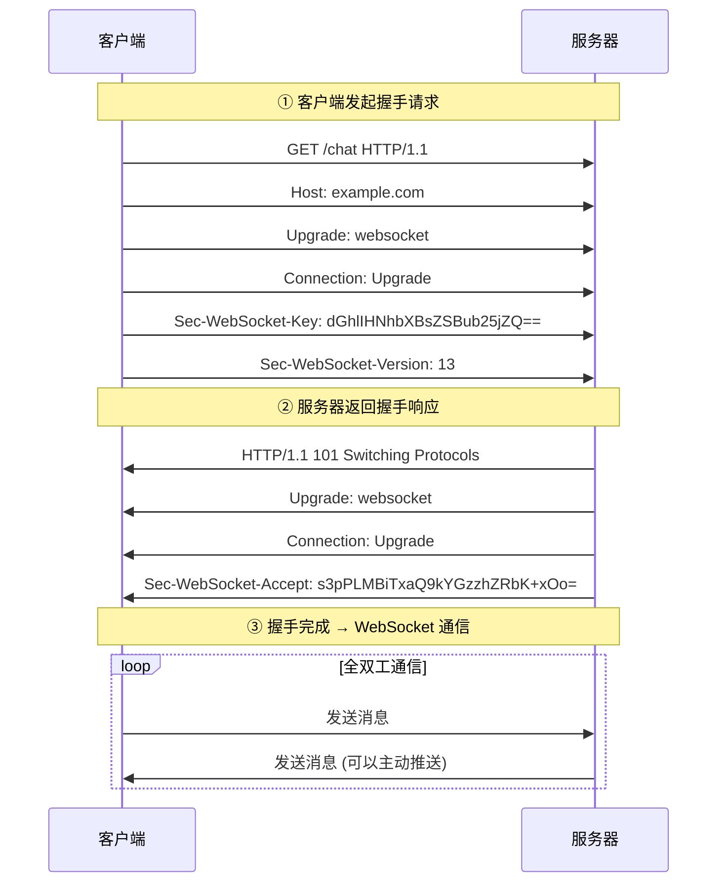

# WebSocket 协议

## ⭐ 面试重点速览

| 考察点 | 重要程度 | 面试频率 | 掌握目标 |
|--------|----------|----------|----------|
| WebSocket 握手流程 | ⭐⭐⭐ | 极高 | 理解 HTTP 升级协议过程 |
| WebSocket vs HTTP | ⭐⭐⭐ | 极高 | 全双工 vs 请求-响应对比 |
| WebSocket vs 长轮询 | ⭐⭐⭐ | 高 | 优缺点对比 |
| WebSocket 帧结构 | ⭐⭐ | 高 | 控制帧、数据帧、掩码 |
| 心跳保活机制 | ⭐⭐⭐ | 极高 | 为什么需要心跳、怎么实现 |
| 断线重连 | ⭐⭐ | 高 | 常见策略 |

---

## 一、WebSocket 是什么

WebSocket 是 HTML5 推出的**全双工通信协议**，基于 TCP，建立在 HTTP 握手之后。

核心特点：

| 特点 | 说明 |
|------|------|
| 全双工 | 客户端和服务器可以同时主动发送消息 |
| 长连接 | 连接建立后一直保持，不需要每次请求重新建立连接 |
| 基于 HTTP 握手 | 通过 HTTP/HTTPS 发起握手，协议升级后切换到 WebSocket |
| 低开销 | 头部很小，比 HTTP 请求头小很多 |
| 支持二进制 | 原生支持二进制和文本消息 |

为什么需要 WebSocket？HTTP 是**请求-响应模型**，只能客户端主动发请求，服务器不能主动推送给客户端。要实现服务器主动推送，以前只能用**长轮询**：客户端轮询，每隔几秒发起一次请求，服务器如果有新消息就返回，没有就返回空。这样：
- 浪费带宽，很多轮询是没有消息的空请求
- 延迟高，有消息了也要等下一次轮询
- 连接建立开销大

WebSocket 建立一次连接就一直保持，服务器有消息直接发，解决了这些问题。

---

## 二、WebSocket 握手流程

WebSocket 握手基于 HTTP 协议，客户端发起 HTTP 请求，服务器同意后协议升级为 WebSocket。



### 关键请求头解释

| 请求头 | 作用 |
|--------|------|
| `Upgrade: websocket` | 告诉服务器要升级到 WebSocket 协议 |
| `Connection: Upgrade` | Connection 也要设置 Upgrade，告诉服务器连接需要升级 |
| `Sec-WebSocket-Key` | 随机生成的 base64 编码的密钥，服务器用来生成 accept 验证 |
| `Sec-WebSocket-Version` | WebSocket 版本，通常是 13 |

### 服务器验证

服务器收到 `Sec-WebSocket-Key` 后，做这个计算：

```
accept = base64( sha1( key + "258EAFA5-E914-47DA-95CA-C5AB0DC85B11" ) )
```

把结果放在 `Sec-WebSocket-Accept` 头中返回给客户端，客户端验证这个值对不对。这样可以防止老的 HTTP 服务器把请求当成普通 HTTP 处理，也防止缓存攻击。

### 101 状态码

HTTP 状态码 `101 Switching Protocols` 表示服务器同意切换协议，握手完成，之后就走 WebSocket 帧格式通信了。

::: tip 握手在 HTTPS 上
如果是 `wss://`（WebSocket over TLS），握手走 HTTPS，和上面流程一样，只是加密传输。
:::

---

## 三、WebSocket 帧结构

WebSocket 通信是以**帧**为单位，分为数据帧和控制帧。

### 帧格式概览

```
 0                   1                   2                   3
 0 1 2 3 4 5 6 7 8 9 0 1 2 3 4 5 6 7 8 9 0 1 2 3 4 5 6 7 8 9 0 1
+-+-+-+-+---------------------------------+-----------------------+
|FIN|RSV1|opcode|                   MASK                          |
|(1)|(1)(1)(1)|(4)                          (1 bit)               |
+-+-+-+-+---------------------------------+-----------------------+
|                     Payload length (7 / 7+16 / 7+64)           |
+---------------------------------------------------------------+
|               Masking-key (仅客户端→服务器有这个字段)          |
+---------------------------------------------------------------+
|                         Payload data                           ...
+---------------------------------------------------------------+
```

### 关键字段说明

| 字段 | 长度 | 作用 |
|------|------|------|
| FIN | 1 位 | 表示这是消息的最后一帧。大消息可以分片，最后一帧 FIN=1 |
| opcode | 4 位 | 帧类型：0x0=继续帧，0x1=文本帧，0x2=二进制帧，0x8=关闭连接，0x9=ping，0xA=pong |
| MASK | 1 位 | 客户端发送给服务器必须掩码（MASK=1），服务器发送给客户端不需要掩码 |
| Payload length | 7 / 7+16 / 7+64 位 | 负载长度，长度不够就扩展 |
| Masking-key | 32 位 | 掩码密钥，客户端发送必须有 |
| Payload data | 可变 | 实际数据 |

### 为什么客户端发送必须掩码？

为了防止缓存投毒攻击（Cache Poisoning）。浏览器在同一个连接发送多种数据，如果不掩码，攻击者可以预测下一个字节，构造请求污染缓存。掩码后数据不可预测，防止这种攻击。

服务器发送给客户端不需要掩码，因为不会受到这种攻击。

### 控制帧 vs 数据帧

| 类型 | opcode | 作用 |
|------|--------|------|
| 文本帧 | 0x1 | UTF-8 编码的文本数据 |
| 二进制帧 | 0x2 | 二进制数据 |
| 关闭帧 | 0x8 | 关闭连接 |
| Ping | 0x9 | 心跳探测，对方必须回 Pong |
| Pong | 0xA | 心跳响应 |

Ping/Pong 就是心跳机制的基础。

---

## 四、心跳保活机制

TCP 连接建立后，如果双方长时间不发数据，中间的 NAT 设备、防火墙会因为超时把连接释放。所以 WebSocket 需要心跳机制保持连接存活。

### 为什么需要心跳？

- NAT 超时：中间网络设备不知道连接还在使用，超时就会把映射表项删除，连接就断了
- 检测死连接：如果一方异常退出（网线断了，进程崩了），另一方收不到 FIN 包，还以为连接活着

### 心跳怎么实现？

按照 WebSocket 协议规范：

1. 一方发送 **Ping 帧**（opcode=0x9）
2. 对方必须回 **Pong 帧**（opcode=0xA）
3. 如果一段时间收不到 Pong，说明连接已经死了，主动关闭，尝试重连

一般心跳间隔设置在 30~60 秒，比 NAT 超时时间短一些（NAT 超时一般是几分钟）。

::: tip 应用层心跳 vs TCP 心跳
TCP 本身有 SO_KEEPALIVE 选项，可以做 TCP 层心跳。但：
- TCP 心跳间隔默认时间太长（2 小时）
- TCP 心跳不能检测应用层死锁（进程卡住了但 TCP 还连着）
- WebSocket 应用层心跳更灵活，可以自己控制间隔

所以一般 WebSocket 都会在应用层做 Ping/Pong 心跳。
:::

---

## 五、断线重连

WebSocket 连接断开后，客户端需要自动重连，否则用户要刷新页面才能恢复。常见策略：

### 重连时机

- 收到关闭帧 → 重连
- 心跳超时 → 重连
- 网络异常断开 → 客户端检测到连接断开 → 重连
- 浏览器网络切花（WiFi → 4G） → 重连

### 指数退避重连

直接无限重连会给服务器造成压力，一般使用**指数退避（Exponential Backoff）**：
1. 第一次重连：等待 1s
2. 失败：等待 2s
3. 失败：等待 4s
4. 失败：等待 8s
...
直到最大等待时间（比如 30s）就不再翻倍，保持最大间隔重试

### 常见问题

- 重连后需要重新登录/鉴权吗？一般需要，因为连接变了
- 重连期间消息丢失怎么办？业务层需要做消息补发或拉取
- 多个重连定时器？重连失败前不能再开定时器，避免多个定时器

---

## 六、WebSocket vs HTTP vs 长轮询

### 对比表

| 对比维度 | WebSocket | HTTP | 长轮询 |
|----------|-----------|------|--------|
| 通信模型 | 全双工，双向均可主动发 | 半双工，客户端只能请求-响应 | 半双工，客户端轮询 |
| 连接 | 长连接，一次建立一直保持 | 可长可短，HTTP/1.1 默认长连接 | 每次建立/关闭，或复用长连接 |
| 开销 | 握手一次，后续帧头部很小 | 每个请求都要带完整 HTTP 头 | 每次请求都带完整头，开销大 |
| 延迟 | 服务器有消息立即发，延迟低 | 必须等客户端请求，延迟高 | 延迟取决于轮询间隔 |
| 适用场景 | 实时推送（聊天、通知、行情） | 常规网页浏览、API 调用 | 老旧浏览器不支持 WebSocket |

### 长轮询原理

长轮询：客户端发起请求，服务器如果没有新消息就 hold 住连接不返回，直到有消息返回，客户端处理完再发起下一次请求。

问题：
- 服务器 hold 连接占用资源
- 每个请求还是有 HTTP 头开销
- 如果超时断开，客户端重新发起，效率低

有了 WebSocket 之后，长轮询一般只是作为降级方案（不支持 WebSocket 的老浏览器）。

---

## 七、交叉关联到其他模块

- **HTTP 协议**：参见 [HTTP 协议演进](./http.md)，WebSocket 基于 HTTP 握手升级
- **TCP 协议**：参见 [TCP 协议](../fundamentals/tcp.md)，WebSocket 基于 TCP 长连接
- **HTTPS**：参见 [HTTPS 与 TLS](./https-tls.md)，wss:// 是 WebSocket over TLS
- **Socket 编程**：参见 [Socket 编程](../programming/socket.md)，WebSocket 应用层协议，底层使用 TCP Socket

---

## 八、经典高频面试题

### Q1：WebSocket 和 HTTP 有什么区别？WebSocket 为什么能实现全双工？

**参考答案：**

关系：WebSocket 握手阶段使用 HTTP 协议，握手完成后切换到 WebSocket 帧格式，底层都是基于 TCP。

区别：

| 维度 | WebSocket | HTTP |
|------|-----------|------|
| 通信模型 | 全双工，双方都可以主动发送消息 | 请求-响应模型，只能客户端发请求，服务器响应 |
| 连接 | 长连接，一次握手一直保持 | 可以长连接复用，但每个请求还是独立 |
| 头部开销 | 很小，每个帧只有几个字节 | 每个请求都要带完整 HTTP 头，开销大 |
| 适用场景 | 实时推送（聊天、行情、通知） | 网页浏览、API 调用、静态资源下载 |

WebSocket 为什么能全双工：握手完成后，TCP 连接一直保持，双方随时可以发送数据，不需要一问一答。

### Q2：描述一下 WebSocket 的握手过程？

**参考答案：**
1. 客户端发起 HTTP GET 请求，携带 `Upgrade: websocket`、`Connection: Upgrade` 头，以及随机生成的 `Sec-WebSocket-Key`
2. 服务器收到后，验证请求，计算 `Sec-WebSocket-Accept`（对 key + GUID 做 SHA1 然后 base64）
3. 服务器返回 `101 Switching Protocols` 状态码，携带 `Upgrade`、`Connection`、`Sec-WebSocket-Accept` 头
4. 客户端验证 `Sec-WebSocket-Accept` 正确，握手完成
5. 之后双方使用 WebSocket 帧格式通信，全双工发送消息

### Q3：为什么需要心跳机制？心跳怎么实现？

**参考答案：**
需要心跳的原因：
1. **NAT 超时**：中间 NAT 设备和防火墙，如果连接长时间不发数据，会超时释放连接表项，导致连接中断
2. **检测死连接**：如果一方异常退出（网线断开、进程崩溃），另一方可能收不到 FIN 包，以为连接还活着，需要心跳检测

实现：WebSocket 协议本身定义了 Ping 帧和 Pong 帧：
1. 一方定时发送 Ping 帧（一般 30~60 秒一次）
2. 收到 Ping 帧的一方必须回 Pong 帧
3. 如果连续几次收不到 Pong，认为连接已经断开，主动关闭，触发重连

TCP 本身也有 SO_KEEPALIVE 心跳，但默认间隔太长（2 小时），不能检测应用层问题，所以一般应用层自己做。

### Q4：WebSocket 客户端发送为什么必须掩码？掩码作用是什么？

**参考答案：**
客户端发送给服务器的数据必须做掩码，服务器发送给客户端不需要。掩码作用：防止缓存投毒攻击（Cache Poisoning Attack）。

攻击场景：攻击者控制浏览器发送多个数据，因为数据格式可预测，攻击者可以构造出特定内容，污染代理服务器的缓存，之后访问同一个连接的其他站点也会收到攻击者构造的内容。掩码后数据是随机的，不可预测，防止这种攻击。

### Q5：WebSocket 和长轮询相比有什么优势？

**参考答案：**
| 维度 | WebSocket | 长轮询 |
|------|-----------|--------|
| 开销 | 只需要一次 HTTP 握手，后续头部很小，开销低 | 每次轮询都要带完整 HTTP 头，开销大 |
| 延迟 | 服务器有消息立即推送，延迟极低 | 延迟取决于轮询间隔，间隔越大延迟越高，间隔越小开销越大 |
| 连接资源 | 一个连接一直复用，服务器连接数少 | 很多请求被 hold 住，服务器需要维持大量连接，资源占用大 |
| 实时性 | 好，消息到达立即处理 | 差，必须等下一次轮询 |

长轮询一般只是作为不支持 WebSocket 的老旧浏览器的降级方案。

### Q6：什么情况下 WebSocket 连接会断开？怎么处理？

**参考答案：**
常见断开原因：
1. 一方主动发送关闭帧，正常关闭
2. 网络异常（断网、切网）导致 TCP 断开
3. 心跳超时，检测到死连接主动关闭
4. 中间 NAT 设备/防火墙超时释放连接
5. 服务器重启或进程崩溃

处理方式：客户端实现断线重连机制，一般用指数退避策略：
1. 第一次断开后等 1s 重连
2. 失败翻倍等待时间（2s → 4s → 8s...）
3. 到最大等待时间后保持这个间隔重试
4. 重连成功后重置退避时间
5. 重连成功后，业务层补发断线期间丢失的消息
