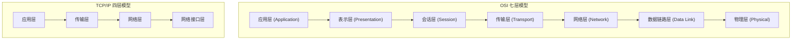

# 计算机网络基础总览

## ⭐ 面试重点速览

| 考察点 | 重要程度 | 面试频率 | 掌握目标 |
|--------|----------|----------|----------|
| OSI / TCP/IP 分层模型 | ⭐⭐⭐ | 极高 | 能默写各层名称、协议、设备 |
| TCP 三次握手/四次挥手 | ⭐⭐⭐ | 极高 | 能口述完整流程+状态转换 |
| HTTP 协议演进 | ⭐⭐⭐ | 极高 | 说出 1.0→1.1→2→3 核心变化 |
| HTTPS 握手流程 | ⭐⭐⭐ | 极高 | 能画时序图解释 |
| DNS 解析过程 | ⭐⭐⭐ | 高 | 从浏览器缓存到根域名服务器完整链路 |

---

## 一、为什么需要计算机网络

计算机网络是后端工程师的"三大基础"之一（另外两个是 Java 基础和数据库）。面试中，计算机网络问题几乎必问，因为：

- 你写的每一行网络请求代码，都依赖 TCP/IP 协议栈
- 微服务之间的通信、RPC 调用、消息队列，底层都是网络
- 性能优化（连接池、HTTP 版本选择、CDN 加速）离不开网络知识
- 线上排障（超时、丢包、连接拒绝）需要网络诊断能力

## 二、OSI 七层模型 vs TCP/IP 四层模型



| 层级 | TCP/IP 模型 | 常见协议 | 典型设备 | 数据单元 |
|------|------------|----------|----------|----------|
| 应用层 | 应用层 | HTTP、HTTPS、DNS、FTP、SMTP | 应用程序 | 消息（Message） |
| 传输层 | 传输层 | TCP、UDP | 四层负载均衡器 | 段（Segment） |
| 网络层 | 网络层 | IP、ICMP、ARP | 路由器、三层交换机 | 包（Packet） |
| 数据链路层 | 网络接口层 | Ethernet、WiFi | 交换机、网桥 | 帧（Frame） |
| 物理层 | 网络接口层 | 光纤、双绞线 | 中继器、集线器 | 比特（Bit） |

::: tip 记忆口诀
从下到上：**物数网传会表应**（物理层、数据链路层、网络层、传输层、会话层、表示层、应用层）
:::

## 三、数据封装与解封装

```
发送端（封装）：
应用层数据 → [TCP头] → [IP头] → [MAC头] → 物理层发出

接收端（解封装）：
物理层接收 → 去掉MAC头 → 去掉IP头 → 去掉TCP头 → 应用层数据
```

::: warning 面试重点
面试官常问："数据从浏览器发出到服务器接收，经历了哪些封装？" 本质是考察你对分层模型的理解。
:::

## 四、本模块学习路径

```
网络基础（本页）→ TCP 协议 → TCP 拥塞控制 → UDP 协议
                                    ↓
应用层总览 → HTTP 协议 → HTTPS/TLS → DNS 解析 → WebSocket
                                    ↓
网络编程（Socket → IO 模型）→ 网络优化（CDN）
```

## 五、与其他模块的关系

- [Java IO/NIO](java-advanced/io-nio/)：IO 多路复用的底层原理
- [前端浏览器 HTTP 缓存](frontend/browser/http-cache)：HTTP 缓存头部
- [高并发架构：负载均衡](high-concurrency/architecture-scaling/load-balancing)：L4 vs L7 负载均衡
- [高并发安全：DDoS/TLS](high-concurrency/security/network-security)：网络安全

---

## 经典高频面试题

### Q1：OSI 七层模型和 TCP/IP 四层模型有什么区别？

**参考答案：**
- OSI 七层是理论模型，由 ISO 制定，分为物理层、数据链路层、网络层、传输层、会话层、表示层、应用层
- TCP/IP 四层是实际使用的模型，分为网络接口层、网络层、传输层、应用层
- TCP/IP 的应用层合并了 OSI 的会话层、表示层、应用层
- TCP/IP 的网络接口层合并了 OSI 的物理层和数据链路层
- OSI 是"先有模型后有协议"，TCP/IP 是"先有协议后有模型"

### Q2：从浏览器输入 URL 到页面加载完成，经历了哪些网络过程？

**参考答案：**
1. 浏览器检查缓存，若有则直接使用（强缓存/协商缓存）
2. DNS 解析：将域名转换为 IP 地址
3. TCP 三次握手建立连接
4. 若为 HTTPS，进行 TLS 握手
5. 发送 HTTP 请求
6. 服务器处理并返回 HTTP 响应
7. 浏览器解析 HTML、CSS、JS，渲染页面
8. TCP 四次挥手释放连接

### Q3：为什么 TCP/IP 模型比 OSI 模型更流行？

**参考答案：**
- TCP/IP 先有协议实现，后有模型归纳，更贴近实际
- TCP/IP 只有四层，更简洁实用
- TCP/IP 是互联网的基础协议，事实标准
- OSI 模型过于复杂，会话层和表示层在实际中很少被独立实现
- OSI 协议栈实现复杂、性能差，没有成功产品

### Q4：什么是数据封装？为什么需要分层？

**参考答案：**
数据封装是指在发送端，每一层协议在数据上添加自己的头部信息（TCP头、IP头、MAC头），逐层包装。接收端再逐层解封装。

分层的意义：
- 各层独立，降低耦合：每层只需关心自己的职责
- 灵活性好：某一层的变化不影响其他层（如 IPv4 升级到 IPv6）
- 易于实现和维护：每层可以独立开发和测试
- 促进标准化：定义清晰的接口，不同厂商可以互操作

### Q5：路由器、交换机、集线器分别工作在 OSI 哪一层？

**参考答案：**
- 集线器（Hub）：物理层，只是简单复制和广播电信号，不识别任何地址
- 交换机（Switch）：数据链路层，通过 MAC 地址转发数据帧
- 路由器（Router）：网络层，通过 IP 地址转发数据包，能够连接不同网络
- 三层交换机：同时具备交换机和路由器的功能，既可以做二层转发，也可以做三层路由