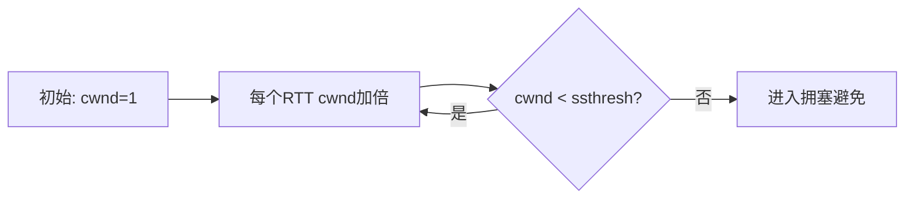
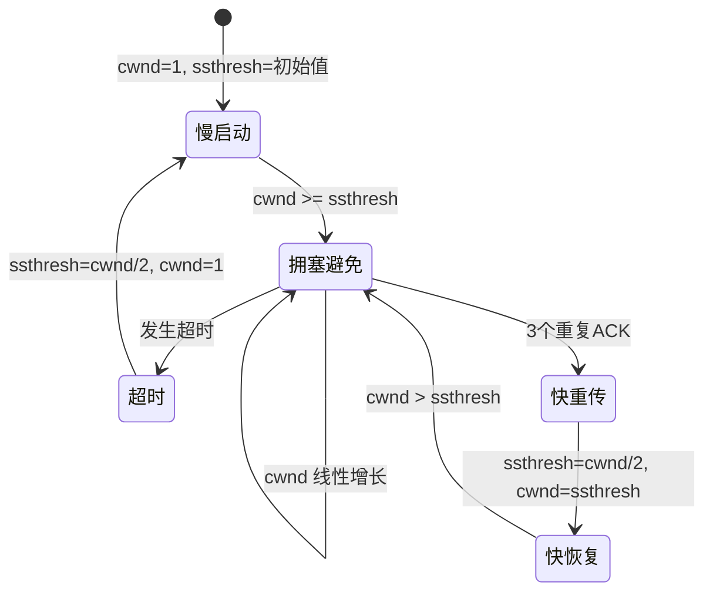

# TCP 拥塞控制

## ⭐ 面试重点速览

| 考察点 | 重要程度 | 面试频率 | 掌握目标 |
|--------|----------|----------|----------|
| 慢启动 vs 拥塞避免 | ⭐⭐⭐ | 极高 | 理解原理、拥塞窗口变化规律 |
| 快重传 vs 快恢复 | ⭐⭐⭐ | 极高 | 触发条件、改进点 |
| 拥塞发生的判断 | ⭐⭐⭐ | 高 | 知道超时和重复确认两种触发方式 |
| BBR 核心思想 | ⭐⭐ | 高 | 理解带宽时延积、模型与传统的区别 |

---

## 一、为什么需要拥塞控制

TCP 要保证可靠传输，但如果发送方一味按照接收方通告的窗口全速发送，很可能导致网络中间的路由器和链路不堪重负，造成严重丢包。

**拥塞控制**和**流量控制**是不同的概念：

| 对比 | 拥塞控制 | 流量控制 |
|------|----------|----------|
| 解决问题 | 网络负载过载导致的拥塞丢包 | 发送方太快淹没接收方 |
| 控制对象 | 发送速率受网络状况限制 | 发送速率接收方处理能力限制 |
| 控制参数 | 拥塞窗口 cwnd | 接收窗口 rwnd |

发送方实际窗口大小：`W = min(cwnd, rwnd)`

::: tip 理解区别
流量控制是端到端的，只看你接收方能不能处理得了；拥塞控制是全局的，要看整个网络能不能扛得住。就算接收窗口很大，网络已经堵死了，发送方也必须减速。
:::

---

## 二、拥塞控制四大核心算法

TCP 拥塞控制发展到现在，主流是四个阶段：**慢启动 → 拥塞避免 → 快重传 → 快恢复**。

### 2.1 慢启动（Slow Start）

连接刚建立时，不知道网络当前的拥塞状况，不能一下子发大量数据，应该试探性地逐步提高发送速率。

**规则：**
- 初始拥塞窗口 `cwnd = 1`（早期），现在一般是 `cwnd = 4~10` MSS（最大报文段长度）
- 每收到一个 ACK 确认，`cwnd += 1`
- 每个 RTT（往返时间）后，`cwnd *= 2` → 指数增长

指数增长很快就会达到一个阈值 `ssthresh`（slow start threshold）：
- `cwnd < ssthresh` → 保持慢启动（指数增长）
- `cwnd == ssthresh` → 进入拥塞避免（线性增长）



### 2.2 拥塞避免（Congestion Avoidance）

过了慢启动阈值后，不再指数增长，改为缓慢线性增长，避免过快导致拥塞。

**规则：**
- 每收到一个 RTT 内的所有确认，`cwnd += 1`
- 不管一个 RTT 内收到多少个 ACK，每个 RTT 只加 1
- cwnd 呈线性增长：`cwnd = cwnd + 1/cwnd` ≈ 每个 RTT +1

这样增长很慢，尽量延迟拥塞发生的时间，找到网络的最大容量。

### 2.3 拥塞发生后的处理

当发生拥塞时，通过什么现象判断？两种情况：

1. **超时重传**：说明网络拥塞很严重，丢包很多
2. **收到三个重复 ACK**：说明只是个别丢包，网络还没到完全拥塞

针对这两种情况，处理方式不同：

#### 情况一：超时触发拥塞
```
1. ssthresh = cwnd / 2       // 阈值减半
2. cwnd = 1                  // 拥塞窗口重置为1
3. 重新进入慢启动阶段
```

#### 情况二：三个重复 ACK 触发（快重传）

**快重传原理：**
接收方收到一个失序报文段后，立刻发出对之前已正确接收报文段的重复确认，而不要等待自己发送数据时才捎带确认。发送方一连收到三个重复确认，就知道有报文段丢了，可以立即重传，不用等超时定时器过期。

快重传之后，进入**快恢复**，而不是慢启动。

**快恢复规则：**
```
1. ssthresh = cwnd / 2       // 阈值还是减半
2. cwnd = ssthresh           // 不是重置到1，直接设为阈值
3. 进入拥塞避免阶段（线性增长）
```

为什么可以不回到慢启动？因为能收到三个重复 ACK，说明网络并没有完全堵死，只是轻微丢包，不需要从 1 开始慢慢涨。



::: tip 原始 Tahoe vs Reno
- TCP Tahoe（早期版本）：不管超时还是三个重复 ACK，都回到慢启动（cwnd=1）
- TCP Reno（主流版本）：超时回慢启动，三个重复 ACK 走快恢复
:::

### 2.4 完整状态变化示例

假设初始：`cwnd = 1`, `ssthresh = 16`

1. 慢启动：1 → 2 → 4 → 8 → 16（指数增长，到达阈值）
2. 进入拥塞避免：16 → 17 → 18 → ... → 24（线性增长）
3. 此时发生拥塞（收到三个重复 ACK）：
   - `ssthresh = 24 / 2 = 12`
   - `cwnd = 12`
   - 进入拥塞避免，继续线性增长
4. 如果这次是超时发生拥塞：
   - `ssthresh = 24 / 2 = 12`
   - `cwnd = 1`
   - 重新进入慢启动

---

## 三、经典拥塞控制算法演进

| 版本 | 核心改进 |
|------|----------|
| TCP Tahoe | 慢启动 + 拥塞避免，都回到 cwnd=1 |
| TCP Reno | 加入快重传 + 快恢复，三个重复 ACK 不回 1 |
| TCP NewReno | 改进快恢复，处理多个丢包，partial ACK 处理 |
| Cubic | 二进制增长，延迟敏感长肥管道更友好，Linux 默认 |
| BBR | 基于模型的拥塞控制，不依赖丢包判断，Google 推出 |

### CUBIC 算法简介

Cubic 是 Linux 内核默认的拥塞控制算法，主要改进：

- 不再是线性增长，而是**三次函数增长**
- 增长曲线更平滑，在长肥管道（长带宽时延积网络）下更公平
- RTT 不同的流之间公平性更好
- 能更快利用空闲带宽，也能在拥塞时更平稳减速

---

## 四、BBR 拥塞控制

BBR（Bottleneck Bandwidth and Round-trip propagation time）是 Google 在 2016 年提出的新型拥塞控制算法，现在已经广泛应用（YouTube、Google Cloud、Android 等）。

### 4.1 BBR 解决了什么问题？

传统拥塞控制（Reno、Cubic）都是通过**丢包**来判断拥塞：只要丢包就认为网络拥塞了，必须减速。

但现代互联网环境下：
- 很多丢包不是因为拥塞，而是**链路随机丢包**（无线链路）
- 缓存都很大，不丢包不代表没有排队延迟
- 传统算法会因为偶尔丢包就大幅度减速，吞吐量上不去

BBR 的核心思想：**不通过丢包判断拥塞，而是直接测量瓶颈带宽和传播时延，基于模型控制发送速率**。

### 4.2 BBR 核心模型

BBR 的核心是维护两个估计：
1. **BtlBw**：Bottleneck Bandwidth，最近 RTT 内测得的瓶颈带宽（最大能传多少）
2. **RTprop**：Round-trip propagation time，最小传播时延（不排队情况下的 RTT）

然后计算出**带宽时延积 BDP**：`BDP = BtlBw × RTprop`

发送窗口：`cwnd = BDP × gain` → gain 是增益系数，用来控制填充程度

BDP 就是网络管道能容纳的飞行中（in-flight）数据量。BBR 目标就是让管道里正好放 BDP 这么多数据，不多也不少。

### 4.3 BBR 工作周期

BBR 运行分为两个阶段交替：

1. **Startup 启动阶段**：类似慢启动，指数速率探测带宽，直到速率停止增长，说明找到瓶颈了
2. **Drain 排空阶段**：把发送速率降到 BDP，排空队列
3. **ProbeBW 探测带宽**：在一个周期内，稍微加大一点速率探测是否有更多带宽可用，如果有就更新 BtlBw
4. **ProbeRTT 探测RTT**：主动把 cwnd 降下来，测量最小 RTT，更新 RTprop

和传统算法比：
- 不依赖丢包，对随机丢包更鲁棒
- 在高带宽长时延链路（长肥网）下吞吐量更高
- 排队延迟更小，延迟更低
- 移动网络、无线网络下体验更好

::: warning BBR 存在的问题
BBR 在某些场景下（多个BBR流和多个Cubic流共享瓶颈），BBR 会抢占更多带宽，公平性不如 Cubic。BBRv2 改进了这个问题。
:::

---

## 五、常见面试点深入

### 慢启动一定会结束吗？

不一定。如果初始 ssthresh 很大，网络一直不拥塞，cwnd 增长到接收窗口 rwnd 就不再增长了，一直停留在慢启动。

### 为什么慢启动叫"慢"启动？

相对于直接满速发送来说，它是慢的，从 1 开始试探性增长。但它本身是指数增长，其实增长很快。

### 重复确认一定是丢包吗？

不一定，也可能是网络乱序到达，但三个重复确认可以作为丢包的一个很好启发式判断，所以快重传采用这个规则。

### 快重传一定需要快恢复吗？

在老的 Tahoe 版本，快重传之后还是回到慢启动。现在主流都是快重传+快恢复组合，因为三个重复 ACK 说明网络拥塞不严重，不需要从 1 开始。

---

## 六、交叉关联到其他模块

- **滑动窗口流量控制**：参见 [TCP 协议](./tcp.md)，实际发送窗口是 `min(cwnd, rwnd)`
- **网络编程**：TCP 拥塞控制由内核协议栈实现，应用层只需要通过 socket 读写，不需要自己处理
- **Java NIO**：参见 [Java 进阶：IO/NIO](../../java-advanced/io-nio/nio.md)，多路复用可以更好地处理大量连接，每个连接发送速率由内核拥塞控制自动调节

---

## 七、经典高频面试题

### Q1：说一下 TCP 拥塞控制的过程，慢启动、拥塞避免、快重传、快恢复分别是什么？

**参考答案：**
TCP 拥塞控制是为了防止发送过快导致网络拥塞丢包，核心四个算法：

1. **慢启动**：连接初始，cwnd 从 1（或几）MSS 开始，每收到一个 ACK cwnd+1，每个 RTT 后 cwnd 翻倍，指数增长。直到 cwnd 达到阈值 ssthresh，进入拥塞避免。目的是试探网络容量。

2. **拥塞避免**：cwnd 超过阈值后，改为每个 RTT 只加 1 MSS，线性缓慢增长，尽量延缓拥塞发生。

3. **快重传**：发送方收到三个重复 ACK，就判断发生了丢包，立刻重传丢失的报文段，不需要等超时定时器到期，减少重传超时时间。

4. **快恢复**：当三个重复 ACK 触发重传时，ssthresh 减半，cwnd 直接设为 ssthresh，进入拥塞避免，而不回到慢启动。因为三个重复 ACK 说明只是轻微丢包，网络还有承载力，不需要从 1 开始。

如果是超时触发，说明拥塞严重，ssthresh 减半，cwnd 重置为 1，回到慢启动。

### Q2：慢启动一定慢吗？为什么叫这个名字？

**参考答案：**
慢启动叫"慢"是相对于直接全速发送来说的，它实际上是指数增长，速度非常快。它的意思是初始阶段试探性地慢慢提速，而不是一上来就全速发送把网络冲垮，所以叫慢启动。

比如初始 cwnd=1，10 个 RTT 后就是 2^10=1024，增长非常快。

### Q3：流量控制和拥塞控制的区别是什么？

**参考答案：**

| 维度 | 流量控制 | 拥塞控制 |
|------|----------|----------|
| 解决问题 | 发送方不要快过接收方处理能力 | 发送方不要快过网络承载能力 |
| 范围 | 端到端，点对点之间 | 全局，整个网络路径 |
| 控制参数 | 接收窗口 rwnd，由接收方通告 | 拥塞窗口 cwnd，由发送方根据网络状况计算 |
| 最终窗口 | 发送端取 min(cwnd, rwnd) | |

简单说：流量控制管"接收方能不能接住"，拥塞控制管"网络能不能扛得住"。

### Q4：BBR 和传统 Cubic/Reno 拥塞控制的核心区别是什么？

**参考答案：**
- 传统算法（Reno、Cubic）都是**基于丢包**判断拥塞：只要发生丢包，就认为网络拥塞了，立刻把发送速率降下来。
- BBR 是**基于模型**：不通过丢包判断，而是直接测量瓶颈带宽 B 和最小传播时延 RTT，计算出带宽时延积 BDP，维持管道中正好有 BDP 这么多数据，不排队也不空闲。

优势：
1. 不依赖丢包，对无线链路的随机丢包更鲁棒
2. 排队延迟更低，端到端延迟更小
3. 高带宽长时延链路（长肥网）下吞吐量更高

劣势：
1. 多个流共享瓶颈时，BBR 公平性不如 Cubic（BBRv2 改进了）
2. 小缓存网络可能会有一定丢包率偏高

### Q5：为什么需要快恢复？快恢复解决了什么问题？

**参考答案：**
在没有快恢复的 TCP Tahoe 中，不管是超时还是三个重复 ACK，发生拥塞后都把 cwnd 重置为 1，进入慢启动。

但三个重复 ACK 说明什么？说明网络只是丢了一个包，其他包都能正常到达，网络并没有严重拥塞。如果这时候也把 cwnd 降到 1，会导致吞吐量急剧下降，浪费带宽。

快恢复就是：收到三个重复 ACK 后，只把 ssthresh 减半，cwnd 直接设为 ssthresh，然后进入拥塞避免，避免了不必要的慢启动，吞吐量损失更小，性能更好。

### Q6：慢启动阈值 ssthresh 是怎么变化的？

**参考答案：**
- 初始值一般是 16 MSS（不同实现可能不同）
- 每次发生拥塞（无论是超时还是三个重复 ACK），ssthresh 都会被设置为当前 cwnd 的一半
- 慢启动阶段 cwnd 一直增长，直到到达 ssthresh 就进入拥塞避免
- 所以随着不断发生拥塞，ssthresh 会不断变小，逐渐逼近网络真实容量
