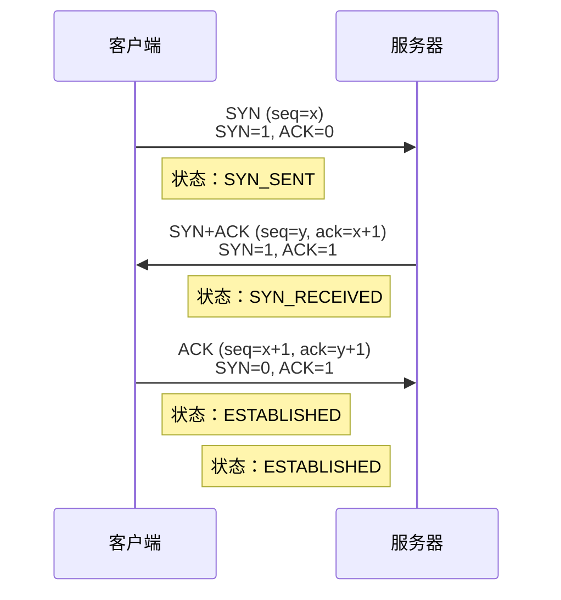
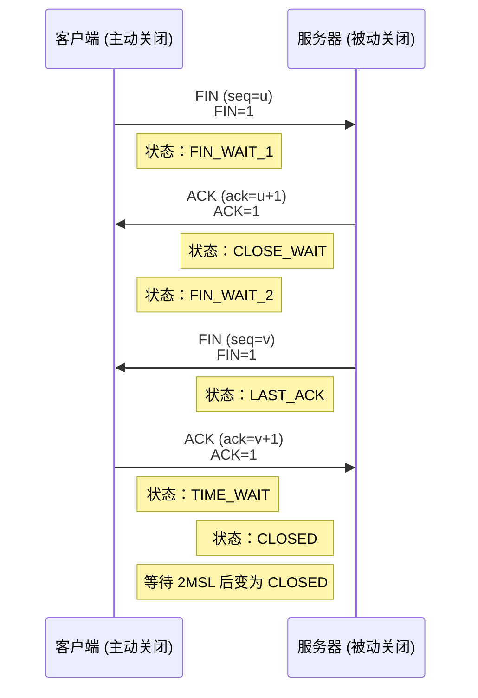

# TCP 协议

## ⭐ 面试重点速览

| 考察点 | 重要程度 | 面试频率 | 掌握目标 |
|--------|----------|----------|----------|
| 三次握手流程 | ⭐⭐⭐ | 极高 | 能画时序图，说明为什么三次不是两次 |
| 四次挥手流程 | ⭐⭐⭐ | 极高 | 能说明为什么四次，为什么最后要等 2MSL |
| TIME_WAIT 作用 | ⭐⭐⭐ | 极高 | 知道作用和调优 |
| TCP 可靠性保证 | ⭐⭐⭐ | 高 | 能说出序列号/确认号、重传、滑动窗口 |
| 滑动窗口原理 | ⭐⭐⭐ | 高 | 理解窗口大小和流量控制 |

---

## 一、TCP 是什么

TCP（Transmission Control Protocol，传输控制协议）是**面向连接、可靠、全双工、字节流**的传输层协议。

TCP 的四大特性：

| 特性 | 含义 |
|------|------|
| 面向连接 | 通信前必须建立连接（三次握手），通信后释放连接（四次挥手） |
| 可靠 | 保证数据不丢失、不重复、不乱序 |
| 全双工 | 双方可以同时发送数据 |
| 字节流 | 不维护消息边界，数据看作连续的字节流 |

---

## 二、TCP 三次握手建立连接



### 为什么是三次握手，不是两次握手？

两次握手意味着：客户端发 SYN → 服务器回 SYN+ACK → 连接建立。这样存在问题：

1. **防止已失效的连接请求报文段被服务器接收**。如果客户端发出的第一个 SYN 因为网络阻塞延迟到达，客户端可能超时重发另一个 SYN 建立连接，传输完成后释放了连接。如果两次握手，当延迟的 SYN 到达服务器，服务器会认为这是一个新连接，直接同意连接，白白浪费资源。三次握手可以避免这个问题：服务器发出 SYN+ACK 后，如果收不到第三次 ACK，说明这是一个旧请求，可以释放连接。

2. **双方都能确认对方的发送和接收能力正常**。三次握手可以：
   - 客户端确认：我能发 → 服务器能收能发
   - 服务器确认：我能收能发 → 客户端能收

两次握手只能保证服务器知道客户端能发，服务器能收，但不能保证客户端能收。

---

## 三、TCP 四次挥手释放连接



### 为什么是四次挥手，不是三次挥手？

因为 TCP 是全双工，双方都需要独立关闭发送方向：

1. 客户端发 FIN 表示"我不再发送数据了，但还能接收"
2. 服务器回 ACK 表示"我收到了你的关闭请求"，此时服务器可能还有数据要发送，不能立刻关闭
3. 等服务器发完数据，服务器发 FIN 表示"我也不再发送数据了"
4. 客户端回 ACK 表示"我收到了"，双方都关闭

如果三次挥手，意味着服务器把 ACK 和 FIN 合并一起发。只有当服务器没有数据要发送时才能这样做，而一般情况下，服务器收到 FIN 后还需要处理完剩余数据才能关闭，所以必须分两次。

---

## 四、TIME_WAIT 状态为什么需要等待 2MSL

MSL（Maximum Segment Lifetime）是最长报文寿命，表示一个报文在网络中最长能存活多久，默认值通常是 2 分钟。

TIME_WAIT 等待 2MSL 的原因：

1. **保证最后一个 ACK 能到达服务器**。如果客户端发出的最后一个 ACK 丢失，服务器会重发 FIN，客户端在 TIME_WAIT 状态下可以重新发送 ACK，而不是直接复位。

2. **让延迟的旧连接报文段在网络中自然消失**。防止同一端口新建连接时，收到旧连接遗留的报文段，造成干扰。2MSL 足够让两个方向的报文都消失。

### TIME_WAIT 过多会造成什么问题？怎么解决？

问题：一个端口同一时间只能有一个 TIME_WAIT 连接，如果大量短连接，TIME_WAIT 会耗尽端口，导致新连接无法建立。

解决方案：

```
1. 打开 tcp_tw_reuse：允许 TIME_WAIT 状态的端口被新连接复用
2. 缩短 MSL 超时时间（不推荐，违背设计初衷）
3. 调整端口范围，增大可用端口数量
4. 负载均衡：把短连接分散到多台机器
```

---

## 五、TCP 可靠性保证机制

TCP 保证可靠传输，靠这几个机制：

1. **校验和**：发送端计算校验和，接收端校验，出错就丢弃
2. **序列号和确认号**：每个字节都有序号，接收方确认收到，丢包可以重传
3. **超时重传**：发送数据后启动定时器，超时没收到确认就重传
4. **滑动窗口**：流量控制，发送方不能发太快淹没接收方
5. **拥塞控制**：网络拥塞时降低发送速率（慢启动、拥塞避免等）
6. **流量控制**：接收方通过窗口大小告诉发送方自己能处理多少

### 滑动窗口原理

滑动窗口是**流量控制**机制，基于字节流：

- 窗口大小由接收方通告（在 TCP 头部的窗口字段）
- 发送方窗口内的字节可以连续发送，不需要逐个等待确认
- 收到新的确认后，窗口向右滑动
- 窗口大小为 0 时，发送方停止发送

优点：提高网络利用率，不需要一个包一个包等确认。

---

## 六、TCP 头部结构

```
 0                   1                   2                   3
 0 1 2 3 4 5 6 7 8 9 0 1 2 3 4 5 6 7 8 9 0 1 2 3 4 5 6 7 8 9 0 1
+-+-+-+-+-+-+-+-+-+-+-+-+-+-+-+-+-+-+-+-+-+-+-+-+-+-+-+-+-+-+-+-+
|          源端口           |          目的端口                |
+-+-+-+-+-+-+-+-+-+-+-+-+-+-+-+-+-+-+-+-+-+-+-+-+-+-+-+-+-+-+-+-+
|                        序列号                               |
+-+-+-+-+-+-+-+-+-+-+-+-+-+-+-+-+-+-+-+-+-+-+-+-+-+-+-+-+-+-+-+-+
|                     确认号                               |
+-+-+-+-+-+-+-+-+-+-+-+-+-+-+-+-+-+-+-+-+-+-+-+-+-+-+-+-+-+-+-+-+
| 数据偏移 |保留 |U|A|P|R|S|F|                               |
| (4位)   |(6) |R|C|S|Y|I|N|            窗口                 |
+-+-+-+-+-+-+-+-+-+-+-+-+-+-+-+-+-+-+-+-+-+-+-+-+-+-+-+-+-+-+-+-+
|           校验和           |           紧急指针             |
+-+-+-+-+-+-+-+-+-+-+-+-+-+-+-+-+-+-+-+-+-+-+-+-+-+-+-+-+-+-+-+-+
|                       选项                               |
+-+-+-+-+-+-+-+-+-+-+-+-+-+-+-+-+-+-+-+-+-+-+-+-+-+-+-+-+-+-+-+-+
|                             数据                             |
```

关键字段：
- **SYN**：连接建立请求
- **ACK**：确认号有效
- **FIN**：连接释放请求
- **序列号 seq**：本报文段第一个字节的序号
- **确认号 ack**：期望收到下一个字节的序号，表示"之前所有字节都收到了"
- **窗口**：接收方当前能接收的字节数，流量控制

---

## 七、经典高频面试题

### Q1：SYN 洪水攻击是什么？怎么防护？

**参考答案：**
SYN 洪水攻击是一种 DDoS 攻击：攻击者发送大量 SYN 请求，源 IP 是伪造的，服务器回复 SYN+ACK 后永远收不到 ACK，每个这样的连接会在服务器的 SYN 队列中占用一个位置直到超时。大量这样的半连接会占满 SYN 队列，导致正常的 SYN 请求无法被处理。

防护方式：
- 增大 SYN 队列长度
- 开启 SYN Cookie：不保存半连接，通过 Cookie 验证收到 ACK 再分配资源
- 防火墙/负载均衡拦截无效 SYN
- 缩短超时时间

### Q2：为什么客户端初始化序列号是随机的，不是固定的？

**参考答案：**
如果用固定序列号，攻击者可以猜出下一个序列号，就能伪造数据包冒充合法连接，破坏通信。随机初始化序列号提高安全性，防止猜测。

### Q3：什么是粘包问题？怎么解决？

**参考答案：**
TCP 是字节流，没有消息边界。多个消息连续发送时，可能被 TCP 合并成一个报文段发送，接收方无法区分哪里是一个消息的结束，这就是粘包。

解决方法：
- 固定长度消息：每个消息固定长度，接收方按长度切割
- 特殊分隔符：每个消息末尾加特殊字符（如 `\n`）
- 长度字段：消息头部先写长度，接收方按长度读取
- 应用层协议设计（如 HTTP 使用 Content-Length）

### Q4：说一说你对 TCP 滑动窗口的理解？

**参考答案：**
滑动窗口是 TCP 的流量控制机制，基于字节：
1. 发送方维护发送窗口，表示哪些字节已经发送但还没收到确认，可以连续发送窗口内的数据
2. 接收方维护接收窗口，表示当前还能接收多少字节
3. 接收方在 ACK 中通告窗口大小，发送方根据窗口大小调整发送速率
4. 收到确认后窗口向右滑动，继续发送新数据
5. 滑动窗口提高了吞吐量，可以连续发送多个报文，不需要停等

### Q5：TIME_WAIT 一定要等 2MSL 吗？可以不等吗？

**参考答案：**
设计上必须等，这是 TCP 协议规范保证正确性的要求。如果不等：
1. 新连接可能收到旧连接的残留报文，造成数据错误
2. 如果最后一个 ACK 丢失，服务器会重发 FIN，但客户端已经关闭，服务器会收到 RST，认为出错

实际工程中，linux 通过 `tcp_tw_reuse` 允许端口复用，可以在 TIME_WAIT 没结束就给新连接用，这是工程优化，解决端口耗尽问题，但设计原理上 2MSL 等待还是需要的。

### Q6：TCP 和 UDP 的区别是什么？各自应用场景？

**参考答案：**

| 对比项 | TCP | UDP |
|--------|-----|-----|
| 连接 | 面向连接 | 无连接 |
| 可靠性 | 可靠（不丢不重不乱） | 不可靠，可能丢失 |
| 有序 | 保证有序 | 不保证有序 |
| 流量控制/拥塞控制 | 有 | 无 |
| 开销 | 大（头部 20 字节+三次握手） | 小（头部 8 字节） |
| 适用场景 | HTTP、HTTPS、FTP、邮件、文件传输 — 需要可靠 | DNS查询、视频流、直播、游戏 — 能容忍少量丢包，追求低延迟 |