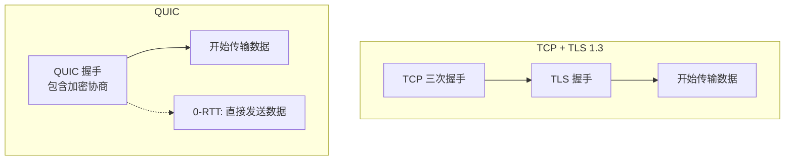

# UDP 协议

## ⭐ 面试重点速览

| 考察点 | 重要程度 | 面试频率 | 掌握目标 |
|--------|----------|----------|----------|
| TCP vs UDP 对比 | ⭐⭐⭐ | 极高 | 能按特点、场景、可靠性逐一对比 |
| UDP 无连接、不可靠的特性 | ⭐⭐⭐ | 极高 | 理解设计哲学及适用场景 |
| UDP 的常见应用场景 | ⭐⭐⭐ | 极高 | 能列举 5 个以上实际场景 |
| UDP 校验和机制 | ⭐⭐ | 高 | 了解伪首部计算方式 |
| QUIC 协议简介 | ⭐⭐ | 高 | 理解 HTTP/3 底层为什么用 QUIC |

---

## 一、UDP 是什么

UDP（User Datagram Protocol，用户数据报协议）是一个**无连接、不可靠、面向报文**的传输层协议。

UDP 的四大特性：

| 特性 | 含义 |
|------|------|
| 无连接 | 发送数据前不需要建立连接，直接发送 |
| 不可靠 | 不保证数据一定到达，不保证顺序，不保证不重复 |
| 面向报文 | 保留消息边界，每次发送一个完整的报文，接收方按报文接收 |
| 低开销 | 首部只有 8 字节，没有握手、挥手、确认、重传机制 |

UDP 报文首部（仅 8 字节）：

```
 0                   1
 0 1 2 3 4 5 6 7 8 9 0 1 2 3 4 5 6 7 8 9 0 1 2 3 4 5 6 7 8 9 0 1
+-+-+-+-+-+-+-+-+-+-+-+-+-+-+-+-+-+-+-+-+-+-+-+-+-+-+-+-+-+-+-+-+
|          源端口号             |          目的端口号            |
+-+-+-+-+-+-+-+-+-+-+-+-+-+-+-+-+-+-+-+-+-+-+-+-+-+-+-+-+-+-+-+-+
|            长度               |            校验和              |
+-+-+-+-+-+-+-+-+-+-+-+-+-+-+-+-+-+-+-+-+-+-+-+-+-+-+-+-+-+-+-+-+
|                        数据（可选）                            |
+-+-+-+-+-+-+-+-+-+-+-+-+-+-+-+-+-+-+-+-+-+-+-+-+-+-+-+-+-+-+-+-+
```

::: tip 长度字段的含义
UDP 长度字段包含 UDP 首部 + 数据的长度，其最大值为 65535（16 位为 2^16-1），再减去 8 字节首部，UDP 单个报文最大数据为 65507 字节。
:::

---

## 二、TCP vs UDP 深度对比

这是面试中几乎必问的题目，不能只背表格，要理解设计哲学。

| 对比维度 | TCP | UDP |
|----------|-----|-----|
| 是否面向连接 | 是，必须先建立连接 | 否，直接发送数据 |
| 可靠性 | 保证数据不丢、不重、不乱序 | 不保证，可能丢、可能乱序 |
| 传输方式 | 字节流，无消息边界 | 面向报文，保留消息边界 |
| 首部开销 | 20~60 字节 | 8 字节 |
| 流量控制 | 有（滑动窗口） | 无 |
| 拥塞控制 | 有（慢启动、拥塞避免等） | 无 |
| 传输速度 | 相对慢 | 相对快（低延迟） |
| 支持模式 | 一对一 | 一对一、一对多、多对多 |
| 序号确认 | 有 | 无 |
| 适用场景 | 文件传输、HTTP、邮件、远程登录 | DNS、视频直播、VoIP、游戏 |

### 设计哲学差异

TCP 的设计哲学是**可靠传输**，适合对数据完整性要求高的场景。UDP 的设计哲学是**轻量快速**，适合对实时性要求高、能容忍少量丢包的场景。

::: tip 理解思路
TCP 就像一个负责任的快递员，每个包裹要签收、要回执，丢了要重发，顺序乱了要重排。UDP 就像一个不管不顾的快递员，包裹扔到门口就走，丢了不负责，乱序也不管，但胜在快。
:::

UDP 不支持一对多和多对多——这是 TCP 的天然短板，因为 TCP 必须先建立连接，而 UDP 无连接，同一个 socket 可以往任意地址发送数据。

---

## 三、UDP 的应用场景

### 3.1 为什么 UDP 适合这些场景？

UDP 丢包不重传，省去了 TCP 的重传等待时间，延迟更低。以下场景数据实时性比完整性更重要：

| 场景 | 为什么用 UDP |
|------|-------------|
| DNS 查询 | 单次请求-响应，报文小，重传开销大，UDP 丢包重试即可 |
| 视频直播/会议 | 实时性优先，丢几帧无所谓，TCP 重传会让画面卡顿 |
| 在线游戏 | 延迟敏感，丢包了就过去了，重传的数据已经过期了 |
| VoIP 语音通话 | 实时音频，延迟比丢包影响更大 |
| IoT 设备上报 | 设备资源有限，TCP 开销大，报文小，适合 UDP |
| 广播/组播 | TCP 只能是点对点，UDP 可以广播到多台设备 |
| DHCP 获取 IP | 客户端还没 IP，无法建立 TCP 连接，必需 UDP |

::: warning 注意
UDP 不保证可靠性不代表应用层不能做可靠性。很多使用 UDP 的协议会在应用层自己实现可靠性，比如 QUIC 协议在 UDP 之上实现了类似 TCP 的可靠传输，但避免了 TCP 的一些问题。
:::

---

## 四、UDP 校验和

UDP 校验和是**可选的**（IPv4 中可选，IPv6 中必须），用于检查数据在传输过程中是否出错。

UDP 校验和的计算范围包括三部分：
1. **伪首部**（Pseudo Header）：包含源 IP、目的 IP、协议号、UDP 长度
2. **UDP 首部**
3. **UDP 数据**

伪首部的作用：校验和不仅覆盖 UDP 数据本身，还覆盖了 IP 地址信息，如果 IP 地址在传输过程中被篡改，校验和也能检测出来。这提供了额外的安全保护。

如果校验和计算结果是 0，则以全 1（0xFFFF）发送（因为 0 表示没有使用校验和）。

---

## 五、QUIC 协议简介

QUIC（Quick UDP Internet Connections）是 Google 开发的基于 UDP 的传输层协议，HTTP/3 就建立在 QUIC 之上。

### 5.1 QUIC 解决了什么问题？

TCP 协议设计于几十年前，存在一些固有问题：

1. **队头阻塞**：TCP 是字节流，HTTP/2 虽然做了多路复用，但底层 TCP 丢包后会阻塞所有流（TCP 级别的队头阻塞）。
2. **握手延迟长**：TCP 三次握手 + TLS 握手，至少 2-3 个 RTT 才能开始传数据。
3. **协议僵化**：TCP 在操作系统内核中实现，升级困难，中间设备（防火墙、NAT）对 TCP 选项处理不统一。

### 5.2 QUIC 的核心特性

| 特性 | 说明 |
|------|------|
| 0-RTT 握手 | 曾经连接过的客户端，可以 0-RTT 发送数据 |
| 无队头阻塞 | 每个流独立，一个流丢包不影响其他流 |
| 连接迁移 | 网络切换（WiFi→4G）时连接不中断 |
| 前向安全 | 加密是协议内置的，不是可选的 |
| 用户态实现 | 不依赖内核升级，可以快速迭代 |

### 5.3 QUIC 和 TCP 的对比



QUIC = 把 TCP 的可靠性 + TLS 的加密 + HTTP/2 的多路复用，都在 UDP 之上重新实现，避开了 TCP 的固有问题。

::: tip 延伸阅读
关于 HTTP/3 和 QUIC 的更多细节，请参见 [HTTP 协议演进](../application/http.md) 章节。
:::

---

## 六、交叉关联到其他模块

- **TCP 协议**：参见 [TCP 协议](./tcp.md)，理解 TCP 和 UDP 在可靠性、流量控制、拥塞控制方面的本质区别
- **HTTP/3 与 QUIC**：参见 [HTTP 协议演进](../application/http.md)，HTTP/3 底层使用 QUIC 替代 TCP
- **DNS 解析**：参见 [DNS 解析](../application/dns.md)，DNS 默认使用 UDP 查询
- **WebSocket**：参见 [WebSocket 协议](../application/websocket.md)，WebSocket 基于 TCP，但心跳机制可以借鉴 UDP 的轻量思想
- **Socket 编程**：参见 [Socket 编程](../programming/socket.md)，理解 UDP Socket 和 TCP Socket 的使用差异

---

## 七、经典高频面试题

### Q1：TCP 和 UDP 的区别是什么？各自适用场景？

**参考答案：**

| 维度 | TCP | UDP |
|------|-----|-----|
| 连接 | 面向连接 | 无连接 |
| 可靠性 | 可靠（不丢不重不乱的） | 不可靠，可能丢失 |
| 有序性 | 保证有序 | 不保证有序 |
| 头部开销 | 20~60 字节 | 8 字节 |
| 流量控制/拥塞控制 | 有 | 无 |
| 速度 | 相对慢 | 快，延迟低 |
| 适用场景 | HTTP、文件传输、邮件 | DNS、视频直播、游戏、VoIP |

TCP 适合对数据完整性要求高的场景，UDP 适合对实时性要求高、能容忍少量丢包的场景。

### Q2：UDP 有什么优点？为什么不用 TCP 做所有事？

**参考答案：**
UDP 的优点：
1. **无连接**：不需要建立连接，节省连接建立时间
2. **低延迟**：没有重传、确认、拥塞控制，延迟更低
3. **低开销**：首部只有 8 字节，TCP 最少 20 字节
4. **支持广播和组播**：TCP 只能是点对点
5. **无队头阻塞**：每个报文独立，一个丢包不影响其他报文

为什么不用 TCP 做所有事：
- 实时场景（视频、游戏、VoIP）对延迟的容忍度极低，TCP 重传会导致数据过期
- 广播/组播场景 TCP 不支持
- 简单查询场景（DNS、DHCP）TCP 连接开销太大，得不偿失

### Q3：UDP 如何实现可靠传输？

**参考答案：**
UDP 本身不提供可靠性，但可以在应用层自己实现。常见机制：

1. **序列号和确认机制**：在应用层数据中加入 seq 和 ack 字段
2. **超时重传**：发送后启动定时器，超时未收到确认则重传
3. **滑动窗口**：在应用层实现流量控制
4. **前向纠错（FEC）**：发送冗余数据，接收方可以通过冗余数据恢复丢包，不需要重传

QUIC 协议就是基于 UDP 在应用层实现了可靠传输的最好例子（可靠传输 + 加密 + 多路复用）。

### Q4：UDP 的校验和是怎么计算的？为什么要计算伪首部？

**参考答案：**
UDP 校验和计算包括三部分：伪首部（12 字节）+ UDP 首部（8 字节）+ 数据。

伪首部包含：源 IP 地址、目的 IP 地址、协议号（UDP=17）、UDP 总长度。

为什么要计算伪首部：如果路由过程中 IP 地址被篡改，校验和可以检测出来，提供额外的安全保护。因为 IP 层只校验 IP 首部，不校验上层数据。

IPv4 中 UDP 校验和是可选的（可以填 0 表示不校验），IPv6 中校验和是必须的。

### Q5：DNS 为什么用 UDP？什么情况下 DNS 会用 TCP？

**参考答案：**
DNS 默认使用 UDP 端口 53 的原因：
1. DNS 查询通常报文很小（一般不超过 512 字节），UDP 一个报文就能容纳
2. DNS 查询是请求-响应模式，一次一个来回，UDP 无连接、低开销非常合适
3. 如果丢包，客户端可以重试，不需要 TCP 的可靠性保证

DNS 使用 TCP 的情况：
1. **响应超过 512 字节**：DNS 报文超过 UDP 单报文大小限制，需要 TCP 分片传输
2. **区域传送（Zone Transfer）**：主从 DNS 服务器之间同步大量 DNS 记录，必须用 TCP 保证完整性
3. **DNS over TLS（DoT）**：加密 DNS 查询，基于 TCP + TLS
4. **DNS over HTTPS（DoH）**：基于 HTTPS 的 DNS 查询，底层是 TCP

### Q6：QUIC 协议为什么要基于 UDP 而不是 TCP？

**参考答案：**
1. **协议僵化**：TCP 实现在操作系统内核中，升级 TCP 协议栈需要内核更新，周期长、覆盖慢。QUIC 在用户态实现，可以快速迭代。
2. **队头阻塞**：TCP 是字节流，一个包丢了会阻塞后面所有数据。QUIC 以流为单位，每个流独立，一个流丢包不影响其他流。
3. **握手优化**：QUIC 把传输层握手和加密握手合并，支持 0-RTT，比 TCP+TLS 快得多。
4. **中间设备兼容**：很多中间设备（防火墙、NAT）对未知 TCP 选项会丢弃，UDP 报文不受影响。
5. **连接迁移**：QUIC 通过连接 ID 标识连接，不依赖 IP 地址，网络切换时连接不中断。