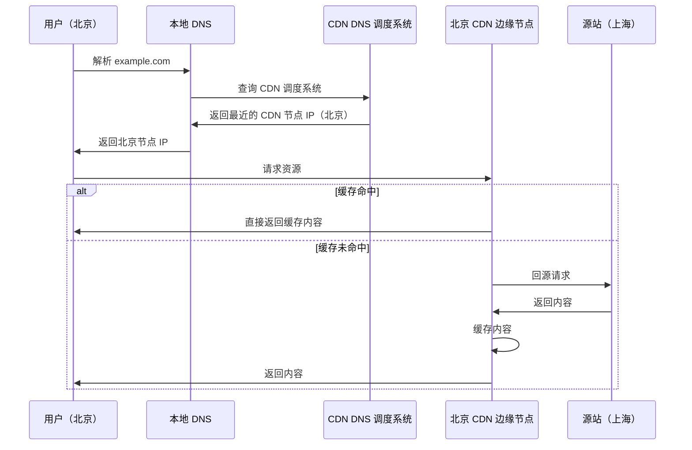
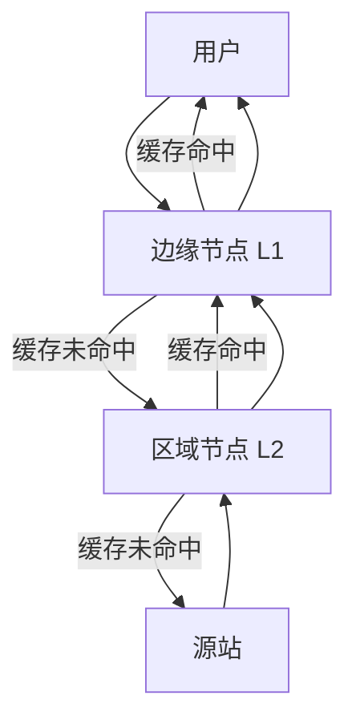

# CDN 加速

## ⭐ 面试重点速览

| 考察点 | 重要程度 | 面试频率 | 掌握目标 |
|--------|----------|----------|----------|
| CDN 工作原理 | ⭐⭐⭐ | 极高 | 能说清楚从用户到源站的回源链路 |
| CDN 缓存策略 | ⭐⭐⭐ | 极高 | 缓存过期、刷新、预热 |
| 回源机制 | ⭐⭐⭐ | 极高 | 什么情况下回源，回源优化 |
| DNS 调度 | ⭐⭐⭐ | 高 | 智能 DNS 如何把用户调度到最近节点 |
| CDN 缓存命中率 | ⭐⭐ | 高 | 影响因素和优化方式 |

---

## 一、CDN 是什么

CDN（Content Delivery Network，内容分发网络）是分布在全球各地的服务器节点网络，通过将内容缓存到离用户最近的边缘节点，加速用户访问速度。

### 没有 CDN 的访问流程

```
用户（北京）  →  DNS 解析  →  源站（上海）
    ↓
延迟可能 50ms+
```

### 有 CDN 的访问流程

```
用户（北京）  →  DNS 就近解析  →  北京 CDN 节点（命中缓存）
    ↓                                    ↓ 缓存未命中
延迟 5ms 以内                         回源到上海源站
```

核心价值：**就近访问**，物理距离更短，延迟更低。

---

## 二、CDN 工作原理

完整的 CDN 访问流程：



### 关键步骤

1. **DNS 智能调度**：用户请求域名解析时，CDN 的智能 DNS 调度系统根据用户 IP 判断地理位置，返回离用户最近的 CDN 节点 IP
2. **边缘节点缓存**：如果请求的资源在 CDN 节点缓存中，直接返回，延迟极低
3. **回源**：如果缓存未命中，CDN 节点向源站请求资源，获取后缓存到本地，再返回给用户

### DNS 调度原理

CDN 的 DNS 调度系统（GSLB，Global Server Load Balance）是整个 CDN 的核心：

- 收到 DNS 查询请求时，获取用户 LDNS 的 IP
- 根据 IP 地理位置数据库，判断用户所在位置
- 选择离用户最近、负载最低、网络状况最好的 CDN 节点
- 返回该节点的 IP 给用户

::: tip 智能调度策略
CDN 调度系统不仅考虑地理位置，还综合考虑：
- 节点负载：避免把流量导向负载过高的节点
- 网络质量：实时监测节点到用户的网络延迟和丢包率
- 带宽成本：不同运营商（电信、联通、移动）之间跨网访问慢，优先返回同运营商节点
- 节点健康度：排除故障节点
:::

---

## 三、CDN 缓存策略

### 3.1 缓存控制

CDN 节点的缓存行为由 HTTP 响应头控制：

| 响应头 | 作用 |
|--------|------|
| `Cache-Control: max-age=3600` | 缓存 3600 秒后过期 |
| `Cache-Control: no-cache` | 可以缓存，但每次使用前必须验证 |
| `Cache-Control: no-store` | 不缓存 |
| `Cache-Control: public` | 可以被 CDN 和浏览器缓存 |
| `Cache-Control: private` | 只能被浏览器缓存，CDN 不缓存 |
| `Expires` | 过期时间（HTTP/1.0，已不推荐） |
| `ETag` | 内容标识，用于缓存验证 |
| `Last-Modified` | 最后修改时间，用于缓存验证 |

### 3.2 缓存过期与刷新

缓存过期后，CDN 节点有两种处理方式：

1. **被动过期**：缓存过期后，用户请求时 CDN 回源验证（携带 If-None-Match / If-Modified-Since），源站返回 304 Not Modified 则可以继续使用缓存
2. **主动刷新**：CDN 管理后台可以主动刷新缓存，让 CDN 节点立即回源获取最新内容

### 3.3 CDN 预热

CDN 预热是指：在流量高峰到来之前，提前把热点资源分发到各个 CDN 节点，避免大量用户同时访问时回源造成源站压力。

预热场景：
- 新版本发布前，提前预热静态资源
- 大促活动前，预热活动页面和图片
- 热门视频上线前，预推到 CDN 节点

### 3.4 缓存命中率

缓存命中率是 CDN 最重要的指标之一：

| 影响因素 | 说明 |
|----------|------|
| 缓存时间 | max-age 越长，命中率越高，但更新越慢 |
| 缓存 Key | 不同 URL 参数会被视为不同缓存，参数过多命中率低 |
| 热点集中度 | 大部分请求集中在少数热点资源，命中率高 |
| CDN 节点数量 | 节点越多，每个节点的缓存命中率可能越低（长尾内容） |

---

## 四、回源机制

### 4.1 回源触发条件

CDN 节点在以下情况会回源：
1. 缓存未命中
2. 缓存已过期
3. Cache-Control 设为 no-cache（每次验证）
4. 缓存被主动刷新

### 4.2 回源优化

回源是 CDN 的性能瓶颈，需要优化：

| 优化手段 | 说明 |
|----------|------|
| 合并回源 | 多个用户同时请求同一资源，CDN 只回源一次，其他请求等待 |
| 分级缓存 | L1（边缘节点）→ L2（区域节点）→ 源站，减少对源站的直接回源 |
| 分片回源 | 大文件分片回源，避免一次回源失败导致全部重来 |
| 回源超时控制 | 设置合理的回源超时时间，避免源站故障拖垮 CDN |
| 回源限流 | 保护源站，限制回源并发数 |
| 源站保护 | 源站只允许 CDN 节点 IP 访问，拒绝其他来源 |

### 4.3 回源架构



**L1 边缘节点**：离用户最近，覆盖范围小，数量多（几百到几千个），缓存热点内容。
**L2 区域节点**：覆盖一个区域（如华北、华东），数量少（几十个），缓存长尾内容，减少对源站的直接回源。

---

## 五、CDN 的适用场景

| 场景 | 说明 |
|------|------|
| 静态资源加速 | 图片、CSS、JS、字体等静态文件，变化少，适合缓存 |
| 大文件下载 | 安装包、视频文件，大文件分发，CDN 节省带宽 |
| 视频点播/直播 | 视频流分发，就近推流和拉流 |
| 动态加速 | 对动态 API 做传输优化（智能路由、协议优化），但不缓存 |
| DDoS 防护 | CDN 分散流量，防止全部流量打到源站 |
| 全站加速 | 静态资源 + 动态请求混合加速 |

---

## 六、CDN 常见问题与优化

### 6.1 缓存命中率低

- 检查缓存策略：max-age 是否太短
- 检查 URL 参数：是否每个请求都带不同参数导致缓存 Key 不同
- 检查响应头：是否设置了 no-cache 或 private
- 增加预热：把热点资源提前预热到节点

### 6.2 缓存穿透

用户请求的资源在 CDN 和源站都不存在，每次请求都要回源验证，源站压力大。

解决：源站返回 404 时也设置一个短缓存时间，避免频繁回源。

### 6.3 动静分离

静态资源走 CDN 缓存，动态请求走动态加速或直接回源。通过域名区分：
- `static.example.com` → CDN 缓存加速
- `api.example.com` → 动态加速或直接回源

### 6.4 HTTPS 加速

CDN 节点部署 SSL 证书，用户在 CDN 节点完成 TLS 握手，减少延迟。CDN 和源站之间也可以走 HTTPS，保证安全。

---

## 七、交叉关联到其他模块

- **DNS 解析**：参见 [DNS 解析](../application/dns.md)，CDN 依赖 DNS 智能调度
- **HTTP 协议**：参见 [HTTP 协议演进](../application/http.md)，CDN 缓存策略由 HTTP 响应头控制
- **HTTPS 与 TLS**：参见 [HTTPS 与 TLS](../application/https-tls.md)，CDN 节点部署 SSL 证书加速 TLS 握手
- **高并发架构**：CDN 是大型网站架构的重要组成部分，参见高并发模块

---

## 八、经典高频面试题

### Q1：CDN 的工作原理是什么？从用户请求到返回内容，完整流程是怎样的？

**参考答案：**
1. 用户请求域名，本地 DNS 解析
2. DNS 请求到达 CDN 智能调度系统（GSLB）
3. GSLB 根据用户 IP 地理位置、节点负载、网络质量，选择最近的 CDN 节点，返回其 IP
4. 用户向 CDN 边缘节点发起请求
5. 如果缓存命中，直接返回内容
6. 如果缓存未命中，CDN 节点回源站获取内容，缓存后返回给用户

整个流程的核心是 DNS 智能调度 + 边缘节点缓存 + 回源机制。

### Q2：CDN 的回源是什么意思？什么时候会回源？

**参考答案：**
回源是指 CDN 节点缓存中没有用户请求的资源，需要向源站请求获取。

回源触发条件：
1. 缓存未命中（从未请求过该资源）
2. 缓存已过期，且源站返回新内容（不是 304）
3. Cache-Control 设为 no-cache，每次都需要验证
4. 缓存被主动刷新

回源优化方式：
- 合并回源：多个用户同时请求同一资源，只回源一次
- 分级缓存：L1（边缘）→ L2（区域）→ 源站，减少对源站的直接回源
- 回源限流：保护源站，限制回源并发数

### Q3：CDN 的缓存策略是怎样的？如何控制缓存？

**参考答案：**
CDN 缓存策略由 HTTP 响应头控制：

| 响应头 | 作用 |
|--------|------|
| `Cache-Control: max-age=3600` | 缓存 3600 秒 |
| `Cache-Control: no-cache` | 缓存但每次验证 |
| `Cache-Control: no-store` | 不缓存 |
| `Cache-Control: public` | CDN 可以缓存 |
| `Cache-Control: private` | 仅浏览器缓存，CDN 不缓存 |

缓存过期后，CDN 可以回源验证（If-None-Match / If-Modified-Since），源站返回 304 则继续使用缓存。

缓存刷新：CDN 管理后台主动刷新，让节点立即回源获取最新内容。

### Q4：CDN 预热是什么？什么场景下需要预热？

**参考答案：**
CDN 预热是指在流量高峰到来之前，提前把资源分发到各个 CDN 节点，让 CDN 节点提前缓存。

适用场景：
1. 新版本发布前，预热静态资源
2. 大促活动前，预热活动页面和图片
3. 热门视频上线前，预推到 CDN 节点
4. 源站带宽有限，需要提前分发大文件

如果没有预热，大量用户同时访问时，所有请求都会回源，造成源站压力过大，甚至打垮源站。

### Q5：CDN 的 DNS 调度（GSLB）是怎么工作的？

**参考答案：**
CDN 的 DNS 调度系统（GSLB，Global Server Load Balance）是 CDN 的核心，负责把用户请求导向最优 CDN 节点。

调度策略综合考虑：
1. **地理位置**：根据用户 LDNS IP 判断用户位置，返回最近的节点
2. **网络质量**：实时监测各节点到用户的网络延迟和丢包率，选择质量最好的
3. **节点负载**：避免把流量导向负载过高、接近容量上限的节点
4. **运营商**：优先返回同运营商节点，避免跨网访问延迟高
5. **节点健康度**：排除故障节点

GSLB 通常使用 BGP Anycast 或智能 DNS 技术实现。

### Q6：CDN 缓存命中率低的原因有哪些？怎么优化？

**参考答案：**
原因：
1. **缓存时间太短**：max-age 设置太短，频繁过期
2. **URL 参数过多**：不同参数被视为不同缓存 Key，命中率低
3. **响应头设置不当**：设置了 no-cache、private 等限制
4. **热点不集中**：长尾内容多，访问分散
5. **CDN 节点过多**：每个节点缓存内容少，命中率低

优化：
1. 增大 max-age，对不常变化的资源设置更长缓存时间
2. 过滤不必要的 URL 参数，统一缓存 Key
3. 正确设置 Cache-Control 响应头
4. 使用 CDN 预热，提前把热点资源分发到节点
5. 开启分级缓存（L1+L2），长尾内容缓存到 L2 节点