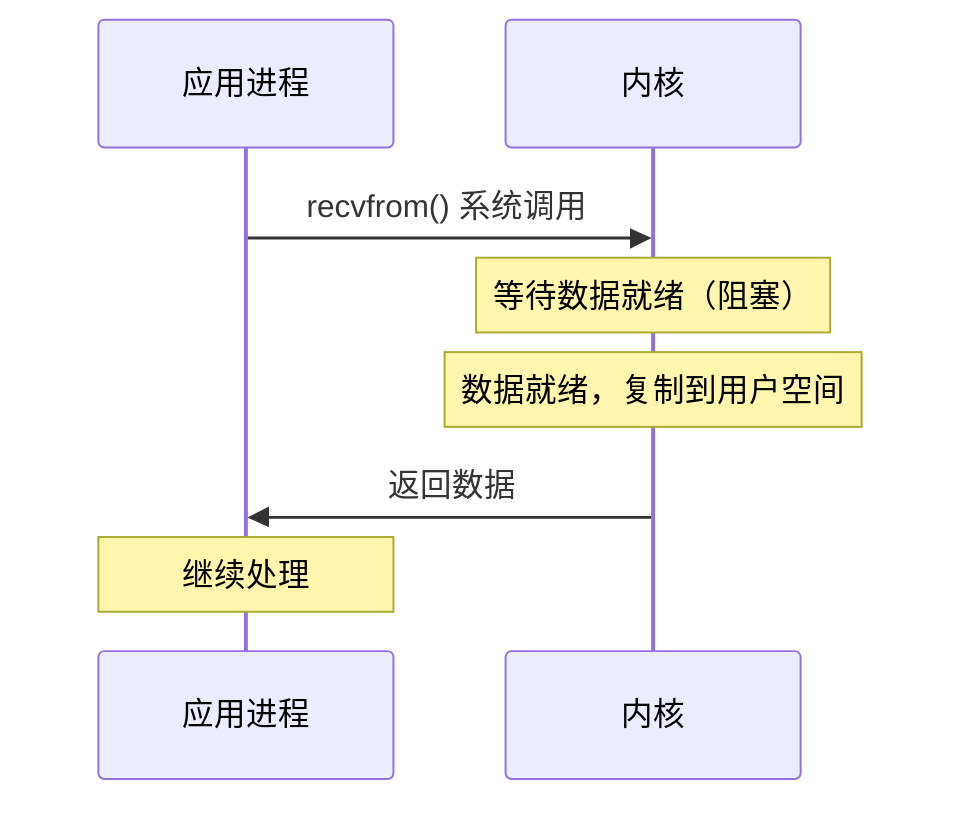
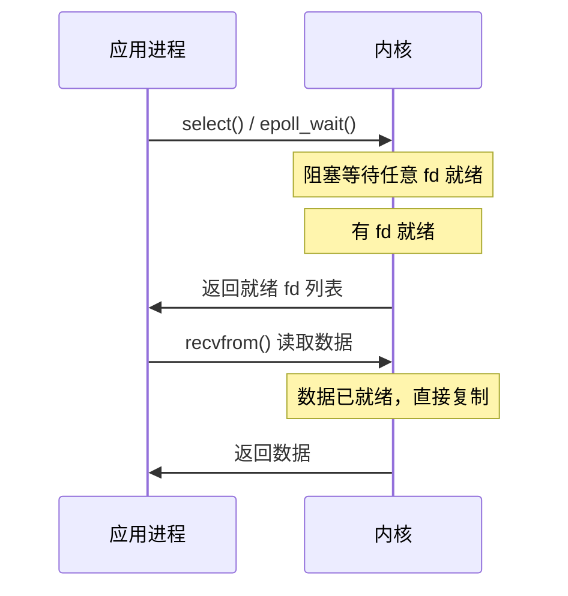
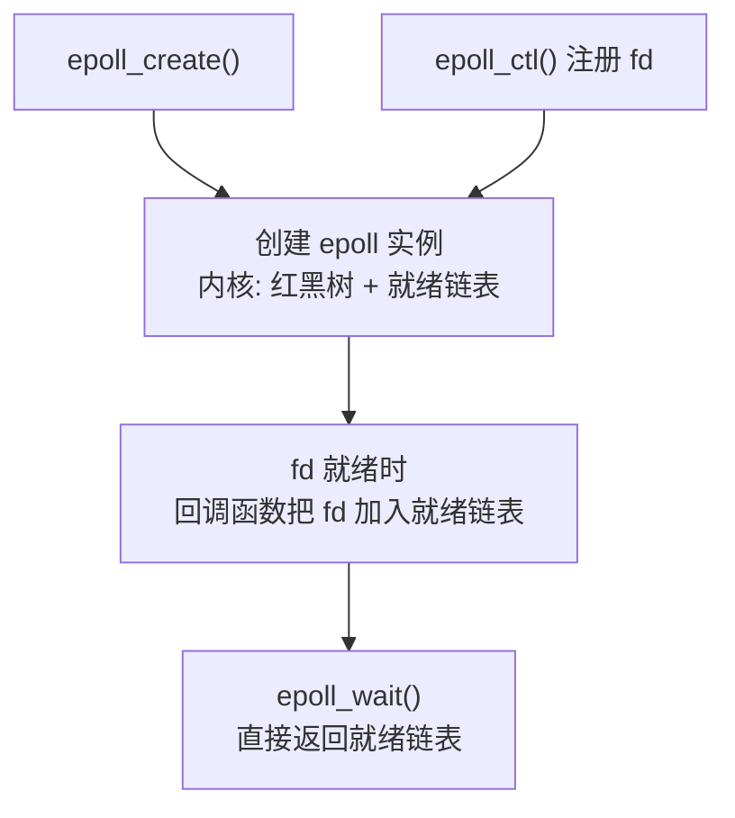
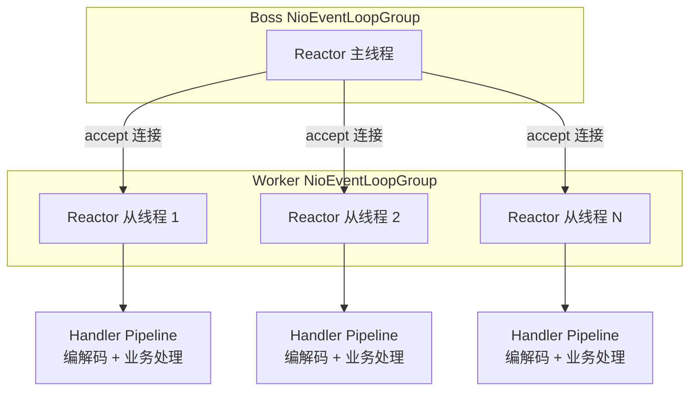

# IO 模型

## ⭐ 面试重点速览

| 考察点 | 重要程度 | 面试频率 | 掌握目标 |
|--------|----------|----------|----------|
| 阻塞 vs 非阻塞 vs 异步 | ⭐⭐⭐ | 极高 | 能区分三者的差异和适用场景 |
| select/poll/epoll 区别 | ⭐⭐⭐ | 极高 | 理解机制、性能差异、适用场景 |
| Reactor vs Proactor | ⭐⭐⭐ | 极高 | 理解两种模式的区别和代表框架 |
| epoll 的 ET vs LT | ⭐⭐⭐ | 极高 | 触发条件、区别 |
| 零拷贝原理 | ⭐⭐⭐ | 高 | mmap、sendFile、适用场景 |

---

## 一、什么是 IO 模型

IO 模型描述了操作系统如何处理输入输出操作，特别是网络 IO。Linux 内核提供了多种 IO 模型，不同模型对应不同的性能特征和编程方式。

核心问题：**一个线程如何高效地处理大量网络连接？**

---

## 二、四种 IO 模型

### 2.1 阻塞 IO（Blocking IO）

最简单的 IO 模型：发起 IO 操作后，线程被挂起，直到数据准备好并复制到用户空间。



**特点：** 一个线程只能处理一个连接，连接数多时线程数爆炸。

```java
// 阻塞 IO 示例
ServerSocket serverSocket = new ServerSocket(8080);
while (true) {
    Socket client = serverSocket.accept(); // 阻塞等待连接
    // 每个连接开一个线程
    new Thread(() -> handle(client)).start();
    // 连接数多了，线程数爆炸
}
```

### 2.2 非阻塞 IO（Non-blocking IO）

将 socket 设为非阻塞模式，发起 IO 操作时如果没有数据就立即返回错误，不会阻塞线程。应用需要不断轮询检查数据是否就绪。

```java
// 非阻塞 IO 示例
serverSocketChannel.configureBlocking(false); // 设为非阻塞
while (true) {
    SocketChannel client = serverSocketChannel.accept(); // 不阻塞
    if (client != null) {
        client.configureBlocking(false);
        // 注册到 selector
    }
}
```

**特点：** 不需要为每个连接开线程，但需要不断轮询，CPU 空转。

### 2.3 IO 多路复用（IO Multiplexing）

用 select/poll/epoll 等系统调用，一个线程同时监听多个 socket 的就绪事件。有数据就绪时，内核通知应用处理。



**特点：** 一个线程管理大量连接，是 Nginx、Redis、Netty 等高性能服务的基础。

### 2.4 异步 IO（Asynchronous IO）

AIO 是真正的异步模型：发起 IO 请求后立即返回，内核完成所有操作（等待数据 + 复制数据）后通知应用。

**特点：** 性能最高，但 Linux 下 AIO 还不成熟，很少用于网络 IO。

### 四种模型对比

| 模型 | 阻塞与否 | 需要轮询 | 一个线程处理多连接 |
|------|----------|----------|-------------------|
| 阻塞 IO | 是 | 否 | 否 |
| 非阻塞 IO | 否 | 是（应用层轮询） | 是 |
| IO 多路复用 | 在 select/epoll 上阻塞 | 否（内核通知） | 是 |
| 异步 IO | 否 | 否 | 是 |

---

## 三、select / poll / epoll

这是面试中几乎必问的内容，必须知道区别和演进原因。

### 3.1 select

```c
int select(int nfds, fd_set *readfds, fd_set *writefds,
           fd_set *exceptfds, struct timeval *timeout);
```

**工作原理：**
1. 把要监听的文件描述符集合拷贝到内核
2. 内核遍历所有 fd，检查是否有就绪事件
3. 有就绪事件就返回，把就绪 fd 集合再拷贝回用户空间
4. 应用层再遍历 fd 集合，找到就绪的 fd 处理

**缺点：**
- 支持的 fd 数量有限，默认 1024 个
- fd 集合需要从用户空间拷贝到内核，每次 select 都要拷贝
- 内核需要遍历所有 fd，fd 多了效率低
- 返回后应用还要遍历找就绪的 fd，O(n) 复杂度

### 3.2 poll

```c
int poll(struct pollfd *fds, nfds_t nfds, int timeout);
```

poll 和 select 原理基本一样，只是换了一种数据结构：
- 使用 `pollfd` 数组代替 fd_set，突破了 1024 限制
- 但还是要遍历所有 fd，O(n) 复杂度，数量大了还是慢

### 3.3 epoll（Linux 2.6+）

epoll 是 Linux 下最高效的 IO 多路复用机制，解决了 select/poll 的性能问题。

```c
int epoll_create(int size);                        // 创建 epoll 实例
int epoll_ctl(int epfd, int op, int fd,            // 添加/修改/删除监听的 fd
              struct epoll_event *event);
int epoll_wait(int epfd, struct epoll_event *events, // 等待就绪事件
               int maxevents, int timeout);
```

**核心改进：**

| 特性 | select/poll | epoll |
|------|-------------|-------|
| 数据结构 | 每次传入全部 fd 列表 | 内核维护红黑树，只传一次 |
| 查找方式 | 遍历所有 fd（O(n)） | 事件驱动，只返回就绪 fd（O(1)） |
| 数据拷贝 | 每次 select 都要拷贝全部 fd | 首次注册时拷贝，后续不需要 |
| fd 数量限制 | select 限制 1024 | 无限制 |
| 内存占用 | 每次传入全部 fd，占用大 | 只维护就绪链表 |

**epoll 工作原理：**
1. `epoll_create()` 创建 epoll 实例，内核维护一个红黑树和一个就绪链表
2. `epoll_ctl()` 把 fd 添加到红黑树中，同时注册回调函数
3. 当 fd 就绪时，中断处理程序调用回调函数，把 fd 加入就绪链表
4. `epoll_wait()` 直接检查就绪链表，有就绪 fd 就返回，只返回就绪的 fd

**epoll 的两种触发模式：**

| 模式 | 触发条件 | 特点 |
|------|----------|------|
| LT（水平触发） | 只要缓冲区有数据，每次都通知 | 默认模式，不丢数据，但可能重复通知 |
| ET（边缘触发） | 只有缓冲区从无到有时通知一次 | 高效，必须配合非阻塞 IO，必须一次读完 |

::: tip 实际应用
Nginx、Redis、Netty 都使用 epoll。Java NIO 的 Selector 在 Linux 上底层就是 epoll。
:::



---

## 四、Reactor 模式 vs Proactor 模式

### 4.1 Reactor 模式（事件驱动）

Reactor 模式基于**同步 IO 多路复用**：一个线程通过 select/epoll 监听多个 fd 的就绪事件，就绪后通知对应的 handler 处理。

**Reactor 的核心：IO 事件分离 + 事件分发。**

```
Reactor（事件分发器）
  ├── Acceptor：处理连接事件
  ├── Handler A：处理读事件
  ├── Handler B：处理写事件
  └── ...
```

**代表框架：**
- 单 Reactor 单线程：Redis
- 单 Reactor 多线程：Netty（主从 Reactor）
- 多 Reactor 多线程：Netty（boss + worker 线程组）

### 4.2 Proactor 模式（异步 IO）

Proactor 模式基于**异步 IO**：发起 IO 操作后立即返回，操作系统完成 IO 后通知应用，应用直接处理结果。

**Reactor 和 Proactor 的核心区别：**

| 对比 | Reactor | Proactor |
|------|---------|----------|
| IO 模型 | 同步 IO 多路复用 | 异步 IO |
| 谁来读数据 | 应用自己读（在事件回调中） | 操作系统读，读完后通知应用 |
| 通知时机 | fd 就绪（可读/可写） | IO 操作完成 |
| 性能 | 数据需要从内核拷贝到用户空间（应用层完成） | 数据拷贝由操作系统完成 |
| 代表框架 | Nginx、Netty、Redis | IOCP（Windows）、Boost.Asio |

### 4.3 Netty 的主从 Reactor 模型

Netty 是 Java 生态中最经典的网络框架，采用主从 Reactor 多线程模型：



- **BossGroup**：处理连接事件（accept）
- **WorkerGroup**：处理读写事件（IO 线程 + 业务处理）

---

## 五、IO 模型与 Java 框架

| Java 框架 | IO 模型 | 底层实现 |
|-----------|---------|----------|
| 传统 BIO（ServerSocket） | 阻塞 IO | 一个连接一个线程 |
| Java NIO（Selector） | IO 多路复用 | 底层 Linux epoll |
| Netty | 主从 Reactor | NIO + epoll |
| Tomcat（BIO 模式） | 阻塞 IO | 线程池 + 阻塞 IO |
| Tomcat（NIO 模式） | 主从 Reactor | NIO + epoll |

---

## 六、交叉关联到其他模块

- **TCP 协议**：参见 [TCP 协议](../fundamentals/tcp.md)，IO 模型是 TCP 连接处理的基础
- **Socket 编程**：参见 [Socket 编程](./socket.md)，阻塞 IO 和非阻塞 IO 在 Socket 编程中的体现
- **Java NIO**：参见 [Java 进阶：IO/NIO](../../java-advanced/io-nio/nio.md)，Selector、Buffer、Channel 三大组件
- **Netty**：参见 [Java 进阶：Netty](../../java-advanced/io-nio/netty.md)，主从 Reactor 模型的实现

---

## 七、经典高频面试题

### Q1：select、poll、epoll 的区别是什么？为什么 epoll 效率更高？

**参考答案：**

| 对比 | select | poll | epoll |
|------|--------|------|-------|
| 数据结构 | fd_set（位图） | pollfd 数组 | 红黑树 + 就绪链表 |
| fd 数量限制 | 默认 1024 | 无限制 | 无限制 |
| 查找方式 | 遍历所有 fd O(n) | 遍历所有 fd O(n) | 事件驱动 O(1) |
| 数据拷贝 | 每次 select 拷贝全部 fd | 每次 poll 拷贝全部 fd | 首次注册时拷贝，后续不需要 |
| 就绪 fd 返回 | 全部 fd 都返回，应用遍历 | 全部 fd 都返回，应用遍历 | 只返回就绪 fd |

epoll 效率更高的原因：
1. 内核维护红黑树，fd 注册一次，不需要每次拷贝
2. 事件驱动，fd 就绪时通过回调加入就绪链表，不需要遍历所有 fd
3. epoll_wait 只返回就绪的 fd，不需要应用层遍历

### Q2：epoll 的 LT（水平触发）和 ET（边缘触发）有什么区别？

**参考答案：**
- **LT（水平触发，Level Triggered）**：只要缓冲区有数据，每次 epoll_wait 都会通知。默认模式，不会丢数据，但可能重复通知。类似 select/poll 的行为。
- **ET（边缘触发，Edge Triggered）**：只在缓冲区状态从无到有变化时通知一次。必须配合非阻塞 IO 使用，必须一次读完所有数据，否则可能丢数据。

简单理解：LT 是"你还有数据，我再提醒你"，ET 是"有新数据了，我就告诉你一次，你赶紧读完"。

ET 效率更高，因为减少了重复通知，但编程复杂度也更高。

### Q3：Reactor 和 Proactor 模式的区别是什么？

**参考答案：**
- **Reactor 模式**：基于同步 IO 多路复用，应用层通过 select/epoll 等系统调用监听 fd 的就绪事件，自己负责从内核缓冲区读取数据。代表：Nginx、Netty、Redis。
- **Proactor 模式**：基于异步 IO，应用发起 IO 操作后立即返回，操作系统负责完成 IO（包括等待数据和复制数据），完成后通知应用处理结果。代表：Windows IOCP、Boost.Asio。

核心区别：
- Reactor 通知的是"fd 就绪了，你可以读了"，应用自己读
- Proactor 通知的是"IO 操作完成了，这是结果，你直接用"

### Q4：说下 Netty 的主从 Reactor 多线程模型？

**参考答案：**
Netty 的主从 Reactor 模型：

1. **BossGroup（主 Reactor）**：通常一个线程，负责监听端口，接受客户端连接，把连接注册到 WorkerGroup 的某个线程
2. **WorkerGroup（从 Reactor）**：多个线程，负责处理已注册连接的读写事件，执行 Handler Pipeline（编解码 + 业务逻辑）

优势：
- 连接建立和 IO 处理分离，互不阻塞
- 多个 Worker 线程，充分利用多核 CPU
- 每个 Worker 线程绑定一个 Selector，线程安全

### Q5：阻塞 IO 和非阻塞 IO 的区别？

**参考答案：**
- **阻塞 IO**：发起 IO 操作时，如果数据没有准备好，线程被挂起等待。一个线程只能处理一个连接，连接数多时需要大量线程，线程切换开销大，资源浪费。
- **非阻塞 IO**：发起 IO 操作时，如果数据没有准备好，立即返回错误，不会阻塞线程。线程可以继续处理其他连接，但需要不断轮询检查数据是否就绪，CPU 空转。

IO 多路复用（select/epoll）结合了非阻塞 IO + 事件通知，解决了非阻塞 IO 需要不断轮询的问题，一个线程可以高效管理大量连接。

### Q6：什么是零拷贝？为什么需要零拷贝？

**参考答案：**
零拷贝是指数据不经过 CPU 拷贝，从磁盘直接通过 DMA 传输到网卡，避免数据在用户空间和内核空间之间多次拷贝。

传统 IO 流程：磁盘 → 内核缓冲区 → 用户缓冲区 → 内核缓冲区 → 网卡（4 次拷贝，2 次 CPU 拷贝）

零拷贝：磁盘 → 内核缓冲区 → 网卡（2 次拷贝，0 次 CPU 拷贝）

零拷贝的实现方式：
- mmap + write：减少一次拷贝
- sendFile（Linux 2.4+）：真正的零拷贝，数据不经过用户空间
- splice：在内核空间直接传输数据

在 Java 中，`FileChannel.transferTo()` 和 `FileChannel.map()` 底层使用了零拷贝。

零拷贝的好处：减少了 CPU 拷贝开销，降低了上下文切换频率，提高了数据传输效率，尤其适合大文件传输场景。更多细节参见 [Java 进阶：IO/NIO](../../java-advanced/io-nio/nio.md)。