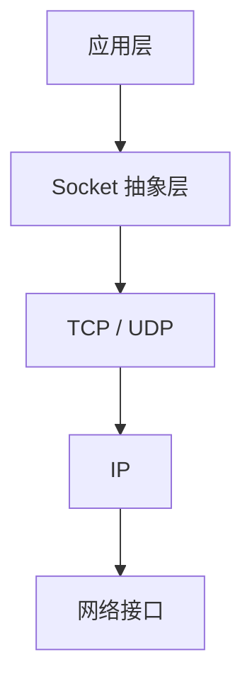
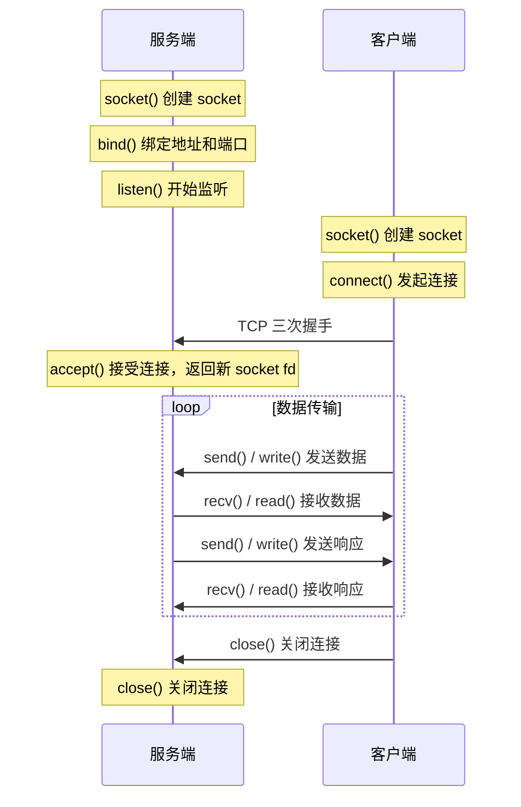

# Socket 编程

## ⭐ 面试重点速览

| 考察点 | 重要程度 | 面试频率 | 掌握目标 |
|--------|----------|----------|----------|
| TCP Socket 编程流程 | ⭐⭐⭐ | 极高 | 能口述服务端 bind-listen-accept 和客户端 connect |
| 拆包与粘包 | ⭐⭐⭐ | 极高 | 理解原因和三种解决方案 |
| UDP Socket 编程 | ⭐⭐ | 高 | 理解与 TCP Socket 的区别 |
| Socket 常用 API | ⭐⭐ | 高 | bind、listen、accept、connect、send、recv |
| 半关闭与 shutdown | ⭐⭐ | 中 | 理解 close 和 shutdown 的区别 |

---

## 一、Socket 是什么

Socket（套接字）是操作系统提供的**网络编程接口**，是应用层和传输层之间的抽象门。它把复杂的 TCP/IP 协议栈细节封装起来，让开发者可以像读写文件一样发送和接收网络数据。



在 Linux 中，Socket 本质上是一个**文件描述符（fd）**，所有 Socket 操作都是通过 fd 完成的。这就是"一切皆文件"的设计哲学。

---

## 二、TCP Socket 编程流程

TCP Socket 的编程流程是面试中高频考点，要能完整画出来。



### 服务端步骤

1. **socket()**：创建 socket，返回文件描述符
2. **bind()**：绑定 socket 到本地地址和端口
3. **listen()**：将 socket 设为监听模式，准备接受连接。第二个参数 backlog 指定已完成连接队列的最大长度
4. **accept()**：阻塞等待客户端连接，返回一个新的 socket fd，后续通信用这个新 fd
5. **recv() / send()**：通过新 fd 收发数据
6. **close()**：关闭 socket

### 客户端步骤

1. **socket()**：创建 socket
2. **connect()**：发起 TCP 连接，指定服务器地址和端口
3. **send() / recv()**：收发数据
4. **close()**：关闭连接

### Java 示例

```java
// 服务端
ServerSocket serverSocket = new ServerSocket(8080);
while (true) {
    Socket clientSocket = serverSocket.accept(); // 阻塞等待连接
    // 用线程池处理每个连接
    new Thread(() -> {
        try (BufferedReader in = new BufferedReader(
                new InputStreamReader(clientSocket.getInputStream()));
             PrintWriter out = new PrintWriter(
                clientSocket.getOutputStream(), true)) {
            String line;
            while ((line = in.readLine()) != null) {
                out.println("Echo: " + line);
            }
        } catch (IOException e) {
            e.printStackTrace();
        }
    }).start();
}

// 客户端
Socket socket = new Socket("localhost", 8080);
PrintWriter out = new PrintWriter(socket.getOutputStream(), true);
BufferedReader in = new BufferedReader(
    new InputStreamReader(socket.getInputStream()));
out.println("Hello Server");
System.out.println("Server says: " + in.readLine());
socket.close();
```

---

## 三、UDP Socket 编程

UDP Socket 简单很多，不需要建立连接，直接发送数据：

```java
// 服务端
DatagramSocket serverSocket = new DatagramSocket(8080);
byte[] buffer = new byte[1024];
DatagramPacket packet = new DatagramPacket(buffer, buffer.length);
serverSocket.receive(packet); // 阻塞等待数据
String msg = new String(packet.getData(), 0, packet.getLength());
System.out.println("收到: " + msg + " 来自: " + packet.getAddress());

// 客户端
DatagramSocket clientSocket = new DatagramSocket();
byte[] data = "Hello UDP".getBytes();
DatagramPacket packet = new DatagramPacket(
    data, data.length, InetAddress.getByName("localhost"), 8080);
clientSocket.send(packet);
clientSocket.close();
```

### TCP Socket vs UDP Socket

| 对比 | TCP Socket | UDP Socket |
|------|------------|------------|
| 类 | Socket / ServerSocket | DatagramSocket |
| 连接 | 需要 connect() + accept() | 不需要，直接 send/receive |
| 数据单位 | 字节流，无边界 | 数据报，有边界 |
| 可靠性 | 保证可靠 | 不保证 |
| 顺序 | 保证有序 | 不保证 |

---

## 四、拆包与粘包问题

这是面试高频考点，TCP 是字节流没有消息边界，多个消息连续发送时，TCP 可能把它们合并发送，接收方就很难区分消息边界。

### 为什么会出现粘包？

1. **发送方合并**：Nagle 算法把小包合并成一个大包发送，提高效率
2. **接收方合并**：接收方不及时读取，多个包在接收缓冲区堆在一起
3. **TCP 字节流特性**：TCP 只保证字节流，不保证每个 send 对应一个 recv

### 为什么会出现拆包？

1. **发送缓冲区满了**：一次 send 的数据太大，TCP 分了多次发送
2. **MSS 限制**：TCP 报文段最大长度限制（MSS），数据超过 MSS 会被拆成多个段
3. **IP 分片**：IP 层 MTU 限制，一个 TCP 段可能被拆成多个 IP 包

### 三种解决方案

#### 方案一：固定长度

每个消息长度固定，接收方按固定长度读取。比如每个消息 100 字节，不够就填充。

```java
// 固定长度 100 字节
byte[] buffer = new byte[100];
int read = inputStream.read(buffer);
// 一个消息就是 100 字节
```

**优点：** 简单，效率高。
**缺点：** 浪费带宽，短消息要填充到固定长度。

#### 方案二：特殊分隔符

每个消息末尾加特殊分隔符（如 `\n`、`\r\n`），接收方读到分隔符就知道一个消息结束了。

```java
BufferedReader reader = new BufferedReader(
    new InputStreamReader(socket.getInputStream()));
String line;
while ((line = reader.readLine()) != null) {
    // 每行就是一个消息
}
```

**优点：** 简单，灵活，适合文本协议。
**缺点：** 消息体不能包含分隔符，需要转义；二进制数据不适合。

#### 方案三：消息头 + 消息体（长度字段）

在消息头部加上长度字段，接收方先读长度，再按长度读消息体。这是最通用、最推荐的方式。

```java
// 发送方：消息头 4 字节表示长度，后面跟消息体
byte[] body = "Hello World".getBytes();
DataOutputStream dos = new DataOutputStream(socket.getOutputStream());
dos.writeInt(body.length);  // 先写长度（4 字节）
dos.write(body);            // 再写消息体

// 接收方：先读长度，再读消息体
DataInputStream dis = new DataInputStream(socket.getInputStream());
int length = dis.readInt();        // 先读长度
byte[] body = new byte[length];
dis.readFully(body);               // 再读指定长度的消息体
String msg = new String(body);
```

**优点：** 通用，支持任意长度，支持二进制。
**缺点：** 需要额外编程。

::: tip 推荐方案
在实际工程中，推荐使用**方案三（消息头+消息体）**，这是最通用和可靠的方案。Netty 自带的 LengthFieldBasedFrameDecoder 就是基于这个原理。
:::

---

## 五、Socket 常见问题

### 5.1 close() vs shutdown()

| 操作 | 作用 |
|------|------|
| `close()` | 关闭 socket，释放所有资源，引用计数减 1，引用计数为 0 时才真正释放 |
| `shutdown(SHUT_WR)` | 只关闭写端，还可以读数据（半关闭） |

`close()` 的问题：如果多个进程共享同一个 socket fd，`close()` 只减少引用计数。必须等所有引用都关闭，连接才真正关闭。

`shutdown()` 可以精确控制关闭方向：只关写不关读，优雅关闭。

### 5.2 SO_REUSEADDR

服务器重启时，之前的 socket 可能还在 TIME_WAIT 状态，端口被占用，bind 会失败。设置 `SO_REUSEADDR` 可以在 TIME_WAIT 时就复用端口。

```java
serverSocket.setReuseAddress(true); // 允许端口复用
```

### 5.3 SO_LINGER

控制 `close()` 的行为：
- 默认：`close()` 立即返回，内核继续发送缓冲区中的数据
- 设置 `SO_LINGER`：`close()` 阻塞等待，直到数据发送完或超时

### 5.4 TCP_NODELAY

禁用 Nagle 算法，对小数据包延迟敏感的场景（如游戏、实时通信）可以设置 `TCP_NODELAY`，避免因为等待合并而产生延迟：

```java
socket.setTcpNoDelay(true); // 禁用 Nagle 算法
```

---

## 六、交叉关联到其他模块

- **TCP 协议**：参见 [TCP 协议](../fundamentals/tcp.md)，Socket 编程底层对应 TCP 连接和状态
- **IO 模型**：参见 [IO 模型](./io-models.md)，Socket 编程中的阻塞与非阻塞模式
- **Java NIO**：参见 [Java 进阶：IO/NIO](../../java-advanced/io-nio/nio.md)，NIO 的 SocketChannel 和 ServerSocketChannel
- **Netty**：参见 [Java 进阶：Netty](../../java-advanced/io-nio/netty.md)，Netty 封装了 Socket 编程的拆包粘包处理

---

## 七、经典高频面试题

### Q1：TCP Socket 编程中，服务端和客户端的完整流程是什么？

**参考答案：**
**服务端：**
1. `socket()` 创建 socket
2. `bind()` 绑定地址和端口
3. `listen()` 开始监听，设置 backlog
4. `accept()` 阻塞等待客户端连接，返回新 socket fd
5. `recv() / send()` 收发数据
6. `close()` 关闭连接

**客户端：**
1. `socket()` 创建 socket
2. `connect()` 发起连接（三次握手）
3. `send() / recv()` 收发数据
4. `close()` 关闭连接

### Q2：什么是 TCP 粘包和拆包？为什么会出现？怎么解决？

**参考答案：**
粘包：多个消息被 TCP 合并成一个数据块发送，接收方无法区分消息边界。
拆包：一个消息被 TCP 拆成多个数据块发送，接收方需要组合。

原因：
1. Nagle 算法合并小包，提高效率
2. 接收方不及时读取，多个包堆积在缓冲区
3. MSS 限制，大消息被拆分
4. IP 层 MTU 限制，TCP 段被拆成多个 IP 包

解决方案：
1. **固定长度**：每个消息固定长度，按长度切割
2. **特殊分隔符**：每个消息末尾加特殊字符，如 `\n`
3. **消息头 + 消息体**：在消息头部加长度字段，先读长度再读消息体（推荐）

### Q3：TCP Socket 编程中，close() 和 shutdown() 有什么区别？

**参考答案：**
- `close()`：关闭 socket，释放资源。如果多个进程共享同一个 fd，只减少引用计数，引用计数为 0 时才真正关闭
- `shutdown()`：可以精确控制关闭方向：
  - `SHUT_RD`：关闭读端
  - `SHUT_WR`：关闭写端，仍可读（半关闭）
  - `SHUT_RDWR`：关闭读和写

`shutdown(SHUT_WR)` 常用于优雅关闭：客户端先关闭写端，告诉服务器"我不再发送了"，服务器收到后可以继续发送剩余数据，直到服务器也关闭写端。

### Q4：SO_REUSEADDR 是做什么的？什么时候需要设置？

**参考答案：**
`SO_REUSEADDR` 允许在 TIME_WAIT 状态的端口被新连接复用。

使用场景：
1. 服务器重启时，之前的 socket 可能还在 TIME_WAIT，端口被占用，导致 bind 失败。设置 `SO_REUSEADDR` 后可以立即重启。
2. 多个进程监听同一端口（需配合 SO_REUSEPORT）。

注意：`SO_REUSEADDR` 只允许复用 TIME_WAIT 的端口，不代表可以随意绑定已经建立连接的端口。

### Q5：Socket 的 backlog 参数是什么？设置多少合适？

**参考答案：**
`listen(sockfd, backlog)` 中的 backlog 参数指定**已完成连接队列**的最大长度。

TCP 三次握手过程中，有两个队列：
1. **半连接队列（SYN Queue）**：收到 SYN 但还没完成三次握手的连接
2. **全连接队列（Accept Queue）**：已完成三次握手，等待 accept() 取走的连接

backlog 指定的是全连接队列的最大长度。如果队列满了，新的连接请求会被拒绝。

设置多大合适：
- 高并发场景：建议 1024 或更大
- 内核实际最大值受 `net.core.somaxconn` 限制
- 太小会导致连接被拒绝，太大浪费内存
- 一般场景设置几百就够，高并发场景设置 1024+

### Q6：UDP Socket 和 TCP Socket 编程有什么区别？

**参考答案：**
| 对比 | TCP Socket | UDP Socket |
|------|------------|------------|
| 连接 | 需要 connect() / accept() | 不需要连接，直接 send/receive |
| 类 | Socket / ServerSocket | DatagramSocket |
| 数据单位 | 字节流，无边界 | 数据报，每次发送一个完整报文 |
| 可靠性 | 保证可靠到达 | 不保证，可能丢包 |
| 顺序 | 保证有序 | 不保证有序 |
| 拆包粘包 | 需要处理 | 不需要处理（每个报文独立） |
| 适用场景 | 文件传输、HTTP、数据库 | 视频直播、DNS、游戏 |

UDP Socket 编程更简单，不需要 accept 和 connect，直接 send 和 receive。但需要自己处理丢包和乱序问题。