# 达梦 DM8 核心原理

## 概述

达梦 DM8 是武汉达梦数据库股份有限公司自主研发的关系型数据库，也是中国最早开始研发的国产数据库产品（1988 年立项）。达梦的核心竞争力在于**完全自主知识产权**（不基于任何开源数据库）、**高度 Oracle 兼容**（PL/SQL、数据类型、存储过程）、**共享存储集群（DSC）**以及**行列融合存储**。达梦是信创目录中"自主可控"等级最高的数据库产品。

::: tip 学习目标
理解达梦 DM8 的整体架构和完全自研的技术路线，掌握 DSC 共享存储集群的工作原理，了解达梦在 Oracle 兼容性方面的深度覆盖，能够解释行列融合存储（HUGE TABLE）的设计思路，并回答面试中关于达梦架构、Oracle 迁移、信创定位等高频问题。
:::

---

## 一、知识图谱

```mermaid
graph TD
    A[达梦 DM8] --> B[架构设计]
    A --> C[Oracle 兼容]
    A --> D[集群方案]
    A --> E[存储引擎]
    A --> F[信创生态]

    B --> B1["完全自研内核<br/>不基于任何开源数据库"]
    B --> B2["多线程架构<br/>调度器 + 工作线程"]
    B --> B3["CBO 优化器<br/>代价模型 + 直方图统计"]
    B --> B4["SQL 执行引擎<br/>向量化 + 并行执行"]

    C --> C1["PL/SQL 兼容<br/>存储过程/函数/包/触发器"]
    C --> C2["数据类型兼容<br/>NUMBER/VARCHAR2/DATE/CLOB"]
    C --> C3["语法兼容<br/>MERGE INTO/CONNECT BY/ROWNUM"]
    C --> C4["Oracle 迁移工具<br/>DTS 数据迁移服务"]

    D --> D1["DSC 共享存储集群<br/>类似 Oracle RAC"]
    D --> D2["MPP 并行集群<br/>大规模并行处理"]
    D --> D3["主备集群<br/>Data Guard 式容灾"]
    D --> D4["读写分离集群<br/>主库写 + 多备库读"]

    E --> E1["HUGE TABLE<br/>行列融合存储"]
    E --> E2["B+Tree 索引"]
    E --> E3["全文索引"]
    E --> E4["HUGE 表压缩"]

    F --> F1["国产 CPU 适配<br/>鲲鹏/飞腾/龙芯/申威"]
    F --> F2["国产 OS 适配<br/>统信 UOS/麒麟"]
    F --> F3["国密算法<br/>SM2/SM3/SM4"]
    F --> F4["信创目录<br/>最高等级自主可控"]
```



---

## 二、基础到进阶学习路线

- **阶段一：基础入门** —— 了解达梦 DM8 的产品定位（完全自研、Oracle 兼容、信创首选），安装达梦数据库（Windows/Linux），熟悉基本 SQL 操作和 DM8 管理工具。
- **阶段二：原理深入** —— 深入理解 DM8 的多线程架构、CBO 优化器、HUGE TABLE 行列融合存储、DSC 共享存储集群的 Cache Fusion 机制、DTS 迁移工具原理。
- **阶段三：实战优化** —— 掌握 Oracle 到 DM8 的迁移（DTS 数据迁移 + 存储过程改写 + 性能对比测试），DM8 性能调优（统计信息、索引优化、SQL 改写），信创全栈适配部署。

---

## 三、核心知识详解

### 3.1 DM8 整体架构

达梦 DM8 采用完全自研的多线程架构，与 Oracle 架构高度相似。

```
DM8 架构概览：

┌─────────────────────────────────────────────────────────────┐
│                      客户端连接层                              │
│  ┌──────────┐  ┌──────────┐  ┌──────────┐                  │
│  │ JDBC/ODBC│  │ DPI 接口 │  │ DM 管理工具│                  │
│  └────┬─────┘  └────┬─────┘  └────┬─────┘                  │
│       └──────────────┼────────────┘                         │
└──────────────────────┼──────────────────────────────────────┘
                       │
┌──────────────────────▼──────────────────────────────────────┐
│                    SQL 引擎层                                 │
│  ┌──────────────┐  ┌──────────────┐  ┌──────────────────┐  │
│  │ 语法分析器    │  │ CBO 优化器   │  │ 执行器            │  │
│  │ (词法+语法)   │  │ (代价模型)   │  │ (向量化+并行)     │  │
│  └──────────────┘  └──────────────┘  └──────────────────┘  │
└─────────────────────────────────────────────────────────────┘
                       │
┌──────────────────────▼──────────────────────────────────────┐
│                    存储引擎层                                 │
│  ┌──────────────┐  ┌──────────────┐  ┌──────────────────┐  │
│  │ 行存储引擎    │  │ 列存储引擎   │  │ HUGE TABLE       │  │
│  │ (OLTP)       │  │ (OLAP)       │  │ (行列融合)        │  │
│  └──────────────┘  └──────────────┘  └──────────────────┘  │
└─────────────────────────────────────────────────────────────┘
                       │
┌──────────────────────▼──────────────────────────────────────┐
│                    事务与日志层                               │
│  ┌──────────────┐  ┌──────────────┐  ┌──────────────────┐  │
│  │ MVCC 多版本  │  │ REDO 日志    │  │ UNDO 日志        │  │
│  │ (回滚段)     │  │ (崩溃恢复)   │  │ (事务回滚)        │  │
│  └──────────────┘  └──────────────┘  └──────────────────┘  │
└─────────────────────────────────────────────────────────────┘
```

**DM8 与 Oracle 架构对比：**

| 组件 | Oracle | DM8 | 说明 |
|------|--------|-----|------|
| 数据库实例 | Instance (SGA + 后台进程) | 实例（内存池 + 线程） | 概念高度一致 |
| 表空间 | Tablespace | 表空间 | 完全兼容 |
| 数据文件 | Datafile (.dbf) | 数据文件 (.dbf) | 扩展名相同 |
| 控制文件 | Control File | 控制文件 | 功能一致 |
| REDO 日志 | Redo Log | 重做日志（RLOG） | 功能一致 |
| UNDO 表空间 | Undo Tablespace | 回滚表空间（ROLL） | 功能一致 |
| 临时表空间 | Temporary Tablespace | 临时表空间（TEMP） | 功能一致 |

### 3.2 Oracle 兼容性

达梦 DM8 对 Oracle 的兼容性在国产数据库中是最深入的，这是其核心竞争优势。

**PL/SQL 兼容性：**

```sql
-- 达梦 DM8 中直接运行 Oracle PL/SQL（绝大多数场景无需修改）

-- 1. 存储过程（完全兼容 Oracle 语法）
CREATE OR REPLACE PROCEDURE proc_transfer(
    p_from_account IN NUMBER,
    p_to_account   IN NUMBER,
    p_amount       IN NUMBER
) AS
    v_balance NUMBER;
BEGIN
    -- 查询余额
    SELECT balance INTO v_balance 
    FROM accounts 
    WHERE account_id = p_from_account 
    FOR UPDATE;
    
    -- 检查余额
    IF v_balance < p_amount THEN
        RAISE_APPLICATION_ERROR(-20001, '余额不足');
    END IF;
    
    -- 转账
    UPDATE accounts SET balance = balance - p_amount 
    WHERE account_id = p_from_account;
    UPDATE accounts SET balance = balance + p_amount 
    WHERE account_id = p_to_account;
    
    COMMIT;
EXCEPTION
    WHEN OTHERS THEN
        ROLLBACK;
        RAISE;
END;
/

-- 2. 包（Package）兼容
CREATE OR REPLACE PACKAGE pkg_account AS
    FUNCTION get_balance(p_account_id NUMBER) RETURN NUMBER;
    PROCEDURE audit_log(p_msg VARCHAR2);
END pkg_account;
/

-- 3. 游标（CURSOR）完全兼容
DECLARE
    CURSOR cur_orders IS 
        SELECT order_id, amount FROM orders WHERE status = 'PENDING';
    v_order cur_orders%ROWTYPE;
BEGIN
    OPEN cur_orders;
    LOOP
        FETCH cur_orders INTO v_order;
        EXIT WHEN cur_orders%NOTFOUND;
        -- 处理逻辑
    END LOOP;
    CLOSE cur_orders;
END;
/
```

**数据类型兼容性：**

| Oracle 类型 | DM8 类型 | 兼容性 | 说明 |
|------------|---------|--------|------|
| NUMBER(p,s) | NUMBER(p,s) | 完全兼容 | 精度和标度完全一致 |
| NUMBER | NUMBER | 完全兼容 | 无精度模式（最大 38 位） |
| VARCHAR2(n) | VARCHAR2(n) | 完全兼容 | 32767 字节上限 |
| DATE | DATE | 兼容 | 注意：DM8 的 DATE 也包含时间 |
| TIMESTAMP | TIMESTAMP | 完全兼容 | 支持小数秒 |
| CLOB | CLOB | 完全兼容 | 最大 2G |
| BLOB | BLOB | 完全兼容 | 最大 2G |
| RAW(n) | VARBINARY(n) | 需映射 | 二进制类型名不同但功能一致 |
| ROWID | ROWID | 完全兼容 | 物理行标识 |

**语法兼容示例：**

```sql
-- Oracle 特有语法在 DM8 中直接运行

-- 1. ROWNUM
SELECT * FROM orders WHERE ROWNUM <= 10;

-- 2. CONNECT BY 层次查询
SELECT LEVEL, employee_id, manager_id, employee_name
FROM employees
START WITH manager_id IS NULL
CONNECT BY PRIOR employee_id = manager_id;

-- 3. MERGE INTO
MERGE INTO target_table t
USING source_table s
ON (t.id = s.id)
WHEN MATCHED THEN UPDATE SET t.name = s.name
WHEN NOT MATCHED THEN INSERT (id, name) VALUES (s.id, s.name);

-- 4. 分析函数（窗口函数）
SELECT 
    order_id,
    amount,
    ROW_NUMBER() OVER (PARTITION BY user_id ORDER BY order_date) AS rn,
    SUM(amount) OVER (PARTITION BY user_id) AS total_amount
FROM orders;

-- 5. DUAL 表
SELECT SYSDATE, USER FROM DUAL;
```

### 3.3 DSC 共享存储集群

DSC（DM Shared Cluster）是达梦的共享存储集群方案，与 Oracle RAC 架构类似，是达梦区别于其他国产数据库的核心竞争力之一。

```
DSC 架构：

┌─────────────────────────────────────────────────────────────┐
│                      应用层                                  │
│  ┌──────────────────────────────────────────────────────┐  │
│  │           DM 集群连接管理器（DSC Connection Manager）  │  │
│  └──────────────────────┬───────────────────────────────┘  │
│                         │                                    │
│         ┌───────────────┼───────────────┐                   │
│         │               │               │                   │
│  ┌──────▼──────┐ ┌──────▼──────┐ ┌──────▼──────┐          │
│  │ DSC 节点 1  │ │ DSC 节点 2  │ │ DSC 节点 N  │          │
│  │ ┌────────┐  │ │ ┌────────┐  │ │ ┌────────┐  │          │
│  │ │Buffer  │  │ │ │Buffer  │  │ │ │Buffer  │  │          │
│  │ │Cache   │◄─┼─┼►│Cache   │◄─┼─┼►│Cache   │  │          │
│  │ └────────┘  │ │ └────────┘  │ │ └────────┘  │          │
│  │    Cache Fusion（高速互联，缓存融合）     │  │          │
│  └──────┬──────┘ └──────┬──────┘ └──────┬──────┘          │
│         │               │               │                   │
│         └───────────────┼───────────────┘                   │
│                         │                                    │
│                   ┌─────▼─────┐                             │
│                   │ 共享存储   │                             │
│                   │ (SAN/DAS) │                             │
│                   └───────────┘                             │
└─────────────────────────────────────────────────────────────┘
```

**DSC 核心特性：**

| 特性 | 说明 | 与 Oracle RAC 对比 |
|------|------|------------------|
| **Cache Fusion** | 节点间通过高速网络传递缓存数据块 | 与 Oracle RAC Cache Fusion 原理一致 |
| **全局锁管理** | 分布式锁管理器协调跨节点并发访问 | 对标 Oracle GES/GCS |
| **共享存储** | 所有节点访问同一份数据文件 | 与 Oracle RAC ASM 类似 |
| **故障透明切换** | 节点故障后，连接自动切换到其他节点 | 对标 Oracle TAF（透明应用故障转移） |
| **负载均衡** | 连接管理器将请求分发到不同节点 | 对标 Oracle SCAN Listener |

**DSC 配置示例：**

```sql
-- DSC 集群配置（dm.ini 关键参数）
-- 节点 1
INSTANCE_NAME = DSC01
DSC_NUM = 2                          -- 集群节点数
DSC_PORT = 5236
MAL_PORT = 5237

-- 全局缓存参数
DSC_BUFFER_SIZE = 4096               -- 缓存页大小（4K）
DSC_CR_POOL_SIZE = 1024              -- CR 池大小（MB）
DSC_LOCK_POOL_SIZE = 512             -- 锁池大小（MB）

-- 查看 DSC 状态
SELECT * FROM V$DSC_STATUS;
SELECT * FROM V$DSC_GBS_INFO;        -- 全局缓存统计
```

### 3.4 HUGE TABLE 行列融合存储

HUGE TABLE 是达梦 DM8 的独特存储引擎，同时支持行存和列存的融合存储。

```
HUGE TABLE 存储结构：

┌─────────────────────────────────────────────────────────────┐
│                   HUGE TABLE 存储结构                        │
│                                                             │
│  逻辑结构：                                                  │
│  ┌─────────────────────────────────────────────────────┐   │
│  │  HUGE TABLE                                          │   │
│  │  ├── 分区 1                                          │   │
│  │  │   ├── 子区 1-1                                    │   │
│  │  │   │   ├── 行存区（热点数据，OLTP 优化）             │   │
│  │  │   │   └── 列存区（冷数据，OLAP 优化，压缩存储）      │   │
│  │  │   └── 子区 1-2                                    │   │
│  │  └── 分区 2                                          │   │
│  └─────────────────────────────────────────────────────┘   │
│                                                             │
│  物理存储：                                                  │
│  ┌─────────────────────────────────────────────────────┐   │
│  │ 行存区（.dbf 文件）   │  列存区（.dbf 压缩文件）       │   │
│  │ B+Tree 索引结构      │  列式压缩存储                  │   │
│  │ 适合频繁更新         │  适合大量扫描                   │   │
│  │ 压缩比 1:1 ~ 2:1    │  压缩比 5:1 ~ 20:1            │   │
│  └─────────────────────────────────────────────────────┘   │
└─────────────────────────────────────────────────────────────┘
```

```sql
-- 创建 HUGE TABLE（行列融合存储）
CREATE HUGE TABLE orders_huge (
    order_id BIGINT,
    user_id BIGINT,
    product_id INTEGER,
    amount DECIMAL(18,2),
    status VARCHAR(20),
    order_date DATETIME,
    delivery_address VARCHAR(500)
) 
PARTITION BY RANGE (order_date) (
    -- 近 3 个月数据：行存（OLTP 热点）
    PARTITION p_current VALUES LESS THAN ('2025-07-01') 
        STORAGE (WITHOUT COLUMN),
    -- 3 个月前数据：列存（OLAP 冷数据，压缩）
    PARTITION p_history VALUES LESS THAN ('2025-04-01') 
        STORAGE (WITH COLUMN),
    -- 过渡数据：行列混合
    PARTITION p_transition VALUES LESS THAN (MAXVALUE) 
        STORAGE (WITH COLUMN, WITHOUT COLUMN)
);

-- HUGE TABLE 的自动数据迁移
-- 数据按时间自动在行存和列存之间迁移
-- 最近数据：行存，高性能 OLTP
-- 历史数据：列存，高压缩比 OLAP
```

**HUGE TABLE 核心优势：**

| 特性 | 说明 |
|------|------|
| **行列融合** | 同一张表同时支持行存和列存，无需手动维护多张表 |
| **自动冷热分离** | 数据按时间自动从行存迁移到列存 |
| **高压缩比** | 列存区压缩比可达 5:1 ~ 20:1 |
| **透明查询** | 查询自动路由到行存或列存，对应用透明 |
| **分区级管理** | 每个分区可独立设置存储模式 |

### 3.5 数据迁移工具（DTS）

达梦 DTS（Data Transfer Service）是 Oracle 到 DM8 迁移的核心工具。

```
DTS 迁移流程：

┌─────────────────────────────────────────────────────────────┐
│                    DTS 迁移工具                              │
│                                                             │
│  ┌──────────┐    ┌──────────┐    ┌──────────┐             │
│  │ 兼容性评估│───►│ 结构迁移 │───►│ 数据迁移 │             │
│  │ (扫描不  │    │ (DDL 转换)│    │ (全量+增量)│            │
│  │  兼容项) │    └──────────┘    └──────────┘             │
│  └──────────┘         │               │                    │
│       │               ▼               ▼                    │
│       │         ┌──────────┐    ┌──────────┐             │
│       └────────►│ 兼容改写 │    │ 数据校验 │             │
│                 │ (PL/SQL) │    │ (行数+MD5)│             │
│                 └──────────┘    └──────────┘             │
└─────────────────────────────────────────────────────────────┘
```

```sql
-- DTS 迁移后的数据校验
-- 1. 行数校验
SELECT 'Oracle' AS source, COUNT(*) FROM orders@ORACLE_LINK
UNION ALL
SELECT 'DM8' AS source, COUNT(*) FROM orders;

-- 2. 关键字段校验（MD5 校验）
-- Oracle 端
SELECT SUM(ORA_HASH(order_id || amount || order_date)) FROM orders;
-- DM8 端
SELECT SUM(ORA_HASH(order_id || amount || order_date)) FROM orders;

-- 3. 业务完整性校验（余额求和）
SELECT SUM(balance) FROM accounts;  -- 两边结果必须一致
```

---

## 四、经典应用场景与解决方案

### 场景：政府 OA 系统从 Oracle 迁移到达梦 DM8

**问题背景**

某省级政府部门 OA 系统（公文流转、档案管理、行政审批）使用 Oracle 11g 单机，数据库约 500GB。信创替代要求将 OA 系统迁移到达梦 DM8，同时适配国产 CPU（鲲鹏）+ 国产 OS（麒麟 V10）。

**完整方案**

```
迁移架构：

改造前：
┌────────────────────────────────┐
│      Oracle 11g（单机）        │
│  ┌──────────────────────────┐  │
│  │ OA 系统（Java 应用）      │  │
│  │ MyBatis + Oracle JDBC    │  │
│  │ 存储过程：50+ 个          │  │
│  │ 触发器：10+ 个            │  │
│  └──────────────────────────┘  │
└────────────────────────────────┘

改造后：
┌────────────────────────────────────────────────┐
│  硬件：鲲鹏 920（ARM 64 核）/ 256G / 2T SSD     │
│  操作系统：麒麟 V10（ARM 版）                    │
│  ┌──────────────────────────────────────────┐  │
│  │     达梦 DM8（单机 + 主备）               │  │
│  │  ┌────────────────────────────────────┐  │  │
│  │  │ OA 系统（Java 应用）                │  │  │
│  │  │ MyBatis + DM8 JDBC 驱动            │  │  │
│  │  │ 存储过程：48 个（零修改）            │  │  │
│  │  │ 触发器：10 个（零修改）              │  │  │
│  │  │ 2 个存储过程需改写（Oracle 特有函数） │  │  │
│  │  └────────────────────────────────────┘  │  │
│  └──────────────────────────────────────────┘  │
│  ┌──────────────────────────────────────────┐  │
│  │  达梦 DM8 主备（Data Watch）              │  │
│  │  主库 → 实时同步 → 备库                   │  │
│  └──────────────────────────────────────────┘  │
└────────────────────────────────────────────────┘
```

**迁移步骤：**

```sql
-- 第一步：兼容性评估（使用 DTS 工具）
-- 扫描结果：
-- - 完全兼容：95% 的 SQL 和 PL/SQL
-- - 需微调：3%（数据类型映射）
-- - 需改写：2%（Oracle 特有函数）

-- 第二步：数据类型映射（需微调的部分）
-- Oracle RAW(16) → DM8 VARBINARY(16)
-- Oracle BINARY_FLOAT → DM8 FLOAT
-- Oracle BINARY_DOUBLE → DM8 DOUBLE

-- 第三步：改写 Oracle 特有函数
-- Oracle: WM_CONCAT（非官方函数）
-- DM8 改写：
-- LISTAGG(name, ',') WITHIN GROUP (ORDER BY id)

-- Oracle: CONNECT BY 层次查询
-- DM8 完全兼容，无需改写（达梦对 CONNECT BY 兼容良好）

-- 第四步：存储过程改写示例
-- Oracle 写法（使用了 SYS_CONTEXT 函数）
CREATE OR REPLACE PROCEDURE get_user_info AS
    v_user VARCHAR2(100);
BEGIN
    SELECT SYS_CONTEXT('USERENV', 'SESSION_USER') INTO v_user FROM DUAL;
    -- DM8 改写：SYS_CONTEXT 函数在 DM8 中支持有限
    -- 方案：使用 DM8 的 SESSID 或 USER 替代
    SELECT USER INTO v_user FROM DUAL;
END;
/

-- 第五步：Java 应用改造
-- 1. 替换 JDBC 驱动
--    Oracle: ojdbc8.jar
--    DM8:    DmJdbcDriver18.jar

-- 2. 修改 JDBC 连接串
--    Oracle: jdbc:oracle:thin:@//host:1521/orcl
--    DM8:    jdbc:dm://host:5236/OA_DB

-- 3. MyBatis 中的特殊处理
--    Oracle 序列: SEQ_XXX.NEXTVAL
--    DM8: 完全兼容，无需修改
```

**迁移效果：**

| 指标 | Oracle 11g | DM8 | 变化 |
|------|-----------|-----|------|
| 公文查询响应时间 | 80ms | 85ms | 基本持平 |
| 并发用户数 | 500 | 500 | 零下降 |
| 存储过程兼容率 | - | 96% | 50 个中 48 个零修改 |
| 硬件成本 | x86 服务器 | 鲲鹏 ARM 服务器 | 信创适配 |
| 许可证费用 | 100 万/年 | 15 万/年 | 节省 85% |

---

## 五、高频面试题

### Q1: 达梦 DM8 的架构特点是什么？为什么说"完全自研"？

::: details 答案

达梦 DM8 采用**完全自主研发**的多线程架构，不基于任何开源数据库内核。

**核心架构特点：**

**1. 多线程架构（对标 Oracle 进程模型）**
- 一个数据库实例包含：监听线程、工作线程、IO 线程、日志线程、检查点线程
- 工作线程从任务队列获取 SQL 请求，执行完毕后返回结果
- 相比 PostgreSQL 的进程模型，线程模型在高并发下资源开销更低

**2. 存储引擎**
- 行存储引擎：适合 OLTP，B+Tree 索引结构
- 列存储引擎：适合 OLAP，列式压缩存储
- HUGE TABLE：行列融合存储，自动冷热分离

**3. CBO 优化器**
- 基于代价的优化器（Cost-Based Optimizer）
- 支持直方图统计（等频/等高）、多列统计信息
- 支持 HINT 强制指定执行计划

**4. 事务与 MVCC**
- 基于回滚段（UNDO）的 MVCC 实现
- 支持 READ COMMITTED 和 SERIALIZABLE 隔离级别
- REDO 日志保证崩溃恢复

**"完全自研"的含义：**
- 达梦从 1988 年开始研发，内核代码 100% 自主编写
- 不依赖 MySQL、PostgreSQL、SQLite 等任何开源数据库
- 在国家信创目录中，自主可控等级最高

**"完全自研"的优势与代价：**

| 优势 | 代价 |
|------|------|
| 自主可控，无开源协议风险 | 无法利用开源社区贡献 |
| 可针对国内需求定制 | 研发成本高，迭代速度慢 |
| 信创合规最高等级 | 人才来源少（DM DBA 稀缺） |
| 不受上游开源项目影响 | 生态工具链需自建 |
:::

### Q2: 达梦 DM8 的 Oracle 兼容性如何？能做到"零修改迁移"吗？

::: details 答案

达梦 DM8 是国产数据库中 **Oracle 兼容性最深**的产品，但**无法做到 100% 零修改迁移**。

**兼容性覆盖范围：**

| 类别 | 兼容度 | 说明 |
|------|--------|------|
| SQL 语法（DML） | 98%+ | SELECT/INSERT/UPDATE/DELETE/MERGE 基本 100% 兼容 |
| SQL 语法（DDL） | 95%+ | CREATE TABLE/INDEX/VIEW 等，部分高级选项需调整 |
| PL/SQL 存储过程 | 90%+ | 变量声明、游标、循环、异常处理基本兼容 |
| PL/SQL 包（Package） | 85%+ | 包头/包体定义兼容，部分内置包不同 |
| 数据类型 | 95%+ | NUMBER/VARCHAR2/DATE/TIMESTAMP/CLOB/BLOB 兼容 |
| 序列 | 100% | CREATE SEQUENCE / NEXTVAL / CURRVAL 完全兼容 |
| 触发器 | 90%+ | DML 触发器兼容，DDL 触发器部分兼容 |
| 分析函数 | 95%+ | ROW_NUMBER/RANK/LEAD/LAG/SUM OVER 等兼容 |
| 层次查询 | 100% | CONNECT BY / START WITH 完全兼容 |
| 内置函数 | 90%+ | TO_CHAR/TO_DATE/DECODE/NVL/NVL2 等兼容 |

**需要修改的场景：**

```sql
-- 1. Oracle 特有内置函数（需改写）
-- Oracle: WM_CONCAT（非官方函数，Oracle 12c 已移除）
-- DM8 改写：LISTAGG(name, ',') WITHIN GROUP (ORDER BY id)

-- 2. Oracle 高级包（部分不支持）
-- Oracle: DBMS_SCHEDULER（高级调度）
-- DM8: 使用 DM8 的作业系统（SYSJOB）替代

-- 3. Oracle 自治事务（PRAGMA AUTONOMOUS_TRANSACTION）
-- DM8: 不支持，需重构业务逻辑

-- 4. Oracle 高级队列（AQ）
-- DM8: 不支持，需用消息中间件替代

-- 5. Oracle 物化视图刷新组
-- DM8: 物化视图的基本功能支持，但刷新组不支持
```

**典型迁移工作占比：**
- 零修改：75% ~ 85%（SQL 和简单的 PL/SQL）
- 少量修改：10% ~ 15%（内置函数替换、数据类型映射）
- 中等修改：3% ~ 5%（存储过程改写、包改写）
- 大量修改：1% ~ 2%（架构重构，如自治事务、高级队列）

**迁移建议：**
1. 使用 DTS 工具先做兼容性评估，量化改造工作量
2. 优先处理零修改的部分，快速建立信心
3. 对需要改写的部分建立映射表，批量处理
4. 建议业务方参与验收测试，确保功能等价
:::

### Q3: DSC 共享存储集群是什么？和 Oracle RAC 有什么异同？

::: details 答案

**DSC（DM Shared Cluster）是达梦的共享存储集群方案**，与 Oracle RAC 设计理念高度一致。

**DSC 核心原理：**

1. **共享存储**
   - 所有 DSC 节点共享同一份数据文件（存储在 SAN 或 DAS 上）
   - 与 Oracle RAC 的 ASM 不同，DSC 使用文件系统直接访问

2. **Cache Fusion（缓存融合）**
   - 节点间通过高速网络（InfiniBand / 万兆以太网）传递缓存数据块
   - 当节点 A 需要的数据块在节点 B 的 Buffer Cache 中时，通过 Cache Fusion 直接获取
   - 避免从磁盘读取，大幅降低 IO 延迟

3. **全局锁管理**
   - 分布式锁管理器（DLM）协调跨节点并发访问
   - 对标 Oracle 的 GES（Global Enqueue Service）和 GCS（Global Cache Service）

**DSC vs Oracle RAC 对比：**

| 维度 | DSC | Oracle RAC | 说明 |
|------|-----|-----------|------|
| **共享存储** | 文件系统（NFS/SAN） | ASM 自动存储管理 | Oracle ASM 更成熟 |
| **Cache Fusion** | 支持 | 支持 | 核心机制一致 |
| **全局锁管理** | DLM | GES/GCS | 实现类似 |
| **故障切换** | 支持（TAF） | 支持（TAF） | 透明故障转移 |
| **负载均衡** | 连接管理器 | SCAN Listener | 机制类似 |
| **节点数** | 最多 8 节点 | 最多 128 节点 | Oracle 扩展性更强 |
| **成熟度** | 较新（DM8 重点发展） | 20 年+ | Oracle 更成熟 |
| **成本** | 低（国产） | 极高（许可证 + 维保） | DSC 成本优势明显 |

**DSC 适用场景：**
- 需要高可用 + 横向扩展的 OLTP 系统
- 无法接受分布式数据库（如 OceanBase/TiDB）的 SQL 兼容性损失
- 预算有限，无法承担 Oracle RAC 的成本
- 政府/军工等对自主可控有高要求的场景

**DSC 的局限性：**
- 节点数受限（最多 8 节点），不如 MPP 集群扩展性强
- 依赖共享存储硬件（SAN），成本不低
- 复杂查询场景下的 Cache Fusion 效率不如 Oracle RAC
:::

### Q4: 达梦 DM8 的数据迁移方案是怎样的？需要注意什么？

::: details 答案

**达梦 DTS（Data Transfer Service）是 Oracle 到 DM8 迁移的核心工具**，提供全量 + 增量迁移能力。

**迁移五步法：**

```
1. 兼容性评估（1-2 周）
   ├── 使用 DTS 扫描工具分析 Oracle 数据库
   ├── 输出：不兼容项清单 + 改造工作量评估
   └── 重点关注：存储过程、触发器、数据类型、内置函数

2. 结构迁移（1-3 天）
   ├── DDL 自动转换（表结构、索引、视图、序列）
   ├── 手动调整不兼容的 DDL
   └── 验证：确认所有对象创建成功

3. 全量数据迁移（1-7 天，取决于数据量）
   ├── DTS 全量迁移（多线程并行）
   ├── 建议业务低峰期执行
   └── 验证：行数、SUM 校验、MD5 抽样校验

4. 增量同步（1-4 周，过渡期）
   ├── DTS 增量同步 Oracle redo log
   ├── 延迟控制在秒级
   └── 定期对账，确保数据一致

5. 业务切换（1-2 天）
   ├── 选择业务低峰期（如周末凌晨）
   ├── 停止 Oracle 写入
   ├── 等待增量同步追平
   ├── 切换应用连接 → DM8
   ├── 验证核心功能
   └── 保留 Oracle 回退环境 7 天
```

**关键注意事项：**

| 关注点 | 说明 | 应对 |
|--------|------|------|
| **空串 vs NULL** | Oracle 中空串 '' = NULL，DM8 默认不同 | 设置 `BLANK_PAD_CHAR = 1` |
| **DATE 含时间** | Oracle DATE 包含时间，DM8 需确认 | 迁移后验证 DATE 字段的时间部分 |
| **NUMBER 无精度** | Oracle NUMBER 无精度可达 38 位，DM8 需确认 | 显式指定精度 NUMBER(38) |
| **序列缓存** | Oracle 序列默认 CACHE 20，DM8 默认 CACHE 1 | 迁移后调整序列 CACHE 值 |
| **字符集** | Oracle 字符集（如 ZHS16GBK）需与 DM8 一致 | 确认 DM8 字符集与 Oracle 兼容 |
| **性能对比** | 迁移后需做性能对比测试 | 使用真实业务 SQL 跑基准测试 |

**JDBC 驱动替换：**

```java
// Oracle JDBC 配置
// jdbc:oracle:thin:@//host:1521/orcl
// driver: oracle.jdbc.OracleDriver

// DM8 JDBC 配置
// jdbc:dm://host:5236/db_name
// driver: dm.jdbc.driver.DmDriver

// Spring Boot 配置示例
spring.datasource.url=jdbc:dm://192.168.1.100:5236/OA_DB
spring.datasource.driver-class-name=dm.jdbc.driver.DmDriver
spring.datasource.username=OA_USER
spring.datasource.password=***
```
:::

### Q5: 达梦在信创中的定位是什么？与其他国产数据库相比有什么优势？

::: details 答案

**达梦在信创中的核心定位：自主可控等级最高的国产数据库。**

**信创生态中的位置：**

```
信创目录数据库分类（按自主可控程度）：

第一梯队（完全自研，最高等级）：
  ├── 达梦 DM8 ★★★★★（自主可控最高）
  └── 神舟通用（神通数据库）

第二梯队（基于开源深度改造）：
  ├── openGauss（基于 PG 9.2）
  ├── 人大金仓 KingbaseES（基于 PG）
  └── 瀚高 HighGo（基于 PG）

第三梯队（自研 + 开源）：
  ├── OceanBase（自研，开源社区版）
  └── TiDB（自研，完全开源 Apache 2.0）
```

**达梦的核心优势：**

| 优势 | 说明 |
|------|------|
| **自主可控** | 内核代码 100% 自研，无开源协议风险，满足军工/涉密系统最高安全要求 |
| **Oracle 兼容最深** | PL/SQL、数据类型、CONNECT BY、包等高级特性兼容性国产第一 |
| **DSC 共享存储集群** | 国产唯一支持类似 Oracle RAC 的共享存储集群方案 |
| **信创生态适配最全** | 适配鲲鹏/飞腾/龙芯/申威 + 统信 UOS/麒麟 + 东方通/中创中间件 |
| **本地化服务** | 在各省市有服务团队，政务/军工领域经验丰富 |
| **HUGE TABLE** | 行列融合存储，自动冷热分离，独特技术优势 |

**达梦的劣势：**

| 劣势 | 说明 |
|------|------|
| **闭源封闭** | 不开源，社区小，人才来源少，技术迭代慢 |
| **分布式能力弱** | 无原生分布式架构，DSC 最多 8 节点，不如 OB/TiDB 的弹性扩展 |
| **云原生能力弱** | 无 K8s Operator，容器化部署不成熟 |
| **互联网基因弱** | 缺少互联网场景（高并发秒杀/大规模）验证 |
| **成本** | 商业授权费用不低（虽然比 Oracle 便宜很多） |

**选型总结：**

```
选达梦的场景：
✅ 军工/涉密系统（对自主可控有最高要求）
✅ 政府/央企 OA/ERP（Oracle 迁移、信创合规）
✅ 需要 Oracle RAC 替代（DSC 共享存储集群）
✅ 大量 PL/SQL 存储过程（兼容性最好）

不选达梦的场景：
❌ 互联网高并发（选 TiDB/OB）
❌ 需要水平扩展（选 OB/TiDB）
❌ 需要开源（选 TiDB/openGauss）
❌ 需要云原生部署（选 TiDB）
```
:::

### Q6: 达梦 DM8 的 HUGE TABLE 是什么？解决了什么问题？

::: details 答案

**HUGE TABLE 是达梦 DM8 的行列融合存储引擎**，在一张表中同时支持行存和列存，并能自动在两种存储模式间迁移数据。

**核心设计：**

```
HUGE TABLE 的数据生命周期：

近 3 个月数据（热点）
  → 行存（B+Tree）
  → 高性能 OLTP（点查、更新、小范围扫描）
  → 压缩比：1:1 ~ 2:1

3-6 个月数据（温数据）
  → 行列混合
  → 中等性能 OLTP + OLAP

6 个月以上数据（冷数据）
  → 列存（压缩存储）
  → 高压缩比 OLAP（大范围扫描、聚合查询）
  → 压缩比：5:1 ~ 20:1
```

**解决的问题：**

| 问题 | 传统方案 | HUGE TABLE 方案 |
|------|---------|----------------|
| **历史数据查询慢** | 需要 ETL 到分析库 | 列存区直接查询，无需 ETL |
| **存储成本高** | 全部行存，压缩比低 | 冷数据列存压缩，节省 80% 空间 |
| **数据迁移复杂** | 需要定时归档 + 删除 | 自动迁移，对应用透明 |
| **多套系统维护** | OLTP + OLAP 两套系统 | 一套系统，行列融合 |
| **查询路由复杂** | 应用层判断查 OLTP 还是 OLAP | 数据库自动路由 |

**使用示例：**

```sql
-- 创建 HUGE TABLE，按时间分区
CREATE HUGE TABLE iot_sensor_data (
    sensor_id BIGINT,
    metric_name VARCHAR(50),
    metric_value DOUBLE,
    collect_time DATETIME
)
PARTITION BY RANGE (collect_time) (
    PARTITION p_hot VALUES LESS THAN (DATEADD(MONTH, -3, SYSDATE))
        STORAGE (WITHOUT COLUMN),          -- 行存：近 3 个月
    PARTITION p_warm VALUES LESS THAN (DATEADD(MONTH, -6, SYSDATE)) 
        STORAGE (WITH COLUMN, WITHOUT COLUMN), -- 混合：3-6 个月
    PARTITION p_cold VALUES LESS THAN (MAXVALUE)
        STORAGE (WITH COLUMN)              -- 列存：6 个月以上
);

-- 查询自动路由
-- 查近 3 个月数据 → 自动走行存
SELECT * FROM iot_sensor_data 
WHERE sensor_id = 1001 
  AND collect_time > DATEADD(DAY, -7, SYSDATE);

-- 查历史趋势 → 自动走列存
SELECT 
    DATE_TRUNC('month', collect_time) AS month,
    AVG(metric_value)
FROM iot_sensor_data 
WHERE collect_time > DATEADD(YEAR, -2, SYSDATE)
GROUP BY DATE_TRUNC('month', collect_time);
```

**与 TiDB TiFlash 的对比：**

| 维度 | HUGE TABLE | TiDB TiFlash |
|------|-----------|-------------|
| 实现方式 | 同一引擎内行列融合 | 独立列存引擎（Raft Learner） |
| 数据同步 | 无需同步 | 异步同步（秒级延迟） |
| 数据一致性 | 强一致（同一份数据） | 最终一致 |
| 存储成本 | 无额外副本 | 需要额外 1 副本 |
| 自动冷热分离 | 支持（按分区策略） | 不支持（需手动管理） |
| 适用场景 | 时序数据、日志、IoT | 实时报表、BI 分析 |
:::

---

## 六、选型指南

### 适用场景

| 场景 | 推荐理由 |
|------|---------|
| 军工/涉密系统 | 最高级别自主可控，满足安全合规 |
| 政府/央企 OA/ERP | 信创目录首选，Oracle 兼容最深，迁移成本最低 |
| Oracle RAC 替代 | DSC 共享存储集群，同类架构，迁移成本低 |
| 大量 PL/SQL 存储过程 | 国产数据库中对 Oracle PL/SQL 兼容最好 |
| 时序数据/IoT | HUGE TABLE 行列融合，自动冷热分离 |

### 不适用场景

| 场景 | 原因 | 替代建议 |
|------|------|---------|
| 互联网高并发 | 单机架构为主，分布式能力弱 | OceanBase / TiDB |
| 需要水平扩展 | DSC 最多 8 节点，无原生分布式 | OceanBase / TiDB |
| 需要开源 | 闭源商业软件 | TiDB / openGauss |
| 需要云原生部署 | 无 K8s Operator，容器化不成熟 | TiDB |
| 需要社区活跃支持 | 闭源，社区小 | TiDB / openGauss |

### 配置建议

```sql
-- 生产环境推荐配置
-- 单机：32C / 128G / 2T NVMe SSD
-- DSC：3 节点，每节点 32C / 128G，共享 SAN 存储

-- 核心参数
ALTER SYSTEM SET 'BUFFER' = 32768;          -- 缓存池大小（MB）
ALTER SYSTEM SET 'MAX_SESSIONS' = 1000;     -- 最大会话数
ALTER SYSTEM SET 'WORKER_THREADS' = 32;     -- 工作线程数
ALTER SYSTEM SET 'COMPATIBLE_MODE' = 1;     -- 兼容模式（1=Oracle）
ALTER SYSTEM SET 'BLANK_PAD_CHAR' = 1;      -- 空串 = NULL（Oracle 兼容）
ALTER SYSTEM SET 'CASE_COMPATIBLE_MODE' = 1; -- 大小写兼容模式
```

---

## 相关文档

- [国产数据库概览](./index)
- [OceanBase 核心原理](./oceanbase)
- [TiDB 核心原理](./tidb)
- [openGauss 核心原理](./opengauss)
- [国产数据库选型对比](./selection)