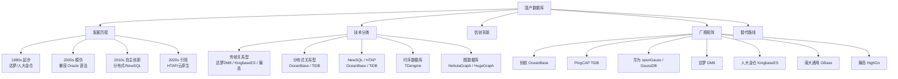
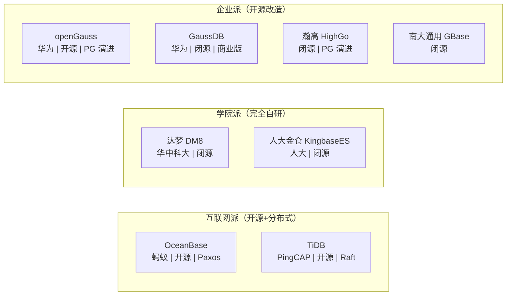
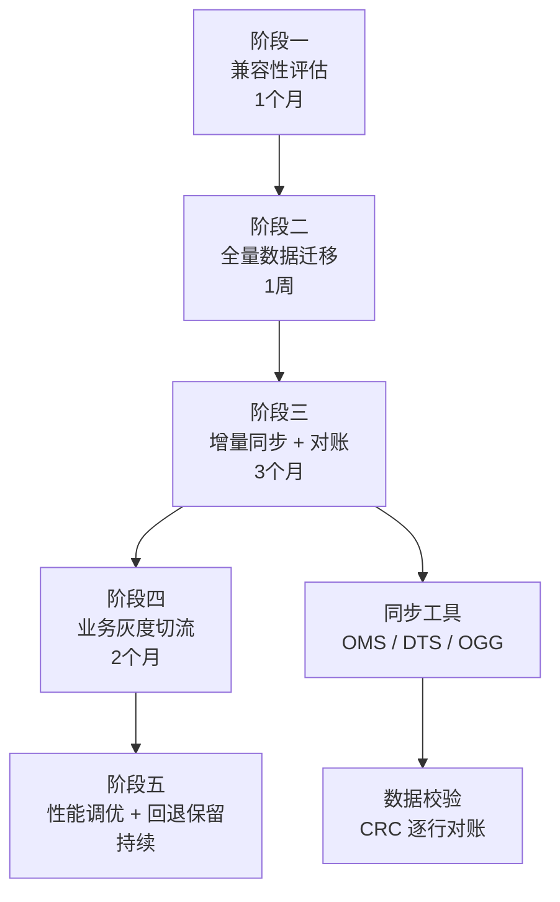

# 国产数据库概览

## 概述

国产数据库是信创产业的核心基础设施，从早期模仿 Oracle/MySQL 到如今在分布式架构领域实现自主创新甚至领先。本模块涵盖主流国产数据库的架构原理、核心技术、选型对比与面试要点，帮助你建立完整的国产数据库知识体系，从容应对信创背景下的技术选型与面试考察。

::: tip 学习目标
掌握国产数据库发展脉络与技术分类，理解各厂商的核心竞争力，能够结合业务场景做出合理的国产数据库选型决策，并回答面试中关于信创、国产替代、分布式架构等高频问题。
:::

---

## 一、知识图谱



---

## 二、基础到进阶学习路线

- **阶段一：基础入门** —— 了解国产数据库的分类体系、各厂商的核心产品与市场定位，建立信创背景认知，能说出至少 5 款国产数据库的名字和特点。
- **阶段二：原理深入** —— 深入学习 OceanBase 的 Paxos 分布式一致性、TiDB 的 Raft + MVCC、openGauss 的 NUMA-Aware 架构、达梦的 DSC 共享存储集群，理解不同架构的 trade-off。
- **阶段三：实战优化** —— 掌握国产数据库的部署运维、数据迁移（从 Oracle/MySQL 迁移到国产库）、性能调优、高可用方案设计，能够制定企业级国产替代方案。

---

## 三、核心知识详解

### 3.1 国产数据库发展历程

```
国产数据库发展阶段：

┌─────────────────────────────────────────────────────────────────────┐
│  1980s-2000s：蹒跚起步                                               │
│  ├─ 1988 年：达梦数据库研究所成立（华中科技大学）                        │
│  ├─ 1999 年：人大金仓成立（中国人民大学）                               │
│  └─ 特征：基于学术研究，产品化程度低，市场份额极小                        │
├─────────────────────────────────────────────────────────────────────┤
│  2000s-2010s：模仿追赶                                               │
│  ├─ 达梦 DM 系列逐步产品化，兼容 Oracle 语法与 PL/SQL                   │
│  ├─ 南大通用 GBase 推出，面向电信与政府市场                             │
│  └─ 特征：以 Oracle 兼容为核心卖点，性能与稳定性差距大                    │
├─────────────────────────────────────────────────────────────────────┤
│  2010s-2020s：自主创新                                               │
│  ├─ 2015 年：PingCAP 成立，TiDB 开源，基于 Raft + MVCC 的 NewSQL       │
│  ├─ 2017 年：OceanBase 开源，基于 Paxos 的一体化分布式数据库             │
│  ├─ 2019 年：openGauss 开源，华为基于 PostgreSQL 9.2 深度改造           │
│  └─ 特征：分布式架构引领，开源生态建设，国际认可（TPC-C 打榜）            │
├─────────────────────────────────────────────────────────────────────┤
│  2020s 至今：引领与替代                                                │
│  ├─ 信创政策推动金融/政府/电信大规模国产替代                             │
│  ├─ OceanBase 在蚂蚁/网商银行全面替代 Oracle                            │
│  ├─ TiDB 在互联网/金融大规模落地                                        │
│  └─ 特征：HTAP 一体化、云原生、AI 原生，从"能用"到"好用"                 │
└─────────────────────────────────────────────────────────────────────┘
```

### 3.2 国产数据库技术分类

| 分类 | 代表产品 | 核心架构 | 关键能力 | 典型场景 |
|------|---------|---------|---------|---------|
| **传统关系型** | 达梦 DM8、KingbaseES、瀚高 HighGo | 单机为主 + 主备复制 | Oracle 兼容、数据迁移、安全合规 | 政府 OA、央企 ERP |
| **分布式关系型** | OceanBase、TiDB | 多副本 Paxos/Raft、计算存储分离 | 水平扩展、强一致、高可用 | 金融核心交易、互联网 |
| **NewSQL/HTAP** | OceanBase、TiDB | 行列混合、实时分析 | TP+AP 一体化 | 实时报表、风控 |
| **时序数据库** | TDengine | 列式存储、超级表模型 | 10x 压缩比、高速写入 | IoT、车联网 |
| **图数据库** | NebulaGraph、HugeGraph | 分布式图存储与计算 | 千亿边查询、毫秒级多跳 | 风控、社交推荐 |

### 3.3 信创背景与政策驱动

::: info 信创（信息技术应用创新）
信创是中国推动 IT 基础设施国产化的战略行动，涵盖 CPU（鲲鹏/飞腾/龙芯）、操作系统（统信 UOS/麒麟）、数据库、中间件、应用软件全栈。
:::

**信创对数据库选型的核心影响：**

| 维度 | 影响 |
|------|------|
| **安全合规** | 等保 2.0、密评要求，国产库通过国密算法（SM2/SM3/SM4）认证 |
| **采购政策** | 党政机关、央企采购目录优先国产，Oracle/SQL Server 逐步退出 |
| **生态适配** | 数据库必须适配国产 CPU（ARM/x86）、国产 OS（UOS/麒麟） |
| **迁移红利** | 国产替代专项经费支持，金融/电信行业分批次迁移 |
| **人才需求** | 国产数据库 DBA 需求激增，薪资倒挂传统 DBA |

### 3.4 主要厂商矩阵



| 厂商 | 产品 | 技术路线 | 开源 | 核心市场 | TPC-C 成绩 |
|------|------|---------|------|---------|-----------|
| **蚂蚁集团** | OceanBase | 自研 Paxos + LSM-Tree | 开源（社区版） | 金融、电商、政企 | 2020 年 7.07 亿 tpmC（世界第一） |
| **PingCAP** | TiDB | 自研 Raft + Percolator MVCC | 完全开源（Apache 2.0） | 互联网、金融、物流 | TPC-C 8.6 万 tpmC（分布式） |
| **华为** | openGauss / GaussDB | PostgreSQL 深度改造 | openGauss 开源 | 运营商、金融、政务 | - |
| **达梦** | DM8 | 完全自研 | 闭源 | 政府、军工、央企 | - |
| **人大金仓** | KingbaseES | PostgreSQL 分支改造 | 闭源 | 政府、央企 | - |
| **南大通用** | GBase 8a/8t | Informix 技术授权 | 闭源 | 电信、金融 | - |
| **瀚高** | HighGo | PostgreSQL 分支 | 部分开源 | 政府、金融 | - |

### 3.5 国产替代路线图

```
替代路线图（分阶段）：

第一阶段：外围系统迁移（低风险）
  ├─ OA 系统、邮件系统、档案管理 → 达梦/KingbaseES
  ├─ 报表系统、BI 分析 → TiDB/TDengine
  └─ 策略："先外围后核心"，积累运维经验

第二阶段：非实时核心系统迁移（中风险）  
  ├─ ERP 系统、HR 系统、财务系统 → 达梦/openGauss
  ├─ 风控引擎、监控系统 → TiDB
  └─ 策略：并行运行 3 个月，业务方灰度切流

第三阶段：核心交易系统迁移（高风险）
  ├─ 核心账务/支付系统 → OceanBase
  ├─ 交易中台/订单中心 → TiDB
  └─ 策略：双写 + 读流量切分 + 快速回滚方案

第四阶段：全栈国产化（终极目标）
  ├─ 国产 CPU（鲲鹏/飞腾）+ 国产 OS（麒麟/UOS）
  ├─ 国产数据库 + 国产中间件 + 国产应用
  └─ 策略：全链路压测验证，容灾演练
```

::: danger 替代注意事项
- **SQL 兼容性不等于零修改迁移**：存储过程、触发器、自定义函数通常需要重写
- **性能非等价**：Oracle 的 CBO 优化器非常成熟，国产库在复杂 SQL 优化上可能存在差距
- **运维能力要求**：国产库的运维工具链不如 Oracle 成熟，DBA 需要额外学习
- **生态锁定风险**：不同国产库之间迁移成本更高，选型要足够慎重
:::

---

## 四、经典应用场景与解决方案

### 场景：金融核心系统从 Oracle 迁移到国产分布式数据库

**问题背景**

某中型银行（资产规模 5000 亿）核心交易系统使用 Oracle RAC（2 节点），日均交易量 500 万笔。面临信创合规要求，需要在 18 个月内完成核心系统数据库国产替代，业务中断时间不超过 30 分钟。

**完整方案**

```
整体架构：

                    ┌─────────────┐
                    │   DNS/GSLB  │
                    └──────┬──────┘
                           │
              ┌────────────┼────────────┐
              │            │            │
         ┌────▼────┐  ┌────▼────┐  ┌────▼────┐
         │ Zone 1  │  │ Zone 2  │  │ Zone 3  │
         │(主)     │  │(备)     │  │(备)     │
         └────┬────┘  └────┬────┘  └────┬────┘
              │            │            │
    ┌─────────┼────────────┼────────────┼─────────┐
    │         │   OceanBase 集群（Paxos 三副本）  │
    │  ┌──────▼──────┐ ┌──▼──────────┐ ┌──────▼──┐ │
    │  │ OBServer x3 │ │ OBServer x3 │ │OBServer │ │
    │  │  (Zone 1)   │ │  (Zone 2)   │ │ (Zone3) │ │
    │  └─────────────┘ └─────────────┘ └─────────┘ │
    └──────────────────────────────────────────────┘
```

**迁移策略（五步走）：**

```sql
-- 第一步：Schema 迁移（兼容性评估）
-- 使用 OceanBase 迁移评估工具（OMA）扫描 Oracle 不兼容项
-- 重点关注：数据类型差异、PL/SQL 语法差异、分区表差异

-- 第二步：全量数据迁移
-- 使用 OMS（OceanBase Migration Service）全量迁移
-- 迁移配置示例
ALTER SYSTEM SET freeze_trigger_percentage = 70; -- 调高转储触发阈值，减少合并
ALTER SYSTEM SET writing_throttling_trigger_percentage = 80; -- 调高写入限流阈值

-- 第三步：增量数据同步（Oracle LogMiner / OGG）
-- 全量完成后开启增量同步，延迟控制在秒级
-- 验证数据一致性：定期对账
SELECT /*+ READ_CONSISTENCY(WEAK) */ 
    COUNT(*), SUM(amount) 
FROM core_transactions 
WHERE tx_date >= DATE '2025-01-01';

-- 第四步：业务灰度切流
-- 读流量先切 10% → 50% → 100%
-- 写流量在业务低峰期（凌晨 2:00）一次性切换
-- 保留 Oracle 作为回退环境 7 天

-- 第五步：性能调优
-- 收集统计信息
CALL dbms_stats.gather_table_stats('CORE', 'TRANSACTIONS');
-- 调整租户资源规格
ALTER RESOURCE UNIT core_unit MAX_CPU = 16, MAX_MEMORY = '64G';
```

**关键 SQL 兼容性处理：**

```sql
-- Oracle 写法 → OceanBase 兼容写法
-- 1. ROWNUM → LIMIT
-- Oracle: SELECT * FROM t WHERE ROWNUM <= 10;
-- OB:     SELECT * FROM t LIMIT 10;

-- 2. MERGE INTO（OB 兼容 Oracle 语法）
MERGE INTO target_table t
USING source_table s
ON (t.id = s.id)
WHEN MATCHED THEN UPDATE SET t.name = s.name
WHEN NOT MATCHED THEN INSERT (id, name) VALUES (s.id, s.name);

-- 3. 序列（完全兼容 Oracle 语法）
CREATE SEQUENCE seq_order_id START WITH 1 INCREMENT BY 1;
SELECT seq_order_id.NEXTVAL FROM DUAL;
```

### 场景：金融核心系统从 Oracle 迁移到国产分布式数据库

**问题背景**

某中型银行（资产规模 5000 亿）核心交易系统使用 Oracle RAC（2 节点），日均交易量 500 万笔。面临信创合规要求，需要在 18 个月内完成核心系统数据库国产替代，业务中断时间不超过 30 分钟。

**迁移方案架构**



::: warning 风险控制
- 迁移期间 Oracle 与国产库并行运行至少 3 个月
- 建立回退机制：DNS 切换回 Oracle 可在 5 分钟内完成
- 核心交易链路额外配置熔断降级（Sentinel）
- 全链路压测至少 3 轮：日常流量 → 峰值 2x → 峰值 5x
:::

---

## 五、高频面试题

### Q1: 国产数据库当前的发展现状如何？

::: details 答案
国产数据库已从"可用"迈入"好用"阶段，呈现以下特征：

**技术层面：**
- **分布式架构国际领先**：OceanBase 两度登顶 TPC-C（2020 年 7.07 亿 tpmC），证明国产分布式数据库性能已达世界第一梯队
- **HTAP 一体化**：OceanBase 和 TiDB 均实现了一套引擎同时支撑 OLTP 和 OLAP，无需额外 ETL
- **云原生演进**：TiDB Operator 支持 K8s 部署，OceanBase 推出 Cloud 版本

**市场层面：**
- 金融行业：国有大行（工行/建行/中行）核心系统已部分迁移到 OceanBase 或 TiDB
- 政府行业：达梦、人大金仓在党政机关覆盖率超过 60%
- 电信行业：华为 GaussDB 在中国移动/联通/电信大规模部署

**生态层面：**
- OceanBase 和 TiDB 均采用开源策略，社区活跃度持续增长
- 国产 CPU（鲲鹏/飞腾）+ 国产 OS（统信 UOS/麒麟）+ 国产数据库全栈适配基本完成
- 但工具链（监控、诊断、迁移工具）与 Oracle 仍有差距

**挑战：**
- 存储过程迁移仍是最大痛点（达梦兼容性较好但非 100%）
- DBA 人才缺口大（国产数据库 DBA 平均薪资已超过 Oracle DBA）
- 多厂商并存导致学习成本高、锁定风险大
:::

### Q2: 信创政策对数据库选型有什么具体影响？

::: details 答案
信创政策从以下维度直接影响企业数据库选型：

**1. 强制合规（党政/央企）**
- 党政机关新采购必须从信创目录选择（2027 年前完成全面替代）
- 央企信创替代有时间表要求，部分企业已收到国资委明确指令
- 涉密信息系统必须使用国产数据库（等保三级以上）

**2. 预算导向**
- 信创替代有专项经费，使用 Oracle 的新预算审批困难
- Oracle 许可证费用（单核数十万）+ 年度维保（22%）在降本增效背景下成为硬伤

**3. 技术选型偏好**
- 优先选择信创目录内产品（达梦、人大金仓、openGauss、OceanBase 均在列）
- 要求通过国密算法认证（SM2/SM3/SM4）
- 要求适配国产 CPU/OS（至少支持 ARM 架构）

**4. 实际落地策略**
- 非核心系统先用（OA、邮件、档案管理），积累经验
- 核心系统分批次（先迁移查询场景、再迁移写入场景）
- 保留异构数据库并存过渡期（Oracle + 国产库并行）

**5. 长期影响**
- 信创推动力可能随时间减弱（2027 年替代目标完成后），但数据库国产化趋势不可逆转
- 国产数据库之间的竞争将加剧，市场会淘汰一批产品力弱的厂商
- DBA 的国产数据库技能将成为必备项
:::

### Q3: 国产数据库按技术路线如何分类？各类代表产品与特点？

::: details 答案

**第一类：完全自研（达梦 DM8）**

自主研发全部内核代码，不基于任何开源数据库。

| 维度 | 说明 |
|------|------|
| 代表 | 达梦 DM8 |
| 优势 | 自主可控程度最高，无开源协议风险，Oracle 兼容性好 |
| 劣势 | 生态封闭，社区小，人才来源少，迭代速度慢 |
| 适用 | 军工、政府、涉密系统等对自主可控要求最高的场景 |

**第二类：基于 PostgreSQL 深度改造（openGauss、KingbaseES、瀚高）**

以 PostgreSQL 为基础进行大量定制化改造，增强企业级特性。

| 维度 | 说明 |
|------|------|
| 代表 | openGauss、KingbaseES、瀚高 HighGo |
| 优势 | PG 生态兼容（工具链复用）、社区基础好、研发成本可控 |
| 劣势 | PG 本身分布式能力弱、需要大量改造才能达到企业级 |
| 适用 | 运营商、金融（非核心）、政务系统 |

**第三类：自主研发 + 开源策略（OceanBase、TiDB）**

全新架构设计，采用分布式一致性协议，从零构建，同时开源社区版。

| 维度 | 说明 |
|------|------|
| 代表 | OceanBase（Paxos）、TiDB（Raft） |
| 优势 | 分布式能力国际领先、开源社区活跃、迭代快、技术先进 |
| 劣势 | 兼容性（与传统数据库差异大）、运维复杂度高、资源消耗大 |
| 适用 | 金融核心交易、互联网大规模系统、HTAP 场景 |

**选型总结：**

```
自研程度： 达梦 > OceanBase/TiDB > openGauss > KingbaseES
技术水平： OceanBase/TiDB > 达梦 > openGauss > KingbaseES
生态成熟度： TiDB > OceanBase > openGauss > 达梦 > 瀚高
Oracle 兼容： 达梦 > OceanBase > KingbaseES > openGauss > TiDB
信创合规： 达梦 ≈ KingbaseES > openGauss > OceanBase > TiDB
```
:::

### Q4: 主流国产数据库各自的核心技术特点是什么？

::: details 答案

| 数据库 | 核心架构 | 一致性协议 | 存储引擎 | 关键特性 |
|--------|---------|-----------|---------|---------|
| **OceanBase** | 一体化分布式（单机分布式一体化） | Paxos | LSM-Tree | 多租户、HTAP、Oracle 兼容、向量化执行 |
| **TiDB** | 计算存储分离（PD+TiKV+TiDB） | Raft（Multi-Raft） | RocksDB（LSM-Tree） | HTAP（TiFlash）、MVCC、在线 DDL、MySQL 兼容 |
| **openGauss** | 多核 NUMA-Aware 单机 + 主备 | - | 行存储 + MOT 内存表 | AI 原生（DBMind）、全密态、防篡改账本 |
| **达梦 DM8** | 完全自研单机 + DSC 集群 | - | 行列融合存储（HUGE TABLE） | Oracle 高度兼容、共享存储集群、MPP |
| **KingbaseES** | PG 分支单机 + 主备 | - | PG 存储引擎增强 | Oracle 兼容模式、安全增强 |
| **GBase 8a** | MPP 列存集群 | - | 列式存储 | OLAP 分析、电信级大规模部署 |

**技术路线三大阵营：**
1. **分布式新锐派**（OB/TiDB）：以分布式一致性协议为基础，解决扩展性，代表未来方向
2. **PG 改造派**（openGauss/KingbaseES/瀚高）：以 PG 成熟生态为基础，快速产品化
3. **自研保守派**（达梦）：完全自主知识产权，对 Oracle 兼容最深，满足最高合规要求
:::

### Q5: 国产替代面临的核心挑战是什么？如何应对？

::: details 答案

**核心挑战：**

**1. SQL 兼容性陷阱**
- 国产数据库宣称"兼容 Oracle/MySQL"，但实际有大量隐性差异
- 存储过程（PL/SQL）是最难迁移的：游标、异常处理、动态 SQL、包（Package）不完全兼容
- 数据类型映射差异：Oracle NUMBER 的无精度模式、DATE 含时间、空串= NULL 等

**2. 性能差距**
- Oracle 的 CBO 优化器经过 40 年打磨，复杂多表 Join、子查询优化远超国产库
- Oracle RAC 的 Cache Fusion 在共享存储架构上非常成熟
- 国产分布式数据库在小事务场景可能有额外开销（Paxos/Raft 同步延迟）

**3. 运维能力断层**
- Oracle DBA 不熟悉分布式架构（分区容错、脑裂、数据重平衡）
- 国产库的监控告警、诊断工具与 Oracle EM/AWR 差距大
- 文档质量和社区活跃度参差不齐

**4. 生态锁定与二次迁移风险**
- 不同国产库之间互不兼容（达梦 → TiDB 比 Oracle → TiDB 更难）
- 选错厂商的沉默成本极高

**应对策略：**

| 挑战 | 应对策略 |
|------|---------|
| SQL 兼容性 | 使用迁移评估工具（OMA/TiDB Lightning Checker）提前扫描；对不兼容项建立映射表；存储过程优先改造为应用层 Java 代码 |
| 性能差距 | 全链路压测（Sysbench + 业务回放），识别瓶颈 SQL；利用分布式架构水平扩展弥补单节点性能不足 |
| 运维断层 | DBA 提前培训（厂商认证），搭建测试环境模拟故障场景；引入 Datadog/Prometheus 自建监控 |
| 锁定风险 | 业务层使用标准 SQL 语法，避免绑定特定数据库特性；抽象数据访问层（JPA/MyBatis 多数据源） |
| 迁移过程 | 双写 + 并行运行 + 灰度切流 + 快速回退方案，确保业务连续性 |
:::

### Q6: OceanBase 和 TiDB 的核心区别是什么？

::: details 答案

虽然 OceanBase 和 TiDB 都属于分布式 NewSQL 数据库，但设计哲学和技术路线存在显著差异：

| 维度 | OceanBase | TiDB |
|------|-----------|------|
| **一致性协议** | Paxos（每事务一个 Paxos 组） | Raft（Multi-Raft，每个 Region 一个 Raft 组） |
| **架构耦合度** | 一体化（OBServer 节点同时包含计算+存储） | 计算存储分离（TiDB Server + TiKV + PD） |
| **存储引擎** | 自研 LSM-Tree | TiKV 基于 RocksDB（也是 LSM-Tree） |
| **SQL 兼容** | 兼容 Oracle 和 MySQL 两种模式 | 兼容 MySQL 5.7 协议 |
| **多租户** | 原生支持多租户（Resource Unit 隔离） | 不支持原生多租户 |
| **单机模式** | 支持单机部署（单机分布式一体化） | 最小生产部署需要 PD + TiDB + TiKV 各 3 节点 |
| **HTAP** | 同一引擎内 TP + AP（向量化执行） | TP 走 TiKV（行存），AP 走 TiFlash（列存 Raft Learner） |
| **开源协议** | MulanPubL-2.0（社区版 4.0+） | Apache 2.0 |
| **生态** | OMS/OCP/ODC 配套工具 | TiDB Operator / TiDB Dashboard / TiCDC |
| **最小资源** | 单机 4C8G 可运行 | 生产最少 9 台机器 |

**选型建议：**
- **选 OceanBase**：需要 Oracle 兼容、原生多租户、单机部署灵活、金融级强一致场景
- **选 TiDB**：需要 MySQL 兼容、完全的弹性扩缩容（计算存储可独立伸缩）、开源生态好、不想绑定单一厂商
- **HTAP 场景**：两者都支持，OB 是引擎内一体化，TiDB 是 TiFlash 独立列存副本
:::

---

## 六、选型指南

### 适用场景

| 场景 | 推荐数据库 | 原因 |
|------|-----------|------|
| 金融核心交易 | OceanBase / TiDB | 分布式强一致、高可用、HTAP |
| 政府 OA/ERP | 达梦 DM8 / KingbaseES | 信创合规、Oracle 兼容、本地化服务 |
| 电信 BOSS/计费 | openGauss / GBase | 华为生态、大规模 OLTP + OLAP |
| 互联网电商 | TiDB | MySQL 兼容、弹性伸缩、开源社区 |
| 数据仓库/BI | TiDB（TiFlash）/ GBase 8a | 列存引擎、MPP 并行查询 |
| IoT/时序 | TDengine | 专为时序场景设计，10x 压缩比 |
| 中小微企业 | openGauss / TiDB（社区版） | 开源免费、社区支持 |

### 不适用场景

| 场景 | 原因 | 替代建议 |
|------|------|---------|
| 对 Oracle 存储过程深度依赖 | 国产库 PL/SQL 兼容不完整 | 先评估改造量，考虑保留 Oracle 或全部重写为 Java |
| 极端低延迟要求（< 1ms） | 分布式架构有网络开销 | 考虑 Redis 缓存层 + 本地内存 |
| 偶发性大量计算（ETL） | 国产分布式库不适合跑批 | 单独搭建 Spark/Flink 计算集群 |
| 团队无分布式经验 | 运维难度大，故障处理慢 | 先培训，或优先考虑达梦/KingbaseES（单机模式） |

---

## 相关文档

- [数据库总览](../index)
- [OceanBase 核心原理](./oceanbase)
- [TiDB 核心原理](./tidb)
- [openGauss 核心原理](./opengauss)
- [达梦 DM8 核心原理](./dameng)
- [国产数据库选型对比](./selection)