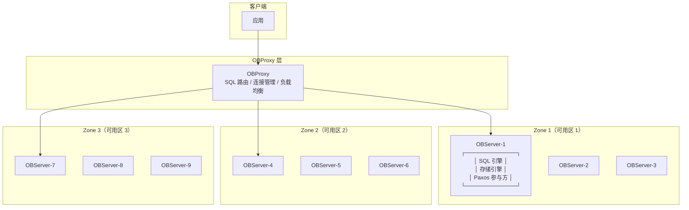
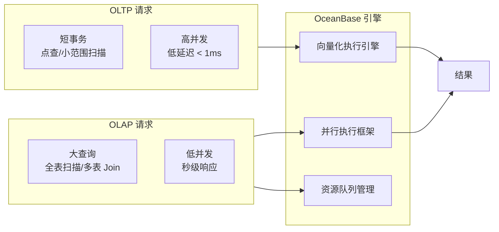

# OceanBase 核心原理

## 概述

OceanBase 是由蚂蚁集团自主研发的一体化分布式数据库，采用 Paxos 共识协议实现多副本强一致，支持单机分布式一体化部署，同时兼容 MySQL 和 Oracle 两种生态。OceanBase 在 2019 年和 2020 年两次登顶 TPC-C 榜首，是分布式数据库性能的标杆产品。本章深入剖析 OceanBase 的架构设计、存储引擎、分布式事务和 HTAP 实现。

::: tip 学习目标
理解 OceanBase 的一体化分布式架构如何兼顾单机部署的简洁与分布式的高可用，掌握 Paxos 协议在事务提交中的应用，能够解释 LSMTree 的读写路径和 Compaction 机制，并回答面试中关于 OB 架构、HTAP、多租户等高频问题。
:::

---

## 一、知识图谱

```mermaid
graph TD
    A[OceanBase] --> B[架构设计]
    A --> C[存储引擎]
    A --> D[分布式一致性]
    A --> E[HTAP 能力]
    A --> F[多租户架构]
    A --> G[SQL 兼容性]

    B --> B1["一体化分布式<br/>单机→分布式无缝切换"]
    B --> B2["OBServer 节点<br/>计算+存储一体"]
    B --> B3["RootService<br/>集群管理"]
    B --> B4["OBProxy<br/>SQL 路由"]

    C --> C1["LSM-Tree 存储"]
    C --> C2["MemTable + SSTable"]
    C --> C3["Compaction<br/>Minor/Major/全量合并"]
    C --> C4["数据编码与压缩"]

    D --> D1["Paxos 协议"]
    D --> D2["Multi-Paxos<br/>日志流级别"]
    D --> D3["Leader 选举"]
    D --> D4["两阶段提交（2PC）"]

    E --> E1["同一引擎 TP+AP"]
    E --> E2["向量化执行"]
    E --> E3["资源隔离"]
    E --> E4["实时分析无延迟"]

    F --> F1["租户（Tenant）"]
    F --> F2["Resource Unit"]
    F --> F3["资源池"]
    F --> F4["租户级备份恢复"]
```



---

## 二、基础到进阶学习路线

- **阶段一：基础入门** —— 了解 OceanBase 的产品定位（金融级分布式数据库）、核心能力（高可用/强一致/水平扩展/HTAP），搭建单机环境（docker 部署），熟悉基本 SQL 操作。
- **阶段二：原理深入** —— 深入理解 LSM-Tree 的读写路径、Paxos 协议在 OceanBase 中的工程实现、多租户资源隔离机制、向量化执行引擎原理、分布式事务 2PC 流程。
- **阶段三：实战优化** —— 掌握 OceanBase 运维（OCP 管理平台）、性能调优（转储与合并策略、索引优化）、Oracle 迁移（OMA + OMS 工具链）、生产环境高可用配置。

---

## 三、核心知识详解

### 3.1 一体化分布式架构

OceanBase 的核心设计哲学是"单机分布式一体化"——同一套内核既能以单机模式运行（适合小规模），也能无缝扩展为分布式集群（适合大规模）。这与 TiDB 的"计算存储分离、最小需要 9 台机器"形成鲜明对比。



**关键组件说明：**

| 组件 | 职责 | 关键特性 |
|------|------|---------|
| **OBServer** | 核心节点，计算+存储一体 | 每个 OBServer 可同时承担 SQL 执行和存储 |
| **OBProxy** | SQL 路由代理 | 无状态，可水平扩展；解析 SQL 路由到正确的 OBServer |
| **RootService** | 集群管理服务 | 选主、分区管理、Schema 变更，运行在某个 OBServer 上 |
| **Partition** | 数据分片单位 | 每个 Partition 有多个 Paxos 副本 |

::: tip 单机分布式一体化的工程价值
- **开发阶段**：单机 docker 部署，4C8G 即可运行，降低开发门槛
- **测试阶段**：单机模拟全部功能，无需搭建分布式集群
- **生产阶段**：按需扩展，从 1 节点到 100 节点，无需应用改造
:::

### 3.2 LSM-Tree 存储引擎

OceanBase 采用自研的 LSM-Tree 存储引擎，与 B+Tree 的设计理念截然不同：

```
LSM-Tree 存储结构（OceanBase 分层）：

┌─────────────────────────────────────────────────────────┐
│                    内存层（Memory）                        │
│  ┌─────────────────────────────────────────────────────┐ │
│  │              MemTable（活跃写入）                     │ │
│  │  B+Tree 结构，支持高效的随机读写                       │ │
│  │  达到阈值后冻结，转为 Frozen MemTable                  │ │
│  └─────────────────────────────────────────────────────┘ │
│  ┌─────────────────────────────────────────────────────┐ │
│  │              Frozen MemTable（待转储）                 │ │
│  │  冻结后不再接受写入，等待 Mini Compaction 转储到磁盘     │ │
│  └─────────────────────────────────────────────────────┘ │
└─────────────────────────────────────────────────────────┘
                           │ Minor Compaction（转储）
                           ▼
┌─────────────────────────────────────────────────────────┐
│                    磁盘层（Disk）                          │
│  ┌─────────────────────────────────────────────────────┐ │
│  │              L0 层 SSTable                           │ │
│  │  数据可能重叠，由多次 Minor Compaction 产生            │ │
│  └─────────────────────────────────────────────────────┘ │
│                           │ Major Compaction（合并）       │
│                           ▼                               │
│  ┌─────────────────────────────────────────────────────┐ │
│  │             基线数据（Baseline）                      │ │
│  │  L1+ 层 SSTable，数据全局有序、不重叠                  │ │
│  │  每日凌晨执行 Major Compaction 合并增量到基线          │ │
│  └─────────────────────────────────────────────────────┘ │
└─────────────────────────────────────────────────────────┘
```

**读写路径：**

```sql
-- 写入路径（Write Path）
-- 1. 写入 MemTable（内存 B+Tree）
-- 2. 写 Redo Log（WAL，保证持久性）
-- 3. MemTable 达到阈值 → 冻结 → 转储到 L0 SSTable
-- 4. 每日合并：L0 SSTable + 基线 → 新基线

-- 读取路径（Read Path）
-- 1. 查询 MemTable（最新数据）
-- 2. 查询 Frozen MemTable
-- 3. 查询 L0 SSTable（多个文件，可能重叠）
-- 4. 查询基线数据（L1+，全局有序）
-- 5. 合并结果，返回最新版本
```

**LSM-Tree vs B+Tree（面试高频对比）：**

| 维度 | LSM-Tree（OceanBase） | B+Tree（InnoDB） |
|------|----------------------|-------------------|
| **写入性能** | 顺序写，写入放大可控 | 随机写，页分裂导致写入放大 |
| **读取性能** | 可能需查多层，读放大 | 单次 B+Tree 查找，读性能好 |
| **空间放大** | 较好（压缩 + 有序存储） | 页内碎片（B+Tree 填充因子） |
| **Compaction 开销** | 后台合并消耗 CPU/IO | 无需 Compaction |
| **适用场景** | 写密集、大数据量、高压缩 | 读密集、小数据量、低延迟 |

### 3.3 Paxos 共识协议

OceanBase 使用 Paxos 协议实现多副本一致性，这是其金融级高可用的基础。

```
Paxos 在 OceanBase 中的应用：

每个 Partition 对应一个 Paxos Group（通常 3 副本）
┌─────────────────────────────────────────────┐
│           Paxos Group（一个 Partition）       │
│                                             │
│   ┌─────────┐    ┌─────────┐    ┌─────────┐ │
│   │ Leader  │◄──►│Follower │◄──►│Follower │ │
│   │ (Zone1) │    │ (Zone2) │    │ (Zone3) │ │
│   └────┬────┘    └─────────┘    └─────────┘ │
│        │                                     │
│        │ 1. 写请求到达 Leader                  │
│        │ 2. Leader 生成日志 entry              │
│        │ 3. 发送到 Followers（Prepare）        │
│        │ 4. 多数派确认（Accept）               │
│        │ 5. 提交（Commit）                     │
│        │ 6. 返回客户端成功                      │
└────────┴────────────────────────────────────┘
```

**Paxos 事务提交流程（详细）：**

```sql
-- OceanBase 中的事务提交流程（简化）
-- 1. 客户端发起事务，写入 Leader 的 MemTable
-- 2. COMMIT 触发两阶段提交：
--    Phase 1 (Prepare): 
--      Leader 生成 redo log，发送给所有 Follower
--      等待多数派（2/3）确认收到
--    Phase 2 (Commit):
--      Leader 标记提交，通知 Follower 提交
-- 3. 返回客户端成功

-- 关键参数：
-- paxos_initial_wait_time = 100ms  -- 初始等待时间
-- paxos_max_retry_count = 200      -- 最大重试次数
```

::: info Multi-Paxos 优化
OceanBase 使用 Multi-Paxos 变体，Leader 稳定后不需要每次写都经过完整的 Prepare 阶段，大幅减少网络往返，使得 Paxos 同步延迟接近 1 次网络 RTT。
:::

### 3.4 多租户架构

OceanBase 原生支持多租户，这是其相比于 TiDB 的显著优势之一。

```sql
-- 创建资源单元（定义 CPU、内存、IOPS 规格）
CREATE RESOURCE UNIT unit_small
    MAX_CPU = 2, MEMORY_SIZE = '4G', MAX_IOPS = 1000;

-- 创建资源池
CREATE RESOURCE POOL pool_small
    UNIT = 'unit_small', UNIT_NUM = 1, ZONE_LIST = ('zone1', 'zone2', 'zone3');

-- 创建租户（MySQL 模式）
CREATE TENANT tenant_finance
    RESOURCE_POOL_LIST = ('pool_small'),
    PRIMARY_ZONE = 'zone1',
    SET VARIABLES ob_compatibility_mode = 'mysql';

-- 创建租户（Oracle 模式）
CREATE TENANT tenant_core
    RESOURCE_POOL_LIST = ('pool_large'),
    PRIMARY_ZONE = 'zone1;zone2',
    SET VARIABLES ob_compatibility_mode = 'oracle';
```

**多租户隔离模型：**

| 隔离维度 | 说明 |
|----------|------|
| **资源隔离** | 每个租户分配独立的 Resource Unit，CPU 和内存物理隔离 |
| **数据隔离** | 每个租户有独立的数据字典和表空间，无法跨租户查询 |
| **连接隔离** | 通过 OBProxy 根据租户名路由到对应资源 |
| **备份隔离** | 支持租户级别的备份和恢复 |

### 3.5 HTAP 能力

OceanBase 的 HTAP 设计是"引擎内一体化"：同一套引擎同时处理 OLTP 和 OLAP 请求，无需数据同步。



**HTAP 关键实现：**

```sql
-- 1. 开启并行查询（OLAP 场景）
SET SESSION parallel_degree = 8;  -- 设置并行度
SELECT /*+ PARALLEL(8) */ 
    region, SUM(amount) 
FROM orders 
WHERE order_date >= '2025-01-01' 
GROUP BY region;

-- 2. 资源隔离：OLTP 和 OLAP 使用不同资源组
-- 创建 OLAP 专用的资源规格
CREATE RESOURCE UNIT unit_olap 
    MAX_CPU = 32, MEMORY_SIZE = '128G';

-- 3. 向量化执行（自动启用）
-- 处理大批量数据时，一次处理一批（如 2048 行），而非逐行处理
-- 充分利用 CPU Cache 和 SIMD 指令集
```

::: warning HTAP 注意事项
- OLAP 大查询可能占用大量内存，建议设置 `ob_query_timeout` 防止失控
- 生产环境建议为 OLTP 和 OLAP 配置不同的 Resource Unit，避免资源争抢
- 向量化执行在简单聚合（SUM/COUNT/AVG）场景效果最佳，复杂嵌套查询可能退化为逐行执行
:::

---

## 四、经典应用场景与解决方案

### 场景：网商银行核心交易系统（OceanBase 替代 Oracle）

**问题背景**

网商银行（蚂蚁集团旗下）核心交易系统需要处理海量小微贷款业务，日均交易量超过 10 亿笔。原基于 Oracle RAC + 分库分表的架构面临扩展性瓶颈、Oracle 许可证成本高昂（年费数千万）等问题。

**完整方案**

```
架构演进：

改造前（Oracle 分库分表）：
┌──────────┐  ┌──────────┐  ┌──────────┐
│ Oracle   │  │ Oracle   │  │ Oracle   │
│ 分库 1   │  │ 分库 2   │  │ 分库 N   │
│ (贷款)    │  │ (还款)    │  │ (账务)    │
└──────────┘  └──────────┘  └──────────┘
     ↑ 应用层分库路由（复杂）
改造后（OceanBase 一体化）：
┌─────────────────────────────────────────────┐
│           OceanBase 集群（5 节点）            │
│  ┌─────────────────────────────────────────┐ │
│  │  租户 1：贷款业务（32C/128G）             │ │
│  │  租户 2：还款业务（16C/64G）              │ │
│  │  租户 3：账务核心（64C/256G）             │ │
│  └─────────────────────────────────────────┘ │
│  Paxos 三副本，同城双机房 + 异地灾备          │
└─────────────────────────────────────────────┘
     ↑ 应用层无需分库分表，直接连 OBProxy
```

**核心 SQL 实践：**

```sql
-- 1. 贷款发放（分布式事务，跨分区）
-- OceanBase 自动处理分布式事务，无需应用层 2PC
BEGIN;
-- 更新贷款账户（分区键：user_id）
UPDATE loan_account SET balance = balance + 10000 WHERE user_id = 12345;
-- 插入贷款记录（跨分区）
INSERT INTO loan_records (record_id, user_id, amount, loan_date) 
VALUES (seq_loan.NEXTVAL, 12345, 10000, SYSDATE);
-- 更新资金池（可能在不同分区）
UPDATE fund_pool SET available = available - 10000 WHERE pool_id = 'main';
COMMIT;

-- 2. 日终批量对账（OLAP 场景）
-- 利用并行查询加速
SELECT /*+ PARALLEL(16) */
    account_type, 
    COUNT(*), 
    SUM(balance) 
FROM loan_account 
WHERE status = 'ACTIVE' 
GROUP BY account_type;

-- 3. 分区表设计（按日分区，保留 90 天）
CREATE TABLE loan_records (
    record_id NUMBER PRIMARY KEY,
    user_id NUMBER,
    amount NUMBER(18,2),
    loan_date DATE
) PARTITION BY RANGE (loan_date) (
    PARTITION p20250101 VALUES LESS THAN (DATE '2025-01-02'),
    PARTITION p20250102 VALUES LESS THAN (DATE '2025-01-03'),
    -- ... 自动创建分区
    PARTITION p_max VALUES LESS THAN (MAXVALUE)
);
```

**迁移效果：**

| 指标 | 迁移前（Oracle） | 迁移后（OceanBase） | 提升 |
|------|-----------------|-------------------|------|
| 峰值 TPS | 10 万 | 50 万 | 5x |
| 存储成本 | 200 万/年 | 50 万/年 | 降 75% |
| 横向扩展 | 需分库分表改造 | 加节点自动 Rebalance | 分钟级 |
| 灾备 RPO | 秒级 | 0（Paxos 强一致） | 质的提升 |
| 批量对账 | 30 分钟 | 3 分钟 | 10x |

---

## 五、高频面试题

### Q1: OceanBase 的架构设计有什么特点？为什么说"单机分布式一体化"？

::: details 答案

OceanBase 采用**一体化分布式架构**，核心特点包括：

**1. OBServer 节点计算存储一体**
- 每个 OBServer 同时承担 SQL 执行和存储职责
- 数据按 Partition 分布在多个 OBServer 上
- 与 TiDB 的计算存储分离不同，OB 的节点角色一致，部署更简单

**2. 单机分布式一体化**
- 同一套二进制可以在单机上运行全部功能（开发/测试）
- 生产环境可以水平扩展到上百台节点，数据自动 Rebalance
- 应用无需任何改造，连接 OBProxy 即可

**3. OBProxy 智能路由**
- 解析 SQL 中的分区键，将请求路由到 Leader 副本所在 OBServer
- 避免跨节点数据拉取，实现"大部分请求单机完成"
- 支持连接管理、读写分离、负载均衡

**4. Paxos 多副本强一致**
- 每个 Partition 有 3-5 个 Paxos 副本，跨可用区部署
- 少数派故障不影响服务（3 副本容忍 1 台故障）
- 主备切换自动完成，RPO = 0

**5. 多租户原生支持**
- 一套集群支撑多个业务线，租户间资源隔离
- 每个租户可选择 MySQL 或 Oracle 兼容模式
- 相比 TiDB 需要多套集群实现多租户，OB 更节省资源

**设计哲学对比：**
- OceanBase：**把复杂性封装在数据库内部**，对外提供简单的单机接口
- TiDB：**用松耦合的组件组合构建分布式能力**，各组件独立伸缩
:::

### Q2: LSM-Tree 在 OceanBase 中如何工作？什么场景下 LSM-Tree 比 B+Tree 更好？

::: details 答案

**OceanBase 的 LSM-Tree 分层结构：**

```
写入路径：MemTable → 转储 → L0 SSTable → 合并 → 基线数据
读取路径：MemTable → Frozen MemTable → L0 SSTable → 基线数据 → 合并返回
```

**LSM-Tree 的优势场景：**

| 场景 | LSM-Tree 优势 | 原因 |
|------|-------------|------|
| **写密集型** | 写入性能远超 B+Tree | 顺序写磁盘，无随机 IO 和页分裂 |
| **大数据量** | 压缩率高，空间省 | 有序存储 + 前缀压缩 + 字典编码 |
| **范围扫描** | 扫描性能好 | 数据有序存储，顺序读取 |
| **时序数据** | 天然适合追加写 | 新数据写入 MemTable 后顺序转储 |
| **HTAP** | 读写在 MemTable 中分离 | 查最新数据走内存，查历史数据走磁盘 |

**LSM-Tree 的劣势：**

| 场景 | LSM-Tree 劣势 | 缓解措施 |
|------|-------------|---------|
| **点查（主键查询）** | 可能需查多层，读放大 | Bloom Filter 快速过滤不存在的 key |
| **Compaction 风暴** | 合并时占用大量 CPU/IO | 错峰执行（凌晨），限制合并速度 |
| **空间放大** | 旧版本数据在 Compaction 前未清理 | 每日 Major Compaction 合并回收 |

**OceanBase 的工程优化：**
- **转储（Minor Compaction）**：高频小量，MemTable 冻结后快速转储到 L0
- **合并（Major Compaction）**：低频大量，每日凌晨合并 L0 增量到基线
- **渐进式合并**：将合并任务分散到多个时间段，避免 IO 尖峰

```sql
-- 查看合并状态
SELECT * FROM oceanbase.CDB_OB_MAJOR_COMPACTION;
-- 手动触发合并
ALTER SYSTEM MAJOR FREEZE;
```
:::

### Q3: OceanBase 如何实现 HTAP？与 TiDB 的 HTAP 方案有何不同？

::: details 答案

**OceanBase HTAP 实现：引擎内一体化**

- 同一套存储引擎同时处理 TP 和 AP 请求
- 数据写入 MemTable 后，TP 查询读最新数据，AP 查询走基线数据
- 通过**向量化执行引擎**（一批处理 2048 行）和**并行执行框架**加速 AP 查询
- 资源管理：通过 Resource Unit 隔离 TP 和 AP 的资源

**TiDB HTAP 实现：行存 + 列存分离**

- TP 请求走 TiKV（行存，RocksDB LSM-Tree）
- AP 请求走 TiFlash（列存，Raft Learner 异步同步数据）
- 优化器自动选择走 TiKV 还是 TiFlash

**两者对比：**

| 维度 | OceanBase | TiDB |
|------|-----------|------|
| **HTAP 方式** | 引擎内一体化 | 行存 + 列存分离 |
| **数据同步** | 无需同步（同一份数据） | Raft Learner 异步同步（秒级延迟） |
| **AP 性能** | 向量化执行，通用场景好 | 列存 + MPP，分析场景更优 |
| **存储成本** | 无额外副本 | TiFlash 需要额外 1 副本存储 |
| **一致性** | 强一致（同一份数据） | 最终一致（异步同步，有延迟） |
| **资源隔离** | Resource Unit 隔离 | 物理节点隔离（TiKV 和 TiFlash 在不同节点） |

**选型建议：**
- 如果 AP 查询需要强一致实时数据 → OceanBase
- 如果 AP 是复杂分析型（多表 Join、大表聚合）→ TiDB 的 TiFlash 列存更优
- 如果既有 TP 又有 AP 但不想维护两套系统 → 两者都适合
:::

### Q4: Paxos 协议在 OceanBase 中是如何应用的？为什么不用 Raft？

::: details 答案

**Paxos 在 OceanBase 中的应用分层：**

OceanBase 使用 Paxos 协议实现**日志流级别**的一致性复制。每个 Partition 对应一个 Paxos Group，Leader 负责处理写请求。

```
事务提交流程（Paxos 两阶段）：
1. Leader 接收写请求，生成 redo log entry
2. Phase 1 (Prepare)：Leader 将 log entry 发送给所有 Follower
3. Follower 收到后写入本地日志，回复 ACK
4. Leader 收到多数派（N/2+1）ACK 后，进入 Phase 2
5. Phase 2 (Commit)：Leader 提交事务，通知 Follower 提交
6. 返回客户端成功
```

**为什么 OceanBase 选择 Paxos 而非 Raft？**

| 维度 | Paxos | Raft |
|------|-------|------|
| **灵活性** | 允许多个 Proposer，支持乱序提交 | 强 Leader 模型，必须按序提交 |
| **工程实现** | 复杂，但 OceanBase 有深厚积累（蚂蚁自研） | 简单，易于理解和实现 |
| **性能** | Multi-Paxos 优化后与 Raft 性能相当 | 默认即可达到较好性能 |
| **历史原因** | OceanBase 2010 年立项时 Raft 尚未成熟 | Raft 2013 年才提出 |

**实际上 OceanBase 的 Paxos 实现已经非常接近 Raft：**
- 使用了稳定的 Leader（类似 Raft 的强 Leader）
- 日志强有序
- 使用 Multi-Paxos 减少 Prepare 阶段开销

::: info 历史背景
OceanBase 立项于 2010 年，当时分布式一致性协议的选择只有 Paxos（Lamport 1989 年提出）和 Viewstamped Replication。Raft 协议 2013 年才由 Diego Ongaro 提出，所以 OceanBase 选择 Paxos 是时代背景决定的。如今两者在实际性能上差异不大，更多是工程实现细节的差异。
:::

**Paxos 故障恢复：**

```
场景：Leader 宕机
1. Follower 检测到 Leader 心跳超时
2. 发起 Leader 选举（Paxos Prepare 阶段，携带更高的 proposal number）
3. 获得多数派投票的 Follower 成为新 Leader
4. 新 Leader 补全未提交的日志（从旧 Leader 或 Follower 获取）
5. 新 Leader 开始服务

关键参数：
- leader_lease_duration = 4s（Leader 租约，防止脑裂）
- 选举超时 = 1s ~ 2s
- 故障恢复时间：通常 10-30 秒
```
:::

### Q5: OceanBase 的多租户架构是如何实现资源隔离的？与传统数据库的 Schema 隔离有何不同？

::: details 答案

**OceanBase 多租户资源隔离模型：**

```
物理集群
├── 租户 A（金融核心）
│   ├── Resource Unit: 32C / 128G / 10000 IOPS
│   ├── 数据库: core_db（Oracle 兼容模式）
│   └── 独立的数据字典、会话、后台线程
├── 租户 B（风控系统）
│   ├── Resource Unit: 16C / 64G / 5000 IOPS
│   ├── 数据库: risk_db（MySQL 兼容模式）
│   └── 独立的数据字典、会话、后台线程
└── 租户 C（数据分析）
    ├── Resource Unit: 8C / 32G / 2000 IOPS
    ├── 数据库: analysis_db（MySQL 兼容模式）
    └── 独立的数据字典、会话、后台线程
```

**资源隔离机制：**

| 隔离维度 | 实现方式 | 说明 |
|----------|---------|------|
| **CPU 隔离** | Cgroup | 租户 CPU 使用硬限制，不超过 MAX_CPU |
| **内存隔离** | 内存限额 | 租户内存独立管理，OOM 仅影响本租户 |
| **IOPS 隔离** | IO 限流 | 磁盘 IO 按租户配额限制 |
| **网络隔离** | 连接池独立 | 每个租户独立的连接池，不受其他租户影响 |
| **数据隔离** | 独立数据字典 | 租户间无法跨租户访问数据 |

**与传统数据库 Schema 隔离的对比：**

| 维度 | OceanBase 多租户 | MySQL Schema 隔离 | Oracle PDB |
|------|-----------------|-------------------|------------|
| **资源隔离** | 硬隔离（CPU/内存/IO 独立配额） | 无（共享资源） | 部分隔离 |
| **权限隔离** | 租户级管理员，完全独立 | 数据库级用户，可见其他 Schema | PDB 级用户 |
| **故障隔离** | 租户 OOM/CPU 飙升不影响其他租户 | 一个库的慢查询会影响整个实例 | PDB 间部分隔离 |
| **备份恢复** | 租户级别 | 实例级别 | PDB 级别 |
| **兼容模式** | 每个租户独立选择 MySQL/Oracle 模式 | 仅 MySQL | 仅 Oracle |
| **适用场景** | SaaS 多租户、大企业内部多业务线、DBaaS | 中小团队内部隔离 | Oracle 多租户 |

**实际应用场景：**

```sql
-- DBaaS 场景：在公有云上为不同客户提供独立租户
-- 客户 A：金融行业，需要 Oracle 兼容
CREATE TENANT customer_a
    RESOURCE_POOL_LIST = ('pool_finance')
    SET VARIABLES ob_compatibility_mode = 'oracle';

-- 客户 B：互联网公司，需要 MySQL 兼容
CREATE TENANT customer_b
    RESOURCE_POOL_LIST = ('pool_internet')
    SET VARIABLES ob_compatibility_mode = 'mysql';

-- 两个租户在同一个 OceanBase 集群中，资源完全隔离
-- 客户 A 的慢查询不会影响客户 B 的业务
```
:::

### Q6: OceanBase 的 Oracle 兼容性如何？能做到"零修改迁移"吗？

::: details 答案

**OceanBase Oracle 兼容性覆盖范围：**

| 兼容类别 | 兼容程度 | 说明 |
|----------|---------|------|
| **SQL 语法** | 90%+ | SELECT/INSERT/UPDATE/DELETE/MERGE 基本兼容 |
| **PL/SQL** | 85%+ | 存储过程、函数、包、游标大部分兼容 |
| **数据类型** | 95%+ | NUMBER/VARCHAR2/DATE/CLOB/BLOB 兼容 |
| **序列** | 100% | CREATE SEQUENCE / NEXTVAL / CURRVAL |
| **分区表** | 90%+ | RANGE/LIST/HASH 分区兼容 |
| **视图/物化视图** | 90%+ | 普通视图兼容，物化视图功能有限 |
| **触发器** | 80%+ | DML 触发器基本兼容，DDL 触发器部分兼容 |
| **内置函数** | 90%+ | TO_CHAR/TO_DATE/DECODE/NVL 等常用函数兼容 |
| **DBLink** | 支持 | 支持通过 DBLink 访问 Oracle 和 OB 租户 |

**做不到零修改迁移的场景：**

```sql
-- 1. Oracle 特有语法不兼容
-- Oracle: CONNECT BY 层次查询
SELECT LEVEL, employee_id, manager_id 
FROM employees 
START WITH manager_id IS NULL 
CONNECT BY PRIOR employee_id = manager_id;
-- OB: 需改写为递归 CTE（WITH RECURSIVE）

-- 2. 高级 PL/SQL 特性
-- Oracle: 自治事务（PRAGMA AUTONOMOUS_TRANSACTION）
-- OB: 不支持，需重构业务逻辑

-- 3. Oracle RAC 特有功能
-- Oracle: Cache Fusion（内存融合）
-- OB: 使用 Paxos 同步，架构不同，性能特征不同

-- 4. Oracle 高级分析函数
-- MODULE/CLUSTER_SET/FEATURE_SET 等数据挖掘函数
-- OB: 不支持，需在应用层实现

-- 5. Oracle 高级队列（AQ）
-- OB: 不支持，需用消息队列中间件替代
```

**迁移评估步骤：**

```
1. 使用 OMA（OceanBase 迁移评估工具）扫描 Oracle 数据库
   → 输出不兼容项清单和改造工作量评估

2. 对不兼容项分类处理：
   - 语法级：SQL 改写（工作量小）
   - 函数级：使用 OB 等价函数替代或自定义函数（工作量中）
   - 架构级：存储过程重写为 Java 代码（工作量大）

3. 典型迁移工作占比：
   - 零修改：70% ~ 80%
   - 少量修改（SQL 改写）：10% ~ 15%
   - 中等修改（PL/SQL 改写）：5% ~ 10%
   - 大量修改（架构重写）：1% ~ 5%
```

::: warning 迁移建议
**不要轻信"零修改迁移"**。即使是兼容性最好的达梦，也无法做到 100% 零修改。合理的预期是：**80% 零修改 + 15% 少量修改 + 5% 需要重构**。建议提前用评估工具扫描，制定详细的迁移计划。
:::
:::

---

## 六、选型指南

### 适用场景

| 场景 | 推荐理由 |
|------|---------|
| 金融核心交易系统 | 金融级 Paxos 强一致，蚂蚁双 11 实战验证，TPC-C 世界第一 |
| 需要 Oracle 兼容 | 支持 Oracle 兼容模式，PL/SQL 兼容性仅次于达梦 |
| 多租户 SaaS 平台 | 原生多租户，资源硬隔离，一套集群支撑多个业务线 |
| HTAP 实时分析 | 引擎内 HTAP，无需额外组件，实时数据零延迟 |
| 从单机到分布式演进 | 单机分布式一体化，起步成本低，可按需扩展 |

### 不适用场景

| 场景 | 原因 | 替代建议 |
|------|------|---------|
| 需要完全 MySQL 兼容 | 兼容 MySQL 模式但不是 100% 兼容 | 优先考虑 TiDB |
| 资源极度受限（< 4C8G） | OB 最小部署需要 4C8G | 考虑 PostgreSQL 或 MySQL |
| 需要完全开源 Apache 2.0 协议 | OB 使用 MulanPubL-2.0 协议 | 考虑 TiDB（Apache 2.0） |
| 重度依赖 Oracle 高级特性 | 自治事务、高级队列等不支持 | 保留 Oracle 或重构应用 |

### 配置建议

```sql
-- 生产环境最小配置（3 节点）
-- 每节点：16C / 64G / 500G SSD
-- 3 副本，3 可用区

-- 核心参数调优
ALTER SYSTEM SET memory_limit = '48G';           -- OB 进程可用内存
ALTER SYSTEM SET system_memory = '8G';           -- 系统预留内存
ALTER SYSTEM SET freeze_trigger_percentage = 70;  -- 触发转储的内存阈值
ALTER SYSTEM SET major_freeze_duty_time = '02:00'; -- 每日合并时间
```

---

## 相关文档

- [国产数据库概览](./index)
- [TiDB 核心原理](./tidb)
- [openGauss 核心原理](./opengauss)
- [达梦 DM8 核心原理](./dameng)
- [国产数据库选型对比](./selection)