# openGauss 核心原理

## 概述

openGauss 是华为基于 PostgreSQL 9.2 深度改造的开源关系型数据库，融合了华为在数据库领域多年的技术积累。openGauss 在 PG 内核基础上进行了大量企业级增强：NUMA-Aware 架构优化多核性能、MOT 内存优化引擎实现极致 TPS、AI 原生能力（DBMind）实现智能运维、全密态计算保障数据安全。openGauss 是信创生态中 PG 技术路线的核心代表。

::: tip 学习目标
理解 openGauss 与 PostgreSQL 的关系及核心改进点，掌握 NUMA-Aware 架构原理、MOT 内存表的使用场景、AI 原生（DBMind）的自调优能力，能够解释全密态计算和防篡改账本的安全机制，并回答面试中关于 openGauss 架构、适用场景、与 PG 对比等高频问题。
:::

---

## 一、知识图谱

```mermaid
graph TD
    A[openGauss] --> B[内核架构]
    A --> C[性能优化]
    A --> D[AI 原生]
    A --> E[安全特性]
    A --> F[高可用方案]

    B --> B1["基于 PostgreSQL 9.2<br/>深度定制与增强"]
    B --> B2["NUMA-Aware 架构<br/>多核性能优化"]
    B --> B3["线程池模型<br/>替代 PG 进程模型"]
    B --> B4["并行执行框架<br/>SMP 并行查询"]

    C --> C1["MOT 内存优化引擎<br/>极致 TPS 性能"]
    C --> C2["列存引擎<br/>OLAP 加速"]
    C --> C3["CBO 优化器增强"]
    C --> C4["向量化执行"]

    D --> D1["DBMind 自治运维<br/>自调优 / 自诊断"]
    D --> D2["智能索引推荐"]
    D --> D3["慢 SQL 根因分析"]
    D --> D4["参数自动调优"]

    E --> E1["全密态计算<br/>数据始终加密"]
    E --> E2["防篡改账本<br/>区块链式验证"]
    E --> E3["国密算法<br/>SM2/SM3/SM4"]
    E --> E4["行级安全策略"]

    F --> F1["主备复制<br/>基于 WAL 日志"]
    F --> F2["级联备机<br/>多级灾备"]
    F --> F3["CM 集群管理<br/>自动故障切换"]
```



---

## 二、基础到进阶学习路线

- **阶段一：基础入门** —— 了解 openGauss 的产品定位（PG 系企业级数据库）、与 PostgreSQL 的核心差异，搭建单机环境，熟悉基本 SQL 操作和 PG 兼容特性。
- **阶段二：原理深入** —— 深入理解 NUMA-Aware 架构如何优化多核性能、MOT 内存表的 MVCC 与索引结构、DBMind 的 AI 调优原理、全密态计算的实现机制。
- **阶段三：实战优化** —— 掌握 openGauss 的性能调优（WAL 参数调优、MOT 表配置、并行查询优化）、高可用部署（主备 + CM）、数据迁移（从 Oracle/MySQL 迁移到 openGauss）。

---

## 三、核心知识详解

### 3.1 基于 PostgreSQL 的深度改造

openGauss 不是简单的 PostgreSQL 分支，而是对 PG 内核的深度重构。

```
openGauss vs PostgreSQL 核心差异：

┌─────────────────────────────────────────────────────────────────┐
│                    PostgreSQL 9.2 内核                            │
│  ┌───────────┐  ┌───────────┐  ┌───────────┐  ┌──────────────┐ │
│  │ 进程模型   │  │ MVCC 实现 │  │ B+Tree    │  │ 串行查询     │ │
│  │ 每连接一进程│  │ 元组多版本 │  │ 索引       │  │ 执行         │ │
│  └───────────┘  └───────────┘  └───────────┘  └──────────────┘ │
└─────────────────────────────────────────────────────────────────┘
                            │
                            │ openGauss 深度改造
                            ▼
┌─────────────────────────────────────────────────────────────────┐
│                     openGauss 内核                               │
│  ┌───────────┐  ┌───────────┐  ┌───────────┐  ┌──────────────┐ │
│  │ 线程池模型 │  │ 原地更新   │  │ NUMA-Aware│  │ SMP 并行     │ │
│  │ 高并发低开销│  │ 减少膨胀   │  │ 多核优化   │  │ 查询执行     │ │
│  └───────────┘  └───────────┘  └───────────┘  └──────────────┘ │
│  ┌───────────┐  ┌───────────┐  ┌───────────┐  ┌──────────────┐ │
│  │ MOT 内存表│  │ DBMind AI │  │ 全密态    │  │ 防篡改账本   │ │
│  │ 极致 TPS   │  │ 自调优    │  │ 计算       │  │ 区块链验证   │ │
│  └───────────┘  └───────────┘  └───────────┘  └──────────────┘ │
└─────────────────────────────────────────────────────────────────┘
```

**核心改造点对比：**

| 维度 | PostgreSQL | openGauss | 改进效果 |
|------|-----------|-----------|---------|
| **连接模型** | 进程模型（fork 开销大） | 线程池模型（SEDA 架构） | 高并发下 CPU 上下文切换减少 50% |
| **MVCC** | 元组多版本（VACUUM 成本高） | 原地更新 + UNDO 回滚段 | 减少表膨胀，无需 VACUUM |
| **内存管理** | 共享内存 + 进程私有内存 | NUMA-Aware 内存分配 | 避免跨 NUMA 节点内存访问 |
| **并行度** | 单进程查询 | SMP 并行查询（多线程并行） | 大查询加速 3-5x |
| **存储引擎** | Heap 行存 | 行存 + 列存 + MOT 内存表 | 多引擎支撑混合负载 |
| **优化器** | PG CBO 优化器 | 增强 CBO + 向量化执行 | 复杂查询优化效果提升 |

### 3.2 NUMA-Aware 架构

现代服务器多为 NUMA 架构（多 CPU 插槽，每个 CPU 有自己的本地内存），openGauss 针对 NUMA 做了深度优化。

```
NUMA 架构示意：

┌─────────────────────────┐  ┌─────────────────────────┐
│      NUMA Node 0        │  │      NUMA Node 1        │
│  ┌───────────────────┐  │  │  ┌───────────────────┐  │
│  │   CPU 0-15        │  │  │  │   CPU 16-31       │  │
│  └────────┬──────────┘  │  │  └────────┬──────────┘  │
│           │             │  │           │             │
│  ┌────────▼──────────┐  │  │  ┌────────▼──────────┐  │
│  │  本地内存 128G    │◄─┼──┼─►│  本地内存 128G    │  │
│  │  访问延迟 ~100ns  │  │  │  │  访问延迟 ~100ns  │  │
│  └───────────────────┘  │  │  └───────────────────┘  │
│           │             │  │           │             │
│           └─────────────┼──┼───────────┘             │
│              跨 NUMA 访问 │  │                         │
│              延迟 ~200ns  │  │                         │
└─────────────────────────┘  └─────────────────────────┘
```

**openGauss NUMA-Aware 优化策略：**

| 优化点 | 说明 |
|--------|------|
| **内存就近分配** | 数据和线程分配在同一个 NUMA 节点，减少跨节点访问 |
| **NUMA 绑定** | 通过 `numa_bind` 参数将进程绑定到特定 NUMA 节点 |
| **Buffer Pool 分区** | 每个 NUMA 节点独立的 Buffer Pool，减少锁竞争 |
| **WAL Writer 绑定** | WAL 写入线程绑定到磁盘所在 NUMA 节点 |
| **NUMA 感知调度** | 调度器优先将任务分配到数据所在的 NUMA 节点 |

```sql
-- NUMA 相关配置参数
-- 开启 NUMA 支持
ALTER SYSTEM SET enable_numa_support = on;

-- 配置 NUMA 节点分布
-- numa_distribution_mode = 'none' | 'bind' | 'prefer'
ALTER SYSTEM SET numa_distribution_mode = 'bind';

-- 查看 NUMA 拓扑
-- numactl --hardware
```

### 3.3 MOT 内存优化引擎

MOT（Memory-Optimized Tables）是 openGauss 的内存优化表引擎，针对高频交易场景做了极致优化。

```
MOT 架构：

┌─────────────────────────────────────────────────────────┐
│                    MOT 内存表引擎                         │
│                                                         │
│  ┌─────────────────────────────────────────────────┐   │
│  │              内存存储（Memory）                    │   │
│  │  ┌───────────────┐  ┌───────────────────────────┐│   │
│  │  │  Masstree 索引│  │  无锁数据结构（Lock-Free）││   │
│  │  │  （Trie+B+Tree│  │  CAS 原子操作替代锁       ││   │
│  │  │   混合索引）   │  │                           ││   │
│  │  └───────────────┘  └───────────────────────────┘│   │
│  └─────────────────────────────────────────────────┘   │
│                         │                               │
│  ┌──────────────────────▼──────────────────────────┐   │
│  │           持久化层（WAL + Checkpoint）            │   │
│  │  ┌───────────────┐  ┌───────────────────────────┐│   │
│  │  │  WAL 日志     │  │  定期 Checkpoint          ││   │
│  │  │  （事务提交后  │  │  （内存快照持久化到磁盘）   ││   │
│  │  │   异步刷盘）    │  │                           ││   │
│  │  └───────────────┘  └───────────────────────────┘│   │
│  └─────────────────────────────────────────────────┘   │
└─────────────────────────────────────────────────────────┘
```

**MOT 核心特性：**

| 特性 | 说明 | 性能收益 |
|------|------|---------|
| **Masstree 索引** | Trie + B+Tree 混合索引，缓存友好的数据结构 | 点查性能提升 3-5x |
| **无锁设计** | 使用 CAS（Compare-And-Swap）原子操作替代传统锁 | 多核扩展性线性增长 |
| **乐观并发控制** | 基于时间戳的 OCC，避免锁等待 | 高并发下吞吐量远超传统锁 |
| **NUMA 感知** | 内存分配和线程绑定到本地 NUMA 节点 | 避免跨 NUMA 延迟 |
| **WAL 异步持久化** | 事务提交后异步写 WAL，不阻塞响应 | 延迟降低 50% |

```sql
-- 创建 MOT 内存表
CREATE FOREIGN TABLE orders_mot (
    order_id BIGINT PRIMARY KEY,
    user_id BIGINT NOT NULL,
    amount DECIMAL(18,2),
    status VARCHAR(20),
    order_date TIMESTAMP
) SERVER mot_server;

-- MOT 索引创建（自动使用 Masstree）
CREATE INDEX idx_user_id ON orders_mot (user_id);

-- MOT 限制：
-- 1. 不支持跨表 Join（MOT 表之间 Join 有限支持）
-- 2. 不支持复杂子查询
-- 3. 数据全部在内存中，需要足够内存
-- 4. 重启后数据从 Checkpoint + WAL 恢复
```

::: warning MOT 使用场景
MOT 适合**高频交易、实时风控、计数器**等热点数据场景。不适合作为通用存储（数据量大、查询复杂、需要跨表 Join 的场景）。
:::

### 3.4 AI 原生能力（DBMind）

DBMind 是 openGauss 的 AI 自治运维组件，提供自调优、自诊断、自恢复能力。

```
DBMind 功能架构：

┌─────────────────────────────────────────────────────────┐
│                      DBMind                             │
│                                                         │
│  ┌─────────────┐  ┌──────────────┐  ┌───────────────┐  │
│  │  指标采集    │  │  异常检测     │  │  根因分析     │  │
│  │  (Prometheus)│  │  (时序预测)   │  │  (知识图谱)   │  │
│  └──────┬──────┘  └──────┬───────┘  └───────┬───────┘  │
│         │                │                  │           │
│  ┌──────▼────────────────▼──────────────────▼───────┐  │
│  │               AI 引擎（XGBoost / LSTM）          │  │
│  │  ┌──────────┐  ┌──────────┐  ┌──────────────┐  │  │
│  │  │ 参数调优 │  │ 索引推荐 │  │ SQL 诊断     │  │  │
│  │  │ (RL 算法) │  │ (ML 模型) │  │ (模板匹配)   │  │  │
│  │  └──────────┘  └──────────┘  └──────────────┘  │  │
│  └────────────────────────────────────────────────┘  │
└─────────────────────────────────────────────────────────┘
```

**DBMind 核心功能：**

| 功能 | 说明 | 实现方式 |
|------|------|---------|
| **参数自动调优** | 根据负载特征推荐最优参数配置 | 强化学习（RL）探索参数空间，找到最优组合 |
| **智能索引推荐** | 分析慢 SQL，推荐创建/删除索引 | 基于查询模板和代价模型的启发式搜索 |
| **慢 SQL 诊断** | 分析慢 SQL 根因并提供优化建议 | 提取 SQL 特征，匹配已知问题模式 |
| **异常检测** | 预测指标异常（CPU/内存/磁盘） | 时序预测模型（LSTM），提前预警 |
| **趋势预测** | 预测磁盘增长、负载趋势 | 时序分析，辅助容量规划 |

```sql
-- 使用 DBMind 索引推荐
SELECT * FROM gs_index_advisor('
    SELECT * FROM orders 
    WHERE user_id = 12345 AND order_date > ''2025-01-01''
');
-- 输出：推荐在 (user_id, order_date) 上创建复合索引

-- 使用 DBMind 参数调优
-- gs_dbmind component xtuner --database tpcc --db-user user

-- 查看调优推荐
-- gs_dbmind component recommend --database tpcc
```

### 3.5 全密态计算与防篡改账本

**全密态计算：**

数据在传输、存储、计算全过程中始终保持加密状态，即使 DBA 也无法查看明文数据。

```
全密态计算流程：

客户端                          服务端
┌──────────┐                 ┌──────────┐
│ 明文数据  │                 │          │
│ "Alice"  │                 │          │
└────┬─────┘                 │          │
     │ 客户端加密             │          │
     │ (CMK → CEK)           │          │
┌────▼─────┐                 │          │
│ 密文     │  ──传输──►      │ 密文存储  │
│ 0x3A8F   │                 │ 0x3A8F   │
└──────────┘                 └────┬─────┘
                                  │ 密文计算
                                  │ (同态加密)
                             ┌────▼─────┐
                             │ 密文结果  │
                             │ 0x7B2E   │
                             └────┬─────┘
                                  │
     ┌────────────────────────────┘
     │ 客户端解密
┌────▼─────┐
│ 明文结果  │
│ "查询结果"│
└──────────┘
```

```sql
-- 创建加密列
CREATE TABLE users_encrypted (
    id BIGINT PRIMARY KEY,
    name VARCHAR(100) ENCRYPTED WITH (COLUMN_ENCRYPTION_KEY = cek1),
    phone VARCHAR(20) ENCRYPTED WITH (COLUMN_ENCRYPTION_KEY = cek1),
    id_card VARCHAR(18) ENCRYPTED WITH (COLUMN_ENCRYPTION_KEY = cek2)
);

-- 客户端加密查询（需要使用支持全密态的 JDBC 驱动）
-- 服务端始终看不到明文数据
```

**防篡改账本：**

借鉴区块链技术，对数据修改历史进行链式记录和验证。

```sql
-- 创建账本表
CREATE TABLE ledger_accounts (
    account_id BIGINT PRIMARY KEY,
    balance DECIMAL(18,2),
    owner_name VARCHAR(100)
) WITH (LEDGER = ON);

-- 账本表的关键特性：
-- 1. 所有 INSERT/UPDATE/DELETE 都会记录历史
-- 2. 历史记录通过哈希链式链接，不可篡改
-- 3. 提供验证接口，检测数据是否被篡改

-- 验证账本完整性
SELECT ledger_gchain_check('ledger_accounts', 'verify');
-- 返回：验证通过 / 验证失败（说明数据被篡改）
```

---

## 四、经典应用场景与解决方案

### 场景：电信 BOSS 系统从 Oracle 迁移到 openGauss

**问题背景**

某省级电信运营商 BOSS（业务运营支撑系统）使用 Oracle RAC，管理 2000 万用户的话单、计费、账务数据。面临信创替代要求和 Oracle 高昂的许可证费用，计划迁移到 openGauss。

**完整方案**

```
迁移架构：

改造前（Oracle RAC）：
┌──────────────────────────────┐
│      Oracle RAC（2 节点）     │
│  ┌──────────┐ ┌──────────┐  │
│  │ Node 1   │ │ Node 2   │  │
│  │ (Active) │ │ (Active) │  │
│  └────┬─────┘ └────┬─────┘  │
│       └──────┬─────┘         │
│         ┌────▼────┐          │
│         │  ASM 存储 │          │
│         └─────────┘          │
└──────────────────────────────┘

改造后（openGauss 主备 + 级联）：
┌────────────────────────────────────────────┐
│           openGauss 高可用架构              │
│                                            │
│  ┌──────────┐      ┌──────────┐           │
│  │ 主节点    │ WAL  │ 同步备机  │           │
│  │ (机房 A)  │─────►│ (机房 A)  │           │
│  └────┬─────┘      └────┬─────┘           │
│       │                 │                  │
│       │              WAL 异步               │
│       │                 │                  │
│       │           ┌─────▼──────┐           │
│       │           │ 级联备机    │           │
│       │           │ (机房 B)   │           │
│       │           └────────────┘           │
│       │                                    │
│  ┌────▼─────┐                               │
│  │ CM 集群管理│                              │
│  │ (自动切换)│                              │
│  └──────────┘                               │
└────────────────────────────────────────────┘
```

**迁移关键步骤：**

```sql
-- 第一步：Oracle 兼容性评估
-- 使用 openGauss 迁移工具评估 Oracle 不兼容项
-- 重点关注：PL/SQL 存储过程、数据类型、序列

-- 第二步：数据类型映射
-- Oracle → openGauss 数据类型映射
-- NUMBER       → NUMERIC
-- VARCHAR2     → VARCHAR
-- DATE         → TIMESTAMP（Oracle DATE 含时间，openGauss 需显式 TIMESTAMP）
-- CLOB         → TEXT
-- BLOB         → BYTEA

-- 第三步：PL/SQL 存储过程改写
-- Oracle 写法：
-- CREATE OR REPLACE PROCEDURE calc_bill(p_user_id NUMBER) IS ...
-- openGauss 改写（兼容 PL/pgSQL）：
CREATE OR REPLACE PROCEDURE calc_bill(p_user_id NUMERIC) 
LANGUAGE plpgsql AS $$
BEGIN
    -- 业务逻辑
END;
$$;

-- 第四步：序列与自增
-- Oracle 序列迁移到 openGauss
CREATE SEQUENCE seq_bill_id START WITH 1 INCREMENT BY 1;
-- 使用
SELECT NEXTVAL('seq_bill_id');

-- 第五步：话单表分区设计（按月分区）
CREATE TABLE cdrs (
    cdr_id BIGINT PRIMARY KEY,
    user_id BIGINT NOT NULL,
    call_duration INTEGER,
    call_date TIMESTAMP NOT NULL
) PARTITION BY RANGE (call_date) (
    PARTITION p202501 VALUES LESS THAN ('2025-02-01'),
    PARTITION p202502 VALUES LESS THAN ('2025-03-01'),
    PARTITION p_default VALUES LESS THAN (MAXVALUE)
);

-- 第六步：性能调优（MOT 内存表用于实时计费）
CREATE FOREIGN TABLE realtime_counter (
    user_id BIGINT PRIMARY KEY,
    balance DECIMAL(18,2),
    free_minutes INTEGER
) SERVER mot_server;
```

**计费查询优化：**

```sql
-- 慢查询原始 SQL（Oracle）
SELECT user_id, SUM(call_duration) 
FROM cdrs 
WHERE call_date >= '2025-01-01' 
GROUP BY user_id;

-- openGauss 优化方案：
-- 1. 开启并行查询
SET query_dop = 4;

-- 2. 查看执行计划
EXPLAIN (ANALYZE, BUFFERS) 
SELECT user_id, SUM(call_duration) 
FROM cdrs 
WHERE call_date >= '2025-01-01' 
GROUP BY user_id;

-- 3. 如果查询频繁，考虑创建物化视图
CREATE MATERIALIZED VIEW mv_user_monthly_usage AS
SELECT user_id, 
       DATE_TRUNC('month', call_date) AS month,
       SUM(call_duration) AS total_duration
FROM cdrs 
GROUP BY user_id, DATE_TRUNC('month', call_date);
```

**迁移效果：**

| 指标 | Oracle RAC | openGauss | 变化 |
|------|-----------|-----------|------|
| 许可证费用 | 200 万/年 | 0（开源） | 节省 100% |
| 月话单处理 | 5 小时 | 3 小时 | 提升 40% |
| 实时计费 TPS | 2000 | 8000（MOT） | 提升 4x |
| 故障切换 | 30 秒 | 10 秒（CM） | 更快 |
| DBA 学习成本 | - | 2 周（PG 基础） | 可接受 |

---

## 五、高频面试题

### Q1: openGauss 和 PostgreSQL 是什么关系？做了哪些核心改进？

::: details 答案

openGauss 基于 PostgreSQL 9.2 内核，但进行了**深度重构**而非简单分支：

**核心改进点：**

| 改进维度 | PostgreSQL 原版 | openGauss 改进 | 技术价值 |
|----------|---------------|---------------|---------|
| **连接模型** | 进程模型（每连接 fork 一个进程） | 线程池模型（SEDA 架构） | 高并发（1000+ 连接）下 CPU 开销降低 50% |
| **MVCC** | 元组多版本，VACUUM 清理旧版本 | 原地更新 + UNDO 回滚段 | 消除 VACUUM 开销，避免表膨胀 |
| **内存管理** | 共享内存 + 进程私有内存 | NUMA-Aware 内存分配 | 多路服务器性能提升 30%+ |
| **并行查询** | 有限并行（PG 9.6+ 引入） | SMP 多线程并行执行 | 大查询加速 3-5x |
| **存储引擎** | Heap 行存 | 行存 + 列存 + MOT 内存表 | 混合负载支撑能力 |
| **优化器** | PG CBO | 增强 CBO + 向量化执行 | 复杂查询优化效果显著 |
| **安全** | 基础安全 | 全密态 + 防篡改账本 + 国密 | 满足等保三级合规要求 |
| **AI 运维** | 无 | DBMind（自调优/自诊断） | 降低运维门槛 |

**与 PG 的关系类比：**
- openGauss 之于 PostgreSQL ≈ AWS Aurora 之于 MySQL
- 都是基于开源内核，但做了大量企业级改造
- 但 openGauss 是独立演进，不再与 PG 上游保持兼容

**关键差异示例：**
```sql
-- PG 中需要 VACUUM 清理死元组
VACUUM ANALYZE orders;

-- openGauss 中无需 VACUUM（UNDO 回滚段自动回收）
-- 但需要管理 UNDO 空间
ALTER SYSTEM SET undo_space_limit_size = 200GB;
```
:::

### Q2: MOT 内存表的特点和适用场景是什么？

::: details 答案

**MOT（Memory-Optimized Tables）是 openGauss 的内存优化表引擎**，专为极致性能场景设计：

**核心技术：**

1. **Masstree 索引**（Trie + B+Tree 混合）
   - 缓存友好的数据结构，CPU Cache 命中率高
   - 点查性能是传统 B+Tree 的 3-5x

2. **无锁设计（Lock-Free）**
   - 使用 CAS（Compare-And-Swap）原子操作替代传统锁
   - 多核并发下线性扩展，无锁等待

3. **乐观并发控制（OCC）**
   - 基于时间戳的冲突检测，COMMIT 时验证
   - 适合冲突率低的场景

4. **NUMA-Aware 内存分配**
   - 数据和线程绑定到同一 NUMA 节点
   - 避免跨 NUMA 节点内存访问延迟

**性能对比（Sysbench 基准测试）：**

| 场景 | PostgreSQL 行存 | openGauss 行存 | openGauss MOT | MOT 提升倍数 |
|------|----------------|---------------|--------------|-------------|
| 点查 TPS | 5 万 | 8 万 | 50 万 | 10x |
| 只读 TPS | 3 万 | 5 万 | 30 万 | 10x |
| 只写 TPS | 2 万 | 3 万 | 20 万 | 10x |
| 混合读写 TPS | 1.5 万 | 2.5 万 | 15 万 | 10x |

**适用场景：**

| 适合 | 不适合 |
|------|--------|
| 高频交易系统的热点账户表 | 大数据量的历史数据存储 |
| 实时计数器（库存/余额） | 需要复杂 Join 的查询 |
| 秒杀活动的库存扣减 | 需要全文索引的场景 |
| 实时风控的黑白名单查询 | 需要外键约束的场景 |
| 会话管理（Session Store） | 磁盘空间有限的场景 |

**使用限制：**
```sql
-- MOT 不支持的特性和操作
-- 1. 不支持跨 MOT 表和非 MOT 表的 Join
-- 2. 不支持 FOREIGN KEY
-- 3. 不支持 UNIQUE 约束（除 PRIMARY KEY）
-- 4. 不支持 TRUNCATE 和 ALTER TABLE
-- 5. 数据全部在内存中，需要足够的内存

-- 推荐用法：MOT 表 + 普通表混合使用
-- 热点数据（账户余额）放 MOT 表
CREATE FOREIGN TABLE accounts_mot (...) SERVER mot_server;
-- 历史数据（交易记录）放普通行存表
CREATE TABLE transactions (...) WITH (orientation=row);
```
:::

### Q3: openGauss 的 AI 原生能力（DBMind）有哪些？如何实现自调优？

::: details 答案

**DBMind 是 openGauss 的 AI 自治运维平台**，核心功能包括：

**1. 参数自动调优（X-Tuner）**

基于强化学习（RL）的参数调优框架：
- 将数据库参数配置视为状态（State）
- 每次尝试一个参数组合，获得性能反馈（Reward）
- 通过 RL 算法（如 DDPG）探索最优参数空间

```
调优流程：
1. 采集当前负载特征（TPC-C / TPCH / 业务真实负载）
2. X-Tuner 尝试不同的参数组合
3. 每次尝试后运行基准测试，获得 TPS/QPS 分数
4. RL 模型根据反馈调整参数搜索方向
5. 迭代 N 轮后输出最优参数组合

调优参数范围：
- 内存相关：shared_buffers、work_mem、effective_cache_size
- WAL 相关：wal_buffers、commit_delay
- 查询相关：query_dop、max_parallel_workers
- 优化器相关：enable_nestloop、enable_hashjoin
```

**2. 智能索引推荐**

- 分析慢 SQL 日志，提取查询模板
- 基于代价模型评估候选索引的收益
- 输出推荐索引列表（含 DDL 语句）

```sql
-- 使用索引推荐
SELECT * FROM gs_index_advisor('
    SELECT o.*, u.name 
    FROM orders o 
    JOIN users u ON o.user_id = u.id 
    WHERE o.status = ''pending'' 
    AND o.order_date > ''2025-01-01''
');
-- 输出可能推荐：
-- 1. CREATE INDEX idx_orders_status_date ON orders(status, order_date);
-- 2. CREATE INDEX idx_users_id ON users(id);
```

**3. 慢 SQL 根因分析**

- 提取慢 SQL 的执行计划特征
- 与已知问题模式库匹配
- 输出根因诊断和优化建议

```
典型诊断输出：
- "缺少索引：orders 表缺少 (user_id, order_date) 复合索引"
- "统计信息过期：users 表统计信息超过 7 天未更新"
- "查询未使用并行：建议 SET query_dop = 4"
- "子查询未展开：建议改写为 JOIN"
```

**4. 异常检测与预测**

- 基于时序模型（LSTM）预测 CPU/内存/磁盘使用趋势
- 提前预警（如"磁盘预计 7 天后满"）
- 异常模式识别（如"当前连接数异常增长，可能在遭受连接风暴"）

**DBMind 的局限性：**
- 需要足够的训练数据（至少 24 小时的历史指标）
- 对极端场景（如秒杀、大促）的适应性有限
- 调优结果需要人工验证，不能完全替代 DBA 经验
:::

### Q4: openGauss 的高可用方案是怎样的？

::: details 答案

**openGauss 高可用架构：主备复制 + CM（Cluster Manager）自动切换**

```
高可用架构：

┌─────────────────────────────────────────────────────────┐
│                     CM 集群管理                          │
│  ┌──────────┐  ┌──────────┐  ┌──────────┐             │
│  │ CM Server│  │ CM Server│  │ CM Server│  (奇数节点)  │
│  │  (主)    │  │  (备)    │  │  (备)    │             │
│  └──────────┘  └──────────┘  └──────────┘             │
└─────────────────────────────────────────────────────────┘
         │              │              │
    ┌────▼────┐    ┌────▼────┐    ┌────▼────┐
    │ 主节点   │    │ 同步备机 │    │ 异步备机 │
    │ 读写     │    │ 只读     │    │ 只读     │
    │ (机房A)  │    │ (机房A)  │    │ (机房B)  │
    └────┬────┘    └─────────┘    └─────────┘
         │
         │ WAL 同步复制
         ▼
    ┌─────────┐
    │ 同步备机 │
    │ (机房A)  │
    └─────────┘
```

**复制模式：**

| 模式 | 同步方式 | RPO | 性能影响 | 适用场景 |
|------|---------|-----|---------|---------|
| **同步复制** | 主节点等待备机确认 WAL 写入 | 0 | 写延迟增加（网络 RTT） | 金融核心交易 |
| **异步复制** | 主节点不等待备机确认 | 可能丢失少量数据 | 无影响 | 报表、日志 |
| **半同步复制** | 主节点等待至少 1 个备机确认 | 0 | 适中 | 一般业务 |

**CM 自动切换流程：**

```
主节点故障切换步骤：
1. CM Agent 检测到主节点心跳超时（默认 5 秒）
2. CM Server 确认主节点故障（多数派判定）
3. CM Server 选择最合适的备机提升为主（选同步备机）
4. 新主节点执行 WAL 恢复（Apply 未提交的 WAL）
5. CM Server 更新集群元数据
6. 应用通过 VIP 或 DNS 自动切换到新主节点
7. 总切换时间：10-30 秒

关键配置：
-- cm_server_arbitration_delay_base = 5s（仲裁延迟）
-- cm_server_heartbeat_timeout = 5s（心跳超时）
-- cm_server_switch_rto = 600s（最大切换时间）
```

**级联备机（多级灾备）：**

```
主节点 → 同步备机（同机房，RPO=0）
       → 级联备机（异地机房，异步，RPO 秒级）
       → 级联备机的备机（远程灾备，异步，RPO 分钟级）
```
:::

### Q5: 全密态计算和防篡改账本的工作原理是什么？

::: details 答案

**全密态计算（Always Encrypted）：**

数据在**传输、存储、计算**全生命周期中保持加密状态。

```
密钥体系：
CMK（Customer Master Key）→ 存储在客户侧 KMS
  └── CEK（Column Encryption Key）→ 加密列数据
       └── 数据在数据库中始终以密文存储

加密流程：
1. 客户端持有 CMK，服务端不接触 CMK
2. 客户端用 CMK 加密 CEK，将加密后的 CEK 发给服务端
3. 服务端使用 CEK 加密列数据
4. 查询时，服务端在密文上执行计算（同态加密/确定性加密）
5. 客户端解密结果

加密模式：
- 确定性加密：相同明文产生相同密文，支持等值查询（WHERE name = 'Alice'）
- 随机化加密：相同明文产生不同密文，安全性更高，但不支持等值查询
```

**防篡改账本（Ledger）：**

借鉴区块链的链式哈希技术，保证数据修改历史不可篡改。

```
账本表结构：

普通表数据：
┌────┬─────────┬─────────┐
│ id │ balance │ version │
├────┼─────────┼─────────┤
│ 1  │ 100     │ v1      │
│ 1  │ 80      │ v2      │  ← UPDATE 后旧版本保留
│ 1  │ 120     │ v3      │  ← 当前版本
└────┴─────────┴─────────┘

历史哈希链：
v1: hash(row1_data) = 0xABC
v2: hash(row2_data + 0xABC) = 0xDEF
v3: hash(row3_data + 0xDEF) = 0x123

验证流程：
1. 从 v1 开始重新计算哈希链
2. 对比链尾哈希是否与存储的一致
3. 不一致 → 数据被篡改

篡改检测：
- 单条记录修改 → 哈希链断裂
- 批量修改 → 全局哈希不一致
- 即使 DBA 有数据库最高权限，也无法不留痕迹地篡改

应用场景：
- 金融对账数据（防止内部篡改）
- 审计日志（合规要求不可篡改）
- 供应链数据（多方互信验证）
```

**两者结合的安全价值：**
- 全密态：防止数据泄露（DBA 和攻击者看不到明文）
- 防篡改账本：防止数据篡改（即使有权限也无法悄悄修改）
- 满足等保三级和密评要求
:::

### Q6: openGauss 适用于哪些场景？不适用于哪些场景？

::: details 答案

**适用场景：**

| 场景 | 推荐理由 |
|------|---------|
| **电信 BOSS/计费** | 华为生态原生支持，大规模 OLTP + OLAP 混合负载 |
| **金融非核心系统** | 高可用主备方案、国密安全、成本可控 |
| **政务/央企** | 信创目录产品、PG 生态兼容、本地化服务 |
| **需要 PG 兼容** | 保留 PG 生态（工具链、扩展），但需要企业级增强 |
| **高频交易热点数据** | MOT 内存表提供极致 TPS（比 PG 快 10x） |
| **混合负载** | 行存（OLTP）+ 列存（OLAP）+ MOT（热点），一套数据库 |

**不适用场景：**

| 场景 | 原因 | 替代建议 |
|------|------|---------|
| **需要水平扩展** | openGauss 是单机+主备架构，无原生分布式能力 | 考虑 OceanBase 或 TiDB |
| **需要 MySQL 兼容** | openGauss 兼容 PG 生态，不兼容 MySQL | 考虑 TiDB |
| **需要 Oracle 高度兼容** | PG 系对 Oracle 兼容不如达梦 | 考虑达梦 DM8 |
| **完全的云原生架构** | 虽然有容器化部署，但云原生能力不如 OB/TiDB | 考虑 TiDB |
| **大规模数据仓库** | 列存引擎功能有限，不如专业 OLAP 引擎 | 考虑 ClickHouse 或 Doris |
| **社区活跃度要求高** | openGauss 社区相对年轻，文档和案例不如 PG 丰富 | 考虑 PostgreSQL 或 TiDB |

**选型建议摘要：**
- 华为生态用户 → openGauss 首选
- 需要 PG 兼容 + 企业级特性 → openGauss
- 需要分布式水平扩展 → 不选 openGauss，选 OB/TiDB
- 需要 Oracle 兼容 → 不选 openGauss，选达梦/OB
:::

---

## 六、选型指南

### 适用场景

| 场景 | 推荐理由 |
|------|---------|
| 电信运营商 | 华为生态深度适配，大规模 OLTP 验证 |
| 政务/央企 | 信创目录产品，PG 生态，国密安全 |
| 金融系统（非核心） | 高可用主备，全密态+防篡改账本 |
| 混合负载 | 行存 + 列存 + MOT 三引擎 |

### 不适用场景

| 场景 | 原因 | 替代建议 |
|------|------|---------|
| 水平扩展需求 | 单机架构，无原生分布式 | OceanBase / TiDB |
| MySQL 兼容 | 兼容 PG 生态 | TiDB |
| Oracle 深度兼容 | PG 系兼容不如达梦 | 达梦 DM8 |

### 配置建议

```sql
-- 生产环境推荐配置
-- 主节点：32C / 128G / 2T NVMe SSD
-- 同步备机：32C / 128G / 2T NVMe SSD
-- 异步备机：16C / 64G / 2T SSD

-- 核心参数
ALTER SYSTEM SET shared_buffers = '32GB';       -- 共享内存（物理内存 25%）
ALTER SYSTEM SET work_mem = '64MB';             -- 单操作内存
ALTER SYSTEM SET max_connections = 1000;        -- 最大连接数
ALTER SYSTEM SET wal_level = 'hot_standby';     -- WAL 级别
ALTER SYSTEM SET synchronous_commit = 'on';     -- 同步提交
ALTER SYSTEM SET enable_mot = on;               -- 开启 MOT 引擎
```

---

## 相关文档

- [国产数据库概览](./index)
- [OceanBase 核心原理](./oceanbase)
- [TiDB 核心原理](./tidb)
- [达梦 DM8 核心原理](./dameng)
- [国产数据库选型对比](./selection)