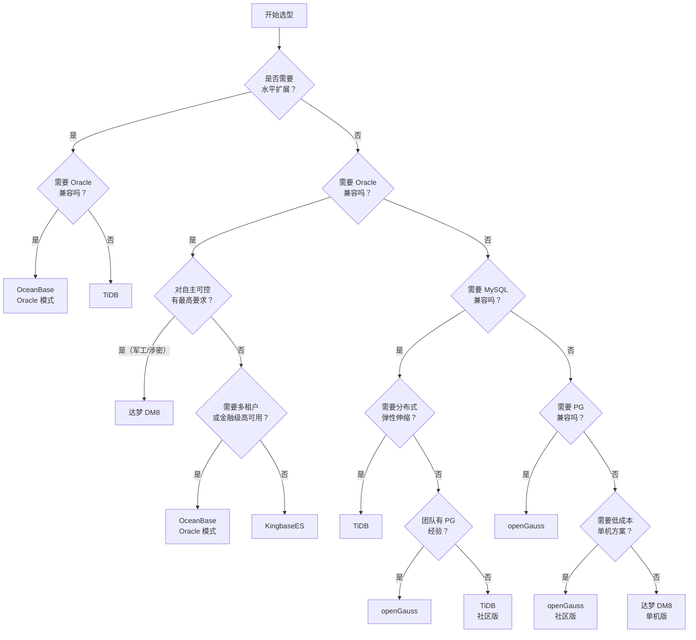

# 国产数据库选型对比

## 概述

国产数据库选型是信创背景下架构师和高级工程师的核心能力之一。选型不仅仅是对比技术参数，还需要综合考虑信创合规、Oracle/MySQL 兼容性、迁移成本、运维能力、生态成熟度、团队技术栈等多维度因素。本模块提供全面的国产数据库对比框架、选型决策树和迁移注意事项，帮助你做出理性的技术决策。

::: tip 学习目标
掌握国产数据库的选型框架和决策方法论，能够根据业务场景（金融、政府、互联网、IoT）推荐合适的国产数据库，理解不同数据库间的核心差异和 trade-off，并回答面试中关于国产数据库对比、选型决策、迁移策略等高频问题。
:::

---

## 一、知识图谱

```mermaid
graph TD
    A[国产数据库选型] --> B[对比维度]
    A --> C[场景决策]
    A --> D[迁移考量]
    A --> E[生态评估]
    A --> F[风险控制]

    B --> B1["架构<br/>单机 vs 分布式"]
    B --> B2["性能<br/>TPC-C / 实际场景"]
    B --> B3["兼容性<br/>Oracle / MySQL / PG"]
    B --> B4["运维成本<br/>部署 / 监控 / 调优"]
    B --> B5["安全合规<br/>国密 / 等保 / 密评"]

    C --> C1["金融核心 → OB / TiDB"]
    C --> C2["政府/军工 → 达梦 / KingbaseES"]
    C --> C3["互联网 → TiDB"]
    C --> C4["电信 → openGauss / GBase"]
    C --> C5["IoT/时序 → TDengine"]

    D --> D1["SQL 兼容性差异"]
    D --> D2["数据类型映射"]
    D --> D3["存储过程迁移"]
    D --> D4["性能对比验证"]

    E --> E1["开源 vs 闭源"]
    E --> E2["社区活跃度"]
    E --> E3["云原生支持<br/>K8s / 容器化"]
    E --> E4["工具链<br/>迁移/监控/诊断"]

    F --> F1["厂商锁定风险"]
    F --> F2["二次迁移成本"]
    F --> F3["人才储备"]
    F --> F4["回退方案"]
```



---

## 二、基础到进阶学习路线

- **阶段一：基础入门** —— 了解各国产数据库的基本定位和适用场景，能说出"金融选 OB、政府选达梦、互联网选 TiDB"的基本判断逻辑。
- **阶段二：原理深入** —— 理解各数据库的架构差异（分布式 vs 单机、Paxos vs Raft、LSM-Tree vs B+Tree），掌握选型的 trade-off 分析能力，能够根据业务场景做深度对比。
- **阶段三：实战优化** —— 掌握迁移评估方法论、SQL 兼容性差异处理、性能对比测试方法，能够制定企业级数据库选型方案和迁移路线图。

---

## 三、核心知识详解

### 3.1 国产数据库全面对比

#### 3.1.1 架构对比

| 维度 | OceanBase | TiDB | openGauss | 达梦 DM8 | KingbaseES |
|------|-----------|------|-----------|---------|------------|
| **架构类型** | 一体化分布式 | 计算存储分离分布式 | 单机 + 主备 | 单机 + DSC 集群 | 单机 + 主备 |
| **一致性协议** | Paxos（Multi-Paxos） | Raft（Multi-Raft） | 无（WAL 复制） | 无（WAL 复制） | 无（WAL 复制） |
| **存储引擎** | 自研 LSM-Tree | TiKV(RocksDB) + TiFlash | 行存 + 列存 + MOT | 行存 + 列存 + HUGE | PG 行存增强 |
| **计算存储分离** | 否（一体化） | 是（严格分离） | 否 | 否 | 否 |
| **水平扩展** | 支持（加 OBServer） | 支持（各自独立扩缩） | 不支持（单机） | 有限（DSC 最多 8 节点） | 不支持 |
| **单机模式** | 支持（单机分布式一体化） | 不支持（生产最少 9 节点） | 支持 | 支持 | 支持 |
| **多租户** | 原生支持 | 不支持 | 不支持 | 不支持 | 不支持 |

#### 3.1.2 兼容性对比

| 维度 | OceanBase | TiDB | openGauss | 达梦 DM8 | KingbaseES |
|------|-----------|------|-----------|---------|------------|
| **MySQL 兼容** | 支持（MySQL 模式） | 兼容 MySQL 5.7 | 不支持 | 不支持 | 不支持 |
| **Oracle 兼容** | 支持（Oracle 模式） | 不支持 | 不支持 | 高度兼容 | 支持（兼容模式） |
| **PG 兼容** | 不支持 | 不支持 | 兼容 PG 9.2 | 不支持 | 兼容 PG |
| **PL/SQL 兼容** | 85%+ | 0% | 0%（PL/pgSQL） | 90%+ | 80%+ |
| **存储过程** | 支持（MySQL + Oracle 模式） | 不支持 | 支持（PL/pgSQL） | 支持（PL/SQL） | 支持（PL/SQL + PL/pgSQL） |
| **外键** | 支持 | 不支持（解析不强制） | 支持 | 支持 | 支持 |
| **触发器** | 支持 | 不支持 | 支持 | 支持 | 支持 |

#### 3.1.3 性能对比（基准参考）

| 场景 | OceanBase | TiDB | openGauss | 达梦 DM8 |
|------|-----------|------|-----------|---------|
| **TPC-C 成绩** | 7.07 亿 tpmC | 8.6 万 tpmC | - | - |
| **OLTP 点查** | 优秀（LSM-Tree + Bloom Filter） | 良好（需多 Region 查询） | 优秀（B+Tree + MOT） | 优秀（B+Tree） |
| **OLTP 写入** | 优秀（LSM-Tree 顺序写） | 优秀（LSM-Tree） | 良好（B+Tree 随机写） | 良好（B+Tree 随机写） |
| **OLAP 大查询** | 良好（向量化引擎） | 优秀（TiFlash 列存 + MPP） | 良好（列存 + 并行） | 良好（列存） |
| **并发能力** | 极高（Paxos 无锁） | 高（Raft 分区并发） | 中（单机上限） | 中（单机上限） |
| **最小资源** | 4C8G | 生产 6 节点+ | 2C4G | 2C4G |

#### 3.1.4 生态与运维对比

| 维度 | OceanBase | TiDB | openGauss | 达梦 DM8 |
|------|-----------|------|-----------|---------|
| **开源协议** | MulanPubL-2.0 | Apache 2.0 | MulanPubL-2.0 | 闭源 |
| **社区活跃度** | 中（增长中） | 高（最活跃） | 中 | 低（闭源） |
| **GitHub Stars** | 8k+ | 37k+ | 3k+ | - |
| **文档质量** | 良好 | 优秀 | 良好 | 一般 |
| **K8s 支持** | 有（OB-Operator） | 有（TiDB Operator） | 有限 | 无 |
| **迁移工具** | OMA + OMS | Dumpling + Lightning + TiCDC | DBMind 迁移工具 | DTS |
| **监控工具** | OCP | TiDB Dashboard + Grafana | DBMind + Prometheus | DM 管理工具 |
| **商业支持** | 蚂蚁集团 | PingCAP | 华为 | 达梦公司 |
| **培训认证** | OBCP/OBCA | PCTP/PCTA | HCIP-GaussDB | DCA/DCP |

### 3.2 选型决策树



**选型决策速查表：**

| 行业 | 推荐方案 | 备选方案 | 核心原因 |
|------|---------|---------|---------|
| **金融核心交易** | OceanBase | TiDB | 金融级 Paxos 强一致、TPC-C 世界第一、蚂蚁实战验证 |
| **金融非核心** | OceanBase / openGauss | TiDB | 视 Oracle 依赖程度和信创合规要求 |
| **政府/军工** | 达梦 DM8 | KingbaseES | 自主可控最高等级、Oracle 最深兼容、信创目录首选 |
| **互联网电商** | TiDB | OceanBase | MySQL 兼容、弹性伸缩、开源社区活跃 |
| **电信运营商** | openGauss / GaussDB | GBase 8a | 华为生态、大规模 OLTP 验证 |
| **IoT/时序** | TDengine | TiDB | 专为时序场景设计、10x 压缩比 |
| **中小微企业** | openGauss / TiDB 社区版 | MySQL | 开源免费、社区支持 |
| **数据仓库/BI** | TiDB（TiFlash） | GBase 8a | 列存 + MPP、实时同步 |

### 3.3 迁移注意事项

#### 3.3.1 SQL 兼容性差异矩阵

```sql
-- 常见 SQL 兼容性差异速查

-- 1. 分页查询
-- Oracle: ROWNUM 或 OFFSET...FETCH
-- MySQL: LIMIT offset, count
-- OceanBase: 同时支持两种语法（取决于兼容模式）
-- TiDB: LIMIT（MySQL 模式）
-- openGauss: LIMIT + OFFSET（PG 模式）
-- 达梦: ROWNUM + LIMIT（同时支持 Oracle 和 MySQL 语法）

-- 2. 字符串连接
-- Oracle: 'a' || 'b' 或 CONCAT('a', 'b')
-- MySQL: CONCAT('a', 'b')
-- 注意：Oracle 中 || 优先级高于 AND/OR，需注意括号

-- 3. 空串处理
-- Oracle: '' 等同于 NULL
-- MySQL: '' 是空字符串，不等于 NULL
-- OceanBase: 取决于兼容模式
-- 达梦: 可通过 BLANK_PAD_CHAR 参数配置

-- 4. 自增主键
-- Oracle: SEQUENCE + INSERT 手动调用
-- MySQL: AUTO_INCREMENT
-- TiDB: AUTO_INCREMENT（但分布式下不保证连续）
-- 达梦: IDENTITY 列 或 SEQUENCE
```

#### 3.3.2 数据类型映射

| Oracle 类型 | MySQL 类型 | OceanBase | TiDB | openGauss | 达梦 DM8 |
|------------|-----------|-----------|------|-----------|---------|
| NUMBER(p,s) | DECIMAL(p,s) | NUMBER(p,s) | DECIMAL(p,s) | NUMERIC(p,s) | NUMBER(p,s) |
| NUMBER | DECIMAL(65) | NUMBER | DECIMAL(65) | NUMERIC | NUMBER |
| VARCHAR2(n) | VARCHAR(n) | VARCHAR2(n) | VARCHAR(n) | VARCHAR(n) | VARCHAR2(n) |
| DATE | DATETIME | DATE | DATETIME | TIMESTAMP | DATE |
| CLOB | LONGTEXT | CLOB | LONGTEXT | TEXT | CLOB |
| BLOB | LONGBLOB | BLOB | LONGBLOB | BYTEA | BLOB |
| RAW(n) | VARBINARY(n) | RAW(n) | VARBINARY(n) | BYTEA | VARBINARY(n) |
| ROWID | - | ROWID | 不支持 | 不支持 | ROWID |

#### 3.3.3 存储过程迁移策略

```
存储过程迁移决策树：

存储过程数量评估
  ├── < 50 个 → 全部迁移到目标数据库（改写）
  ├── 50 ~ 200 个 → 分类处理
  │   ├── 简单 CRUD 存储过程 → 迁移到目标数据库
  │   ├── 复杂业务逻辑存储过程 → 迁移到应用层 Java/Go
  │   └── 定时任务存储过程 → 迁移到调度系统（XXL-JOB）
  └── > 200 个 → 优先迁移到应用层
      ├── 降低数据库耦合度
      ├── 便于后续再次迁移（解耦后切换成本低）
      └── 利用应用层框架（Spring/MyBatis）的统一管理

迁移优先级：
  1. Oracle → 达梦 DM8（兼容性最好，90%+ 零修改）
  2. Oracle → OceanBase Oracle 模式（兼容性好，85%+ 零修改）
  3. Oracle → KingbaseES Oracle 兼容模式（兼容性较好，80%+ 零修改）
  4. Oracle → openGauss（需改写为 PL/pgSQL，工作量大）
  5. Oracle → TiDB（不支持存储过程，需全部重写为应用层代码）
```

### 3.4 云原生支持对比

| 能力 | OceanBase | TiDB | openGauss | 达梦 DM8 |
|------|-----------|------|-----------|---------|
| **K8s Operator** | OB-Operator | TiDB Operator | 社区版有 | 无 |
| **容器化部署** | 支持 | 支持 | 部分支持 | 有限 |
| **自动扩缩容** | 支持（加 OBServer） | 支持（各组件独立） | 不支持 | 不支持 |
| **多租户（DBaaS）** | 原生多租户 | 不支持（需多套集群） | 不支持 | 不支持 |
| **云原生存储** | 支持（本地盘/云盘） | 支持（本地 NVMe 推荐） | 支持 | 本地盘 |

```yaml
# TiDB K8s 部署示例（TiDB Operator）
# 最小化部署配置
apiVersion: pingcap.com/v1alpha1
kind: TidbCluster
metadata:
  name: basic
spec:
  version: v7.5.0
  pd:
    replicas: 3
    requests:
      storage: 10Gi
  tikv:
    replicas: 3
    requests:
      storage: 100Gi
  tidb:
    replicas: 2
```

### 3.5 生态工具链对比

| 工具类型 | OceanBase | TiDB | openGauss | 达梦 DM8 |
|----------|-----------|------|-----------|---------|
| **数据迁移** | OMS（全量+增量） | TiDB Lightning + TiCDC | DBMind 迁移工具 | DTS |
| **备份恢复** | OCP 备份管理 | BR（Backup Restore） | pg_dump + WAL 归档 | DMRMAN |
| **监控告警** | OCP + Prometheus | TiDB Dashboard + Grafana | DBMind + Prometheus | DM 管理工具 |
| **SQL 审核** | ODC（开发者中心） | TiDB Dashboard SQL 分析 | DBMind SQL 诊断 | DM 审计工具 |
| **数据同步** | OMS（实时同步） | TiCDC（CDC 同步） | 逻辑复制 | DTS（增量同步） |
| **开发工具** | ODC（类 Navicat） | 兼容 MySQL 工具 | Data Studio / DBeaver | DM 管理工具 |

---

## 四、经典应用场景与解决方案

### 场景：大型企业数据库选型决策

**问题背景**

某大型央企集团（员工 10 万+，年营收 2000 亿+）正在进行信创替代规划，需要为以下系统选择数据库：

- **系统 A：核心 ERP 系统**（Oracle RAC 3 节点，2000+ 存储过程，日均 100 万笔交易）
- **系统 B：OA 办公系统**（Oracle 单机，50+ 存储过程，日均 1 万用户在线）
- **系统 C：数据中台/BI 分析**（Greenplum 数据仓库，100TB，每日 ETL 3 小时）
- **系统 D：新建物联网平台**（预计 10 万设备，每秒 5 万条数据写入）

**完整方案**

```
选型分析：

系统 A：核心 ERP 系统
├── 关键约束：
│   ├── 2000+ Oracle 存储过程 → 迁移成本是核心考量
│   ├── 需要高可用（RPO=0, RTO<30s）
│   └── 信创合规要求
├── 候选方案：
│   ├── 方案 1：达梦 DM8 + DSC 集群 ★★★★★
│   │   ├── 优势：Oracle 兼容最深（90%+ 存储过程零修改）
│   │   ├── 优势：DSC 架构与 Oracle RAC 一致，迁移成本最低
│   │   └── 劣势：闭源、社区小、DSC 成熟度不如 Oracle RAC
│   ├── 方案 2：OceanBase Oracle 模式
│   │   ├── 优势：分布式架构，更高可用性（Paxos 三副本）
│   │   ├── 优势：TPC-C 世界纪录，性能有保障
│   │   └── 劣势：存储过程迁移率约 85%，需改写 300+ 个存储过程
│   └── 方案 3：保留 Oracle（非信创替代场景）
│
├── 推荐：达梦 DM8 + DSC（迁移成本最低，信创合规最高）

系统 B：OA 办公系统
├── 关键约束：
│   ├── 50+ 存储过程，迁移成本可控
│   ├── 并发量不高，对性能要求一般
│   └── 信创合规要求
├── 候选方案：
│   ├── 达梦 DM8（单机） ★★★★
│   ├── KingbaseES ★★★★
│   └── openGauss ★★★
├── 推荐：达梦 DM8 或 KingbaseES（成本低，信创合规）

系统 C：数据中台/BI 分析
├── 关键约束：
│   ├── 100TB 数据量，需要列存和 MPP 并行
│   ├── 每日 ETL 3 小时，需要高性能写入
│   └── 信创合规要求
├── 候选方案：
│   ├── TiDB（TiFlash 列存 + MPP） ★★★★★
│   ├── GBase 8a MPP 集群 ★★★★
│   └── openGauss 列存 ★★★
├── 推荐：TiDB（TiFlash 列存引擎，MPP 并行，MySQL 兼容）

系统 D：物联网平台
├── 关键约束：
│   ├── 10 万设备，每秒 5 万条写入
│   ├── 时序数据，需要高压缩比
│   └── 需要水平扩展
├── 候选方案：
│   ├── TDengine ★★★★★
│   │   ├── 专为时序设计，超级表模型
│   │   ├── 10x 压缩比，写入性能极高
│   │   └── 劣势：非通用数据库，不适合复杂查询
│   ├── TiDB ★★★★
│   └── OceanBase ★★★
├── 推荐：TDengine（时序场景专用，性价比最高）
```

**统一选型总结：**

```
┌──────────────────────────────────────────────────────────────────┐
│                    央企集团数据库选型方案                           │
├──────────────┬─────────────────┬──────────────┬──────────────────┤
│   系统        │   推荐方案        │   迁移成本    │   信创合规       │
├──────────────┼─────────────────┼──────────────┼──────────────────┤
│ 核心 ERP      │ 达梦 DM8 + DSC  │ 中（6 个月）  │ 最高（完全自研）  │
│ OA 办公      │ 达梦 DM8 单机   │ 低（2 个月）  │ 最高（完全自研）  │
│ 数据中台/BI  │ TiDB + TiFlash  │ 中（4 个月）  │ 高（开源自研）    │
│ 物联网平台    │ TDengine        │ 低（新建）    │ 高（国产）        │
└──────────────┴─────────────────┴──────────────┴──────────────────┘
```

::: warning 多数据库并行管理
该央企集团最终使用了 3 种国产数据库，需要注意：
- DBA 团队需要学习多种数据库，增加人员成本
- 建立统一的监控和告警平台（Prometheus + Grafana 统一接入）
- 制定统一的备份恢复策略和数据安全规范
- 与厂商签订统一的服务协议，降低管理复杂度
:::

---

## 五、高频面试题

### Q1: 国产数据库怎么选？有没有通用的选型框架？

::: details 答案

**国产数据库选型五步框架：**

**第一步：明确业务需求**

| 维度 | 关键问题 |
|------|---------|
| 数据规模 | 当前数据量？年增长率？单表最大行数？ |
| 并发模型 | 峰值 TPS/QPS？读写比例？事务类型（短事务/长事务）？ |
| SQL 复杂度 | 是否大量使用存储过程？复杂 Join？子查询？分析函数？ |
| 可用性要求 | RPO 和 RTO 目标？是否需要多活？ |
| 扩展性需求 | 是否需要水平扩展？预计未来 3 年数据增长？ |

**第二步：评估兼容性约束**

```
现有数据库类型：
├── Oracle → 优先考虑达梦 > OceanBase Oracle 模式 > KingbaseES
├── MySQL → 优先考虑 TiDB > OceanBase MySQL 模式
├── PostgreSQL → 优先考虑 openGauss > KingbaseES
└── SQL Server → 优先考虑 KingbaseES（SQL Server 兼容模式）
```

**第三步：信创合规要求**

| 合规等级 | 要求 | 推荐 |
|----------|------|------|
| 最高（军工/涉密） | 完全自主可控 | 达梦 DM8 |
| 高（央企/政府） | 信创目录产品 | 达梦 / KingbaseES / openGauss |
| 中（金融机构） | 通过国密认证 | OceanBase / TiDB / 达梦 |
| 低（普通企业） | 无强制要求 | 任何国产数据库 |

**第四步：评估运维能力**

| 团队能力 | 推荐 |
|----------|------|
| 有 Oracle DBA | 达梦（迁移成本最低）或 OceanBase Oracle 模式 |
| 有 MySQL DBA | TiDB（MySQL 兼容） |
| 有 PG DBA | openGauss |
| 有分布式经验 | OceanBase / TiDB |
| 无 DBA 团队 | 优先考虑云数据库服务（DBaaS） |

**第五步：成本分析**

```
成本 = 许可证费用 + 硬件成本 + 迁移成本 + 运维成本 + 培训成本

许可证费用：
  达梦 > KingbaseES > openGauss（商业版） > OceanBase（商业版） > TiDB（商业版） > openGauss（社区版） > TiDB（社区版） > OceanBase（社区版）

硬件成本：
  分布式（OB/TiDB）> 单机（达梦/openGauss）

迁移成本：
  Oracle→达梦 < Oracle→OB < Oracle→openGauss < Oracle→TiDB
```

**选型决策矩阵模板：**

| 维度 | 权重 | 达梦 | OB | TiDB | openGauss | KingbaseES |
|------|------|------|-----|------|-----------|------------|
| 兼容性 | 30% | 9 | 8 | 6 | 5 | 7 |
| 性能 | 25% | 7 | 9 | 8 | 7 | 6 |
| 扩展性 | 20% | 4 | 9 | 9 | 3 | 3 |
| 信创合规 | 15% | 10 | 7 | 6 | 8 | 8 |
| 运维成本 | 10% | 6 | 7 | 8 | 7 | 7 |
| **加权总分** | | **7.4** | **8.1** | **7.3** | **5.8** | **6.1** |

> 注：权重和分数根据实际业务调整，本表仅作示例
:::

### Q2: OceanBase 和 TiDB 怎么选？详细对比

::: details 答案

**OB vs TiDB 核心差异（一页纸对比）：**

| 决策维度 | 选 OceanBase | 选 TiDB |
|----------|-------------|---------|
| **SQL 兼容** | 需要 Oracle 兼容（PL/SQL、存储过程） | 需要 MySQL 兼容、不需要存储过程 |
| **多租户** | 需要原生多租户（一套集群多个业务线） | 不需要多租户或可接受多套集群 |
| **部署复杂度** | 单机可运行，起步成本低 | 生产最少 6-9 节点，起步成本高 |
| **弹性伸缩** | 需要整体扩缩 OBServer 节点 | 计算和存储可独立扩缩 |
| **HTAP** | 引擎内一体化，数据零延迟 | TiFlash 列存，异步秒级延迟 |
| **开源协议** | MulanPubL-2.0（国产协议） | Apache 2.0（国际通用） |
| **社区活跃度** | 中文社区为主，国际影响力有限 | 国际社区活跃，GitHub 37k+ Stars |
| **厂商锁定** | 蚂蚁集团主导，锁定风险较高 | PingCAP 主导，但开源协议更开放 |
| **金融验证** | 蚂蚁双 11 实战，TPC-C 世界第一 | 多家金融机构核心系统落地 |
| **云原生** | 有 OB-Operator | TiDB Operator 更成熟 |

**选型建议：**

```
选 OceanBase 的场景：
✅ 需要 Oracle 兼容（PL/SQL 存储过程迁移）
✅ 需要原生多租户（多业务线共享集群）
✅ 需要单机起步（小规模→大规模无缝演进）
✅ 金融核心系统（Paxos 强一致 + 蚂蚁验证）
✅ 需要降低存储成本（无 TiFlash 额外副本）

选 TiDB 的场景：
✅ 需要 MySQL 兼容（不需要存储过程）
✅ 需要计算和存储独立扩缩容
✅ 需要 Apache 2.0 开源协议（避免厂商锁定）
✅ 需要活跃的国际社区支持
✅ 需要成熟的 K8s 云原生部署
✅ 需要 TiFlash 列存做复杂分析查询
```
:::

### Q3: 达梦和 Oracle 的迁移难度大吗？有哪些坑？

::: details 答案

**达梦是国产数据库中对 Oracle 兼容最深的**，迁移难度相对最小，但仍有以下坑：

**1. 数据类型陷阱**

```sql
-- Oracle NUMBER 无精度 → 达梦 NUMBER（最大 38 位）
-- 解决方案：显式指定精度
-- Oracle: CREATE TABLE t (amount NUMBER);
-- DM8:    CREATE TABLE t (amount NUMBER(18,2));

-- Oracle DATE 含时间 → 达梦 DATE 也含时间（兼容）
-- 但要注意：Oracle 中 TRUNC(date_col) 去掉时间部分，DM8 行为一致

-- Oracle VARCHAR2(4000) → DM8 VARCHAR2(4000) 兼容
-- 但 Oracle 12c+ 扩展 VARCHAR2 到 32767，DM8 也支持，但需确认版本
```

**2. 存储过程兼容性**

```sql
-- 兼容性较好（90%+），但以下场景需注意：
-- 1. Oracle 自治事务（PRAGMA AUTONOMOUS_TRANSACTION）
--    DM8 不支持，需重构为独立事务或应用层事务

-- 2. Oracle 原生动态 SQL（EXECUTE IMMEDIATE USING）
--    DM8 支持，但语法有细微差异

-- 3. Oracle 内置包（DBMS_SCHEDULER、DBMS_CRYPTO 等）
--    DM8 有替代方案，但需逐一验证
```

**3. 性能差异**

| 场景 | Oracle | DM8 | 差异 |
|------|--------|-----|------|
| 简单 CRUD | 基本持平 | 基本持平 | 相差 < 10% |
| 复杂多表 Join | 更优 | 稍差 | CBO 优化器成熟度差异 |
| 大表全表扫描 | 更优 | 稍差 | 并行执行框架差异 |
| 存储过程 | 更优 | 稍差 | PL/SQL 引擎优化差异 |

**4. 迁移流程建议**

```
1. 使用 DTS 工具做兼容性评估（必须）
2. 搭建 DM8 测试环境，全量 SQL 回归测试
3. 性能对比测试（Sysbench + 业务回放）
4. 找出不兼容项，建立映射表，批量处理
5. 至少 3 轮全量测试 → 修复 → 再测试
6. 迁移窗口：周末 + 回退方案
```
:::

### Q4: 国产数据库生态成熟度怎么样？和 Oracle 差距在哪？

::: details 答案

**生态成熟度分层评估：**

| 生态维度 | Oracle | TiDB | OceanBase | openGauss | 达梦 |
|----------|--------|------|-----------|-----------|------|
| **文档质量** | 10/10 | 9/10 | 8/10 | 7/10 | 6/10 |
| **社区活跃度** | 10/10 | 9/10 | 7/10 | 6/10 | 3/10 |
| **运维工具** | 10/10 | 8/10 | 8/10 | 7/10 | 6/10 |
| **监控诊断** | 10/10 | 8/10 | 8/10 | 7/10 | 5/10 |
| **迁移工具** | 10/10 | 8/10 | 8/10 | 6/10 | 7/10 |
| **培训认证** | 10/10 | 8/10 | 7/10 | 7/10 | 5/10 |
| **第三方集成** | 10/10 | 7/10 | 6/10 | 5/10 | 4/10 |
| **人才市场** | 10/10 | 6/10 | 5/10 | 4/10 | 3/10 |

**与 Oracle 的核心差距：**

**1. 运维工具成熟度**
- Oracle：EM（Enterprise Manager）20 年+ 积累，可视化诊断、AWR/ASH 报告、ADDM 自动诊断
- 国产库：TiDB Dashboard 和 OCP 较好，但深度和广度不如 EM

**2. 优化器成熟度**
- Oracle：CBO 优化器 40 年打磨，复杂查询（10+ 表 Join、多层子查询）优化经验丰富
- 国产库：在简单查询上性能接近，复杂查询仍有差距

**3. 最佳实践积累**
- Oracle：40 年案例积累，几乎任何场景都有成熟方案
- 国产库：TiDB 和 OB 在互联网场景积累较多，传统行业案例较少

**4. 第三方工具集成**
- Oracle：几乎所有 BI/ETL/监控/安全工具都支持
- 国产库：逐步完善中，但覆盖度差距大

**5. 人才市场**
- Oracle DBA：市场存量数十万，培训体系成熟
- 国产数据库 DBA：稀缺，薪资倒挂，但总人数少

**生态发展趋势：**
- TiDB 生态发展最快（开源、国际社区、K8s 云原生）
- OceanBase 生态在金融领域快速增长
- 传统国产库（达梦/金仓）生态相对封闭，增长缓慢
:::

### Q5: 什么时候不适合用国产数据库？

::: details 答案

**不适合使用国产数据库的场景：**

**1. 极度依赖 Oracle 高级特性**

```
不适合场景：
- 大量使用 Oracle 自治事务（PRAGMA AUTONOMOUS_TRANSACTION）
- 深度使用 Oracle 高级队列（AQ）
- 依赖 Oracle 高级分析函数（数据挖掘、OLAP DML）
- 使用 Oracle 高级复制（Streams/GoldenGate 高级功能）

建议：评估改造量，如果改造量 > 30% 且团队无国产库经验，暂缓迁移
```

**2. 对数据库生态有极高要求**

```
不适合场景：
- 需要大量第三方工具集成（BI/ETL/审计/安全扫描）
- 需要成熟的云数据库服务（DBaaS）
- 需要全球多区域部署和本地化支持

建议：如果第三方工具不支持国产库，迁移会带来大量额外工作
```

**3. 团队能力不匹配**

```
不适合场景：
- 团队无分布式数据库经验（要去 TiDB/OB）
- 团队无 PG 经验（要去 openGauss）
- 团队无 Oracle 存储过程改造经验（要去达梦）

建议：先培训 1-2 个月，积累经验后再迁移
```

**4. 极端性能要求**

```
不适合场景：
- 单个查询要求 < 100us 延迟（分布式架构有网络开销）
- 需要极致的单机 OLTP 性能（Oracle Exadata 级别）
- 需要极致的 CBO 优化器（复杂查询优化）

建议：如果 Oracle 上跑得已经很好且无信创强制要求，不要为了迁移而迁移
```

**5. 业务稳定性要求极高且无迁移窗口**

```
不适合场景：
- 核心系统 7x24 不可中断，无维护窗口
- 业务方对未来 1-2 年的任何不稳定零容忍
- 无完整的回退方案

建议：先在非核心系统积累经验，再逐步迁移核心系统
```

**替代策略：**

```
场景 1：信创合规要求 + 不适合迁移
→ 策略：非核心系统迁移国产库，核心系统保留 Oracle（申请豁免）

场景 2：技术评估后不适合
→ 策略：先选择兼容性最好的国产库（如达梦），做小规模试点

场景 3：分布式数据库不适合
→ 策略：选择单机架构的国产库（达梦/openGauss/KingbaseES）
```
:::

### Q6: 国产数据库的云原生支持情况如何？能否在 K8s 上部署？

::: details 答案

**国产数据库云原生支持现状：**

| 数据库 | K8s 部署 | Operator | 自动扩缩容 | 状态 |
|--------|---------|----------|-----------|------|
| **TiDB** | 完善 | TiDB Operator | 支持 | 生产可用，最成熟 |
| **OceanBase** | 可用 | OB-Operator | 支持 | 社区版可用，商业版推荐 |
| **openGauss** | 有限 | 社区版有 | 不支持 | 实验阶段，不推荐生产 |
| **达梦 DM8** | 不支持 | 无 | 不支持 | 不支持容器化 |
| **KingbaseES** | 有限 | 无 | 不支持 | 不推荐 |

**TiDB 云原生部署（最成熟）：**

```yaml
# TiDB Operator 部署示例
# 1. 安装 TiDB Operator
# helm install tidb-operator pingcap/tidb-operator --namespace tidb-admin

# 2. 创建 TiDB 集群
apiVersion: pingcap.com/v1alpha1
kind: TidbCluster
metadata:
  name: production-cluster
  namespace: tidb-cluster
spec:
  version: v7.5.0
  timezone: Asia/Shanghai
  configUpdateStrategy: RollingUpdate
  pvReclaimPolicy: Retain
  
  pd:
    baseImage: pingcap/pd
    replicas: 3
    requests:
      cpu: 4
      memory: 8Gi
      storage: 100Gi
    config:
      schedule:
        max-snapshot-count: 5
  
  tikv:
    baseImage: pingcap/tikv
    replicas: 5
    requests:
      cpu: 8
      memory: 32Gi
      storage: 500Gi
    config:
      storage:
        reserve-space: 10GB
      raftstore:
        raft-max-inflight-msgs: 256
  
  tidb:
    baseImage: pingcap/tidb
    replicas: 3
    requests:
      cpu: 8
      memory: 16Gi
    config:
      log:
        level: info
    service:
      type: LoadBalancer
```

**K8s 部署的注意事项：**

| 注意点 | 说明 |
|--------|------|
| **存储性能** | TiKV 需要本地 NVMe SSD，不建议使用网络存储（Ceph/NFS） |
| **网络延迟** | 分布式数据库对网络延迟敏感，建议同机房部署 |
| **资源预留** | 建议为数据库 Pod 设置 Guaranteed QoS（requests = limits） |
| **备份策略** | 使用 BR 备份到对象存储（S3/GCS），不要依赖 K8s PV 快照 |
| **监控** | 部署 TiDB Dashboard + Prometheus Operator，集成到 K8s 监控体系 |

**不推荐容器化的场景：**

```
不推荐 K8s 部署：
- 达梦 DM8（不支持）
- openGauss（生产环境不成熟）
- 任何需要极致性能的场景（裸金属 > 虚拟机 > K8s）

推荐 K8s 部署：
- TiDB（最成熟的云原生分布式数据库）
- OceanBase（社区版可用，商业版推荐物理机）
- 开发/测试环境（所有数据库）
```

**云原生选型建议：**
- 如果需要 K8s 原生部署 → TiDB 是唯一成熟选择
- 如果对性能要求极高 → 裸金属/物理机部署
- 如果需要 DBaaS → 等待云厂商提供托管的国产数据库服务
:::

---

## 六、选型指南

### 选型决策速查

```
┌─────────────────────────────────────────────────────────────────┐
│                    国产数据库选型决策矩阵                          │
├──────────────┬──────────┬──────────┬──────────┬────────────────┤
│   场景        │ 首选      │ 次选      │ 不推荐    │ 核心原因        │
├──────────────┼──────────┼──────────┼──────────┼────────────────┤
│ 金融核心交易  │ OceanBase│ TiDB     │ 达梦     │ 分布式强一致    │
│ 金融非核心    │ openGauss│ 达梦     │ TiDB     │ 信创合规 + 成本 │
│ 政府/军工    │ 达梦     │ Kingbase │ TiDB     │ 自主可控最高    │
│ 互联网电商    │ TiDB     │ OceanBase│ 达梦     │ MySQL 兼容+弹性 │
│ 电信运营商    │ openGauss│ GBase    │ TiDB     │ 华为生态        │
│ 数据仓库/BI  │ TiDB     │ GBase 8a │ 达梦     │ 列存+MPP       │
│ IoT/时序     │ TDengine │ TiDB     │ 达梦     │ 时序专用        │
│ 中小微企业    │ TiDB社区版│ openGauss│ 达梦     │ 开源免费        │
│ Oracle 迁移  │ 达梦     │ OceanBase│ TiDB     │ 兼容性最好      │
│ 云原生部署    │ TiDB     │ OceanBase│ 达梦     │ K8s Operator   │
└──────────────┴──────────┴──────────┴──────────┴────────────────┘
```

### 配置建议

```
最小生产配置：

TiDB:  TiDB x 2 (8C16G) + PD x 3 (4C8G) + TiKV x 3 (16C64G/1T NVMe)
OceanBase: OBServer x 3 (16C64G/500G SSD)
openGauss: 主 x 1 (16C64G/1T SSD) + 备 x 1 (16C64G/1T SSD)
达梦 DM8: 主 x 1 (16C64G/1T SSD) + 备 x 1 (16C64G/1T SSD)
```

---

## 相关文档

- [国产数据库概览](./index)
- [OceanBase 核心原理](./oceanbase)
- [TiDB 核心原理](./tidb)
- [openGauss 核心原理](./opengauss)
- [达梦 DM8 核心原理](./dameng)