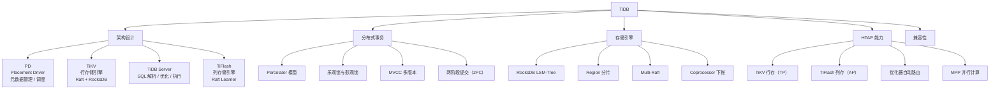
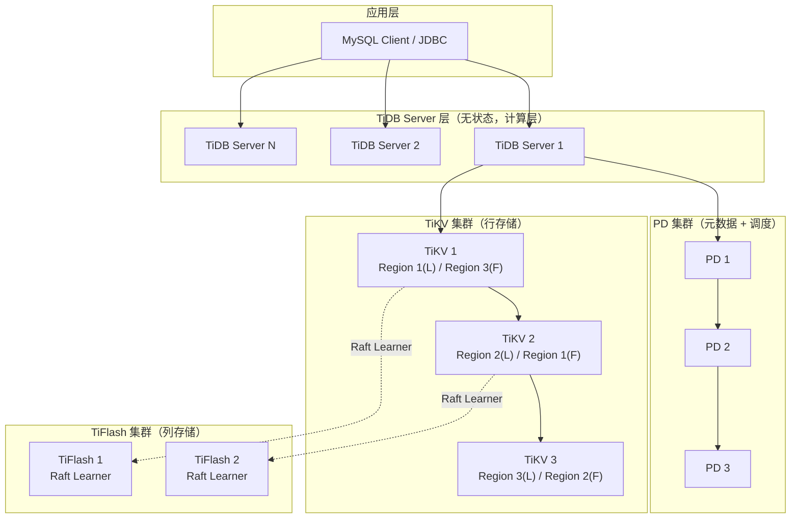

# TiDB 核心原理

## 概述

TiDB 是由 PingCAP 开发的开源分布式 NewSQL 数据库，采用计算存储分离的三层架构（PD + TiKV + TiDB），基于 Raft 协议实现多副本强一致，兼容 MySQL 5.7 协议。TiDB 的核心设计思想是"将复杂性留在数据库内部，对外暴露简单的 MySQL 接口"，使开发者可以像使用单机 MySQL 一样使用分布式数据库。

::: tip 学习目标
深入理解 TiDB 的三层架构与各组件职责，掌握 Raft 协议在 Multi-Raft 模型下的工程实现，理解 Percolator 事务模型如何实现 MVCC 和分布式事务，能够解释 TiFlash 的 HTAP 实现原理，并回答面试中关于 TiDB 架构、事务、扩展性等高频问题。
:::

---

## 一、知识图谱



---

## 二、基础到进阶学习路线

- **阶段一：基础入门** —— 了解 TiDB 的三层架构和各组件职责，搭建 TiDB 集群（TiUP 工具），熟悉基本 SQL 操作，理解 MySQL 兼容边界。
- **阶段二：原理深入** —— 深入理解 Percolator 事务模型（Prewrite + Commit）、MVCC 实现、Raft 在 Multi-Raft 下的调度与分裂、Coprocessor 算子下推、TiFlash 列存与 MPP 引擎。
- **阶段三：实战优化** —— 掌握 TiDB 性能调优（热点调度的应对、Region 分裂策略、SQL 执行计划分析）、数据迁移（Dumpling + TiDB Lightning + TiCDC）、生产环境运维（监控、备份、升级）。

---

## 三、核心知识详解

### 3.1 三层架构设计

TiDB 采用严格的计算存储分离架构，三层组件各自独立部署和伸缩。



**各组件职责：**

| 组件 | 职责 | 关键特性 | 扩展方式 |
|------|------|---------|---------|
| **TiDB Server** | SQL 解析、优化、执行 | 无状态，不存储数据 | 水平扩展（加节点即可） |
| **PD** | 集群元数据管理、Region 调度、TSO 授时 | 嵌入 etcd，Raft 保证一致性 | 3-5 节点（奇数） |
| **TiKV** | 行存储引擎，数据持久化 | 基于 RocksDB，Region 分片 | 水平扩展（数据自动 Rebalance） |
| **TiFlash** | 列存储引擎，OLAP 加速 | Raft Learner 异步复制数据 | 水平扩展 |

### 3.2 Region 与 Multi-Raft

TiDB 将数据按 key 范围切分为 **Region**（默认 96MB），每个 Region 是一个 Raft Group。

```
数据分片模型：

Key Range: [0, +∞)
     │
     ├── Region 1: [key_0, key_100)     → Raft Group 1
     │       ├── Leader: TiKV-1
     │       ├── Follower: TiKV-2, TiKV-3
     │       └── Learner: TiFlash-1
     │
     ├── Region 2: [key_100, key_200)   → Raft Group 2
     │       ├── Leader: TiKV-2
     │       ├── Follower: TiKV-1, TiKV-3
     │       └── Learner: TiFlash-1
     │
     └── Region 3: [key_200, key_300)   → Raft Group 3
             ├── Leader: TiKV-3
             ├── Follower: TiKV-1, TiKV-2
             └── Learner: TiFlash-1
```

**Region 分裂与调度：**

```sql
-- Region 分裂相关参数
-- region-max-size = 144MB（达到后自动分裂）
-- region-split-size = 96MB（达到后尝试分裂）
-- split-merge-interval = 1h（分裂后合并的最小间隔）

-- 查看 Region 分布（通过 PD API）
-- curl http://pd-addr:2379/pd/api/v1/regions

-- 手动分裂 Region（用于热点处理）
-- pd-ctl operator add split-region <region_id>
```

**Multi-Raft 的优势：**

| 维度 | 说明 |
|------|------|
| **并发度** | 不同 Region 的 Raft 组独立运行，避免单 Leader 瓶颈 |
| **故障恢复** | 单个 Region 故障不影响其他 Region 的读写 |
| **调度灵活** | PD 可以独立调度每个 Region 的 Leader 位置 |
| **扩展性** | 新增 TiKV 节点后，Region 自动迁移，实现负载均衡 |

### 3.3 MVCC 实现（Percolator 模型）

TiDB 的 MVCC 基于 Google Percolator 分布式事务模型，核心思想是：每个 key 存储多个版本，通过时间戳（TS）区分版本。

```
MVCC 数据结构（简化）：

Row Key: user:1001
├── Version: ts=100 (write)    → value: "Alice", commit_ts=100
├── Version: ts=95 (write)     → value: "Bob", commit_ts=95
├── Version: ts=90 (lock)      → primary_lock, start_ts=98
└── Version: ts=80 (write)     → value: "Charlie", commit_ts=80

每个 key 有 3 种类型：
- Put: 存储实际的数据值
- Delete: 标记删除
- Lock: 事务进行中的锁标记
```

**Percolator 两阶段提交流程：**

```
事务流程（以 UPDATE user SET name='David' WHERE id=1001 为例）：

Phase 1: Prewrite（预写）
  ┌─────────────────────────────────────────────────────┐
  │ 1. TiDB Server 从 PD 获取 start_ts = 105            │
  │ 2. 读取 key=user:1001 的最新版本，发现 commit_ts=100  │
  │ 3. 在 key=user:1001 上写入 lock（start_ts=105，primary）│
  │ 4. 写入新版本数据 value='David'（start_ts=105）       │
  │ 5. 检查写冲突：如果 [last_commit_ts, start_ts] 之间   │
  │    有新的 commit，则回滚（乐观锁）或等待（悲观锁）      │
  └─────────────────────────────────────────────────────┘

Phase 2: Commit（提交）
  ┌─────────────────────────────────────────────────────┐
  │ 1. TiDB Server 从 PD 获取 commit_ts = 110           │
  │ 2. 删除 primary lock                                │
  │ 3. 写入 commit 记录（commit_ts=110）                  │
  │ 4. 异步清理 secondary lock（如有跨 Region 事务）      │
  │ 5. 返回客户端成功                                    │
  └─────────────────────────────────────────────────────┘
```

```sql
-- TiDB 中的事务隔离级别
-- 默认：Snapshot Isolation（快照隔离），比 MySQL RR 更严格
-- 接近 Serializable 但不完全一致（写偏斜问题）

-- 悲观锁事务（Pessimistic Transaction）
BEGIN;
-- SELECT ... FOR UPDATE 会加悲观锁
SELECT * FROM accounts WHERE id = 1001 FOR UPDATE;
UPDATE accounts SET balance = balance - 100 WHERE id = 1001;
COMMIT;

-- 乐观锁事务（Optimistic Transaction）
BEGIN OPTIMISTIC;
UPDATE accounts SET balance = balance - 100 WHERE id = 1001;
-- 在 COMMIT 时检测冲突，冲突则回滚
COMMIT;
```

::: info 乐观锁 vs 悲观锁

| 维度 | 乐观锁 | 悲观锁 |
|------|--------|--------|
| **冲突检测时机** | COMMIT 时 | 写操作时 |
| **冲突处理** | 回滚重试 | 等待或超时 |
| **适用场景** | 冲突少的场景 | 冲突多的场景 |
| **性能影响** | 无额外锁开销 | 有锁等待开销 |
| **TiDB 默认** | 否（TiDB 4.0+ 默认悲观锁） | 是 |

:::

### 3.4 TiFlash 列存与 HTAP

TiDB 的 HTAP 方案是通过 TiFlash 列存引擎实现的，与 OceanBase 的"引擎内一体化"不同。

```
HTAP 数据流：

TP 写入路径：
  App → TiDB Server → TiKV（行存，Raft Leader）
                                │
                                │ Raft Log 复制
                                ▼
                          TiFlash（列存，Raft Learner）
                                │
                                │ 异步转换
                                ▼
                          列式存储（DeltaTree 引擎）

AP 查询路径：
  App → TiDB Server → 优化器判断 → TiFlash（MPP 引擎）
                                │
                                ▼
                          列式扫描 + 向量化计算
```

```sql
-- TiFlash 副本配置
-- 为表添加 TiFlash 副本
ALTER TABLE orders SET TIFLASH REPLICA 1;

-- 查看 TiFlash 副本状态
SELECT * FROM information_schema.tiflash_replica;

-- 强制执行计划走 TiFlash
SELECT /*+ READ_FROM_STORAGE(TIFLASH[orders]) */ 
    region, SUM(amount) 
FROM orders 
GROUP BY region;

-- 查看执行计划（确认是否使用 TiFlash）
EXPLAIN ANALYZE 
SELECT region, SUM(amount) 
FROM orders 
WHERE order_date >= '2025-01-01' 
GROUP BY region;
```

**TiFlash 核心特性：**

| 特性 | 说明 |
|------|------|
| **Raft Learner** | 异步复制 TiKV 数据，不影响 TP 写入延迟 |
| **列式存储** | 每列独立存储，OLAP 查询只读取需要的列 |
| **MPP 引擎** | 分布式并行计算，Join/Aggregation 在 TiFlash 节点间协同 |
| **智能选择** | CBO 优化器自动决定走 TiKV 还是 TiFlash |
| **数据一致性** | 最终一致（Raft Learner 异步同步，通常延迟 < 1s） |

### 3.5 在线 DDL

TiDB 支持在线 DDL 操作，不阻塞 DML 读写，这是其区别于传统 MySQL 的重要特性。

```sql
-- 在线添加索引（不阻塞读写）
-- MySQL: ALTER TABLE ... ADD INDEX 会锁表（或使用 pt-online-schema-change）
-- TiDB: 直接执行，在线完成
ALTER TABLE orders ADD INDEX idx_order_date (order_date);

-- 在线修改列类型
ALTER TABLE orders MODIFY COLUMN amount DECIMAL(18,4);

-- 查看 DDL 进度
ADMIN SHOW DDL JOBS;

-- DDL 原理：
-- 1. TiDB Server 将 DDL 任务提交到 DDL Owner（某个 TiDB Server）
-- 2. DDL Owner 分阶段执行：
--    - Schema 变更（新增元数据）
--    - 数据回填（如索引构建，逐行扫描写入）
-- 3. 每个阶段完成后，Schema 版本号递增
-- 4. 其他 TiDB Server 检测到新版本后，更新本地 Schema 缓存
```

::: warning DDL 注意事项
- 大表添加索引仍然耗时较长（需要全表扫描），但不会阻塞 DML
- 同一时刻只能有一个 DDL 正在执行（DDL Owner 串行处理）
- 字符集修改（如 `CONVERT TO CHARACTER SET`）不支持在线，需要重建表
:::

---

## 四、经典应用场景与解决方案

### 场景：互联网电商订单系统从 MySQL 分库分表迁移到 TiDB

**问题背景**

某电商平台订单系统使用 MySQL 分库分表（16 库 x 32 表 = 512 张物理表），数据量 500 亿行。面临分库分表带来的查询复杂性（跨库 Join、分布式事务）和运维成本（扩容需要重新分片），计划迁移到 TiDB。

**完整方案**

```
迁移前架构（MySQL 分库分表）：
┌──────────────────────────────────────┐
│        应用层（Sharding-JDBC）        │
│  ┌────────────────────────────────┐  │
│  │ 分库分表路由 key = user_id % 16 │  │
│  │ 跨库 Join 在应用层实现          │  │
│  │ 分布式事务用 Seata 或消息表      │  │
│  └────────────────────────────────┘  │
└──────────┬──────────┬────────────────┘
           │          │
    ┌──────▼──┐  ┌───▼──────┐
    │ MySQL 1 │  │ MySQL 16 │
    │ 32 张表  │  │ 32 张表   │
    │ 主从复制  │  │ 主从复制   │
    └─────────┘  └──────────┘

迁移后架构（TiDB）：
┌──────────────────────────────────────┐
│        应用层（无需分片逻辑）          │
│  直接连 TiDB，像使用单机 MySQL 一样    │
└──────────────┬───────────────────────┘
               │
    ┌──────────▼──────────┐
    │   TiDB Server x 3   │  ← 无状态 SQL 层
    └──────────┬──────────┘
               │
    ┌──────────▼──────────┐
    │   TiKV Cluster x 6  │  ← 数据自动分片（Region）
    │   TiFlash x 2       │  ← 报表查询
    └─────────────────────┘
```

**数据迁移方案：**

```sql
-- 第一步：全量数据导出（Dumpling）
-- 使用 Dumpling 从 MySQL 导出数据，支持并发导出
-- dumpling -h mysql-host -P 3306 -u root -B orders_db \
--   -o /data/export -t 16 -F 256MB

-- 第二步：Schema 迁移（注意 MySQL 兼容性差异）
-- 1. 检查不兼容项
--    - 外键：TiDB 不支持外键，需在应用层保证
--    - 存储过程：TiDB 不支持，需迁移到应用层
--    - 触发器：TiDB 不支持，需迁移到应用层
--    - 字符集：TiDB 默认 utf8mb4，支持 utf8/gbk

-- 2. 创建 TiDB 表结构
CREATE TABLE orders (
    id BIGINT PRIMARY KEY AUTO_INCREMENT,
    user_id BIGINT NOT NULL,
    amount DECIMAL(18,2) NOT NULL,
    status VARCHAR(20) NOT NULL,
    order_date DATETIME NOT NULL,
    INDEX idx_user_id (user_id),
    INDEX idx_order_date (order_date)
) ENGINE=InnoDB DEFAULT CHARSET=utf8mb4 COLLATE=utf8mb4_bin;

-- 第三步：全量导入（TiDB Lightning）
-- tidb-lightning -config tidb-lightning.toml

-- 第四步：增量同步（TiCDC）
-- TiCDC 同步 MySQL binlog 到 TiDB
-- ticdc cli changefeed create --sink-uri="mysql://root@tidb:4000/"

-- 第五步：数据校验
-- sync-diff-inspector 对比 MySQL 和 TiDB 数据一致性
```

**关键 SQL 适配：**

```sql
-- 1. 分库分表查询 → TiDB 单表查询
-- 改造前（MySQL 分库分表）：
-- 应用层计算分片：user_id % 16 → 库 3
-- SELECT * FROM orders_3.orders_8 WHERE user_id = 12345 AND order_date > '2025-01-01';

-- 改造后（TiDB）：
SELECT * FROM orders WHERE user_id = 12345 AND order_date > '2025-01-01';
-- TiDB 通过 user_id 索引自动定位到对应 Region

-- 2. 跨库 Join → TiDB 自动分布式 Join
-- 改造前：应用层两次查询 + 代码合并
-- 改造后：
SELECT o.*, u.name 
FROM orders o 
JOIN users u ON o.user_id = u.id 
WHERE o.order_date = '2025-06-01';

-- 3. 分布式事务 → TiDB 原生事务
-- 改造前：Seata AT 模式 / 消息表最终一致性
-- 改造后：
BEGIN;
UPDATE inventory SET stock = stock - 1 WHERE product_id = 1001 AND stock > 0;
INSERT INTO orders (user_id, product_id, amount) VALUES (2001, 1001, 99.00);
COMMIT;
```

**迁移效果：**

| 指标 | 迁移前（MySQL 分库分表） | 迁移后（TiDB） |
|------|----------------------|--------------|
| 查询复杂度 | 应用层分片路由 + 结果合并 | 标准 SQL，无需分片逻辑 |
| 扩容操作 | 重新分片 + 数据迁移（数周） | 加 TiKV 节点，自动 Rebalance（小时级） |
| 跨库 Join | 不支持，需应用层实现 | 原生支持，CBO 选择最优策略 |
| 报表查询 | 需同步到分析库（数小时延迟） | TiFlash 实时同步，亚秒级延迟 |
| 运维成本 | 高（512 张表的管理、备份、监控） | 低（单表，统一管理） |

---

## 五、高频面试题

### Q1: TiDB 的三层架构是怎样的？各组件如何协作？

::: details 答案

TiDB 采用**计算存储分离**的三层架构：

**1. TiDB Server（SQL 层，无状态）**
- 负责：SQL 解析 → 优化 → 生成执行计划 → 调用 TiKV API 执行
- 兼容 MySQL 5.7 协议，应用可直接使用 MySQL 驱动连接
- 无状态，可水平扩展，负载均衡通过 LVS/HAProxy 实现
- 不存储任何数据，重启不丢数据

**2. PD（Placement Driver，元数据 + 调度）**
- 负责：Region 元数据管理、TSO 全局授时、Region 调度（Leader 迁移、分裂、合并）
- 嵌入 etcd，使用 Raft 保证一致性（3-5 节点奇数部署）
- TSO 是 PD 的核心功能：为每个事务分配全局唯一递增的时间戳

**3. TiKV（存储层，有状态）**
- 负责：数据持久化存储，基于 RocksDB（LSM-Tree）
- 数据按 key 范围切分为 Region（默认 96MB），每个 Region 是一个 Raft Group
- 支持 Coprocessor 下推：TiDB 将过滤/聚合操作下推到 TiKV 执行，减少网络传输

**协作流程（以 SELECT 为例）：**
```
1. 应用连接 TiDB Server，发送 SQL
2. TiDB Server 解析 SQL，生成执行计划
3. TiDB Server 从 PD 获取 key 对应的 Region 位置
4. TiDB Server 向目标 TiKV 发送 RPC 请求
5. TiKV 执行 Coprocessor 下推的算子，返回结果
6. TiDB Server 汇总结果，返回客户端
```

**与 OceanBase 的架构对比：**
- TiDB：严格分离，计算和存储可以独立扩缩容
- OceanBase：一体式，OBServer 同时承担计算和存储
:::

### Q2: TiDB 的 MVCC 和分布式事务是如何实现的？

::: details 答案

TiDB 基于 Google Percolator 模型实现分布式事务，核心机制：

**1. MVCC 多版本存储**
- 每个 key 存储多个版本，版本号由 PD 分配的 TSO 时间戳标识
- 写入时创建新版本，旧版本在 GC 时回收（默认 GC 保留 10 分钟内的数据）
- 读取时通过 `start_ts` 找到小于等于该时间戳的最新已提交版本

**2. Percolator 两阶段提交**

```
Prewrite 阶段：
- TiDB Server 从 PD 获取 start_ts
- 选择一个 key 作为 primary，其他为 secondary
- 对每个 key：检查写冲突（乐观锁）或加锁（悲观锁）
- 写入 lock 和新的数据版本

Commit 阶段：
- TiDB Server 从 PD 获取 commit_ts
- 删除 primary lock，写入 commit 记录
- 异步清理 secondary lock
```

**3. 乐观锁 vs 悲观锁**

| 特性 | 乐观锁 | 悲观锁 |
|------|--------|--------|
| 冲突检测 | COMMIT 时检测 | Prewrite 时检测 |
| 冲突回滚 | 整个事务回滚重试 | 等待锁释放或超时 |
| 性能 | 无锁开销，冲突少时性能好 | 有锁等待，冲突多时吞吐更高 |
| TiDB 默认 | 否（4.0+ 默认悲观锁） | 是 |

**4. 事务隔离级别**
- TiDB 默认 Snapshot Isolation（快照隔离）
- 通过 `start_ts` 实现一致性快照读
- 写偏斜（Write Skew）问题：SI 无法防止，但比 MySQL RR 更严格
- 可设置 `tidb_disable_txn_auto_retry` 控制重试行为

**5. 大事务限制**
- 单个事务大小限制：默认 100MB（`txn-total-size-limit`）
- 单条 KV 限制：6MB（`txn-entry-size-limit`）
- 事务涉及 key 数量限制：默认 30 万（`txn-entry-count-limit`）
- 大事务可能导致 GC 压力增大和内存 OOM
:::

### Q3: TiFlash 是什么？如何实现 HTAP？

::: details 答案

**TiFlash 是 TiDB 的列式存储引擎**，专门用于加速 OLAP 分析查询。

**核心原理：**

1. **Raft Learner 异步复制**
   - TiFlash 作为 Raft Learner 加入每个 Region 的 Raft Group
   - 从 Raft Leader 异步复制日志，不影响 TP 写入延迟
   - 数据转换为列式格式存储（DeltaTree 引擎）

2. **列式存储优势**
   - 每列独立存储，分析查询只读取需要的列，减少 IO
   - 列内数据同质，压缩比高（通常 5-10x）
   - 向量化执行，充分利用 CPU Cache 和 SIMD

3. **MPP 并行计算**
   - 大查询在多个 TiFlash 节点间并行执行
   - 数据 Shuffle：Join/Aggregation 的中间结果在节点间交换
   - 与 TiKV 的 Coprocessor 不同，TiFlash MPP 可以完成完整的 Join 计算

**智能路由：**
```sql
-- CBO 优化器自动决定走 TiKV 还是 TiFlash
-- 判断依据：查询复杂度、数据量、是否涉及聚合

-- 强制走 TiFlash
SELECT /*+ READ_FROM_STORAGE(TIFLASH[t1, t2]) */ ...

-- 强制走 TiKV
SELECT /*+ READ_FROM_STORAGE(TIKV[t1]) */ ...
```

**TiFlash vs OceanBase HTAP：**

| 维度 | TiFlash | OceanBase HTAP |
|------|---------|---------------|
| 实现方式 | 独立列存引擎（Raft Learner） | 引擎内一体化 |
| 数据同步 | 异步（秒级延迟） | 无需同步（同一份数据） |
| 存储成本 | 额外 1 副本 | 无额外副本 |
| AP 性能 | 列存 + MPP，复杂分析更快 | 向量化执行，通用性好 |
| 一致性 | 最终一致 | 强一致 |

**TiFlash 适用场景：**
- 实时报表（亚秒级延迟可接受）
- 大表聚合查询（SUM/COUNT/AVG/GROUP BY）
- 多表 Join 分析
- 不需要强一致性的 BI 场景
:::

### Q4: TiDB 如何实现分布式事务？乐观锁和悲观锁怎么选？

::: details 答案

**TiDB 分布式事务基于 Percolator 模型**，核心流程：

```
两阶段提交（2PC）：

Phase 1 - Prewrite:
  1. TiDB 从 PD 获取 start_ts
  2. 选择一个 key 作为 primary，其余为 secondary
  3. 对每个 key 执行 Prewrite：
     - 检查写冲突（乐观锁）/ 加锁（悲观锁）
     - 写入 lock 标记（包含 primary 位置信息）
     - 写入新的数据版本（start_ts）
  4. 如果 Prewrite 失败，回滚所有已写入的 lock

Phase 2 - Commit:
  1. TiDB 从 PD 获取 commit_ts
  2. 删除 primary lock，写入 commit 记录
  3. 异步清理 secondary lock（由后台 goroutine 完成）
  4. 返回客户端成功
```

**乐观锁 vs 悲观锁选择指南：**

| 场景 | 推荐 | 原因 |
|------|------|------|
| 冲突率低（< 5%） | 乐观锁 | 无锁开销，吞吐更高 |
| 冲突率高（> 10%） | 悲观锁 | 避免大量回滚重试浪费资源 |
| 事务耗时短（< 10ms） | 乐观锁 | 冲突概率低 |
| 事务耗时长（> 100ms） | 悲观锁 | 长事务持锁避免冲突 |
| 批量更新 | 悲观锁 | 保证更新顺序和一致性 |
| 读多写少 | 乐观锁 | 读不产生锁冲突 |

**配置方式：**
```sql
-- 会话级别
SET SESSION tidb_txn_mode = 'pessimistic';  -- 悲观锁
SET SESSION tidb_txn_mode = 'optimistic';   -- 乐观锁

-- 语句级别（悲观事务模式下使用乐观）
BEGIN PESSIMISTIC;
SELECT * FROM t WHERE id = 1;  -- 悲观读
SELECT * FROM t WHERE id = 2 FOR UPDATE;  -- 悲观锁
COMMIT;
```

**大事务处理建议：**
- 限制事务大小：单事务不超过 100MB 或 10 万行
- 分批次提交：大 UPDATE/DELETE 拆分为小批次
- 避免跨 Region 大事务：选择合适的分区键，让事务涉及的 key 集中在少数 Region
:::

### Q5: TiDB 和 MySQL 的兼容性如何？有哪些不兼容的地方？

::: details 答案

**TiDB 兼容 MySQL 5.7 协议**，应用可以直接使用 MySQL 驱动连接，但有以下重要差异：

**兼容的部分：**

| 特性 | 兼容程度 |
|------|---------|
| SQL 语法（SELECT/INSERT/UPDATE/DELETE） | 95%+ |
| 索引（BTREE/HASH） | 100% |
| 事务（BEGIN/COMMIT/ROLLBACK） | 95%+ |
| 连接管理、预处理语句 | 100% |
| 视图、序列 | 95%+ |
| 字符集（utf8mb4/utf8/gbk） | 100% |

**不兼容的部分：**

```sql
-- 1. 不支持存储过程、函数、触发器
-- MySQL: CREATE PROCEDURE/FUNCTION/TRIGGER
-- TiDB: 不支持，需迁移到应用层

-- 2. 不支持外键
-- MySQL: FOREIGN KEY ... REFERENCES
-- TiDB: 解析但不强制执行，需在应用层保证

-- 3. 不支持全文索引
-- MySQL: FULLTEXT INDEX
-- TiDB: 不支持，需用 Elasticsearch 替代

-- 4. 不支持空间索引（部分支持空间数据类型）
-- MySQL: SPATIAL INDEX / GEOMETRY 类型
-- TiDB: 基本支持空间数据类型，但无空间索引

-- 5. 自增 ID 不保证连续
-- MySQL: AUTO_INCREMENT 严格递增
-- TiDB: AUTO_INCREMENT 在分布式环境下可能不连续（每个 TiDB Server 缓存一段 ID）

-- 6. 字符集与排序规则差异
-- MySQL: 支持 utf8mb4_general_ci / utf8mb4_unicode_ci
-- TiDB: 默认 utf8mb4_bin，排序规则支持有限

-- 7. 部分系统变量不兼容
-- MySQL: sql_mode 的部分选项
-- TiDB: 仅支持部分 sql_mode 选项

-- 8. 不支持 SHOW ENGINE INNODB STATUS
-- 需使用 TiDB 特有的监控表：INFORMATION_SCHEMA.CLUSTER_PROCESSLIST
```

**迁移建议：**
1. 使用 TiDB 迁移评估工具扫描不兼容项
2. 存储过程/函数/触发器 → 应用层 Java/Go 代码
3. 外键 → 应用层逻辑校验
4. 全文索引 → Elasticsearch
5. 自增 ID 不连续 → 如有业务依赖，改用 Snowflake 等方案
:::

### Q6: TiDB 的 Region 分裂和调度机制是怎样的？热点问题如何处理？

::: details 答案

**Region 分裂机制：**

```
Region 分裂条件：
1. 大小达到 region-split-size（默认 96MB）
2. 写入量达到阈值（通过 PD 调度策略判断）

分裂流程：
1. TiKV 检测到 Region 需要分裂
2. 向 PD 请求分裂
3. PD 计算分裂点（尽量均匀）
4. TiKV 执行分裂：创建新 Region，数据分半
5. 新 Region 初始化 Raft Group，同步日志
6. 更新 PD 元数据
```

**热点调度策略：**

| 热点类型 | 表现 | 调度策略 |
|----------|------|---------|
| **读热点** | 某 Region 的 Leader 被大量读取 | 添加 Follower 副本，通过 Follower Read 分担读流量 |
| **写热点** | 某 Region 的 Leader 写入量巨大 | 分裂 Region（如果可分裂），或手动打散 |
| **调度热点** | PD 频繁调度 Region 迁移 | 限制调度速度，避免集群震荡 |

**热点处理方案：**

```sql
-- 1. 检测热点 Region
-- 通过 TiDB Dashboard 或 PD API 查看
-- curl http://pd-addr:2379/pd/api/v1/hotspot/regions/write

-- 2. 表设计层面避免热点
-- 错误做法：使用自增 ID 作为主键（写入热点在最后一个 Region）
-- 正确做法：使用随机主键（如 UUID）或 SHARD_ROW_ID_BITS
CREATE TABLE orders (
    id BIGINT PRIMARY KEY AUTO_RANDOM,  -- 随机主键，打散写入
    user_id BIGINT,
    amount DECIMAL(18,2)
);

-- 3. 使用 SHARD_ROW_ID_BITS 打散自增 ID 写入
CREATE TABLE logs (
    id BIGINT PRIMARY KEY AUTO_INCREMENT
) SHARD_ROW_ID_BITS = 4 PRE_SPLIT_REGIONS = 2;
-- SHARD_ROW_ID_BITS = 4：将自增 ID 分散到 16 个分片
-- PRE_SPLIT_REGIONS = 2：建表时预分裂 2 个 Region

-- 4. 预分裂 Region（大表导入前）
-- SPLIT TABLE orders BETWEEN (0) AND (MAXVALUE) REGIONS 32;
```

**热点调度流程：**

```
1. PD 收集热点 Region 信息（通过心跳上报的 QPS）
2. 判断热点类型（读/写）
3. 生成调度 Operator：
   - 读热点：Add Peer（增加 Follower）
   - 写热点：Split Region（分裂）
4. 限制调度并发（避免集群震荡）
5. 执行调度，观察效果
```

::: warning 热点调度注意事项
- 调度有延迟（通常 1-3 分钟），突发流量可能来不及调度
- 合理设计主键和分区键是解决热点的根本方法
- 避免在业务高峰期做大规模调度
:::
:::

---

## 六、选型指南

### 适用场景

| 场景 | 推荐理由 |
|------|---------|
| MySQL 分库分表替代 | 无需应用层改造，直接使用标准 SQL，运维成本大幅降低 |
| 互联网电商/社交 | MySQL 兼容，弹性伸缩，开源社区活跃 |
| 实时 HTAP 分析 | TiFlash 列存 + MPP，TP 和 AP 在同一套系统 |
| 多数据中心部署 | Raft 跨机房副本，支持同城三中心 + 异地灾备 |
| 需要开源协议 | Apache 2.0 协议，无版权风险 |

### 不适用场景

| 场景 | 原因 | 替代建议 |
|------|------|---------|
| 重度依赖存储过程 | TiDB 不支持存储过程 | 保留 MySQL 或考虑 OceanBase（Oracle 模式） |
| 需要 Oracle 兼容 | TiDB 仅兼容 MySQL 协议 | 考虑 OceanBase（Oracle 模式）或达梦 |
| 极端低延迟要求（< 1ms） | 分布式架构有网络开销 | 考虑 Redis 或本地内存 |
| 小规模单机场景 | 最小生产部署需要 6+ 节点 | 考虑 MySQL 或 PostgreSQL |
| 需要严格外键约束 | TiDB 不支持外键 | 在应用层保证，或考虑传统关系型数据库 |

### 配置建议

```sql
-- 生产环境最小配置
-- TiDB Server x 2：8C/16G
-- PD x 3：4C/8G
-- TiKV x 3：16C/64G/1T NVMe SSD
-- TiFlash x 1（可选）：16C/64G/1T SSD

-- 关键参数
-- TiDB:
SET GLOBAL tidb_disable_txn_auto_retry = OFF;      -- 允许事务自动重试
SET GLOBAL tidb_max_chunk_size = 1024;               -- 每次读取行数

-- TiKV:
-- [raftstore] raft-max-inflight-msgs = 256          -- Raft 并发消息数
-- [rocksdb] max-background-jobs = 8                  -- 后台 Compaction 线程
```

---

## 相关文档

- [国产数据库概览](./index)
- [OceanBase 核心原理](./oceanbase)
- [openGauss 核心原理](./opengauss)
- [达梦 DM8 核心原理](./dameng)
- [国产数据库选型对比](./selection)