# 集群架构

## 概述
集群架构是 Elasticsearch 分布式能力的核心。本模块深入讲解分片策略的设计原理、文档读写全链路流程、Master 选举机制、脑裂问题的成因与解决方案，以及集群健康状态的含义，帮助掌握 ES 集群设计与运维的关键知识。

---

## 一、知识图谱

```mermaid
graph TB
    subgraph 分片系统
        PRI_SHARD[主分片<br/>Primary Shard]
        REP_SHARD[副本分片<br/>Replica Shard]
        ROUTING[路由规则<br/>hash_id % N]
    end

    subgraph 写入链路
        COORD_NODE[协调节点]
        PRI_WRITE[主分片写入]
        REP_WRITE[副本分片同步]
        TRANSLOG[Translog]
        FSYNC[fsync 持久化]
    end

    subgraph 查询链路
        QUERY_COORD[协调节点]
        QUERY_SCATTER[分散查询<br/>各分片并行]
        QUERY_GATHER[结果合并<br/>排序+截断]
    end

    subgraph 集群管理
        MASTER_ELECT[Master 选举<br/>Zen2 / Raft]
        SPLIT_BRAIN[脑裂问题]
        HEALTH[集群健康<br/>Green/Yellow/Red]
        DISCOVERY[节点发现<br/>Seed Hosts]
    end

    ROUTING -->|确定目标| PRI_SHARD
    PRI_SHARD -->|同步| REP_SHARD
    COORD_NODE -->|路由| PRI_WRITE
    PRI_WRITE -->|并行| REP_WRITE
    PRI_WRITE -->|记录| TRANSLOG
    TRANSLOG -->|持久化| FSYNC
    QUERY_COORD -->|分发| QUERY_SCATTER
    QUERY_SCATTER -->|汇总| QUERY_GATHER
    MASTER_ELECT -->|避免| SPLIT_BRAIN
    MASTER_ELECT -->|影响| HEALTH
    DISCOVERY -->|参与| MASTER_ELECT
```



---

## 二、基础到进阶学习路线

- **阶段一：基础入门**：理解主分片与副本分片的作用，了解分片数的设置规则。
- **阶段二：原理深入**：掌握文档写入和查询的完整链路，理解 Master 选举和脑裂问题。
- **阶段三：实战优化**：集群规模规划、节点角色分离、网络拓扑设计、跨数据中心部署。

---

## 三、核心知识详解

### 3.1 分片策略

分片（Shard）是 ES 实现水平扩展和分布式的核心机制。每个 Index 被拆分为多个 Shard，每个 Shard 是一个独立的 Lucene 索引实例。

**为什么需要分片？**

1. **水平扩展存储**：单个节点磁盘容量有限，分片使数据分布在多台机器上。
2. **并行计算**：搜索请求可以并行发送到多个分片，汇总后返回，提升吞吐量。
3. **负载均衡**：分片可以在节点间动态迁移，实现负载均衡。

**主分片（Primary Shard）vs 副本分片（Replica Shard）：**

| 维度 | 主分片 | 副本分片 |
|------|--------|----------|
| 数量 | 创建索引时设定，不可修改 | 可动态修改 |
| 写入 | 接收所有写操作 | 从主分片同步数据 |
| 读取 | 参与搜索 | 参与搜索，分担读负载 |
| 故障转移 | 宕机后副本提升为主分片 | 主分片宕机后提供数据服务 |
| 数据一致性 | 权威数据源 | 主分片的异步副本 |

::: danger 分片数不可修改
主分片数（`number_of_shards`）在索引创建后**无法修改**。这是 ES 架构的核心约束——因为路由规则 `hash(_routing) % number_of_shards` 依赖分片数。如果分片数改变，路由结果会全部错乱。

**解决方案：**
- 使用 Reindex API 将数据迁移到新索引（新索引使用正确的分片数）
- 使用 Rollover（滚动索引）按时间自动创建新索引
- 使用 Split API（将分片拆分为更多）或 Shrink API（将分片合并为更少）
:::

**分片数怎么选？**

| 场景 | 建议分片数 | 说明 |
|------|-----------|------|
| 小数据量（< 100GB） | 1-2 | 分片过多反而增加开销 |
| 中等数据量（100GB - 1TB） | 2-5 | 兼顾并行度和资源开销 |
| 大数据量（> 1TB） | 5-10 | 确保单分片不超过 50GB |
| 日志/时序数据 | 按时间滚动 | 使用 ILM 自动管理，每个 Rollover 索引 1-5 分片 |

**单分片大小建议：**
- 搜索类场景：10GB - 50GB
- 日志类场景：30GB - 50GB
- 不超过 50GB（过大分片难以迁移和恢复）

### 3.2 文档写入流程

ES 文档写入的完整链路如下：

```
┌──────────────┐
│ 1. 客户端请求  │
│ POST /index/  │
│ _doc          │
└──────┬───────┘
       │
       ▼
┌──────────────┐
│ 2. 协调节点    │  接收请求，路由计算
│ Routing:      │  shard_num = hash(_routing) % num_primary_shards
│ hash_id % 3   │  假设路由到 P0 分片
└──────┬───────┘
       │
       ▼
┌──────────────────────────────────────────┐
│ 3. 主分片写入（P0，位于 Node A）          │
│                                          │
│  a. 写入 Memory Buffer（JVM Heap）        │
│  b. 同时写入 Translog（事务日志）          │
│  c. 并行发送到副本分片（R0 at Node B, C）  │
│  d. 等待所有活跃副本确认（或多数派确认）     │
│  e. 返回客户端成功                        │
└──────────────────────────────────────────┘
```

**写入一致性配置：**

```json
// 写入时控制一致性级别
PUT /products/_doc/1?wait_for_active_shards=all
{
  "title": "iPhone 15",
  "price": 6999
}
```

| 参数 | 含义 | 数据安全 | 可用性 |
|------|------|----------|--------|
| `wait_for_active_shards=1` | 仅主分片写入成功即可 | 低（副本可能丢失） | 高 |
| `wait_for_active_shards=all` | 所有分片（主+副本）都写入成功 | 高 | 低（副本故障则写入失败） |
| `wait_for_active_shards=quorum` | 多数派确认（默认） | 中 | 中 |

**Translog 持久化配置：**

```yaml
# elasticsearch.yml
index.translog.durability: request   # 每次写请求都 fsync（数据安全，性能较低）
index.translog.durability: async     # 异步 fsync（每 5s 一次，性能高，可能丢数据）
index.translog.sync_interval: 5s     # async 模式下的同步间隔
```

### 3.3 文档查询流程

```
┌──────────────┐
│ 1. 客户端请求  │
│ GET /products │
│ /_search      │
└──────┬───────┘
       │
       ▼
┌──────────────┐
│ 2. 协调节点    │
│ 确认目标索引   │
│ 的分片分布     │
└──────┬───────┘
       │
       ▼  (并行发送到所有相关分片)
┌──────┐ ┌──────┐ ┌──────┐ ┌──────┐
│ P0   │ │ R0   │ │ P1   │ │ R1   │  ← 每个分片只需查询一次
│NodeA │ │NodeB │ │NodeB │ │NodeA │    （主分片或副本分片选其一）
└──┬───┘ └──┬───┘ └──┬───┘ └──┬───┘
   │        │        │        │
   └────────┴────────┴────────┘
            │
            ▼
┌──────────────┐
│ 3. 协调节点    │
│ 合并各分片结果  │
│ 全局排序       │
│ 截取 top N    │
│ 返回客户端     │
└──────────────┘
```

**查询阶段详解：**

1. **Query Phase（查询阶段）**：协调节点向目标分片（主分片或副本）发送查询请求，每个分片返回 `from + size` 条文档的 ID 和排序值（不返回 `_source`）。

2. **Fetch Phase（获取阶段）**：协调节点对所有分片返回的结果进行全局排序，截取 `from` 到 `from + size` 的文档，然后向对应分片请求这些文档的完整内容（`_source`）。

**查询路由优化：**

```json
// 使用 routing 指定查询特定分片（避免查询所有分片）
GET /products/_search?routing=user_123
{
  "query": { "match_all": {} }
}
```

```json
// 使用 preference 确保翻页一致性
GET /products/_search?preference=user_session_abc
{
  "query": { "match_all": {} }
}
```

| 参数 | 作用 |
|------|------|
| `routing` | 指定路由值，只查询特定分片（大幅减少分片查询数） |
| `preference` | 偏好特定分片/节点，用于翻页一致性或调试 |
| `_shards` | 指定只查询特定分片（如 `_shards=0,1`） |

### 3.4 Master 选举

Master 节点是集群的"大脑"，负责集群级别的管理操作，不存储数据。

**Master 职责：**
- 索引创建/删除
- 分片分配（将分片指定到 Data 节点）
- 节点加入/离开集群
- 集群状态发布（Cluster State 广播）
- Mapping 更新

**选举机制演进：**

| 版本 | 选举算法 | 特点 |
|------|----------|------|
| 1.x - 6.x | Zen Discovery（Bully 算法） | 基于节点 ID 排序，ID 最小的获胜 |
| 7.x+ | Zen2（基于 Raft 变体） | 更强的共识保证，自动防脑裂 |

**Zen2 选举流程（7.x+）：**

```
1. 节点启动 → 通过 Seed Hosts 列表发现其他节点
2. 发起投票（Vote） → 候选节点向其他 Master 候选节点请求投票
3. 获得多数票（> N/2 + 1） → 成为 Leader（活跃 Master）
4. 未获得多数票 → 等待下一轮选举
5. Leader 定期发送心跳 → Follower 未收到心跳则触发重新选举
```

**Master 选举要求：**

```yaml
# elasticsearch.yml
cluster.name: my-production-cluster          # 群名必须一致
node.roles: [master]                         # 只有 master 角色才能参与选举
discovery.seed_hosts:                        # 种子节点列表，用于节点发现
  - es-node1:9300
  - es-node2:9300
  - es-node3:9300
cluster.initial_master_nodes:                # 首次启动集群时指定初始 Master 候选
  - es-node1
  - es-node2
  - es-node3
```

::: tip 选举关键原则
- Master 候选节点数建议为奇数（3、5、7），避免平票
- 最少需要 `ceil(N/2) + 1` 个 Master 候选节点存活才能完成选举
- 3 节点集群可容忍 1 个节点故障，5 节点可容忍 2 个
- 不要将所有节点都设为 Master 候选（Data 节点不应参与选举）
:::

### 3.5 脑裂问题

**脑裂（Split Brain）**：集群中的节点因网络分区被隔离成两个或多个子集群，每个子集群都选举出自己的 Master，导致数据不一致。

```
正常状态：                       脑裂状态：
┌──────┐  ┌──────┐  ┌──────┐    ┌──────┐  ┌──────┐     ┌──────┐
│Node1 │  │Node2 │  │Node3 │    │Node1 │  │Node2 │  ×  │Node3 │
│Master│  │  F   │  │  F   │    │Master│  │  F   │     │Master│
└──────┘  └──────┘  └──────┘    └──────┘  └──────┘     └──────┘
   互联互通                     网络分区：Node3 被隔离
                               两个 Master 同时写入，数据冲突！
```

**6.x 及之前版本 - 手动配置：**

```yaml
# elasticsearch.yml（6.x 及之前）
discovery.zen.minimum_master_nodes: 2   # 公式：ceil(N/2) + 1
# 3 个 Master 候选节点 → 至少 2 票才能选举
# 5 个 Master 候选节点 → 至少 3 票才能选举
```

**7.x+ 版本 - 自动防止：**

ES 7.x 引入 Zen2 后，`minimum_master_nodes` 被自动计算（基于 Raft 多数派），不再需要手动配置。集群启动时通过 `cluster.initial_master_nodes` 指定初始投票集合，运行时自动维护。

**脑裂的后果：**
- 两个 Master 同时接受写入，数据不一致
- 分片分配冲突（两个 Master 将同一分片分配到不同节点）
- 网络恢复后数据冲突，可能需要手动修复

### 3.6 集群健康状态

集群健康状态是 ES 运维的核心指标，分为三个等级：

| 状态 | 含义 | 说明 | 是否影响服务 |
|------|------|------|-------------|
| Green | 所有主分片和副本分片都已分配 | 完全健康 | 正常 |
| Yellow | 所有主分片已分配，但部分副本分片未分配 | 数据安全有风险，但读写正常 | 不直接影响 |
| Red | 部分主分片未分配 | 数据可能丢失，部分搜索/写入失败 | 严重影响 |

**Yellow 状态的常见原因：**

1. **单节点集群**：只有 1 个节点，副本分片无法分配（副本与主分片不能在同一节点上）
2. **节点数不足**：节点数少于副本数 + 1
3. **磁盘空间不足**：节点磁盘使用率超过 `cluster.routing.allocation.disk.watermark.high`（默认 90%）
4. **分片分配限制**：`index.routing.allocation` 配置限制

**排查命令：**

```json
// 查看集群健康
GET /_cluster/health

// 查看未分配的分片
GET /_cat/shards?v&h=index,shard,prirep,state,unassigned.reason

// 查看分片分配解释
GET /_cluster/allocation/explain
{
  "index": "products",
  "shard": 2,
  "primary": false
}
```

**Red 状态应急处理：**

```json
// 重新路由未分配的分片（谨慎使用！）
POST /_cluster/reroute?retry_failed=true

// 仅在确认数据丢失后，强制分配空主分片（数据无法恢复！）
POST /_cluster/reroute
{
  "commands": [{
    "allocate_empty_primary": {
      "index": "products",
      "shard": 2,
      "node": "node-1",
      "accept_data_loss": true
    }
  }]
}
```

::: danger Red 状态处理
Red 状态意味着部分数据不可用。不要盲目执行 `allocate_empty_primary`——这会创建空分片，导致数据永久丢失。优先尝试恢复故障节点，检查磁盘空间，或从快照恢复。
:::

---

## 四、经典应用场景与解决方案

### 场景：线上 ES 集群 Yellow 状态排查与恢复

**问题背景**
生产环境 3 节点 ES 集群（3 个 Master + Data 混合角色）突然变为 Yellow 状态，部分副本分片显示 `UNASSIGNED`。集群仍可读写，但数据安全性下降。

**完整排查流程**

**步骤一：查看集群健康状态**
```json
GET /_cluster/health
```
```json
{
  "cluster_name": "production",
  "status": "yellow",
  "number_of_nodes": 3,
  "unassigned_shards": 5,
  "active_shards_percent_as_number": 95.2
}
```

**步骤二：查看未分配分片详情**
```json
GET /_cat/shards?v&h=index,shard,prirep,state,unassigned.reason
```
```
index      shard prirep state      unassigned.reason
logs-2024  2     r      UNASSIGNED NODE_LEFT
logs-2024  4     r      UNASSIGNED INDEX_CREATED
products   1     r      UNASSIGNED NODE_LEFT
```

**步骤三：查看具体分片未分配原因**
```json
GET /_cluster/allocation/explain
{
  "index": "logs-2024",
  "shard": 2,
  "primary": false
}
```
```json
{
  "current_state": "unassigned",
  "explanation": "cannot allocate because the node's disk usage exceeded the high watermark [90%]",
  "node_allocation_decisions": [{
    "node_name": "node-2",
    "deciders": [{
      "decider": "disk_threshold",
      "explanation": "the node is above the high watermark cluster setting and has less than the required 10% free disk"
    }]
  }]
}
```

**步骤四：解决方案**

```json
// 方案1：临时提高磁盘水位线（紧急处理）
PUT /_cluster/settings
{
  "transient": {
    "cluster.routing.allocation.disk.watermark.high": "95%",
    "cluster.routing.allocation.disk.watermark.flood_stage": "97%"
  }
}

// 方案2：清理过期数据（根本解决）
DELETE /logs-2024-01-*
POST /logs-2024/_forcemerge?only_expunge_deletes=true

// 方案3：扩展节点（长期方案）
// 添加新 Data 节点，ES 自动触发分片再平衡
```

**步骤五：验证恢复**
```json
GET /_cluster/health?wait_for_status=yellow&timeout=50s
```

---

## 五、高频面试题

### Q1: Elasticsearch 分片数怎么选？有多少因素要考虑？

::: details 答案
分片数选择是 ES 集群设计中最关键也最不可逆的决策之一。需要考虑以下因素：

**1. 数据量预估**
- 单分片建议 10-50GB（搜索类偏小，日志类可偏大）
- 总数据量 / 单分片大小 = 分片数
- 注意：分片数不是越多越好，每个分片都有固定的内存和文件句柄开销

**2. 节点数和资源**
- 分片数应可被节点数整除（或接近整除），确保负载均衡
- 分片总数 = 主分片数 × (1 + 副本数)
- 每个节点的分片数建议不超过 20-30 个（单节点 JVM 堆 30GB 以内）

**3. 写入吞吐量**
- 分片数越多，写入并行度越高（但 merge 开销也越大）
- 写入密集型场景（日志）可适当增加分片数

**4. 查询性能**
- 分片数越多，查询时需要协调的分片越多，延迟越高
- 搜索密集型场景分片数不宜过多

**5. 不可修改性**
- 主分片数创建后无法修改，必须预留增长空间
- 使用 Rollover + ILM 按时间维度管理，避免单一索引过大

**6. 集群规模**
- 小型集群（3-5 节点）：每个索引 1-3 分片
- 中型集群（10-20 节点）：每个索引 5-10 分片
- 大型集群（50+ 节点）：按数据量/节点数动态计算

**经验公式：**
```
分片数 = max(数据量GB / 30, 节点数 × 2)
分片总数(含副本) = 分片数 × (1 + 副本数)
每节点分片数 = 分片总数 / 节点数  (建议 < 30)
```
:::

### Q2: Elasticsearch 文档写入流程是怎样的？从客户端到磁盘的完整链路是什么？

::: details 答案
ES 文档写入的完整链路分为以下步骤：

**1. 客户端请求 → 协调节点路由**
- 客户端发送 `POST /index/_doc` 请求到任意节点
- 该节点作为协调节点，根据 `_routing`（默认 `_id`）计算目标分片：
  `shard_num = hash(_routing) % number_of_primary_shards`
- 将请求转发到主分片所在节点

**2. 主分片写入**
- 文档写入 Memory Buffer（JVM 堆中的内存缓冲区）
- 同时写入 Translog（事务日志，记录操作以备恢复）
- 构建倒排索引（在内存中）
- 将写入请求并行转发到所有副本分片

**3. 副本分片同步**
- 副本分片接收主分片的写入请求
- 执行相同的写入操作（Memory Buffer + Translog）
- 返回确认（ACK）给主分片

**4. 一致性确认**
- 主分片等待 `wait_for_active_shards` 数量的确认（默认 1，即仅主分片）
- 收到足够确认后，主分片返回成功给协调节点
- 协调节点返回成功给客户端

**5. Refresh（数据可搜索）**
- 默认每 1 秒，Memory Buffer 中的数据被写入新 Segment（在 OS Page Cache 中）
- 新 Segment 被打开，文档变为可搜索
- 此时数据在 Page Cache 中，尚未 fsync 到磁盘

**6. Flush（数据持久化）**
- 默认每 30 分钟或 Translog 达到 512MB
- 执行 fsync 将 Segment 持久化到磁盘
- 生成 Commit Point
- 清空 Translog

**关键机制：**
- Translog 保证数据不丢失（类似 MySQL 的 Redo Log）
- Refresh 提供近实时搜索（1s 延迟）
- Flush 完成最终持久化
:::

### Q3: Elasticsearch 的 Master 选举过程是怎样的？7.x 有什么变化？

::: details 答案
**Master 选举的作用：**
Master 是集群的"大脑"，负责索引创建/删除、分片分配、节点管理等集群级操作。集群中只有一个活跃 Master。

**7.x 之前（Zen Discovery / Bully 算法）：**
1. 所有 Master 候选节点通过 Ping 互相发现
2. 节点按 ID 排序，ID 最小的节点成为 Master
3. 其余节点加入集群，成为 Follower
4. 需要手动配置 `discovery.zen.minimum_master_nodes` 防止脑裂

**7.x+（Zen2，基于 Raft 变体）：**
1. **节点发现**：通过 `discovery.seed_hosts` 种子节点列表发现其他节点
2. **投票阶段**：候选节点发起 PreVote → Vote，向其他 Master 候选节点请求投票
3. **多数派确认**：获得 `ceil(N/2) + 1` 票才能成为 Leader
4. **心跳维护**：Leader 定期发送心跳，Follower 超时未收到心跳则触发新选举
5. **Term 机制**：每个选举周期有递增的 Term 号，防止旧 Leader 的过期消息

**7.x 的关键变化：**
- 不再需要手动配置 `minimum_master_nodes`（自动基于多数派）
- 引入 `cluster.initial_master_nodes` 用于首次启动
- 基于 Raft 的共识更强，选举更稳定
- 脑裂自动预防（多数派机制天然防止）
- 引入 Voting Configuration（投票配置），支持动态增删 Master 候选节点

**选举配置建议：**
- Master 候选节点数建议奇数（3、5、7）
- 3 个节点可容忍 1 个故障，5 个可容忍 2 个
- 不要混合 Master 和 Data 角色（生产环境建议分离）
:::

### Q4: 脑裂（Split Brain）是什么？怎么解决？

::: details 答案
**脑裂定义：**
集群因网络分区被隔离成两个或多个子集群，每个子集群都选举出自己的 Master，导致多个 Master 同时接受写入，造成数据不一致和冲突。

**发生场景：**
```
3 节点集群，Node1 是 Master：
  Node1 ←→ Node2 ←→ Node3  （正常状态）

网络故障，Node3 被隔离：
  Node1 ←→ Node2     ×     Node3
  Node1 是 Master         Node3 自选为 Master
  （两个 Master 同时写入，数据冲突！）
```

**6.x 及之前版本的解决方案：**
```yaml
# 手动配置 minimum_master_nodes
discovery.zen.minimum_master_nodes: 2  # ceil(3/2) + 1 = 2
```
- 至少需要 2 个 Master 候选节点才能选举
- Node3 单独时只有 1 票（< 2），无法选举，避免脑裂

**7.x+ 版本的自动解决：**
- Zen2 基于 Raft 共识，自动要求多数派投票
- 不需要手动配置，内置防脑裂机制
- 3 节点集群中，2 个节点即可形成多数派；1 个孤立节点无法选举

**网络恢复后的处理：**
- 旧 Master（Node3）发现自己不是集群的 Leader，降级为 Follower
- 丢弃自己在隔离期间接受的写入（如果有的话）
- 从当前 Leader 同步最新的集群状态

**预防脑裂的最佳实践：**
1. Master 候选节点数必须为奇数（3、5、7）
2. 生产环境 Master 节点与 Data 节点分离
3. 确保网络稳定（Master 节点之间使用低延迟专用网络）
4. 不要在同一个物理机/机架上部署所有 Master 节点
5. 升级到 7.x+，享受自动防脑裂
:::

### Q5: Yellow 状态是什么原因导致的？怎么排查？

::: details 答案
**Yellow 状态含义：**
所有主分片（Primary Shard）已分配，但部分副本分片（Replica Shard）未分配。不影响读写，但数据冗余度下降，存在数据安全风险。

**常见原因及排查：**

**1. 单节点集群**
- 副本分片无法与主分片分配到同一节点
- 解决：添加节点，或将 `number_of_replicas` 设为 0

**2. 节点数不足**
- 副本数 > 节点数 - 1（例如 2 副本 + 2 节点，需要 3 个节点）
- 解决：添加节点或减少副本数

**3. 磁盘空间不足**
```json
// 查看磁盘使用率
GET /_cat/allocation?v
```
- 磁盘使用率超过 `disk.watermark.high`（默认 90%），分片无法分配
- 解决：清理数据、扩容磁盘、或临时提高阈值

**4. 节点故障或离线**
- 节点宕机，其上分片变为 UNASSIGNED
- 解决：恢复节点，或等待 ES 自动在其他节点重建副本

**排查步骤：**
```json
// 1. 查看集群健康
GET /_cluster/health

// 2. 查看未分配分片
GET /_cat/shards?v&h=index,shard,prirep,state,unassigned.reason

// 3. 查看具体原因
GET /_cluster/allocation/explain
```

**Red 状态：**
- 部分主分片未分配（数据可能丢失）
- 比 Yellow 严重得多，直接影响搜索和写入
- 优先恢复故障节点，检查磁盘空间，从快照恢复
:::

### Q6: 副本分片越多越好吗？副本数怎么设置？

::: details 答案
**副本分片的作用：**
1. 数据冗余：主分片故障时，副本可以提升为主分片
2. 读负载均衡：副本分片参与搜索，分担读请求
3. 数据安全：副本数越多，数据丢失风险越低

**副本数不是越多越好：**

1. **写入性能下降**：每个副本都需要同步写入，副本越多，写入延迟越高。写入需要等待 `wait_for_active_shards` 个分片确认。

2. **存储成本倍增**：1 副本 = 2 倍存储，2 副本 = 3 倍存储。副本数与存储成本成正比。

3. **资源消耗**：每个副本分片都是完整的 Lucene 索引，占用内存、文件句柄和 CPU。

4. **边际收益递减**：1 副本 → 2 副本：数据安全性从"单点故障"提升到"双点故障"，收益大。2 副本 → 3 副本：从"双点故障"到"三点故障"，绝大多数场景用不到。

**设置建议：**

| 场景 | 建议副本数 | 原因 |
|------|-----------|------|
| 开发/测试 | 0 | 节省资源 |
| 生产环境（一般） | 1 | 数据安全与成本平衡 |
| 高流量读多写少 | 1-2 | 多副本分担读负载 |
| 金融/核心业务 | 2 | 更高的数据安全性 |
| 跨数据中心 | 1（每数据中心） | 通过分配感知实现 |

**副本数动态调整：**
```json
// 副本数可以随时修改（与主分片数不同）
PUT /products/_settings
{
  "number_of_replicas": 2
}
```
:::

---

## 六、选型指南

- **适用场景**：需要多节点分布式部署的生产环境；对数据高可用有要求的场景；需要水平扩展读写吞吐量的系统。
- **不适用场景**：单机即可满足需求的小规模应用（单节点 ES 集群永远是 Yellow 状态）；对网络延迟极度敏感的场景（分布式架构天然有协调开销）。
- **配置建议**：Master 节点至少 3 个（奇数）；Master 和 Data 角色分离；使用 SSD 存储；设置 `cluster.routing.allocation.awareness.attributes` 实现机架感知；跨可用区部署时配置 `allocation.awareness.force.zone.values`。

---

## 相关文档

- [ES 核心概念与架构](./index)
- [倒排索引与分词](./inverted-index)
- [查询与聚合](./dsl-query)
- [性能优化](./performance)
- [ES 选型指南](./selection)
- [返回数据库目录](../index)