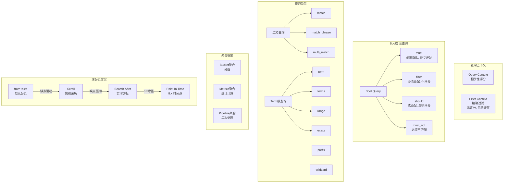

# 查询与聚合

## 概述
Elasticsearch 的 DSL（Domain Specific Language）查询语法是其核心操作接口。本模块系统讲解 Query 与 Filter 的本质区别、Bool 复合查询的组合逻辑、全文检索与精确匹配的使用场景，以及聚合分析框架和深分页问题的解决方案，帮助掌握构建复杂搜索查询的完整能力。

---

## 一、知识图谱



---

## 二、基础到进阶学习路线

- **阶段一：基础入门**：掌握 match、term、range 等基础查询，理解 Bool Query 的组合逻辑。
- **阶段二：原理深入**：理解 Query 与 Filter 的评分和缓存差异，掌握聚合分析的三级体系。
- **阶段三：实战优化**：解决深分页问题，优化复杂查询性能，精通 Pipeline 聚合。

---

## 三、核心知识详解

### 3.1 Query 上下文 vs Filter 上下文

这是 ES 中最基础也最容易混淆的概念。两者的核心区别在于**是否计算相关性评分**。

| 维度 | Query 上下文 | Filter 上下文 |
|------|-------------|---------------|
| 评分计算 | 计算 `_score`（TF-IDF / BM25） | 不计算评分，仅判断是否匹配 |
| 缓存机制 | 不缓存 | 自动缓存查询结果（BitSet） |
| 性能 | 较慢（需要评分） | 快（直接位运算） |
| 适用场景 | 全文搜索、需要排序 | 精确过滤、布尔条件、范围过滤 |
| 使用方式 | `query` 参数中直接使用 | 放在 `bool.filter` 或 `bool.must_not` 中 |

**示例对比：**

```json
// Query 上下文：搜索"Elasticsearch"，按相关性评分排序
{
  "query": {
    "match": { "title": "Elasticsearch 入门教程" }
  }
}

// Filter 上下文：筛选价格在 100-500 之间的上架商品
{
  "query": {
    "bool": {
      "filter": [
        { "term": { "status": "on_sale" } },
        { "range": { "price": { "gte": 100, "lte": 500 } } }
      ]
    }
  }
}
```

::: tip 最佳实践
能用 Filter 的场景尽量用 Filter。Filter 条件不参与评分计算，且结果会被自动缓存（BitSet），后续相同条件的查询直接复用缓存，性能极高。
:::

### 3.2 Bool Query 详解

Bool Query 是 ES 中最核心的复合查询，将多个查询条件按布尔逻辑组合。

```json
{
  "query": {
    "bool": {
      "must": [
        { "match": { "title": "Elasticsearch" } }
      ],
      "filter": [
        { "term": { "category": "database" } },
        { "range": { "price": { "gte": 50 } } }
      ],
      "should": [
        { "match": { "title": "教程" } },
        { "match": { "description": "实战" } }
      ],
      "must_not": [
        { "term": { "status": "deleted" } }
      ],
      "minimum_should_match": 1
    }
  }
}
```

| 子句 | 含义 | 评分参与 | 过滤效果 |
|------|------|----------|----------|
| `must` | 必须匹配（AND） | 参与评分 | 文档必须满足所有 must 条件 |
| `filter` | 必须匹配（AND） | 不参与评分 | 与 must 相同，但不评分，结果缓存 |
| `should` | 应该匹配（OR） | 参与评分 | 匹配越多，`_score` 越高 |
| `must_not` | 必须不匹配（NOT） | 不参与评分 | 排除条件，内部自动使用 Filter 上下文 |
| `minimum_should_match` | should 最少匹配数 | 不适用 | 控制 should 为"软 OR"还是"必须满足 N 个" |

**should 的两种行为模式：**

```json
// 模式1：Bool 中只有 should（没有 must/filter）→ 满足至少一个 should 即可
{
  "bool": {
    "should": [
      { "term": { "color": "red" } },
      { "term": { "color": "blue" } }
    ]
  }
}
// 等价于 SQL: WHERE color = 'red' OR color = 'blue'

// 模式2：Bool 中有 must + should → should 提升评分，但不强制匹配
{
  "bool": {
    "must": [
      { "term": { "category": "phone" } }
    ],
    "should": [
      { "term": { "brand": "Apple" } },
      { "term": { "brand": "Samsung" } }
    ]
  }
}
// 匹配 category=phone 且 brand=Apple 的文档得分更高
// 匹配 category=phone 但 brand 不是 Apple/Samsung 的文档也能返回（只是得分低）
```

### 3.3 全文查询（Full-Text Queries）

全文查询会对搜索词进行分词处理，然后匹配倒排索引。

**match 查询：**

```json
// 基本 match：分词后匹配
{ "match": { "title": "Elasticsearch 教程" } }
// 等价于：title 包含 "Elasticsearch" OR "教程"（默认 OR 操作符）

// match 改为 AND 操作符
{ "match": { "title": { "query": "Elasticsearch 教程", "operator": "and" } } }
// 等价于：title 同时包含 "Elasticsearch" AND "教程"

// match 设置 minimum_should_match
{ "match": { "title": { "query": "Elasticsearch 入门教程", "minimum_should_match": "75%" } } }
// 至少匹配 75% 的词条
```

**match_phrase 短语匹配：**

```json
// 要求词条按顺序出现，且位置连续（slop=0）
{ "match_phrase": { "title": "Elasticsearch 教程" } }

// 允许词条之间有间隔（slop=2）
{ "match_phrase": { "title": { "query": "Elasticsearch 教程", "slop": 2 } } }
// 可以匹配 "Elasticsearch 入门 实战 教程"（中间有2个词）
```

**multi_match 多字段匹配：**

```json
// 搜索多个字段，best_fields 策略（默认）
{
  "multi_match": {
    "query": "Elasticsearch 教程",
    "fields": ["title^3", "description", "tags"],
    "type": "best_fields"
  }
}
// title^3 表示 title 字段权重是其他字段的 3 倍
```

| 匹配类型 | 策略 | 适用场景 |
|----------|------|----------|
| `best_fields` | 取最佳匹配字段的分数 | 关键词精确匹配（搜索词短） |
| `most_fields` | 所有匹配字段分数求和 | 多字段同义词搜索 |
| `cross_fields` | 跨字段混合匹配 | 人名、地址等跨字段整体匹配 |
| `phrase` | 短语匹配 | 精确短语搜索 |
| `phrase_prefix` | 短语前缀匹配 | 搜索建议（typeahead） |

### 3.4 Term 级查询（Term-Level Queries）

Term 级查询**不进行分词**，直接将输入作为精确值匹配倒排索引。

```json
// term：精确匹配（keyword 类型或不分词的字段）
{ "term": { "status": "published" } }

// terms：匹配多个值（OR 关系）
{ "terms": { "category": ["database", "search", "monitoring"] } }

// range：范围查询
{
  "range": {
    "price": {
      "gte": 100,    // >=100
      "lte": 500,    // <=500
      "boost": 2.0
    }
  }
}

// exists：字段是否存在（非 null）
{ "exists": { "field": "email" } }

// prefix：前缀匹配
{ "prefix": { "user_id": "user_" } }

// wildcard：通配符匹配（性能较差，慎用）
{ "wildcard": { "name": "john*" } }
```

::: danger Term 查询常见陷阱
```json
// 错误：对 text 类型字段使用 term
{ "term": { "title": "Elasticsearch" } }
// text 类型字段在索引时被分词为小写 "elasticsearch"，term 查询不进行分词，直接匹配 "Elasticsearch"（大写），导致查不到！
// 正确做法：对 text 字段使用 match 查询，或使用 keyword 子字段
{ "term": { "title.keyword": "Elasticsearch" } }
```
:::

### 3.5 聚合查询（Aggregation）

ES 的聚合框架分为三级，可以嵌套组合使用：

**Bucket 聚合（分桶）：**

```json
{
  "aggs": {
    "by_category": {
      "terms": { "field": "category", "size": 10 },    // 按分类分组
      "aggs": {
        "avg_price": {
          "avg": { "field": "price" }                    // 每组内计算平均价格
        }
      }
    }
  }
}
```

**Metrics 聚合（指标计算）：**

| 聚合类型 | 说明 | 示例 |
|----------|------|------|
| `avg` | 平均值 | `{ "avg": { "field": "price" } }` |
| `sum` | 求和 | `{ "sum": { "field": "sales" } }` |
| `min` / `max` | 最小值/最大值 | `{ "max": { "field": "price" } }` |
| `stats` | 统计概要（min/max/avg/sum/count） | `{ "stats": { "field": "price" } }` |
| `extended_stats` | 扩展统计（含方差、标准差） | `{ "extended_stats": { "field": "price" } }` |
| `cardinality` | 基数估算（近似去重计数） | `{ "cardinality": { "field": "user_id" } }` |
| `percentiles` | 百分位数 | `{ "percentiles": { "field": "response_time" } }` |
| `value_count` | 计数 | `{ "value_count": { "field": "price" } }` |

**Pipeline 聚合（管道聚合）：**

```json
{
  "aggs": {
    "by_month": {
      "date_histogram": { "field": "date", "calendar_interval": "month" },
      "aggs": {
        "total_sales": { "sum": { "field": "sales" } }
      }
    },
    "avg_monthly_sales": {
      "avg_bucket": {
        "buckets_path": "by_month>total_sales"    // 对上一步的桶结果再计算平均
      }
    }
  }
}
```

| 管道聚合 | 说明 |
|----------|------|
| `avg_bucket` | 对兄弟桶的指标求平均 |
| `max_bucket` / `min_bucket` | 对兄弟桶的指标求最大/最小 |
| `sum_bucket` | 对兄弟桶的指标求和 |
| `derivative` | 计算相邻桶的差值（用于趋势分析） |
| `cumulative_sum` | 累积求和 |
| `moving_avg` | 移动平均（平滑趋势） |

### 3.6 深分页问题

ES 的 `from + size` 分页在数据量大时存在严重的性能问题。以下是四种分页方案对比：

**方案一：from + size（默认分页）**

```json
// 获取第 10001-10020 条数据
{ "from": 10000, "size": 20, "query": { "match_all": {} } }
```

::: danger 问题
ES 需要在每个分片上查询 `from + size` 条数据（10020 条），然后协调节点汇总所有分片的结果（5 分片 = 50100 条），排序后取第 10001-10020 条返回。`from` 越大，每个分片需要加载的数据越多，内存和 CPU 开销急剧增加。

**ES 默认限制 `from + size <= 10000`**（通过 `index.max_result_window` 控制）。
:::

**方案二：Scroll（快照遍历）**

```json
// 创建 Scroll 快照
POST /products/_search?scroll=5m
{
  "size": 1000,
  "query": { "match_all": {} }
}

// 后续翻页（使用 scroll_id）
POST /_search/scroll
{
  "scroll": "5m",
  "scroll_id": "DXF1ZXJ5QW5kRmV0Y2gB..."
}
```

| 优点 | 缺点 |
|------|------|
| 适合全量数据导出 | 维护快照上下文，占用资源 |
| 深度翻页无性能衰减 | 不适合实时搜索（快照是静态的） |
| 简单易用 | 需要手动清理 scroll_id |

**方案三：Search After（实时游标）**

```json
// 首次查询（按 id 排序）
POST /products/_search
{
  "size": 20,
  "query": { "match_all": {} },
  "sort": [
    { "price": "asc" },
    { "_id": "asc" }       // 必须有唯一排序字段作为 tiebreaker
  ]
}

// 翻页：传入上一页最后一条数据的 sort 值
POST /products/_search
{
  "size": 20,
  "query": { "match_all": {} },
  "search_after": [299.99, "prod_12345"],      // 上一页最后一条的 sort 值
  "sort": [
    { "price": "asc" },
    { "_id": "asc" }
  ]
}
```

| 优点 | 缺点 |
|------|------|
| 实时数据，无状态开销 | 不能跳页（只能顺序翻页） |
| 深度翻页性能稳定 | 需要业务层维护游标 |
| 适合移动端"加载更多" | 需要排序字段值唯一 |

**方案四：Point In Time（PIT，ES 8.x）**

```json
// 创建 PIT
POST /products/_pit?keep_alive=5m

// 使用 PIT + Search After
GET /_search
{
  "size": 20,
  "query": { "match_all": {} },
  "pit": { "id": "46ToAwMDaWR5...", "keep_alive": "5m" },
  "sort": [{ "@timestamp": "asc" }],
  "search_after": [1699000000000]
}
```

PIT 是 Search After 的增强版，在指定时间点内保持数据一致性快照，避免索引变化导致排序错乱。

**选型建议：**

| 场景 | 推荐方案 |
|------|---------|
| 前台分页（前几页） | from + size |
| 移动端"加载更多" | Search After |
| 全量数据导出 | Scroll |
| 高并发实时搜索 | Search After + PIT |
| 深度跳页（第 100 页） | 重新设计产品（不提供深度跳页） |

### 3.7 批量操作

**mget（批量获取）：**

```json
// 根据 ID 批量获取文档
POST /_mget
{
  "docs": [
    { "_index": "products", "_id": "1" },
    { "_index": "products", "_id": "2" },
    { "_index": "products", "_id": "3" }
  ]
}
```

**bulk（批量写入）：**

```json
POST /_bulk
{ "index": { "_index": "products", "_id": "1" } }
{ "title": "iPhone 15", "price": 6999 }
{ "update": { "_index": "products", "_id": "2" } }
{ "doc": { "price": 5999 } }
{ "delete": { "_index": "products", "_id": "3" } }
```

::: tip Bulk 最佳实践
- 推荐每批次 5-15MB 数据量，不是文档数越多越好
- 超大批次会导致内存压力和超时
- 多线程并发送 bulk 比单线程大数据包更高效
- 异步 bulk 比同步 bulk 吞吐量高 10 倍以上
:::

---

## 四、经典应用场景与解决方案

### 场景：电商商品多维度搜索与聚合分析

**问题背景**
电商平台需要支持用户在搜索结果页同时看到：按品牌/分类/价格区间的筛选条件、每个筛选条件下的商品数量（Facet 计数）、以及按销量/价格/评分的排序。

**完整方案**

```json
{
  "query": {
    "bool": {
      "must": [
        { "multi_match": {
            "query": "无线蓝牙耳机",
            "fields": ["title^3", "brand^2", "description"],
            "type": "best_fields"
        }}
      ],
      "filter": [
        { "term": { "is_on_sale": true } },
        { "range": { "price": { "gte": 50, "lte": 1000 } } }
      ]
    }
  },
  "sort": [
    { "sales_volume": "desc" },
    { "_score": "desc" }
  ],
  "from": 0,
  "size": 20,
  "aggs": {
    "brand_facet": {
      "terms": { "field": "brand.keyword", "size": 20, "order": { "_count": "desc" } }
    },
    "category_facet": {
      "terms": { "field": "category_id", "size": 10 }
    },
    "price_ranges": {
      "range": {
        "field": "price",
        "ranges": [
          { "key": "0-200", "from": 0, "to": 200 },
          { "key": "200-500", "from": 200, "to": 500 },
          { "key": "500-1000", "from": 500, "to": 1000 },
          { "key": "1000+", "from": 1000 }
        ]
      }
    },
    "price_stats": {
      "stats": { "field": "price" }
    }
  }
}
```

**实现效果：**
- 搜索接口一次请求同时返回搜索结果 + 聚合统计（品牌分布、分类分布、价格区间分布）
- 前端根据聚合结果渲染筛选面板（每个筛选项显示数量）
- 用户选择筛选条件后，将条件转为 `filter` 子句（不评分，利用缓存），性能不受影响
- 排序优先按销量，销量相同按相关性评分

---

## 五、高频面试题

### Q1: Query 和 Filter 的区别是什么？什么时候用哪个？

::: details 答案
Query 和 Filter 是 ES 中两种不同的搜索上下文，核心区别在于**是否计算相关性评分**。

**Query 上下文：**
- 计算 `_score` 相关性评分（基于 BM25 算法）
- 评分结果用于排序，越相关的文档排在越前面
- 不缓存查询结果
- 适用于全文搜索、模糊匹配等需要排序的场景

**Filter 上下文：**
- 只判断是否匹配（YES/NO），不计算评分
- 结果自动缓存为 BitSet（位图），后续相同 Filter 直接复用缓存
- 性能远高于 Query 上下文
- 适用于精确过滤、范围查询、布尔条件

**使用选择：**
- 全文搜索（match）→ Query 上下文
- 精确过滤（term、range、exists）→ Filter 上下文
- 需要排序的筛选 → Query 上下文
- 不影响排序的筛选 → Filter 上下文

**性能影响：**
在 Bool Query 中，Filter 子句先执行（利用缓存），缩小文档范围；然后 Must 子句在缩小后的范围内计算评分。这种"先过滤后评分"的执行顺序使 Filter 能够大幅减少 Must 的计算量。

**最佳实践：** 能用 Filter 就用 Filter。大多数业务场景中，精确过滤条件（如状态、分类、价格区间）都不需要参与评分，放在 Filter 中性能最优。
:::

### Q2: Bool Query 中各子句（must / filter / should / must_not）的含义是什么？

::: details 答案
Bool Query 是 ES 中最核心的复合查询，将多个查询条件按布尔逻辑组合：

**must（必须匹配，AND 逻辑）：**
- 文档必须满足所有 must 条件，否则不返回
- 参与评分计算，匹配的文档获得相关性分数
- 类比 SQL：`WHERE condition1 AND condition2`

**filter（必须匹配，AND 逻辑，不评分）：**
- 与 must 相同，文档必须满足所有条件
- 不参与评分计算，结果自动缓存（BitSet）
- 类比 SQL：`WHERE condition1 AND condition2`（但不影响 ORDER BY score）

**should（应该匹配，OR 逻辑）：**
- 有两种行为模式：
  - 只有 should 时：满足至少一个 should 即可（`minimum_should_match` 默认为 1）
  - 有 must/filter 时：should 不强制匹配，但匹配的文档得分更高
- 参与评分计算
- 类比 SQL：`WHERE condition1 OR condition2`（或 `ORDER BY` 的加分项）

**must_not（必须不匹配，NOT 逻辑）：**
- 文档必须不满足所有条件
- 不参与评分，内部使用 Filter 上下文
- 类比 SQL：`WHERE NOT (condition1)`

**minimum_should_match：**
控制 should 的严格程度，可以是数字（如 `2`）或百分比（如 `"75%"`）。当 should 条件较多时，设置此参数可避免"匹配一个就返回"的过低精度。
:::

### Q3: 深分页怎么解决？Scroll 和 Search After 有什么区别？

::: details 答案
ES 的 `from + size` 分页在深度翻页时存在严重性能问题。ES 默认限制 `from + size <= 10000`（`index.max_result_window`）。解决方案如下：

**Scroll（快照遍历）：**
- 原理：创建数据快照（Scroll Context），后续翻页基于快照进行
- 优点：任何时候翻页性能一致，不受深度影响
- 缺点：数据是创建 Scroll 时的快照，不反映后续变更；占用服务端资源（active scroll context）；不能跳页；需要手动清理
- 适用：全量数据导出、批量数据处理

**Search After（实时游标）：**
- 原理：传入上一页最后一条数据的排序值，ES 从该位置之后开始查询
- 优点：实时数据（无快照），无状态开销，深度翻页性能稳定
- 缺点：不能跳页（只能顺序翻页）；必须使用排序字段，且排序值必须唯一（需要 tiebreaker 字段如 `_id`）
- 适用：移动端"加载更多"、瀑布流、实时搜索

**核心区别：**

| 维度 | Scroll | Search After |
|------|--------|--------------|
| 数据实时性 | 静态快照 | 实时 |
| 状态开销 | 维护 Scroll Context | 无状态 |
| 跳页能力 | 不支持 | 不支持 |
| 排序要求 | 不强制 | 必须有排序，且排序值唯一 |
| 资源占用 | 高（需手动清理） | 低 |

**PIT（Point In Time，ES 8.x）：**
PIT 是 Search After 的增强版，提供轻量级数据一致性视图，避免索引变化导致的排序错乱问题。比 Scroll 更轻量，比 Search After 更一致。

**终极建议：** 如果产品需要深度跳页（如"第 100 页"），建议重新设计交互——使用"无限滚动"或"加载更多"替代传统分页。
:::

### Q4: ES 的聚合类型有哪些？Bucket 和 Metrics 聚合的区别是什么？

::: details 答案
ES 聚合框架分为三级：

**1. Bucket 聚合（分桶）：**
将文档按条件分组，每个桶代表一组文档。常见类型：
- `terms`：按字段值分组（类似 SQL 的 GROUP BY）
- `range`：按数值范围分组
- `date_range`：按日期范围分组
- `date_histogram`：按时间间隔分组（固定间隔，如按天/小时）
- `histogram`：按数值间隔分组
- `filter` / `filters`：按条件将文档分配到不同桶
- `geohash_grid`：地理坐标分组

**2. Metrics 聚合（指标计算）：**
对文档集合进行数学计算，返回单个值。常见类型：
- 基础统计：`avg`、`sum`、`min`、`max`、`value_count`
- 统计概要：`stats`（同时返回 min/max/avg/sum/count）、`extended_stats`（含方差、标准差）
- 近似计算：`cardinality`（去重计数，基于 HyperLogLog++）
- 分位数：`percentiles`、`percentile_ranks`
- 地理位置：`geo_bounds`、`geo_centroid`
- 矩阵：`matrix_stats`

**3. Pipeline 聚合（管道聚合）：**
对已有聚合结果进行二次计算。常见类型：
- `avg_bucket`、`max_bucket`、`min_bucket`、`sum_bucket`：兄弟桶的统计
- `derivative`：相邻桶的差值（用于趋势分析）
- `cumulative_sum`：累积求和
- `moving_avg`：移动平均
- `bucket_script`：自定义脚本计算

**Bucket vs Metrics 区别：**
- Bucket 聚合返回"多个桶"（类似 GROUP BY 的分组），可以嵌套 Bucket 或 Metrics
- Metrics 聚合返回"单个数值"，通常嵌套在 Bucket 内部
- 类比 SQL：Bucket = GROUP BY，Metrics = COUNT/SUM/AVG，Pipeline = Window Function
:::

### Q5: match 查询和 term 查询的区别？什么时候用哪一个？

::: details 答案
**核心区别：是否分词**

**match 查询（全文查询）：**
- 对搜索词进行分词处理
- 将分词后的每个词条在倒排索引中查找
- 默认 OR 操作符（匹配任意一个词条即返回）
- 计算相关性评分（`_score`）
- 适用于 text 类型字段的全文搜索

**term 查询（精确查询）：**
- 不对搜索词进行分词，直接作为精确值匹配
- 在倒排索引中查找完全匹配的 Term
- 不计算相关性评分（但返回 `_score` 为常量 1.0）
- 适用于 keyword 类型、数字、日期等精确值字段

**典型错误：**
```json
// 错误：对 text 字段使用 term 查询
{ "term": { "title": "Elasticsearch" } }
// text 字段在索引时被分词为小写 "elasticsearch"
// term 查询搜索 "Elasticsearch"（大写，未分词），找不到匹配！

// 正确：对 text 字段使用 match 查询
{ "match": { "title": "Elasticsearch" } }
// match 会对搜索词进行分词、小写化，正确匹配倒排索引中的 "elasticsearch"
```

**选型指南：**
- 全文搜索（text 字段）→ match、match_phrase、multi_match
- 精确匹配（keyword 字段）→ term、terms
- 范围查询（数字/日期）→ range
- 判断字段是否存在 → exists
- 前缀匹配 → prefix（也可以用 match_phrase_prefix 对 text 字段）
:::

### Q6: Scroll 的底层原理是什么？为什么不适合实时搜索？

::: details 答案
**Scroll 底层原理：**

1. 当客户端发起 Scroll 请求时，ES 创建一个 Scroll Context（搜索上下文快照）
2. 快照包含当前时刻所有分片上的数据状态（Segment 快照）
3. 后续每次翻页请求（`/_search/scroll`），ES 基于同一个快照继续遍历
4. Scroll Context 有一个 `keep_alive` 时间（如 5m），每次翻页重置计时器
5. 超时未翻页，Scroll Context 自动释放

**快照机制：**
Scroll 创建时，ES 会锁定创建时刻已存在的 Segment。后续写入的新 Segment 不被 Scroll 快照包含。已删除的文档（`.del` 标记）在 Scroll 快照中仍然可见。

**为什么不适合实时搜索：**

1. **数据不是实时的**：Scroll 快照是静态的，创建后的数据变更（新增、修改、删除）不会反映在 Scroll 结果中。

2. **资源占用**：每个活跃的 Scroll Context 都占用堆内存和文件句柄。大量 Scroll 并发会严重消耗集群资源。

3. **不参与排序**：Scroll 主要用于全量遍历，不关心排序，不适合需要按相关性排名的用户搜索。

4. **无法跳页**：Scroll 只能顺序向前，无法实现"跳转到第 5 页"的交互。

**适用场景：**
- 数据导出（全量或大批量）
- 批量数据迁移/重建索引
- 后台批处理任务

**替代方案：**
- 前台用户搜索 → Search After（实时游标）
- 8.x 推荐 → Search After + PIT（Point In Time）
:::

---

## 六、选型指南

- **适用场景**：全文搜索（Match）、精确过滤（Term + Filter）、多维聚合分析（Bucket + Metrics）、实时搜索建议（Suggest）、地理位置搜索（Geo）。
- **不适用场景**：复杂 JOIN 查询（ES 不支持跨索引 JOIN，需用 Nested 或 Parent-Child 替代）；事务性写入（ES 不支持 ACID）；极高频更新（更新 = 删除 + 新增，代价高）。
- **配置建议**：`index.max_result_window` 根据业务需求调整（默认 10000）；`search.default_search_timeout` 设置全局超时；复杂聚合查询使用 `pre_filter_shard_size` 控制分片级聚合精度。

---

## 相关文档

- [ES 核心概念与架构](./index)
- [倒排索引与分词](./inverted-index)
- [集群架构](./cluster)
- [性能优化](./performance)
- [ES 选型指南](./selection)
- [返回数据库目录](../index)