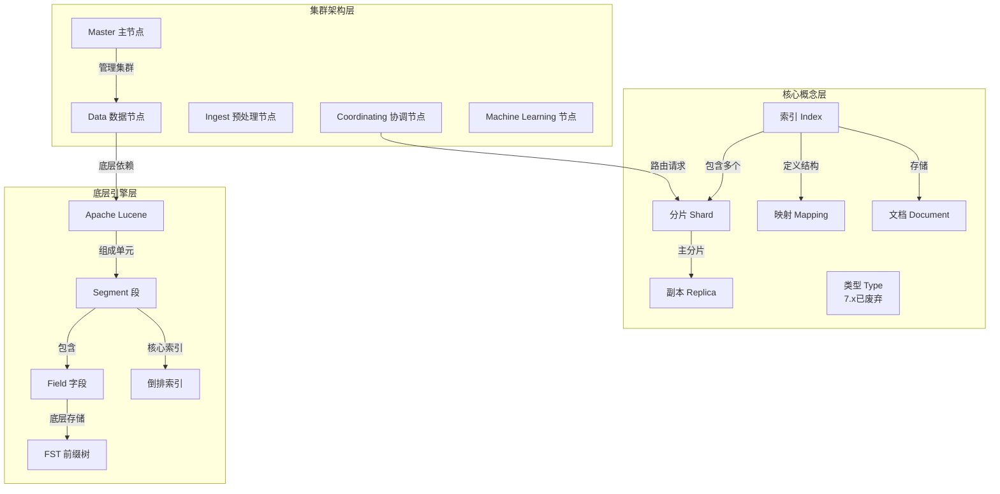

# Elasticsearch 核心概念与架构

## 概述
本模块系统梳理 Elasticsearch 的核心概念、底层架构和关键设计思想。学习目标是深入理解 ES 的索引-文档模型、分布式集群角色分工，以及倒排索引为何能实现近实时搜索，为后续深入学习打下坚实基础。

---

## 一、知识图谱



---

## 二、基础到进阶学习路线

- **阶段一：基础入门**：理解 Index / Document / Mapping 的概念，学会基本的 CRUD 和简单全文搜索。
- **阶段二：原理深入**：掌握倒排索引原理、Segment 和 Translog 机制、集群角色与选举。
- **阶段三：实战优化**：集群规划、分片策略、读写流程优化、生产环境调优。

---

## 三、核心知识详解

### 3.1 基础概念

Elasticsearch 是基于 Apache Lucene 构建的分布式搜索与分析引擎，核心数据模型如下：

| 概念 | ES 类比 | MySQL 类比 | 说明 |
|------|---------|------------|------|
| Index | 索引 | Database | 逻辑命名空间，存储一类文档 |
| Type | 类型（7.x 废弃） | Table | 同一索引下的逻辑分组，7.x 后一个索引只能有一个 `_doc` |
| Document | 文档 | Row | JSON 格式的最小数据单元 |
| Mapping | 映射 | Schema | 定义文档字段的类型和索引规则 |
| Shard | 分片 | 分表 | 数据水平切分单元，每个分片是一个完整的 Lucene 实例 |
| Replica | 副本 | 从库 | 分片的冗余副本，提供高可用和读负载分摊 |

::: warning Type 弃用说明
从 ES 5.6 开始逐步废弃 `_type` 概念，ES 7.x 中每个索引只能有一个 `_doc` 类型，ES 8.x 中完全移除。不要在新项目中设计多 Type 的索引结构。
:::

### 3.2 为什么 Elasticsearch 搜索快

Elasticsearch 的搜索性能来自以下几个核心设计：

**（1）倒排索引（Inverted Index）**
传统数据库使用正向索引（根据 ID 找数据），ES 使用倒排索引（根据 Term 找文档 ID 列表）。用户输入关键词后，直接从 Term Dictionary 中定位到 Posting List，无需全表扫描。

**（2）分段存储（Segment）**
Lucene 将索引数据写入不可变的 Segment 文件中。Segment 一旦写入就不再修改，删除操作通过标记实现（`.del` 文件），更新操作本质是删除 + 新增。不可变性带来了极大的并发读优势——没有锁竞争。

**（3）FST 前缀压缩**
Term Dictionary 使用 Finite State Transducer（FST）数据结构存储，既能高效前缀查询，又比 HashMap 节省大量内存。FST 支持公共前缀压缩，是 ES 内存效率高的关键。

**（4）跳表与 BitSet**
Posting List 内部使用 Skip List 进行跳表加速，多 Term 的 AND/OR 操作通过 BitSet 的位运算完成，时间复杂度极低。

::: tip 关键词
倒排索引 + 不可变 Segment + FST 内存压缩 = ES 搜索快的核心原因
:::

### 3.3 集群角色

ES 集群中的节点可以承担不同角色，通过 `elasticsearch.yml` 中的 `node.roles` 配置：

```yaml
# elasticsearch.yml 角色配置示例
node.roles: [data, master, ingest, ml]
```

| 角色 | 职责 | 资源需求 | 关键说明 |
|------|------|----------|----------|
| Master | 集群管理（索引创建/删除、分片分配、节点发现） | 轻量，低 CPU/内存 | 仅一个活跃 Master，其余为候选 |
| Data | 数据存储和搜索计算 | 高 IO/CPU/内存 | 核心角色，真正的"干活"节点 |
| Data Content | 存储搜索类数据（如日志、文章） | 高 IO/磁盘 | 8.x 新增，替代通用 Data 角色 |
| Data Hot/Warm/Cold/Frozen | 分层存储角色 | 按层级不同 | 用于冷热分离架构 |
| Ingest | 文档预处理管道 | 中等 CPU | 在索引前对文档进行转换处理 |
| Coordinating | 请求路由和结果合并 | 中低 | 默认所有节点都是协调节点 |
| ML | 机器学习作业 | 高 CPU | 运行异常检测、预测等 ML 任务 |

**8.x 角色变化要点：**

::: info ES 8.x 角色命名
ES 8.x 使用 `node.roles` 替代了旧的 `node.master` / `node.data` 配置。如 `data` 被细分为 `data_content`、`data_hot`、`data_warm`、`data_cold`、`data_frozen`。
:::

### 3.4 Lucene 简介

Lucene 是 Java 编写的全文搜索引擎库，是 ES 的底层核心。关键概念：

```
Lucene Index
  └── Segment（不可变，写入后只读）
        ├── .tim（Term Dictionary，使用 FST 结构）
        ├── .doc（Posting List，使用 FOR/RBM 压缩）
        ├── .pos（位置信息，用于短语查询）
        ├── .pay（Payload 和偏移量）
        ├── .fdt（存储字段原始值）
        ├── .fdx（字段索引）
        ├── .dvm / .dvd（Doc Values，用于排序聚合）
        ├── .nvd / .nvm（Norms 归一化因子）
        └── .del（标记删除的文档）
```

### 3.5 ES vs Solr 对比

| 维度 | Elasticsearch | Solr |
|------|--------------|------|
| 开发语言 | Java | Java |
| 底层引擎 | Lucene | Lucene |
| API 风格 | RESTful JSON | RESTful JSON / XML |
| 分布式 | 天然内置，配置简便 | 依赖 ZooKeeper |
| 实时搜索 | 近实时（1s refresh） | 近实时（soft commit） |
| 集群管理 | 内置 Zen Discovery / Raft | 依赖 ZooKeeper 集群 |
| 社区生态 | 更活跃，ELK Stack 生态强大 | 较传统，企业集成成熟 |
| 分片管理 | 自动分片分配和再平衡 | 需要手动管理 |
| 聚合分析 | DSL Aggregation 强大 | Facet + JSON Facet |
| 适用场景 | 日志分析、全文搜索、实时分析 | 企业搜索、文本分析 |

### 3.6 ES 发展历程

| 版本 | 发布时间 | 关键特性 |
|------|----------|----------|
| 1.x | 2014 | 基础搜索、聚合框架 |
| 2.x | 2015 | Pipeline Aggregation、更好的压缩 |
| 5.x | 2016 | 性能大幅提升、Ingest Node |
| 6.x | 2017 | 索引生命周期管理、SQL 支持 |
| 7.x | 2019 | 默认 1 分片、单 Type、Zen2 基于 Raft、CCR |
| 8.x | 2022 | 无密码安全默认、KNN 向量搜索、TSDS 时间序列数据流 |

---

## 四、经典应用场景与解决方案

### 场景：电商商品搜索系统

**问题背景**
某电商平台需要支持千万级商品的实时搜索，用户通过关键词、价格区间、品牌、分类等条件组合查询商品，要求响应时间在 100ms 以内。

**完整方案**

```
架构设计：
┌─────────────┐     ┌──────────────────┐     ┌───────────────────┐
│  搜索入口    │ ──> │  ES 集群          │ ──> │  商品索引          │
│  (Nginx)    │     │  3 Master        │     │  products          │
└─────────────┘     │  12 Data (Hot)   │     │  5 主分片 + 1 副本  │
                     │  6 Data (Warm)  │     └───────────────────┘
                     └──────────────────┘
```

**Mapping 设计：**

```json
{
  "mappings": {
    "properties": {
      "product_id": { "type": "keyword" },
      "title": {
        "type": "text",
        "analyzer": "ik_max_word",
        "search_analyzer": "ik_smart"
      },
      "brand": { "type": "keyword" },
      "category_id": { "type": "long" },
      "price": { "type": "scaled_float", "scaling_factor": 100 },
      "sales_volume": { "type": "integer" },
      "rating": { "type": "float" },
      "tags": { "type": "keyword" },
      "create_time": { "type": "date" },
      "is_on_sale": { "type": "boolean" }
    }
  },
  "settings": {
    "number_of_shards": 5,
    "number_of_replicas": 1,
    "refresh_interval": "5s"
  }
}
```

**查询示例 - 多条件组合搜索：**

```json
{
  "query": {
    "bool": {
      "must": [
        { "match": { "title": "无线蓝牙耳机" } }
      ],
      "filter": [
        { "term": { "is_on_sale": true } },
        { "range": { "price": { "gte": 50, "lte": 500 } } },
        { "terms": { "brand": ["Sony", "Bose", "Apple"] } }
      ]
    }
  },
  "sort": [
    { "sales_volume": "desc" },
    { "_score": "desc" }
  ],
  "from": 0,
  "size": 20
}
```

**优化要点：**
- 使用 `filter` 上下文避免评分计算开销
- `keyword` 类型用于精确匹配（brand、tags）
- `scaled_float` 处理价格，避免浮点精度问题
- 冷数据（下架商品）迁移到 Warm 节点
- 设置合理的 `refresh_interval` 平衡实时性与写入性能

---

## 五、高频面试题

### Q1: Elasticsearch 搜索为什么快？底层原理是什么？

::: details 答案
ES 搜索快的核心原因有三点：

**1. 倒排索引（Inverted Index）**
传统数据库是正向索引——根据行 ID 找到对应字段值。倒排索引反过来——根据 Term（词条）找到包含它的文档 ID 列表（Posting List）。搜索时直接通过 Term 定位文档，时间复杂度从 O(n) 降到 O(1)（Term Dictionary 查找）。

**2. 不可变 Segment + 无锁并发**
Lucene 的索引数据存储在不可变的 Segment 中。写入新数据时生成新的 Segment，已有 Segment 不会被修改。删除只是打标记（`.del` 文件）。这种不可变性使得：
- 读操作完全无锁，可以无限并发
- 操作系统文件缓存（Page Cache）极其高效
- 写入能顺序写盘，不破坏已有数据

**3. FST 内存压缩**
Term Dictionary 使用 FST（Finite State Transducer）数据结构存储在内存中。FST 利用公共前缀极大压缩内存占用，同时支持 O(len) 的前缀搜索和范围扫描，比 HashMap 节省 10-20 倍内存。

**4. 跳表加速合并**
多个 Term 的 Posting List 进行 AND/OR 操作时，利用 Skip List 跳跃式前进，避免逐一遍历。

综合来看：倒排索引提供 O(1) 的 Term 定位，不可变 Segment 提供无锁高并发读，FST 压缩让巨大索引能够常驻内存，这是 ES 快的本质。
:::

### Q2: Elasticsearch 集群有哪些角色？各自职责是什么？

::: details 答案
ES 集群节点角色分为以下几类：

**Master（主节点）**
负责集群级管理：索引创建/删除、分片分配、节点加入/离开、集群状态维护。Master 节点本身不存储数据，对 CPU 和内存要求较低。集群中只有一个活跃 Master，其余 Master 候选节点通过选举产生。

**Data（数据节点）**
执行数据相关操作：文档 CRUD、搜索、聚合。这是真正的"工作节点"。ES 8.x 将 Data 角色细分为：
- `data_content`：通用搜索数据
- `data_hot`：高频访问的热数据（SSD）
- `data_warm`：不常更新的温数据（SSD/HDD）
- `data_cold`：很少访问的冷数据（HDD）
- `data_frozen`：几乎不访问的冻结数据（对象存储）

**Ingest（预处理节点）**
在文档索引前执行预处理 Pipeline（字段转换、脚本处理、Grok 解析等），相当于一个轻量级 ETL 层。

**Coordinating（协调节点）**
路由客户端请求到对应分片，合并各分片的返回结果。默认所有节点都是协调节点，但可以专门配置纯协调节点来分担负载。

**ML（机器学习节点）**
运行 Elasticsearch 内置的机器学习任务：异常检测、预测、NLP 等。需要较高的 CPU 资源。

此外还有 **Remote Cluster Client**（跨集群搜索）、**Transform**（数据转换）等特殊角色。
:::

### Q3: Elasticsearch 中索引（Index）和文档（Document）是什么关系？

::: details 答案
在 Elasticsearch 中，**Index（索引）**是逻辑命名空间，用于组织和管理具有相同特征的 **Document（文档）**。

**类比关系数据库：**
- Index 相当于 Database（数据库）
- Document 相当于 Row（行记录）
- Mapping 相当于 Schema（表结构定义）

**物理层面的关系：**
一个 Index 由多个 Shard（分片）组成，每个 Shard 是一个完整的 Lucene 索引实例。Document 被路由到特定的 Shard 中存储，路由规则默认为 `_routing = _id`，通过 `hash(_routing) % number_of_shards` 确定目标分片。

**核心区别：**
- Index 是查询和操作的作用域（search / index / delete 等操作针对 Index 执行）
- Document 是数据存储的最小单元，以 JSON 格式表示
- 同一个 Index 下的所有 Document 共享 Mapping 和 Setting 配置
- ES 7.x 起一个 Index 只能有一个 Type（`_doc`），8.x 完全移除 Type 概念，Index 与 Document 变成纯粹的一对多关系
:::

### Q4: Elasticsearch 和 Solr 的区别是什么？如何选型？

::: details 答案
ES 和 Solr 的底层都是 Apache Lucene，但设计理念和工程实现有显著差异：

**核心差异：**

1. **分布式架构**：ES 天然支持分布式集群，分片机制和集群协调内置在核心中；Solr 依赖 ZooKeeper 实现分布式协调，配置和运维复杂度更高。

2. **实时搜索**：两者都支持近实时搜索，但 ES 的 refresh 机制默认 1s，更加平滑；Solr 的 soft commit 需要更谨慎的配置。

3. **聚合能力**：ES 的 Aggregation 框架更灵活（Bucket、Metrics、Pipeline 三级体系），能够嵌套任意层；Solr 的 Facet 和 JSON Facet 功能较弱。

4. **生态系统**：ES 有完整的 ELK（Elasticsearch + Logstash + Kibana）技术栈，覆盖数据采集、存储、分析、可视化全链路；Solr 更偏向单一搜索引擎角色。

5. **社区活跃度**：ES 社区更活跃，GitHub Star 数远超 Solr，插件和文档更丰富。

**选型建议：**
- 选择 ES：构建日志分析系统（ELK）、实时搜索中心、需要弹性伸缩的搜索场景、Kubernetes 云原生部署。
- 选择 Solr：传统企业内网搜索、需要 XML/SolrJ 接口、已有 Solr 技术积累的团队。
:::

### Q5: Lucene 和 Elasticsearch 的关系是什么？

::: details 答案
**Lucene 是 Elasticsearch 的底层搜索引擎库**，可以理解为：

- **Lucene**：Java 搜索引擎库，提供全文索引（倒排索引）、分词、查询、排序等核心能力。但它只是一个 JAR 包，没有分布式、高可用、REST API 等功能。
- **Elasticsearch**：在 Lucene 之上构建的分布式搜索服务器，封装了 Lucene 的复杂性，提供了 RESTful API、分布式集群管理、分片/副本、实时聚合、安全认证等企业级功能。

**类比关系：**
Lucene 之于 ES，类似于存储引擎（如 InnoDB）之于 MySQL。你通常不会直接操作 Lucene 的 API，而是通过 ES 的 DSL 进行交互。

**ES 对 Lucene 的增强：**
1. 分布式分片：将 Index 拆分为多个 Shard，每个 Shard 是一个独立的 Lucene 实例，分布在多台机器上。
2. 副本机制：每个 Shard 可以有多个 Replica，提供故障转移和读负载均衡。
3. 集群协调：节点发现、Master 选举、分片分配和再平衡。
4. REST/JSON API：隐藏 Lucene 的 Java API 复杂性。
5. 聚合框架：基于 Lucene 的 Doc Values 实现高性能分组和统计。
6. 近实时搜索：定期 refresh 使新写入的文档可搜索。
:::

### Q6: Elasticsearch 8.x 相比 7.x 有哪些重要变化？

::: details 答案
ES 8.x 的主要变化：

1. **安全默认开启**：8.x 启动时自动配置 TLS 和密码，不再需要手动配置 X-Pack Security。
2. **向量搜索**：原生支持 kNN（K-Nearest Neighbor）向量搜索，适合向量相似性检索场景。
3. **TSDS（Time Series Data Stream）**：专门为时序数据优化的数据流，自动按时间滚动索引，配合 Downsampling 降采样减少存储。
4. **角色细化**：Data 角色细分为 `data_content`、`data_hot`、`data_warm`、`data_cold`、`data_frozen`，支持更精细的冷热分层。
5. **PyTorch 模型集成**：支持加载 PyTorch NLP 模型进行推理。
6. **移除 Type**：完全移除 `_type` 概念，废弃相关 API。
7. **新 HTTP 客户端**：Java API Client 替代 High Level REST Client。
8. **存储节省**：`match_only_text` 字段类型（不存储 Positions，节省空间）、合成 `_source` 等。
:::

---

## 六、选型指南

- **适用场景**：全文搜索、日志分析（ELK Stack）、APM 可观测性、实时聚合分析、商品/文章搜索引擎、安全分析（SIEM）。
- **不适用场景**：需要 ACID 事务的 OLTP 场景（如订单扣库存）、频繁更新的数据（ES 更新 = 删除 + 新增，代价较高）、存储超大二进制文件（Blob/Base64 会严重拖慢索引）。
- **配置建议**：生产环境至少 3 个 Master 候选节点；Data 节点内存不超过 32GB（JVM 堆 < 31GB 以使用压缩指针）；SSD 是强制要求，不要用 HDD 跑热数据。

---

## 相关文档

- [倒排索引与分词](./inverted-index)
- [查询与聚合](./dsl-query)
- [集群架构](./cluster)
- [性能优化](./performance)
- [ES 选型指南](./selection)
- [返回数据库目录](../index)